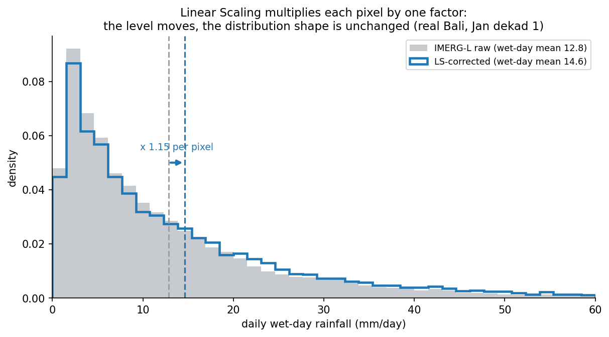

Most of what I have written here this year has been about the elaborate parts: fitting distributions, grafting tails, disaggregating parameters. Closing the year on the opposite, because it is the piece I keep coming back to and the one I nearly skipped.

Linear scaling is one multiplication.

## The whole method

For each ten-day window and each grid cell, take the long-term mean of the reference and the long-term mean of the satellite over all matching days, and divide one by the other:

$$
k_{i,j,d} = \frac{\overline{P}^{\,\text{CPC}}_{i,j,d}}{\overline{P}^{\,\text{IMERG}}_{i,j,d}}
$$

Then multiply every daily satellite value in that cell and that window by that factor. That is the entire correction.

If the satellite is running 15% dry in a particular cell in the first dekad of January, every January-first-dekad day in that cell gets multiplied by 1.15. Done.



The figure is the honest summary. The two histograms are the same histogram, moved. Nothing has been reshaped.

## What it cannot do

Everything I spent the year on, basically.

It cannot fix the shape of the distribution. If the satellite produces too many drizzle days and not enough heavy ones, multiplying by a constant gives you too many slightly-wetter drizzle days and still not enough heavy ones.

It cannot fix the tail. Scaling a tail that decays too fast gives you a tail that decays too fast, shifted right.

It cannot fix wet-day frequency at all. Multiplication cannot turn a wet day dry or a dry day wet, so if the satellite rains on the wrong number of days, it still will afterwards.

## Why it goes first anyway

Three reasons, and the first is the one that took me longest to respect.

**It is the baseline that makes everything else meaningful.** A quantile-mapped, tail-grafted, parameter-disaggregated correction that beats the raw satellite has proven nothing. Of course it beats the raw satellite. The question is whether it beats one multiplication, and if it does not, then all that machinery is decoration and I should know that before I build more of it.

**For some uses it is genuinely sufficient.** If what you need is a seasonal total or a monthly climatology, the shape of the daily distribution mostly integrates away, and the mean is the thing that matters. In that case linear scaling gets you most of the available benefit for a fraction of the complexity and none of the extrapolation risk.

**You can look at it.** The correction is one number per cell per dekad. I can map those numbers. If a cell has a factor of 8.3, something is wrong: either the satellite is nearly blind there or the reference is inventing rain, and either way I want to know before that cell goes anywhere near a quantile mapping. A field of scale factors is a diagnostic in a way that a field of fitted shape parameters is not.

## The one place it bites

Dividing by a mean means occasionally dividing by zero. In a cell where the satellite reports no rain at all across every matching day of a dekad, the denominator is zero and the factor is undefined.

The guard is to fall back to a factor of 1, leaving the field untouched:

```python
ls_scale_factor = xr.where(imerg_mean != 0, cpc_mean / imerg_mean, 1)
```

Which is the right behaviour, and is also a small confession. In exactly those cells, where the satellite saw nothing and the reference says otherwise, the correction gives up and passes the zero through. Multiplication has no way to create rain from nothing, so a cell the satellite never sees stays dry no matter how wet the reference thinks it is.

That is a real limitation and it is not fixable at this stage. It needs something that can add rather than scale, which is a different kind of method entirely.

## Where this leaves the year

Looking back at what I have written since February, the shape of it is clearer than it felt at the time. Work out where the rain comes from and why it is hard to measure. Work out what you are measuring it against. Pick a time window. Fit a distribution without letting one day ruin it. Handle the resolution mismatch. Handle the tail. Work out how to score any of it.

None of that is the correction. All of it is the scaffolding a correction needs before it can be judged, and I underestimated how much of the work that would turn out to be.

Next year is for the part where a model gets involved, and for finding out whether it earns its place against one multiplication.

## The code

Linear scaling has no function of its own. It is the first twenty lines of the correction, before the quantile mapping loop starts, which is a reasonable indication of how much of the machinery it needs.

::: {.callout-note collapse="true" title="Python - lseqm, from src/bias_correction.py. Linear scaling is the mean-ratio block near the top"}
```python
def lseqm(
        imerg_ds,
        cpc_ds,
        month,
        dekad_start_day,
        dekad_end_day,
        save_ls_result=True,
        save_lseqm_result=True,
        month_str=None,
        dekad_str=None,
        ls_corrected_precip_path=None,
        lseqm_corrected_precip_path=None,
        cpc_native_ds=None
    ):
    """
    Apply Linear Scaling (LS) and Empirical Quantile Mapping (EQM) with GPD tail
    adjustment for bias correction of daily precipitation data, using data aggregated
    across years for the specified dekad.

    This is Step 1 of the two-step workflow. The returned LSEQM result and CPC dekad
    data can be passed to train_bias_correction_model() and apply_deeplearning_model()
    for the optional DL refinement (Step 2).

    Parameters:
    ----------
    imerg_ds : xarray.Dataset
        IMERG precipitation dataset with dimensions ('time', 'lat', 'lon').
    cpc_ds : xarray.Dataset
        CPC precipitation dataset with dimensions ('time', 'lat', 'lon'),
        already aligned (reindexed) to the IMERG grid.
    month : int
        The month number (1-12) for which the dekad is specified.
    dekad_start_day : int
        Start day of the dekad (e.g., 1, 11, 21).
    dekad_end_day : int
        End day of the dekad (e.g., 10, 20, last day of month).
    save_ls_result : bool, optional
        If True, saves the Linear Scaling (LS) corrected precipitation data. Default is True.
    save_lseqm_result : bool, optional
        If True, saves the LSEQM corrected precipitation data. Default is True.
    month_str : str, optional
        Two-digit string representing the month (e.g., '01', '02', ..., '12').
    dekad_str : str, optional
        String representing the dekad (e.g., '01', '11', '21').
    ls_corrected_precip_path : str, optional
        Directory where LS-corrected data will be saved.
    lseqm_corrected_precip_path : str, optional
        Directory where LSEQM-corrected data will be saved.
    cpc_native_ds : xarray.Dataset, optional
        CPC dataset at native ~0.5° resolution (before regridding). When provided,
        CPC distribution parameters are fitted at native resolution and bilinearly
        interpolated to the IMERG grid, eliminating the 0.5° block boundary artefact.
        When None, the original per-pixel fitting is used (backward compatible).

    Returns:
    ----------
    tuple of (xarray.DataArray, xarray.DataArray)
        (lseqm_corrected_precip, cpc_dekad_data)
        The LSEQM-corrected precipitation and the aggregated CPC dekad data.
        The CPC dekad data is returned so it can be used as the training target
        for the DL refinement step.
    """
    # Ensure that month_str and dekad_str are provided
    if month_str is None or dekad_str is None:
        raise ValueError("month_str and dekad_str must be provided.")

    # Add data validation at the start (xarray-compatible NaN check).
    # Check only the precipitation variable - the land-sea mask sets ocean
    # pixels to NaN, so checking the whole Dataset would wrongly trigger this.
    from .config import IMERG_PRECIP_VAR, CPC_PRECIP_VAR
    _imerg_var = imerg_ds[IMERG_PRECIP_VAR] if isinstance(imerg_ds, xr.Dataset) else imerg_ds
    _cpc_var = cpc_ds[CPC_PRECIP_VAR] if isinstance(cpc_ds, xr.Dataset) else cpc_ds
    if _imerg_var.isnull().all().item() or _cpc_var.isnull().all().item():
        logging.error("Invalid input data - all NaN values in precipitation variable")
        raise ValueError("Invalid input data")

    # Aggregate data across all years for the specified dekad
    imerg_dekad_data, cpc_dekad_data = aggregate_data_across_years(imerg_ds, cpc_ds, month, dekad_start_day, dekad_end_day)
    logging.info(f"IMERG dekad data shape: {imerg_dekad_data.shape}")
    logging.info(f"CPC dekad data shape: {cpc_dekad_data.shape}")

    # Add validation after aggregation
    if imerg_dekad_data.size == 0 or cpc_dekad_data.size == 0:
        logging.error("No data available after aggregation")
        raise ValueError("No data available for correction")

    # Ensure data alignment
    imerg_dekad_data, cpc_dekad_data = xr.align(imerg_dekad_data, cpc_dekad_data, join='inner')

    # --- Native CPC parameter fitting (Option B) ---
    _use_native_cpc = cpc_native_ds is not None
    interp_cpc_params = None
    if _use_native_cpc:
        logging.info("Using native-resolution CPC parameter fitting (BCSD principle)...")
        cpc_native_dekad = aggregate_cpc_native_for_dekad(
            cpc_native_ds, month, dekad_start_day, dekad_end_day
        )
        cpc_params = fit_cpc_parameters_on_native_grid(cpc_native_dekad)
        interp_cpc_params = interpolate_cpc_params_to_imerg_grid(
            cpc_params,
            imerg_dekad_data.lat.values,
            imerg_dekad_data.lon.values
        )

    # Perform Linear Scaling (LS)
    logging.info("Performing Linear Scaling (LS)...")
    imerg_mean = imerg_dekad_data.mean(dim='time')

    if _use_native_cpc:
        # Smooth LS: bilinearly interpolate CPC mean from native resolution
        cpc_native_mean = cpc_native_dekad.mean(dim='time')
        cpc_mean = cpc_native_mean.interp(
            lat=imerg_dekad_data.lat, lon=imerg_dekad_data.lon, method='linear'
        )
        # Fill boundary NaN with true unrestricted nearest-neighbour.
        # reindex(method='nearest') (not interp) is essential here: small
        # AOIs (e.g. Bali on a 2 x 4 CPC native tile) reach outside the
        # convex hull of CPC-native cell centres, and interp(method='nearest')
        # also returns NaN there.
        cpc_mean = cpc_mean.fillna(
            cpc_native_mean.reindex(
                lat=imerg_dekad_data.lat, lon=imerg_dekad_data.lon, method='nearest'
            )
        )
        logging.info("LS using bilinearly interpolated CPC mean (smooth).")
    else:
        cpc_mean = cpc_dekad_data.mean(dim='time')

    ls_scale_factor = xr.where(
        imerg_mean != 0,
        cpc_mean / imerg_mean,
        1
    )

    # Apply LS scaling to IMERG data
    ls_corrected_precip = imerg_dekad_data * ls_scale_factor

    # Save LS result if requested
    if save_ls_result:
        logging.info("Saving LS corrected precipitation...")
        save_corrected_precip(
            ls_corrected_precip,
            imerg_dekad_data,
            method_abbr="ls",
            method_full="Linear Scaling",
            folder=ls_corrected_precip_path,
            dekad_str=dekad_str,
            month_str=month_str
        )

    # Perform Empirical Quantile Mapping (EQM)
    import time as _time
    n_lat = len(ls_corrected_precip.lat)
    n_lon = len(ls_corrected_precip.lon)
    n_time = len(ls_corrected_precip.time)
    logging.info(f"Applying Empirical Quantile Mapping (EQM) on {n_lat}x{n_lon} grid...")

    eqm_data = np.full_like(ls_corrected_precip.values, np.nan)
    _t0 = _time.time()
    _land_count = 0

    for i in range(n_lat):
        for j in range(n_lon):
            imerg_ts = ls_corrected_precip.values[:, i, j]

            # Skip all-NaN IMERG pixels (ocean)
            if np.all(np.isnan(imerg_ts)):
                continue

            if _use_native_cpc:
                # Use pre-computed, smoothly interpolated CPC parameters
                _land_count += 1
                eqm_data[:, i, j] = gamma_quantile_mapping_precomputed(
                    imerg_ts,
                    float(interp_cpc_params['gamma_shape'].values[i, j]),
                    float(interp_cpc_params['gamma_scale'].values[i, j]),
                    float(interp_cpc_params['gpd_threshold'].values[i, j]),
                    float(interp_cpc_params['gpd_shape'].values[i, j]),
                    float(interp_cpc_params['gpd_loc'].values[i, j]),
                    float(interp_cpc_params['gpd_scale'].values[i, j]),
                    float(interp_cpc_params['upper_cap'].values[i, j]),
                    float(interp_cpc_params['p_threshold'].values[i, j]),
                    float(interp_cpc_params['p_dry_cpc'].values[i, j]),
                )
            else:
                # Original per-pixel fitting path (backward compatible)
                cpc_ts = cpc_dekad_data.values[:, i, j]
                if np.all(np.isnan(cpc_ts)):
                    continue
                _land_count += 1
                eqm_data[:, i, j] = gamma_quantile_mapping(imerg_ts, cpc_ts)

        # Progress every 10 rows
        if (i + 1) % 10 == 0 or (i + 1) == n_lat:
            elapsed = _time.time() - _t0
            pct = (i + 1) / n_lat * 100
            eta = elapsed / (i + 1) * (n_lat - i - 1) if i > 0 else 0
            logging.info(f"  EQM progress: row {i+1}/{n_lat} ({pct:.0f}%) "
                         f"| {_land_count} land pixels done "
                         f"| elapsed {elapsed:.0f}s, ETA {eta:.0f}s")

    eqm_corrected_precip = xr.DataArray(
        eqm_data,
        coords=ls_corrected_precip.coords,
        dims=ls_corrected_precip.dims,
        attrs=ls_corrected_precip.attrs,
    )

    # Ensure non-negative precipitation values
    eqm_corrected_precip = eqm_corrected_precip.clip(min=0)

    # Log summary of quantile mapping coverage
    _total_px = int(np.prod(eqm_corrected_precip.isel(time=0).shape))
    _valid_px = int((~eqm_corrected_precip.isel(time=0).isnull()).sum().item())
    logging.info(f"EQM complete: {_valid_px}/{_total_px} grid points corrected "
                 f"({_total_px - _valid_px} masked/ocean pixels skipped)")

    # Save LSEQM result if requested
    if save_lseqm_result:
        logging.info("Saving LSEQM corrected precipitation...")
        save_corrected_precip(
            eqm_corrected_precip,
            imerg_dekad_data,
            method_abbr="lseqm",
            method_full="Linear Scaling and Empirical Quantile Mapping",
            folder=lseqm_corrected_precip_path,
            dekad_str=dekad_str,
            month_str=month_str
        )

    return eqm_corrected_precip, cpc_dekad_data
```
:::

[`src/bias_correction.py`](https://github.com/bennyistanto/hybrid-bias-correction/blob/main/src/bias_correction.py)
