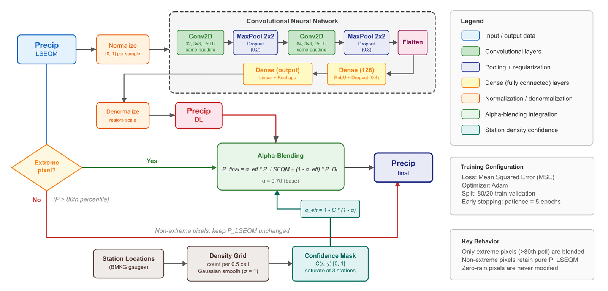
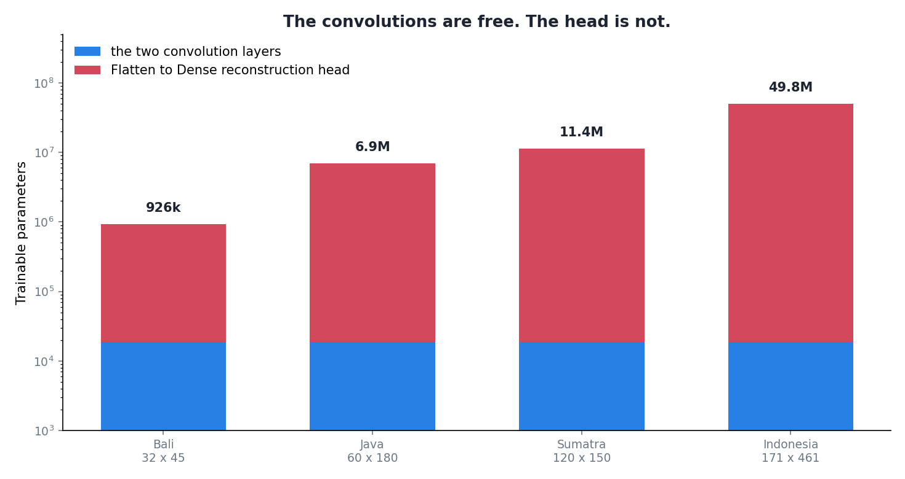

Last year ended with a promise to myself that this year would involve an actual model. Here is the first attempt, and the thing I found when I looked at it properly.

## What is left for a model to do

After the statistical correction, the distribution at each pixel matches the reference. Every pixel, independently, now has roughly the right amount of light rain and heavy rain and roughly the right number of dry days.

Independently is the operative word. Nothing in that chain looks sideways. A pixel does not know it is on a coastline, or that the pixel next to it is halfway up a mountain, or that the two of them are part of the same convective cell. Whatever systematic spatial pattern is left in the error, a per-pixel correction is structurally incapable of seeing it.

That is a job for something convolutional, and it is a genuinely modest job. The heavy lifting is already done.

## The network



Two convolution blocks. Thirty-two filters then sixty-four, three by three, ReLU, each followed by max-pooling and dropout. Then flatten, a dense layer of 128, and a final dense layer that reconstructs the output field, reshaped back to the grid.

One of these is trained per dekad. The input is the corrected field for that dekad across all years, the target is the reference for the same days, and training uses Adam with early stopping on a 20% validation split.

Small, by design. The correction underneath it is doing the real work and I did not want a large model quietly taking over.

## Then I counted



The two convolution layers have **18,816 parameters**. That is the whole convolutional part of the network: 320 in the first layer, 18,496 in the second.

That number does not change. Not with the size of the domain, not with anything. A three by three kernel over thirty-two channels is a three by three kernel over thirty-two channels whether you point it at Bali or at the entire archipelago.

The dense head is a different story. On Bali it is about 907,000 parameters. On Java, 6.9 million. On the full Indonesia grid, at 171 by 461, it is **49.7 million**.

Which puts the convolutions at 0.038% of the network.

## Why the head is so big

Flatten destroys the spatial layout. After it, the network is holding a vector of 309,120 numbers with no notion that some of them were neighbours. The dense layer that follows has to connect all of them to its 128 units, and then the output layer has to expand those 128 units back out to a value for every one of the 78,831 pixels.

That final expansion is the expensive part, and it is expensive in a way that should bother you. It means the network has a separate set of weights for every output pixel. It is not learning "coastlines behave like this". It is learning "pixel 41,203 tends to be a bit wet", separately, seventy-eight thousand times.

A convolution is translation invariant on purpose: the same kernel applies everywhere, which is what lets it generalise a pattern from one part of the map to another. Then I flatten it and throw that property away.

## The U-Net question

The obvious response is to reach for a bigger, better architecture, so I tried. A U-Net skips the flatten entirely, keeps spatial structure the whole way through, and would have a far smaller parameter budget for the same job.

It scored about the same. It cost more to train.

That result was not what I wanted but it is informative, and I think it says something about where the actual limit is. The network is trained against the gauge-interpolated reference. In the parts of the country where the gauges are dense that reference is meaningful, and in the parts where they are not it is essentially a smooth regional climatology. No architecture learns spatial detail from a target that does not contain any.

The bottleneck is not the model. It is what I am asking the model to imitate.

## Where this leaves me

The dense head is wrong and I know it is wrong. Removing it, going fully convolutional to the output, would make the parameter count independent of domain size and restore translation invariance. That is clearly the right shape for the problem, and it is on the list.

But it is not urgent, for an uncomfortable reason: fixing the architecture would not move the score much, because the architecture is not what is limiting the score. Doing it would make the model smaller, faster, and more principled without making it better. Those are good reasons. They are not the same as an improvement.

The more pressing problem is the one this analysis walked me into. If the model can only learn where the reference is trustworthy, then letting it act everywhere, at full strength, is asking it to invent detail in exactly the regions where it has been trained on a smooth average. That is worse than doing nothing.

Which means the next thing to build is not a better network. It is a way of telling the network where it is allowed to speak.

## The code

The training function, including both the default head and the fully-convolutional alternative that lives behind an `architecture` argument, plus the GPU memory handling that a 49-million-parameter head makes necessary.

::: {.callout-note collapse="true" title="Python - train_bias_correction_model, from src/deep_learning.py"}
```python
def train_bias_correction_model(
        input_data,
        target_data,
        model_name,
        mask_data=None,
        model_dir=None,
        epochs=DL_EPOCHS,
        batch_size=DL_BATCH_SIZE,
        validation_split=DL_VALIDATION_SPLIT,
        dropout_rate_1=DL_DROPOUT_RATE_1,
        dropout_rate_2=DL_DROPOUT_RATE_2,
        dropout_rate_dense=DL_DROPOUT_RATE_DENSE,
        filter_size_1=DL_FILTER_SIZE_1,
        filter_size_2=DL_FILTER_SIZE_2,
        num_filters_1=DL_NUM_FILTERS_1,
        num_filters_2=DL_NUM_FILTERS_2,
        dense_layer_size=DL_DENSE_LAYER_SIZE,
        optimizer=DL_OPTIMIZER,
        architecture='dense',
        interactive=True
    ):
    """
    Train a deep learning model to perform bias correction by learning the
    spatial mapping from LSEQM-corrected data to CPC data.

    In the two-step workflow, this function receives LSEQM-corrected data
    (not raw IMERG) as input, eliminating the domain shift between training
    and inference. The model learns what the physical-statistical correction
    missed - residual spatial patterns, extreme event refinement.

    Architecture
    ------------
    A two-layer CNN with ``padding='same'`` so that spatial dimensions are
    preserved through the convolutional layers. This gives the model more
    spatial context before the Flatten -> Dense bottleneck, improving its
    ability to learn fine-grained spatial correction patterns (e.g. orographic
    enhancement, rain-shadow effects).

    Normalization
    -------------
    During training, both input and target are normalized **per-sample** (each
    daily 2-D field divided by its own maximum value).  This teaches the model
    to learn **relative spatial patterns** rather than absolute intensities.

    Parameters:
    ----------
    input_data : xarray.DataArray
        LSEQM-corrected data for the dekad across all years.
        Should already be masked (NaN over ocean).
    target_data : xarray.DataArray
        CPC (gauge-based reference) data for the same dekad across all years.
        Should already be masked (NaN over ocean).
    model_name : str
        Name for saving the trained model.
    mask_data : xarray.DataArray, optional
        Pre-loaded land-sea mask. If None, masking should have been applied upstream.
    model_dir : str, optional
        Directory to save the trained model. If None, uses config default.
    epochs : int, optional
        Number of training epochs.
    batch_size : int, optional
        Batch size during training.
    validation_split : float, optional
        Fraction of data for validation.
    dropout_rate_1, dropout_rate_2, dropout_rate_dense : float, optional
        Dropout rates for the network.
    filter_size_1, filter_size_2 : tuple, optional
        Convolution filter sizes.
    num_filters_1, num_filters_2 : int, optional
        Number of filters in the convolutional layers.
    dense_layer_size : int, optional
        Size of the dense layer.
    optimizer : str, optional
        Optimizer for training.
    interactive : bool, optional
        If True, prompt user for decisions on existing models. If False, use existing model
        if available. Default is True.

    Returns:
    ----------
    keras.Model
        Trained deep learning model.
    """
    # Ensure TensorFlow is available before proceeding
    _require_tensorflow()

    # Seed RNGs (no-op if DL_RANDOM_SEED is None - preserves the original stochastic
    # behaviour). When seeded, repeated runs on the same input produce bit-identical
    # .keras files on CPU. Configure via deep_learning.random_seed in config.yml.
    _seed_dl_rngs(DL_RANDOM_SEED)
    if DL_RANDOM_SEED is not None:
        logging.info(f"DL training RNGs seeded with {DL_RANDOM_SEED} (reproducible).")
    else:
        logging.info("DL training RNGs not seeded (deep_learning.random_seed is null).")

    # Use config default if model_dir not provided
    if model_dir is None:
        from .config import trained_models_path
        model_dir = trained_models_path

    # Define the path where the model will be saved
    save_path_model = os.path.join(model_dir, f"{model_name}.keras")
    logging.info(f"Checking if the model file exists at: {save_path_model}")

    # Check if the model file already exists
    if os.path.exists(save_path_model):
        if interactive:
            choice = input(
                f"Model file '{save_path_model}' already exists. "
                "Use existing (U), Overwrite (O), or Abort (A)? "
            ).upper()
        else:
            # Non-interactive: honour existing_model_action from config.
            # Read the module attribute at call time rather than a from-import,
            # so a value set by initialize_config() after this module was
            # imported is still seen.
            from . import config as _cfg
            action = getattr(_cfg, 'EXISTING_MODEL_ACTION', 'use_existing')
            choice = {'use_existing': 'U', 'overwrite': 'O', 'abort': 'A'}.get(action, 'U')
            logging.info(f"Non-interactive mode: existing_model_action = {action}")

        if choice == 'U':
            # Load the existing model and return it
            logging.info(f"Using existing model: {save_path_model}")
            model = load_model(save_path_model)
            return model

        elif choice == 'O':
            logging.info(f"Overwriting model: {save_path_model}")
            # Proceed to train the model as usual
        else:
            logging.info("Aborting training.")
            return None

    # Fill NaN values with 0 for CNN processing
    # (NaN/ocean pixels should already be masked upstream; here we ensure no NaN for TensorFlow)
    input_data = input_data.fillna(0)
    target_data = target_data.fillna(0)

    # Ensure data alignment
    input_data, target_data = xr.align(input_data, target_data)

    # Convert to numpy arrays
    input_values = input_data.values  # (time, lat, lon)
    target_values = target_data.values      # (time, lat, lon)

    # --- Per-sample normalization ---
    # Each daily field is normalized by its own max.  This removes the absolute
    # intensity from the training signal and makes the model focus on the
    # *spatial distribution* of rainfall.  At inference the same per-sample
    # norm + denorm preserves the LSEQM magnitude.
    n_samples = input_values.shape[0]
    for i in range(n_samples):
        imax = input_values[i].max()
        cmax = target_values[i].max()
        if imax > 0:
            input_values[i] = input_values[i] / imax
        if cmax > 0:
            target_values[i] = target_values[i] / cmax

    # Reshape data for CNN input
    # Input shape: (samples, lat, lon, channels)
    X = np.expand_dims(input_values, axis=-1)  # Shape: (samples, lat, lon, 1)
    y = np.expand_dims(target_values, axis=-1)    # Shape: (samples, lat, lon, 1)

    # Define the CNN model
    input_shape = X.shape[1:]  # Shape: (lat, lon, channels)

    # --- Adaptive batch size --------------------------------------------------
    # Large spatial grids (e.g. 171x461 = 78 831 pixels) combined with Conv2D
    # filters need substantial GPU memory per sample.  If the user-provided
    # batch_size would require more than roughly 2 GB per batch (heuristic),
    # reduce it automatically so training fits on modest GPUs (4-6 GB VRAM).
    spatial_pixels = int(np.prod(input_shape[:-1]))
    # Rough estimate: each sample needs ~4 bytes * pixels * filters * 8 (fwd+bwd)
    est_bytes_per_sample = spatial_pixels * max(num_filters_1, num_filters_2) * 4 * 8
    max_batch_mem = 1.5 * 1024**3  # 1.5 GB target per batch
    safe_batch = max(1, int(max_batch_mem / est_bytes_per_sample))
    if safe_batch < batch_size:
        logging.info(
            f"Reducing batch_size from {batch_size} to {safe_batch} "
            f"to fit {spatial_pixels:,} pixels/sample on available GPU memory."
        )
        batch_size = safe_batch

    # Build CNN model.
    # Uses padding='same' so spatial dimensions are preserved through conv layers.
    # This gives the model more spatial context - important for capturing spatial
    # correction patterns (orographic enhancement, convective clusters) rather
    # than just learning a smooth, low-frequency field through a tiny bottleneck.
    def _build_model(arch='dense'):
        """Build and compile the CNN model.

        ``arch='dense'`` (default) is the original Flatten -> Dense -> Dense
        reconstruction head. ``arch='fcn'`` is a fully-convolutional,
        translation-invariant network with no dense layers (about 900x fewer
        parameters). Both keep the same ``(lat, lon)`` input/output interface,
        so the training, alpha-blending, and confidence-gating code is shared.
        """
        if arch == 'fcn':
            m = Sequential([
                Input(shape=input_shape),
                Conv2D(num_filters_1, filter_size_1, activation='relu', padding='same'),
                Dropout(dropout_rate_1),
                Conv2D(num_filters_2, filter_size_2, activation='relu', padding='same'),
                Dropout(dropout_rate_2),
                Conv2D(num_filters_2, filter_size_2, activation='relu', padding='same'),
                Conv2D(1, (1, 1), activation='linear', padding='same'),
                Reshape(input_shape[:-1])
            ])
        else:
            m = Sequential([
                Input(shape=input_shape),
                Conv2D(num_filters_1, filter_size_1, activation='relu', padding='same'),
                MaxPooling2D((2, 2)),
                Dropout(dropout_rate_1),
                Conv2D(num_filters_2, filter_size_2, activation='relu', padding='same'),
                MaxPooling2D((2, 2)),
                Dropout(dropout_rate_2),
                Flatten(),
                Dense(dense_layer_size, activation='relu'),
                Dropout(dropout_rate_dense),
                Dense(int(np.prod(input_shape[:-1])), activation='linear'),
                Reshape(input_shape[:-1])
            ])
        m.compile(optimizer=optimizer, loss='mean_squared_error', metrics=['mae'])
        return m

    model = _build_model(architecture)
    model.summary(print_fn=logging.info)

    # Early stopping to avoid overfitting
    early_stop = EarlyStopping(
        monitor='val_loss',
        patience=DL_EARLY_STOPPING_PATIENCE,
        restore_best_weights=True  # Ensures the best weights are restored
    )

    # Model checkpoint to save the best model
    model_checkpoint = ModelCheckpoint(
        filepath=save_path_model,
        monitor='val_loss',
        save_best_only=True
    )

    # --- Train with GPU -> CPU fallback ----------------------------------------
    # If the GPU runs out of memory (OOM) during training, we automatically
    # retry on CPU.  This is common on GPUs with <= 4 GB VRAM when processing
    # large spatial grids.
    def _train(device=None):
        """Run model.fit, optionally forcing a specific device."""
        ctx = tf.device(device) if device else _nullcontext()
        with ctx:
            return model.fit(
                X, y,
                epochs=epochs,
                batch_size=batch_size,
                validation_split=validation_split,
                callbacks=[early_stop, model_checkpoint],
                verbose=1,
            )

    try:
        history = _train()  # Try default device (GPU if available)
    except (tf.errors.ResourceExhaustedError, tf.errors.UnknownError) as gpu_err:
        logging.warning(
            f"GPU training failed ({type(gpu_err).__name__}). "
            "Retrying on CPU -- this will be slower but avoids the OOM error."
        )
        # Rebuild model on CPU (GPU state may be corrupted after OOM)
        with tf.device('/CPU:0'):
            model = _build_model(architecture)
        history = _train(device='/CPU:0')

    logging.info(f"Final training history: {history.history}")

    # Load the best model before returning
    model = load_model(save_path_model)

    logging.info(f"Model training complete. Best model saved as {save_path_model}")

    return model
```
:::

[`src/deep_learning.py`](https://github.com/bennyistanto/hybrid-bias-correction/blob/main/src/deep_learning.py)
