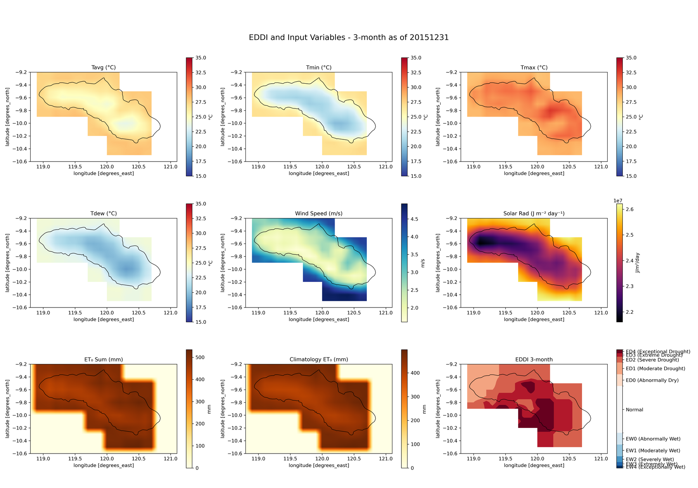
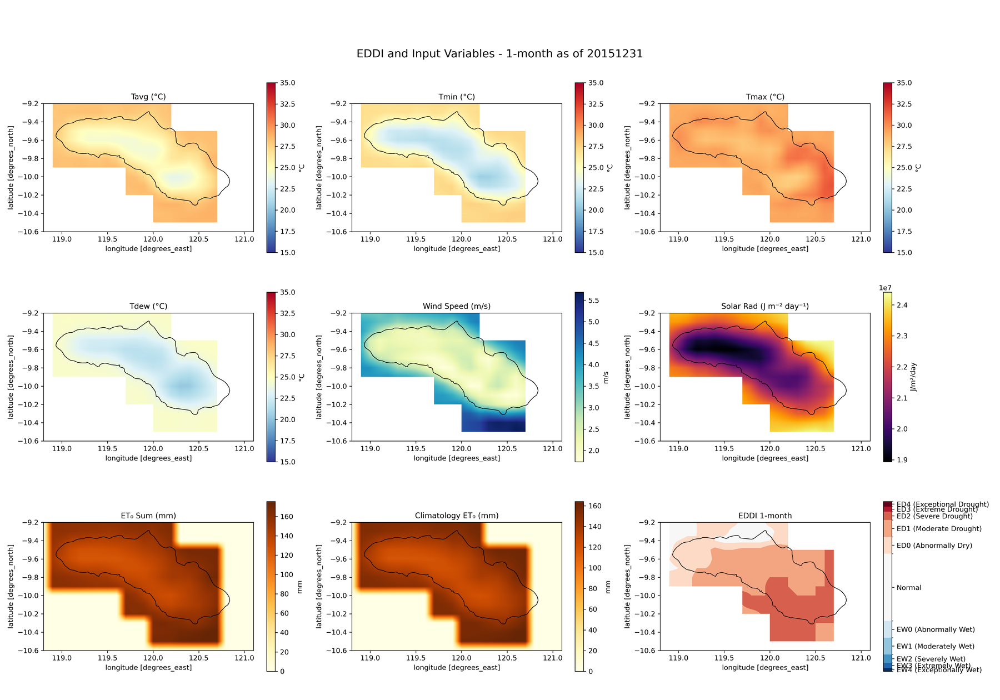
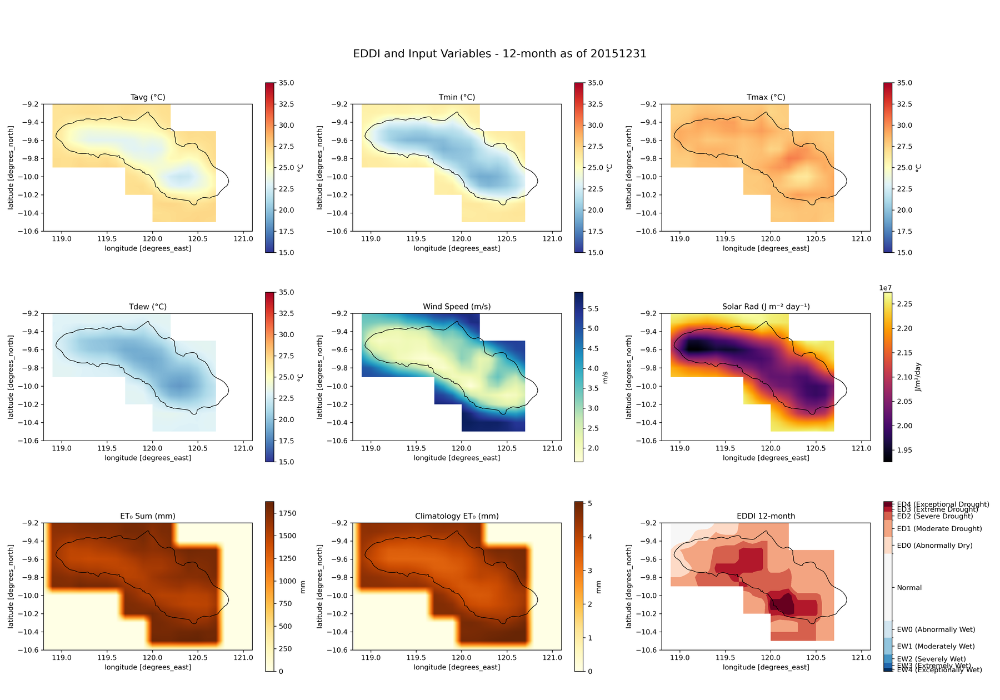

Almost every drought index starts with rainfall. SPI is rainfall ranked against its own history. SPEI is rainfall minus evaporative demand. PDSI runs rainfall through a soil water balance.

There is one that does not use rainfall at all.

The Evaporative Demand Drought Index, [EDDI](https://psl.noaa.gov/eddi/), is built from temperature, humidity, wind speed and solar radiation. It measures how hard the atmosphere is pulling water out of soil and plants. Nothing else.

That sounds like a strange thing to want until you consider the order in which a drought happens.

## Demand leads, deficit follows

A rainfall-based index tells you water did not arrive. That is the definition of the drought, so it is necessarily true, and it is necessarily after the fact.

Evaporative demand is on the other side of the ledger. Clear skies, high temperatures, low humidity and steady wind are what turn a dry spell into crop stress, and they show up while the rainfall anomaly is still ambiguous. [Hobbins and colleagues](https://doi.org/10.1175/JHM-D-15-0121.1) set this out in the paper that introduced the index in 2016, with a [companion assessment](https://doi.org/10.1175/JHM-D-15-0122.1) against the usual indicators across the continental United States.

The other advantage is more mundane and, for where I work, more decisive. Rainfall over the Indonesian archipelago is the hardest variable to get right: sparse gauges, satellite estimates that disagree with each other, and a wet-season signal that is difficult to correct. Temperature, humidity, wind and radiation are all far better constrained in reanalysis. An index that avoids the worst-measured variable entirely is worth having as a second opinion.

## What goes into it

The whole chain fits in one figure. Six input variables, an accumulated demand, a climatology to rank it against, and a classification.

Reading the bottom row left to right is the entire method:

1. **Compute daily reference evapotranspiration.** Penman-Monteith, either FAO-56 or the ASCE standardized form, for a short (grass) or tall (alfalfa) reference crop. This is the "thirst" number, in millimetres per day.
2. **Accumulate it** over the window you care about, from 1 to 12 months, on dekad boundaries.
3. **Rank that total** against the same calendar window in every year from 1991 to 2020.
4. **Report the rank as a percentile**, and classify it.

Step 3 is what makes it an index rather than a measurement. A total of 450 mm of evaporative demand means nothing on its own. What matters is that it is the highest such total in thirty years for that place and that time of year.

The percentile convention runs the opposite way to SPI, which catches people out: **higher EDDI means drier**. The classes mirror around the middle, ED0 to ED4 for increasingly dry and EW0 to EW4 for increasingly wet, with 30 to 70 counted as near normal.

## Sumba in the 2015 El Niño

The figure above is Sumba, in East Nusa Tenggara, at the end of December 2015, during one of the strongest El Niño events on record. At the three-month scale most of the island is in ED3 and ED4, extreme to exceptional.

Now the same island, the same day, at two other timescales.

The twelve-month map is noticeably milder: mostly ED0 and ED1, with two pockets reaching ED3. Same island, same data, same code, same day.

Nothing has gone wrong. The twelve-month window includes the months before the El Niño established itself, and averaging an exceptional three months into a normal nine gives you something unremarkable. This is ordinary behaviour for any accumulation index, but it is easy to forget when a single map is on a slide, and it is the reason the timescale belongs in the caption rather than in the methods section.

Which timescale you want depends on what is downstream. Short windows for crop stress in a growing season. Long windows for reservoirs and groundwater, which do not care what happened last month.

## Why the elevation model is in there

One implementation detail that surprised me.

Penman-Monteith needs atmospheric pressure, which depends on elevation, and it needs clear-sky solar radiation, which also depends on elevation. So the calculation takes a DEM as an input alongside the meteorology. I used SRTM resampled to match the roughly 0.1 degree AgERA5 grid.

There is also a unit conversion that is easy to get wrong. AgERA5 gives wind speed at 10 metres; Penman-Monteith wants it at 2 metres. The logarithmic wind profile correction is a single line, and omitting it inflates evaporative demand everywhere, consistently, in a way that looks entirely plausible on a map.

The other awkward part is polar and high-latitude behaviour. The sunset hour angle calculation involves an arc-cosine whose argument can drift outside -1 to 1 through floating point error near the poles, which produces NaN over exactly the regions where you would not immediately notice. Clipping that argument to its valid domain is the fix, and it is the kind of thing that only shows up when you move from one island to a global grid.

## What it is not

EDDI is not a replacement for a rainfall-based index and it is not a soil moisture product.

It says the atmosphere is unusually thirsty. It does not say whether there is water available to be taken. A high EDDI over a saturated landscape after a wet month means demand is high and the soil is coping. Over a landscape three weeks into a dry spell it means something quite different, and it is only the pairing with a rainfall index that distinguishes them.

That is the honest framing: an independent second axis, not a better single number.

The code, the Sumba worked example and the full methodology are in [the repository](https://github.com/bennyistanto/eddi), including the classification table and the equations for each Penman-Monteith variant.

One island at 0.1 degrees is a manageable problem in Python on a laptop. Doing this globally is a different exercise, and that turned out to need a different tool entirely.
