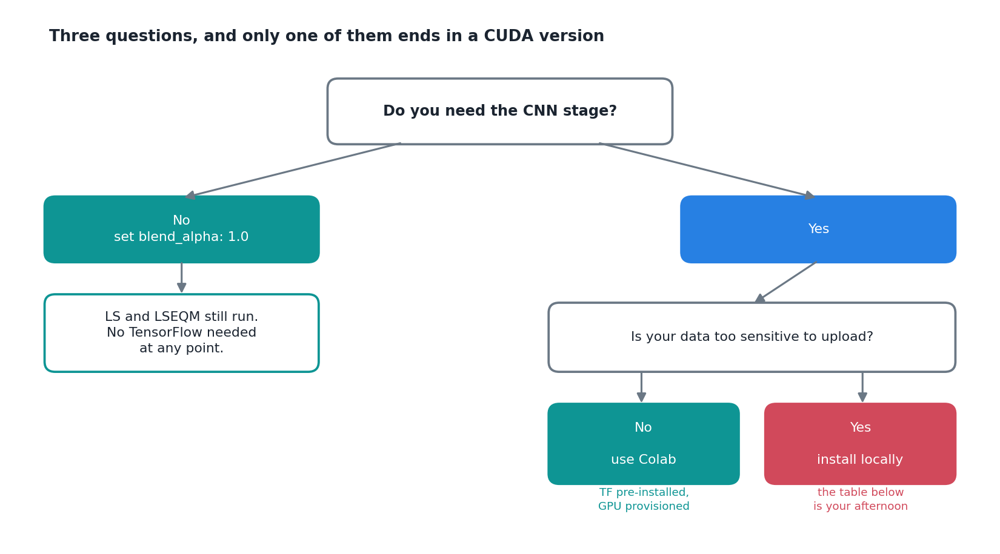

I have now lost more hours to installing TensorFlow than to writing the model that uses it. That ratio is embarrassing enough that I am writing it down, partly so the next person does not repeat it and partly so I stop repeating it myself.

The symptom is always the same shape. The statistical correction runs perfectly. Then the notebook reaches the neural refinement step and dies.

## What it dies with, by platform

Five distinct failures, and the useful thing is that each one is diagnostic. The error message tells you which platform problem you have.

| What you see | What it means | What fixes it |
|---|---|---|
| `ImportError: DLL load failed while importing _pywrap_tensorflow_internal` | Windows is missing the Visual C++ runtime | Install the Visual C++ Redistributable |
| `cannot enable executable stack as shared object requires` | WSL or Linux without execstack permission | `pip install patchelf`, then clear the exec stack on `libtensorflow_cc.so.2` |
| Runs, but on CPU, despite a GPU sitting there | CUDA or cuDNN does not match the TensorFlow build | Let conda pin it: `mamba install tensorflow`. Or match the official compatibility table exactly |
| `ResourceExhaustedError: OOM when allocating tensor` | Another CUDA process is holding memory | Restart the kernel, and set `TF_FORCE_GPU_ALLOW_GROWTH=true` before importing |
| No error at all, the script simply hangs | `keras` and `tf-keras` are fighting | Uninstall both, reinstall TensorFlow from conda-forge |

The last one cost me the most. A silent hang gives you nothing to search for, and my first instinct was that my own training loop had deadlocked. It had not. Two packages that both want to be `keras` were installed side by side.

There is a sixth, specific to Windows under Git Bash: the conda environment's DLLs need to be on `PATH` *before* Python starts. Not inside the script, not in the notebook. Before.

## The part I got backwards

I spent a long time treating a working local install as the goal, and the model as what came after. That was the wrong order.

Two questions get most people out before the CUDA table.

**Do you need the neural stage at all?** If the answer is no, there is a config flag for that. Set the blend weight to 1.0 and the pipeline trains no network, imports no TensorFlow, and writes the neural-stage output as an exact copy of the statistical one. Linear scaling and quantile mapping both run untouched, and those are doing the overwhelming majority of the work anyway.

That is not a fix. It is an admission that the expensive dependency is optional, which is worth knowing before you spend an afternoon on it.

**Is your data too sensitive to upload?** If not, use Colab. TensorFlow is already there, the GPU is provisioned, and the whole class of failures above simply does not exist. The Bali example runs end to end in about 72 minutes on the free CPU tier, with the longest single notebook taking around 45 of them.

I resisted this for a while, and I think the resistance was mostly pride. Running on someone else's machine felt like not really having solved the problem. But the problem I was trying to solve was bias correction, not CUDA version alignment, and the hours are the same hours either way.

## What Colab costs you

It is not free of friction, just different friction.

The free tier disconnects if you leave it idle, which is fatal partway through a long training run. Run the notebook top to bottom in one sitting, mount Drive at the start and write outputs there, and if you only want a sanity check, run a few dekads rather than all thirty-six.

Memory is the other one. The visualisation notebook generates something like seventeen hundred figures in a batch, and matplotlib will happily hold every one of them. The framework closes figures and collects garbage at the end of each period, but any loop you write yourself needs the same discipline. And if you trained the model earlier in the same session, TensorFlow is still holding it in RAM. Restart the kernel between the two.

## The general lesson

A heavy optional dependency should be optional in practice, not just in principle. The reason the flag exists is that I got stuck once and wanted a way to keep working, and it turned out to be the most useful thing I built that week.

If a stage of your pipeline can be switched off with one config value, and the rest still produces a valid result, then a broken install is an inconvenience instead of a wall. That is worth designing for before you need it.
