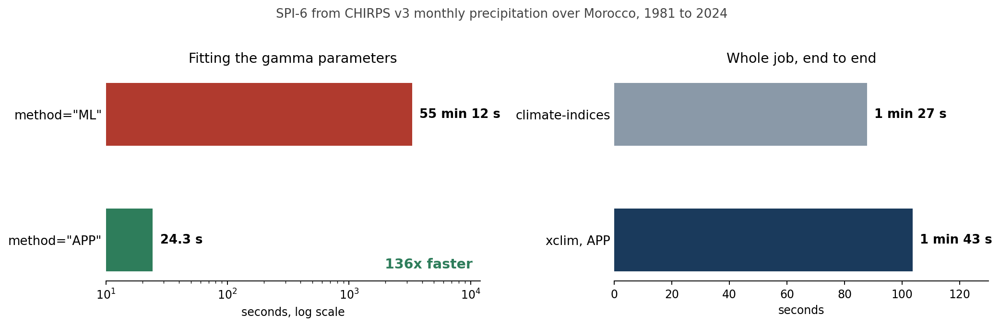
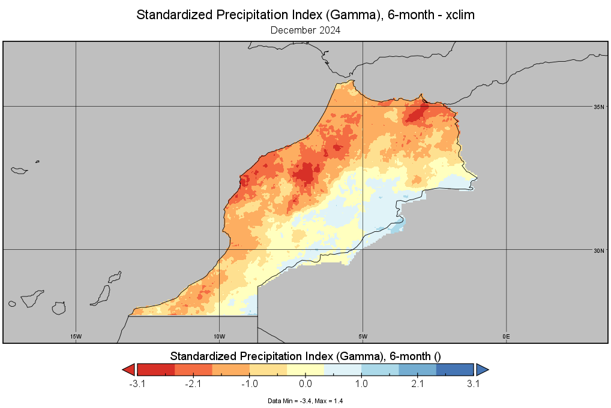
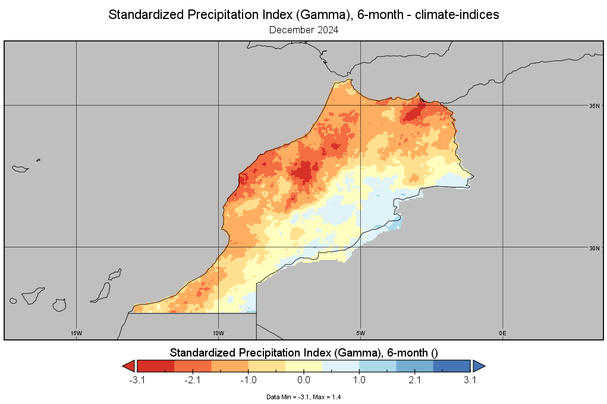

I calculate SPI often enough that I have opinions about it. For years my tool has been [climate-indices](https://pypi.org/project/climate_indices/), which is solid and does exactly what it says.

But [xclim](https://xclim.readthedocs.io/) is the library the rest of my stack is drifting towards. It is xarray-native, it handles units properly through pint, and it covers a lot more than drought indices. So I tried moving SPI over to it, using CHIRPS v3 monthly precipitation for Morocco, 1981 to 2024.

The first run took an hour.

```
2025-03-03 03:08:08 - Fitting distribution ...
2025-03-03 04:03:21 - Distribution fitting completed in 3312.44 seconds
```

Fifty-five minutes to fit the gamma parameters for one six-month window. climate-indices had done the whole thing, fit and index, in one minute twenty-eight seconds.

That is a big enough gap that the obvious conclusion is you are holding it wrong. So I wrote it up and [asked on the xclim tracker](https://github.com/Ouranosinc/xclim/issues/2091).

## The answer was one argument

[Éric](https://github.com/coxipi) from the xclim team replied the next morning, and the diagnosis was immediate. I had used `method="ML"`.

`ML` is maximum likelihood done properly: a full numerical optimisation, per pixel, through scipy. It is the honest way to fit a distribution and it is slow, because it iterates.

climate-indices does something else by default. For a two-parameter gamma there is an analytical approximation to the maximum likelihood equations, built from the mean of the data and the mean of its logarithm. No iteration, just arithmetic.

xclim has that too. It is called `APP`:

```python
params = xclim.indices.stats.standardized_index_fit_params(
    pr_cal,
    freq=None,
    window=6,
    dist="gamma",
    method="APP",              # not "ML"
    fitkwargs={"floc": 0},     # required for APP with gamma
)
```

The `floc` is not optional. `APP` is only available for the two-parameter gamma, which means the location parameter has to be pinned. Setting `floc: 0` fixes it at zero and gives you the same two-parameter gamma that climate-indices fits.



Same data, same window, same distribution: **3312 seconds down to 24**. About 136 times faster, from changing a four-character string and adding one keyword.

End to end my script now runs in 1 minute 44 seconds against climate-indices' 1 minute 28. Close enough that the choice stops being about speed.

Éric also made a point I think is right, about why this is not the documented default. `APP` is an approximation, and there was a reluctance to advertise it too loudly in case people reach for it without knowing that is what they are getting. That seems fair. But if you are reproducing climate-indices output, the approximation *is* the thing you are trying to reproduce.

## Then it would not load the parameters back

Fitting once and saving the parameters is the whole point for operational work. Refit every month and the index quietly shifts under you.

Saving worked. Loading did not:

```
Value of type <class 'xarray.core.dataset.Dataset'> not supported
```

Two things caused this, and both are easy to hit.

**Pass a DataArray, not a Dataset.** `xr.open_dataset(...)` gives you a Dataset. `standardized_precipitation_index()` wants the array itself, so index into it: `params_ds['precip']`, not `params_ds`.

**Drop the stray `time` coordinate.** Fitting collapses the time dimension, so the parameters have no time axis. But writing metadata onto the result can leave a `time` coordinate hanging around, and a `coordinates` attribute that still lists it. On reload, that phantom coordinate is what the error is really complaining about. Drop `time` from both the coordinates and the `coordinates` attribute before saving, and again after loading.

That second one cost me most of an afternoon, because the error message points at a type, not at a coordinate.

## Checking it actually agrees

Speed is worthless if the answer changed. So I ran both tools on the same input and mapped December 2024.





The patterns are the same. The dry anomaly through the Atlas and along the Atlantic coast sits in the same places with the same intensity, and the wetter pocket in the southeast is in both.

The one difference is at the extreme. Both maps top out at 1.4. The minimum is -3.4 in xclim and -3.1 in climate-indices, a gap of 0.3 at the very dry tail. That is a handful of pixels, and it is where two implementations of the same fit are most likely to part company, since the tail is where a small difference in fitted parameters gets amplified. For drought classification, where anything below -2.0 is already "extremely dry", it changes nothing. If you were reporting the single driest pixel as a headline number, it would.

## What I would tell someone starting

- **Use `method="APP"` with `fitkwargs={"floc": 0}`** if you want climate-indices-equivalent results at a usable speed. Use `ML` if you want a properly optimised fit and can afford to wait.
- **Set units explicitly.** With `freq=None` there is no resampling step to infer them from, so give the array `units = "mm/month"` before it goes anywhere near xclim.
- **Fit once, save, reuse.** Parameters are small: my 33 MB input produces a 3 MB parameter file, because the time dimension is gone.
- **Decide how zeros are handled, and write down which way you chose.** A gamma distribution cannot accommodate a zero. xclim's own answer is `zero_inflated=True`, which models the zeros separately. My script instead replaces zeros with 0.01 mm before fitting, which is the older convention and what I had been doing already. Both are defensible. Doing neither is not.
- **Keep the land mask.** Replacing zeros is easy to write in a way that also fills your ocean. Build a NaN mask from the first timestep, apply it to the output, and check the coastline before you trust anything.

## The script

The full thing, with the parameter step separated from the index step so you can run the fit once and then compute as often as you like.

::: {.callout-note collapse="true" title="Python - SPI from monthly precipitation with xclim"}
```python
import warnings
import xarray as xr
import xclim as xc
from xclim import indices
import numpy as np
from datetime import datetime
import os
import time

warnings.filterwarnings('ignore')


def log_time(message):
    """Print a log message with the current timestamp."""
    timestamp = datetime.now().strftime('%Y-%m-%d %H:%M:%S')
    print(f"{timestamp} - {message}")


# =============================================
# Configuration
# =============================================

INPUT_FILE = "/mnt/e/temp/chirps/mar/nc/mar_cli_chirps3_month1_1981_2024c.nc"
PARAMS_DIR = "/mnt/e/temp/chirps/mar/nc/spi/params"
OUTPUT_DIR = "/mnt/e/temp/chirps/mar/nc/spi"

DIST = "gamma"
METHOD = "APP"          # "APP" is the fast analytical fit. "ML" optimises, slowly.

WINDOWS = [6]                # SPI windows, in months
CAL_START = "1991-01-01"     # WMO 30-year reference
CAL_END = "2020-12-31"

INPUT_VAR = "precip"
PARAM_FILE_TEMPLATE = "mar_cli_chirps3_spi_{DIST}_{window}_month_params_xclim.nc"
OUTPUT_FILE_TEMPLATE = "mar_cli_chirps3_spi_{DIST}_{window}_month_xclim.nc"


# =============================================
# Helpers
# =============================================

def validate_inputs(input_file, params_dir, windows):
    """Check the paths and the input variable before doing any real work."""
    start_time = time.time()
    log_time("Validating input parameters and paths")

    if not os.path.exists(input_file):
        raise FileNotFoundError(f"Input file not found: {input_file}")
    if not isinstance(windows, list):
        raise ValueError("Windows parameter must be a list of integers")
    if not all(isinstance(w, int) for w in windows):
        raise ValueError("All window values must be integers")

    try:
        ds = xr.open_dataset(input_file)
        if INPUT_VAR not in ds.variables:
            raise ValueError(f"Variable '{INPUT_VAR}' not found in input file")
        ds.close()
    except Exception as e:
        raise ValueError(f"Error reading input file: {str(e)}")

    log_time(f"Input validation completed in {time.time() - start_time:.2f} seconds")


def prepare_metadata(window):
    """Metadata written onto the parameter file."""
    return {
        'calibration_period_start': CAL_START,
        'calibration_period_end': CAL_END,
        'distribution': DIST,
        'method': 'APP (approximate analytical fit)',
        'window': str(window),
        # Zeros are handled by substitution here, NOT by xclim's zero_inflated
        # option. Recording which one was used matters: they give different
        # parameters, and the file has no other way of telling you.
        'zero_handling': 'zeros replaced with 0.01 mm before fitting',
        'creation_date': datetime.now().strftime('%Y-%m-%d'),
        'description': f'Distribution parameters for SPI-{window} using CHIRPS v3.0',
        'note': ('Parameters fitted with the APP method and a gamma distribution, '
                 'location fixed at 0. Zero values replaced with 0.01 mm for '
                 'fitting while NaN values are preserved.')
    }


def load_and_prepare(ds):
    """Return (precip with zeros substituted, nan_mask, land_mask)."""
    pr = ds[INPUT_VAR]

    # A NaN in the first timestep means no data anywhere: ocean, or outside
    # the domain. Keep it, so the substitution below cannot fill the sea.
    log_time("Creating land-sea mask to preserve NaN values")
    nan_mask = np.isnan(pr.isel(time=0)).compute()
    land_mask = ~nan_mask

    # A gamma distribution has no support at zero, so dry months need a small
    # positive value. NaN cells are excluded from the substitution.
    log_time("Handling zero precipitation values while preserving NaNs")
    pr_processed = xr.where((pr == 0) & ~nan_mask, 0.01, pr)

    return pr_processed, nan_mask, land_mask


def strip_time(obj):
    """Remove the phantom 'time' coordinate left behind by fitting.

    Fitting collapses the time dimension, but a stray 'time' coordinate and a
    'coordinates' attribute that still mentions it will survive a round trip
    through NetCDF and make standardized_precipitation_index() reject the
    parameters later.
    """
    if "time" in getattr(obj, "coords", {}):
        obj = obj.drop_vars("time")
    if "time" in getattr(obj, "variables", {}):
        obj = obj.drop_vars("time")
    attrs = getattr(obj, "attrs", {})
    if "coordinates" in attrs:
        coords = [c for c in attrs["coordinates"].split() if c != "time"]
        obj.attrs["coordinates"] = " ".join(coords)
    return obj


# =============================================
# Step 1: fit and save the parameters
# =============================================

def save_spi_params(input_file, params_dir, windows, cal_start, cal_end):
    """Fit gamma parameters over the calibration period and write them out."""
    total_start_time = time.time()
    log_time("Starting parameter calculation process")

    try:
        validate_inputs(input_file, params_dir, windows)
        os.makedirs(params_dir, exist_ok=True)

        log_time(f"Reading precipitation data from: {input_file}")
        with xr.open_dataset(input_file) as ds:
            pr_processed, nan_mask, land_mask = load_and_prepare(ds)

            # With freq=None there is no resampling step for xclim to infer
            # units from, so they have to be stated.
            pr_copy = pr_processed.copy(deep=True)
            pr_copy.attrs['units'] = 'mm/month'

            cal_data = pr_copy.sel(time=slice(cal_start, cal_end))
            log_time(f"Calibration period: {cal_start} to {cal_end}, "
                     f"{len(cal_data.time)} months")

            for window in windows:
                window_start_time = time.time()
                log_time(f"Processing parameters for SPI-{window}")

                fit_start_time = time.time()
                log_time(f"Fitting with {METHOD} / {DIST} for a {window}-month window")
                with np.errstate(divide='ignore', invalid='ignore'):
                    params = indices.stats.standardized_index_fit_params(
                        cal_data,
                        freq=None,
                        window=window,
                        dist=DIST,
                        method=METHOD,
                        # APP only supports the two-parameter gamma, so the
                        # location parameter must be pinned.
                        fitkwargs={"floc": 0},
                    )
                log_time(f"Fitting completed in {time.time() - fit_start_time:.2f} seconds")

                params = strip_time(params)
                params_ds = strip_time(params.to_dataset(name="precip"))
                params_ds["precip"] = strip_time(params_ds["precip"])

                params_ds['land_mask'] = land_mask
                params_ds['land_mask'].attrs = {
                    'description': 'Land-sea mask (True for land, False for sea/missing)',
                    'units': '1',
                }
                params_ds.attrs.update(prepare_metadata(window))

                param_file = os.path.join(
                    params_dir, PARAM_FILE_TEMPLATE.format(DIST=DIST, window=window))
                log_time(f"Saving parameters to: {param_file}")
                encoding = {v: {'zlib': True, 'complevel': 5}
                            for v in params_ds.data_vars}
                params_ds.to_netcdf(param_file, encoding=encoding, format='NETCDF4')
                log_time(f"SPI-{window} parameters done in "
                         f"{time.time() - window_start_time:.2f} seconds")

        log_time(f"All parameters completed in {time.time() - total_start_time:.2f} seconds")
    except Exception as e:
        log_time(f"Error in parameter calculation: {str(e)}")
        raise RuntimeError(f"Error in parameter calculation: {str(e)}")


# =============================================
# Step 2: compute SPI from the saved parameters
# =============================================

def calculate_spi_from_params(input_file, params_dir, output_dir, windows,
                              cal_start, cal_end):
    """Apply saved parameters to the full record and write the SPI series."""
    total_start_time = time.time()
    log_time("Starting SPI calculation process")

    try:
        validate_inputs(input_file, params_dir, windows)
        os.makedirs(output_dir, exist_ok=True)

        log_time(f"Reading precipitation data from: {input_file}")
        with xr.open_dataset(input_file) as ds:
            pr_processed, nan_mask, _ = load_and_prepare(ds)
            log_time(f"Total time steps to process: {len(pr_processed.time)}")

            for window in windows:
                window_start_time = time.time()
                log_time(f"Processing SPI-{window}")

                param_file = os.path.join(
                    params_dir, PARAM_FILE_TEMPLATE.format(DIST=DIST, window=window))
                if not os.path.exists(param_file):
                    log_time(f"Parameter file not found, fitting first: {param_file}")
                    save_spi_params(input_file, params_dir, [window],
                                    cal_start, cal_end)

                with xr.open_dataset(param_file) as params_ds:
                    params_ds = strip_time(params_ds)

                    # Pass the DataArray. Handing the Dataset itself to
                    # standardized_precipitation_index() raises
                    # "Value of type <class 'xarray...Dataset'> not supported".
                    params_da = strip_time(params_ds['precip'])

                    pr_copy = pr_processed.copy(deep=True)
                    pr_copy.attrs['units'] = 'mm/month'

                    compute_start = time.time()
                    with np.errstate(divide='ignore', invalid='ignore'):
                        spi = xc.indices.standardized_precipitation_index(
                            pr_copy, params=params_da)

                    if 'land_mask' in params_ds:
                        spi = spi.where(params_ds['land_mask'])
                    log_time(f"SPI-{window} computed in "
                             f"{time.time() - compute_start:.2f} seconds")

                # Put the original gaps back, and remove any infinities the
                # standardisation produced at the edges of the distribution.
                spi = spi.where(~nan_mask)
                spi = spi.where(~np.isinf(spi), np.nan)

                var_name = f'spi_{DIST}_{window}_month'
                if not isinstance(spi, xr.Dataset):
                    spi = spi.to_dataset(name=var_name)

                spi.attrs.update({
                    "Conventions": "CF-1.8",
                    "cdm_data_type": "GRID",
                    "title": f"Standardized Precipitation Index "
                             f"({DIST.capitalize()}), {window}-month",
                    "description": f"SPI-{window} from CHIRPS v3.0 monthly precipitation.",
                    "calibration_period": f"{cal_start} to {cal_end}",
                    "fitting_method": f"{METHOD} ({DIST}, floc=0)",
                    "zero_handling": "zeros replaced with 0.01 mm before fitting; "
                                     "NaN preserved",
                    "creation_date": datetime.now().strftime('%Y-%m-%d'),
                    "creator_name": "Benny Istanto",
                    "institution": "GOST/DEC Data Group/The World Bank",
                    "source": "CHIRPS v3.0 monthly precipitation",
                    "references": "Funk, C.C., Peterson, P.J., et al., 2014, "
                                  "USGS Data Series 832",
                })
                spi[var_name].attrs['long_name'] = (
                    f"Standardized Precipitation Index "
                    f"({DIST.capitalize()}), {window}-month")

                for name, meta in (
                    ("lat", {"standard_name": "latitude", "long_name": "latitude",
                             "units": "degrees_north"}),
                    ("lon", {"standard_name": "longitude", "long_name": "longitude",
                             "units": "degrees_east"}),
                ):
                    if name in spi.coords:
                        spi[name].attrs.update(meta)

                output_file = os.path.join(
                    output_dir, OUTPUT_FILE_TEMPLATE.format(DIST=DIST, window=window))
                log_time(f"Saving SPI-{window} to: {output_file}")
                encoding = {v: {'zlib': True, 'complevel': 5} for v in spi.data_vars}
                spi.to_netcdf(output_file, encoding=encoding, format='NETCDF4')
                log_time(f"SPI-{window} done in "
                         f"{time.time() - window_start_time:.2f} seconds")

        log_time(f"All SPI completed in {time.time() - total_start_time:.2f} seconds")
    except Exception as e:
        log_time(f"Error in SPI calculation: {str(e)}")
        raise RuntimeError(f"Error in SPI calculation: {str(e)}")


# =============================================
# Main
# =============================================

if __name__ == "__main__":
    script_start_time = time.time()
    log_time("=== Starting SPI calculation process ===")
    log_time(f"Input file: {INPUT_FILE}")
    log_time(f"Windows to process: {WINDOWS}")

    missing = [w for w in WINDOWS if not os.path.exists(
        os.path.join(PARAMS_DIR, PARAM_FILE_TEMPLATE.format(DIST=DIST, window=w)))]
    if missing:
        log_time(f"Fitting parameters for windows: {missing}")
        save_spi_params(INPUT_FILE, PARAMS_DIR, missing, CAL_START, CAL_END)
    else:
        log_time("All parameter files already exist, skipping the fit.")

    calculate_spi_from_params(INPUT_FILE, PARAMS_DIR, OUTPUT_DIR,
                              WINDOWS, CAL_START, CAL_END)

    log_time(f"=== Completed in {time.time() - script_start_time:.2f} seconds ===")
```
:::

The [full thread](https://github.com/Ouranosinc/xclim/issues/2091) is on the xclim tracker, including Éric's minimal working example, which is a better starting point than my script if you just want to see the round trip work.

Which is the other thing worth saying. I opened that issue expecting to be told my data was wrong. Instead I got a correct diagnosis within twelve hours, a working example, and an explanation of why the fast option is not the default. That is a very good maintainer response, and worth naming when it happens.
