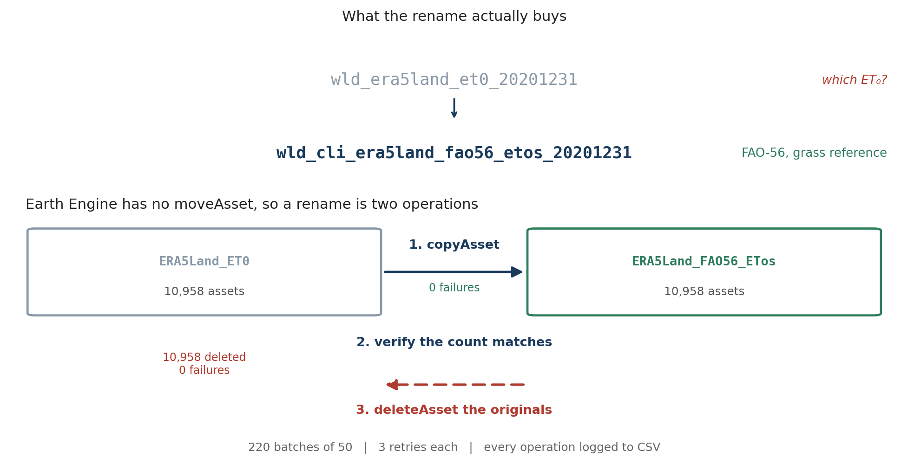

I had a collection in Earth Engine called `ERA5Land_ET0`. Inside it were 10,958 images: daily reference evapotranspiration, one per day from 1991 to 2020, precomputed so that a drought index could be calculated without refitting thirty years of physics on every request.

Thirty years of daily images is 10,958 files, if you count the eight leap days. I had not really thought about that number until I needed to change all of them.

The name was the problem. When there was one collection, `ET0` was obviously the ET₀. Then I added a second method, and a third, and suddenly the name told me nothing at all.

## Which ET₀?

Reference evapotranspiration is not one quantity. [Penman-Monteith](/blog/20250206-eddi-atmospheric-thirst) comes in variants, and they give different numbers for the same weather:

- **FAO-56**, grass reference, short crop
- **ASCE standardized**, grass reference, also short crop, but not identical to FAO-56
- **ASCE standardized**, alfalfa reference, tall crop, which runs roughly 20 to 30 per cent higher

A collection called `ERA5Land_ET0` could be any of them. Six months later, so could I.

This is exactly the same argument as [not lying in your NetCDF attributes](/blog/20241015-netcdf-that-other-tools-can-actually-read): a name that does not say which thing it is will eventually cost you a day, and the day it costs will be one where you are trying to do something else.

So `ERA5Land_ET0` needed to become `ERA5Land_FAO56_ETos`, and every asset inside it needed to say so too.

## The part I did not expect

Earth Engine has `copyAsset`. It has `deleteAsset`. It does not have `moveAsset`.

There is no rename. A rename is a copy, followed by a deletion, and in between there is a moment where you have two complete copies of your data and a decision to make.



For 10,958 assets that is 21,916 API calls. At which point a few things that are irrelevant for ten assets become the whole problem.

## What ten thousand calls need that ten do not

**Batches.** Fifty assets at a time, with a pause between batches. Not for speed, but because a single loop of eleven thousand network calls will eventually meet a timeout, and when it does you want to know where you were.

**Retries.** Three attempts per asset with a five second wait. Most intermittent failures in a long API job are not really failures, they are a hiccup you would not have noticed if you had been watching.

**A log of every operation.** This is the one that matters:

```python
log_data.append({
    'timestamp': timestamp,
    'old_path':  old_path,
    'new_path':  new_path,
    'status':    status,       # SUCCESS or FAILED
    'error':     error_msg,
})
```

Written to CSV as it goes, not at the end. If the job dies at asset 7,000 you have a record of the first 6,999, and the next run can pick up rather than start again. It is also the evidence you need for step two.

## Step two is the whole point

Between the copy and the delete there is a verification, and it is not optional.

```
Summary: 10958 assets successfully processed, 0 failures
```

Source count and target count both 10,958. Only then does the delete script run, and it is a **separate script**, run deliberately, not a flag on the first one. It asks twice:

```python
confirmation = input("Type 'DELETE' to confirm deletion: ")
...
final_confirmation = input(f"Are you sure you want to delete {len(asset_list)} assets? (y/n): ")
```

Type the word, then confirm the count. The count is the useful half. If it says 4 when you expected 10,958, or 10,958 when you expected 4, you have learned something important for free.

```
Summary: 10958 assets successfully deleted, 0 failures
```

Both directions, zero failures, and an empty collection removed at the end.

## The other script, which asks nothing

There is a second thing I keep around, and it is the opposite of careful.

Sometimes you know a folder is garbage. A failed export run, a test collection, a nested mess of subfolders you made while working something out. You do not want to be asked twice about that, you want it gone, and the web Code Editor makes you click through it one asset at a time.

So: a recursive delete, no confirmation, no mercy.

::: {.callout-note collapse="true" title="Python - recursive asset folder delete"}
```python
import ee
import time

ee.Authenticate()   # only if needed
ee.Initialize()


def delete_folder_contents(folder):
    """Recursively delete everything inside an asset folder."""
    print("Listing assets in folder:", folder)
    try:
        assets = ee.data.listAssets({'parent': folder}).get('assets', [])
    except Exception as e:
        print("Error listing assets for", folder, ":", e)
        return

    if not assets:
        print("No assets found in", folder)

    for asset in assets:
        asset_id = asset['id']
        asset_type = asset.get('type', '')
        print("Found", asset_type, "asset:", asset_id)

        if asset_type == 'Folder':
            # Depth first: a folder cannot be deleted until it is empty.
            delete_folder_contents(asset_id)
            try:
                ee.data.deleteAsset(asset_id)
                print("Deleted folder:", asset_id)
            except Exception as e:
                print("Error deleting folder", asset_id, ":", e)
        else:
            try:
                ee.data.deleteAsset(asset_id)
                print("Deleted asset:", asset_id)
            except Exception as e:
                print("Error deleting asset", asset_id, ":", e)

        time.sleep(0.1)   # be kind to the rate limiter


def delete_asset_folder(folder):
    """Empty the folder, then remove the folder itself."""
    delete_folder_contents(folder)
    try:
        ee.data.deleteAsset(folder)
        print("Deleted folder:", folder)
    except Exception as e:
        print("Error deleting folder", folder, ":", e)


asset_folder = 'projects/ee-bennyistanto-personal/assets/EDDI/ET0_Climatology_1991_2020'
delete_asset_folder(asset_folder)
```
:::

The recursion is the necessary part: Earth Engine will not delete a folder that still has anything in it, so you have to go depth first and empty the leaves before you can remove the branch.

The `time.sleep(0.1)` is there because I hit rate limits without it. A tenth of a second per asset sounds trivial until you point it at eleven thousand of them, at which point it is twenty minutes of doing nothing on purpose. That is still the right trade.

**This script will not ask you anything.** Change the path at the bottom, run it, and it is gone. I keep it and the careful one in separate files for exactly that reason, because the difference between them is not the code, it is whether I have decided yet.

## What I would do differently

Name the collection properly the first time. Everything above is the cost of not having done that, and it was entirely avoidable.

The thing I got right, more by nervousness than judgement, was refusing to combine the copy and the delete. The copy script has the delete line in it, commented out:

```python
ee.data.copyAsset(old_path, new_path)
# Then delete the original (optional, comment out if you want to keep originals)
# ee.data.deleteAsset(old_path)
```

Uncommenting that would have saved a few hours of running things twice. It would also have meant that any mistake in the naming logic destroyed the originals at the same moment it created bad copies, and I would have found out afterwards.

Two passes over eleven thousand assets is slow. Having a complete second copy while you check the first one is worth every minute of it.

Both scripts are on GitHub: the [batch rename and transfer notebook](https://gist.github.com/bennyistanto/633b0ad156c9a865687f4bee9087ce14), and the [recursive folder delete](https://gist.github.com/bennyistanto/f5b9109984e7afd043ac6c84e811e333). Read the second one before you run it.
