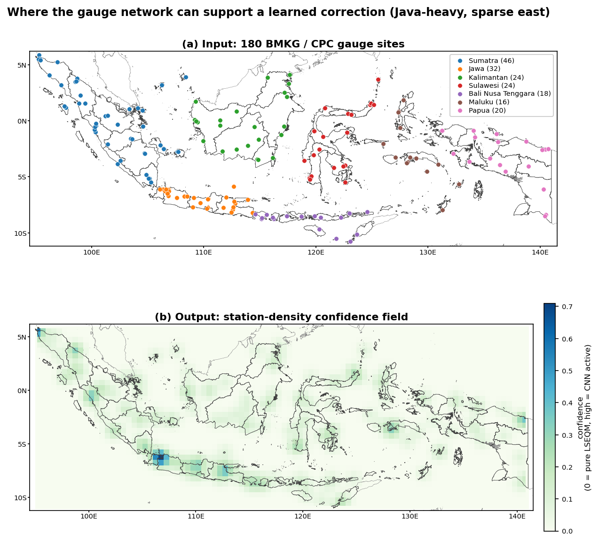
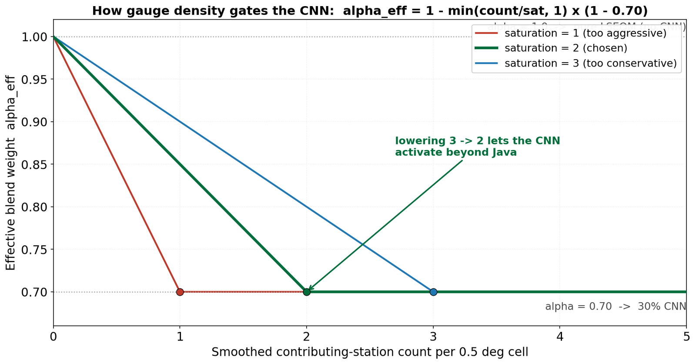
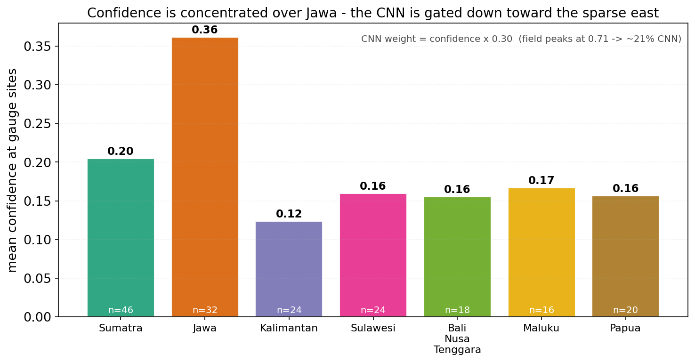

In January I worked out that my network was learning from a reference that is meaningful in some parts of the country and essentially fictional in others. The gauge-interpolated field gives a number everywhere, including places where the nearest contributing station is several hundred kilometres away, and it does not mark which is which.

Train on that and let the result act everywhere at full strength, and the model will confidently invent spatial detail in exactly the regions where its teacher was making things up.

This post is what I built instead.

## The idea

The network gets a per-pixel weight between zero and one, derived from how many gauges are nearby. Where gauges are dense, full weight. Where there are none, zero weight, and the output falls back exactly to the statistical correction underneath.

The model does not get to speak where it cannot be checked.



## How the weight is built

Four steps, none of them clever, which I think is a virtue here.

**Count.** Assign each station to a reference cell and count them.

**Smooth.** Blur the counts with a Gaussian kernel of about one cell, roughly 55 km. Without this you get hard edges at cell boundaries, and a pixel would get full confidence or none depending on which side of an arbitrary line it fell.

**Saturate.** Divide by a saturation parameter and clip at 1.0. This parameter answers "how many nearby stations before I trust this fully", and the default is two.

**Regrid.** Nearest-neighbour onto the working grid, with anything off the edge treated as zero confidence.

That saturation parameter turns out to be the whole argument in one number.



Set it to 1 and any station presence at all gives full confidence, which trusts a single possibly-noisy record completely. Set it to 3 and the network barely contributes outside Java. Set it to 5 and you have effectively disabled the thing you just spent a month building.

Two is a judgement, not an optimum. It is written down in the config where anyone can disagree with it, which is the best I can offer.

## What it does to the blend

The network never gets a fixed share. It gets `confidence * (1 - blend_alpha)`, and with the blend weight at 0.70 that works out as:

| Local confidence | Statistical share | Network share |
|:---:|:---:|:---:|
| 0.0, no stations nearby | 1.00 | 0.00 |
| 0.5, some support | 0.85 | 0.15 |
| 1.0, dense network | 0.70 | 0.30 |

The top row is the one that matters. When confidence is zero the expression collapses to exactly 1.0, and the output is bit-for-bit the statistical correction. Not approximately. The network contributes nothing at all.



And in practice the gate is tighter than the table suggests. Averaged at the gauge sites themselves, confidence peaks around 0.36 over Java and sits between about 0.12 and 0.20 elsewhere. A confidence of 0.36 means the network is contributing roughly 11% of the field even in the best-gauged part of the country. In the east it is a rounding error.

## Is this a correction or an apology

I have gone back and forth on how to describe this honestly.

The uncharitable reading is that I built a neural stage, discovered it could not be trusted, and added a switch that turns it off nearly everywhere while still getting to say the pipeline has deep learning in it.

I do not think that is quite right, but it is close enough that I want to state it rather than hide from it. The defence is that the alternative is worse. A network acting at full strength across the sparse east would produce output that looks more detailed and is less true, and nothing in the verification would catch it, because there are no stations there to catch it with. Confident fabrication in unverifiable regions is the specific failure mode I am most afraid of.

So the honest summary is: the neural stage is a modest refinement in well-observed areas and silent everywhere else, and that is the shape of what the data can support rather than the shape I would have chosen.

There is a broader version of this I keep circling. A model should be able to represent "I do not know". Most architectures have no way to express that, so it has to be imposed from outside, as a gate. That feels like a workaround for something that should be intrinsic, and I do not have a better answer yet.

## The code

Counting, smoothing, saturating, regridding. The mask is computed once and cached, because it depends only on the station network and not on any particular dekad.

::: {.callout-note collapse="true" title="Python - build_confidence_mask, from src/station_density.py"}
```python
def build_confidence_mask(station_file, target_lat, target_lon,
                          cpc_resolution=DENSITY_CPC_RESOLUTION,
                          smoothing_sigma=DENSITY_SMOOTHING_SIGMA,
                          saturation_count=DENSITY_SATURATION_COUNT,
                          lat_range=DENSITY_LAT_RANGE,
                          lon_range=DENSITY_LON_RANGE):
    """
    End-to-end pipeline: CSV -> confidence mask on the working grid.

    Chains:
      load_station_locations -> count_stations_per_cell ->
      compute_confidence_map -> upscale_confidence_to_working_grid.

    Parameters
    ----------
    station_file : str
        Path to station CSV.
    target_lat, target_lon : array-like
        Working grid coordinates (from the IMERG dataset).
    cpc_resolution : float, optional
        CPC native resolution in degrees (default 0.5).
    smoothing_sigma : float, optional
        Gaussian smoothing sigma in grid-cell units (default 1.0).
    saturation_count : float, optional
        Number of (smoothed) stations for full confidence (default 2).
    lat_range, lon_range : tuple of float, optional
        Grid bounds for station counting.

    Returns
    -------
    xarray.DataArray
        Confidence mask on the working grid, values in [0, 1].
    """
    logging.info("Building station density confidence mask...")

    # Step 1: Load station locations
    station_df = load_station_locations(station_file)

    # Step 2: Count stations per CPC cell
    station_counts = count_stations_per_cell(
        station_df, cpc_resolution=cpc_resolution,
        lat_range=lat_range, lon_range=lon_range
    )

    # Step 3: Smooth and normalize to confidence [0, 1]
    confidence_coarse = compute_confidence_map(
        station_counts,
        smoothing_sigma=smoothing_sigma,
        saturation_count=saturation_count
    )

    # Step 4: Upscale to working grid
    confidence_fine = upscale_confidence_to_working_grid(
        confidence_coarse, target_lat, target_lon
    )

    logging.info("Station density confidence mask built successfully.")

    return confidence_fine
```
:::

[`src/station_density.py`](https://github.com/bennyistanto/hybrid-bias-correction/blob/main/src/station_density.py)
