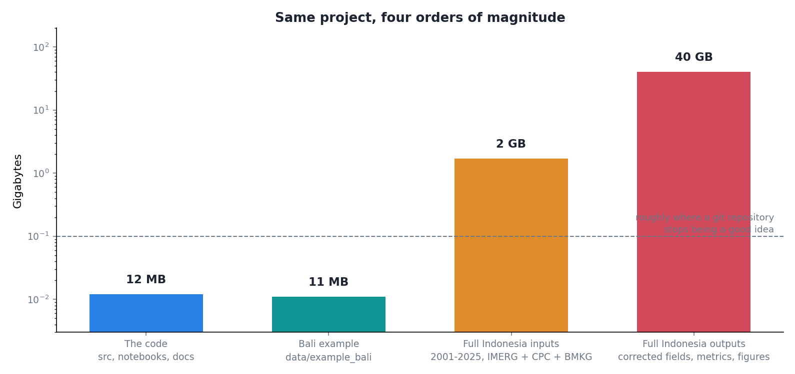

A problem I did not anticipate, which in hindsight was obvious.

The pipeline works. It produces corrected precipitation for Indonesia, 2001 to 2025, daily, on a tenth-degree grid, plus metrics and quality fields and several hundred figures. All of that is the actual result of the work.

None of it can go in the repository.

## The four tiers

**The code** is small. Source modules, seven notebooks, documentation, tests. Twelve megabytes or so, and it is the part git is actually designed for: text, diffed line by line, meaningful history.

**The example dataset** is eleven megabytes, and it is in the repository deliberately. It is a Bali subdomain with everything the pipeline needs, so that someone can clone and run without downloading anything first. Eleven megabytes is a lot for a repository and worth every byte, because "clone this and it works" is a different proposition from "clone this, then find 1.7 GB of inputs somewhere".

**The full inputs** are 1.7 GB. Satellite, gauge analysis, station records, masks, twenty-five years.

**The full outputs** are about 40 GB.

Two orders of magnitude separate the code from the inputs, and another from the outputs. There is no version control system that makes that comfortable, and the ones that try (LFS and friends) mostly move the problem to a bill.

## Where each thing actually goes

The line I settled on: **git holds what a human reads and edits, and everything else goes to an archive with a DOI.**

The code and the small example ship in both, because the Zenodo software release is meant to be a runnable snapshot rather than a pointer at a moving repository. The full inputs and outputs are Zenodo only, in their own deposit, with their own DOI.

That gives two DOIs rather than one, and I went back and forth on whether that was over-engineering. It is not. They are different things with different lifespans. The code will change; the archive that a published number came from must not. Citing "the software" and citing "the data this figure was made from" are different claims, and collapsing them into one identifier loses that.

## The exclusion list is the interesting part

Deciding what to leave out took longer than deciding what to put in, and most of the entries are things that look like content and are not.

The rendered documentation site, which is regenerated from its own sources. A Colab mirror of the code, which will drift from the canonical copy and become a trap. Thesis sources, which live in a different repository. Every LaTeX build artefact. Notebook checkpoints. A scratch directory.

The Colab mirror is the one I would flag to anyone doing this. A stale copy of your own code, shipped in an archive with a DOI, is worse than no copy: it is permanently wrong, it looks authoritative, and someone will eventually run it.

## What this buys

The claim I most wanted the release to support is that the headline numbers can be checked by someone who is not me and does not have institutional compute. The eleven-megabyte example runs the whole pipeline end to end in about 72 minutes on a free Colab CPU tier.

That is the number I care about more than the 40 GB. Anyone can verify the pipeline does what it says in an afternoon, for nothing. The full archive is there for anyone who wants to reproduce the exact published figures, which is a smaller and more determined audience.

## What I would tell myself a year ago

Decide the tiering before you generate 40 GB, not after. I spent a genuinely annoying week working out what was reproducible from what, because the outputs had accumulated organically and nothing recorded which code version produced which file.

That is also why the corrected files now carry the framework version, the git commit, the run timestamp and the parameter values as NetCDF attributes. It costs a few hundred bytes per file and it is the difference between an archive and a pile.
