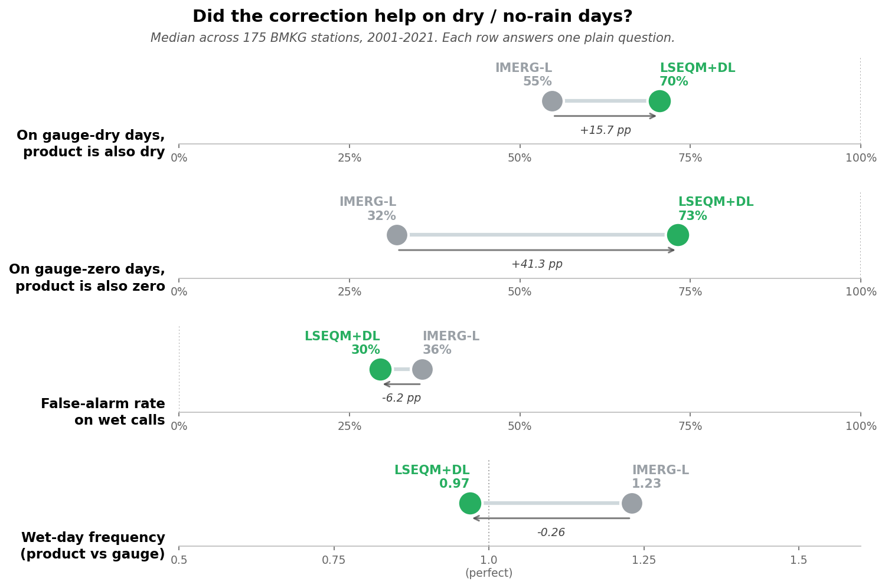
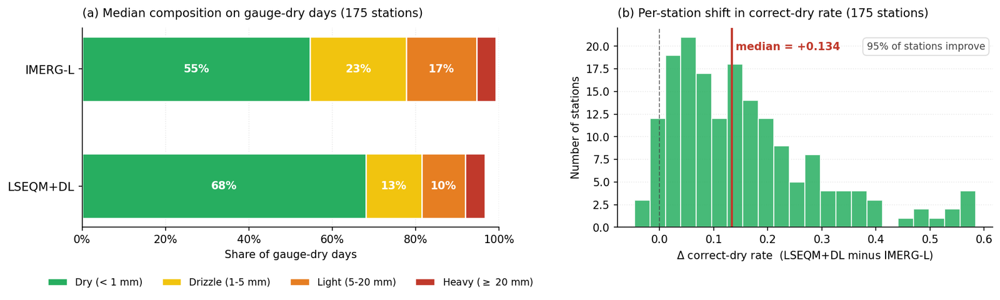
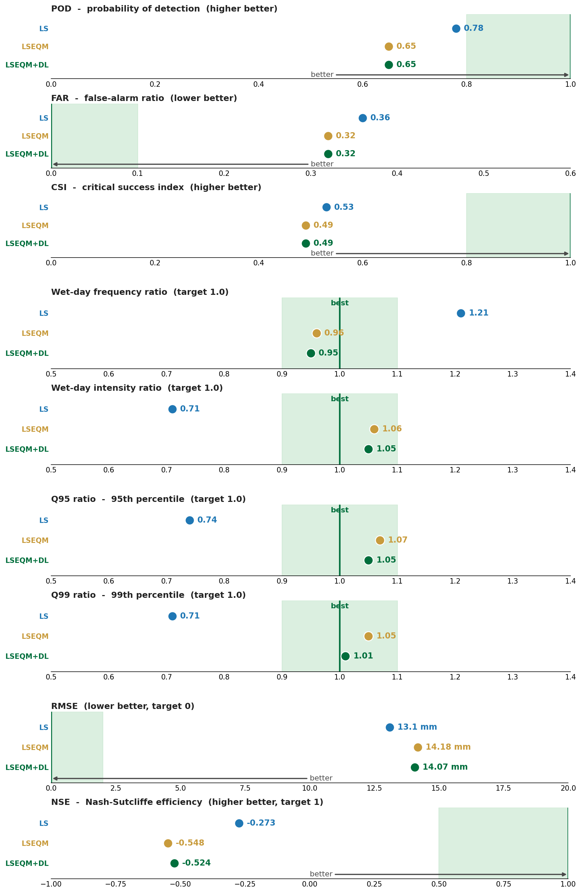

About half the record is dry days. Half the station-days I validate against report a true zero, which makes "did it correctly say nothing happened" as important as anything the correction does to the wet days.

Raw satellite is bad at this. It rains too often. Not by much on any given day, but a persistent drizzle where the gauge recorded nothing, over and over, across the whole record.

## What the correction does about it

The quantile mapping stage matches the corrected product's dry-day fraction to the reference. In practice that means the smallest over-detected wet values, the ones sitting below where the reference says dry days should end, get reclassified to zero.

The result is the largest single improvement anywhere in this project.

On days when the gauge reports a true zero, the raw satellite also reports zero **32%** of the time. After the full correction, **73%**.

Taking the median across the 175 stations with usable overlap, the improvement in correct-dry rate is +0.134, and 95% of stations get better. I have not found another change in this pipeline that moves that many stations in the same direction.

The wet-day frequency ratio tells the same story from the other side: the raw product rains on about 1.23 days for every day the gauge does, and after correction that lands near 0.97. From over-detecting by a fifth to very slightly under-detecting.

## And now the part I would rather not report

Probability of detection falls from about 0.78 to 0.65.

That is the same change. Not a side effect in a different part of the pipeline, not a separate parameter I could tune independently. The operation that suppresses false drizzle is the operation that loses light-rain hits, because from inside the algorithm those two things are indistinguishable. A small non-zero value where the gauge says dry, and a small non-zero value where the gauge says a millimetre fell, look identical in a distribution.

Push the threshold to catch fewer false alarms and you will drop more real light rain. Push it the other way and you get the drizzle back. There is no setting that gives you both.

Two more go the wrong way, and unlike detection these are not a trade I chose.

The clearest way I have found to look at all of this at once is a single scorecard: nine metrics, three stages of the pipeline, and a green band showing where each number is supposed to land. These are the pooled national numbers rather than the per-station medians above, so they shift by a point or two either way.

Read down the blue dots and you get a fair summary of what the extra machinery is for. Linear scaling holds two of the three detection rows, hit rate and critical success index, and the two squared-error rows at the bottom. It loses false-alarm ratio, which is the whole point of the trade: fewer false alarms bought with fewer hits. Everything between, wet-day frequency, wet-day intensity, the 95th and 99th percentiles, belongs to the later stages by a wide margin. 0.71 against 1.05 on wet-day intensity is not a close call.

The bottom two rows are the ones I want to name explicitly, because they are easy to leave out of a summary table. Measured against the gauge analysis the correction is fitted to, root-mean-square error rises from 13.1 mm under linear scaling alone to 14.18 mm once quantile mapping is applied, and Nash-Sutcliffe efficiency falls from -0.273 to -0.548. By those two measures, the simplest stage in the pipeline is the best one.

The reason is not mysterious once you look at what quantile mapping does. Linear scaling shrinks the satellite's spread; the corrected values cluster nearer the mean, and clustering near the mean is a good way to keep squared error down. Quantile mapping undoes that, deliberately, because a product whose variance is too small under-reports every extreme. It puts the spread back. On the days when satellite and gauge disagree about what happened, a value with the right spread is further from the gauge than a value hedged toward the middle, and the squared-error metrics record that as a loss.

So there are two honest sentences here and they sit uncomfortably together. The distributions match the reference far better after quantile mapping. The day-by-day errors are larger. Both are true, and which one you quote decides what your paper appears to show.

## Which one you want depends on what you are doing

For drought monitoring, the dry-day improvement is the one that matters and the detection loss is close to irrelevant. A product that invents light rain during a dry spell will under-report the dry spell, which is precisely the failure that makes a drought index useless. Getting the zeros right is the whole job.

For flood work it is the other way around. Missing a third more light-rain events matters, and the false-alarm rate you were tolerating was a price worth paying.

So the honest statement is not "the correction improves dry-day performance". It is "the correction trades detection for dry-day accuracy, at roughly this exchange rate, and whether that is a good trade depends on your application".

## Why I am writing this down

The temptation to report only the first half is strong, and it would not even be dishonest by the standards of most method papers. The dry-day gain is real, large, and consistent across stations. It would make a good headline on its own.

But it would leave a user to discover the detection cost themselves, probably after building something on top of the product, and they would be right to be annoyed.

This is also why probability of detection is reported separately rather than folded into the composite quality score. If it went into a weighted average alongside seven metrics that improved, the average would go up and the trade would vanish. Kept out, it has to be looked at.

I wrote that design decision down last November as a general principle, before I knew what it would catch. This is the first time it has caught something, and I am glad it was there.
