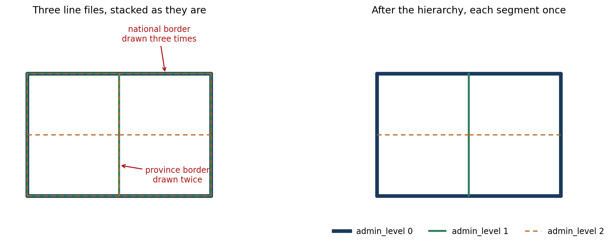
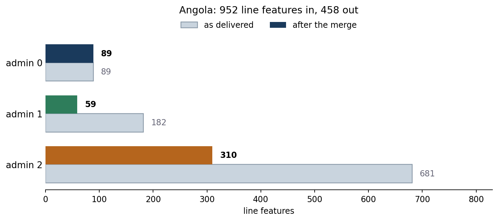
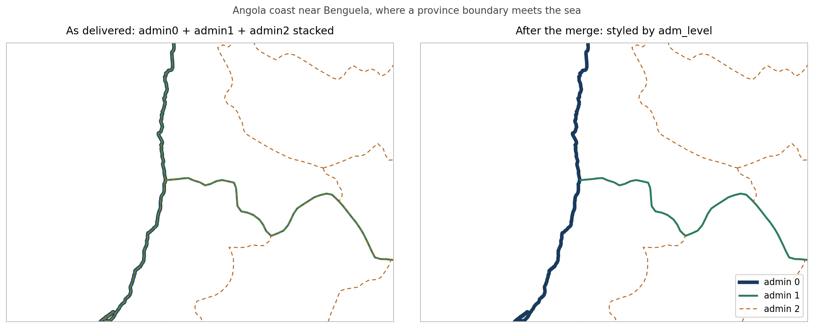

If you make maps with administrative boundaries, you have probably hit this.

You have three line files: admin0 for countries, admin1 for provinces, admin2 for districts. You load all three, give each a different width, and the result looks wrong along the national border.

The reason is simple once you see it. Each file holds every boundary at that level, including the ones it shares with the level above. A province on the coast has the coastline as one of its edges. A district on the border has the national border as one of its edges. So the national border sits in all three files, and your map draws it three times.



On the left, admin0 is drawn thick, then admin1 over it, then admin2 dashed on top. The dashes now run along the national border, because the outermost line got drawn by all three layers and the last one wins. Change any width or dash pattern and the artefact moves somewhere else.

You can fight this in the layout. Draw admin2 first, admin1 second, admin0 last, and hope the thick line covers the thin ones. It works until you want a dashed district border, or a halo, or any style where the top layer does not fully hide what is under it.

Better to fix the data.

## The rule

One pass, three levels, highest wins:

- admin0 is kept whole
- admin1 keeps only the parts that are not already in admin0
- admin2 keeps only the parts that are not already in admin0 or admin1

Everything goes into one shapefile with an `admin_level` column holding 0, 1 or 2. Then you style by attribute, one rule per level, and every segment is drawn exactly once.

That last part is the real benefit. Line width, stroke, dash pattern, colour: you set them once per level and nothing overlaps, so nothing fights.

## Then it returned nothing

I wrote the function, ran it on Angola, and got this:

```
Original Admin0 features: 89
Original Admin1 features: 169
Original Admin2 features: 681
Final Admin0 features: 0
Final Admin1 features: 0
Final Admin2 features: 0
Total features in output: 0
```

No error. No warning. It read 939 features, did its work, and wrote an empty shapefile.

So I wrote a diagnostic cell that checked every step separately. Read the files: 89, 169, 681, all valid. Add the `admin_level` column: fine. Concatenate admin0 on its own: 89 features. Convert back to a GeoDataFrame: 89 features, 89 valid, 0 empty. Concatenate admin0 and admin1: 258 features, 258 valid.

Every step passed. The pipeline still produced nothing.

## What was actually wrong

The culprit was a cleaning helper I had added without thinking:

```python
def clean_geometry(gdf):
    gdf = gdf.copy()
    gdf['geometry'] = gdf['geometry'].buffer(0)
    gdf = gdf[gdf.is_valid]
    return gdf
```

`buffer(0)` is a well-known trick for repairing broken polygons. Give it a self-intersecting polygon and it returns a clean one. I have used it for years and it has never let me down.

But this is line data, not polygon data. A line has no area. Buffer it by zero and you get an empty polygon:

```python
>>> LineString([(0,0),(1,1),(2,0)]).buffer(0)
POLYGON EMPTY
```

Every geometry was destroyed on the first line of the helper.

And here is why the diagnostics did not catch it. An empty polygon is still a **valid** geometry. So `gdf[gdf.is_valid]` kept every row, and my check reported `Admin0 after buffer(0): valid = 89`, which looks like a pass. The rows survived. The geometry inside them did not. Only at the end, where the code also filtered on non-empty, did everything disappear at once.

A validity check told me the data was fine while the data was already gone.

## The version that works

Drop the cleaning step, work on the lines directly, and use `difference()` against the union of the higher levels:

```python
admin0_union = unary_union(admin0.geometry)

for idx, row in admin1.iterrows():
    geom = row.geometry
    if not geom.intersects(admin0_union.buffer(buffer_distance)):
        keep(row)                       # nothing shared, keep it whole
    else:
        diff = geom.difference(admin0_union.buffer(buffer_distance))
        if diff and not diff.is_empty:
            keep(row, geometry=diff)    # keep the part that is not shared
```

Then repeat for admin2 against the union of admin0 plus what survived from admin1.

The small buffer is there because two files that describe the same border rarely store identical coordinates. Shared vertices drift by tiny amounts between datasets, so an exact `intersects` misses most of the overlap. A buffer of about `1e-6` degrees, roughly ten centimetres, catches it. Too large and you start eating real borders, so it is worth checking the output rather than trusting the default.

On Angola:



952 features in, 458 out. Admin0 keeps all 89, admin1 drops from 182 to 59, admin2 from 681 to 310. Measured by line length rather than feature count, 41 per cent of the drawing disappears, because that much of it was a second or third copy of a border already there.

Here is what that looks like on the real data, on a stretch of coast near Benguela where a province boundary runs inland from the sea:



On the left, the coastline is navy with a green fringe, because admin1 draws it too, and the province boundary running east has orange dashes sitting on top of the green. On the right, the coast is admin0 alone, the province boundary is admin1 alone, and only the genuine district boundaries are dashed.

I also checked the result rather than trusting it. Of the admin1 and admin2 lines that survive, **zero** length remains within the tolerance of an admin0 line. At the tolerance it was given, the merge is clean.

## Two things worth remembering

**`buffer(0)` is a polygon idiom.** On lines it is not a no-op and it is not a repair. It is a delete. If you keep a geometry-cleaning helper in your toolkit, check what geometry type it is being handed.

**Valid is not the same as present.** `is_valid` answers a narrow question about topology. It has no opinion about whether there is anything left. When a pipeline empties out, check `is_empty` as well, and check it early rather than at the end.

The other small annoyance: shapefiles truncate field names at ten characters, so `admin_level` comes back as `admin_leve`. That is why the working version calls the column `adm_level`, which is nine characters and survives the round trip. Or use GeoPackage and stop thinking about it.

## The whole thing

Here is the function as it ended up. It takes three line shapefiles, writes one, and adds the `adm_level` column you style by. No cleaning helper anywhere near it.

::: {.callout-note collapse="true" title="Python - merge_admin_boundaries"}
```python
import geopandas as gpd
import pandas as pd
from shapely.ops import unary_union


def merge_admin_boundaries(admin0_path, admin1_path, admin2_path, output_path,
                           buffer_distance=0.000001):
    """
    Merge admin0/1/2 boundary lines, dropping anything already drawn
    by a higher level.

    buffer_distance is in map units. For EPSG:4326 use about 1e-6
    (roughly 10 cm); for a metric CRS use 0.1 to 1.0 metres.
    """
    admin0 = gpd.read_file(admin0_path)
    admin1 = gpd.read_file(admin1_path)
    admin2 = gpd.read_file(admin2_path)
    print(f"in: admin0={len(admin0)}, admin1={len(admin1)}, admin2={len(admin2)}")

    # One CRS for everything, taken from admin0.
    if admin1.crs != admin0.crs:
        admin1 = admin1.to_crs(admin0.crs)
    if admin2.crs != admin0.crs:
        admin2 = admin2.to_crs(admin0.crs)

    # 9 characters, so it survives the shapefile 10-character field limit.
    admin0['adm_level'] = 0
    admin1['adm_level'] = 1
    admin2['adm_level'] = 2

    features = []

    def add(row, geometry=None):
        d = row.to_dict()
        if geometry is not None:
            d['geometry'] = geometry
        features.append(d)

    # Admin0 is the top of the hierarchy, so it is kept whole.
    for _, row in admin0.iterrows():
        add(row)

    def subtract(gdf, higher_union, label):
        """Keep only the parts of gdf that higher_union does not already cover."""
        pad = higher_union.buffer(buffer_distance)
        kept = 0
        for _, row in gdf.iterrows():
            geom = row.geometry
            if geom is None or geom.is_empty:
                continue
            if not geom.intersects(pad):
                add(row)                      # nothing shared, keep it all
                kept += 1
                continue
            diff = geom.difference(pad)       # keep only the unshared part
            if diff is not None and not diff.is_empty:
                add(row, geometry=diff)
                kept += 1
        print(f"{label} kept: {kept}")

    subtract(admin1, unary_union(admin0.geometry), 'admin1')

    # Admin2 is measured against admin0 plus whatever admin1 had left.
    so_far = unary_union([f['geometry'] for f in features])
    subtract(admin2, so_far, 'admin2')

    merged = gpd.GeoDataFrame(features, crs=admin0.crs)
    merged = merged[~merged.geometry.is_empty & merged.geometry.notna()]
    merged.to_file(output_path)

    print(f"out: {len(merged)} features -> {output_path}")
    for lvl in (0, 1, 2):
        print(f"  adm_level {lvl}: {(merged['adm_level'] == lvl).sum()}")
    return merged


if __name__ == '__main__':
    merge_admin_boundaries(
        admin0_path='bnd/WB_GAD_ADM0_AGO_line.shp',
        admin1_path='bnd/WB_GAD_ADM1_AGO_line.shp',
        admin2_path='bnd/WB_GAD_ADM2_AGO_line.shp',
        output_path='bnd/WB_GAD_ADM_AGO_line_hierarchical.shp',
        buffer_distance=0.000001,
    )
```
:::

Two things to change for your own data. The `buffer_distance` depends on your CRS, and it is worth running once and looking at the output before trusting it. And if your files have useful attributes, they carry through untouched, since each row is copied as a dictionary and only the geometry is replaced.
