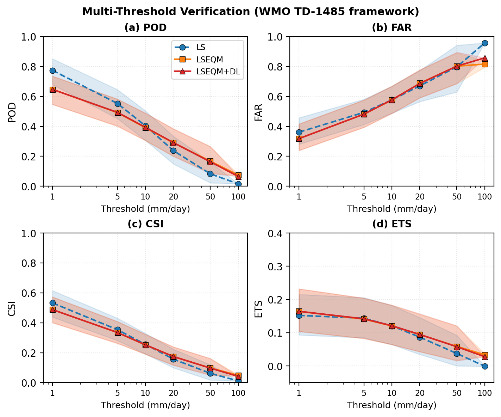
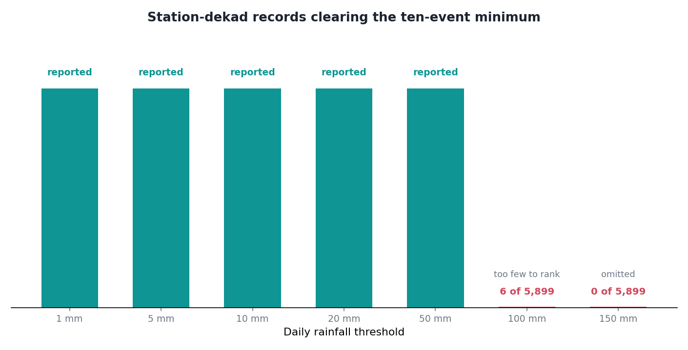
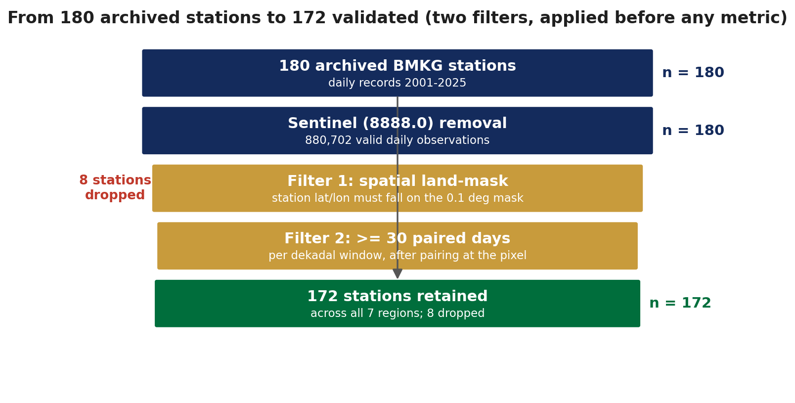

The detection scores get evaluated at seven rainfall thresholds: 1, 5, 10, 20, 50, 100 and 150 mm per day. Seven thresholds, so seven points on the curve.

The curve has five points.

For a while I assumed this was a plotting bug and went looking for it. It is not a bug. It is the verification framework refusing to answer, and working out why turned into the most useful thing I learned about my own evaluation this year.



## The rule that stops it

Detection metrics are built from counting events. Did the gauge see rain above the threshold, did the product, and how often did they agree. Probability of detection, false alarm ratio, critical success index: all of them are ratios of counts.

Counts get unstable when they are small. A probability of detection computed from two observed events is either 0.0, 0.5 or 1.0, and none of those numbers means anything.

So the framework follows the WMO verification guidance and writes NaN whenever a station has fewer than ten observed events above the threshold in the evaluation window. Not a low score. No score.

## How hard that bites



On the Bali example, with four stations, this was easy to dismiss. Four stations over twenty years simply never accumulate ten days above 100 mm inside a single ten-day window of the year. Of course the upper thresholds are empty. Get more stations.

So I ran the full national validation. A hundred and seventy-two stations, twenty-one years, 5,899 station-dekad records.

That figure of 172 is itself the same rule applied one level up. The archive holds 180 stations. Eight of them never reach the evaluation: some fall outside the land mask once you place their coordinates on a 0.1 degree grid, and some never accumulate thirty paired days inside a single dekadal window.



Neither filter is about rainfall. Both are about whether there is enough overlap between two records to compare them at all, which is the same question the ten-event rule asks, asked earlier.

At 100 mm, **six** of those 5,899 records clear the ten-event minimum. Six. And their median critical success index is 0.000 for both methods, which is enough to plot a point and not remotely enough to say one method beats the other.

At 150 mm, nothing qualifies at all. The class is omitted entirely.

That was the part I had not expected. Going from four stations to a hundred and seventy-two, from one small island to the whole archipelago, did not rescue the upper thresholds. It bought resolution *below* 50 mm, where there were already plenty of events, and changed nothing above it.

## Why more data did not help

Because the constraint is not the number of stations. It is the joint requirement: ten events, above 100 mm, at one station, inside one specific ten-day window of the year.

Adding stations adds records. It does not make any individual station-dekad wetter. A place that gets one or two 100 mm days in a given dekad across two decades still has one or two, no matter how many other places you also measure.

To fill the upper thresholds you would need a longer record, a wetter climate, or a fundamentally different evaluation unit. Not more of the same.

## The temptation

There is an obvious workaround. Lower the minimum from ten events to three. The curve extends to 150 mm, the figure looks complete, and nobody asks why it stops.

I did not do it, and the reason is that the resulting points would not be less certain, they would be *meaningless* while looking exactly as authoritative as the well-supported ones. A reader scanning the figure has no way to tell that the leftmost point rests on thousands of events and the rightmost on three. Same marker, same line, same axis.

An honest gap communicates something a dishonest point does not.

## What it actually says

The uncomfortable reading, and I think the correct one: **I cannot tell you whether this correction improves extreme rainfall detection above 50 mm**, because the observing network does not contain enough extreme events, at enough places, at enough times, to support the claim.

That is not a limitation of the method. It is a limitation of what can be known from the available observations, and it would apply to any method evaluated against this network.

Which is worth separating out. "My correction does not improve heavy rainfall detection" and "nobody can demonstrate whether any correction improves heavy rainfall detection here" are very different statements, and only the second one is supported.

The gap in the graph is the honest version of that sentence.

## The code

The rule is four lines in the middle of the scoring function. Count the observed events at each threshold, compare against the minimum, and write the sentinel where it is not met. Everything downstream, including the figure, just respects the NaN.

::: {.callout-note collapse="true" title="Python - compute_multi_threshold_metrics, from src/station_validation.py"}
```python
def compute_multi_threshold_metrics(obs_df, gridded_df,
                                    thresholds=None):
    """
    Compute WMO-compliant categorical verification at multiple precipitation
    thresholds for each station.

    For each station and each threshold, builds the 2x2 contingency table
    and derives POD, FAR, CSI, FBI, ETS, HSS, and HK following
    WMO/TD-No. 1485 (WWRP 2009-1).

    Thresholds where a station has fewer than ``MIN_EVENTS_FOR_VERIFICATION``
    observed events are flagged with NaN (per WMO/TD-1485 guidance).

    Parameters
    ----------
    obs_df : pandas.DataFrame
        Station observations (DatetimeIndex, WMO station ID columns).
    gridded_df : pandas.DataFrame
        Gridded values at stations (DatetimeIndex, WMO station ID columns).
    thresholds : sequence of float, optional
        Precipitation thresholds in mm/day. Default: ``WMO_THRESHOLDS``
        (1, 5, 10, 20, 50, 100, 150).

    Returns
    -------
    pandas.DataFrame
        Per-station multi-threshold metrics. Rows = station WMO IDs,
        Columns = ``{metric}_{threshold}mm`` (e.g., ``pod_20mm``,
        ``csi_50mm``, ``ets_100mm``). Also includes ``n_valid_days``.
    """
    if thresholds is None:
        thresholds = WMO_THRESHOLDS

    common_stations = sorted(set(obs_df.columns) & set(gridded_df.columns))
    logging.info("Computing multi-threshold metrics (%d thresholds) for "
                 "%d stations", len(thresholds), len(common_stations))

    results = []
    skipped = 0

    for wmo_id in common_stations:
        obs_ts = obs_df[wmo_id]
        grid_ts = gridded_df[wmo_id]

        # Align to common valid dates
        common_idx = obs_ts.dropna().index.intersection(grid_ts.dropna().index)
        if len(common_idx) < _min_valid_days():
            skipped += 1
            continue

        ref_1d = obs_ts.loc[common_idx].values.astype(np.float64)
        test_1d = grid_ts.loc[common_idx].values.astype(np.float64)

        row = {'station_id': wmo_id, 'n_valid_days': len(common_idx)}

        for thr in thresholds:
            a, b, c, d, N = _compute_contingency_table(ref_1d, test_1d, thr)
            scores = _compute_threshold_scores(a, b, c, d, N)

            # WMO/TD-1485: suppress scores when observed events < 10
            n_obs_events = int(a + c)
            insufficient = n_obs_events < MIN_EVENTS_FOR_VERIFICATION

            suffix = f"_{int(thr)}mm"
            for metric_name in MULTI_THRESHOLD_METRIC_NAMES:
                value = scores[metric_name]
                # Keep n_events and freq_obs even when insufficient
                if insufficient and metric_name not in ('n_events', 'freq_obs',
                                                         'freq_prd'):
                    value = np.nan
                row[metric_name + suffix] = value

        results.append(row)

    if skipped > 0:
        logging.info("Skipped %d stations with < %d valid paired days",
                     skipped, _min_valid_days())

    if not results:
        logging.warning("No stations had sufficient data for multi-threshold "
                        "verification")
        return pd.DataFrame()

    mt_df = pd.DataFrame(results).set_index('station_id')
    logging.info("Multi-threshold metrics computed for %d stations",
                 len(mt_df))

    return mt_df
```
:::

[`src/station_validation.py`](https://github.com/bennyistanto/hybrid-bias-correction/blob/main/src/station_validation.py)
