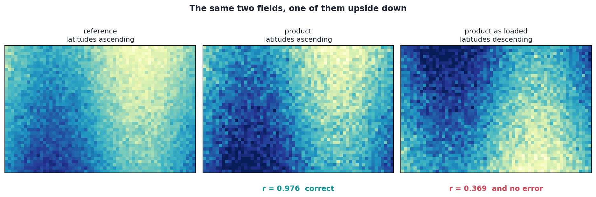
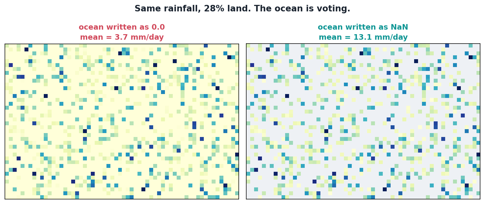

A crash is a gift. It tells you where, roughly when, and that anything is wrong at all.

None of these five did that. Every one ran to completion, wrote a valid file, and reported a number in the range you would expect.

| # | Symptom | Actually |
|:--|---|---|
| 1 | correlation of 0.369 | the grids were upside down |
| 2 | mean rainfall of 3.7 mm/day | the ocean was voting |
| 3 | tail parameters look fine | cross-validation had quietly stopped |
| 4 | training stops at epoch 5 | 50 validation samples |
| 5 | a blank strip on the map edge | `interp` is not `reindex` |

## 1. The grids were upside down

**Symptom.** A correlation of 0.369 between satellite and reference.

**Cause.** The gauge product stores latitude descending, north to south. The satellite stores it ascending. Both are valid NetCDF; neither declares the other wrong. Load both, compare cell by cell without aligning, and every calculation runs because the arrays are the same shape.



Correctly aligned those two fields correlate at 0.976. Flipped, 0.369.

**Why it is dangerous.** Not zero, not negative, not obviously broken. **0.369 is almost exactly what the literature reports for daily satellite rainfall against Indonesian gauges.** I could have put it in a paper and a reviewer would have nodded.

**Fix.** Align explicitly, every time, rather than trusting two agencies to agree about which way is up. Two modules now re-check on every dataset they open, which is redundant, and which I am keeping.

## 2. The ocean was voting

**Symptom.** A domain mean that looked plausible and was a third of the truth.

**Cause.** Ocean cells written as `0.0` instead of `NaN`. Every spatial mean then silently includes them.



Same field, 28% of it land:

| Ocean written as | Domain mean |
|---|---|
| `0.0` | 3.74 mm/day |
| `NaN` | 13.12 mm/day |

**Why it is dangerous.** A bias correction driven by ratios of means will happily compute a scale factor from that, pulling every land pixel towards a target diluted by open water.

**Fix.** Ocean is `NaN` throughout, never zero, so `nanmean` does the right thing without anyone having to remember. Watch for a corrected mean that looks suspiciously low.

## 3. The cross-validation quietly stopped

**Symptom.** None whatsoever.

**Cause.** The tail fit is cross-validated across five folds. If a cell has fewer exceedances than there are folds, the function falls back to a single fit on the whole sample and returns those parameters.

**Why it is dangerous.** The fallback is reasonable. The silence is not. No warning, no flag on the output, no way to know afterwards which cells were cross-validated and which were not. They are not equally trustworthy and the file cannot tell you which is which. In a strongly seasonal climate it bites hardest in the peak dry-season dekads, where exceedances are thinnest.

**Fix.** Not fully solved. I do not think the fallback is wrong; I think a silent fallback is wrong. If a function quietly does something other than what its name says, the output should carry a mark.

## 4. Training stopped at epoch five

**Symptom.** Early stopping fired almost immediately, every run, with a visibly noisy validation curve.

**Cause.** Arithmetic, not the model. Twenty-five years times ten days is 250 samples. A 20% validation split leaves 50. Validation loss on 50 samples bounces enough that early stopping sees a plateau that is not there.

**Fix.** The patience setting was wrong for the sample size, and had been since the first run. Nothing was broken.

## 5. The edges came back empty

**Symptom.** A blank strip along the southern and western edge of small regions, invisible unless you look at a map of the output.

**Cause.** Two variants. The first is floating point: mask coordinates in float64, data in float32, and the float32 boundary value sits fractionally outside the float64 range. The second is geometric: `interp(method='nearest')` returns NaN outside the convex hull of the source cell centres, so if the coarse reference does not extend past the region boundary, the edge falls outside the hull.

**Fix.** The same in both cases, and the distinction is worth knowing:

> `reindex(method='nearest')` is a pure label lookup with no convex-hull restriction.
> `interp(method='nearest')` is interpolation that happens to pick the nearest point.

They sound interchangeable. They are not.

## The pattern

Four of the five produced a number in the plausible range. The fifth produced an empty edge on a map nobody looks at closely.

Two rules came out of it.

**Be suspicious of results that are only slightly surprising.** A wildly wrong answer announces itself. An answer off by a factor you could rationalise is the one that ends up in a paper.

**Fallbacks should be loud.** Every one of these except the latitude flip was code doing something defensible in a hard case and not mentioning it. Defensible and silent is a bad combination.

## The code that stops two of them

The alignment helper, which is now the only sanctioned way to put the two grids on the same axes, and the mask application that keeps ocean as NaN rather than zero.

::: {.callout-note collapse="true" title="Python - reindex_and_align_with_monotonicity, from src/utility.py"}
```python
def reindex_and_align_with_monotonicity(
        reference_ds,
        secondary_ds,
        land_sea_mask
    ):
    """
    Reindex and align the secondary dataset with a reference dataset while ensuring
    the reference dataset has a strictly monotonic, duplicate-free time index.

    Parameters
    ----------
    reference_ds : xarray.Dataset
        The reference dataset (e.g., IMERG) to which we'll align.
    secondary_ds : xarray.Dataset
        The secondary dataset (e.g., CPC) that needs alignment.
    land_sea_mask : xarray.DataArray
        Land-sea mask for spatial alignment.

    Returns
    -------
    tuple(xarray.Dataset, xarray.DataArray)
        The aligned secondary dataset and a spatially aligned land-sea mask.
    """
    # Ensure strict monotonicity in time for both datasets
    reference_ds = ensure_strict_monotonic_time(reference_ds)
    secondary_ds = ensure_strict_monotonic_time(secondary_ds)

    # Reindex and align secondary dataset to the reference dataset
    secondary_ds_aligned = secondary_ds.reindex_like(reference_ds, method='nearest')

    # Align land-sea mask spatially with the reference dataset
    land_sea_mask_aligned = land_sea_mask.interp(lat=reference_ds.lat, lon=reference_ds.lon, method='nearest')

    return secondary_ds_aligned, land_sea_mask_aligned
```
:::

::: {.callout-note collapse="true" title="Python - apply_land_sea_mask, from src/utility.py"}
```python
def apply_land_sea_mask(
        data,
        mask_file,
        mask_var=None
    ):
    """
    Apply the land-sea mask to the input dataset.

    Uses cached mask to avoid repeated file I/O. The mask is interpolated
    (nearest-neighbor) to match the data resolution if needed.

    Parameters:
    ----------
    data : xarray.DataArray or xarray.Dataset
        The data to which the land-sea mask should be applied.
    mask_file : str
        Path to the NetCDF file containing the land-sea mask.
    mask_var : str, optional
        Variable name for the land mask. If None, uses config.MASK_VAR.

    Returns:
    ----------
    xarray.DataArray or xarray.Dataset
        The data with the land-sea mask applied (ocean pixels set to NaN).
    """
    # Load mask from cache
    land_sea_mask = load_mask(mask_file, mask_var)

    # Align the mask to the data grid. Use reindex(method='nearest') rather
    # than interp(method='nearest'): reindex is a pure lookup tolerant of
    # small numerical differences in coordinate values, while interp goes
    # through scipy and returns NaN for any target outside the mask's
    # coordinate range. The latter silently drops the southernmost row and
    # westernmost column when data and mask coords differ in dtype (e.g.
    # data is float32, mask is float64), because the float32 representation
    # of the boundary value is slightly outside the float64 range.
    land_sea_mask_reindexed = land_sea_mask.reindex(
        lat=data.lat, lon=data.lon, method="nearest"
    )

    # Apply the mask: set ocean pixels to NaN (not drop)
    # Using drop=False preserves the grid structure while marking ocean as NaN
    masked_data = data.where(land_sea_mask_reindexed == 1)

    return masked_data
```
:::

[`src/utility.py`](https://github.com/bennyistanto/hybrid-bias-correction/blob/main/src/utility.py)
