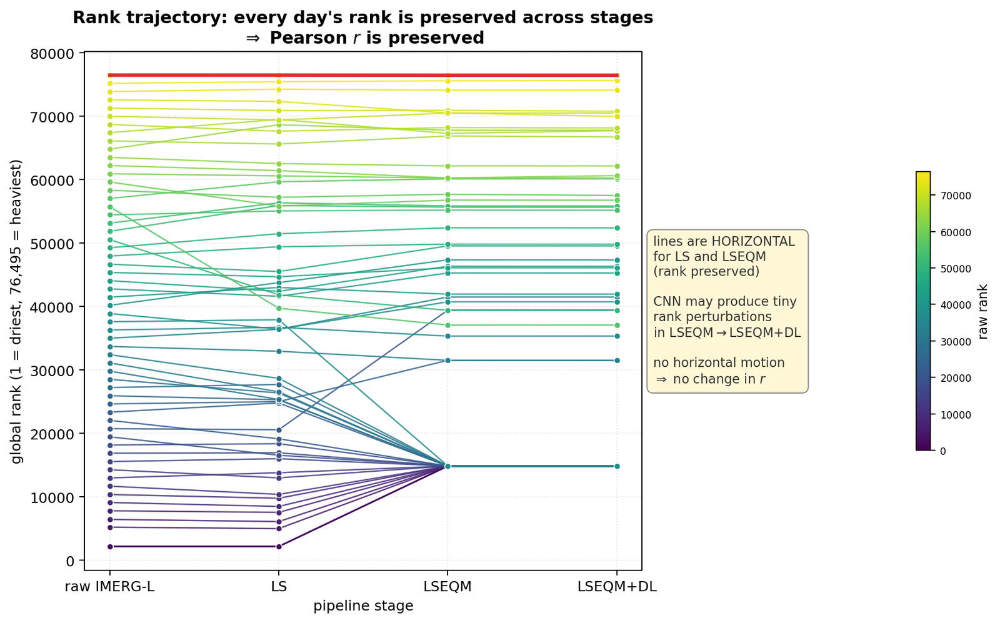
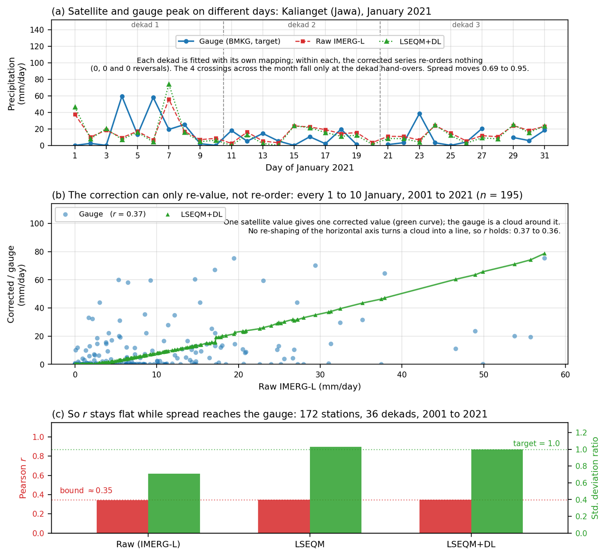
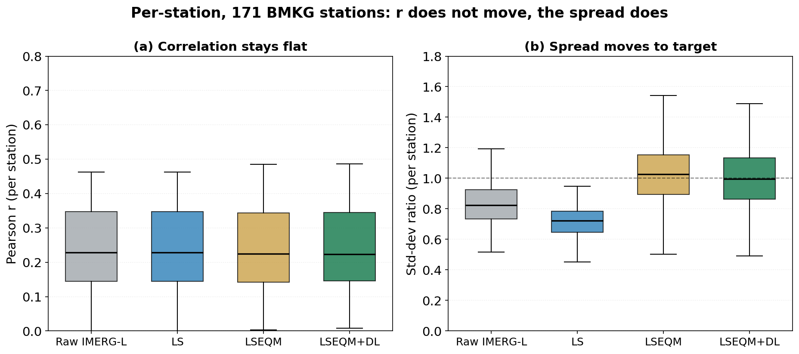
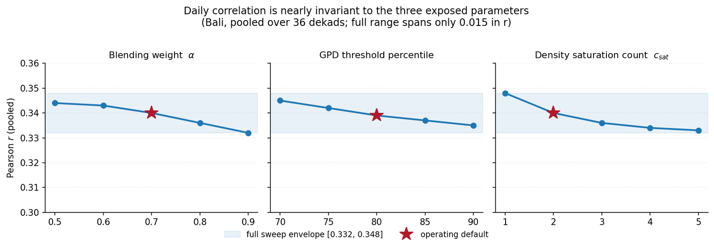

Everything else improved. The mean is right. The distribution matches. Dry days went from 32% correct to 73%. The extremes are no longer flattened.

Daily correlation has not moved at all.

I have been treating that as a problem to solve for most of this year, on the assumption that I was doing something wrong. I now think it is not a problem, in the sense that no amount of doing it better would change it, and I want to write down why because it took me an embarrassingly long time to see.

## The thing I should have noticed immediately

Quantile mapping is monotone. Given two values from the same cell and the same ten-day window, if the satellite says day 4 was wetter than day 6 before the correction, it says exactly the same thing afterwards. The correction changes what the numbers are. It never changes their order.

That is not an implementation detail I could fix. It is what quantile mapping *is*. A monotone transformation is precisely a function that preserves rank.

And Pearson correlation, against an independent series, is mostly a question about ordering. Whether the two series go up and down together on the same days. If the ordering of one series is fixed before you start, the correlation is very nearly fixed too.

Tracing every day's rank through all four stages, the lines are almost perfectly horizontal. The scaling stage introduces no reversals. The quantile mapping introduces none either, dry-day ties aside. The neural stage adds tiny perturbations and nothing more.

The whole pipeline is a machine for moving values without moving days.

## Watching it happen on one station

The clearest example is a single January at Kalianget. The gauge has its wettest days on the 4th and the 6th; the satellite has its wettest on the 7th. The correction is fitted per dekad, so three different mappings apply across that month, and the only places where the corrected series crosses the raw one are the dekad hand-overs. Four crossings in thirty-one days.

Meanwhile the spread moves decisively towards the gauge, from 0.69 to 0.95. The magnitudes are being fixed. The days are not.

Widen to every 1 to 10 January across the whole record, 195 days under a single mapping, and corrected-against-raw is a near-monotone rising curve while the gauge sits around it as a cloud. Correlation goes from 0.368 to 0.357.

Slightly down. Well inside noise. That is the answer, and it is the same answer everywhere I look.

Which is a claim worth putting a number on rather than asserting. Pooling every station and plotting the two quantities side by side gives the cleanest statement of the whole problem I have managed.

The left panel is four boxes at the same height. Median correlation sits at 0.23 before the correction and 0.22 after it, and the quartiles barely twitch. The right panel is the same stations, the same four stages, and the boxes walk up to the dashed line at 1.0 where the standard deviation ratio should be: 0.82 raw, 0.72 after scaling, then 1.03 and 1.00.

Same code, same run, same stations. One thing the correction was built to fix, and one thing it structurally cannot.

## The fifteen attempts

Before accepting a theoretical argument I wanted to be sure I had not simply chosen bad parameters. So: fifteen combinations of the three settings that most plausibly affect this, swept across their sensible ranges.

Correlation stayed within [0.332, 0.348] across all fifteen.

Not "improved slightly for the best setting". Not "one configuration stood out". A band of 0.016, which is smaller than the difference between two adjacent dekads of the same run.

The parameter surface is not flat in general. Those settings move other things meaningfully. They just do not move this, because this is not the sort of thing they can move.

## What I think this means

There are two distinct claims and I had been running them together.

**A marginal correction fixes the marginal distribution.** That is what it says on the tin, and it does it well. Every number describing what the rainfall at a pixel looks like as a population is better after correction.

**Nothing about a marginal correction addresses the joint behaviour with an independent series in time.** Correlation is a joint property. It asks about pairing. And the pairing is inherited wholesale from the satellite, fixed before my code runs.

So reporting flat correlation next to large distributional gains is not an awkward result to be explained away. It is the signature of a marginal correction behaving exactly as a marginal correction behaves.

## The part that still bothers me

I can now explain why correlation does not improve. I cannot explain why it is *0.35 in the first place*.

The bound says a marginal correction cannot lift the timing skill of the underlying retrieval. Fine. But it says nothing about where that underlying level should sit. Published work on this region reports daily correlations in the 0.39 to 0.44 range for the same satellite product against Indonesian gauges, which is in the same neighbourhood but not identical, and none of it tells me whether 0.35 is the physical limit of what a satellite can know about tropical convection or whether something else is dragging it down.

Two years in, having accounted for everything I know how to account for, that number is lower than I can justify. And a bound that explains why I cannot improve something is not the same as an explanation of the something.

I keep coming back to a suspicion I first wrote down in February last year and have never actually tested. Which is next.
