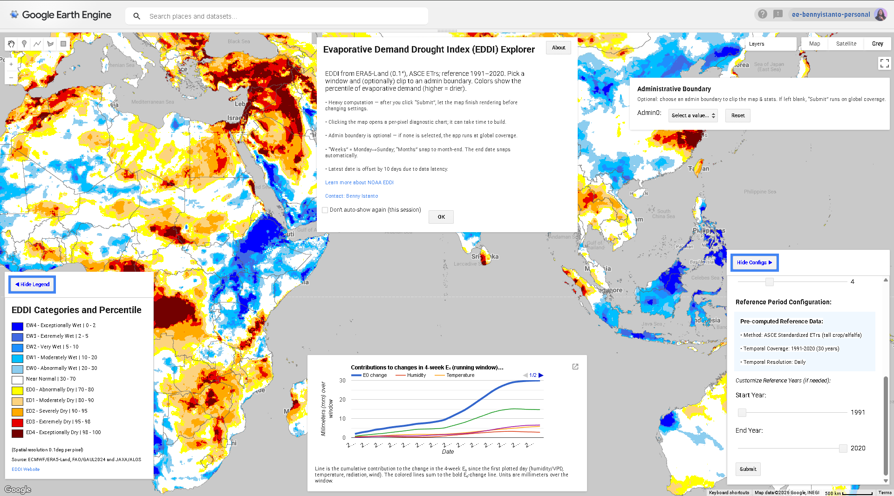
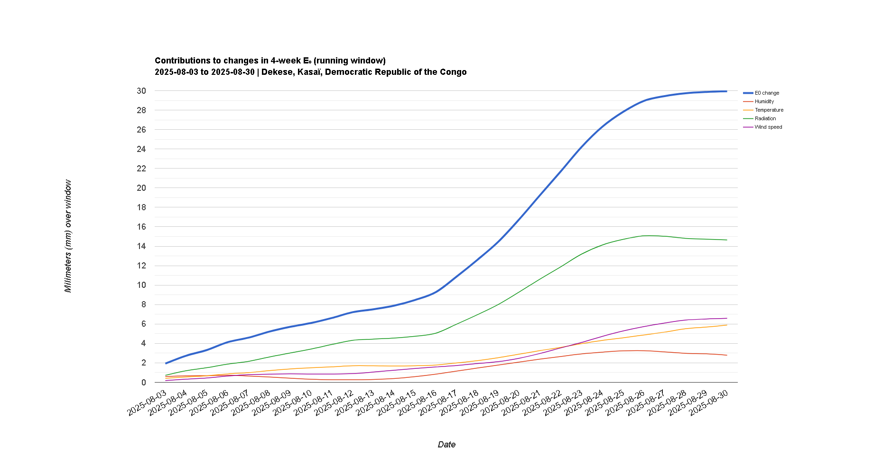

Earlier this year I wrote about [EDDI](/blog/20250206-eddi-atmospheric-thirst), the drought index that never looks at rainfall, and worked it through on a single Indonesian island in Python. One island at 0.1 degrees is a laptop-sized problem.

Around the same time I had the chance to discuss higher-resolution EDDI with Mike Hobbins, one of the people who [introduced the index](https://doi.org/10.1175/JHM-D-15-0121.1). That conversation is the reason this exists.

NOAA [publishes EDDI](https://psl.noaa.gov/eddi/) operationally from MERRA-2, at MERRA-2's resolution. But the public daily climate archives have moved on: ERA5-Land and AgERA5 are both around 0.1 degrees, roughly 11 km, and both carry every variable Penman-Monteith needs. Temperature, dew point, wind, solar radiation. There is no missing ingredient.

So the question was not whether a finer-resolution EDDI is possible. It was whether it can be made interactive.



## Why the obvious approach does not work

EDDI is a rank. You take accumulated evaporative demand over your window, and you ask where it falls among the same window in every year of a thirty-year reference period.

Which means a single map at a single date needs **thirty-one accumulations**, not one. The current window, plus the same calendar window in each of 1991 through 2020. Every one of those requires daily reference evapotranspiration, and every daily ET₀ value requires the full Penman-Monteith calculation: vapour pressure deficit, the slope of the saturation curve, the psychrometric constant from elevation, extraterrestrial and clear-sky radiation from latitude and day of year, net longwave, and a wind speed corrected from 10 metres to 2.

Do that on demand, globally, and you are asking Earth Engine to run Penman-Monteith over roughly eleven thousand days of global grid before it can draw anything. It times out, and it deserves to.

## Precompute the half that never changes

The reference period is fixed. Nothing about 1991 to 2020 changes when a user picks a different month to look at.

So I precomputed it. Daily ASCE ETrs, the tall-crop (alfalfa) reference, for every day from 1991 to 2020, exported once as an Earth Engine asset collection. The app then does something much smaller:

1. Sum the precomputed daily ET₀ over the requested window, for each of the thirty reference years.
2. Compute ET₀ for the current window, which is the only part that needs the meteorology.
3. Count how many reference years fall below the current total, divide by thirty, multiply by a hundred.

That third step is the whole index, and in Earth Engine it is almost embarrassingly short:

```js
climatologyCollection
  .map(function(img) { return currentSum.gte(img); })
  .sum()
  .divide(n)
  .multiply(100)
```

Map a greater-than-or-equal across the collection, which gives you a stack of 1s and 0s, sum it, and turn it into a percentage. No distribution fitting anywhere.

That last point is worth dwelling on. SPI and SPEI need a distribution: Gamma, Pearson III, log-logistic, fitted per pixel per window, which is where most of the compute and nearly all of the argument goes. EDDI is non-parametric. It ranks against the empirical distribution and stops. Thirty years is a thin sample for a rank, and that is a real limitation, but it removes an entire class of "which distribution did you use and why" from the conversation.

The precomputation is also what makes the resolution question moot. Once the expensive half is an asset, going finer costs storage rather than patience.

## What the app does

The [EDDI Explorer](https://code.earthengine.google.com/699176ca5c60e78155027240353f1f4b) runs on ERA5-Land daily aggregates, with the ALOS AW3D30 DEM for the elevation-dependent terms and GAUL 2024 for boundaries.

| | |
|---|---|
| Window | Weeks, Monday to Sunday, or months snapped to month-end |
| Area | Cascading admin-0, admin-1, admin-2 selectors, or global if you pick nothing |
| Reference | 1991-2020, adjustable |
| Output | EDDI percentile, 0-100, higher is drier |
| Export | GeoTIFF to Drive |

The latest available date sits about ten days behind today, which is ERA5-Land's latency rather than a choice. The app offsets for it automatically so the date picker cannot be set to a window that has no data yet.

A second script generates the ET₀ assets, and exists in two variants because the two archives are interchangeable for this purpose: [an AgERA5 version](https://code.earthengine.google.com/da029cbf545d33cdc2b2b7bf7d74122c) and [an ERA5-Land version](https://code.earthengine.google.com/c17e15be3b4027a85b5ae9c4c16b6f3c). Both carry a switch for the three Penman-Monteith variants: ASCE tall crop, ASCE short crop, and FAO-56.

Click any pixel and it builds a diagnostic chart, which is the part I use most and the part I least expected to.

## Which variable did it

A percentile map tells you that demand was unusually high. It does not tell you why, and "why" is usually the next question in the room.

Because ET₀ is a physical equation with four meteorological inputs, that question has an answer. Hold three of the four at their climatological values, vary the fourth, and you get the contribution of that one variable to the change in evaporative demand. Do it for all four and they add up.



This is a single pixel in the Congo basin over four weeks in August 2025. Evaporative demand rose by about 30 mm across the window, and the decomposition is not close to even:

| Contribution | mm over the window |
|---|---|
| Radiation | ~14.7 |
| Wind speed | ~6.6 |
| Temperature | ~5.9 |
| Humidity and VPD | ~2.8 |

Radiation alone is about half of it. The four coloured lines sum to the bold one exactly, which is the property that makes the chart trustworthy rather than merely suggestive: it is an accounting identity, not an attribution model with assumptions in it.

The practical value is that the same 30 mm means different things depending on which line is doing the work. A radiation-driven spike is cloud cover breaking, which often accompanies a rainfall deficit and reinforces it. A wind-driven one can happen under an otherwise unremarkable sky. Someone deciding whether to act on a drought signal reasonably wants to know which they are looking at, and a single percentile cannot say.

This is also, incidentally, the thing a rainfall index can never offer. SPI can tell you the rain did not come. It has no mechanism to decompose, because it has only one variable.

## The parts that fought back

**Global runs are genuinely heavy**, and no amount of precomputation fixes the reduction step. Computing summary statistics over a global image is what breaks first, so global statistics are off by default and run at 50 km when you turn them on. The map draws fine; it is asking for a mean that hurts.

**Windows that cross a year boundary** need care. A three-month window ending in January spans two calendar years, so the mirrored reference window for 1991 actually starts in 1990. Getting this wrong does not throw an error. It silently ranks your January against the wrong three months, thirty times over.

**The arc-cosine near the poles.** The sunset hour angle involves an arc-cosine whose argument can drift outside -1 to 1 through floating point error at high latitudes. Left alone it produces NaN in a band near each pole, which on a global map looks enough like "no data over ice" to pass unnoticed. Clipping the argument to its valid domain is one line. Finding out you needed it took considerably longer, and it never came up while the domain was one island eight degrees south of the equator.

## Where this leaves it

This is not a replacement for NOAA's product, which is operational, quality-controlled and has people behind it. It is a way of asking the same question at a finer grid, over an area they do not focus on, without downloading anything.

The general lesson is one I keep relearning in different forms: when an index is expensive because it needs a long reference period, the reference period is almost always the part that does not change. Compute it once, store it, and the interactive version becomes possible.
