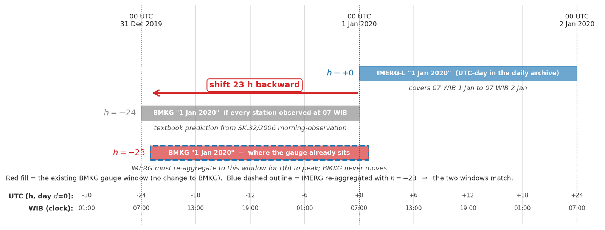
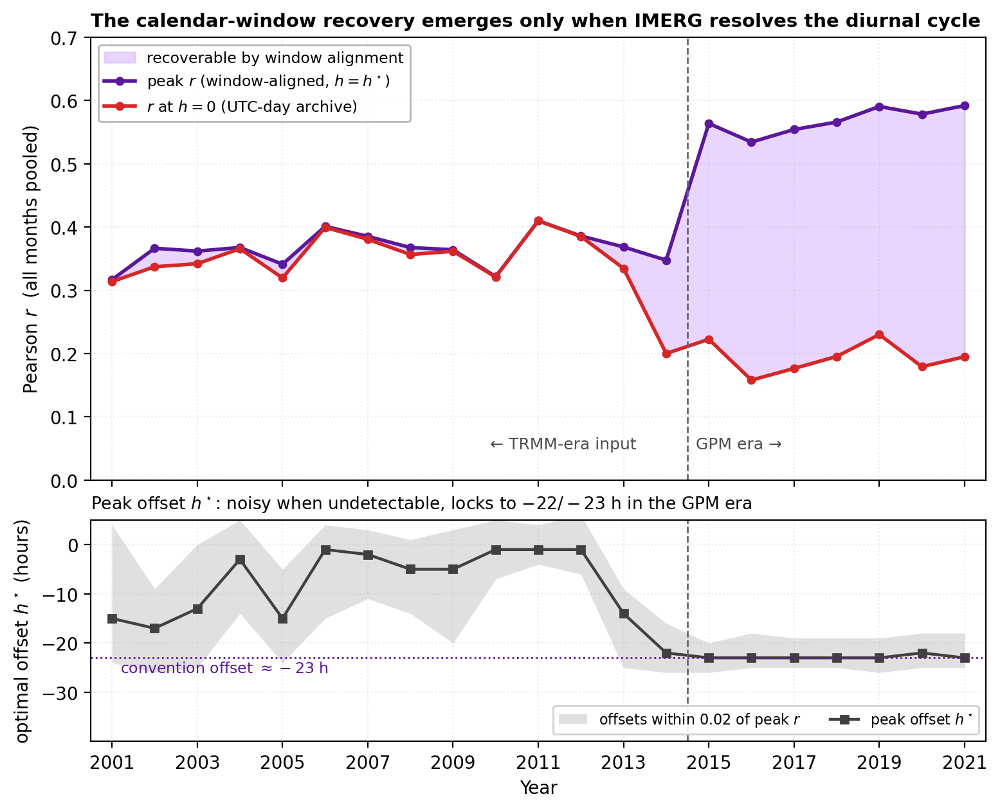
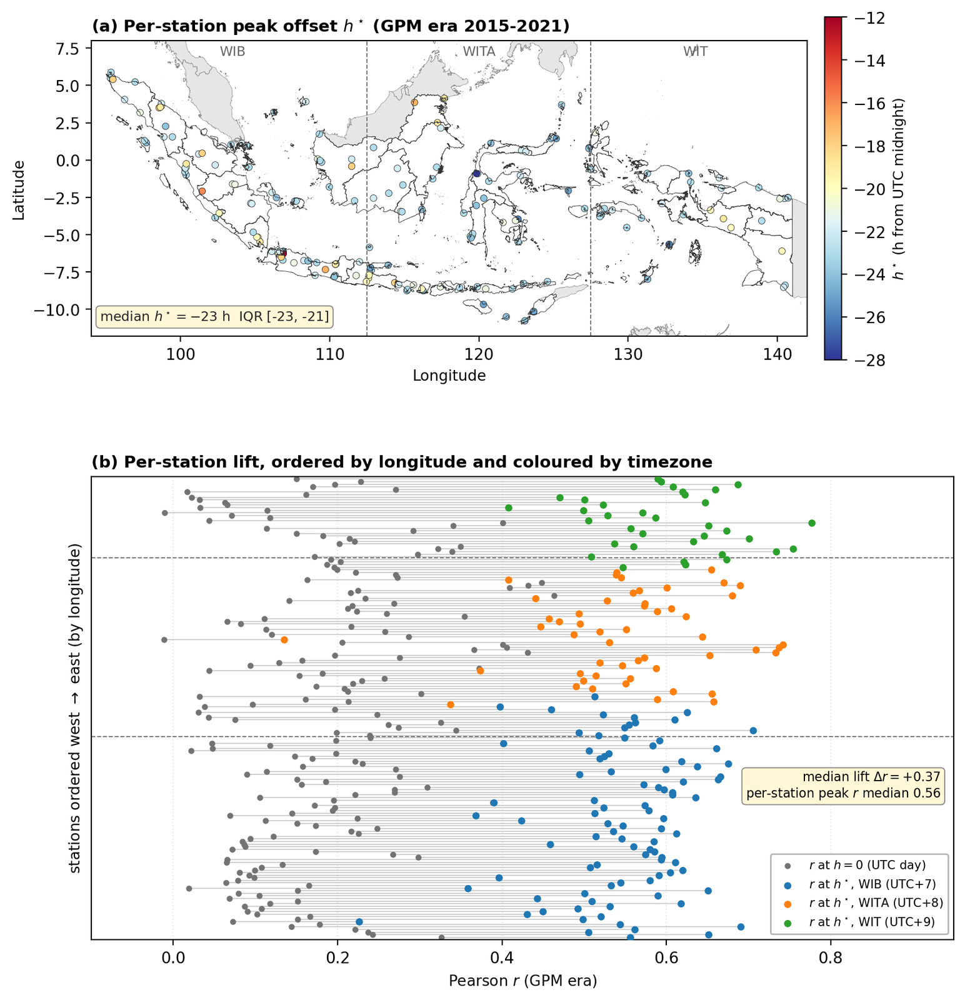
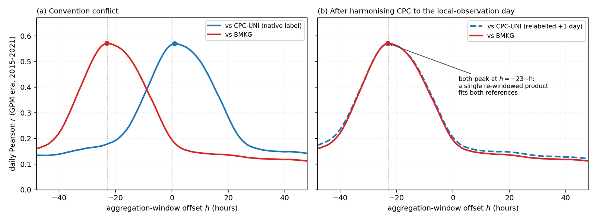

In February last year I wrote down a suspicion and then did nothing about it for twenty months. The satellite accumulates on a UTC day. A gauge day here runs from the morning observation. Those are different twenty-four hour periods carrying the same date, and I noted that some of what I was counting as satellite error might just be a labelling mismatch.

Last month I established that no amount of correction was going to move my daily correlation. So I finally went and tested the other thing.

## The number that gave it away

Three datasets, all daily, all over the same period. Correlate them against each other under the dates each archive assigns.

| | correlation |
|---|---|
| Satellite against the gridded gauge analysis | 0.57 |
| Satellite against the independent station network | 0.195 |
| **Gridded gauge analysis against the independent station network** | **0.154** |

Read that last row again, because it is the whole thing.

The gauge analysis is *made of gauge reports*. It is an interpolation of station observations. And it agrees with an independent set of station observations **worse than a raw satellite retrieval does**.

There is no story about data quality that explains that. Two products built from rain gauges cannot be genuinely less similar to each other than one of them is to a microwave retrieval from orbit. Something is wrong with the comparison rather than with the data, and the only thing the two gridded products share, that the station network does not, is the date convention.

## What the convention actually is

The satellite distributes daily totals accumulated over the UTC calendar day.

The station network follows the morning-observation convention, set out in a 2006 decree from the head of BMKG and consistent with the WMO principle of reading daily precipitation at fixed observation times. Under that rule the total recorded against date *d* is the twenty-four hours **ending** at the morning observation on *d*, nominally seven o'clock local time.

For a station in the western zone, seven in the morning is midnight UTC. So that gauge total covers midnight UTC on day *d-1* to midnight UTC on day *d*. It is a complete UTC day. It is simply the *previous* one from the one the archive labels *d*.

The two datasets are describing the same rain and filing it under different dates.

## Fixing it

Re-aggregate the half-hourly satellite source onto a shifted window and score again at every offset. Over the GPM era, correlation against the stations goes from **0.20 at the native UTC-day alignment** to **0.57 at a 23-hour backward shift**.

Nearly a factor of three, from re-labelling. Not one parameter changed. Not one value recomputed. The same rain, matched to the right day.

Two things convinced me this was real rather than a coincidence of fitting.

**The offset is not a free parameter.** Twenty-three hours is what the convention predicts, near enough. The textbook answer is twenty-four, and the one-hour gap sits inside the spread you would expect from stations reading at slightly different times, from half-hourly retrievals being blended across timestamps, and from the diurnal phase of afternoon convection.

**The optimal offset is organised by time zone.** It is not one number fitted across the country. It varies with longitude in the way three time zones would make it vary. A fitting artefact would not know where the zone boundaries are.

And the same day-shift test run on the gauge analysis rather than the satellite confirms the split from the other direction.

The gridded analysis closes each daily total at midnight UTC and dates it by the UTC calendar date, which is exactly what the satellite does. Its correlation with the satellite is highest at the native pairing and drops if you shift it. The station network is the odd one out, and shifting it by one day lifts its agreement with the gauge analysis from 0.154 to **0.751**, a factor of nearly five.

The calibration target was never misaligned. Only the thing I was validating against.

## What this changes, and what it does not

It does not change the correction. Last month's conclusion stands: a marginal correction cannot improve correlation, and none of this makes it able to.

What it changes is the interpretation of the number. I had been reading 0.35 as a statement about how well satellites see tropical rain. A large part of it was a statement about how two archives write down dates.

Those are very different claims and I had been making the wrong one, in a thesis, for two years.

## The lesson I would like to have learned faster

I noticed this in February 2024. I described it correctly, then set it aside as a plausible minor effect and spent twenty months on the parts of the problem I already knew how to work on.

What should have triggered me was the gauge-analysis-versus-stations number. That result is absurd on its face, and it was sitting in my own output the whole time. Two gauge products disagreeing more than a satellite disagrees with either one is not a subtle anomaly; it is an impossibility, and impossibilities are worth chasing immediately.

I think the reason I did not is that it appeared in a table of things that were all somewhat lower than I hoped. When every number is disappointing, a number that is disappointing *for a different reason* does not stand out.

That is the part I would do differently. Not the analysis, which was straightforward once started. The habit of asking, for each surprising result, whether it is merely bad or actually impossible.
