November again, and another [30 Day Map Challenge](https://30daymapchallenge.com/). One map a day, one theme a day, for the whole month.

I set myself one rule this year: **Python in Google Colab only**. No QGIS, no ArcGIS, no desktop GIS at any point. Everything below was written in a notebook and rendered straight to PNG.

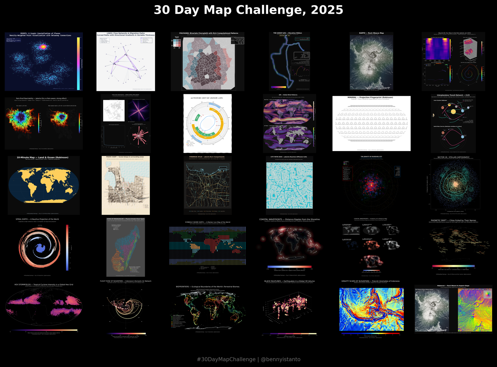

A few of the days need real data that has to be uploaded to Colab rather than pulled from a URL. If you want to run any of this yourself, the sample data is in [this folder](https://drive.google.com/drive/folders/1qK8PCAJH_EvCIiK9zFvEapllT94KfJEf?usp=sharing).

### Day 1 - Points
Synthetic clusters drawn as a density field. Point size and colour follow how many neighbours each point has, and Delaunay lines connect near neighbours to show the structure underneath.

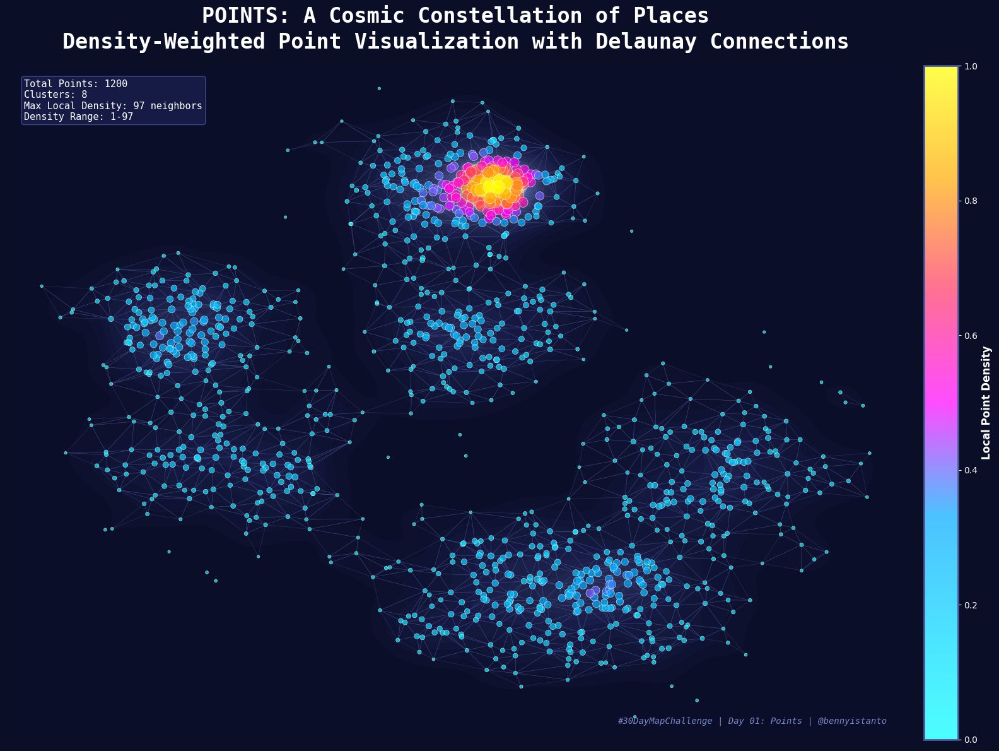

::: {.callout-note collapse="true" title="Python - Day 1, Points"}
```python
"""
30 Day Map Challenge - Day 01: Points
An artistic visualization combining density, connections, and cosmic-inspired styling
"""

import numpy as np
import matplotlib.pyplot as plt
from matplotlib.patches import Circle
from scipy.spatial import Delaunay, distance_matrix
from scipy.ndimage import gaussian_filter
import matplotlib.cm as cm
from matplotlib.colors import LinearSegmentedColormap

# Set random seed for reproducibility
np.random.seed(42)

# Create figure with dark background for cosmic effect
fig, ax = plt.subplots(figsize=(16, 12), facecolor='#0a0e27')
ax.set_facecolor('#0a0e27')

# Generate clustered point data (simulating cities/POIs with natural clustering)
n_clusters = 8
n_points_per_cluster = 150
all_points = []

for i in range(n_clusters):
    # Random cluster center
    center_x = np.random.uniform(0, 100)
    center_y = np.random.uniform(0, 100)

    # Generate points around cluster with varying spread
    spread = np.random.uniform(3, 10)
    x = np.random.normal(center_x, spread, n_points_per_cluster)
    y = np.random.normal(center_y, spread, n_points_per_cluster)

    cluster_points = np.column_stack([x, y])
    all_points.append(cluster_points)

# Combine all points
points = np.vstack(all_points)
x_coords, y_coords = points[:, 0], points[:, 1]

# Calculate local density for each point (number of neighbors within radius)
def calculate_local_density(points, radius=5):
    dist_mat = distance_matrix(points, points)
    density = np.sum(dist_mat < radius, axis=1)
    return density

density = calculate_local_density(points)
density_normalized = (density - density.min()) / (density.max() - density.min())

# Create smooth density field for background
grid_x, grid_y = np.mgrid[x_coords.min()-5:x_coords.max()+5:200j,
                           y_coords.min()-5:y_coords.max()+5:200j]
grid_density = np.zeros_like(grid_x)

for i, (x, y) in enumerate(points):
    grid_density += np.exp(-((grid_x - x)**2 + (grid_y - y)**2) / (2 * 3**2))

grid_density = gaussian_filter(grid_density, sigma=2)

# Custom colormap: deep space theme
colors_bg = ['#0a0e27', '#1a1f4d', '#2d3561', '#4a5899', '#7b88c7', '#9fa8da']
n_bins = 256
cmap_bg = LinearSegmentedColormap.from_list('cosmic', colors_bg, N=n_bins)

# Plot density field as background
im = ax.contourf(grid_x, grid_y, grid_density, levels=30, cmap=cmap_bg, alpha=0.8)

# Create Delaunay triangulation for connection lines
tri = Delaunay(points)

# Draw subtle connection lines between nearby points
for simplex in tri.simplices:
    triangle_points = points[simplex]
    # Only draw if all edges are short (nearby points)
    max_edge = max([
        np.linalg.norm(triangle_points[0] - triangle_points[1]),
        np.linalg.norm(triangle_points[1] - triangle_points[2]),
        np.linalg.norm(triangle_points[2] - triangle_points[0])
    ])

    if max_edge < 8:  # Only connect very close points
        triangle = plt.Polygon(triangle_points, fill=False,
                              edgecolor='#4a5899', linewidth=0.4, alpha=0.5)
        ax.add_patch(triangle)

# Custom colormap for points: vibrant cosmic colors
colors_points = ['#00ffff', '#00d4ff', '#00a8ff', '#ff00ff', '#ff3366', '#ffaa00', '#ffff00']
cmap_points = LinearSegmentedColormap.from_list('points', colors_points, N=256)

# Plot points with size and color based on density
scatter = ax.scatter(x_coords, y_coords,
                    c=density_normalized,
                    s=density_normalized * 200 + 10,  # Size varies with density
                    cmap=cmap_points,
                    alpha=0.7,
                    edgecolors='white',
                    linewidths=0.5,
                    zorder=5)

# Add glow effect for high-density points
high_density_mask = density_normalized > 0.7
if np.any(high_density_mask):
    ax.scatter(x_coords[high_density_mask], y_coords[high_density_mask],
              s=density_normalized[high_density_mask] * 500,
              c='white',
              alpha=0.1,
              zorder=4)
    ax.scatter(x_coords[high_density_mask], y_coords[high_density_mask],
              s=density_normalized[high_density_mask] * 300,
              c='#ffff00',
              alpha=0.15,
              zorder=4)

# Add title and labels
ax.set_title('POINTS: A Cosmic Constellation of Places\n' +
             'Density-Weighted Point Visualization with Delaunay Connections',
             color='white', fontsize=24, fontweight='bold', pad=20,
             fontfamily='monospace')

# Add statistics text box
total_points = len(points)
max_density_point = np.argmax(density)
textstr = f'Total Points: {total_points}\n'
textstr += f'Clusters: {n_clusters}\n'
textstr += f'Max Local Density: {int(density.max())} neighbors\n'
textstr += f'Density Range: {int(density.min())}-{int(density.max())}'

props = dict(boxstyle='round', facecolor='#1a1f4d', alpha=0.8, edgecolor='#4a5899')
ax.text(0.02, 0.98, textstr, transform=ax.transAxes, fontsize=11,
        verticalalignment='top', color='white', bbox=props, fontfamily='monospace')

# Add colorbar
cbar = plt.colorbar(scatter, ax=ax, pad=0.02, fraction=0.046)
cbar.set_label('Local Point Density', color='white', fontsize=12, fontweight='bold')
cbar.ax.yaxis.set_tick_params(color='white', labelcolor='white')
cbar.outline.set_edgecolor('#4a5899')
cbar.outline.set_linewidth(2)

# Remove axes
ax.set_xticks([])
ax.set_yticks([])
ax.spines['top'].set_visible(False)
ax.spines['right'].set_visible(False)
ax.spines['bottom'].set_visible(False)
ax.spines['left'].set_visible(False)

# Add attribution
ax.text(0.98, 0.02, '#30DayMapChallenge | Day 01: Points | @bennyistanto',
        transform=ax.transAxes, fontsize=10, color='#7b88c7',
        ha='right', va='bottom', style='italic', fontfamily='monospace')

plt.tight_layout()

# Save the map (will save to current Colab directory)
plt.savefig('day01_points_map.png', dpi=300, facecolor='#0a0e27',
            edgecolor='none', bbox_inches='tight')

print(f"Map saved as: day01_points_map.png")
print(f"Visualized {total_points} points across {n_clusters} natural clusters")
print(f"Used cosmic color palette with density-based symbolization")
print(f"\nRight-click on the file in the left panel to download!")

# Display the map
plt.show()
```
:::

### Day 2 - Lines
A three-tier hub network drawn with Bezier curves instead of straight lines, so overlapping routes stay readable. Thickness is flow volume, and a colour gradient along each curve carries direction.

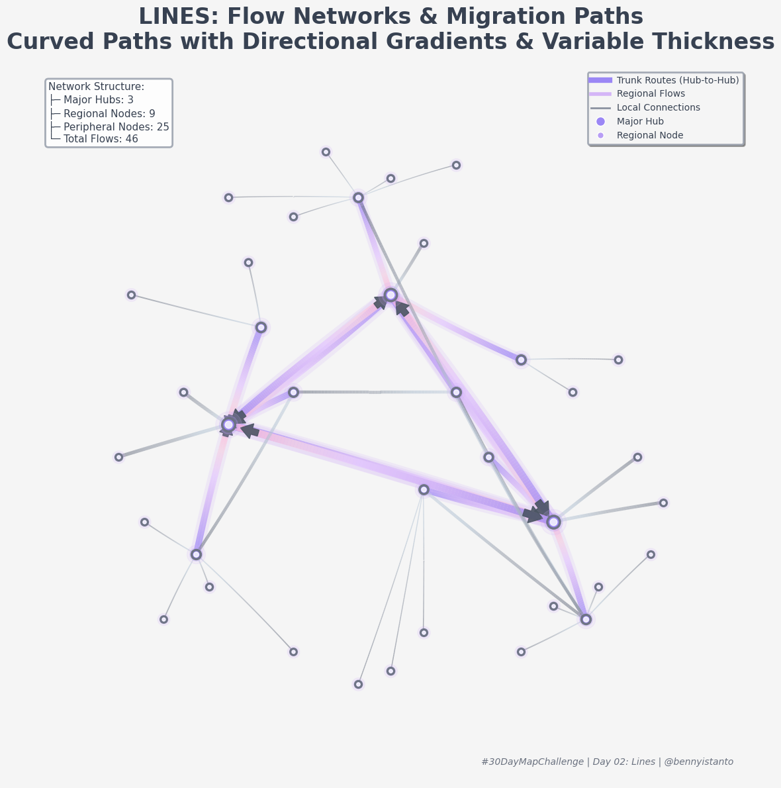

::: {.callout-note collapse="true" title="Python - Day 2, Lines"}
```python
"""
30 Day Map Challenge - Day 02: Lines
Dynamic flow visualization with curved paths, directional gradients, and variable thickness
"""

import numpy as np
import matplotlib.pyplot as plt
from matplotlib.collections import LineCollection
from matplotlib.colors import LinearSegmentedColormap
import matplotlib.patches as mpatches

# Set random seed for reproducibility
np.random.seed(42)

# Create figure with light grey background (pastel theme)
fig, ax = plt.subplots(figsize=(16, 12), facecolor='#f5f5f5')
ax.set_facecolor('#f5f5f5')

# Generate hierarchical network structure
# Create 3 major hubs (large cities/centers)
major_hubs = np.array([
    [25, 50],   # West hub
    [50, 70],   # North hub
    [75, 35]    # East hub
])

# Create 9 regional nodes around hubs
regional_nodes = np.array([
    [20, 30],   # Near west hub
    [35, 55],   # Between west and north
    [45, 85],   # North of north hub
    [60, 55],   # Between north and east
    [80, 20],   # South of east hub
    [65, 45],   # Near east hub
    [30, 65],   # West-north area
    [55, 40],   # Center
    [70, 60]    # East-north area
])

# Create 25 peripheral nodes distributed around the network
peripheral_nodes = np.array([
    # West region (8 nodes)
    [10, 70], [15, 20], [25, 85], [8, 45],
    [18, 55], [12, 35], [22, 25], [28, 75],
    # North region (5 nodes)
    [40, 92], [50, 88], [60, 90], [35, 82], [55, 78],
    # East region (8 nodes)
    [85, 60], [90, 30], [70, 15], [88, 45],
    [82, 25], [75, 22], [92, 38], [78, 55],
    # South region (4 nodes)
    [35, 15], [45, 10], [55, 18], [50, 12]
])

# Combine all nodes
nodes = np.vstack([major_hubs, regional_nodes, peripheral_nodes])
n_nodes = len(nodes)

# Node importance: major hubs > regional > peripheral
node_importance = np.array([200, 180, 190] +  # Major hubs (3)
                           [100, 95, 90, 98, 102, 88, 105, 92, 96] +  # Regional (9)
                           [50, 45, 52, 48, 55, 47, 50, 53,  # Peripheral (25)
                            48, 51, 49, 52, 50, 54, 46, 48,
                            52, 49, 51, 47, 53, 45, 50, 48, 51])

# Function to create Bézier curve between two points
def bezier_curve(start, end, control_offset=0.05, n_points=100):
    """Create a subtle quadratic Bézier curve between start and end points"""
    # Create control point offset perpendicular to the line
    dx = end[0] - start[0]
    dy = end[1] - start[1]

    # Perpendicular vector
    perp_x = -dy
    perp_y = dx
    length = np.sqrt(perp_x**2 + perp_y**2)

    if length > 0:
        perp_x /= length
        perp_y /= length

    # Control point with minimal offset for subtle curve
    mid_x = (start[0] + end[0]) / 2
    mid_y = (start[1] + end[1]) / 2
    offset = np.random.uniform(-control_offset, control_offset) * length
    control = np.array([mid_x + perp_x * offset, mid_y + perp_y * offset])

    # Generate Bézier curve points
    t = np.linspace(0, 1, n_points)
    curve = np.outer((1-t)**2, start) + np.outer(2*(1-t)*t, control) + np.outer(t**2, end)

    return curve

# Generate structured flows with clear patterns
flows = []

# Pattern 1: Peripheral nodes connect to nearest regional node (migration to cities)
for i in range(12, 37):  # Peripheral nodes (25 nodes)
    # Find nearest regional or major hub
    distances = [np.linalg.norm(nodes[i] - nodes[j]) for j in range(12)]
    nearest = np.argmin(distances)
    flows.append({
        'start': nodes[i],
        'end': nodes[nearest],
        'intensity': node_importance[nearest] * 0.5
    })

# Pattern 2: Regional nodes connect to major hubs (regional to metropolitan)
for i in range(3, 12):  # Regional nodes (9 nodes)
    # Connect each regional to nearest major hub
    distances = [np.linalg.norm(nodes[i] - nodes[j]) for j in range(3)]
    nearest = np.argmin(distances)
    flows.append({
        'start': nodes[i],
        'end': nodes[nearest],
        'intensity': node_importance[nearest] * 0.8
    })

# Pattern 3: Major hubs interconnect (trunk routes)
# North to West, North to East, West to East
major_connections = [(1, 0), (1, 2), (0, 2)]
for start_idx, end_idx in major_connections:
    flows.append({
        'start': nodes[start_idx],
        'end': nodes[end_idx],
        'intensity': 200
    })
    # Bidirectional flow for major routes
    flows.append({
        'start': nodes[end_idx],
        'end': nodes[start_idx],
        'intensity': 180
    })

# Pattern 4: Some regional interconnections (secondary routes)
regional_connections = [(3, 4), (4, 6), (6, 7), (7, 8), (5, 8), (7, 10)]
for start_idx, end_idx in regional_connections:
    flows.append({
        'start': nodes[start_idx],
        'end': nodes[end_idx],
        'intensity': 90
    })

# Normalize flow intensities
intensities = np.array([f['intensity'] for f in flows])
intensities = (intensities - intensities.min()) / (intensities.max() - intensities.min())

# Create custom colormaps for different flow types
# Main flows: soft purple to pink pastel gradient
colors_main = ['#9b87f5', '#b89ef5', '#d4b5f7', '#e6ccff', '#f5d4e6', '#ffb5d8']
cmap_main = LinearSegmentedColormap.from_list('flow_main', colors_main, N=256)

# Secondary flows: soft grey to teal gradient
colors_secondary = ['#6b7280', '#8b92a0', '#9ca3af', '#b4c4d4', '#c7d2e0']
cmap_secondary = LinearSegmentedColormap.from_list('flow_secondary', colors_secondary, N=256)

# Draw flows with varying thickness and color gradients
for idx, flow in enumerate(flows):
    # Generate path with very subtle curve (almost straight, like direct migration)
    curve = bezier_curve(flow['start'], flow['end'], control_offset=0.03)

    # Line width based on intensity
    linewidth = intensities[idx] * 8 + 1

    # Choose colormap based on flow intensity
    if intensities[idx] > 0.6:
        cmap = cmap_main
        alpha = 0.8
        # Add glow effect for major flows (soft pastel glow)
        glow_curve = curve.reshape(-1, 1, 2)
        glow_segments = np.concatenate([glow_curve[:-1], glow_curve[1:]], axis=1)
        glow_lc = LineCollection(glow_segments, linewidths=linewidth*2,
                                alpha=0.2, colors='#d4b5f7')
        ax.add_collection(glow_lc)
    else:
        cmap = cmap_secondary
        alpha = 0.6

    # Create color gradient along the line (shows direction)
    points = curve.reshape(-1, 1, 2)
    segments = np.concatenate([points[:-1], points[1:]], axis=1)

    # Color values from 0 to 1 along the curve (direction)
    colors = np.linspace(0, 1, len(segments))

    # Create LineCollection with gradient
    lc = LineCollection(segments, cmap=cmap, alpha=alpha)
    lc.set_array(colors)
    lc.set_linewidth(linewidth)
    ax.add_collection(lc)

    # Add arrow at the end for major flows to show direction (SMALLER & DYNAMIC)
    if intensities[idx] > 0.7:
        # Arrow at 90% of the curve
        arrow_pos = int(len(curve) * 0.9)
        if arrow_pos < len(curve) - 1:
            arrow_start = curve[arrow_pos]
            arrow_end = curve[arrow_pos + 1]
            dx = arrow_end[0] - arrow_start[0]
            dy = arrow_end[1] - arrow_start[1]

            # Make arrow size proportional to line width but smaller
            arrow_scale = linewidth * 0.15

            # Use dark contrasting color for arrows
            arrow = mpatches.FancyArrow(arrow_start[0], arrow_start[1],
                                       dx*2, dy*2,
                                       width=arrow_scale*0.8,
                                       head_width=arrow_scale*2,
                                       head_length=arrow_scale*1.5,
                                       color='#4b5563',  # Dark grey for contrast
                                       alpha=0.9,
                                       zorder=5)
            ax.add_patch(arrow)

# Draw nodes with glow effect (pastel grey theme)
for i, node in enumerate(nodes):
    size = node_importance[i]

    # Glow layers (soft pastel)
    ax.scatter(node[0], node[1], s=size*4, c='#d4b5f7', alpha=0.15, zorder=10)
    ax.scatter(node[0], node[1], s=size*2, c='#b89ef5', alpha=0.25, zorder=11)

    # Main node
    ax.scatter(node[0], node[1], s=size, c='#9b87f5',
              edgecolors='#6b7280', linewidths=2.5, alpha=0.95, zorder=12)

    # Core highlight
    ax.scatter(node[0], node[1], s=size*0.3, c='#ffffff', alpha=0.8, zorder=13)

# Add title (simpler, readable on light background)
ax.set_title('LINES: Flow Networks & Migration Paths\n' +
             'Curved Paths with Directional Gradients & Variable Thickness',
             color='#374151', fontsize=24, fontweight='bold', pad=20,
             fontfamily='sans-serif')

# Add statistics text box (dark on light)
total_flows = len(flows)
major_flows = sum(1 for i in intensities if i > 0.6)
textstr = f'Network Structure:\n'
textstr += f'├─ Major Hubs: 3\n'
textstr += f'├─ Regional Nodes: 9\n'
textstr += f'├─ Peripheral Nodes: 25\n'
textstr += f'└─ Total Flows: {total_flows}'

props = dict(boxstyle='round', facecolor='#ffffff', alpha=0.9, edgecolor='#9ca3af', linewidth=2)
ax.text(0.02, 0.98, textstr, transform=ax.transAxes, fontsize=11,
        verticalalignment='top', color='#374151', bbox=props, fontfamily='sans-serif')

# Create legend (dark colors on light background)
legend_elements = [
    plt.Line2D([0], [0], color='#9b87f5', linewidth=6, label='Trunk Routes (Hub-to-Hub)'),
    plt.Line2D([0], [0], color='#d4b5f7', linewidth=4, label='Regional Flows'),
    plt.Line2D([0], [0], color='#8b92a0', linewidth=2, label='Local Connections'),
    plt.Line2D([0], [0], marker='o', color='w', markerfacecolor='#9b87f5',
               markersize=10, label='Major Hub', linestyle='None'),
    plt.Line2D([0], [0], marker='o', color='w', markerfacecolor='#b89ef5',
               markersize=7, label='Regional Node', linestyle='None')
]

legend = ax.legend(handles=legend_elements, loc='upper right',
                  frameon=True, fancybox=True, shadow=True,
                  fontsize=10, facecolor='#ffffff', edgecolor='#9ca3af',
                  labelcolor='#374151')
legend.get_frame().set_alpha(0.9)
legend.get_frame().set_linewidth(2)

# Remove axes and set limits
ax.set_xlim(-5, 105)
ax.set_ylim(-5, 105)
ax.set_xticks([])
ax.set_yticks([])
ax.set_aspect('equal')
ax.spines['top'].set_visible(False)
ax.spines['right'].set_visible(False)
ax.spines['bottom'].set_visible(False)
ax.spines['left'].set_visible(False)

# Add attribution
ax.text(0.98, 0.02, '#30DayMapChallenge | Day 02: Lines | @bennyistanto',
        transform=ax.transAxes, fontsize=10, color='#6b7280',
        ha='right', va='bottom', style='italic', fontfamily='sans-serif')

plt.tight_layout()

# Save the map
plt.savefig('day02_lines_map.png', dpi=300, facecolor='#f5f5f5',
            edgecolor='none', bbox_inches='tight')

print(f"Map saved as: day02_lines_map.png")
print(f"Visualized {total_flows} flows connecting {n_nodes} nodes")
print(f"Used curved Bézier paths with directional color gradients")
print(f"Major flows include directional arrows")
print(f"\nRight-click on the file in the left panel to download!")

# Display the map
plt.show()
```
:::

### Day 3 - Polygons
A bivariate choropleth where procedural textures back up the colour blend, so the two variables can still be told apart.

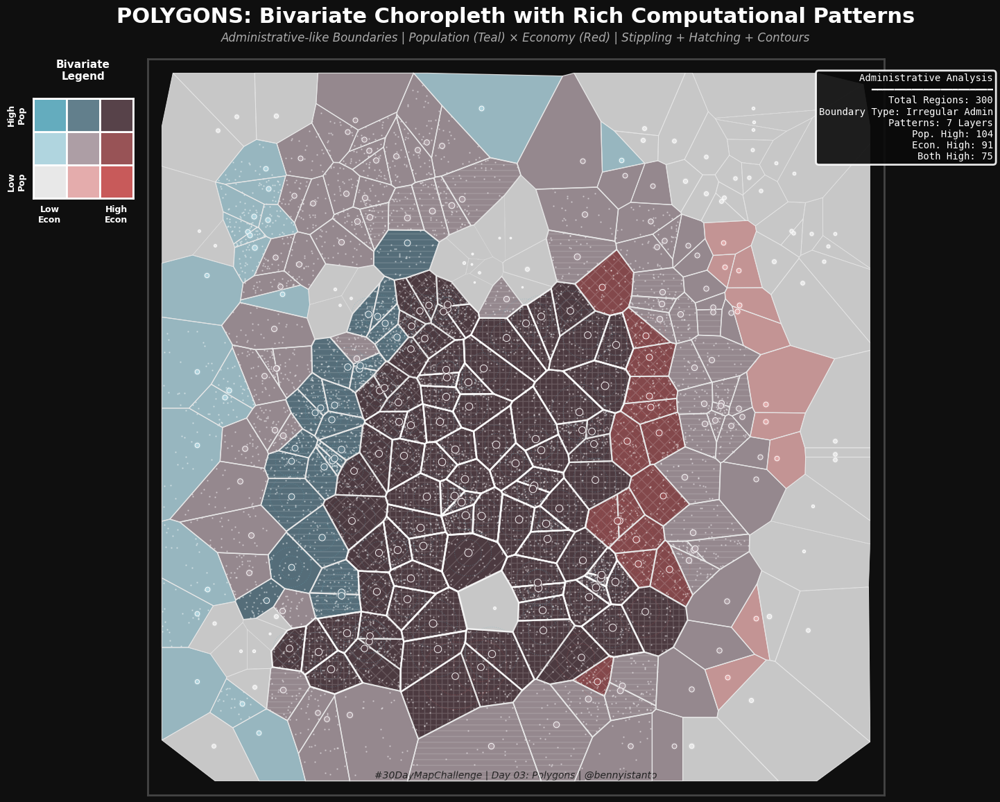

::: {.callout-note collapse="true" title="Python - Day 3, Polygons"}
```python
"""
30 Day Map Challenge - Day 03: Polygons
Bivariate Choropleth with Rich Patterns - Population vs Economy
Administrative-like boundaries with computational texture overlays!
"""

import numpy as np
import matplotlib.pyplot as plt
from matplotlib.patches import Polygon
from scipy.spatial import Voronoi
import matplotlib.patches as mpatches
from matplotlib.colors import LinearSegmentedColormap
from scipy.ndimage import gaussian_filter
from scipy.interpolate import griddata

# Set random seed for reproducibility
np.random.seed(42)

# Create figure with dark background
fig, ax = plt.subplots(figsize=(16, 12), facecolor='#0f0f0f')
ax.set_facecolor('#0f0f0f')

# Generate IRREGULAR ADMINISTRATIVE BOUNDARIES using Voronoi
def create_admin_boundaries(n_regions=25):
    """Create irregular administrative-like boundaries using Voronoi tessellation"""

    # Generate points with some structure (not completely random)
    points = []

    # Create regions with different densities
    for i in range(n_regions):
        # Add some clustering
        cluster_x = np.random.uniform(10, 90)
        cluster_y = np.random.uniform(10, 90)
        x = cluster_x + np.random.randn() * 8
        y = cluster_y + np.random.randn() * 8
        x = np.clip(x, 5, 95)
        y = np.clip(y, 5, 95)
        points.append([x, y])

    points = np.array(points)

    # Add boundary points to ensure finite regions
    boundary_points = np.array([
        [-10, -10], [110, -10], [110, 110], [-10, 110],
        [50, -10], [50, 110], [-10, 50], [110, 50],
        [25, -10], [75, -10], [25, 110], [75, 110],
        [-10, 25], [-10, 75], [110, 25], [110, 75]
    ])

    all_points = np.vstack([points, boundary_points])

    # Create Voronoi diagram
    vor = Voronoi(all_points)

    # Extract polygons
    polygons = []
    centers = []

    for i in range(n_regions):
        region_index = vor.point_region[i]
        region = vor.regions[region_index]

        if -1 not in region and len(region) > 0:
            vertices = vor.vertices[region]

            # Clip to bounds
            vertices = np.clip(vertices, 0, 100)

            if len(vertices) > 2:
                polygons.append(vertices)
                centers.append(points[i])

    return polygons, np.array(centers)

# Create administrative boundaries
polygons, centers = create_admin_boundaries(n_regions=300)
n_regions = len(polygons)
print(f"Created {n_regions} irregular administrative regions")

# BIVARIATE DATA with EXTREME spatial variation and scattered outliers
# Variable 1: Population density - many random clusters everywhere
# Variable 2: Economic development - independent pattern with lots of outliers

# Create base patterns using many scattered Gaussian processes
x_grid = np.linspace(0, 100, 50)
y_grid = np.linspace(0, 100, 50)
X_grid, Y_grid = np.meshgrid(x_grid, y_grid)

# Population: 15 random scattered clusters
np.random.seed(42)  # For reproducibility
n_pop_centers = 15
pop_centers = []
for _ in range(n_pop_centers):
    px = np.random.uniform(10, 90)
    py = np.random.uniform(10, 90)
    pop_centers.append((px, py))

population_field = np.zeros_like(X_grid)
for px, py in pop_centers:
    dist = np.sqrt((X_grid - px)**2 + (Y_grid - py)**2)
    intensity = np.random.uniform(0.5, 1.8)
    spread = np.random.uniform(12, 35)
    population_field += intensity * 100 * np.exp(-dist / spread)

# Add MORE noise for dramatic outliers
population_field += np.random.randn(*X_grid.shape) * 30

# Less smoothing to preserve outliers
population_field = gaussian_filter(population_field, sigma=1.8)
population_field = (population_field - population_field.min()) / (population_field.max() - population_field.min())

# Economy: 20 random scattered clusters - INDEPENDENT pattern
n_econ_centers = 20
econ_centers = []
for _ in range(n_econ_centers):
    ex = np.random.uniform(10, 90)
    ey = np.random.uniform(10, 90)
    econ_centers.append((ex, ey))

economy_field = np.zeros_like(X_grid)
for ex, ey in econ_centers:
    dist = np.sqrt((X_grid - ex)**2 + (Y_grid - ey)**2)
    intensity = np.random.uniform(0.4, 1.6)
    spread = np.random.uniform(10, 35)
    economy_field += intensity * 100 * np.exp(-dist / spread)

# Add MORE noise for economic outliers
economy_field += np.random.randn(*X_grid.shape) * 25

# Less smoothing to preserve outliers
economy_field = gaussian_filter(economy_field, sigma=2.0)
economy_field = (economy_field - economy_field.min()) / (economy_field.max() - economy_field.min())

# Add some RANDOM SPIKES for extreme outliers
n_outliers = 12
for _ in range(n_outliers):
    ox = np.random.randint(0, X_grid.shape[0])
    oy = np.random.randint(0, X_grid.shape[1])
    # Random choice: high-high or low-low outlier
    if np.random.rand() > 0.5:
        # High-high outlier
        population_field[max(0,ox-2):min(X_grid.shape[0],ox+3),
                        max(0,oy-2):min(X_grid.shape[1],oy+3)] = np.random.uniform(0.85, 1.0)
        economy_field[max(0,ox-2):min(X_grid.shape[0],ox+3),
                     max(0,oy-2):min(X_grid.shape[1],oy+3)] = np.random.uniform(0.85, 1.0)
    else:
        # Low-low outlier
        population_field[max(0,ox-2):min(X_grid.shape[0],ox+3),
                        max(0,oy-2):min(X_grid.shape[1],oy+3)] = np.random.uniform(0.0, 0.15)
        economy_field[max(0,ox-2):min(X_grid.shape[0],ox+3),
                     max(0,oy-2):min(X_grid.shape[1],oy+3)] = np.random.uniform(0.0, 0.15)

# Sample values at polygon centers
from scipy.interpolate import griddata

var1_population = griddata((X_grid.flatten(), Y_grid.flatten()),
                           population_field.flatten(),
                           centers, method='cubic')
var2_economy = griddata((X_grid.flatten(), Y_grid.flatten()),
                        economy_field.flatten(),
                        centers, method='cubic')

# Clip to [0, 1] range
var1_population = np.clip(var1_population, 0, 1)
var2_economy = np.clip(var2_economy, 0, 1)

print(f"Population range: {var1_population.min():.2f} - {var1_population.max():.2f}")
print(f"Economy range: {var2_economy.min():.2f} - {var2_economy.max():.2f}")
print(f"High-High regions: {np.sum((var1_population > 0.7) & (var2_economy > 0.7))}")
print(f"Low-Low regions: {np.sum((var1_population < 0.3) & (var2_economy < 0.3))}")
print(f"High Pop, Low Econ (Teal): {np.sum((var1_population > 0.7) & (var2_economy < 0.3))}")
print(f"Low Pop, High Econ (Red): {np.sum((var1_population < 0.3) & (var2_economy > 0.7))}")

# BIVARIATE COLOR SCHEME - Teal-Red palette
# 3x3 matrix: rows = population (low to high), cols = economy (low to high)
bivariate_colors = [
    ['#e8e8e8', '#e4acac', '#c85a5a'],  # Low population
    ['#b0d5df', '#ad9ea5', '#985356'],  # Medium population
    ['#64acbe', '#627f8c', '#574249']   # High population
]

def hex_to_rgb(hex_color):
    """Convert hex color to RGB tuple (0-1 range)"""
    hex_color = hex_color.lstrip('#')
    return tuple(int(hex_color[i:i+2], 16) / 255.0 for i in (0, 2, 4))

def bivariate_color(pop_val, econ_val):
    """
    Map continuous values to 3x3 bivariate color scheme
    - Population (Y-axis): Controls row (0=low, 2=high)
    - Economy (X-axis): Controls column (0=low, 2=high)
    """
    # Map to 3x3 grid indices
    pop_idx = min(int(pop_val * 3), 2)
    econ_idx = min(int(econ_val * 3), 2)

    # Get hex color from matrix
    hex_color = bivariate_colors[pop_idx][econ_idx]

    # Convert to RGB
    return hex_to_rgb(hex_color)

# Helper: Check if point is inside polygon
def point_in_polygon(x, y, polygon):
    """Check if point is inside polygon using ray casting"""
    n = len(polygon)
    inside = False
    p1x, p1y = polygon[0]
    for i in range(1, n + 1):
        p2x, p2y = polygon[i % n]
        if y > min(p1y, p2y):
            if y <= max(p1y, p2y):
                if x <= max(p1x, p2x):
                    if p1y != p2y:
                        xinters = (y - p1y) * (p2x - p1x) / (p2y - p1y) + p1x
                    if p1x == p2x or x <= xinters:
                        inside = not inside
        p1x, p1y = p2x, p2y
    return inside

# LAYER 1: Draw base bivariate polygons
for i, poly_verts in enumerate(polygons):
    color = bivariate_color(var1_population[i], var2_economy[i])

    polygon = Polygon(poly_verts,
                     facecolor=color,
                     edgecolor='none',
                     alpha=0.85,
                     zorder=2)
    ax.add_patch(polygon)

# LAYER 2: Add RICH PATTERNS - Stippling based on population density
print("Adding stippling patterns...")
for i, poly_verts in enumerate(polygons):
    if var1_population[i] > 0.4:  # Medium to high population
        # Generate stippling dots inside polygon (COARSER - fewer dots)
        n_dots = int(var1_population[i] * 50)

        minx, miny = poly_verts.min(axis=0)
        maxx, maxy = poly_verts.max(axis=0)

        dots_x = []
        dots_y = []
        attempts = 0
        while len(dots_x) < n_dots and attempts < n_dots * 10:
            px = np.random.uniform(minx, maxx)
            py = np.random.uniform(miny, maxy)

            if point_in_polygon(px, py, poly_verts):
                dots_x.append(px)
                dots_y.append(py)
            attempts += 1

        if dots_x:
            ax.scatter(dots_x, dots_y, s=0.5, c='white',
                      alpha=0.4, zorder=3)

# LAYER 3: Add hatching patterns based on economy (COARSER)
print("Adding hatching patterns...")
hatch_patterns = ['//', '\\\\', '||', '--', 'xx', '++']
for i, poly_verts in enumerate(polygons):
    if var2_economy[i] > 0.5:  # Medium to high economy
        # Select pattern based on value
        pattern_idx = int(var2_economy[i] * len(hatch_patterns)) % len(hatch_patterns)
        pattern = hatch_patterns[pattern_idx]

        polygon = Polygon(poly_verts,
                         facecolor='none',
                         edgecolor='white',
                         hatch=pattern,
                         linewidth=0,
                         alpha=0.15,
                         zorder=4)
        ax.add_patch(polygon)

# LAYER 4: Add contour lines for high-value regions
print("Adding contour lines...")
for i, (poly_verts, center) in enumerate(zip(polygons, centers)):
    if var1_population[i] > 0.7 or var2_economy[i] > 0.7:
        # Add concentric contours
        for radius_mult in [0.4, 0.7]:
            # Estimate polygon radius
            distances = np.sqrt((poly_verts[:, 0] - center[0])**2 +
                              (poly_verts[:, 1] - center[1])**2)
            avg_radius = distances.mean() * radius_mult

            circle = plt.Circle(center, avg_radius,
                              fill=False,
                              edgecolor='#64acbe' if var1_population[i] > 0.7 else '#c85a5a',  # Teal or Red
                              linewidth=0.8,
                              alpha=0.3,
                              linestyle=':',
                              zorder=5)
            ax.add_patch(circle)

# LAYER 5: Thick borders for administrative boundaries
for i, poly_verts in enumerate(polygons):
    # Border thickness varies by combined value
    linewidth = 0.3 + (var1_population[i] + var2_economy[i]) * 0.8

    # Border color based on bivariate mix
    border_intensity = 0.3
    border_color = bivariate_color(var1_population[i] * border_intensity,
                                   var2_economy[i] * border_intensity)

    polygon = Polygon(poly_verts,
                     facecolor='none',
                     edgecolor=border_color,
                     linewidth=linewidth,
                     alpha=0.9,
                     zorder=6)
    ax.add_patch(polygon)

# LAYER 6: Highlight borders for highest value regions
for i, poly_verts in enumerate(polygons):
    if var1_population[i] > 0.75 and var2_economy[i] > 0.75:
        polygon = Polygon(poly_verts,
                         facecolor='none',
                         edgecolor='white',
                         linewidth=1.5,
                         alpha=0.6,
                         zorder=7)
        ax.add_patch(polygon)

# LAYER 7: Center markers
for i, center in enumerate(centers):
    size = 2.5 + (var1_population[i] + var2_economy[i]) * 30
    color = bivariate_color(var1_population[i], var2_economy[i])

    # Glow
    ax.scatter(center[0], center[1], s=size*2,
              color=color, alpha=0.2, zorder=8)

    # Main marker
    ax.scatter(center[0], center[1], s=size,
              color=color,
              edgecolors='white', linewidths=0.7,
              alpha=0.95, zorder=9)

print("Pattern generation complete!")

# Add title at the TOP
fig.text(0.5, 0.96, 'POLYGONS: Bivariate Choropleth with Rich Computational Patterns',
         ha='center', va='top', fontsize=22, fontweight='bold',
         color='white', fontfamily='sans-serif')

fig.text(0.5, 0.93, 'Administrative-like Boundaries | Population (Teal) × Economy (Red) | Stippling + Hatching + Contours',
         ha='center', va='top', fontsize=12,
         color='#aaaaaa', fontfamily='sans-serif', style='italic')

# Create BIVARIATE LEGEND at top-left (aligned with stats box)
legend_size = 0.12
legend_ax = fig.add_axes([0.05, 0.73, legend_size, legend_size])  # Moved down from 0.78 to 0.73
legend_ax.set_xlim(0, 3)
legend_ax.set_ylim(0, 3)
legend_ax.set_aspect('equal')

# Create 3x3 bivariate color matrix using teal-red palette
for i in range(3):
    for j in range(3):
        hex_color = bivariate_colors[i][j]

        rect = mpatches.Rectangle((j, i), 1, 1,
                                 facecolor=hex_color, edgecolor='white',
                                 linewidth=2)
        legend_ax.add_patch(rect)

# Add axis labels
legend_ax.text(-0.5, 2.5, 'High\nPop', rotation=90,
              va='center', ha='center', color='white', fontsize=9,
              fontweight='bold')
legend_ax.text(-0.5, 0.5, 'Low\nPop', rotation=90,
              va='center', ha='center', color='white', fontsize=9,
              fontweight='bold')
legend_ax.text(0.5, -0.5, 'Low\nEcon',
              ha='center', va='center', color='white', fontsize=9,
              fontweight='bold')
legend_ax.text(2.5, -0.5, 'High\nEcon',
              ha='center', va='center', color='white', fontsize=9,
              fontweight='bold')
legend_ax.text(1.5, 3.5, 'Bivariate\nLegend',
              ha='center', va='bottom', color='white', fontsize=11,
              fontweight='bold')

legend_ax.set_xticks([])
legend_ax.set_yticks([])
for spine in legend_ax.spines.values():
    spine.set_color('white')
    spine.set_linewidth(2)
legend_ax.set_facecolor('#0a0a0a')

# Add statistics box at top-right
stats_text = f'Administrative Analysis\n'
stats_text += f'━━━━━━━━━━━━━━━━━━━━━\n'
stats_text += f'Total Regions: {n_regions}\n'
stats_text += f'Boundary Type: Irregular Admin\n'
stats_text += f'Patterns: 7 Layers\n'
stats_text += f'Pop. High: {np.sum(var1_population > 0.7)}\n'
stats_text += f'Econ. High: {np.sum(var2_economy > 0.7)}\n'
stats_text += f'Both High: {np.sum((var1_population > 0.7) & (var2_economy > 0.7))}'

fig.text(0.93, 0.88, stats_text,
         ha='right', va='top', fontsize=10,
         color='white', fontfamily='monospace',
         bbox=dict(boxstyle='round', facecolor='#0a0a0a',
                  edgecolor='white', linewidth=2, alpha=0.9))

# Add attribution at bottom
ax.text(0.5, 0.02, '#30DayMapChallenge | Day 03: Polygons | @bennyistanto',
        transform=ax.transAxes, fontsize=10, color='#222222',
        ha='center', va='bottom', style='italic', fontfamily='sans-serif')

# Clean up main axes
ax.set_xlim(-2, 102)
ax.set_ylim(-2, 102)
ax.set_xticks([])
ax.set_yticks([])
ax.set_aspect('equal')
for spine in ax.spines.values():
    spine.set_edgecolor('#444444')
    spine.set_linewidth(2)

plt.tight_layout(rect=[0, 0, 1, 0.91])

# Save the map
plt.savefig('day03_polygons_map.png', dpi=300, facecolor='#0f0f0f',
            edgecolor='none', bbox_inches='tight')

print(f"Map saved as: day03_polygons_map.png")
print(f"BIVARIATE Choropleth: Population (Teal) × Economy (Red)")
print(f"{n_regions} irregular administrative regions")
print(f"Rich patterns: Stippling + Hatching + Contours + Variable borders")
print(f"Dark Brown = High Population + High Economy!")
print(f"\nRight-click on the file in the left panel to download!")

# Display the map
plt.show()
```
:::

### Day 4 - Data challenge: my data
My own GPS traces. Drift is drawn as ghost lines and elevation shapes the route geometry, so the effort shows up in the shape of the track.

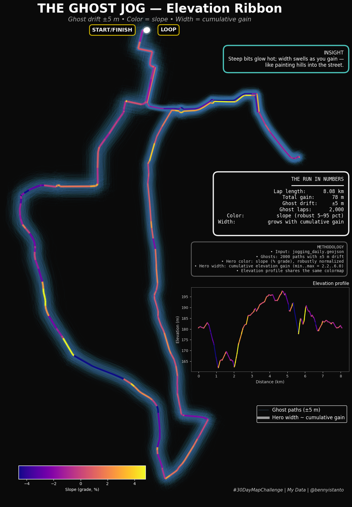

::: {.callout-note collapse="true" title="Python - Day 4, Data challenge: my data"}
```python
"""
THE GHOST JOG — Elevation Ribbon
Ghost drift ±5 m; Hero route uses COLOR = slope (grade) and WIDTH = cumulative gain.
- 3D GeoJSON supported (lon, lat, alt). If Z missing, treated as flat 0 m.
- Elevation profile now placed as a FIGURE-side box, aligned with the right column stack.
"""

# -----------------------------
# Imports
# -----------------------------
import os, json, warnings
import numpy as np
import matplotlib.pyplot as plt
from matplotlib.collections import LineCollection
from matplotlib.lines import Line2D
from mpl_toolkits.axes_grid1.inset_locator import inset_axes
from matplotlib.colors import Normalize
from matplotlib.cm import ScalarMappable

warnings.filterwarnings('ignore')
np.random.seed(42)  # reproducible randomness for drift

# -----------------------------
# CONFIG — Tweak these in one place
# -----------------------------
CFG = {
    # Data & aesthetics
    "geo_path": "jogging_daily.geojson",  # will also try /mnt/data/ if not in cwd
    "bg_color": "#0a0a0a",
    "color_ghost": "#6fa8dc",

    # Ghost simulation
    "n_ghosts": 2000,
    "drift_m": 5.0,
    "ghost_alpha": 0.030,
    "ghost_lw": 0.35,
    "ghost_glow_mult": 3.2,
    "ghost_glow_alpha": 0.28,

    # Hero (elevation ribbon)
    "cmap": "plasma",         # try 'turbo', 'magma', 'viridis'
    "slope_clip": (5, 95),    # slope percentile clip for color scaling
    "lw_minmax": (2.2, 6.0),  # min/max line width of hero
    "gain_scale_m": 200.0,    # how fast width grows with gain
    "hero_edge_alpha": 0.35,
    "hero_edge_mult": 1.7,
    "hero_core_alpha": 0.98,

    # Labels (axis-fraction offsets around START and LOOP)
    "label_start": {"dx": -0.040, "dy":  0.000, "color": "#ffdd00", "fontsize": 13},
    "label_end":   {"dx":  0.040, "dy":  0.000, "color": "#ffdd00", "fontsize": 13},
    "label_pad": 0.5,

    # === RIGHT-SIDE STACK (top → bottom, all FIGURE-anchored) ===
    # All use 'tr' (top-right) so they align; adjust dy downward as you go.
    "insight": {"anchor": "tr", "dx": -0.10, "dy": -0.08},    # top-most
    "stats":   {"anchor": "tr", "dx": -0.10, "dy": -0.32},
    "method":  {"anchor": "tr", "dx": -0.10, "dy": -0.45},

    # Elevation profile (now FIGURE-anchored box so it stacks under Method)
    # width/height are figure fractions (w,h in [0..1] of figure size)
    "profile_box": {"anchor": "tr", "dx": -0.09, "dy": -0.53, "w": 0.30, "h": 0.16},

    # Legend box right under the profile (figure-anchored)
    "legend_box": {"anchor": "tr", "dx": -0.09, "dy": -0.75, "w": 0.30, "h": 0.07},

    # Bottom-right footer
    "attrib":  {"anchor": "br", "dx": -0.10, "dy": -0.02},

    # AOI region max size in km (keeps frame around route tight)
    "aoi_max_km": 5.0,
}

# -----------------------------
# Anchor helpers: translate named anchors to (x,y) in [0..1]
# -----------------------------
def _anchor_to_xy(anchor):
    m = {
        "tl": (0.05, 0.95), "tr": (0.95, 0.95),
        "bl": (0.05, 0.05), "br": (0.95, 0.05),
        "tc": (0.50, 0.95), "bc": (0.50, 0.05),
        "lc": (0.05, 0.50), "rc": (0.95, 0.50),
        "center": (0.50, 0.50)
    }
    return m.get(anchor, (0.5, 0.5))

def _place_fig_text(fig, text, box_cfg, **kwargs):
    """
    Place fig.text using (anchor + dx,dy) in figure coords.
    Auto-sets ha/va from anchor so 'tr' acts like right-top.
    """
    axx, axy = _anchor_to_xy(box_cfg["anchor"])
    x = axx + box_cfg.get("dx", 0.0)
    y = axy + box_cfg.get("dy", 0.0)

    ha_map = {
        "tl":"left","tr":"right","bl":"left","br":"right",
        "tc":"center","bc":"center","lc":"left","rc":"right","center":"center"
    }
    va_map = {
        "tl":"top","tr":"top","bl":"bottom","br":"bottom",
        "tc":"top","bc":"bottom","lc":"center","rc":"center","center":"center"
    }
    kwargs.setdefault("ha", ha_map.get(box_cfg["anchor"], "center"))
    kwargs.setdefault("va", va_map.get(box_cfg["anchor"], "center"))
    return fig.text(x, y, text, **kwargs)

def _fig_box_rect(fig_cfg):
    """
    Return (x0, y0, w, h) in FIGURE fractions so that the chosen corner ('anchor')
    sits exactly at (anchor + dx,dy). This lets us stack the profile like other boxes.
    """
    axx, axy = _anchor_to_xy(fig_cfg["anchor"])
    x = axx + fig_cfg.get("dx", 0.0)
    y = axy + fig_cfg.get("dy", 0.0)
    w = fig_cfg.get("w", 0.30)
    h = fig_cfg.get("h", 0.16)

    a = fig_cfg["anchor"]
    if a == "tr":      x0, y0 = x - w, y - h
    elif a == "tl":    x0, y0 = x,     y - h
    elif a == "br":    x0, y0 = x - w, y
    elif a == "bl":    x0, y0 = x,     y
    elif a == "tc":    x0, y0 = x - w/2, y - h
    elif a == "bc":    x0, y0 = x - w/2, y
    elif a == "rc":    x0, y0 = x - w,   y - h/2
    elif a == "lc":    x0, y0 = x,       y - h/2
    else:              x0, y0 = x - w/2, y - h/2

    # Clamp inside [0,1]
    x0 = max(0.0, min(1.0 - w, x0))
    y0 = max(0.0, min(1.0 - h, y0))
    return (x0, y0, w, h)

# -----------------------------
# GeoJSON loading (2D/3D; collects LineString/MultiLineString)
# -----------------------------
def _load_geojson(fname):
    for p in [fname, os.path.join(fname), os.path.expanduser(fname)]:
        if os.path.exists(p):
            with open(p, "r") as f:
                return json.load(f)
    raise FileNotFoundError(f"Could not find {fname}. Upload it or adjust CFG['geo_path'].")

def _coords_to_3d(arr):
    arr = np.array(arr, dtype=float)
    if arr.ndim == 1: arr = arr[None, :]
    if arr.shape[-1] == 2:
        arr = np.concatenate([arr, np.zeros((arr.shape[0], 1))], axis=-1)
    elif arr.shape[-1] >= 3:
        arr = arr[..., :3]
    else:
        raise ValueError("Coordinates need lon/lat or lon/lat/alt.")
    return arr

def _extract_lines_3d(geojson):
    lines = []
    obj = geojson
    if obj.get("type") == "FeatureCollection":
        geoms = [f["geometry"] for f in obj.get("features", [])]
    elif obj.get("type") == "Feature":
        geoms = [obj["geometry"]]
    else:
        geoms = [obj.get("geometry", obj)]
    for g in geoms:
        if g is None:
            continue
        t = g["type"]
        if t == "LineString":
            lines.append(_coords_to_3d(g["coordinates"]))
        elif t == "MultiLineString":
            for c in g["coordinates"]:
                lines.append(_coords_to_3d(c))
        elif t == "GeometryCollection":
            for gg in g.get("geometries", []):
                if gg["type"] == "LineString":
                    lines.append(_coords_to_3d(gg["coordinates"]))
                elif gg["type"] == "MultiLineString":
                    for c in gg["coordinates"]:
                        lines.append(_coords_to_3d(c))
    if not lines:
        raise ValueError("No LineString/MultiLineString found in the GeoJSON.")
    return lines

# -----------------------------
# Simple geodesy helpers
# -----------------------------
def _deg_per_meter(lat_deg):
    lat_rad = np.deg2rad(lat_deg)
    deg_lat_per_m = 1.0 / 111_132.0
    deg_lon_per_m = 1.0 / (111_320.0 * np.cos(lat_rad) + 1e-12)
    return deg_lat_per_m, deg_lon_per_m

def _ptdist_m(p1, p2):
    lat0 = 0.5*(p1[1]+p2[1])
    latm = 111_132.0
    lonm = 111_320.0*np.cos(np.deg2rad(lat0))
    dx = (p2[0]-p1[0])*lonm
    dy = (p2[1]-p1[1])*latm
    return np.hypot(dx, dy)

def _dist_chain_m(coords2d):
    d = np.zeros(len(coords2d))
    for i in range(1, len(coords2d)):
        d[i] = d[i-1] + _ptdist_m(coords2d[i-1], coords2d[i])
    return d

def _haversine_km(coords2d):
    lons = np.asarray(coords2d[:, 0]) * np.pi/180.0
    lats = np.asarray(coords2d[:, 1]) * np.pi/180.0
    dlon = np.diff(lons); dlat = np.diff(lats)
    lat1 = lats[:-1]; lat2 = lats[1:]
    a = np.sin(dlat/2)**2 + np.cos(lat1)*np.cos(lat2)*np.sin(dlon/2)**2
    return 6371.0 * (2*np.arctan2(np.sqrt(a), np.sqrt(1-a))).sum()

# -----------------------------
# Load data & compute elevation-derived metrics
# -----------------------------
geo = _load_geojson(CFG["geo_path"])
route3d = np.vstack(_extract_lines_3d(geo))
route2d = route3d[:, :2]
alt_m   = route3d[:, 2]

dist_m  = _dist_chain_m(route2d)

seg_len = np.diff(dist_m)
seg_dh  = np.diff(alt_m)
with np.errstate(divide='ignore', invalid='ignore'):
    seg_slope = (seg_dh / np.maximum(seg_len, 1e-6)) * 100.0
seg_slope = np.nan_to_num(seg_slope, nan=0.0, posinf=0.0, neginf=0.0)

gain_m   = np.maximum(seg_dh, 0.0)
cum_gain = np.concatenate([[0.0], np.cumsum(gain_m)])

p_lo, p_hi = np.percentile(seg_slope, CFG["slope_clip"])
p_lo = min(p_lo, 0.0)
norm_slope = np.clip((seg_slope - p_lo) / max(p_hi - p_lo, 1e-6), 0, 1)

lw_min, lw_max = CFG["lw_minmax"]
lw_gain   = lw_min + (lw_max - lw_min) * np.clip(cum_gain / CFG["gain_scale_m"], 0, 1)
lw_for_seg = 0.5 * (lw_gain[:-1] + lw_gain[1:])

# -----------------------------
# Ghost drift
# -----------------------------
def add_gps_drift(coords2d, meters):
    lat0 = np.mean(coords2d[:,1])
    dlat_deg, dlon_deg = _deg_per_meter(lat0)
    n = len(coords2d)
    dx = np.cumsum(np.random.randn(n)*meters*dlon_deg*0.35) + np.random.randn(n)*meters*dlon_deg*0.65
    dy = np.cumsum(np.random.randn(n)*meters*dlat_deg*0.35) + np.random.randn(n)*meters*dlat_deg*0.65
    out = coords2d.copy()
    out[:,0] += dx; out[:,1] += dy
    return out

ghosts = [add_gps_drift(route2d, CFG["drift_m"]) for _ in range(CFG["n_ghosts"])]
ghost_segs = np.concatenate(
    [np.stack([g[:-1], g[1:]], axis=1) for g in ghosts if len(g) >= 2],
    axis=0
)

# -----------------------------
# Figure & main axes
# -----------------------------
fig = plt.figure(figsize=(18, 18), facecolor=CFG["bg_color"])
ax  = fig.add_subplot(1,1,1)
ax.set_facecolor(CFG["bg_color"])

# Ghosts (thin + glow)
lc = LineCollection(ghost_segs, colors=CFG["color_ghost"],
                    linewidths=CFG["ghost_lw"], alpha=CFG["ghost_alpha"], zorder=1)
ax.add_collection(lc)
lc_glow = LineCollection(ghost_segs, colors=CFG["color_ghost"],
                         linewidths=CFG["ghost_lw"]*CFG["ghost_glow_mult"],
                         alpha=CFG["ghost_alpha"]*CFG["ghost_glow_alpha"], zorder=0)
ax.add_collection(lc_glow)

# Hero ribbon (slope color + width by cumulative gain)
cmap = plt.get_cmap(CFG["cmap"])
colors_for_seg = cmap(norm_slope)
hero_seg = np.stack([route2d[:-1], route2d[1:]], axis=1)
lc_halo = LineCollection(hero_seg, colors=colors_for_seg,
                         linewidths=lw_for_seg*CFG["hero_edge_mult"],
                         alpha=min(1.0, CFG["hero_core_alpha"]*CFG["hero_edge_alpha"]), zorder=9)
ax.add_collection(lc_halo)
lc_hero = LineCollection(hero_seg, colors=colors_for_seg,
                         linewidths=lw_for_seg, alpha=CFG["hero_core_alpha"], zorder=10)
ax.add_collection(lc_hero)

# -----------------------------
# Start/Finish markers and labels
# -----------------------------
for xy in (route2d[0], route2d[-1]):
    ax.scatter(xy[0], xy[1], s=420, color="#ffffff", alpha=0.12, zorder=20)
    ax.scatter(xy[0], xy[1], s=210, color="#ffffff", alpha=0.30, zorder=21)
    ax.scatter(xy[0], xy[1], s=110, color="#ffffff",
               edgecolors="white", linewidths=3, alpha=0.95, zorder=22, marker="o")

def _axis_dxdy(ax, frac_dx, frac_dy):
    (xmin,xmax) = ax.get_xlim(); (ymin,ymax) = ax.get_ylim()
    return frac_dx*(xmax-xmin), frac_dy*(ymax-ymin)

def label_point(ax, xy, text, color, dx_frac, dy_frac, fontsize=13, weight="bold"):
    dx,dy = _axis_dxdy(ax, dx_frac, dy_frac)
    ax.text(xy[0]+dx, xy[1]+dy, text,
            fontsize=fontsize, fontweight=weight, color="white",
            ha="right" if dx_frac<0 else "left", va="center", zorder=23,
            bbox=dict(boxstyle=f"round,pad={CFG['label_pad']}", facecolor="#000000",
                      edgecolor=color, linewidth=2, alpha=0.85))

closed_loop = (_ptdist_m(route2d[0], route2d[-1]) < 30.0)
name_start = "START" if not closed_loop else "START/FINISH"
name_end   = "END"   if not closed_loop else "LOOP"
ls = CFG["label_start"]; le = CFG["label_end"]
label_point(ax, route2d[0],  name_start, ls["color"], ls["dx"], ls["dy"], fontsize=ls["fontsize"])
label_point(ax, route2d[-1], name_end,   le["color"], le["dx"], le["dy"], fontsize=le["fontsize"])

# -----------------------------
# Titles
# -----------------------------
fig.text(0.5, 0.97, "THE GHOST JOG — Elevation Ribbon",
         ha="center", va="top", fontsize=30, fontweight="bold", color="white")
fig.text(0.5, 0.944, "Ghost drift ±5 m • Color = slope • Width = cumulative gain",
         ha="center", va="top", fontsize=15, color="#aaaaaa", style="italic")

# -----------------------------
# Colorbar for slope (kept inside the map, bottom-left)
# -----------------------------
norm = Normalize(vmin=p_lo, vmax=p_hi)
sm = ScalarMappable(norm=norm, cmap=cmap); sm.set_array([])
cax = inset_axes(ax, width="45%", height="3%", loc="lower left",
                 bbox_to_anchor=(0.05, 0.05, 0.9, 0.9),
                 bbox_transform=ax.transAxes, borderpad=0)
cb = plt.colorbar(sm, cax=cax, orientation="horizontal")
cb.outline.set_edgecolor("white"); cb.outline.set_linewidth(1.2)
cb.ax.tick_params(colors="white", labelsize=10)
cb.set_label("Slope (grade, %)", color="white")

# -----------------------------
# Right column: Stats / Insight / Method / Attribution (FIGURE-side)
# -----------------------------
lap_km = _haversine_km(route2d)
stats_text = f"""THE RUN IN NUMBERS
━━━━━━━━━━━━━━━━━━
Lap length:      {lap_km:.2f} km
Total gain:      {float(cum_gain[-1]):.0f} m
Ghost drift:     ±{CFG["drift_m"]:.0f} m
Ghost laps:      {CFG["n_ghosts"]:,}
Color:           slope (robust {CFG["slope_clip"][0]}–{CFG["slope_clip"][1]} pct)
Width:           grows with cumulative gain
"""
_place_fig_text(fig, stats_text, CFG["stats"],
                fontsize=12, color="white", fontfamily="monospace",
                bbox=dict(boxstyle="round,pad=1", facecolor=CFG["bg_color"],
                          edgecolor="white", linewidth=3, alpha=0.95))

insight_text = """INSIGHT
Steep bits glow hot; width swells as you gain —
like painting hills into the street."""
_place_fig_text(fig, insight_text, CFG["insight"],
                fontsize=12, color="white",
                bbox=dict(boxstyle="round,pad=1", facecolor=CFG["bg_color"],
                          edgecolor="#4ecdc4", linewidth=3, alpha=0.95))

method_text = f"""METHODOLOGY
• Input: {os.path.basename(CFG["geo_path"])}
• Ghosts: {CFG["n_ghosts"]} paths with ±{CFG["drift_m"]:.0f} m drift
• Hero color: slope (% grade), robustly normalized
• Hero width: cumulative elevation gain (min..max = {CFG["lw_minmax"][0]:.1f}..{CFG["lw_minmax"][1]:.1f})
• Elevation profile shares the same colormap"""
_place_fig_text(fig, method_text, CFG["method"],
                fontsize=10, color="#cccccc", fontfamily="monospace",
                bbox=dict(boxstyle="round,pad=0.8", facecolor=CFG["bg_color"],
                          edgecolor="#666666", linewidth=2, alpha=0.95))

_place_fig_text(fig, "#30DayMapChallenge | My Data | @bennyistanto", CFG["attrib"],
                fontsize=11, color="#cccccc", style="italic")

# -----------------------------
# Elevation profile (FIGURE-side box, aligned with right stack)
# -----------------------------
px0, py0, pw, ph = _fig_box_rect(CFG["profile_box"])
ax_prof = fig.add_axes([px0, py0, pw, ph], facecolor=CFG["bg_color"])

# draw profile using same colors as hero
x_km = dist_m / 1000.0

# baseline so flat elevation still shows
ax_prof.plot(x_km, alt_m, color="#9a9a9a", lw=1.2, alpha=0.6, zorder=0)

# colored segments (same as hero)
if len(seg_dh) >= 1:
    for i in range(len(seg_dh)):
        ax_prof.plot([x_km[i], x_km[i+1]], [alt_m[i], alt_m[i+1]],
                     color=colors_for_seg[i], lw=2.2, alpha=0.95, zorder=1)

# ensure visible y-range even if flat
ymin_prof, ymax_prof = float(np.min(alt_m)), float(np.max(alt_m))
if np.isclose(ymin_prof, ymax_prof):
    pad = 5.0
    ax_prof.set_ylim(ymin_prof - pad, ymax_prof + pad)
else:
    ax_prof.relim(); ax_prof.autoscale_view()

# cosmetics
ax_prof.set_title("Elevation profile", color="white", fontsize=11, loc="right")
ax_prof.set_xlabel("Distance (km)", color="#cccccc", fontsize=10)
ax_prof.set_ylabel("Elevation (m)", color="#cccccc", fontsize=10)
ax_prof.tick_params(colors="#cccccc", labelsize=9)
for s in ax_prof.spines.values():
    s.set_color("#666666")

# -----------------------------
# Legend placed UNDER the elevation profile (FIGURE-side)
# -----------------------------
lx0, ly0, lw, lh = _fig_box_rect(CFG["legend_box"])
ax_leg = fig.add_axes([lx0, ly0, lw, lh], facecolor=CFG["bg_color"])
ax_leg.set_xticks([]); ax_leg.set_yticks([])
ax_leg.set_frame_on(False)

legend_handles = [
    Line2D([0],[0], color=CFG["color_ghost"], lw=CFG["ghost_lw"]*3, alpha=0.35, label="Ghost paths (±5 m)"),
    Line2D([0],[0], color="white", lw=CFG["lw_minmax"][1], alpha=0.6, label="Hero width ~ cumulative gain"),
]
leg = ax_leg.legend(handles=legend_handles, loc="upper right",
                    facecolor=CFG["bg_color"], edgecolor="white",
                    framealpha=0.95, fontsize=12)
for t in leg.get_texts(): t.set_color("white")

# -----------------------------
# Map extent: keep within ~≤ 5×5 km (centered, with drift padding)
# -----------------------------
allx, ally = route2d[:,0], route2d[:,1]
xmin, xmax = allx.min(), allx.max()
ymin, ymax = ally.min(), ally.max()
cx, cy = 0.5*(xmin+xmax), 0.5*(ymin+ymax)

deg_lat_per_m, deg_lon_per_m = _deg_per_meter(cy)
half_w_deg = (CFG["aoi_max_km"]*1000/2) * deg_lon_per_m
half_h_deg = (CFG["aoi_max_km"]*1000/2) * deg_lat_per_m

span_x = xmax - xmin; span_y = ymax - ymin
pad_drift_x = (CFG["drift_m"] * deg_lon_per_m) * 3.0
pad_drift_y = (CFG["drift_m"] * deg_lat_per_m) * 3.0
pad_x = span_x*0.05 + pad_drift_x
pad_y = span_y*0.05 + pad_drift_y

x0, x1 = xmin - pad_x, xmax + pad_x
y0, y1 = ymin - pad_y, ymax + pad_y

x0_target, x1_target = cx - half_w_deg, cx + half_w_deg
y0_target, y1_target = cy - half_h_deg, cy + half_h_deg
if (x1 - x0) > (x1_target - x0_target):
    x0, x1 = x0_target, x1_target
if (y1 - y0) > (y1_target - y0_target):
    y0, y1 = y0_target, y1_target

ax.set_xlim(x0, x1); ax.set_ylim(y0, y1)
ax.set_aspect("equal"); ax.set_xticks([]); ax.set_yticks([])
for s in ax.spines.values():
    s.set_visible(False)

plt.tight_layout(rect=[0, 0, 1, 0.965])

out = "ghost_jog_elevation_ribbon_right_stack.png"
plt.savefig(out, dpi=300, facecolor=CFG["bg_color"], edgecolor="none", bbox_inches="tight")
print(f"Saved: {out}")

plt.show()
```
:::

### Day 5 - Earth
Rock Weave Map. Copernicus DEM over Bromo Tengger Semeru National Park, drawn as thousands of short segments aligned to the local contour and scaled by slope, so the terrain reads as etched rather than shaded.

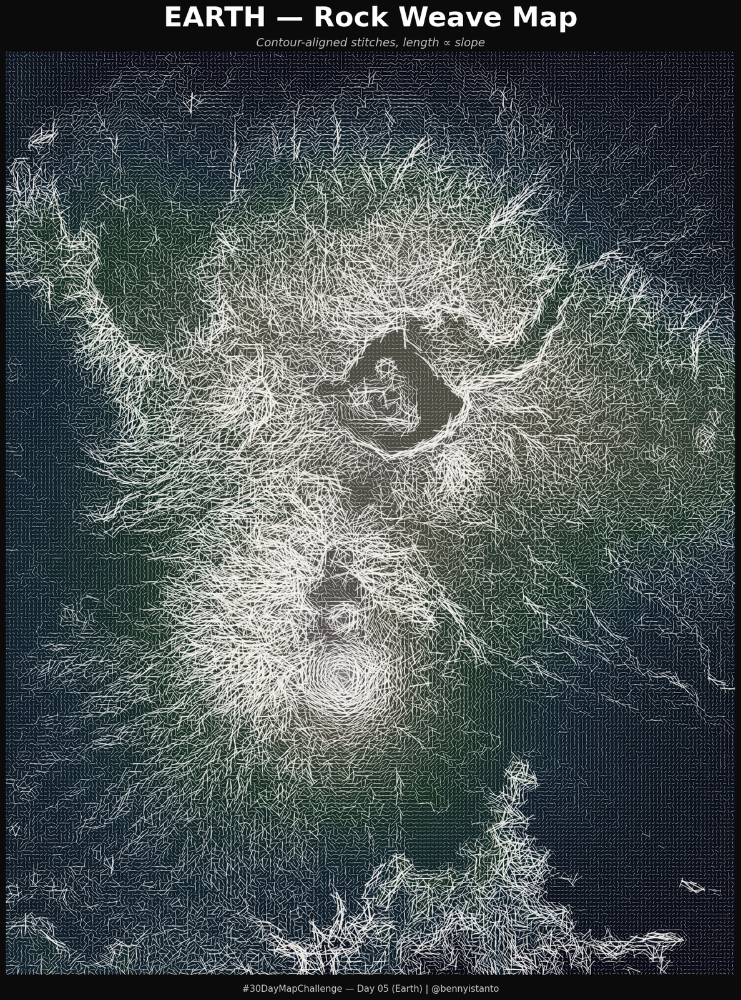

::: {.callout-note collapse="true" title="Python - Day 5, Earth"}
```python
# Lets install rasterio for accessing the GeoTIFF file
!pip install rasterio

"""
DAY 05 — EARTH
Rock Weave Map (Colab-ready uploads)
- Upload a DEM GeoTIFF via Colab's file picker OR point dem_path to Drive.
- Short "stitches" follow contour direction; length ∝ slope.
"""

# -----------------------------
# Imports
# -----------------------------
import os, math, warnings, io
import numpy as np
import matplotlib.pyplot as plt
from matplotlib.collections import LineCollection
from matplotlib.colors import LightSource
import rasterio
from rasterio.enums import Resampling
from rasterio.io import MemoryFile
from scipy.ndimage import sobel, gaussian_filter

warnings.filterwarnings("ignore")

# -----------------------------
# CONFIG — tweak here
# -----------------------------
CFG = {
    # Set to "UPLOAD_IN_COLAB" to open a file chooser (default)
    # Or set to a direct path (e.g., "/content/drive/MyDrive/data/my_dem.tif")
    "dem_path": "/content/tnbts_30m_copdem.tif",

    "target_px": 1400,              # resample longest side to this (speed/quality)
    "stitch_step": 6,               # sampling step (lower = denser)
    "stitch_len_px": (2.0, 16.0),   # min/max segment half-length
    "slope_clip_pct": (5, 98),
    "elev_cmap": "terrain",
    "bg_color": "#0b0b0b",
    "wash_alpha": 0.18,
    "shade_az": 315, "shade_alt": 35, "shade_blur_px": 1.2, "shade_alpha": 0.35,
    "stitch_color": "#f5f3ef",
    "stitch_alpha": 0.85,
    "title": "EARTH — Rock Weave Map",
    "subtitle": "Contour-aligned stitches, length ∝ slope",
    "credit": "#30DayMapChallenge — Day 05 (Earth) | @bennyistanto",
    "dpi": 300,
    "out": "day05_earth_rock_weave.png",
}

# -----------------------------
# Colab helpers: upload or use path
# -----------------------------
def _resolve_dem_source(dem_path):
    """
    Returns (mode, handle)
    mode = "path" and handle is a filesystem path
    mode = "memory" and handle is a rasterio MemoryFile to open
    """
    if dem_path != "UPLOAD_IN_COLAB":
        # direct path (local or Drive)
        if not os.path.exists(dem_path):
            raise FileNotFoundError(f"DEM not found: {dem_path}")
        return "path", dem_path

    # Colab upload flow
    try:
        from google.colab import files
    except Exception as e:
        raise RuntimeError(
            "Colab upload requested, but google.colab not available. "
            "Set CFG['dem_path'] to a valid file path instead."
        )

    print("📤 Please choose your DEM GeoTIFF…")
    uploaded = files.upload()  # opens file chooser
    if not uploaded:
        raise RuntimeError("No file uploaded.")
    fname = next(iter(uploaded.keys()))
    data = uploaded[fname]
    mem = MemoryFile(io.BytesIO(data))
    return "memory", mem

def _read_dem_resample(source_mode, source_handle, target_px):
    """
    Open DEM from (path) or (MemoryFile), resample longest side to target_px.
    Returns (dem_array_float32, transform)
    """
    if source_mode == "path":
        opener = rasterio.open(source_handle)
    else:
        opener = source_handle.open()

    with opener as ds:
        h, w = ds.height, ds.width
        scale = target_px / max(h, w)
        if scale < 1.0:
            out_h = max(1, int(round(h * scale)))
            out_w = max(1, int(round(w * scale)))
            dem = ds.read(1, out_shape=(out_h, out_w), resampling=Resampling.bilinear)
            transform = ds.transform * ds.transform.scale(w / out_w, h / out_h)
        else:
            dem = ds.read(1)
            transform = ds.transform

        # NoData handling
        nodata = ds.nodata
        dem = dem.astype("float32")
        if nodata is not None:
            mask = (dem == nodata) | ~np.isfinite(dem)
        else:
            mask = ~np.isfinite(dem)
        if mask.any():
            mval = np.nanmedian(np.where(mask, np.nan, dem))
            dem[mask] = mval

    return dem, transform

# -----------------------------
# Analysis helpers
# -----------------------------
def _gradients_sobel(z):
    dzdx = sobel(z, axis=1, mode="nearest") / 8.0
    dzdy = sobel(z, axis=0, mode="nearest") / 8.0
    return dzdx, dzdy

def _hillshade(z, az=315, alt=35):
    ls = LightSource(azdeg=az, altdeg=alt)
    z_norm = (z - np.nanmin(z)) / max(1e-9, (np.nanmax(z) - np.nanmin(z)))
    hs = ls.shade(z_norm, vert_exag=1.0, dx=1, dy=1, cmap=plt.cm.gray, fraction=1.0)
    hs = hs[..., 0] if hs.ndim == 3 else hs
    return hs

def _scale_to_01(x, pclip=(5,98)):
    lo, hi = np.percentile(x, pclip)
    return np.clip((x - lo) / max(hi - lo, 1e-9), 0, 1)

# -----------------------------
# Load DEM (from upload or path) & derive fields
# -----------------------------
mode, handle = _resolve_dem_source(CFG["dem_path"])
dem, transform = _read_dem_resample(mode, handle, CFG["target_px"])
dem_blur = gaussian_filter(dem, 0.6)

dzdx, dzdy = _gradients_sobel(dem_blur)
slope_mag = np.hypot(dzdx, dzdy)
slope01   = _scale_to_01(slope_mag, CFG["slope_clip_pct"])

# contour tangent = gradient angle + π/2
theta = np.arctan2(dzdy, dzdx) + np.pi/2.0

# -----------------------------
# Build stitches
# -----------------------------
step   = CFG["stitch_step"]
H, W   = dem.shape
ys, xs = np.mgrid[0:H:step, 0:W:step]
ys = ys.ravel(); xs = xs.ravel()

ang   = theta[ys, xs]
sl01  = slope01[ys, xs]

Lmin, Lmax = CFG["stitch_len_px"]
half_len   = Lmin + (Lmax - Lmin) * sl01

dx = half_len * np.cos(ang)
dy = half_len * np.sin(ang)

x0 = xs - dx; y0 = ys - dy
x1 = xs + dx; y1 = ys + dy
segs = np.stack([np.stack([x0, y0], 1), np.stack([x1, y1], 1)], 1)

lw = 0.4 + 1.2 * sl01

stitches = LineCollection(
    segs,
    colors=CFG["stitch_color"],
    linewidths=lw,
    alpha=CFG["stitch_alpha"],
    capstyle="round", joinstyle="round"
)

# -----------------------------
# Compose figure
# -----------------------------
fig = plt.figure(figsize=(18, 18), facecolor=CFG["bg_color"])
ax  = fig.add_subplot(1,1,1, facecolor=CFG["bg_color"])

elev_norm = (dem - np.nanmin(dem)) / max(1e-9, (np.nanmax(dem)-np.nanmin(dem)))
ax.imshow(elev_norm, cmap=CFG["elev_cmap"], alpha=CFG["wash_alpha"], interpolation="bilinear")

hs = _hillshade(dem_blur, az=CFG["shade_az"], alt=CFG["shade_alt"])
hs = gaussian_filter(hs, CFG["shade_blur_px"])
ax.imshow(hs, cmap="gray", alpha=CFG["shade_alpha"], interpolation="bilinear")

ax.add_collection(stitches)
ax.set_xlim(0, dem.shape[1]); ax.set_ylim(dem.shape[0], 0)
ax.set_aspect("equal"); ax.set_xticks([]); ax.set_yticks([])
for s in ax.spines.values(): s.set_visible(False)

fig.text(0.5, 0.965, CFG["title"], ha="center", va="top",
         fontsize=34, fontweight="bold", color="white")
fig.text(0.5, 0.935, CFG["subtitle"], ha="center", va="top",
         fontsize=14, color="#bcbcbc", style="italic")
fig.text(0.5, 0.03, CFG["credit"], ha="center", va="bottom",
         fontsize=11, color="#cfcfcf")

plt.tight_layout(rect=[0, 0.04, 1, 0.93])
plt.savefig(CFG["out"], dpi=CFG["dpi"], facecolor=CFG["bg_color"], bbox_inches="tight")
print(f"Saved: {CFG['out']}")
plt.show()
```
:::

### Day 6 - Dimensions
Four views of one storm, from IMERG half-hourly rain over Jabodetabek in January 2025: a time-tilted curtain, a voxel storm cube, storm cell tracks, and a spiral rain clock.

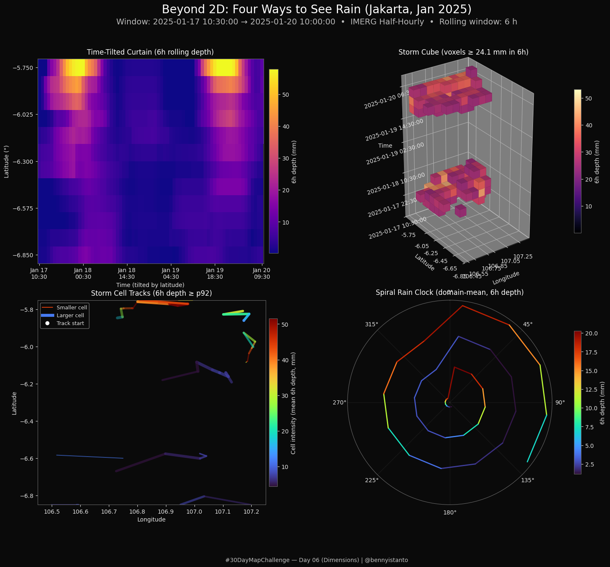

::: {.callout-note collapse="true" title="Python - Day 6, Dimensions"}
```python
# Lets install additional library for accessing multidimensional data
!pip -q install netcdf4 cftime

# ============================================
# Day 6 — Dimensions (2×2 Composite, No-JS)
# Panels:
#  (1) Time-Tilted Curtain   (top-left)
#  (2) Storm Cube (voxels)   (top-right, 3D)
#  (3) Storm Cell Tracks     (bottom-left)  ← REPLACES Rain Ribbons
#  (4) Spiral Rain Clock     (bottom-right, polar)
#
# Output: /content/day6_dimensions_2x2.png
# ============================================

import numpy as np, xarray as xr, pandas as pd
import matplotlib.pyplot as plt
from matplotlib.colors import Normalize
from matplotlib.cm import get_cmap
from matplotlib.lines import Line2D
from matplotlib.collections import LineCollection
from scipy import ndimage as ndi
from pathlib import Path

# ----------------------------
# CONFIG — Edit here if needed
# ----------------------------
FILE = "/content/jabodetabek_halfhourly_rain_202501.nc4"

# Window chooser
MODE = "auto_peak_hours"   # "auto_peak_hours" or "manual"
PEAK_HOURS = 72            # auto: pick 72h window with highest domain-total rolling depth
START = "2025-01-13 00:00" # used only if MODE="manual"
END   = "2025-01-15 23:59"

# Common thinning to keep plots snappy & readable
TIME_THIN_COMMON = 2       # half-hourly -> hourly

# Rolling depth window (mm/hr * 0.5h summed across steps)
ROLL_HOURS = 6             # “storminess” metric used across panels

# Looks
BG = "#0a0a0a"
FG = "#e5e5e5"
DPI = 300

# Panel-specific tweaks
# 1) Time-Tilted Curtain
CURTAIN_CMAP = "plasma"
CURTAIN_TILT = 0.06        # horizontal skew per degree latitude
CURTAIN_LON_PICK = "median"  # "median" or integer index

# 2) Storm Cube
CUBE_TIME_THIN = 4
CUBE_THRESH_MODE = "percentile"  # "percentile" or "mm"
CUBE_THRESH_VALUE = 92.0
CUBE_CMAP = "magma"

# 3) Storm Cell Tracks (replacement for Rain Ribbons)
CELL_TIME_THIN = 2
CELL_PERCENTILE = 92.0         # robust threshold per time slice
CELL_MAX_CELLS_PER_T = 5       # keep strongest N cells per time
CELL_LINK_MAX_DEG = 0.25       # max lon/lat Euclidean distance to link tracks (~25 km at equator)
CELL_CMAP = "turbo"
CELL_ALPHA = 0.95
CELL_LW_MINMAX = (1.4, 5.2)    # line width range (area-scaled)
CELL_START_MS = 52             # start marker size
CELL_END_MS = 24               # end marker size
CELL_MIN_PIX = 2               # minimum pixels in a component to keep

# 4) Spiral Rain Clock
SPIRAL_TIME_THIN = 2
SPIRAL_CMAP = "turbo"
SPIRAL_R_BASE = 0.5
SPIRAL_RADIAL_DAY_GAP = 0.35  # radial spacing per day
SPIRAL_LINEWIDTH = 2.0

# ==================================================
# Load & standardize: precipitation (time, lat, lon)
# ==================================================
assert Path(FILE).exists(), f"File not found: {FILE}"
ds = xr.open_dataset(FILE, engine="netcdf4", decode_times=True)
pr = ds["precipitation"]

# Standardize dims to (time, lat, lon)
if tuple(pr.dims) == ("time", "lon", "lat"):
    pr = pr.transpose("time", "lat", "lon")
elif tuple(pr.dims) != ("time", "lat", "lon"):
    raise ValueError(f"Unexpected dims {pr.dims}; expected ('time','lat','lon') or ('time','lon','lat').")

# Mask fill values if present
for k in ["_FillValue", "missing_value"]:
    if k in pr.attrs:
        pr = pr.where(pr != pr.attrs[k])

time_all = pd.to_datetime(pr.time.values)
lat = pr.lat.values
lon = pr.lon.values

# ==================================================
# Helpers
# ==================================================
def rolling_depth_mm(arr_3d, steps):
    """
    Rolling depth over 'steps' half-hourly frames.
    Input arr_3d shape: (T, Y, X), units mm/hr. Depth per frame = mm/hr * 0.5h.
    Returns same shape (T, Y, X) where each t is sum over last 'steps' frames.
    """
    depth = np.where(np.isfinite(arr_3d), arr_3d * 0.5, 0.0).astype("float32")
    T = depth.shape[0]
    if steps <= 1 or steps > T:
        return depth
    csum = np.cumsum(depth, axis=0)
    out = csum.copy()
    out[steps:] = csum[steps:] - csum[:-steps]
    return out

def sparse_ticks(vals, n=5):
    idx = np.linspace(0, len(vals)-1, min(n, len(vals))).astype(int)
    return idx, [vals[i] for i in idx]

# ==================================================
# Select window
# ==================================================
if MODE == "manual":
    mask = (time_all >= pd.to_datetime(START)) & (time_all <= pd.to_datetime(END))
    assert mask.any(), "Manual window has no data."
    pr_win = pr.sel(time=mask)
else:
    steps_peak = int(PEAK_HOURS * 2)       # half-hourly frames in window
    arr_all = pr.values.astype("float32")  # (T,Y,X)
    depth_peak = rolling_depth_mm(arr_all, steps_peak)
    score = np.nansum(depth_peak, axis=(1,2))
    k_end = int(np.nanargmax(score))
    k_start = max(0, k_end - steps_peak + 1)
    pr_win = pr.isel(time=slice(k_start, k_end+1))
    START = str(pd.to_datetime(pr_win.time.values[0]))
    END   = str(pd.to_datetime(pr_win.time.values[-1]))

# Common time thinning
pr_win = pr_win.isel(time=slice(0, pr_win.sizes["time"], TIME_THIN_COMMON))
time = pd.to_datetime(pr_win.time.values)

# Precompute rolling depth for this window
steps_roll = max(1, int(ROLL_HOURS * 2))
Zroll = rolling_depth_mm(pr_win.values.astype("float32"), steps_roll)  # (T,Y,X)

# =========================
# Create 2×2 composite fig
# =========================
plt.close("all")
from mpl_toolkits.mplot3d import Axes3D  # noqa: F401

fig = plt.figure(figsize=(18, 14), facecolor=BG)
gs = fig.add_gridspec(2, 2, wspace=0.12, hspace=0.18)

# ----------------------------
# (1) Time-Tilted Curtain
# ----------------------------
ax1 = fig.add_subplot(gs[0,0])
ax1.set_facecolor(BG)

# Pick a longitude slice
if CURTAIN_LON_PICK == "median":
    j = int(np.median(np.arange(len(lon))))
else:
    j = int(CURTAIN_LON_PICK)

# Field: (time, lat)
cur = Zroll[:, :, j]  # mm over ROLL_HOURS
# Build skewed X-grid: each lat gets small horizontal shift
T = cur.shape[0]
X_base = np.arange(T)
LAT2 = np.tile(lat[None, :], (T, 1))          # (T, Y)
Xskew = np.tile(X_base[:, None], (1, len(lat))) + CURTAIN_TILT*(LAT2 - lat.mean())

# Color scale robust to spikes
finite = np.isfinite(cur)
vmin, vmax = (np.nanpercentile(cur[finite], [5, 99.5]) if finite.any() else (0, 1))
if vmax <= vmin: vmax = vmin + 1.0
pcm = ax1.pcolormesh(Xskew, LAT2, cur, cmap=CURTAIN_CMAP, shading="auto", vmin=vmin, vmax=vmax)

# Pretty ticks: time on x
ix, xt = sparse_ticks([t.strftime("%b %d\n%H:%M") for t in time], n=min(6, len(time)))
ax1.set_xticks(ix); ax1.set_xticklabels([xtk for xtk in xt], color=FG)
ax1.set_yticks(np.round(np.linspace(lat.min(), lat.max(), 5), 3))
ax1.tick_params(colors=FG)
ax1.set_xlabel("Time (tilted by latitude)", color=FG)
ax1.set_ylabel("Latitude (°)", color=FG)
ax1.set_title("Time-Tilted Curtain ({}h rolling depth)".format(ROLL_HOURS), color="white", pad=8)

cbar1 = fig.colorbar(pcm, ax=ax1, shrink=0.9, pad=0.02)
cbar1.set_label(f"{ROLL_HOURS}h depth (mm)", color=FG)
cbar1.ax.tick_params(colors=FG)

# ----------------------------
# (2) Storm Cube (voxels)
# ----------------------------
ax2 = fig.add_subplot(gs[0,1], projection="3d")
ax2.set_facecolor(BG)

Zc = Zroll[::CUBE_TIME_THIN, :, :]  # (Tc, Y, X)
time_c = time[::CUBE_TIME_THIN]

# Threshold
if CUBE_THRESH_MODE == "percentile":
    finite_vals = Zc[np.isfinite(Zc)]
    thr = np.percentile(finite_vals, CUBE_THRESH_VALUE) if finite_vals.size else 1.0
else:
    thr = float(CUBE_THRESH_VALUE)

mask = np.isfinite(Zc) & (Zc >= thr)
cmap_cube = get_cmap(CUBE_CMAP)
finite = np.isfinite(Zc)
vmin2, vmax2 = (np.nanpercentile(Zc[finite], [5, 99.5]) if finite.any() else (0, 1))
if vmax2 <= vmin2: vmax2 = vmin2 + 1.0
norm2 = Normalize(vmin=vmin2, vmax=vmax2)
colors = cmap_cube(norm2(Zc))

# Permute to (X,Y,Z)
voxels_mask  = np.transpose(mask,  (2,1,0))
voxels_color = np.transpose(colors, (2,1,0,3))

ax2.voxels(voxels_mask, facecolors=voxels_color, edgecolor=None)
nx, ny, nz = voxels_mask.shape
ax2.set_box_aspect((nx, ny, max(1, nz)))
ix, xt = sparse_ticks(np.round(lon, 3),  n=min(6, len(lon)))
iy, yt = sparse_ticks(np.round(lat, 3),  n=min(6, len(lat)))
iz, zt = sparse_ticks([str(t) for t in time_c], n=min(6, len(time_c)))
ax2.set_xticks(ix); ax2.set_yticks(iy); ax2.set_zticks(iz)
ax2.set_xticklabels(xt, color=FG); ax2.set_yticklabels(yt, color=FG); ax2.set_zticklabels(zt, color=FG, rotation=18)
ax2.set_xlabel("Longitude", color=FG, labelpad=6)
ax2.set_ylabel("Latitude",  color=FG, labelpad=6)
ax2.set_zlabel("Time",      color=FG, labelpad=6)
ax2.set_title(f"Storm Cube (voxels ≥ {thr:.1f} mm in {ROLL_HOURS}h)", color="white", pad=8)
m2 = plt.cm.ScalarMappable(norm=norm2, cmap=cmap_cube); m2.set_array([])
cb2 = fig.colorbar(m2, ax=ax2, pad=0.03, shrink=0.7)
cb2.set_label(f"{ROLL_HOURS}h depth (mm)", color=FG); cb2.ax.tick_params(colors=FG)
ax2.view_init(elev=28, azim=235)

# ----------------------------
# (3) Storm Cell Tracks (replacement)
# ----------------------------
ax3 = fig.add_subplot(gs[1,0])
ax3.set_facecolor(BG)

Zt = Zroll[::CELL_TIME_THIN, :, :]     # time-thinned rolling depth
time_t = time[::CELL_TIME_THIN]
Y, X = Zt.shape[1], Zt.shape[2]
Lon, Lat = np.meshgrid(lon, lat)

# Collect components per time: (centroid_lon, centroid_lat, area_pix, intensity_mm)
frames = []
for k in range(Zt.shape[0]):
    Zi = Zt[k]
    finite = np.isfinite(Zi)
    if not finite.any():
        frames.append([])
        continue
    thr = np.percentile(Zi[finite], CELL_PERCENTILE)
    mask = finite & (Zi >= thr)
    if mask.sum() < CELL_MIN_PIX:
        frames.append([])
        continue

    # Connected components (4-connectivity)
    lab, nlab = ndi.label(mask)
    cells = []
    for label in range(1, nlab+1):
        comp = (lab == label)
        npix = int(comp.sum())
        if npix < CELL_MIN_PIX:
            continue
        # intensity-weighted centroid
        weights = Zi * comp
        wsum = np.nansum(weights)
        if wsum <= 0:
            continue
        jj, ii = np.nonzero(comp)  # (lat_index, lon_index)
        # weighted average of lat/lon
        w = weights[comp]
        lat_c = np.average(lat[jj], weights=w)
        lon_c = np.average(lon[ii], weights=w)
        inten = float(np.nanmean(Zi[comp]))
        cells.append((lon_c, lat_c, npix, inten))

    # keep strongest cells by intensity (then area)
    cells.sort(key=lambda x: (x[3], x[2]), reverse=True)
    frames.append(cells[:CELL_MAX_CELLS_PER_T])

# Link cells across time (nearest neighbor within gate)
segments = []   # [( (lon1,lat1), (lon2,lat2), area_scaled, inten ), ...]
starts = []     # [(lon,lat,inten)]
ends = []       # [(lon,lat,inten)]
for k in range(len(frames)-1):
    cur = frames[k]
    nxt = frames[k+1]
    used_next = set()
    for (lon1, lat1, area1, inten1) in cur:
        # find nearest in next frame
        if not nxt:
            continue
        dists = [np.hypot(lon2 - lon1, lat2 - lat1) for (lon2, lat2, _, _) in nxt]
        m = int(np.argmin(dists))
        if dists[m] <= CELL_LINK_MAX_DEG and m not in used_next:
            lon2, lat2, area2, inten2 = nxt[m]
            used_next.add(m)
            # area for width (mean of endpoints), intensity for color (mean)
            segments.append(((lon1, lat1), (lon2, lat2),
                             0.5*(area1+area2), 0.5*(inten1+inten2)))
            if k == 0:
                starts.append((lon1, lat1, inten1))
            if k == len(frames)-2:
                ends.append((lon2, lat2, inten2))

# Prepare styling scalers
areas = np.array([s[2] for s in segments]) if segments else np.array([1.0])
intens = np.array([s[3] for s in segments]) if segments else np.array([0.0])
if areas.size == 0:
    areas = np.array([1.0]); intens = np.array([0.0])
a_min, a_max = float(areas.min()), float(areas.max())
i_min, i_max = float(np.nanpercentile(intens, 5)), float(np.nanpercentile(intens, 99))
if i_max <= i_min: i_max = i_min + 1.0

def scale_area(a):
    if a_max <= a_min: return CELL_LW_MINMAX[0]
    f = (a - a_min) / (a_max - a_min)
    return CELL_LW_MINMAX[0] + f * (CELL_LW_MINMAX[1] - CELL_LW_MINMAX[0])

def color_from_inten(i):
    f = (i - i_min) / (i_max - i_min)
    f = np.clip(f, 0, 1)
    return get_cmap(CELL_CMAP)(f)

# Build a LineCollection for segments with per-segment width + color + temporal fade
lines = []
colors = []
lws = []
if segments:
    # compute a simple time-based fade by re-counting segments per frame index
    # (approximate: earlier segments get lower alpha)
    total = len(segments)
    for idx, seg in enumerate(segments):
        (p1, p2, a, i) = seg
        lines.append([p1, p2])
        c = color_from_inten(i)
        # apply extra alpha fade from early->late
        alpha = CELL_ALPHA * (0.4 + 0.6 * (idx+1)/total)
        colors.append((c[0], c[1], c[2], alpha))
        lws.append(scale_area(a))

lc = LineCollection(lines, colors=colors, linewidths=lws, capstyle="round", zorder=3)
ax3.add_collection(lc)

# Start/end markers
if starts:
    xs, ys, is_ = zip(*starts)
    cs = [color_from_inten(i) for i in is_]
    ax3.scatter(xs, ys, s=CELL_START_MS, c=cs, edgecolors="white", linewidths=0.8, zorder=4)
if ends:
    xe, ye, ie_ = zip(*ends)
    ce = [color_from_inten(i) for i in ie_]
    ax3.scatter(xe, ye, s=CELL_END_MS, c=ce, edgecolors="none", zorder=4, marker="o")

# Frame + labels
ax3.tick_params(colors=FG)
ax3.set_xlabel("Longitude", color=FG)
ax3.set_ylabel("Latitude",  color=FG)
ax3.set_title(f"Storm Cell Tracks ({ROLL_HOURS}h depth ≥ p{int(CELL_PERCENTILE)})", color="white", pad=8)
# --- Colorbar for cell INTENSITY (color on tracks) ---
norm3 = Normalize(vmin=i_min, vmax=i_max)
m3 = plt.cm.ScalarMappable(norm=norm3, cmap=get_cmap(CELL_CMAP)); m3.set_array([])
cb3 = fig.colorbar(m3, ax=ax3, pad=0.012, shrink=0.82)
cb3.set_label(f"Cell intensity (mean {ROLL_HOURS}h depth, mm)", color=FG)
cb3.ax.tick_params(colors=FG)

# --- Compact legend for AREA (line width) + markers ---
proxy = [
    Line2D([0],[0], color=get_cmap(CELL_CMAP)(0.75), lw=CELL_LW_MINMAX[0], label="Smaller cell area"),
    Line2D([0],[0], color=get_cmap(CELL_CMAP)(0.25), lw=CELL_LW_MINMAX[1], label="Larger cell area"),
    Line2D([0],[0], marker="o", lw=0, markersize=6, color="white", markerfacecolor="white",
           markeredgecolor="white", label="Track start"),
    Line2D([0],[0], marker="o", lw=0, markersize=6, color="white", markerfacecolor="none",
           markeredgecolor="white", label="Track end"),
]
leg3 = ax3.legend(
    handles=proxy, title="Encodings", fontsize=9,
    facecolor=BG, edgecolor="#777", framealpha=0.85,
    loc="upper left", bbox_to_anchor=(0.02, 0.98)
)
plt.setp(leg3.get_title(), color="white")
for ttxt in leg3.get_texts(): ttxt.set_color(FG)

# Legend (encoding)
proxy_lines = [
    Line2D([0],[0], color=get_cmap(CELL_CMAP)(0.85), lw=CELL_LW_MINMAX[0], label="Smaller cell"),
    Line2D([0],[0], color=get_cmap(CELL_CMAP)(0.15), lw=CELL_LW_MINMAX[1], label="Larger cell"),
    Line2D([0],[0], color="white", marker="o", lw=0, markersize=6, label="Track start"),
]
leg3 = ax3.legend(handles=proxy_lines, facecolor=BG, edgecolor="#777", framealpha=0.9, fontsize=9)
for ttxt in leg3.get_texts(): ttxt.set_color(FG)

# Set map bounds to data
ax3.set_xlim(lon.min(), lon.max()); ax3.set_ylim(lat.min(), lat.max())

# ----------------------------
# (4) Spiral Rain Clock (polar)
# ----------------------------
ax4 = fig.add_subplot(gs[1,1], projection="polar")
ax4.set_facecolor(BG)

Zs = Zroll[::SPIRAL_TIME_THIN, :, :]
time_s = time[::SPIRAL_TIME_THIN]
# Domain-mean depth per step
mean_depth = np.nanmean(Zs, axis=(1,2))
cmap_s = get_cmap(SPIRAL_CMAP)
finite = np.isfinite(mean_depth)
vmin4, vmax4 = (np.nanpercentile(mean_depth[finite], [5, 99.5]) if finite.any() else (0,1))
if vmax4 <= vmin4: vmax4 = vmin4 + 1.0
norm4 = Normalize(vmin=vmin4, vmax=vmax4)

# Spiral geometry
t0 = time_s.min()
day_idx = np.array([(pd.Timestamp(t).date() - pd.Timestamp(t0).date()).days for t in time_s])
frac_day = (time_s - time_s.floor('D')) / np.timedelta64(1, 'h')
theta = 2*np.pi * (np.array(frac_day) / 24.0)
r = SPIRAL_R_BASE + day_idx * SPIRAL_RADIAL_DAY_GAP

# Draw thin segments between steps so it looks continuous
for k in range(len(theta)-1):
    col = cmap_s(norm4(mean_depth[k]))
    ax4.plot([theta[k], theta[k+1]], [r[k], r[k+1]],
             color=col, lw=SPIRAL_LINEWIDTH, solid_capstyle="round")

ax4.set_theta_zero_location("N")
ax4.set_theta_direction(-1)
ax4.set_rticks([])  # cleaner
ax4.grid(color="#444444", alpha=0.3)
ax4.set_title("Spiral Rain Clock (domain-mean, {}h depth)".format(ROLL_HOURS), color="white", pad=10)
# Small colorbar
m4 = plt.cm.ScalarMappable(norm=norm4, cmap=cmap_s); m4.set_array([])
cb4 = fig.colorbar(m4, ax=ax4, pad=0.08, shrink=0.7)
cb4.set_label(f"{ROLL_HOURS}h depth (mm)", color=FG); cb4.ax.tick_params(colors=FG)

# ----------------------------
# Title + window text + bottom attribution
# ----------------------------
fig.suptitle("Beyond 2D: Four Ways to See Rain (Jakarta, Jan 2025)",
             color="white", fontsize=20, y=0.975)
fig.text(0.5, 0.940, f"Window: {START} → {END}  •  IMERG Half-Hourly  •  Rolling window: {ROLL_HOURS} h",
         ha="center", color="#bbbbbb", fontsize=14)
fig.text(0.5, 0.012, "#30DayMapChallenge — Day 06 (Dimensions) | @bennyistanto",
         ha="center", color="#bfbfbf", fontsize=10)

# Cosmetics for dark theme
for ax in fig.axes:
    try:
        ax.tick_params(colors=FG)
        for spine in getattr(ax, "spines", {}).values():
            spine.set_color("#666666")
    except Exception:
        pass

OUT = "/content/day6_dimensions_2x2.png"
fig.savefig(OUT, dpi=DPI, facecolor=BG, bbox_inches="tight")
print("Saved:", OUT)

plt.show()
```
:::

### Day 7 - Accessibility
Rain-proof reachability in Jakarta. Travel time bent by rainfall, with congestion penalties applied by road class once local rain passes the 85th percentile.

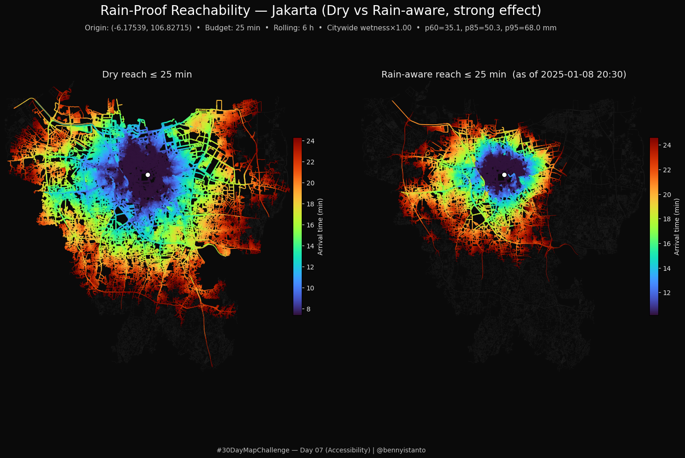

::: {.callout-note collapse="true" title="Python - Day 7, Accessibility"}
```python
# Lets install osmnx to access OpenStreetMap data
1pip intsll osmnx

# ============================================
# Day 7 — Accessibility • Rain-Proof Reachability (Jakarta)
# STRONGER rain impact: non-linear rain penalty + road-class boost + spillover + citywide wetness
# Outputs: /content/day7_rain_proof_reachability_strong.png
# ============================================

# --- Quiet installs for Colab ---
import sys, subprocess
def _pip(pkgs): subprocess.check_call([sys.executable, "-m", "pip", "install", "-q"] + pkgs)
_pip(["osmnx>=1.9.3", "networkx>=3.2", "xarray", "netCDF4", "pandas", "numpy", "matplotlib"])

# --- Imports ---
import os, time, numpy as np, pandas as pd, xarray as xr
import networkx as nx, osmnx as ox, matplotlib.pyplot as plt
from matplotlib.collections import LineCollection
from matplotlib.colors import Normalize
from matplotlib.cm import get_cmap

# ----------------------------
# CONFIG — tweak here
# ----------------------------
IMERG_FILE = "/content/jabodetabek_halfhourly_rain_202501.nc4"
PLACE = "Jakarta, Indonesia"
ORIGIN_LAT, ORIGIN_LON = -6.1753924, 106.827153   # Monas

MODE = "auto_peak_6h"            # "auto_peak_6h" | "manual"
START = "2025-01-17 00:00"       # only if MODE="manual"
END   = "2025-01-18 23:59"

BUDGET_MIN = 25                  # visible reachability cutoff (minutes)
ROLL_HOURS = 6                   # half-hourly → 2 steps/hour

# --- Rain → time multipliers (aggressive but plausible) ---
PENALTY_A = 0.08                 # scale of rain penalty
PENALTY_B = 0.9                  # curvature
MAX_PENALTY = 6.0                # cap the slowdown multiplier

# --- Road-class congestion boosts when local rain >= p85 ---
# You asked to treat OSM 'highway' as: motorway(_link), trunk(_link), primary(_link), secondary(_link)
# Everything else is categorized as non-highway.
CLASS_BOOST_MAIN = {
    "motorway":  2.4,
    "trunk":     2.2,
    "primary":   2.0,
    "secondary": 1.6,
}
NON_HIGHWAY_BOOST = 1.15   # grouped for tertiary/residential/service/unclassified/etc.

# --- Citywide wetness amplification when domain mean ≥ p60 ---
GLOBAL_WET_MULT = 1.18

# --- Render ---
BG = "#0a0a0a"; FG = "#ececec"; EDGE_BASECOLOR = "#3f3f3f"
CMAP = "turbo"; LINEWIDTH_BASE = 0.55; LINEWIDTH_MAX = 2.4; DPI = 300
TITLE = "Rain-Proof Reachability — Jakarta (Dry vs Rain-aware, strong effect)"
ATTR  = "#30DayMapChallenge — Day 07 (Accessibility) | @bennyistanto"

# ----------------------------
# Simple logger (step-level)
# ----------------------------
def log(msg):
    print(f"[{time.strftime('%H:%M:%S')}] {msg}")

# ----------------------------
# Helpers
# ----------------------------
def rolling_depth_mm(arr_3d, steps):
    """Rolling depth over 'steps' half-hourly frames (mm/hr * 0.5h)."""
    depth = np.where(np.isfinite(arr_3d), arr_3d * 0.5, 0.0).astype("float32")
    if steps <= 1 or steps > depth.shape[0]: return depth
    csum = np.cumsum(depth, axis=0)
    out = csum.copy()
    out[steps:] = csum[steps:] - csum[:-steps]
    return out

def nearest_idx(arr, value):
    return int(np.abs(arr - value).argmin())

def shortest_times(G, source_node, weight):
    """Dijkstra travel-time (seconds) from a single source."""
    return nx.single_source_dijkstra_path_length(G, source_node, weight=weight)

def edge_time_map(G, times):
    """Edge → representative time (min of endpoints) for coloring/filtering."""
    m = {}
    for u, v, k in G.edges(keys=True):
        m[(u, v, k)] = min(times.get(u, np.inf), times.get(v, np.inf))
    return m

def collect_edge_segments(G):
    """Convert edges to 2-pt segments for fast LineCollection rendering."""
    segs, keys = [], []
    for u, v, k, d in G.edges(keys=True, data=True):
        if "geometry" in d:
            xs, ys = d["geometry"].xy
            pts = list(zip(xs, ys))
            segs.extend(list(zip(pts[:-1], pts[1:])))
            keys.extend([(u, v, k)] * (len(pts) - 1))
        else:
            segs.append(((G.nodes[u]["x"], G.nodes[u]["y"]), (G.nodes[v]["x"], G.nodes[v]["y"])))
            keys.append((u, v, k))
    return np.array(segs, float), keys

def colors_and_widths(arr_minutes, visible_mask, cmap_name=CMAP):
    """Map minutes → (RGBA, linewidth) with data-driven (5–95%) normalization on visible edges."""
    if visible_mask.sum() == 0: return np.zeros((0,4)), np.array([]), None
    arrv = arr_minutes[visible_mask]
    vmin, vmax = (np.nanpercentile(arrv, [5, 95]) if arrv.size > 5 else (np.nanmin(arrv), np.nanmax(arrv)+1e-6))
    if vmax <= vmin: vmax = vmin + 1e-6
    norm = Normalize(vmin=vmin, vmax=vmax)
    cmap = get_cmap(cmap_name)
    cols = cmap(norm(arrv))
    w = LINEWIDTH_BASE + (LINEWIDTH_MAX - LINEWIDTH_BASE) * (1 - norm(arrv))
    return cols, w, norm

# --- Highway class normalization per your rule ---
def normalize_highway_tag(tag):
    """
    Accepts a string or list from OSM edge['highway'] and returns:
      - main class ∈ {'motorway','trunk','primary','secondary'}
      - or 'non_highway' for everything else.
    Links are mapped to their base (e.g., 'motorway_link' → 'motorway').
    """
    if isinstance(tag, list) and tag: tag = tag[0]
    if not isinstance(tag, str) or not tag:
        return "non_highway"
    t = tag.lower().strip()
    # map *_link to base
    for base in ("motorway", "trunk", "primary", "secondary"):
        if t == base or t == f"{base}_link":
            return base
    return "non_highway"

# ----------------------------
# Load IMERG & pick the "wet" instant
# ----------------------------
log("Loading IMERG and selecting wet 6h window …")
assert os.path.exists(IMERG_FILE), f"Missing {IMERG_FILE}"
ds = xr.open_dataset(IMERG_FILE, engine="netcdf4", decode_times=True)
pr = ds["precipitation"]
if tuple(pr.dims) == ("time", "lon", "lat"): pr = pr.transpose("time", "lat", "lon")
elif tuple(pr.dims) != ("time", "lat", "lon"):
    raise ValueError(f"Unexpected dims {pr.dims}")

for k in ["_FillValue", "missing_value"]:
    if k in pr.attrs: pr = pr.where(pr != pr.attrs[k])

time_all = pd.to_datetime(pr.time.values)
lat = pr.lat.values; lon = pr.lon.values

if MODE == "manual":
    mask = (time_all >= pd.to_datetime(START)) & (time_all <= pd.to_datetime(END))
    assert mask.any(), "Manual window has no data."
    pr_win = pr.sel(time=mask)
else:
    steps = int(ROLL_HOURS*2)
    depth6 = rolling_depth_mm(pr.values.astype("float32"), steps)
    score = np.nansum(depth6, axis=(1,2))
    t_end = int(np.nanargmax(score)); t_start = max(0, t_end - steps + 1)
    pr_win = pr.isel(time=slice(t_start, t_end+1))
    START = str(pd.to_datetime(pr_win.time.values[0])); END = str(pd.to_datetime(pr_win.time.values[-1]))

Zroll = rolling_depth_mm(pr_win.values.astype("float32"), int(ROLL_HOURS*2))  # (T,Y,X)
Z_now = Zroll[-1]                      # recent 6h depth in mm (lat,lon)
time_now = pd.to_datetime(pr_win.time.values[-1])

finite = np.isfinite(Z_now)
if finite.any():
    p60, p85, p95 = np.nanpercentile(Z_now[finite], [60, 85, 95])
    dom_mean = float(np.nanmean(Z_now))
else:
    p60 = p85 = p95 = 1.0; dom_mean = 0.0

# 3×3 neighborhood mean (spillover)
Z_pad = np.pad(Z_now, 1, mode='edge')
Z_nei = (
    Z_pad[0:-2,0:-2] + Z_pad[0:-2,1:-1] + Z_pad[0:-2,2:] +
    Z_pad[1:-1,0:-2] + Z_pad[1:-1,1:-1] + Z_pad[1:-1,2:] +
    Z_pad[2:  ,0:-2] + Z_pad[2:  ,1:-1] + Z_pad[2:  ,2:]
) / 9.0
log(f"Window: {START} → {END} | mean={dom_mean:.2f}, p60={p60:.2f}, p85={p85:.2f}, p95={p95:.2f} (mm/6h)")

# ----------------------------
# Load graph(s)
# ----------------------------
log("Downloading/building OSM graph …")
ox.settings.use_cache = True; ox.settings.log_console = False
G = ox.graph_from_place(PLACE, network_type="drive")
G = ox.add_edge_speeds(G); G = ox.add_edge_travel_times(G)
G_rain = G.copy()
log(f"Graph: nodes={G.number_of_nodes():,}, edges={G.number_of_edges():,}")

# Helpers to get local & neighborhood rain at lon/lat
def ij_from_lonlat(lon_pt, lat_pt):
    j = nearest_idx(lon, lon_pt); i = nearest_idx(lat, lat_pt)
    return i, j

def local_mm(lon_pt, lat_pt):
    i,j = ij_from_lonlat(lon_pt, lat_pt)
    return float(Z_now[i, j]), float(Z_nei[i, j])

# Global wetness multiplier
global_mult = GLOBAL_WET_MULT if dom_mean >= p60 else 1.0
log(f"Global wet multiplier: {global_mult:.2f}")

# --- Assign rain travel times with strong effects ---
log("Applying rain penalties to edges …")
for u, v, k, d in G_rain.edges(keys=True, data=True):
    # midpoint for sampling
    if "geometry" in d:
        xs, ys = d["geometry"].xy
        mx = float(xs[len(xs)//2]); my = float(ys[len(ys)//2])
    else:
        mx = float((G_rain.nodes[u]["x"] + G_rain.nodes[v]["x"]) / 2.0)
        my = float((G_rain.nodes[u]["y"] + G_rain.nodes[v]["y"]) / 2.0)

    mm_loc, mm_nei = local_mm(mx, my)

    # non-linear penalty vs. local/neighbor rain against p85
    ref = max(p85, 1e-6)
    mult_rain = 1.0 + PENALTY_A * ((max(mm_nei, mm_loc) / ref) ** PENALTY_B)
    mult_rain = float(np.clip(mult_rain, 1.0, MAX_PENALTY))

    # --- Road-class boost rule you requested ---
    # Highway classes: motorway(_link), trunk(_link), primary(_link), secondary(_link)
    # Others → 'non_highway'
    hw_raw = d.get("highway")
    hw_class = normalize_highway_tag(hw_raw)
    if mm_loc >= p85:
        if hw_class in CLASS_BOOST_MAIN:
            class_boost = CLASS_BOOST_MAIN[hw_class]
        else:
            class_boost = NON_HIGHWAY_BOOST
    else:
        class_boost = 1.0

    # base dry time (seconds)
    base = d.get("travel_time")
    if base is None:
        speed_kph = d.get("speed_kph", 30.0)
        length_m  = d.get("length", 0.0)
        base = (length_m/1000.0) / max(speed_kph,1e-6) * 3600.0

    d["travel_time_rain"] = float(base * mult_rain * class_boost * global_mult)
    d["rain_mm6"] = float(mm_loc)

# ----------------------------
# Reachability (dry vs rain)
# ----------------------------
log("Running reachability (Dijkstra) …")
origin = ox.distance.nearest_nodes(G, ORIGIN_LON, ORIGIN_LAT)
times_dry  = shortest_times(G,      origin, weight="travel_time")
times_rain = shortest_times(G_rain, origin, weight="travel_time_rain")

emap_dry  = edge_time_map(G,      times_dry)
emap_rain = edge_time_map(G_rain, times_rain)

segs_dry,  keys_dry  = collect_edge_segments(G)
segs_rain, keys_rain = collect_edge_segments(G_rain)

arr_dry  = np.array([emap_dry[k]  for k in keys_dry],  float)/60.0
arr_rain = np.array([emap_rain[k] for k in keys_rain], float)/60.0

vis_dry  = np.isfinite(arr_dry)  & (arr_dry  <= BUDGET_MIN)
vis_rain = np.isfinite(arr_rain) & (arr_rain <= BUDGET_MIN)
log(f"Visible edges ≤ {BUDGET_MIN} min: dry={int(vis_dry.sum()):,}, rain={int(vis_rain.sum()):,}")

cols_dry,  w_dry,  norm_dry  = colors_and_widths(arr_dry,  vis_dry)
cols_rain, w_rain, norm_rain = colors_and_widths(arr_rain, vis_rain)

# ----------------------------
# Plot
# ----------------------------
log("Rendering figure …")
plt.close("all")
fig, axes = plt.subplots(1, 2, figsize=(18, 10), facecolor=BG)
for ax in axes: ax.set_facecolor(BG)

# faint base
for ax, segs in [(axes[0], segs_dry), (axes[1], segs_rain)]:
    base = LineCollection(segs, colors=EDGE_BASECOLOR, linewidths=0.25, alpha=0.28, zorder=1)
    ax.add_collection(base)

# Dry
ax = axes[0]
if vis_dry.sum():
    lc = LineCollection(segs_dry[vis_dry], colors=cols_dry, linewidths=w_dry, zorder=3)
    ax.add_collection(lc)
    sm = plt.cm.ScalarMappable(norm=norm_dry, cmap=CMAP); sm.set_array([])
    cb = fig.colorbar(sm, ax=ax, fraction=0.030, pad=0.01)
    cb.set_label("Arrival time (min)", color=FG); cb.ax.tick_params(colors=FG)
ax.scatter([G.nodes[origin]["x"]],[G.nodes[origin]["y"]], s=60, c="white", edgecolors="black", zorder=5)
ax.set_title(f"Dry reach ≤ {BUDGET_MIN} min", color=FG, fontsize=14)

# Rain
ax = axes[1]
if vis_rain.sum():
    lc = LineCollection(segs_rain[vis_rain], colors=cols_rain, linewidths=w_rain, zorder=3)
    ax.add_collection(lc)
    sm = plt.cm.ScalarMappable(norm=norm_rain, cmap=CMAP); sm.set_array([])
    cb = fig.colorbar(sm, ax=ax, fraction=0.030, pad=0.01)
    cb.set_label("Arrival time (min)", color=FG); cb.ax.tick_params(colors=FG)
ax.scatter([G.nodes[origin]["x"]],[G.nodes[origin]["y"]], s=60, c="white", edgecolors="black", zorder=5)
ax.set_title(f"Rain-aware reach ≤ {BUDGET_MIN} min  (as of {time_now:%Y-%m-%d %H:%M})", color=FG, fontsize=14)

# extent / cosmetics
xs = [d["x"] for _,d in G.nodes(data=True)]; ys = [d["y"] for _,d in G.nodes(data=True)]
xmin, xmax, ymin, ymax = min(xs), max(xs), min(ys), max(ys)
for ax in axes:
    ax.set_xlim(xmin, xmax); ax.set_ylim(ymin, ymax)
    ax.set_aspect("equal"); ax.set_xticks([]); ax.set_yticks([])
    for s in ax.spines.values(): s.set_visible(False)

# Titles & attribution
fig.suptitle(TITLE, color="white", fontsize=20, y=0.97)
fig.text(0.5, 0.915,
         f"Origin: ({ORIGIN_LAT:.5f}, {ORIGIN_LON:.5f})  •  Budget: {BUDGET_MIN} min  •  Rolling: {ROLL_HOURS} h  •  "
         f"Citywide wetness×{global_mult:.2f}  •  p60={p60:.1f}, p85={p85:.1f}, p95={p95:.1f} mm",
         ha="center", color="#c6c6c6", fontsize=11)
fig.text(0.5, 0.012, ATTR, ha="center", color="#bfbfbf", fontsize=10)

OUT = "/content/day7_rain_proof_reachability_strong.png"
fig.savefig(OUT, dpi=DPI, facecolor=BG, bbox_inches="tight")
print("Saved:", OUT)
plt.show()
```
:::

### Day 8 - Urban
Urban grain spectrogram of Kelapa Gading, North Jakarta.

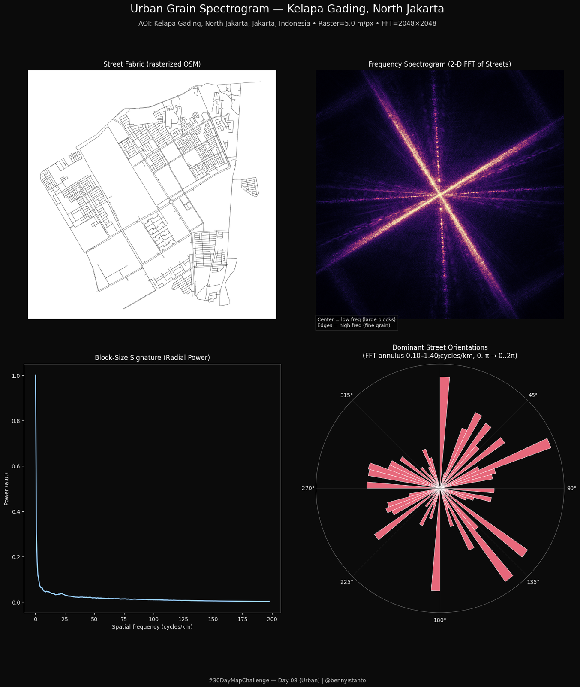

::: {.callout-note collapse="true" title="Python - Day 8, Urban"}
```python
# ============================================
# Day 08 — Urban
# Urban Grain Spectrogram — Kelapa Gading, North Jakarta
# Panels:
#  (1) Street fabric (rasterized OSM)
#  (2) Frequency spectrogram (2-D FFT of streets)
#  (3) Block-size signature (radial power vs frequency)
#  (4) Orientation rose from FFT annulus, NO MIRROR (0..π mapped to 0..2π)
#
# Output: /content/day08_urban_grain_kelapagading.png
# ============================================

import sys, subprocess
def _pip(pkgs): subprocess.check_call([sys.executable, "-m", "pip", "install", "-q"] + pkgs)
_pip(["osmnx>=1.8.0", "networkx>=3.2", "matplotlib", "numpy"])

import numpy as np, matplotlib.pyplot as plt, osmnx as ox
from matplotlib.collections import LineCollection

# ----------------------------
# CONFIG
# ----------------------------
CFG = {
    "place": "Kelapa Gading, North Jakarta, Jakarta, Indonesia",
    "network_type": "drive",
    "ras_res_m": 5.0,          # raster resolution (meters/pixel)
    "fft_size": 2048,          # square raster size (N x N)
    "hann_window": True,       # apply 2-D Hann to reduce ringing
    "rose_r_min_ckm": 0.10,    # annulus inner radius (cycles/km)
    "rose_r_max_ckm": 1.40,    # annulus outer radius (cycles/km)
    "bg": "#0b0b0b", "fg": "#e7e7e7", "cmap_fft": "magma",
    "dpi": 300,
    "out": "/content/day08_urban_grain_kelapagading.png",
}

print("[UrbanSpectrogram] Geocoding AOI:", CFG["place"])
gdf = ox.geocode_to_gdf(CFG["place"])
assert not gdf.empty, "AOI geocoding failed."
poly = gdf.geometry.iloc[0]
print("[UrbanSpectrogram] AOI polygon acquired.")

print("[UrbanSpectrogram] Downloading OSM network (drive) …")
G = ox.graph_from_polygon(poly, network_type=CFG["network_type"])
print(f"[UrbanSpectrogram] Graph: {len(G.nodes)} nodes, {len(G.edges)} edges")

print("[UrbanSpectrogram] Projecting graph to metric CRS …")
Gm = ox.project_graph(G)  # meters

# ----------------------------
# Rasterize the street network to a fixed N×N canvas
# ----------------------------
nodes = ox.graph_to_gdfs(Gm, edges=False)
# Compute a tight bbox around the street nodes, then expand the
# shorter side so the raster stays square (required by FFT).
minx, miny, maxx, maxy = nodes.total_bounds
width_m  = maxx - minx
height_m = maxy - miny

# margin as a small fraction of the longer side (tweakable)
MARGIN_FRAC = 0.05
longer = max(width_m, height_m)
margin = longer * MARGIN_FRAC

# pad bbox by margin
minx -= margin; maxx += margin
miny -= margin; maxy += margin
width_m  = maxx - minx
height_m = maxy - miny

# make the box square by extending the shorter dimension equally on both sides
if width_m > height_m:
    pad = (width_m - height_m) / 2.0
    miny -= pad; maxy += pad
else:
    pad = (height_m - width_m) / 2.0
    minx -= pad; maxx += pad

# Now map this square area onto an N×N raster at ~CFG["ras_res_m"] m/px.
# To honor the requested pixel count (FFT size), we let the pixel size float slightly.
N   = int(CFG["fft_size"])
side_m = max(maxx - minx, maxy - miny)           # square side in meters
mpp = side_m / N                                 # meters per pixel actually used

# final extent
xmin, xmax = minx, maxx
ymin, ymax = miny, maxy

# Collect segments
edges = ox.graph_to_gdfs(Gm, nodes=False)
segs = []
for geom in edges.geometry.values:
    if geom is None:
        continue
    if geom.geom_type == "LineString":
        xs, ys = geom.xy
        pts = np.column_stack([xs, ys])
        segs.extend(list(zip(pts[:-1], pts[1:])))
    elif geom.geom_type == "MultiLineString":
        for ls in geom.geoms:
            xs, ys = ls.xy
            pts = np.column_stack([xs, ys])
            segs.extend(list(zip(pts[:-1], pts[1:])))
segs = np.array(segs, float) if segs else np.zeros((0,2,2), float)

print("[UrbanSpectrogram] Rendering linework to raster …")
plt.ioff()
# Use a 100-dpi canvas with size chosen so pixel grid = N×N exactly
fig_tmp = plt.figure(figsize=(N/100, N/100), dpi=100, facecolor="white")
ax_tmp = fig_tmp.add_axes([0,0,1,1])
ax_tmp.set_xlim(xmin, xmax); ax_tmp.set_ylim(ymin, ymax)
ax_tmp.set_axis_off()
if len(segs):
    ax_tmp.add_collection(LineCollection(segs, colors="black", linewidths=1.0, antialiased=True))

fig_tmp.canvas.draw()
# --- FIX: robust readback across Matplotlib versions
buf = np.asarray(fig_tmp.canvas.buffer_rgba())   # (H, W, 4) uint8 RGBA
H, W, _ = buf.shape
img = buf[:, :, :3]                               # RGB
plt.close(fig_tmp)

# Convert white background + black lines to float image A in [0..1] where streets are 1
A = 1.0 - (img.mean(axis=2) / 255.0)              # white→0, black→1
A = A.astype("float32")

# ----------------------------
# 2-D FFT (optionally windowed)
# ----------------------------
if CFG["hann_window"]:
    h = np.hanning(N); H2 = np.sqrt(np.outer(h, h)).astype("float32")
    Awin = A * H2
else:
    Awin = A

F = np.fft.fftshift(np.fft.fft2(Awin))
P = np.abs(F).astype("float32")

# Frequency axes (cycles/km)
freq = np.fft.fftshift(np.fft.fftfreq(N, d=mpp)) * 1000.0
FX, FY = np.meshgrid(freq, freq)
R = np.sqrt(FX**2 + FY**2)
Theta_half = (np.arctan2(FY, FX) % np.pi)  # 0..π

# Radial power
r_bins = np.linspace(0, freq.max(), 300)
r_cent = 0.5*(r_bins[:-1] + r_bins[1:])
rad_pow = np.zeros_like(r_cent)
for i in range(len(r_bins)-1):
    m = (R >= r_bins[i]) & (R < r_bins[i+1])
    if np.any(m): rad_pow[i] = P[m].mean()
rad_pow = rad_pow / (rad_pow.max() + 1e-9)

# Orientation rose from annulus, NO MIRROR: map 0..π → 0..2π
rmin, rmax = CFG["rose_r_min_ckm"], CFG["rose_r_max_ckm"]
ann = (R >= rmin) & (R <= rmax) & np.isfinite(P)
bins = 72
edges_half = np.linspace(0, np.pi, bins+1)
centers_half = (edges_half[:-1] + edges_half[1:]) / 2.0
rose_half = np.zeros(bins, dtype="float32")
for i in range(bins):
    m = ann & (Theta_half >= edges_half[i]) & (Theta_half < edges_half[i+1])
    if np.any(m): rose_half[i] = P[m].mean()
rose_half = rose_half / (rose_half.max() + 1e-9)
theta_plot = 2.0 * centers_half         # 0..2π fill without mirroring
width = (2*np.pi) / bins

print("[UrbanSpectrogram] Plotting …")
# =========================
# Figure layout
# =========================
plt.close("all")
fig = plt.figure(figsize=(18, 18), facecolor=CFG["bg"])
gs = fig.add_gridspec(2, 2, wspace=0.12, hspace=0.18)

# (1) Street fabric
ax1 = fig.add_subplot(gs[0,0])
ax1.imshow(A, cmap="gray_r", origin="lower")
ax1.set_title("Street Fabric (rasterized OSM)", color="white", pad=8)
ax1.set_xticks([]); ax1.set_yticks([]); [s.set_visible(False) for s in ax1.spines.values()]
ax1.set_facecolor(CFG["bg"])

# (2) Frequency spectrogram
ax2 = fig.add_subplot(gs[0,1])
vmax = np.percentile(P, 99)
ax2.imshow(P, cmap=CFG["cmap_fft"], origin="lower", vmin=0, vmax=vmax)
ax2.text(12, 18, "Center = low freq (large blocks)\nEdges = high freq (fine grain)",
         color="#dddddd", fontsize=9, ha="left", va="top",
         bbox=dict(facecolor="#00000080", edgecolor="#ffffff20", pad=4))
ax2.set_title("Frequency Spectrogram (2-D FFT of Streets)", color="white", pad=8)
ax2.set_xticks([]); ax2.set_yticks([]); [s.set_visible(False) for s in ax2.spines.values()]
ax2.set_facecolor(CFG["bg"])

# (3) Radial power
ax3 = fig.add_subplot(gs[1,0])
ax3.plot(r_cent, rad_pow, color="#9ad1ff", lw=2)
ax3.set_title("Block-Size Signature (Radial Power)", color="white", pad=8)
ax3.set_xlabel("Spatial frequency (cycles/km)", color=CFG["fg"])
ax3.set_ylabel("Power (a.u.)", color=CFG["fg"])
ax3.tick_params(colors=CFG["fg"])
for s in ax3.spines.values(): s.set_color("#666666")
ax3.set_facecolor(CFG["bg"])

# (4) Orientation rose (no mirror; full circle)
ax4 = fig.add_subplot(gs[1,1], projection="polar"); ax4.set_facecolor(CFG["bg"])
ax4.bar(theta_plot, rose_half, width=width, color="#fb7185", alpha=0.92,
        edgecolor="#ffffff22", linewidth=0.6, bottom=0.0)
ax4.set_theta_zero_location("N"); ax4.set_theta_direction(-1)
ax4.set_rticks([]); ax4.grid(color="#444444", alpha=0.3)
ax4.set_title(f"Dominant Street Orientations\n(FFT annulus {rmin:.2f}–{rmax:.2f} cycles/km, 0..π → 0..2π)",
              color="white", pad=12)

# Titles & attribution
fig.suptitle("Urban Grain Spectrogram — Kelapa Gading, North Jakarta", color="white", fontsize=20, y=0.975)
fig.text(0.5, 0.944,
         f"AOI: {CFG['place']} • Raster={CFG['ras_res_m']:.1f} m/px • FFT={CFG['fft_size']}×{CFG['fft_size']}",
         ha="center", color="#cfcfcf", fontsize=12)
fig.text(0.5, 0.012, "#30DayMapChallenge — Day 08 (Urban) | @bennyistanto",
         ha="center", color="#bfbfbf", fontsize=10)

# Dark cosmetics
for ax in fig.axes:
    try:
        ax.tick_params(colors=CFG["fg"])
        for s in getattr(ax, "spines", {}).values():
            s.set_color("#666666")
    except Exception:
        pass

fig.savefig(CFG["out"], dpi=CFG["dpi"], facecolor=CFG["bg"], bbox_inches="tight")
print("Saved:", CFG["out"])
plt.show()
```
:::

### Day 9 - Analog
An Austronesian crop and tide calendar wheel, drawn in a hand-sketched style using the Humor Sans font.

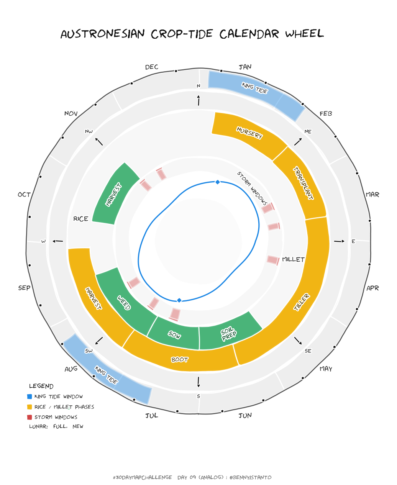

::: {.callout-note collapse="true" title="Python - Day 9, Analog"}
```python
# Install Humor Sans font for XKCD style
!apt-get update -qq
!apt-get install -y fonts-humor-sans

# Clear matplotlib font cache so it recognizes the new font
!rm -rf ~/.cache/matplotlib

import matplotlib.pyplot as plt
import matplotlib.font_manager as fm

# Force matplotlib to rebuild its font cache
# This happens automatically when we clear the cache
import matplotlib as mpl
mpl.font_manager._load_fontmanager(try_read_cache=False)

# Verify Humor Sans is available
fonts = [f.name for f in fm.fontManager.ttflist]
if 'Humor Sans' in fonts:
    print("✓ Humor Sans font is available!")
else:
    print("✗ Humor Sans not found. Try restarting runtime.")

# List all available fonts (optional - for debugging)
print("Available fonts:", sorted(set(fonts)))

import numpy as np
import matplotlib.pyplot as plt
from matplotlib.patches import Wedge, FancyArrowPatch

# Enable XKCD style with Humor Sans font
with plt.xkcd():
    plt.rcParams['font.family'] = 'Humor Sans'

    # ----------------------------
    # THEME / LAYOUT
    # ----------------------------
    DPI        = 300
    SIZE_PX    = 4096
    FIGSIZE_IN = (SIZE_PX/DPI, SIZE_PX/DPI)

    BG          = "#ffffff"
    FG          = "#111111"
    FG_SOFT     = "#333333"
    RIM         = "#555555"

    COL_TIDE     = "#1e88e5"
    COL_RICE     = "#f1b514"
    COL_MILLET   = "#49b379"
    COL_STORM    = "#d04444"
    COL_WINDBAND = "#f0f0f0"
    COL_BAND     = "#f7f7f7"

    TITLE = "Austronesian Crop–Tide Calendar Wheel"
    ATTR  = "#30DayMapChallenge — Day 09 (Analog) | @bennyistanto"

    R_OUTER      = 1.00
    GAP          = 0.012
    B_W_MONTH    = 0.12
    B_W_WIND     = 0.10
    B_W_CROP     = 0.26
    B_W_STORM    = 0.08
    R_INNER_WELL = 0.34

    MONTHS      = ["Jan","Feb","Mar","Apr","May","Jun","Jul","Aug","Sep","Oct","Nov","Dec"]
    N_MONTHS    = 12

    LUNAR_R_OFFSET   = -0.006
    LUNAR_MS         = 2.6
    LUNAR_ROT        = 7.5
    LUNAR_JITTER_DEG = 0.7
    LUNAR_R_WOBBLE   = 0.008
    LUNAR_COUNT      = 24

    KING_WINDOWS = [(0, 1, 0.12, 0.30), (6, 7, 0.58, 0.78)]

    WIND_DIRS_DEG   = np.arange(0,360,45)
    WIND_DIR_LABELS = ["N","NE","E","SE","S","SW","W","NW"]

    RICE_PHASES = [(0.02,0.12,"Nursery"),(0.12,0.22,"Transplant"),(0.22,0.45,"Tiller"),
                   (0.45,0.60,"Boot"),(0.60,0.74,"Harvest")]
    MILLET_PHASES = [(0.40,0.50,"Soil\nprep"),(0.50,0.58,"Sow"),(0.58,0.70,"Weed"),(0.78,0.88,"Harvest")]

    WEEK_TICK_LEN = 0.010
    WEEK_TICK_W   = 1.2

    STORM_BURSTS = [(0.18,0.015),(0.22,0.012),(0.29,0.015),(0.55,0.018),(0.60,0.013),(0.66,0.015),
                    (0.88,0.012),(0.92,0.012)]
    STORM_ALPHA_FILL = 0.22
    STORM_ALPHA_EDGE = 0.55

    TIDE_CYCLES   = 2
    TIDE_AMP      = 0.06
    TIDE_MARKS_FR = [0.05, 0.55]

    np.random.seed(4421)
    print("[Wheel/White/FilledStorm/XKCD] Rendering…")

    # ----------------------------
    # Helper Functions
    # ----------------------------
    def f2theta(fr):
        """fraction [0..1) → polar angle (0 at north, clockwise)."""
        return np.deg2rad(90) - 2*np.pi*fr

    def wedge(ax, r0, r1, f0, f1, color, alpha=1.0, edgecolor="none", linewidth=0.0):
        th0 = np.rad2deg(f2theta(f1))
        th1 = np.rad2deg(f2theta(f0))
        w = Wedge((0,0), r1, th0, th1, width=(r1-r0))
        w.set_facecolor(color); w.set_alpha(alpha)
        w.set_edgecolor(edgecolor); w.set_linewidth(linewidth)
        ax.add_patch(w)

    def ring(ax, r0, r1, color):
        wedge(ax, r0, r1, 0.0, 1.0, color)

    def tick(ax, r, theta, length, color, lw=1.0):
        ax.plot([theta, theta], [r, r-length], color=color, lw=lw, solid_capstyle="butt")

    def label_polar(ax, text, r, theta, color=FG, size=12, ha="center", va="center"):
        x, y = r*np.cos(theta), r*np.sin(theta)
        ax.text(x, y, text, color=color, fontsize=size, ha=ha, va=va)

    def arc_label(ax, r_mid, f0, f1, text, color=FG, size=12):
        theta_mid = f2theta((f0+f1)/2)
        x, y = r_mid*np.cos(theta_mid), r_mid*np.sin(theta_mid)
        ax.text(x, y, text, color=color, fontsize=size, ha="center", va="center")

    def arrow(ax, theta, r_mid, r_len, color, lw=1.8):
        r0 = r_mid - r_len/2; r1 = r_mid + r_len/2
        x0,y0 = r0*np.cos(theta), r0*np.sin(theta)
        x1,y1 = r1*np.cos(theta), r1*np.sin(theta)
        ax.add_patch(FancyArrowPatch((x0,y0),(x1,y1), arrowstyle='-|>', mutation_scale=8,
                                     lw=lw, color=color))

    def weekly_ticks(ax, r_outer, f0, f1, color=FG):
        weeks = np.arange(0, 1.0001, 1/52)
        sel = weeks[(weeks>=f0) & (weeks<=f1)]
        for w in sel:
            tick(ax, r_outer, f2theta(w), WEEK_TICK_LEN, color, lw=WEEK_TICK_W)

    # ----------------------------
    # Create Figure
    # ----------------------------
    plt.close("all")
    fig = plt.figure(figsize=FIGSIZE_IN, facecolor=BG)
    ax  = fig.add_subplot(111)
    ax.set_aspect("equal"); ax.axis("off")
    ax.set_xlim(-1.12, 1.12); ax.set_ylim(-1.12, 1.12)
    ax.set_facecolor(BG)

    # (1) Months ring
    rM_out = R_OUTER; rM_in = rM_out - B_W_MONTH
    ring(ax, rM_in, rM_out, COL_BAND)
    for i,m in enumerate(MONTHS):
        f0, f1 = i/N_MONTHS, (i+1)/N_MONTHS
        wedge(ax, rM_in+GAP*0.25, rM_out-GAP*0.25, f0, f1, "#eeeeee", alpha=1.0)
        th = f2theta((f0+f1)/2)
        label_polar(ax, m, rM_out+0.045, th, FG_SOFT, size=14)

    # (1b) Lunar markers
    r_lunar_base = rM_out + LUNAR_R_OFFSET
    rot = np.deg2rad(LUNAR_ROT)
    for k in range(LUNAR_COUNT):
        f  = (k / LUNAR_COUNT) % 1.0
        th = f2theta(f) + rot + np.deg2rad(np.random.uniform(-LUNAR_JITTER_DEG, LUNAR_JITTER_DEG))
        r_mark = r_lunar_base + 0.006*np.sin(2*np.pi*k/LUNAR_COUNT)
        ax.plot(r_mark*np.cos(th), r_mark*np.sin(th),
                marker=("o" if k%2==0 else "s"), ms=LUNAR_MS, color=FG)

    # (1c) King tide windows
    for (m0,m1,fs,fe) in KING_WINDOWS:
        base0 = m0/N_MONTHS; base1 = m1/N_MONTHS
        f0 = base0 + fs*(1/N_MONTHS); f1 = base1 + fe*(1/N_MONTHS)
        wedge(ax, rM_in+0.01, rM_out-0.01, f0, f1, COL_TIDE, alpha=0.25)
        arc_label(ax, rM_out-0.03, f0, f1, "King tide", color=FG_SOFT, size=11)

    # (2) Wind rose ring
    rW_out = rM_in - GAP; rW_in = rW_out - B_W_WIND
    ring(ax, rW_in, rW_out, COL_WINDBAND)
    rW_mid = (rW_in + rW_out)/2
    for idx,deg in enumerate(WIND_DIRS_DEG):
        th = np.deg2rad(90 - deg)
        arrow(ax, th, rW_mid, (rW_out-rW_in)*0.72, FG, lw=1.8)
        label_polar(ax, WIND_DIR_LABELS[idx], rW_out+0.03, th, FG_SOFT, size=11)

    # (3) Crop bands
    rC_out = rW_in - GAP; rC_in = rC_out - B_W_CROP
    ring(ax, rC_in, rC_out, COL_BAND)

    # Rice outer
    rR_in = rC_out - (B_W_CROP*0.48)
    for f0,f1,lab in RICE_PHASES:
        wedge(ax, rR_in, rC_out, f0, f1, COL_RICE, alpha=0.95)
        weekly_ticks(ax, rC_out, f0, f1, FG)
        arc_label(ax, (rR_in+rC_out)/2, f0, f1, lab, color="#5a4200", size=12)

    # Millet inner
    rM2_out = rC_in + (B_W_CROP*0.50)
    for f0,f1,lab in MILLET_PHASES:
        wedge(ax, rC_in, rM2_out, f0, f1, COL_MILLET, alpha=0.95)
        weekly_ticks(ax, rM2_out, f0, f1, FG)
        arc_label(ax, (rC_in+rM2_out)/2, f0, f1, lab, color="#0c4e29", size=12)

    label_polar(ax, "RICE",   (rR_in+rC_out)/2,  f2theta(0.78), FG_SOFT, size=14)
    label_polar(ax, "MILLET", (rC_in+rM2_out)/2, f2theta(0.28), FG_SOFT, size=14)

    # (4) Storm ring
    rS_out = rC_in - GAP; rS_in = rS_out - B_W_STORM
    ring(ax, rS_in, rS_out, COL_BAND)
    for fc,fw in STORM_BURSTS:
        f0 = max(0.0, fc - fw/2); f1 = min(1.0, fc + fw/2)
        wedge(ax, rS_in+0.008, rS_out-0.008, f0, f1, COL_STORM, alpha=STORM_ALPHA_FILL)
        wedge(ax, rS_out-0.008, rS_out-0.006, f0, f1, COL_STORM, alpha=STORM_ALPHA_EDGE)

    arc_label(ax, (rS_in+rS_out)/2, 0.12, 0.18, "Storm windows", color=FG_SOFT, size=11)

    # (5) Tide well
    r0 = R_INNER_WELL
    theta = np.linspace(0, 2*np.pi, 800)
    r_sin = r0 - 0.01 + TIDE_AMP*np.sin(TIDE_CYCLES*theta)
    ax.plot(r_sin*np.cos(theta), r_sin*np.sin(theta), color=COL_TIDE, lw=2.4)
    for fr in TIDE_MARKS_FR:
        th = f2theta(fr)
        rp = r0 + 0.02
        ax.plot(rp*np.cos(th), rp*np.sin(th), marker="D", ms=5, color=COL_TIDE)

    # Inner disk
    ax.add_patch(plt.Circle((0,0), r0-0.09, facecolor="#fbfbfb", edgecolor="none"))

    # Legend
    def legend_dot(ax, x, y, txt, col):
        ax.plot(x, y, marker="s", ms=8, color=col)
        ax.text(x+0.03, y, txt, color=FG_SOFT, fontsize=11, va="center", ha="left")

    legend_x, legend_y = -0.98, -0.92
    ax.text(legend_x, legend_y+0.08, "Legend", color=FG, fontsize=13, ha="left", va="center")
    legend_dot(ax, legend_x,       legend_y+0.02, "King tide window", COL_TIDE)
    legend_dot(ax, legend_x,       legend_y-0.04, "Rice / Millet phases", COL_RICE)
    legend_dot(ax, legend_x+0.22,  legend_y-0.04, " ", COL_MILLET)
    legend_dot(ax, legend_x,       legend_y-0.10, "Storm windows", COL_STORM)
    ax.text(legend_x, legend_y-0.16, "Lunar: o full, - new", color=FG_SOFT, fontsize=11, ha="left")

    # Rim + text
    ax.add_patch(plt.Circle((0,0), 1.0, facecolor="none", edgecolor=RIM, linewidth=2.0))
    fig.text(0.5, 0.965, TITLE, ha="center", va="top", color=FG, fontsize=24)
    fig.text(0.5, 0.020, ATTR,  ha="center", va="bottom", color="#666666", fontsize=11)

    # Save files
    PNG = "day9_calendar_wheel_xkcd.png"
    SVG = "day9_calendar_wheel_xkcd.svg"
    fig.savefig(PNG, dpi=DPI, facecolor=BG, bbox_inches="tight")
    fig.savefig(SVG, dpi=DPI, facecolor=BG, bbox_inches="tight")

    print(f"✓ Saved: {PNG}")
    print(f"✓ Saved: {SVG}")

    plt.show()
```
:::

### Day 10 - Air
Global wind patterns.

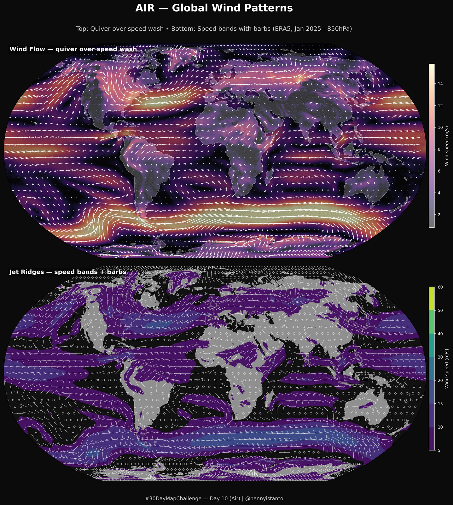

::: {.callout-note collapse="true" title="Python - Day 10, Air"}
```python
# Lets install additional library
!pip -q install netCDF4 cartopy

"""
DAY 10 — AIR (Global • Robinson)
Wind Flow & Jet Ridges (Quiver + Barbs) — tuned for your ERA5 file:
  dims: valid_time=1, pressure_level=2, latitude=721 (decreasing), longitude=1440 (0..359.75)
  vars: u, v (m s-1)

Left  : Wind glyphs (quiver) over speed wash
Right : Speed bands (filled contours) + decimated wind barbs

Notes:
- Uses Cartopy with Robinson projection (global extent).
- Quiver/Barbs are projection-aware (transform=ccrs.PlateCarree()).
- Keep CFG structure, rich comments, and gapless layout.
"""

# -----------------------------
# Imports
# -----------------------------
import os, io, warnings
import numpy as np
import matplotlib.pyplot as plt
from matplotlib.colors import Normalize
from matplotlib.cm import get_cmap

warnings.filterwarnings("ignore")

import xarray as xr
import cartopy.crs as ccrs
import cartopy.feature as cfeature

# -----------------------------
# CONFIG — tweak here
# -----------------------------
CFG = {
    # NetCDF source: set to "UPLOAD_IN_COLAB" to open a file chooser in Colab
    "nc_path": "/content/era5_uv_202501.nc",

    # Pick nearest pressure level (hPa)
    "level_hpa": 850,            # e.g., 250 for jets, 850 for low-level flow

    # If multiple valid_time entries exist, choose by index
    "time_index": 0,

    # GLOBAL extent (Robinson) — leave crop None for world
    "crop_bbox": None,           # (min_lon, max_lon, min_lat, max_lat)

    # Resampling target (post-crop) to keep plotting snappy
    "target_nx": 720,
    "target_ny": 361,

    # Map styling
    "bg_color": "#0b0b0b",
    "land_color": "#909090",
    "ocean_color": "#111111",
    "coast_color": "#B4B4B4",

    # Figure text
    "dpi": 300,
    "title": "AIR — Global Wind Patterns",
    "subtitle": "Top: Quiver over speed wash • Bottom: Speed bands with barbs (ERA5, Jan 2025 - 850hPa)",
    "credit": "#30DayMapChallenge — Day 10 (Air) | @bennyistanto",
    "out_png": "day10_air_global.png",
    "out_svg": "day10_air_global.svg",

    # Top panel (quiver over wash)
    "wash_cmap": "magma",
    "wash_alpha": 0.55,
    "quiver_skip": 10,             # plot every Nth grid point
    "quiver_scale": 550,           # larger → shorter arrows (matplotlib quiver scale)
    "quiver_width": 0.0012,
    "quiver_color": "white",
    "quiver_alpha": 0.90,

    # Bottom panel (bands + barbs)
    "bands_levels": [5,10,15,20,30,40,50,60],  # m/s
    "bands_cmap": "viridis",
    "barb_skip": 10,
    "barb_color": "white",
    "barb_alpha": 0.85,
    "barb_length": 5,
    "barb_linewidth": 0.4,

    # Layout (gapless two panels + top band)
    "top_band": 0.085,
    "bottom_pad": 0.048,
    "left_pad": 0.018,
    "right_pad": 0.986,
    "gutter": 0.006,
}

# -----------------------------
# Colab upload helper
# -----------------------------
def _resolve_nc_source(nc_path: str) -> str:
    if nc_path != "UPLOAD_IN_COLAB":
        if not os.path.exists(nc_path):
            raise FileNotFoundError(f"NetCDF not found: {nc_path}")
        return nc_path
    try:
        from google.colab import files
    except Exception:
        raise RuntimeError("Colab upload requested, but google.colab not available.")
    print("[LOG] Pick your NetCDF (e.g., era5_uv_202501.nc) …")
    up = files.upload()
    if not up:
        raise RuntimeError("No file uploaded.")
    return next(iter(up.keys()))

# -----------------------------
# Data helpers
# -----------------------------
def _open_and_select(nc_path, level_hpa=250, time_index=0):
    """
    Open ERA5 file, select nearest pressure level and first time,
    and return u, v DataArrays with normalized longitude (-180..180) and ascending latitude.
    """
    ds = xr.open_dataset(nc_path)

    if "u" not in ds.variables or "v" not in ds.variables:
        raise KeyError("Variables 'u' and 'v' not found in dataset.")

    u = ds["u"]; v = ds["v"]

    # Select time slice if time-like dim exists (valid_time per your file)
    time_dims = [d for d in u.dims if d in ("time","valid_time","initial_time","forecast_time")]
    if time_dims:
        td = time_dims[0]
        u = u.isel({td: time_index})
        v = v.isel({td: time_index})

    # Select nearest pressure level
    lev_name = None
    for cand in ("pressure_level", "isobaricInhPa", "level", "isobaricInPa"):
        if cand in u.dims:
            lev_name = cand
            break
    if lev_name is not None:
        lev_vals = u[lev_name].values
        nearest_idx = int(np.argmin(np.abs(lev_vals - level_hpa)))
        u = u.isel({lev_name: nearest_idx})
        v = v.isel({lev_name: nearest_idx})

    # Normalize longitudes 0..360 → -180..180; sort ascending
    lon_name = "longitude" if "longitude" in u.coords else ("lon" if "lon" in u.coords else None)
    lat_name = "latitude"  if "latitude"  in u.coords else ("lat" if "lat" in u.coords else None)

    if lon_name:
        lon = u[lon_name].values
        if lon.min() >= 0 and lon.max() > 180:
            lon = ((lon + 180) % 360) - 180
            u = u.assign_coords({lon_name: lon}).sortby(lon_name)
            v = v.assign_coords({lon_name: lon}).sortby(lon_name)

    # Ensure latitude is ascending
    if lat_name:
        lat = u[lat_name].values
        if np.any(np.diff(lat) < 0):
            u = u.sortby(lat_name)
            v = v.sortby(lat_name)

    return u.squeeze(drop=True), v.squeeze(drop=True)

def _crop_bbox(da, bbox):
    """Crop by (min_lon, max_lon, min_lat, max_lat) if lon/lat present; None → passthrough."""
    if bbox is None:
        return da
    lon_name = "longitude" if "longitude" in da.coords else ("lon" if "lon" in da.coords else None)
    lat_name = "latitude"  if "latitude"  in da.coords else ("lat" if "lat" in da.coords else None)
    if lon_name and lat_name:
        return da.sel({lon_name: slice(bbox[0], bbox[1]),
                       lat_name: slice(bbox[2], bbox[3])})
    return da

def _resample_like(da, target_nx, target_ny):
    """Interpolate to roughly target size."""
    lon_name = "longitude" if "longitude" in da.coords else ("lon" if "lon" in da.coords else None)
    lat_name = "latitude"  if "latitude"  in da.coords else ("lat" if "lat" in da.coords else None)
    if not (lon_name and lat_name):
        return da
    nx = da.sizes[lon_name]; ny = da.sizes[lat_name]
    if nx <= target_nx and ny <= target_ny:
        return da
    new_lons = np.linspace(float(da[lon_name].values.min()),
                           float(da[lon_name].values.max()),
                           target_nx)
    new_lats = np.linspace(float(da[lat_name].values.min()),
                           float(da[lat_name].values.max()),
                           target_ny)
    return da.interp({lon_name: new_lons, lat_name: new_lats})

def _to_arrays(u_da, v_da):
    """Return lon, lat grids and arrays for U, V, SPEED (PlateCarree coords)."""
    lon_name = "longitude" if "longitude" in u_da.coords else ("lon" if "lon" in u_da.coords else u_da.dims[-1])
    lat_name = "latitude"  if "latitude"  in u_da.coords else ("lat" if "lat" in u_da.coords else u_da.dims[-2])
    LON, LAT = np.meshgrid(u_da[lon_name].values, u_da[lat_name].values)
    U = u_da.values
    V = v_da.values
    SPEED = np.hypot(U, V)
    return (LON, LAT, U, V, SPEED)

# -----------------------------
# Load & prepare data
# -----------------------------
print("[LOG] Resolving NetCDF source …")
nc_path = _resolve_nc_source(CFG["nc_path"])

print("[LOG] Opening and selecting time/level …")
u, v = _open_and_select(nc_path, level_hpa=CFG["level_hpa"], time_index=CFG["time_index"])

# Optional crop (keep None for true global)
if CFG["crop_bbox"] is not None:
    print("[LOG] Cropping to bbox:", CFG["crop_bbox"])
    u = _crop_bbox(u, CFG["crop_bbox"])
    v = _crop_bbox(v, CFG["crop_bbox"])

print("[LOG] Resampling to manageable grid …")
u = _resample_like(u, CFG["target_nx"], CFG["target_ny"])
v = _resample_like(v, CFG["target_nx"], CFG["target_ny"])
u, v = xr.align(u, v, join="inner")

LON, LAT, U, V, SPEED = _to_arrays(u, v)

# -----------------------------
# Compose figure — GAPLESS PANELS (1 column × 2 rows, Robinson)
# -----------------------------
print("[LOG] Rendering figure (Robinson, global • stacked) …")
plt.close("all")
fig = plt.figure(figsize=(12, 14), dpi=CFG["dpi"], facecolor=CFG["bg_color"])

# Layout (stacked): top band for title/subtitle, slim bottom pad, one vertical gutter
top_band   = CFG.get("top_band", 0.085)
bottom_pad = CFG.get("bottom_pad", 0.048)
left_pad   = CFG.get("left_pad", 0.018)
right_pad  = CFG.get("right_pad", 0.986)
v_gutter   = CFG.get("gutter", 0.006)    # vertical gutter between panels

usable_width  = (right_pad - left_pad)
usable_height = (1.0 - top_band - bottom_pad)
panel_h       = (usable_height - v_gutter) / 2.0
panel_w       = usable_width

# Map projections
proj = ccrs.Robinson()
pc   = ccrs.PlateCarree()

# TOP panel (ax1): Quiver over speed wash
ax1 = fig.add_axes([left_pad, bottom_pad + panel_h + v_gutter, panel_w, panel_h],
                   projection=proj, facecolor=CFG["bg_color"])
# BOTTOM panel (ax2): Speed bands + barbs
ax2 = fig.add_axes([left_pad, bottom_pad, panel_w, panel_h],
                   projection=proj, facecolor=CFG["bg_color"])

for ax in (ax1, ax2):
    ax.set_global()
    ax.add_feature(cfeature.OCEAN.with_scale("50m"), facecolor=CFG["ocean_color"])
    ax.add_feature(cfeature.LAND.with_scale("50m"),  facecolor=CFG["land_color"])
    ax.coastlines(color=CFG["coast_color"], linewidth=0.4)
    try:
        ax.gridlines(draw_labels=False, linewidth=0.2, color="#666", alpha=0.15)
    except Exception:
        pass

# -----------------------------
# TOP: Quiver over speed wash + colorbar
# -----------------------------
wash_cmap = get_cmap(CFG["wash_cmap"])
norm_top = Normalize(vmin=np.nanpercentile(SPEED, 5), vmax=np.nanpercentile(SPEED, 98))

im_top = ax1.pcolormesh(LON, LAT, SPEED,
                        cmap=wash_cmap, norm=norm_top,
                        transform=pc, shading="auto",
                        alpha=CFG["wash_alpha"])

sk = max(1, int(CFG["quiver_skip"]))
ax1.quiver(LON[::sk, ::sk], LAT[::sk, ::sk],
           U[::sk, ::sk], V[::sk, ::sk],
           transform=pc,
           color=CFG["quiver_color"],
           alpha=CFG["quiver_alpha"],
           scale=CFG["quiver_scale"],
           width=float(CFG["quiver_width"]))   # <-- use CFG to control arrow line width

ax1.text(0.014, 0.985, "Wind Flow — quiver over speed wash",
         transform=ax1.transAxes, ha="left", va="top",
         color="w", fontsize=12, weight="semibold",
         bbox=dict(facecolor=(0,0,0,0.35), edgecolor="none", boxstyle="round,pad=0.25"))

# Compact colorbar for TOP panel (to the right of ax1)
p1  = ax1.get_position()
cax1 = fig.add_axes([p1.x1 + 0.006, p1.y0 + 0.06, 0.012, 0.32])
cb1  = plt.colorbar(im_top, cax=cax1)
cb1.ax.tick_params(labelsize=8, colors="w")
for spine in cb1.ax.spines.values(): spine.set_color("w")
cb1.set_label("Wind speed (m/s)", color="w", fontsize=9)

# -----------------------------
# BOTTOM: Speed bands + barbs + colorbar
# -----------------------------
levels = CFG["bands_levels"]
cf = ax2.contourf(LON, LAT, SPEED,
                  levels=levels, cmap=CFG["bands_cmap"],
                  transform=pc, alpha=0.98, antialiased=True)

skb = max(1, int(CFG["barb_skip"]))
ax2.barbs(LON[::skb, ::skb], LAT[::skb, ::skb],
          U[::skb, ::skb], V[::skb, ::skb],
          transform=pc,
          color=CFG["barb_color"],
          alpha=CFG["barb_alpha"],
          length=CFG["barb_length"],
          linewidth=CFG["barb_linewidth"])

ax2.text(0.014, 0.985, "Jet Ridges — speed bands + barbs",
         transform=ax2.transAxes, ha="left", va="top",
         color="w", fontsize=12, weight="semibold",
         bbox=dict(facecolor=(0,0,0,0.35), edgecolor="none", boxstyle="round,pad=0.25"))

# Colorbar for BOTTOM panel (to the right of ax2)
p2  = ax2.get_position()
cax2 = fig.add_axes([p2.x1 + 0.006, p2.y0 + 0.06, 0.012, 0.32])
cb2  = plt.colorbar(cf, cax=cax2)
cb2.ax.tick_params(labelsize=8, colors="w")
for spine in cb2.ax.spines.values(): spine.set_color("w")
cb2.set_label("Wind speed (m/s)", color="w", fontsize=9)


# -----------------------------
# Global title / subtitle / credit
# -----------------------------
fig.text(0.5, 1.0 - 0.012, CFG["title"], ha="center", va="top",
         color="white", fontsize=20, weight="bold")
fig.text(0.5, 1.0 - 0.065, CFG["subtitle"], ha="center", color="#cfcfcf", fontsize=12)
fig.text(0.5, 0.015, CFG["credit"],  ha="center", color="#cfcfcf", fontsize=10)

# -----------------------------
# Save PNG + SVG (zero padding)
# -----------------------------
plt.savefig(CFG["out_png"], dpi=CFG["dpi"], facecolor=CFG["bg_color"],
            bbox_inches="tight", pad_inches=0.0)
plt.savefig(CFG["out_svg"], dpi=CFG["dpi"], facecolor=CFG["bg_color"],
            bbox_inches="tight", pad_inches=0.0)
print(f"[LOG] Saved → {CFG['out_png']}")
print(f"[LOG] Saved → {CFG['out_svg']}")
plt.show()
```
:::

### Day 11 - Minimal map
Two primitives only: a faint graticule every 20 degrees, and Tissot's indicatrices at 500 km radius. No coastlines and no fills, so the subject is the distortion field of the Robinson projection itself.

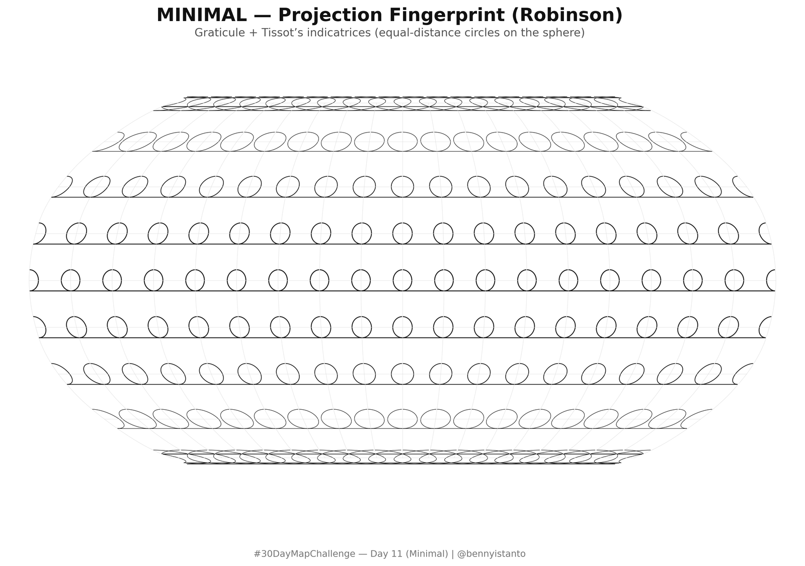

::: {.callout-note collapse="true" title="Python - Day 11, Minimal map"}
```python
"""
DAY 11 — Minimal Map
Projection Fingerprint: Tissot's Indicatrix in Robinson

Concept
-------
A map made only of:
- A faint global graticule (every 20°)
- Tissot's indicatrices (small equal-distance geodesic circles) at grid intersections

Why it's unusual (yet minimal):
- No coastlines or land fills — the projection’s distortion pattern *is* the map.
- One accent color, hairline weights, and sparse labels (optional).

Outputs: PNG + SVG
"""

# -----------------------------
# Imports
# -----------------------------
import numpy as np
import matplotlib.pyplot as plt
from matplotlib.path import Path
from matplotlib.patches import PathPatch
from pyproj import CRS, Transformer, Geod

# -----------------------------
# CONFIG — tweak here
# -----------------------------
CFG = {
    # Canvas & style
    "dpi": 300,
    "bg_color": "#ffffff",   # figure & axes background (paper white)
    "ink_color": "#111111",  # primary strokes, titles
    "graticule":  "#dddddd", # faint gridlines
    "grid_lw": 0.35,
    "grid_alpha": 0.85,

    "circle_color": "#111111",  # Tissot circles (black ink)
    "circle_alpha": 0.95,
    "circle_lw_min": 0.35,      # clamp for polar taper
    "circle_lw_max": 0.90,

    "title": "MINIMAL — Projection Fingerprint (Robinson)",
    "subtitle": "Graticule + Tissot’s indicatrices (equal-distance circles on the sphere)",
    "credit": "#30DayMapChallenge — Day 11 (Minimal) | @bennyistanto",
    "out_png": "day11_minimal_projection_fingerprint.png",
    "out_svg": "day11_minimal_projection_fingerprint.svg",

    # Projection
    # Robinson (meters). Using proj string avoids extra dependencies.
    "proj4": "+proj=robin +lon_0=0 +x_0=0 +y_0=0 +datum=WGS84 +units=m +no_defs",

    # Graticule
    "lat_step": 20,              # degrees
    "lon_step": 20,              # degrees
    "lat_lim": (-80, 80),        # avoid the very poles for neatness

    # Tissot’s indicatrix settings
    "grid_lat_step": 20,         # intersection every 20°
    "grid_lon_step": 20,
    "circle_radius_km": 500,     # geodesic radius for Tissot circles
    "circle_segments": 120,      # smoother circles → higher value
    # Optional visual taper by latitude (keeps high-lat ellipses delicate)
    "lat_linewidth_scale": True,
}

# -----------------------------
# Helpers
# -----------------------------
def project_lonlat_to_xy(lon, lat, transformer):
    """Vectorized lon/lat → x/y using the given pyproj Transformer (always_xy=True)."""
    x, y = transformer.transform(lon, lat)
    return x, y

def geodesic_circle(lon0, lat0, radius_km, n=120, geod=None):
    """
    Points of a small geodesic circle on the ellipsoid using forward solves.
    Ensures lon, lat, az, dist are SAME-LENGTH arrays to satisfy pyproj.
    """
    if geod is None:
        geod = Geod(ellps="WGS84")
    az = np.linspace(0.0, 360.0, int(n), endpoint=False, dtype="float64")
    lon0_arr = np.full(az.shape, float(lon0), dtype="float64")
    lat0_arr = np.full(az.shape, float(lat0), dtype="float64")
    dist_arr = np.full(az.shape, float(radius_km) * 1000.0, dtype="float64")
    lon, lat, _ = geod.fwd(lon0_arr, lat0_arr, az, dist_arr)
    return lon, lat

def add_polyline(ax, lon_seq, lat_seq, transformer, **plotkw):
    """Project and plot a lon/lat polyline (e.g., a graticule line)."""
    x, y = project_lonlat_to_xy(np.asarray(lon_seq), np.asarray(lat_seq), transformer)
    ax.plot(x, y, **plotkw)

def add_tissot(ax, lon0, lat0, transformer, geod, radius_km, nseg=120,
               color="#111111", lw=0.6, alpha=1.0):
    """Add one Tissot circle centered at lon0, lat0."""
    lon, lat = geodesic_circle(lon0, lat0, radius_km, n=nseg, geod=geod)
    x, y = project_lonlat_to_xy(lon, lat, transformer)
    verts = np.column_stack([x, y])
    codes = np.full(len(verts), Path.LINETO); codes[0] = Path.MOVETO
    patch = PathPatch(
        Path(verts, codes),
        facecolor="none",
        edgecolor=color,
        lw=lw,
        alpha=alpha,
        antialiased=True
    )
    ax.add_patch(patch)

# -----------------------------
# Build figure
# -----------------------------
plt.close("all")
# A bit wider than tall to suit Robinson world extents
fig = plt.figure(figsize=(14, 8), dpi=CFG["dpi"], facecolor=CFG["bg_color"])
ax  = fig.add_subplot(1, 1, 1, facecolor=CFG["bg_color"])

# Projection transformer (WGS84 → Robinson)
crs_robin = CRS.from_proj4(CFG["proj4"])
crs_geo   = CRS.from_epsg(4326)
transformer = Transformer.from_crs(crs_geo, crs_robin, always_xy=True)
geod = Geod(ellps="WGS84")

# -----------------------------
# Graticule (lon/lat lines) — faint hairlines
# -----------------------------
lat_lines = np.arange(CFG["lat_lim"][0], CFG["lat_lim"][1] + 1e-6, CFG["lat_step"])
lon_lines = np.arange(-180, 180 + 1e-6, CFG["lon_step"])

# Latitude lines (constant lat, lon sweeps)
for lat in lat_lines:
    lon_seq = np.linspace(-180, 180, 721)
    lat_seq = np.full_like(lon_seq, lat)
    add_polyline(
        ax, lon_seq, lat_seq, transformer,
        color=CFG["graticule"], lw=CFG["grid_lw"], alpha=CFG["grid_alpha"]
    )

# Longitude lines (constant lon, lat sweeps)
for lon in lon_lines:
    lat_seq = np.linspace(CFG["lat_lim"][0], CFG["lat_lim"][1], 401)
    lon_seq = np.full_like(lat_seq, lon)
    add_polyline(
        ax, lon_seq, lat_seq, transformer,
        color=CFG["graticule"], lw=CFG["grid_lw"], alpha=CFG["grid_alpha"]
    )

# -----------------------------
# Tissot’s indicatrices (circle → ellipse after projection)
# -----------------------------
grid_lats = np.arange(CFG["lat_lim"][0], CFG["lat_lim"][1] + 1e-6, CFG["grid_lat_step"])
grid_lons = np.arange(-180, 180, CFG["grid_lon_step"])

for lat0 in grid_lats:
    # Optional linewidth taper by latitude (keeps high-lat ellipses delicate)
    if CFG["lat_linewidth_scale"]:
        # scale ~ cos(lat) clamped
        base = np.cos(np.deg2rad(lat0))
        scale = np.clip(base, 0.5, 1.0)
    else:
        scale = 1.0
    lw = np.clip(CFG["circle_lw_max"] * scale, CFG["circle_lw_min"], CFG["circle_lw_max"])

    for lon0 in grid_lons:
        add_tissot(
            ax, lon0, lat0, transformer, geod,
            radius_km=CFG["circle_radius_km"],
            nseg=CFG["circle_segments"],
            color=CFG["circle_color"],
            lw=lw,
            alpha=CFG["circle_alpha"]
        )

# -----------------------------
# Axes cosmetics
# -----------------------------
ax.set_aspect("equal")
# Robinson spans roughly ±17,000 km in X and ±8,700 km in Y; pad a little.
ax.set_xlim(-1.8e7, 1.8e7)
ax.set_ylim(-9.8e6, 9.8e6)
ax.set_xticks([]); ax.set_yticks([])
for sp in ax.spines.values():
    sp.set_visible(False)

# Title / subtitle / credit (ink on white)
fig.text(0.5, 0.965, CFG["title"], ha="center", va="top",
         color=CFG["ink_color"], fontsize=18, weight="bold")
fig.text(0.5, 0.915, CFG["subtitle"], ha="center",
         color="#555555", fontsize=11)
fig.text(0.5, 0.02, CFG["credit"], ha="center",
         color="#777777", fontsize=9)

# Save (PNG + SVG)
fig.savefig(CFG["out_png"], dpi=CFG["dpi"], facecolor=CFG["bg_color"], bbox_inches="tight", pad_inches=0)
fig.savefig(CFG["out_svg"], dpi=CFG["dpi"], facecolor=CFG["bg_color"], bbox_inches="tight", pad_inches=0)
print("[Minimal/ProjectionFingerprint] Saved:", CFG["out_png"])
print("[Minimal/ProjectionFingerprint] Saved:", CFG["out_svg"])

plt.show()
```
:::

### Day 12 - Map from 2125
An interplanetary transit network for the inner solar system, drawn as it might look a century from now.

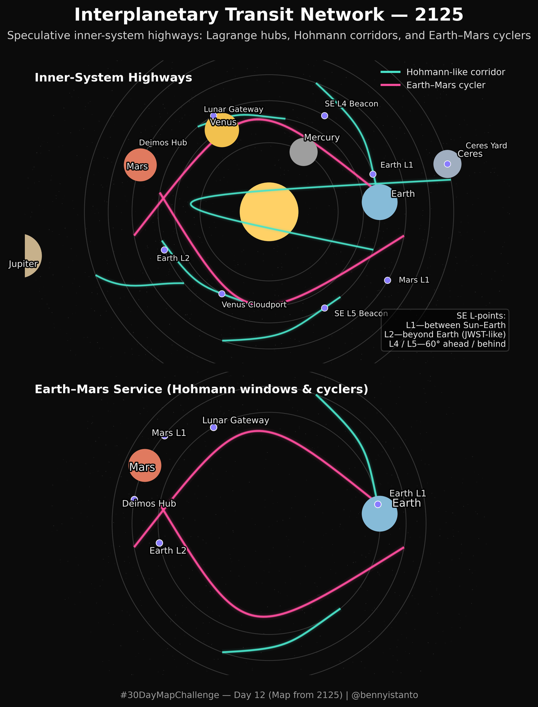

::: {.callout-note collapse="true" title="Python - Day 12, Map from 2125"}
```python
"""
DAY 12 — Map from 2125 (v3.1)
Interplanetary Transit Network — inner system emphasis, better labels, legend, and Lagrange explainer
"""

import numpy as np
import matplotlib.pyplot as plt
from matplotlib.patches import Circle, PathPatch
from matplotlib.path import Path
import matplotlib.patheffects as pe
import matplotlib.lines as mlines
import logging
from time import perf_counter

# -----------------------------
# CONFIG
# -----------------------------
CFG = {
    "dpi": 300,
    "figsize": (14, 10),
    "bg": "#0b0b0b",
    "ring": "#3a3a3a",
    "sun": "#FFD166",
    "label": "#eaeaea",
    "hub_fill": "#8A7CFF",
    "hub_edge": "#ffffff",
    "corridor": "#49E2C8",   # legend: Hohmann-like corridor
    "cycler": "#FF4D9E",     # legend: Earth–Mars cycler
    "title": "Interplanetary Transit Network — 2125",
    "subtitle": "Speculative inner-system highways: Lagrange hubs, Hohmann corridors, and Earth–Mars cyclers",
    "credit": "#30DayMapChallenge — Day 12 (Map from 2125) | @bennyistanto",

    "out_png": "day12_interplanetary_transit_2125_v3.png",
    "out_svg": "day12_interplanetary_transit_2125_v3.svg",

    # Layout (two stacked panels)
    "top_band": 0.085, "bottom_pad": 0.050, "left_pad": 0.03, "right_pad": 0.97, "gutter": 0.012,

    # ---- Inner-system emphasis ----
    # Plot extent in "warped AU" after applying radial_warp().
    "au_extent": 2.2,             # fill the frame with Sun→Mars; Jupiter hinted only
    "radial_warp_mode": "sqrt",   # 'linear' | 'sqrt' | 'log' | 'piecewise'
    "piecewise_kink": 1.7,        # if mode='piecewise', kink AU where scale changes
    "piecewise_scale_out": 0.55,  # outer multiplier (<1 compresses outer system)

    # Planet semi-major axes (AU)
    "orbits": [
        ("Mercury", 0.387, "#9E9E9E"),
        ("Venus",   0.723, "#F2C14E"),
        ("Earth",   1.000, "#86BBD8"),
        ("Mars",    1.524, "#E07A5F"),
        ("Ceres",   2.767, "#A0AEC0"),
        ("Jupiter", 5.204, "#C7B18B"),
    ],

    # Hubs (name, r AU, angle deg)
    "hubs": [
        ("Earth L1", 1.00-0.01,  20),
        ("Earth L2", 1.00+0.01, 200),
        ("Lunar Gateway", 1.00, 120),
        ("SE L4 Beacon", 1.00, 60),
        ("SE L5 Beacon", 1.00, 300),
        ("Venus Cloudport", 0.723, 240),
        ("Mars L1", 1.524-0.01, 330),
        ("Deimos Hub", 1.524, 150),
        ("Ceres Yard", 2.767, 15),
    ],

    # Corridors (Hohmann-ish arcs)
    "corridors": [
        ((1.00,   5), (1.524,  70)),
        ((1.524, 250), (1.00,  310)),
        ((1.00,  195), (0.723, 260)),
        ((0.723,  80), (1.00,  130)),
        ((1.00,  340), (2.767,  10)),
        ((2.767, 200), (1.00,  220)),
    ],

    # Earth–Mars cyclers (stylized)
    "cyclers": [
        ((1.0, 10), (1.524, 190)),
        ((1.0, 170), (1.524, 350)),
    ],
}

# ---- drawing order (z) ----
Z_BG = 1
Z_RINGS = 3
Z_LINES = 10         # corridors & cyclers  (below planets & labels)
Z_PLANETS = 20       # planets
Z_HUBS = 22          # hubs
Z_LABELS = 25        # text, on top

# ---- planet marker radii in "warped AU" ----
# (Smaller than before; also allow per-planet tweaks via PLANET_SIZE)
R_PLANET = 0.028
R_JUPITER = 0.036

PLANET_COLORS = {
    "Mercury": "#9E9E9E",
    "Venus":   "#F2C14E",
    "Earth":   "#86BBD8",
    "Mars":    "#E07A5F",
    "Ceres":   "#A0AEC0",
    "Jupiter": "#C7B18B",
}
PLANET_SIZE = {
    "Mercury": 0.016, "Venus": 0.024, "Earth": 0.026, "Mars": 0.022,
    "Ceres": 0.016, "Jupiter": 0.040
}
def planet_radius(name): return PLANET_SIZE.get(name, R_PLANET)

# -----------------------------
# Logging
# -----------------------------
logging.basicConfig(level=logging.INFO, format="[%(levelname)s] %(message)s")
log = logging.getLogger("DAY12")
t0 = perf_counter()

# -----------------------------
# Helpers (geometry + warp)
# -----------------------------
def radial_warp(r):
    mode = CFG["radial_warp_mode"]
    if mode == "linear":
        return r
    if mode == "sqrt":
        return np.sqrt(r)
    if mode == "log":
        return np.log1p(r) * (CFG["au_extent"]/np.log1p(CFG["au_extent"]))
    if mode == "piecewise":
        k = CFG["piecewise_kink"]; s = CFG["piecewise_scale_out"]
        r = np.asarray(r)
        out = r.copy()
        out[r <= k] = r[r <= k]
        out[r >  k] = k + (r[r > k]-k)*s
        return out
    return r

def pol2xy(r, deg):
    th = np.deg2rad(deg)
    rw = radial_warp(r)
    return rw*np.cos(th), rw*np.sin(th)

def arc_path(r0, th0, r1, th1, ctrl_scale=0.6):
    x0,y0 = pol2xy(r0, th0)
    x3,y3 = pol2xy(r1, th1)
    thm = (np.deg2rad(th0) + np.deg2rad(th1))/2
    rm  = (r0 + r1)/2
    # control points pulled toward mid-radius, then warped
    r1c = r0 + ctrl_scale*(rm - r0)
    r2c = r1 + ctrl_scale*(rm - r1)
    x1,y1 = radial_warp(r1c)*np.cos(thm), radial_warp(r1c)*np.sin(thm)
    x2,y2 = radial_warp(r2c)*np.cos(thm), radial_warp(r2c)*np.sin(thm)
    verts = [(x0,y0),(x1,y1),(x2,y2),(x3,y3)]
    codes = [Path.MOVETO, Path.CURVE4, Path.CURVE4, Path.CURVE4]
    return Path(verts, codes)

def starfield(ax, n=1000, rmax=CFG["au_extent"], jitter=0.006):
    rng = np.random.default_rng(2125)
    r = rmax * np.sqrt(rng.random(n))
    th = 2*np.pi * rng.random(n)
    x = r*np.cos(th) + rng.normal(0, jitter, n)
    y = r*np.sin(th) + rng.normal(0, jitter, n)
    ax.scatter(x, y, s=rng.uniform(0.1, 0.9, n),
               c="#ffffff", alpha=rng.uniform(0.04, 0.12, n), lw=0)

# ---- Label placement helpers ----
HALO = [pe.withStroke(linewidth=2.4, foreground="#000000")]
def place_label(ax, r, deg, text, color=CFG["label"], fs=9, dr=0.10, ang_push=0.06):
    """
    Angle-aware offsets + small radial nudge; returns the text artist.
    dr: base radial offset in warped AU; ang_push: perpendicular offset.
    """
    th = np.deg2rad(deg)
    x,y = pol2xy(r, deg)
    # Offset slightly outward and a touch along tangent to reduce collisions
    xo = x + dr*np.cos(th) - ang_push*np.sin(th)
    yo = y + dr*np.sin(th) + ang_push*np.cos(th)
    return ax.text(xo, yo, text, color=color, fontsize=fs, ha="left", va="center",
                   path_effects=HALO, zorder=Z_LABELS)

def nudge_if_overlap(ax, texts, max_iter=60, step=0.015):
    """
    Simple de-overlap: if two text bboxes overlap, nudge the latter outward a bit.
    Keeps it cheap—works well with our sparse labels.
    """
    fig = ax.figure
    fig.canvas.draw()  # ensure bbox valid
    for _ in range(max_iter):
        moved = False
        bbs = [t.get_window_extent(fig.canvas.get_renderer()) for t in texts]
        for i in range(len(texts)):
            for j in range(i+1, len(texts)):
                if bbs[i].overlaps(bbs[j]):
                    xi, yi = texts[j].get_position()
                    texts[j].set_position((xi+step, yi+step))
                    moved = True
        if not moved:
            break

# ---- Drawing helpers ----
def draw_planet(ax, name, a, ang, z=Z_PLANETS):
    """Place a filled planet circle using canonical colors & per-planet size."""
    x, y = pol2xy(a, ang)
    rr = planet_radius(name)
    ax.add_patch(Circle((x, y), radial_warp(rr),
                        fc=PLANET_COLORS.get(name, "#aaaaaa"),
                        ec="none", zorder=z))
    return x, y

# -----------------------------
# Figure / layout
# -----------------------------
plt.close("all")
fig = plt.figure(figsize=CFG["figsize"], dpi=CFG["dpi"], facecolor=CFG["bg"])
L,R = CFG["left_pad"], CFG["right_pad"]
T,B,G = CFG["top_band"], CFG["bottom_pad"], CFG["gutter"]
H = 1 - T - B
PH = (H - G)/2
ax_top = fig.add_axes([L, B+PH+G, R-L, PH], facecolor=CFG["bg"])
ax_bot = fig.add_axes([L, B,       R-L, PH], facecolor=CFG["bg"])

for ax in (ax_top, ax_bot):
    ax.set_aspect("equal")
    ax.set_xlim(-CFG["au_extent"], CFG["au_extent"])
    ax.set_ylim(-CFG["au_extent"]*0.62, CFG["au_extent"]*0.62)
    ax.set_xticks([]); ax.set_yticks([])
    for s in ax.spines.values(): s.set_visible(False)

# -----------------------------
# TOP panel — Inner-System Highways
# -----------------------------
log.info("Top: inner-system highways (starfield → orbits → lines → planets/hubs → labels)")
starfield(ax_top, n=1400, rmax=CFG["au_extent"])

# Orbits (warped; hint Jupiter just outside frame)
for name, a, col in CFG["orbits"]:
    ra = radial_warp(a if name != "Jupiter" else 2.1)
    ax_top.add_patch(Circle((0,0), ra, fill=False, ec=CFG["ring"],
                            lw=0.8, alpha=0.9, zorder=Z_RINGS))

# Lines below markers/labels
for (r0,t0),(r1,t1) in CFG["corridors"]:
    P = arc_path(r0,t0,r1,t1,ctrl_scale=0.7)
    ax_top.add_patch(PathPatch(P, lw=6.0, ec=CFG["corridor"], fc="none", alpha=0.05, zorder=Z_LINES))
    ax_top.add_patch(PathPatch(P, lw=3.0, ec=CFG["corridor"], fc="none", alpha=0.20, zorder=Z_LINES))
    ax_top.add_patch(PathPatch(P, lw=1.6, ec=CFG["corridor"], fc="none", alpha=0.95, zorder=Z_LINES))

for (r0,t0),(r1,t1) in CFG["cyclers"]:
    P = arc_path(r0,t0,r1,t1,ctrl_scale=1.1)
    ax_top.add_patch(PathPatch(P, lw=7.0, ec=CFG["cycler"], fc="none", alpha=0.05, zorder=Z_LINES))
    ax_top.add_patch(PathPatch(P, lw=3.6, ec=CFG["cycler"], fc="none", alpha=0.18, zorder=Z_LINES))
    ax_top.add_patch(PathPatch(P, lw=2.0, ec=CFG["cycler"], fc="none", alpha=0.95, zorder=Z_LINES))

# Sun (kept subtle, under everything)
ax_top.add_patch(Circle((0,0), radial_warp(0.07), fc=CFG["sun"], ec="none", zorder=Z_BG))

# Planets & labels (canonical colors)
tlist = []
angle_hint = {"Mercury":60, "Venus":120, "Earth":5, "Mars":160, "Ceres":15, "Jupiter":190}
for name, a, _col in CFG["orbits"]:
    ang = angle_hint.get(name, 20)
    draw_planet(ax_top, name, a, ang)
    tlist.append(place_label(ax_top, a, ang, name, fs=9, dr=0.11, ang_push=0.06))

# Hubs + labels
for hub, r, deg in CFG["hubs"]:
    x,y = pol2xy(r, deg)
    ax_top.scatter([x],[y], s=42, c=CFG["hub_fill"], edgecolors=CFG["hub_edge"],
                   lw=0.6, zorder=Z_HUBS)
    tlist.append(place_label(ax_top, r, deg, hub, fs=8, dr=0.09, ang_push=0.05))

nudge_if_overlap(ax_top, tlist)
ax_top.text(0.02, 0.96, "Inner-System Highways", transform=ax_top.transAxes,
            color="#ffffff", fontsize=12, weight="semibold", ha="left", va="top", zorder=Z_LABELS)

# Legend (top-right)
legend_handles = [
    mlines.Line2D([], [], color=CFG["corridor"], lw=2.2, label="Hohmann-like corridor"),
    mlines.Line2D([], [], color=CFG["cycler"],   lw=2.2, label="Earth–Mars cycler"),
]
ax_top.legend(handles=legend_handles, loc="upper right", frameon=False,
              fontsize=9, labelcolor="#eaeaea")

# Lagrange text box (SE L1/L2/L4/L5)
lag_txt = "SE L-points:\nL1—between Sun–Earth\nL2—beyond Earth (JWST-like)\nL4 / L5—60° ahead / behind"
ax_top.text(0.985, 0.05, lag_txt, transform=ax_top.transAxes,
            ha="right", va="bottom", color="#eaeaea", fontsize=8.5,
            bbox=dict(boxstyle="round,pad=0.35", fc="#00000080", ec="#aaaaaa40"),
            zorder=Z_LABELS)

# -----------------------------
# BOTTOM panel — Earth–Mars service focus
# -----------------------------
log.info("Bottom: Earth–Mars service (starfield → rings → lines → planets/hubs → labels)")
starfield(ax_bot, n=900, rmax=CFG["au_extent"]*0.9)

# Rings
for a in [1.0, 1.524, 2.0]:
    ax_bot.add_patch(Circle((0,0), radial_warp(a), fill=False, ec=CFG["ring"],
                            lw=0.8, alpha=0.9, zorder=Z_RINGS))

# Lines below markers/labels
for (r0,t0),(r1,t1) in [((1.00, 5), (1.524, 70)), ((1.524,250), (1.00,310))]:
    P = arc_path(r0,t0,r1,t1,ctrl_scale=0.8)
    ax_bot.add_patch(PathPatch(P, lw=6.0, ec=CFG["corridor"], fc="none", alpha=0.06, zorder=Z_LINES))
    ax_bot.add_patch(PathPatch(P, lw=3.0, ec=CFG["corridor"], fc="none", alpha=0.22, zorder=Z_LINES))
    ax_bot.add_patch(PathPatch(P, lw=1.8, ec=CFG["corridor"], fc="none", alpha=0.95, zorder=Z_LINES))

for (r0,t0),(r1,t1) in CFG["cyclers"]:
    P = arc_path(r0,t0,r1,t1,ctrl_scale=1.15)
    ax_bot.add_patch(PathPatch(P, lw=7.0, ec=CFG["cycler"], fc="none", alpha=0.05, zorder=Z_LINES))
    ax_bot.add_patch(PathPatch(P, lw=3.6, ec=CFG["cycler"], fc="none", alpha=0.18, zorder=Z_LINES))
    ax_bot.add_patch(PathPatch(P, lw=2.0, ec=CFG["cycler"], fc="none", alpha=0.95, zorder=Z_LINES))

# Planets (canonical colors) + labels
t2 = []
draw_planet(ax_bot, "Earth", 1.0, 5)
t2.append(place_label(ax_bot, 1.0, 5, "Earth", fs=11, dr=0.12, ang_push=0.08))
draw_planet(ax_bot, "Mars", 1.524, 155)
t2.append(place_label(ax_bot, 1.524, 155, "Mars", fs=11, dr=0.12, ang_push=0.08))

# Hubs + labels
for hub, r, deg in [("Earth L1", 1.00-0.01, 10), ("Earth L2", 1.00+0.01, 190),
                    ("Lunar Gateway",1.00,120), ("Mars L1", 1.524-0.01, 140),
                    ("Deimos Hub",1.524,170)]:
    x,y = pol2xy(r, deg)
    ax_bot.scatter([x],[y], s=45, c=CFG["hub_fill"], edgecolors=CFG["hub_edge"],
                   lw=0.7, zorder=Z_HUBS)
    t2.append(place_label(ax_bot, r, deg, hub, fs=9, dr=0.10, ang_push=0.06))

nudge_if_overlap(ax_bot, t2)
ax_bot.text(0.02, 0.96, "Earth–Mars Service (Hohmann windows & cyclers)",
            transform=ax_bot.transAxes, color="#ffffff",
            fontsize=12, weight="semibold", ha="left", va="top", zorder=Z_LABELS)

# -----------------------------
# Typography + Save
# -----------------------------
fig.text(0.5, 1-0.010, CFG["title"], ha="center", va="top",
         color="#ffffff", fontsize=18, weight="bold")
fig.text(0.5, 1-0.055, CFG["subtitle"], ha="center",
         color="#cfcfcf", fontsize=11)
fig.text(0.5, 0.018, CFG["credit"], ha="center",
         color="#9a9a9a", fontsize=9)

fig.savefig(CFG["out_png"], dpi=CFG["dpi"], facecolor=CFG["bg"], bbox_inches="tight", pad_inches=0)
fig.savefig(CFG["out_svg"], dpi=CFG["dpi"], facecolor=CFG["bg"], bbox_inches="tight", pad_inches=0)
log.info(f"Saved: {CFG['out_png']} and {CFG['out_svg']} in {perf_counter()-t0:.2f}s.")
plt.show()
```
:::

### Day 13 - 10 minute map
Two-tone world. Natural Earth through Cartopy on a Robinson projection, one ink for ocean and one for land, no borders or labels. Built in under ten minutes.

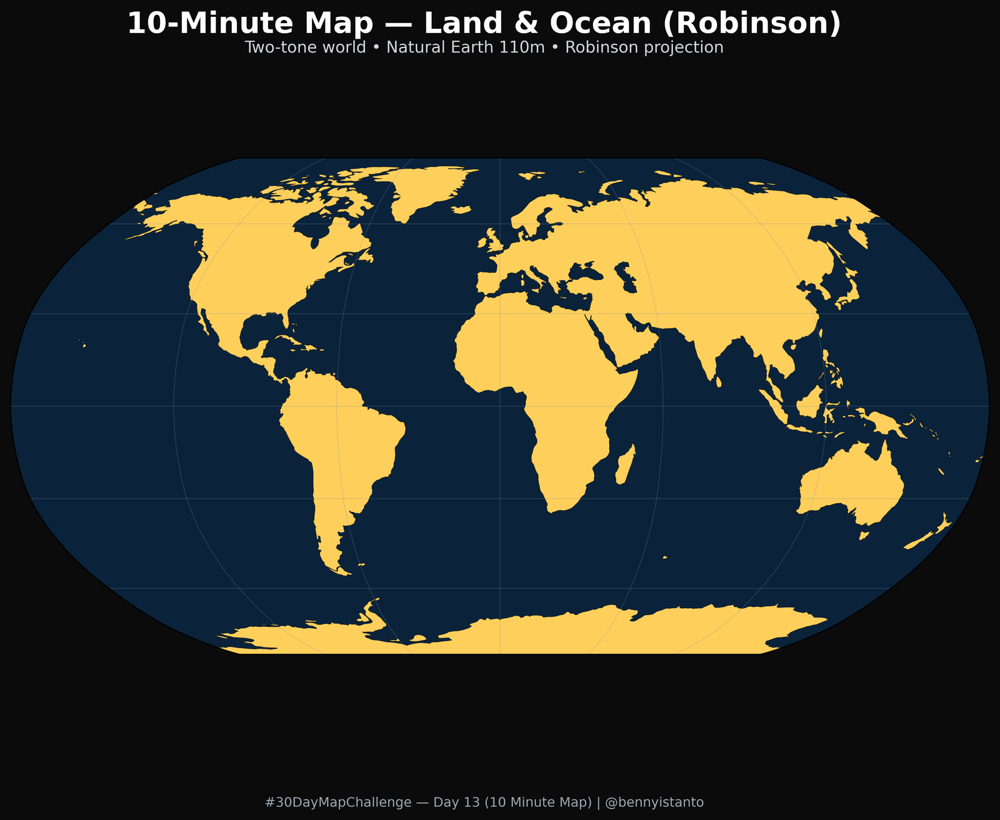

::: {.callout-note collapse="true" title="Python - Day 13, 10 minute map"}
```python
# Lets install additional library
!pip install cartopy

# Day 13 — 10 Minute Map
# Two-tone Earth (land vs. ocean) • Robinson projection • one-minute styling knobs

import matplotlib.pyplot as plt
import cartopy.crs as ccrs
import cartopy.feature as cfeature

CFG = {
    "dpi": 300,
    "figsize": (12, 8),
    "bg":    "#0b0b0b",   # figure background
    "ocean": "#0a233a",   # ocean fill (ax background)
    "land":  "#ffcf5c",   # land fill
    "coast": "#101010",   # thin coastline stroke (optional)
    "gl_color": "#7c93aa",# graticule
    "gl_alpha": 0.35,
    "title":   "10-Minute Map — Land & Ocean (Robinson)",
    "subtitle":"Two-tone world • Natural Earth 110m • Robinson projection",
    "credit":  "#30DayMapChallenge — Day 13 (10 Minute Map) | @bennyistanto",
    "out_png": "day13_ten_minute_map_robinson.png",
    "out_svg": "day13_ten_minute_map_robinson.svg",
}

# --- Figure / axis ---
plt.close("all")
fig = plt.figure(figsize=CFG["figsize"], dpi=CFG["dpi"], facecolor=CFG["bg"])
ax  = plt.axes(projection=ccrs.Robinson())
ax.set_global()
ax.set_facecolor(CFG["ocean"])   # ocean color = axes face

# --- Land (Natural Earth 110m, auto-fetched by Cartopy) ---
land = cfeature.NaturalEarthFeature("physical", "land", "110m",
                                    edgecolor="none", facecolor=CFG["land"])
ax.add_feature(land, zorder=2)

# Optional: a very subtle coastline hairline to crispen edges
ax.coastlines(resolution="110m", linewidth=0.25, color=CFG["coast"], zorder=3)

# --- Graticule (light, no labels to keep it minimal) ---
ax.gridlines(draw_labels=False, linewidth=0.4, color=CFG["gl_color"],
             alpha=CFG["gl_alpha"], linestyle="-")  # <-- no custom locators

# --- Titles / credit ---
fig.text(0.5, 0.965, CFG["title"], ha="center", va="top",
         fontsize=20, color="white", weight="bold")
fig.text(0.5, 0.915, CFG["subtitle"], ha="center",
         fontsize=11, color="#cfd8dc")
fig.text(0.5, 0.02, CFG["credit"], ha="center",
         fontsize=9,  color="#9aa7b2")

# --- Save ---
fig.savefig(CFG["out_png"], dpi=CFG["dpi"], facecolor=CFG["bg"],
            bbox_inches="tight", pad_inches=0)
fig.savefig(CFG["out_svg"], dpi=CFG["dpi"], facecolor=CFG["bg"],
            bbox_inches="tight", pad_inches=0)
plt.show()
```
:::

### Day 14 - Data challenge: OpenStreetMap
A pirate chart of Sunda Kelapa and the surrounding area, built from OpenStreetMap.

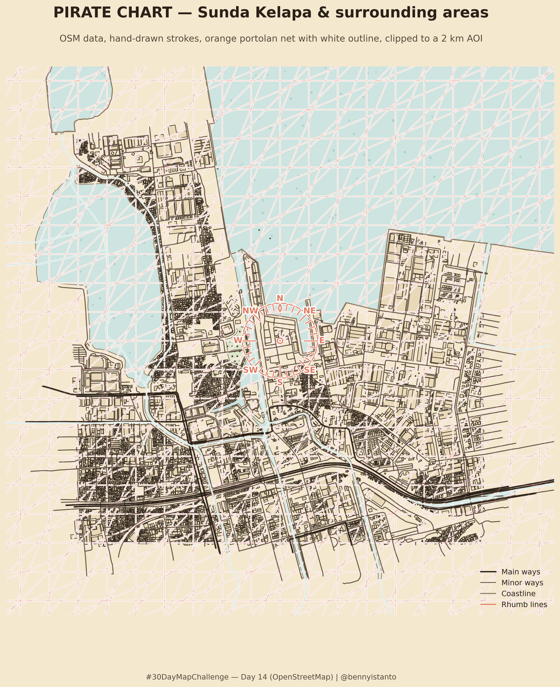

::: {.callout-note collapse="true" title="Python - Day 14, Data challenge: OpenStreetMap"}
```python
# Lets install additional library
!pip install osmnx

# =========================================================
# Day 14 — Data Challenge (OSM)
# Pirate Chart: full-place OSM → AOI clip (2 km around Sunda Kelapa),
# parchment masking, and orange compass/portolan with WHITE outlines for contrast.
# =========================================================
# If needed (Colab): !pip -q install osmnx

import logging, sys
from time import perf_counter
from math import cos, sin, radians
import numpy as np
import matplotlib.pyplot as plt
from matplotlib import patheffects as pe
from matplotlib.patches import Circle
import matplotlib.lines as mlines
import geopandas as gpd
import osmnx as ox
from shapely.geometry import Point, LineString, box
from shapely.geometry import Polygon as SPolygon
from shapely.ops import unary_union, polygonize, split, linemerge
from shapely import affinity
from pyproj import CRS

# -----------------------------
# CONFIG — tweak here
# -----------------------------
ox.settings.use_cache = True
ox.settings.log_console = False
ox.settings.timeout = 180

CFG = {
    # Fetch a broad admin area (has sea + coastline + islands)
    "place_fetch": "North Jakarta, Jakarta, Indonesia",
    # AOI center: Sunda Kelapa (geocoded; with lon/lat fallback)
    "place_center": "Sunda Kelapa, Jakarta, Indonesia",
    "center_fallback_ll": (106.8086, -6.1256),  # (lon, lat)
    "aoi_buffer_m": 2000,                       # 2 km radius for mapping window
    "aoi_shape": "square",   # "circle" or "square"
    "aoi_square_side_m": 2_800,  # used only if aoi_shape="square"; else ignored

    # Output
    "dpi": 300,
    "out_png": "day14_pirate_chart_final.png",
    "out_svg": "day14_pirate_chart_final.svg",

    # Style palette (parchment + inks)
    "bg":         "#f4e8cf",
    "ink":        "#2b2118",
    "ink_soft":   "#5a4a3b",
    "water":      "#cde4e0",
    "coast":      "#8c7a62",
    "building":   "#ead9b8",
    "park":       "#dde5c9",
    "harbor":     "#d9efe9",
    "roads_main": "#2b2118",
    "roads_minor":"#5a4a3b",

    # Compass / rhumbs (BLUE lines with **white outline**)
    "rhumb_blue":   "#E07A5F",
    "compass_blue": "#E07A5F",
    "halo_white":   "#ffffff",

    # Strokes
    "lw_coast":  1.2,
    "lw_water":  0.8,
    "lw_main":   1.6,
    "lw_minor":  0.9,
    "lw_build":  0.6,

    # Hand-drawn effect
    "jitter_m":   2.0,
    "simplify_m": 1.0,

    # Procedural parchment texture
    "noise_octaves": 4,
    "noise_alpha": 0.12,

    # Rhumb lines / compass
    "rhumb_n": 20,
    "compass_size": 260,  # meters radius

    # OSM tags (broad, because we fetch full place then clip)
    "tags": {
        # Polygons that indicate standing/open water
        "water_poly_1": {"natural": ["water", "sea", "bay"]},
        "water_poly_2": {"landuse": ["basin", "reservoir"]},
        "water_poly_3": {"water": ["lagoon","lake","pond","canal","river","reservoir","harbour"]},
        "water_poly_4": {"waterway": ["riverbank","dock"]},  # polygonal in OSM

        # Lines for rivers/canals (optional, nice to draw)
        "water_lines": {"waterway": ["river","canal","drain","stream","ditch"]},

        "coastline": {"natural": "coastline"},
        "beach":     {"natural": "beach"},
        "harbor":    {"harbour": True},
        "park":      {"leisure": "park"},
        "buildings": {"building": True},
        "roads":     {"highway": True},
        "taverns":   {"amenity": ["bar", "pub"]},

        # For land mask fallback (keep as before)
        "landuse_any": {"landuse": True},
        "natural_land": {"natural": ["wood","scrub","grassland","heath","sand","bare_rock","fell",
                                    "island","peninsula","beach","shingle","reef","wetland"]},
    },

    # Title block
    "title": "PIRATE CHART — Sunda Kelapa & surrounding areas",
    "subtitle": "OSM data, hand-drawn strokes, orange portolan net with white outline, clipped to a 2 km AOI",
    "credit": "#30DayMapChallenge — Day 14 (OpenStreetMap) | @bennyistanto"
}

# -----------------------------
# Logging
# -----------------------------
logging.basicConfig(stream=sys.stdout, level=logging.INFO, format="[%(levelname)s] %(message)s")
log = logging.getLogger("DAY14")
t0 = perf_counter()

# -----------------------------
# Helpers
# -----------------------------
def safe_union(geoms):
    geoms = [g for g in geoms if (g is not None and not g.is_empty)]
    return unary_union(geoms) if geoms else None

def build_aoi_polygon(centroid_local, crs_local):
    """Return AOI polygon (circle by buffer or square) in LOCAL CRS."""
    c = centroid_local.iloc[0]  # GeoSeries with 1 point (local CRS)
    cx, cy = c.x, c.y
    if CFG["aoi_shape"].lower() == "square":
        half = CFG["aoi_square_side_m"] / 2.0
        poly = SPolygon([(cx-half, cy-half), (cx+half, cy-half),
                         (cx+half, cy+half), (cx-half, cy+half)])
        return poly
    # default: circle buffer
    return centroid_local.buffer(CFG["aoi_buffer_m"]).unary_union

def clip_to_aoi(gdf, poly_local):
    if gdf is None or gdf.empty:
        return gpd.GeoDataFrame(geometry=[], crs=gdf.crs if gdf is not None else None)
    try:
        return gpd.clip(gdf, poly_local)
    except Exception:
        # fallback (slower but robust)
        return gdf[gdf.geometry.intersects(poly_local)].copy()

def land_mask_from_osm(G, crs_local):
    """Builds a land polygon using landuse/natural + buffered buildings.
    Excludes obvious water-related landuse."""
    land_polys = []

    # landuse (drop water-like categories)
    lu = G.get("landuse_any")
    if lu is not None and not lu.empty:
        keep = lu.copy()
        if "landuse" in keep.columns:
            drop_vals = {"basin","reservoir","salt_pond","aerodrome"}  # drop likely non-landmass
            def ok(v):
                if isinstance(v, (list,set,tuple)): v = next(iter(v), None)
                return (v is None) or (str(v) not in drop_vals)
            keep = keep[keep["landuse"].apply(ok)]
        land_polys += list(keep.geometry)

    # natural land polygons
    nl = G.get("natural_land")
    if nl is not None and not nl.empty:
        land_polys += list(nl.geometry)

    # buffered buildings to “seal” tiny gaps along coast
    b = G.get("buildings")
    if b is not None and not b.empty:
        land_polys += list(b.geometry.buffer(8))  # 8 m buffer

    land_u = safe_union(land_polys)
    return land_u

def utm_epsg_from_lonlat(lon, lat):
    zone = int((lon + 180) // 6) + 1
    return CRS.from_epsg((32600 if lat >= 0 else 32700) + zone)

def fbm_noise(W, H, octaves=4, seed=1410):
    rng = np.random.default_rng(seed)
    base = np.zeros((H, W), dtype=float)
    for o in range(octaves):
        f = 2**o
        hh, ww = max(2, H//f), max(2, W//f)
        coarse = rng.normal(size=(hh, ww))
        up = np.kron(coarse, np.ones((int(np.ceil(H/hh)), int(np.ceil(W/ww)))))
        base += up[:H, :W] / (2**o)
    base -= base.min(); base /= (base.max() + 1e-9)
    return base

def jitter_linestring(ls: LineString, std: float) -> LineString:
    if ls is None or len(ls.coords) < 2: return ls
    coords = np.array(ls.coords, dtype=float)
    noise = np.random.normal(scale=std, size=coords.shape)
    noise[0] *= 0.3; noise[-1] *= 0.3
    return LineString(coords + noise)

def jitter_geometry(geom, std: float):
    if geom is None: return None
    gtype = geom.geom_type
    if gtype == "LineString":
        return jitter_linestring(geom, std)
    if gtype == "MultiLineString":
        return geom.__class__([jitter_linestring(g, std) for g in geom.geoms])
    if gtype in ("Polygon","MultiPolygon"):
        try:
            return affinity.scale(geom, xfact=1.0+np.random.uniform(-0.002,0.002),
                                        yfact=1.0+np.random.uniform(-0.002,0.002),
                                        origin='centroid')
        except Exception:
            return geom
    return geom

def hatch_polygon(ax, geom, face, edge, lw, hatch):
    if geom is None: return
    if geom.geom_type == "Polygon":
        x,y = geom.exterior.xy
        ax.fill(x,y, facecolor=face, edgecolor=edge, linewidth=lw, hatch=hatch)
    elif geom.geom_type == "MultiPolygon":
        for g in geom.geoms:
            hatch_polygon(ax, g, face, edge, lw, hatch)

def stipple_polygon(ax, geom, color, density=0.00008, alpha=0.6, s=(5,15)):
    if geom is None: return
    minx, miny, maxx, maxy = geom.bounds
    area = max(geom.area, 1.0)
    n = max(50, int(area * density))
    xs = np.random.uniform(minx, maxx, n)
    ys = np.random.uniform(miny, maxy, n)
    mask = [geom.contains(Point(x,y)) for x,y in zip(xs,ys)]
    xs = xs[mask]; ys = ys[mask]
    if len(xs):
        ax.scatter(xs, ys, s=np.random.randint(s[0],s[1],size=len(xs)),
                   c=color, alpha=alpha, lw=0)

def collect_water_polygons(G):
    layers = []
    for k in ("water_poly_1","water_poly_2","water_poly_3","water_poly_4"):
        df = G.get(k, None)
        if df is not None and not df.empty:
            # keep only polygonal geometries and fix slivers
            poly = df[df.geometry.geom_type.isin(["Polygon","MultiPolygon"])].copy()
            if not poly.empty:
                poly.loc[:, "geometry"] = poly.geometry.buffer(0)
                layers.append(poly)
    if not layers:
        return None
    all_geom = []
    for layer in layers:
        all_geom += list(layer.geometry.dropna())
    u = safe_union(all_geom)
    return u

def draw_portolan_net(ax, bbox, bearings=None, spacing=180, color="#E07A5F",
                      halo="#ffffff", alpha=0.18, lw=0.8, z=2):
    """
    Classic portolan 'wind' net: families of parallel rhumb lines covering the map.
    - bearings: list of degrees (0..180) unique directions; mirrored automatically.
    - spacing: distance (in map units) between parallels (tune 120–300m for look).
    """
    if bearings is None:
        bearings = [0, 22.5, 45, 67.5, 90]  # 16 winds mirrored → N, NNE, NE, ENE, E

    minx, miny, maxx, maxy = bbox
    W, H = (maxx - minx), (maxy - miny)
    cx, cy = (minx + W/2, miny + H/2)
    R = (W**2 + H**2) ** 0.5  # long enough to cross canvas

    for b in bearings:
        for sign in (+1, -1):  # mirror (bearing & bearing+180)
            ang = radians(b if sign > 0 else (b + 180.0))
            # line normal to shift parallels
            nx, ny = -sin(ang), cos(ang)

            # how many bands to cover bbox
            half = int((abs(nx)*W + abs(ny)*H) // spacing) + 3
            for k in range(-half, half+1):
                # anchor point shifted along normal
                px, py = cx + k*spacing*nx, cy + k*spacing*ny
                # segment endpoints far beyond bbox limits
                x0, y0 = px - R*cos(ang), py - R*sin(ang)
                x1, y1 = px + R*cos(ang), py + R*sin(ang)
                # white halo underlay
                ax.plot([x0,x1],[y0,y1], lw=lw*2.2, color=halo, alpha=0.85, zorder=z)
                # colored stroke
                ax.plot([x0,x1],[y0,y1], lw=lw, color=color, alpha=alpha, zorder=z+1)

def draw_compass_rose(ax, center, r, color="#E07A5F", halo="#ffffff", z=8):
    """
    32-wind compass rose with alternating long/short points, ring, hub,
    and a small fleur-de-lis at North. All strokes have a white halo.
    """
    cx, cy = center
    # outer ring
    ax.add_patch(Circle((cx,cy), r, fc="none", ec=halo, lw=3.0, alpha=0.95, zorder=z))
    ax.add_patch(Circle((cx,cy), r, fc="none", ec=color, lw=1.2, alpha=0.95, zorder=z+1))

    # points
    for i in range(32):
        a = radians(i*11.25)
        # long for 8 principal + 8 half-winds; shorter for quarter-winds
        is_principal = (i % 8 == 0)
        is_half      = (i % 4 == 0)
        L = 0.35*r if is_principal else (0.26*r if is_half else 0.18*r)
        x1, y1 = cx + (r-1.5)*cos(a), cy + (r-1.5)*sin(a)
        x2, y2 = cx + (r-L)*cos(a),   cy + (r-L)*sin(a)
        ax.plot([x1,x2],[y1,y2], color=halo, lw=2.6, alpha=0.95, zorder=z+2)
        ax.plot([x1,x2],[y1,y2], color=color, lw=1.2, alpha=0.95, zorder=z+3)

    # intermediate ring ticks
    for i in range(16):
        a = radians(i*22.5)
        x1, y1 = cx + (r*0.86)*cos(a), cy + (r*0.86)*sin(a)
        x2, y2 = cx + (r*0.92)*cos(a), cy + (r*0.92)*sin(a)
        ax.plot([x1,x2],[y1,y2], color=halo, lw=2.2, alpha=0.95, zorder=z+2)
        ax.plot([x1,x2],[y1,y2], color=color, lw=1.0, alpha=0.95, zorder=z+3)

    # hub
    ax.add_patch(Circle((cx,cy), r*0.07, fc=halo, ec=color, lw=1.2, zorder=z+4))
    ax.add_patch(Circle((cx,cy), r*0.035, fc=color, ec=halo, lw=1.2, zorder=z+5))

    # fleur-de-lis at North
    tip  = (cx, cy + r*0.98)
    base = (cx, cy + r*0.78)
    left = (cx - r*0.045, cy + r*0.86)
    rght = (cx + r*0.045, cy + r*0.86)
    xs = [base[0], left[0], tip[0], rght[0], base[0]]
    ys = [base[1], left[1], tip[1], rght[1], base[1]]
    ax.plot(xs, ys, color=halo, lw=3.0, alpha=0.95, zorder=z+6)
    ax.plot(xs, ys, color=color, lw=1.4, alpha=0.95, zorder=z+7)

    # labels
    labels = [("N",0,1.12), ("E",1.12,0), ("S",0,-1.12), ("W",-1.12,0),
              ("NE",0.79,0.79), ("SE",0.79,-0.79), ("SW",-0.79,-0.79), ("NW",-0.79,0.79)]
    for txt, dx, dy in labels:
        ax.text(cx + dx*r, cy + dy*r, txt, ha="center", va="center",
                color=color, fontsize=10, weight="bold", zorder=z+8,
                path_effects=[pe.withStroke(linewidth=2.8, foreground=halo)])

# OSMnx wrappers (handle 1.x vs 2.x)
def features_from_place(place, tags):
    if hasattr(ox, "features_from_place"):
        return ox.features_from_place(place, tags=tags)
    else:
        return ox.geometries_from_place(place, tags=tags)

def features_from_polygon(poly_ll, tags):
    if hasattr(ox, "features_from_polygon"):
        return ox.features_from_polygon(poly_ll, tags=tags)
    else:
        return ox.geometries_from_polygon(poly_ll, tags=tags)

# -----------------------------
# AOI (center on Sunda Kelapa)
# -----------------------------
log.info(f"Geocoding AOI: {CFG['place_center']}")
aoi_raw = ox.geocode_to_gdf(CFG["place_center"]).to_crs(4326)

def _union_all_safe(geo_series):
    try:
        return geo_series.union_all()         # shapely ≥2
    except Exception:
        from shapely.ops import unary_union   # shapely <2 fallback
        return unary_union(list(geo_series))

geom_u = _union_all_safe(aoi_raw.geometry)

centroid_ll = (geom_u.centroid if geom_u.geom_type in ("Polygon","MultiPolygon") else geom_u)

crs_local = utm_epsg_from_lonlat(centroid_ll.x, centroid_ll.y)
centroid_local = gpd.GeoSeries([centroid_ll], crs=4326).to_crs(crs_local)
center_pt_xy = centroid_local.iloc[0]  # shapely Point in local CRS

# circle OR square AOI in local CRS
aoi_poly_local = build_aoi_polygon(centroid_local, crs_local)
aoi_poly_ll    = gpd.GeoSeries([aoi_poly_local], crs=crs_local).to_crs(4326).iloc[0]

minx, miny, maxx, maxy = aoi_poly_local.bounds

def sea_from_coast(aoi_poly_local, coast_gdf, north_of_y=None):
    """
    Return a sea MULTIPOLYGON inside AOI by cutting AOI with coastline lines.
    - Use lines only to split AOI.
    - Return the UNION of all pieces whose centroid is north of 'north_of_y'
      (defaults to AOI centroid y). This captures both left+right sea pockets.
    - Fallback polygonize if split fails.
    """
    if coast_gdf is None or coast_gdf.empty:
        return None

    parts = []
    for g in coast_gdf.geometry.dropna():
        if g.is_empty:
            continue
        gt = g.geom_type
        if gt in ("LineString","MultiLineString"):
            parts.append(g)
        elif gt in ("Polygon","MultiPolygon"):
            parts.append(g.boundary)
    if not parts:
        return None

    merged_lines = linemerge(unary_union(parts))
    if merged_lines is None or merged_lines.is_empty:
        return None

    if north_of_y is None:
        north_of_y = aoi_poly_local.centroid.y

    # try split
    try:
        pieces = split(aoi_poly_local, merged_lines)
        if hasattr(pieces, "geoms") and len(pieces.geoms) > 0:
            north_pieces = [p for p in pieces.geoms if p.centroid.y >= north_of_y - 1e-6]
            if north_pieces:
                return safe_union(north_pieces)
    except Exception:
        pass

    # fallback: polygonize
    try:
        rings_union = unary_union([merged_lines, aoi_poly_local.exterior])
        polys = list(polygonize(rings_union))
        polys = [p.intersection(aoi_poly_local) for p in polys if not p.is_empty]
        north_pieces = [p for p in polys if p.centroid.y >= north_of_y - 1e-6]
        if north_pieces:
            return safe_union(north_pieces)
    except Exception:
        pass

    return None


# -----------------------------
# Fetch OSM strictly INSIDE the AOI square
# -----------------------------
log.info("Fetching OSM features inside AOI…")

def get_layer_from_aoi(tags):
    try:
        g = features_from_polygon(aoi_poly_ll, tags)
        if g is None or g.empty:
            return gpd.GeoDataFrame(geometry=[], crs=crs_local)
        return g.to_crs(crs_local)
    except Exception as e:
        msg = str(e)
        # OSMnx / Overpass “no features” cases → return empty silently
        if "No matching features" in msg or "Empty Overpass" in msg or "no element found" in msg:
            return gpd.GeoDataFrame(geometry=[], crs=crs_local)
        log.warning(f"Layer fetch failed: {e}")
        return gpd.GeoDataFrame(geometry=[], crs=crs_local)

G = {k: get_layer_from_aoi(tag) for k, tag in CFG["tags"].items()}
log.info("AOI counts → " + ", ".join(f"{k}:{len(v)}" for k,v in G.items()))

# ------ SEA + other water polygons ------
log.info("Building SEA and water polygons…")

# coastline from a wider place for continuity
try:
    coast_wide = features_from_place(CFG["place_fetch"], {"natural": "coastline"}).to_crs(crs_local)
except Exception as e:
    log.warning(f"Wide coastline fetch failed: {e}")
    coast_wide = gpd.GeoDataFrame(geometry=[], crs=crs_local)

# keep only a padded AOI intersection (robust)
if not coast_wide.empty:
    aoi_pad = aoi_poly_local.buffer(400)
    coast_wide = coast_wide.copy()
    coast_wide.loc[:, "geometry"] = coast_wide.geometry.apply(lambda g: g.intersection(aoi_pad))

# 1) sea from coastline (ALL northern pieces)
sea_geom = sea_from_coast(aoi_poly_local, coast_wide)

# 2) collect all water polygons (lakes, basins, harbor polygons, riverbank/dock)
water_polys_u = collect_water_polygons(G)

# 3) final water fill = union(sea, water polys)
water_fill = safe_union([g for g in [sea_geom, water_polys_u] if g is not None and not g.is_empty])

# 4) waterway lines (optional)
water_lines = G.get("water_lines", gpd.GeoDataFrame(geometry=[], crs=crs_local)).copy()


# Clean NaNs
for k, df in G.items():
    if df is not None and not df.empty:
        G[k] = df[~df.geometry.is_empty & df.geometry.notnull()].copy()

# Split roads
roads = G.get("roads", gpd.GeoDataFrame(geometry=[], crs=crs_local)).copy()
def as_str(v):
    if isinstance(v, (list, set, tuple)):
        return next(iter(v), None)
    return v

if not roads.empty and "highway" in roads.columns:
    roads = roads.copy()
    roads.loc[:, "kind"] = roads["highway"].apply(as_str)
    main_types = {"motorway","trunk","primary","secondary"}
    roads_main  = roads[roads["kind"].isin(main_types)].copy()
    roads_minor = roads[~roads.index.isin(roads_main.index)].copy()

else:
    roads_main = roads.iloc[0:0].copy()
    roads_minor = roads.iloc[0:0].copy()

# Simplify + jitter on roads
for df in (roads_main, roads_minor):
    if not df.empty:
        df = df.copy()
        df.loc[:, "geometry"] = df.geometry.simplify(CFG["simplify_m"], preserve_topology=True)
        df.loc[:, "geometry"] = df.geometry.apply(lambda g: jitter_geometry(g, CFG["jitter_m"]))

buildings = G.get("buildings", gpd.GeoDataFrame(geometry=[], crs=crs_local)).copy()
if not buildings.empty:
    buildings = buildings.copy()
    buildings.loc[:, "geometry"] = buildings.geometry.buffer(0)

water = G.get("water", gpd.GeoDataFrame(geometry=[], crs=crs_local)).copy()
coast = G.get("coastline", gpd.GeoDataFrame(geometry=[], crs=crs_local)).copy()
park  = G.get("park",  gpd.GeoDataFrame(geometry=[], crs=crs_local)).copy()
beach = G.get("beach", gpd.GeoDataFrame(geometry=[], crs=crs_local)).copy()
harbor= G.get("harbor",gpd.GeoDataFrame(geometry=[], crs=crs_local)).copy()
tav   = G.get("taverns",gpd.GeoDataFrame(geometry=[], crs=crs_local)).copy()

# -----------------------------
# Figure
# -----------------------------
plt.close("all")
fig = plt.figure(figsize=(12, 12), dpi=CFG["dpi"], facecolor=CFG["bg"])
ax  = fig.add_subplot(111)
ax.set_aspect("equal"); ax.set_facecolor(CFG["bg"])

# View bounds = AOI bounds + pad (for mask drawing room)
minx, miny, maxx, maxy = aoi_poly_local.bounds
pad = CFG["aoi_buffer_m"] * 0.25
ax.set_xlim(minx-pad, maxx+pad); ax.set_ylim(miny-pad, maxy+pad)
ax.set_xticks([]); ax.set_yticks([]); [s.set_visible(False) for s in ax.spines.values()]

# Parchment texture
log.info("Drawing parchment texture…")
noise = fbm_noise(900, 900, octaves=CFG["noise_octaves"], seed=1410)
ax.imshow(noise, extent=[minx-pad, maxx+pad, miny-pad, maxy+pad],
          cmap="Greys", alpha=CFG["noise_alpha"], zorder=0)

# --- MASK everything OUTSIDE the AOI (clean circular window look)
outer = box(minx-pad, miny-pad, maxx+pad, maxy+pad)
mask_geom = outer.difference(aoi_poly_local)
# fill mask with parchment so only AOI remains visible
hatch_polygon(ax, mask_geom, face=CFG["bg"], edge=CFG["bg"], lw=0, hatch='')

# --- PORTOLAN RHUMB NET (before features; subtle underlay)
log.info("Drawing portolan rhumb net…")
draw_portolan_net(
    ax,
    bbox=(minx-pad, miny-pad, maxx+pad, maxy+pad),
    bearings=[0, 22.5, 45, 67.5, 90],   # classic 16 winds mirrored
    spacing=200,                        # try 160–240 for different densities
    color=CFG["rhumb_blue"],
    halo=CFG["halo_white"],
    alpha=0.16,                         # soft!
    lw=0.9,
    z=2
)

# --- COMPASS ROSE (on top of features later)
comp_center = (center_pt_xy.x, center_pt_xy.y)
comp_radius = CFG["compass_size"]   # your existing size works well

# Rhumb lines + compass (centered at Sunda Kelapa)
log.info("Rhumb lines + compass…")
center = (center_pt_xy.x, center_pt_xy.y)
radius = max(maxx-minx, maxy-miny) * 0.55

# --- WATER first (under everything) ---
if water_fill and not water_fill.is_empty:
    hatch_polygon(ax, water_fill, face=CFG["water"], edge=CFG["coast"], lw=CFG["lw_water"], hatch='')
    stipple_polygon(ax, water_fill, color="#7da9a3", density=0.00005, alpha=0.30, s=(5,12))

# waterway lines (rivers/canals) on top of fill
if not water_lines.empty:
    for g in water_lines.geometry.dropna():
        if g.geom_type == "LineString":
            xs, ys = g.xy
            ax.plot(xs, ys, color=CFG["water"], lw=1.0,
                    path_effects=[pe.withStroke(linewidth=2.0, foreground=CFG["halo_white"])],
                    zorder=6)
        elif g.geom_type == "MultiLineString":
            for gg in g.geoms:
                xs, ys = gg.xy
                ax.plot(xs, ys, color=CFG["water"], lw=1.0,
                        path_effects=[pe.withStroke(linewidth=2.0, foreground=CFG["halo_white"])],
                        zorder=6)

# --- SEA first (under everything) ---
if sea_geom and not sea_geom.is_empty:
    log.info("Rendering SEA fill…")
    hatch_polygon(ax, sea_geom, face=CFG["water"], edge=CFG["coast"], lw=CFG["lw_water"], hatch='')
    # optional stipple to give water texture
    stipple_polygon(ax, sea_geom, color="#7da9a3", density=0.00005, alpha=0.30, s=(5,12))


# Beaches
if not beach.empty:
    log.info("Rendering beaches…")
    for geom in beach.geometry.dropna():
        hatch_polygon(ax, geom, face="#f9edcc", edge=CFG["coast"], lw=0.5, hatch='////')

# Harbor
if not harbor.empty:
    log.info("Rendering harbor…")
    for geom in harbor.geometry.dropna():
        hatch_polygon(ax, geom, face=CFG["harbor"], edge=CFG["coast"], lw=0.6, hatch='')

# Parks
if not park.empty:
    log.info("Rendering parks…")
    for geom in park.geometry.dropna():
        hatch_polygon(ax, geom, face=CFG["park"], edge=CFG["ink_soft"], lw=0.5, hatch='..')

# Buildings
if not buildings.empty:
    log.info("Rendering buildings…")
    for geom in buildings.geometry.dropna():
        if geom.geom_type in ("Polygon","MultiPolygon"):
            hatch_polygon(ax, geom, face=CFG["building"], edge=CFG["ink"], lw=CFG["lw_build"], hatch='')

# Coastlines
if not coast.empty:
    log.info("Rendering coastline…")
    coast["geometry"] = coast.geometry.apply(lambda g: jitter_geometry(g, CFG["jitter_m"]))
    for geom in coast.geometry.dropna():
        if geom.geom_type == "LineString":
            xs, ys = geom.xy
            ax.plot(xs, ys, color=CFG["coast"], lw=CFG["lw_coast"])
        elif geom.geom_type == "MultiLineString":
            for g in geom.geoms:
                xs, ys = g.xy
                ax.plot(xs, ys, color=CFG["coast"], lw=CFG["lw_coast"])

# Roads
def draw_roads(df, color, lw):
    if df.empty: return
    for geom in df.geometry.dropna():
        if geom.geom_type == "LineString":
            xs, ys = geom.xy
            ax.plot(xs, ys, color=color, lw=lw, solid_capstyle="round",
                    path_effects=[pe.withStroke(linewidth=lw*1.8, foreground="#00000020")])
        elif geom.geom_type == "MultiLineString":
            for g in geom.geoms:
                xs, ys = g.xy
                ax.plot(xs, ys, color=color, lw=lw, solid_capstyle="round",
                        path_effects=[pe.withStroke(linewidth=lw*1.8, foreground="#00000020")])

log.info("Rendering roads…")
draw_roads(roads_minor, CFG["roads_minor"], CFG["lw_minor"])
draw_roads(roads_main,  CFG["roads_main"],  CFG["lw_main"])

# Taverns (optional)
if not tav.empty:
    log.info("Marking taverns…")
    for p in tav.geometry.dropna():
        if isinstance(p, Point):
            # small blue skull could be added; we keep clean for now.
            ax.scatter([p.x],[p.y], s=16, c=CFG["compass_blue"], edgecolors=CFG["halo_white"], lw=0.6, zorder=9)

# Ornate compass rose above features
log.info("Drawing compass rose…")
draw_compass_rose(
    ax,
    comp_center,
    comp_radius,
    color=CFG["compass_blue"],
    halo=CFG["halo_white"],
    z=8
)

# Title / legend
fig.text(0.5, 0.965, CFG["title"], ha="center", va="top", color=CFG["ink"], fontsize=18, weight="bold")
fig.text(0.5, 0.915, CFG["subtitle"], ha="center", color=CFG["ink_soft"], fontsize=11)
fig.text(0.5, 0.020, CFG["credit"], ha="center", color=CFG["ink_soft"], fontsize=9)

leg_lines = [
    mlines.Line2D([], [], color=CFG["roads_main"],  lw=CFG["lw_main"],  label="Main ways"),
    mlines.Line2D([], [], color=CFG["roads_minor"], lw=CFG["lw_minor"], label="Minor ways"),
    mlines.Line2D([], [], color=CFG["coast"],       lw=CFG["lw_coast"], label="Coastline"),
    mlines.Line2D([], [], color=CFG["rhumb_blue"],  lw=1.2,              label="Rhumb lines"),
]
leg = ax.legend(handles=leg_lines, frameon=False, fontsize=9, loc="lower right")
for txt in leg.get_texts(): txt.set_color(CFG["ink"])

# Save
fig.savefig(CFG["out_png"], dpi=CFG["dpi"], facecolor=CFG["bg"], bbox_inches="tight", pad_inches=0)
fig.savefig(CFG["out_svg"], dpi=CFG["dpi"], facecolor=CFG["bg"], bbox_inches="tight", pad_inches=0)
log.info(f"Saved {CFG['out_png']} and {CFG['out_svg']} in {perf_counter()-t0:.2f}s.")
plt.show()
```
:::

### Day 15 - Fire
Firebreak atlas. Jakarta carved into burn compartments by its firebreaks.

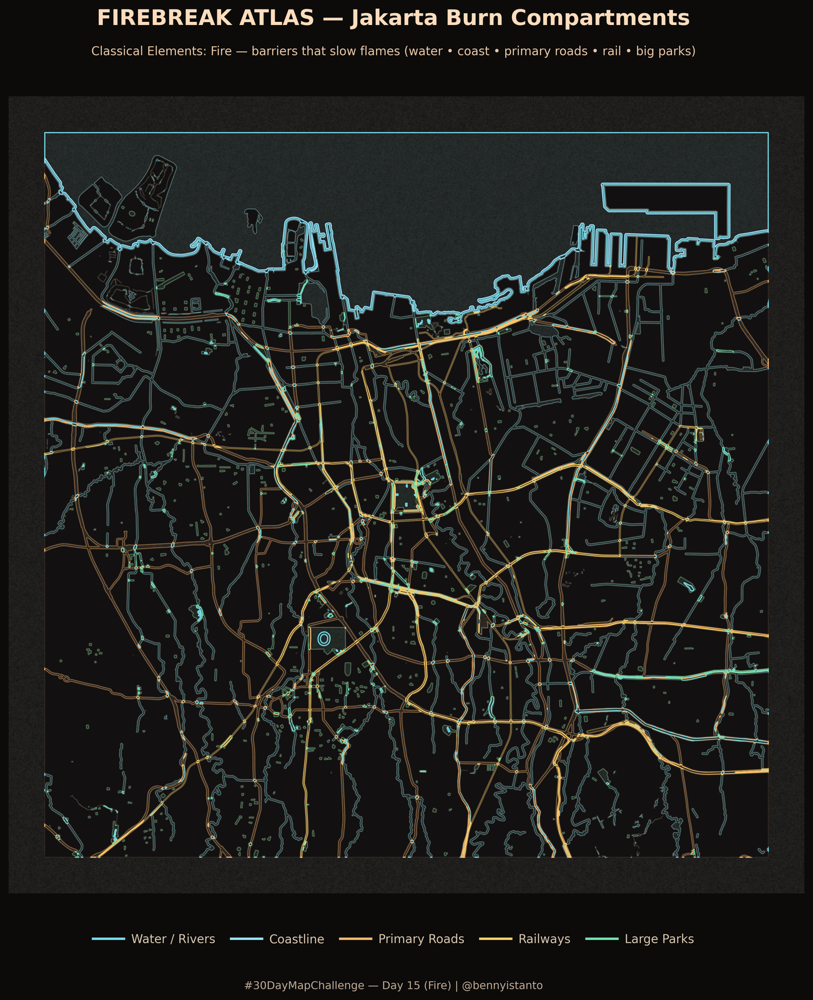

::: {.callout-note collapse="true" title="Python - Day 15, Fire"}
```python
# Lets install additional library
!pip install osmnx

# Day 15 — Fire
# FIREBREAK ATLAS — Burn Compartments with Color-Coded Barriers
# If needed (Colab):  !pip -q install osmnx geopandas shapely pyproj

import numpy as np
import matplotlib.pyplot as plt
from matplotlib import patheffects as pe
import geopandas as gpd
import osmnx as ox
from shapely.geometry import Point, Polygon as SPolygon, box
from shapely.ops import unary_union
from pyproj import CRS

# ---------- CONFIG ----------
ox.settings.use_cache = True
ox.settings.log_console = False
ox.settings.timeout = 180

CFG = dict(
    place_fetch="DKI Jakarta, Indonesia",
    center="Monas, Jakarta, Indonesia",
    aoi_side_m=24000,    # square AOI side (meters)
    dpi=300,
    out_png="day15_firebreak_atlas.png",

    # Background / compartments
    bg="#0c0b0a",
    fill="#121010",      # compartment fill (land that can burn)
    smoke_alpha=0.14,

    # Buffer widths (meters)
    buf_water=40,        # rivers/canals width to act as breaks
    buf_coast=50,        # coastline band
    buf_primary=36,      # primary roads band
    buf_rail=28,         # rail band
    buf_park=25,         # big parks band

    # Firebreak family colors
    c_water="#78dce8",   # water / rivers
    c_coast="#9be3ff",   # coastline
    c_primary="#ffb86b", # primary roads
    c_rail="#ffd166",    # railways
    c_park="#72e2ae",    # large parks

    # Drawing
    fill_alpha=0.06,
    edge_w=1.0,
    cell_edge_color="#3a2e26",
    cell_edge_w=0.6,

    # Title
    title="FIREBREAK ATLAS — Jakarta Burn Compartments",
    subtitle="Classical Elements: Fire — barriers that slow flames (water • coast • primary roads • rail • big parks)",
    credit="#30DayMapChallenge — Day 15 (Fire) | @bennyistanto",
)

# ---------- HELPERS ----------
def utm_from_lonlat(lon, lat):
    zone = int((lon + 180) // 6) + 1
    return CRS.from_epsg((32700 if lat < 0 else 32600) + zone)

def fbm_noise(W, H, octaves=5, seed=1410):
    rng = np.random.default_rng(seed)
    base = np.zeros((H, W), dtype=float)
    for o in range(octaves):
        f = 2 ** o
        hh, ww = max(2, H // f), max(2, W // f)
        coarse = rng.normal(size=(hh, ww))
        up = np.kron(coarse, np.ones((int(np.ceil(H / hh)), int(np.ceil(W / ww)))))
        base += up[:H, :W] / (2 ** o)
    base -= base.min()
    base /= (base.max() + 1e-9)
    return base

def features_from_polygon(poly, tags):
    fn = ox.features_from_polygon if hasattr(ox, "features_from_polygon") else ox.geometries_from_polygon
    try:
        return fn(poly, tags=tags)
    except Exception:
        return gpd.GeoDataFrame(geometry=[])

# ---------- AOI ----------
center_geom = ox.geocode_to_gdf(CFG["center"]).to_crs(4326).geometry.iloc[0]
if center_geom.geom_type in ("Polygon", "MultiPolygon"):
    center_ll = center_geom.centroid
elif center_geom.geom_type == "Point":
    center_ll = center_geom
else:
    center_ll = center_geom.representative_point()

crs_local = utm_from_lonlat(center_ll.x, center_ll.y)
center_xy = gpd.GeoSeries([center_ll], crs=4326).to_crs(crs_local).iloc[0]

half = CFG["aoi_side_m"] / 2.0
aoi_xy = SPolygon([
    (center_xy.x - half, center_xy.y - half),
    (center_xy.x + half, center_xy.y - half),
    (center_xy.x + half, center_xy.y + half),
    (center_xy.x - half, center_xy.y + half)
])
aoi_ll = gpd.GeoSeries([aoi_xy], crs=crs_local).to_crs(4326).iloc[0]

# ---------- FETCH ----------
# Water polygons + riverbanks + basins/reservoirs
water_poly = features_from_polygon(aoi_ll, {
    "natural": ["water", "sea", "bay"],
    "water": True,
    "landuse": ["basin", "reservoir"],
    "waterway": ["riverbank", "dock"]
})
# Waterway centerlines for rivers/canals
water_lines = features_from_polygon(aoi_ll, {"waterway": ["river", "canal", "drain", "stream", "ditch"]})

# Coastline lines
coast = features_from_polygon(aoi_ll, {"natural": "coastline"})

# Primary roads
roads = features_from_polygon(aoi_ll, {"highway": True})
if not roads.empty and "highway" in roads.columns:
    roads = roads[roads["highway"].astype(str).isin(["motorway", "trunk", "primary"])]

# Railways
rail = features_from_polygon(aoi_ll, {"railway": True})

# Parks
parks = features_from_polygon(aoi_ll, {"leisure": "park"})

# Reproject
def to_local(df):
    return df.to_crs(crs_local) if (df is not None and not df.empty) else gpd.GeoDataFrame(geometry=[], crs=crs_local)

W_POLY  = to_local(water_poly)
W_LINE  = to_local(water_lines)
COAST   = to_local(coast)
ROADS   = to_local(roads)
RAIL    = to_local(rail)
PARKS   = to_local(parks)
AOI     = gpd.GeoDataFrame(geometry=[aoi_xy], crs=crs_local)

# ---------- BUILD BUFFERS PER FAMILY ----------
bufs = {}

# Water = polygons (as-is) + buffered centerlines
if not W_POLY.empty:
    wp = W_POLY.copy()
    wp["geometry"] = wp.geometry.buffer(0)  # fix slivers
    bufs["water"] = unary_union(list(wp.geometry)).intersection(aoi_xy)

if not W_LINE.empty:
    wl = W_LINE.copy()
    wl = wl[wl.geometry.type.isin(["LineString", "MultiLineString"])]
    if not wl.empty:
        wl["geometry"] = wl.geometry.buffer(CFG["buf_water"])
        wlc = unary_union(list(wl.geometry)).intersection(aoi_xy)
        bufs["water"] = (wlc if "water" not in bufs else unary_union([bufs["water"], wlc])).intersection(aoi_xy)

# Coastline (lines → buffer)
if not COAST.empty:
    cl = COAST.copy()
    cl = cl[cl.geometry.type.isin(["LineString", "MultiLineString"])]
    if not cl.empty:
        cl["geometry"] = cl.geometry.buffer(CFG["buf_coast"])
        bufs["coast"] = unary_union(list(cl.geometry)).intersection(aoi_xy)

# Primary roads
if not ROADS.empty:
    rd = ROADS.copy()
    rd = rd[rd.geometry.type.isin(["LineString", "MultiLineString"])]
    if not rd.empty:
        rd["geometry"] = rd.geometry.buffer(CFG["buf_primary"])
        bufs["primary"] = unary_union(list(rd.geometry)).intersection(aoi_xy)

# Railways
if not RAIL.empty:
    rl = RAIL.copy()
    rl = rl[rl.geometry.type.isin(["LineString", "MultiLineString"])]
    if not rl.empty:
        rl["geometry"] = rl.geometry.buffer(CFG["buf_rail"])
        bufs["rail"] = unary_union(list(rl.geometry)).intersection(aoi_xy)

# Parks (polygons)
if not PARKS.empty:
    pk = PARKS.copy()
    pk = pk[pk.geometry.type.isin(["Polygon", "MultiPolygon"])]
    if not pk.empty:
        pk["geometry"] = pk.geometry.buffer(CFG["buf_park"]).buffer(0)
        bufs["park"] = unary_union(list(pk.geometry)).intersection(aoi_xy)

# Union for compartments
parts_for_union = [g for g in bufs.values() if g and not g.is_empty]
breaks_union = unary_union(parts_for_union).intersection(aoi_xy) if parts_for_union else None
comps = aoi_xy.difference(breaks_union) if breaks_union else aoi_xy

# ---------- PLOT ----------
plt.close("all")
fig = plt.figure(figsize=(12, 12), dpi=CFG["dpi"], facecolor=CFG["bg"])
ax = fig.add_subplot(111)
ax.set_aspect("equal"); ax.set_facecolor(CFG["bg"])

minx, miny, maxx, maxy = aoi_xy.bounds
pad = CFG["aoi_side_m"] * 0.05
ax.set_xlim(minx - pad, maxx + pad); ax.set_ylim(miny - pad, maxy + pad)
ax.set_xticks([]); ax.set_yticks([]); [s.set_visible(False) for s in ax.spines.values()]

# Smoke sheet
noise = fbm_noise(1200, 1200, octaves=5, seed=1609)
ax.imshow(noise, extent=[minx - pad, maxx + pad, miny - pad, maxy + pad],
          cmap="Greys", alpha=CFG["smoke_alpha"], zorder=0)

# Helper to plot one family
def _plot_family(geom, color):
    if geom and not geom.is_empty:
        g = gpd.GeoDataFrame(geometry=[geom], crs=crs_local)
        g.plot(ax=ax, color=color, alpha=CFG["fill_alpha"], zorder=1)
        g.boundary.plot(ax=ax, color=color, linewidth=CFG["edge_w"], alpha=0.95, zorder=2)

# Families (clear message)
_plot_family(bufs.get("water"),   CFG["c_water"])
_plot_family(bufs.get("coast"),   CFG["c_coast"])
_plot_family(bufs.get("primary"), CFG["c_primary"])
_plot_family(bufs.get("rail"),    CFG["c_rail"])
_plot_family(bufs.get("park"),    CFG["c_park"])

# Compartments (derived land that can burn)
C = gpd.GeoDataFrame(geometry=[comps], crs=crs_local)
C.plot(ax=ax, color=CFG["fill"], alpha=0.95, zorder=3)
C.boundary.plot(ax=ax, color=CFG["cell_edge_color"], linewidth=CFG["cell_edge_w"], alpha=0.85, zorder=4)

# Title & legend
fig.text(0.5, 0.965, CFG["title"], ha="center", va="top", color="#ffdcbc", fontsize=18, weight="bold")
fig.text(0.5, 0.92,  CFG["subtitle"], ha="center", color="#e8c6a4", fontsize=10)
fig.text(0.5, 0.018, CFG["credit"],   ha="center", color="#bfa995", fontsize=9)

import matplotlib.lines as mlines

handles = [
    mlines.Line2D([], [], color=CFG["c_water"],   lw=2, label="Water / Rivers"),
    mlines.Line2D([], [], color=CFG["c_coast"],   lw=2, label="Coastline"),
    mlines.Line2D([], [], color=CFG["c_primary"], lw=2, label="Primary Roads"),
    mlines.Line2D([], [], color=CFG["c_rail"],    lw=2, label="Railways"),
    mlines.Line2D([], [], color=CFG["c_park"],    lw=2, label="Large Parks"),
]

# Figure-level legend outside the map frame
leg = fig.legend(
    handles=handles,
    loc="lower center",
    bbox_to_anchor=(0.5, 0.055),  # << height just above the credit line
    ncol=5,
    frameon=False,
    handlelength=2.6,
    handletextpad=0.6,
    columnspacing=1.3,
    borderaxespad=0.0,
)
for t in leg.get_texts():
    t.set_color("#d7c5ad")


fig.savefig(CFG["out_png"], dpi=CFG["dpi"], facecolor=CFG["bg"],
            bbox_inches="tight", pad_inches=0.12)

plt.show()
```
:::

### Day 16 - Cell
City petri dish. Jakarta rendered as reaction-diffusion cells.

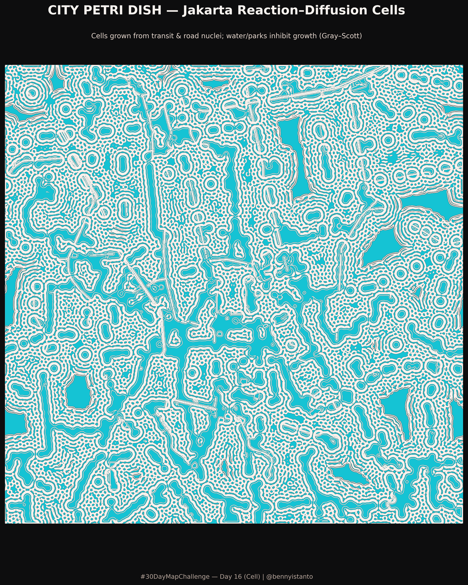

::: {.callout-note collapse="true" title="Python - Day 16, Cell"}
```python
# Lets install additional library
!pip install osmnx

# Day 16 — Cell
# CITY PETRI DISH — Reaction–Diffusion grown from transit + road seeds
# !pip -q install osmnx geopandas shapely pyproj scipy

import numpy as np, matplotlib.pyplot as plt
import geopandas as gpd, osmnx as ox
from shapely.geometry import Point, Polygon as SPoly
from pyproj import CRS
from matplotlib.path import Path
from scipy.ndimage import gaussian_filter

# ---------------- CFG ----------------
ox.settings.use_cache = True
ox.settings.log_console = False
ox.settings.timeout = 180

CFG = dict(
    center      = "Monas, Jakarta, Indonesia",
    aoi_side_m  = 12000,
    dpi         = 300,
    out_png     = "day16_city_petri_dish.png",

    # RD grid + steps
    grid_px     = 900,
    steps       = 2000,     # a touch more growth for clearer rings
    feed        = 0.031,
    kill        = 0.055,
    du          = 0.18,
    dv          = 0.09,

    # seeding + influence
    seed_radius   = 140,      # m
    seed_strength = 1.0,
    seed_every_m  = 600,      # denser along majors
    park_inhibit  = 0.5,
    water_inhibit = 0.02,
    fallback_spores = 250,    # random spores if still too few seeds

    # look (ring-only rendering)
    bg        = "#0d0d0e",
    sea       = "#15c3d4",
    ring_col  = "#fff4ef",
    ring_halo = "#534b46",
    ring_w    = 0.7,
    ring_halo_w = 1.5,
    ring_alpha  = 0.9,
    ring_levels = 14,
    smooth_sigma = 0.35,
    noise_eps = 0.04,
)

# ------------- helpers --------------
def utm_from_lonlat(lon, lat):
    zone = int((lon + 180)//6) + 1
    return CRS.from_epsg(32700 + zone) if lat < 0 else CRS.from_epsg(32600 + zone)

def laplacian(Z):
    return (
        -1*Z
        + 0.2*(np.roll(Z,1,0)+np.roll(Z,-1,0)+np.roll(Z,1,1)+np.roll(Z,-1,1))
        + 0.05*(np.roll(np.roll(Z,1,0),1,1)+np.roll(np.roll(Z,1,0),-1,1)
                +np.roll(np.roll(Z,-1,0),1,1)+np.roll(np.roll(Z,-1,0),-1,1))
    )

def points_along_line(ls, step):
    L = ls.length
    ds = np.arange(step, L, step)
    return [ls.interpolate(float(d)) for d in ds]

# ------------- AOI + fetch ----------
center_geom = ox.geocode_to_gdf(CFG["center"]).to_crs(4326).geometry.iloc[0]
center_pt = center_geom.centroid if center_geom.geom_type != "Point" else center_geom

crs_local = utm_from_lonlat(center_pt.x, center_pt.y)
center_xy = gpd.GeoSeries([center_pt], crs=4326).to_crs(crs_local).iloc[0]

half = CFG["aoi_side_m"]/2
aoi_xy = SPoly([(center_xy.x-half, center_xy.y-half),
                (center_xy.x+half, center_xy.y-half),
                (center_xy.x+half, center_xy.y+half),
                (center_xy.x-half, center_xy.y+half)])
aoi_ll = gpd.GeoSeries([aoi_xy], crs=crs_local).to_crs(4326).iloc[0]

def get_from_poly(tags):
    fn = ox.features_from_polygon if hasattr(ox,"features_from_polygon") else ox.geometries_from_polygon
    try:
        return fn(aoi_ll, tags=tags)
    except Exception:
        return gpd.GeoDataFrame(geometry=[])

gdf_transit = get_from_poly({
    "public_transport": ["station","stop_position","stop_area","platform"],
    "railway": ["station","halt","stop","tram_stop"],
    "highway": "bus_stop"
})
gdf_water = get_from_poly({
    "natural": ["water","sea","bay"], "landuse": ["basin","reservoir"], "waterway": ["riverbank","dock"]
})
gdf_parks = get_from_poly({"leisure": "park"})
gdf_roads_major = get_from_poly({"highway": ["motorway","trunk","primary","secondary"]})

def to_local(gdf):
    return (gdf.to_crs(crs_local)
            if gdf is not None and not gdf.empty
            else gpd.GeoDataFrame(geometry=[], crs=crs_local))
transit = to_local(gdf_transit); water = to_local(gdf_water); parks = to_local(gdf_parks); roads_major = to_local(gdf_roads_major)

# ------------- Build grids -----------
minx, miny, maxx, maxy = aoi_xy.bounds
H = W = int(CFG["grid_px"])
xs = np.linspace(minx, maxx, W); ys = np.linspace(miny, maxy, H)
X, Y = np.meshgrid(xs, ys)

U = np.ones((H, W), dtype=np.float32)
V = np.zeros((H, W), dtype=np.float32)

rng = np.random.default_rng(16)
U -= CFG["noise_eps"] * rng.random((H,W)).astype(np.float32)
V += CFG["noise_eps"] * rng.random((H,W)).astype(np.float32)

land_mask = np.ones((H, W), dtype=np.float32)

def rasterize_polygon(poly, value, mult=False):
    path = Path(np.asarray(poly.exterior.coords))
    pts  = np.vstack([X.ravel(), Y.ravel()]).T
    inside = path.contains_points(pts).reshape(H,W)
    if mult:
        land_mask[inside] *= value
    else:
        land_mask[inside] = value

for g in water.geometry.dropna():
    if g.geom_type == "Polygon":
        rasterize_polygon(g, CFG["water_inhibit"])
    elif g.geom_type == "MultiPolygon":
        for gg in g.geoms: rasterize_polygon(gg, CFG["water_inhibit"])

for g in parks.geometry.dropna():
    if g.geom_type == "Polygon":
        rasterize_polygon(g, CFG["park_inhibit"], mult=True)
    elif g.geom_type == "MultiPolygon":
        for gg in g.geoms: rasterize_polygon(gg, CFG["park_inhibit"], mult=True)

# seeds: transit + majors + fallback spores
seeds_pts = []
if not transit.empty:
    pts = transit.geometry[transit.geometry.type=="Point"]
    seeds_pts.extend(list(pts))

if not roads_major.empty:
    step = CFG["seed_every_m"]
    for g in roads_major.geometry.dropna():
        if g.geom_type == "LineString":
            seeds_pts += points_along_line(g, step)
        elif g.geom_type == "MultiLineString":
            for ls in g.geoms: seeds_pts += points_along_line(ls, step)

# ensure minimum seed density
if len(seeds_pts) < 80:
    for _ in range(CFG["fallback_spores"]):
        rx = rng.uniform(minx, maxx); ry = rng.uniform(miny, maxy)
        seeds_pts.append(Point(rx, ry))

# place seeds into V
r = CFG["seed_radius"]; r2 = r*r
seed_mask = np.zeros((H, W), dtype=bool)
for p in seeds_pts:
    if not isinstance(p, Point):
        continue
    dist2 = (X - p.x)**2 + (Y - p.y)**2
    S = dist2 <= r2
    V[S] = CFG["seed_strength"]
    seed_mask |= S

# ------------- Reaction–Diffusion ----
f,k,du,dv = CFG["feed"], CFG["kill"], CFG["du"], CFG["dv"]
growth_fac = 0.92 + 0.08*land_mask  # gentle inhibition (keeps carving around water)

for s in range(CFG["steps"]):
    Lu, Lv = laplacian(U), laplacian(V)
    UVV = U*V*V
    U += (du*Lu - UVV + f*(1-U)) * growth_fac
    V += (dv*Lv + UVV - (k+f)*V) * growth_fac
    if s % 40 == 0:
        V[seed_mask] = np.maximum(V[seed_mask], 0.85)
        U += (np.random.random((H,W))*8e-4 - 4e-4).astype(np.float32)
        V += (np.random.random((H,W))*8e-4 - 4e-4).astype(np.float32)
    np.clip(U,0,1,out=U); np.clip(V,0,1,out=V)

# ------------- Render ----------------
plt.close("all")
fig = plt.figure(figsize=(12,12), dpi=CFG["dpi"], facecolor=CFG["bg"])
ax  = fig.add_subplot(111)
ax.set_aspect("equal"); ax.set_facecolor(CFG["bg"])
ax.set_xlim(minx, maxx); ax.set_ylim(miny, maxy)
ax.set_xticks([]); ax.set_yticks([]); [s.set_visible(False) for s in ax.spines.values()]

# Background “dish”
ax.add_patch(plt.Rectangle((minx,miny), maxx-minx, maxy-miny, fc=CFG["sea"], ec="none", zorder=0))

# Rings (auto levels so they always show)
V_soft = gaussian_filter(V, CFG["smooth_sigma"])
v_lo = float(np.quantile(V_soft, 0.50))
v_hi = float(np.quantile(V_soft, 0.97))
if v_hi - v_lo < 1e-3:   # extreme flatness guard
    v_hi = min(1.0, v_lo + 0.02)
levels = np.linspace(v_lo, v_hi, CFG["ring_levels"])

ax.contour(X, Y, V_soft, levels=levels, colors=CFG["ring_halo"],
           linewidths=CFG["ring_halo_w"], alpha=0.35, zorder=1)
ax.contour(X, Y, V_soft, levels=levels, colors=CFG["ring_col"],
           linewidths=CFG["ring_w"], alpha=CFG["ring_alpha"], zorder=2)

# frame + labels
gpd.GeoSeries([aoi_xy], crs=crs_local).boundary.plot(ax=ax, color="#ffffff24", linewidth=1.1, zorder=3)
fig.text(0.5, 0.965, "CITY PETRI DISH — Jakarta Reaction–Diffusion Cells", ha="center",
         color="#f7f2ee", fontsize=18, weight="bold")
fig.text(0.5, 0.925, "Cells grown from transit & road nuclei; water/parks inhibit growth (Gray–Scott)",
         ha="center", color="#e6d8cf", fontsize=10)
fig.text(0.5, 0.018, "#30DayMapChallenge — Day 16 (Cell) | @bennyistanto",
         ha="center", color="#b8a79d", fontsize=9)

fig.savefig(CFG["out_png"], dpi=CFG["dpi"], facecolor=CFG["bg"], bbox_inches="tight", pad_inches=0)
plt.show()
```
:::

### Day 17 - A new tool
The gravity of Riverside City. First time using DuckDB Spatial and GeoParquet: 657 synthetic points of interest spawn 36,000 activity points, queried in SQL and plotted in polar space with distance as the radius.

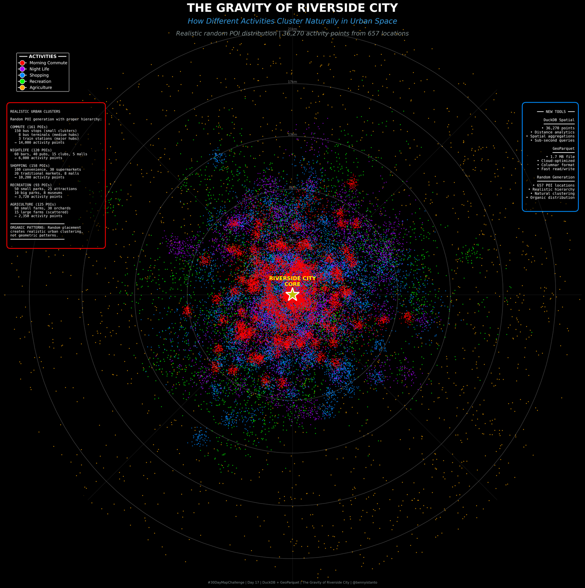

::: {.callout-note collapse="true" title="Python - Day 17, A new tool"}
```python
"""
Day 17: A New Tool - THE GRAVITY OF RIVERSIDE CITY
Fantasy city with realistic random POI distributions
DuckDB + GeoParquet to analyze urban activity patterns
"""

import os
import duckdb
import geopandas as gpd
import pandas as pd
import numpy as np
import matplotlib.pyplot as plt
from matplotlib.lines import Line2D
from shapely.geometry import Point
import warnings
warnings.filterwarnings('ignore')

print("Day 17: THE GRAVITY OF RIVERSIDE CITY")
print("="*70)
print("Fantasy city with realistic random activity clusters")
print("="*70 + "\n")

# ---------------- CONFIG ----------------
CFG = dict(
    city_name = "Riverside City",
    center_lat = 0.0,  # Fantasy coordinates
    center_lon = 0.0,
    radius_km = 20,
    out_parquet = "riverside_gravity.parquet",
    out_png = "day17_riverside_gravity.png",
    dpi = 300,
)

np.random.seed(42)

# ---------------- GENERATE RANDOM POIs ----------------
print("Generating random POIs with realistic distributions...\n")

# Define POI types with realistic counts and clustering
poi_definitions = {
    'morning_commute': {
        'types': [
            {'name': 'bus_stop', 'count': 150, 'cluster_size': 0.002},      # Many, scattered
            {'name': 'bus_terminal', 'count': 8, 'cluster_size': 0.008},   # Few, larger
            {'name': 'train_station', 'count': 3, 'cluster_size': 0.012},  # Very few, major
        ],
        'story': 'Transit hubs pulling commuters',
        'color': '#ff0000',
        'points_per_poi': 80,
    },
    'night_life': {
        'types': [
            {'name': 'bar', 'count': 60, 'cluster_size': 0.004},
            {'name': 'pub', 'count': 40, 'cluster_size': 0.005},
            {'name': 'nightclub', 'count': 15, 'cluster_size': 0.008},
            {'name': 'mall', 'count': 5, 'cluster_size': 0.015},
        ],
        'story': 'Entertainment venues',
        'color': '#aa00ff',
        'points_per_poi': 50,
    },
    'shopping': {
        'types': [
            {'name': 'convenience', 'count': 100, 'cluster_size': 0.003},
            {'name': 'supermarket', 'count': 30, 'cluster_size': 0.006},
            {'name': 'traditional_market', 'count': 20, 'cluster_size': 0.010},
            {'name': 'shopping_mall', 'count': 8, 'cluster_size': 0.015},
        ],
        'story': 'Retail centers',
        'color': '#0088ff',
        'points_per_poi': 60,
    },
    'recreation': {
        'types': [
            {'name': 'small_park', 'count': 50, 'cluster_size': 0.008},
            {'name': 'attraction', 'count': 25, 'cluster_size': 0.012},
            {'name': 'big_park', 'count': 10, 'cluster_size': 0.020},
            {'name': 'museum', 'count': 8, 'cluster_size': 0.005},
        ],
        'story': 'Leisure destinations',
        'color': '#00ff00',
        'points_per_poi': 40,
    },
    'agriculture': {
        'types': [
            {'name': 'small_farm', 'count': 80, 'cluster_size': 0.025},
            {'name': 'orchard', 'count': 30, 'cluster_size': 0.030},
            {'name': 'large_farm', 'count': 15, 'cluster_size': 0.040},
        ],
        'story': 'Agricultural areas',
        'color': '#ffaa00',
        'points_per_poi': 20,
    }
}

# Generate random POI locations
all_pois = []

for activity, info in poi_definitions.items():
    print(f"Generating {activity} POIs...")

    for poi_type in info['types']:
        count = poi_type['count']
        cluster_size = poi_type['cluster_size']

        # Determine distance from center based on activity type
        if activity == 'morning_commute':
            # Transit spread throughout city, concentrated near center
            mean_dist = 0.03
            std_dist = 0.025
        elif activity in ['night_life', 'shopping']:
            # Commercial areas near center
            mean_dist = 0.04
            std_dist = 0.03
        elif activity == 'recreation':
            # Parks distributed widely
            mean_dist = 0.06
            std_dist = 0.04
        else:  # agriculture
            # Farms on periphery
            mean_dist = 0.15
            std_dist = 0.05

        # Generate random POI locations
        distances = np.abs(np.random.normal(mean_dist, std_dist, count))
        angles = np.random.uniform(0, 2*np.pi, count)

        lons = CFG['center_lon'] + distances * np.cos(angles)
        lats = CFG['center_lat'] + distances * np.sin(angles)

        for lon, lat in zip(lons, lats):
            all_pois.append({
                'lon': lon,
                'lat': lat,
                'activity': activity,
                'poi_type': poi_type['name'],
                'cluster_size': cluster_size,
                'color': info['color']
            })

        print(f"  ✓ {count:3d} {poi_type['name']:20s}")

    print()

pois_df = pd.DataFrame(all_pois)
print(f"Generated {len(pois_df)} POI locations\n")

# Statistics per activity
print("POI counts by activity:")
for activity in poi_definitions.keys():
    count = len(pois_df[pois_df['activity'] == activity])
    print(f"  {activity:20s}: {count:4d} POIs")
print()

# ---------------- GENERATE ACTIVITY POINTS AROUND POIs ----------------
print("Generating activity points around POIs...\n")

all_activities = []

for idx, poi in pois_df.iterrows():
    activity = poi['activity']
    info = poi_definitions[activity]
    points_count = info['points_per_poi']

    # Vary points by POI type (e.g., stations > terminals > bus stops)
    if poi['poi_type'] == 'train_station':
        points_count = int(points_count * 3)  # Major hub = more people
    elif poi['poi_type'] == 'bus_terminal':
        points_count = int(points_count * 2)
    elif poi['poi_type'] == 'shopping_mall':
        points_count = int(points_count * 2.5)
    elif poi['poi_type'] == 'large_farm':
        points_count = int(points_count * 0.5)

    # Generate points around this POI with normal distribution
    cluster_std = poi['cluster_size']
    lons = np.random.normal(poi['lon'], cluster_std, points_count)
    lats = np.random.normal(poi['lat'], cluster_std, points_count)

    for lon, lat in zip(lons, lats):
        dist_km = np.sqrt((lon - CFG['center_lon'])**2 +
                         (lat - CFG['center_lat'])**2) * 111

        all_activities.append({
            'lon': lon,
            'lat': lat,
            'activity': activity,
            'poi_type': poi['poi_type'],
            'distance_km': dist_km,
            'color': poi['color']
        })

df = pd.DataFrame(all_activities)
geometry = [Point(xy) for xy in zip(df['lon'], df['lat'])]
gdf = gpd.GeoDataFrame(df, geometry=geometry, crs='EPSG:4326')

print(f"Generated {len(gdf):,} activity points\n")

# Statistics
print("Activity distribution:")
for activity in poi_definitions.keys():
    count = len(df[df['activity'] == activity])
    avg_dist = df[df['activity'] == activity]['distance_km'].mean()
    print(f"  {activity:20s}: {count:7,} points (avg: {avg_dist:5.1f}km)")
print()

# ---------------- SAVE GEOPARQUET ----------------
print(f"Saving to GeoParquet...")
gdf.to_parquet(CFG['out_parquet'])
file_size = os.path.getsize(CFG['out_parquet']) / (1024 * 1024)
print(f"{file_size:.2f} MB\n")

# ---------------- DUCKDB ANALYSIS ----------------
print("DuckDB Spatial Analysis...\n")

con = duckdb.connect(':memory:')
try:
    con.execute("INSTALL spatial;")
    con.execute("LOAD spatial;")
except:
    pass

con.execute(f"CREATE TABLE activities AS SELECT * FROM read_parquet('{CFG['out_parquet']}');")

# Core analysis
core_stats = con.execute("""
    SELECT
        activity,
        COUNT(*) as total,
        SUM(CASE WHEN distance_km < 5 THEN 1 ELSE 0 END) as core_5km,
        ROUND(AVG(distance_km), 2) as avg_dist_km
    FROM activities
    GROUP BY activity
    ORDER BY avg_dist_km;
""").fetchdf()

print("Distance analysis:")
print(core_stats.to_string(index=False))

con.close()

# ---------------- VISUALIZATION ----------------
print(f"\nCreating gravity visualization...\n")

fig = plt.figure(figsize=(20, 20), dpi=CFG['dpi'], facecolor='#000000')
ax = fig.add_subplot(111, projection='polar')
ax.set_facecolor('#000000')

# Polar conversion
gdf['distance'] = np.sqrt((gdf['lon'] - CFG['center_lon'])**2 +
                          (gdf['lat'] - CFG['center_lat'])**2)
gdf['angle'] = np.arctan2(gdf['lat'] - CFG['center_lat'],
                          gdf['lon'] - CFG['center_lon'])

max_dist = gdf['distance'].quantile(0.98)

# Plot in order (agriculture first, so it's in background)
plot_order = ['agriculture', 'recreation', 'shopping', 'night_life', 'morning_commute']

for act_name in plot_order:
    act_data = gdf[gdf['activity'] == act_name]
    info = poi_definitions[act_name]

    # Sample for visualization
    sample_size = min(50000, len(act_data))
    act_sample = act_data.sample(n=sample_size, random_state=42)

    theta = act_sample['angle'].values
    r = act_sample['distance'].values / max_dist

    ax.scatter(theta, r, c=info['color'], s=2, alpha=0.6,
              label=act_name.replace('_', ' ').title(), rasterized=True)

# Distance rings
for ring_dist in [0.2, 0.4, 0.6, 0.8, 1.0]:
    ax.plot(np.linspace(0, 2*np.pi, 100), [ring_dist]*100,
           color='white', linewidth=1, alpha=0.2)
    km = ring_dist * max_dist * 111
    ax.text(0, ring_dist, f'{km:.0f}km', color='white', fontsize=8,
           ha='center', va='bottom', alpha=0.5)

# Center
ax.plot(0, 0, 'y*', markersize=35, markeredgecolor='white',
       markeredgewidth=2.5, zorder=100)
ax.text(0, 0.05, f'{CFG["city_name"].upper()}\nCORE', ha='center', va='center',
       color='yellow', fontsize=13, weight='bold', zorder=101)

# Styling
ax.set_ylim(0, 1.1)
ax.set_theta_zero_location('N')
ax.set_theta_direction(-1)
ax.grid(True, color='white', alpha=0.1)
ax.set_yticklabels([])
ax.set_xticklabels([])

# Legend
legend_elements = []
for act_name, act_info in poi_definitions.items():
    display_name = act_name.replace('_', ' ').title()
    legend_elements.append(Line2D([0], [0], marker='o', color='w',
                                  markerfacecolor=act_info['color'],
                                  markersize=12, label=display_name,
                                  markeredgecolor='white', markeredgewidth=1))

legend = ax.legend(handles=legend_elements, loc='upper left',
                  bbox_to_anchor=(0.02, 0.92),
                  fontsize=10, frameon=True, facecolor='#00000099',
                  edgecolor='white', labelcolor='white',
                  title='━━━ ACTIVITIES ━━━',
                  title_fontsize=11)
legend.get_title().set_color('white')
legend.get_title().set_weight('bold')

# Titles
fig.text(0.5, 0.98, f'THE GRAVITY OF {CFG["city_name"].upper()}', ha='center',
         color='white', fontsize=28, weight='bold')
fig.text(0.5, 0.96, 'How Different Activities Cluster Naturally in Urban Space',
         ha='center', color='#3498db', fontsize=18, style='italic')
fig.text(0.5, 0.94, f'Realistic random POI distribution | {len(gdf):,} activity points from {len(pois_df)} locations',
         ha='center', color='#7f8c8d', fontsize=15, style='italic')

# Story
total_pois = len(pois_df)
story_text = f"""
REALISTIC URBAN CLUSTERS

Random POI generation with proper hierarchy:

COMMUTE ({len(pois_df[pois_df['activity']=='morning_commute'])} POIs)
  150 bus stops (small clusters)
    8 bus terminals (medium hubs)
    3 train stations (major hubs)
  → {len(gdf[gdf['activity']=='morning_commute']):,} activity points

NIGHTLIFE ({len(pois_df[pois_df['activity']=='night_life'])} POIs)
  60 bars, 40 pubs, 15 clubs, 5 malls
  → {len(gdf[gdf['activity']=='night_life']):,} activity points

SHOPPING ({len(pois_df[pois_df['activity']=='shopping'])} POIs)
  100 convenience, 30 supermarkets
  20 traditional markets, 8 malls
  → {len(gdf[gdf['activity']=='shopping']):,} activity points

RECREATION ({len(pois_df[pois_df['activity']=='recreation'])} POIs)
  50 small parks, 25 attractions
  10 big parks, 8 museums
  → {len(gdf[gdf['activity']=='recreation']):,} activity points

AGRICULTURE ({len(pois_df[pois_df['activity']=='agriculture'])} POIs)
  80 small farms, 30 orchards
  15 large farms (scattered)
  → {len(gdf[gdf['activity']=='agriculture']):,} activity points

━━━━━━━━━━━━━━━━━━━━━━━━━━
ORGANIC PATTERNS: Random placement
creates realistic urban clustering,
not geometric patterns.
━━━━━━━━━━━━━━━━━━━━━━━━━━
"""

fig.text(0.02, 0.82, story_text, ha='left', va='top',
         color='white', fontsize=8.5, fontfamily='monospace',
         bbox=dict(boxstyle='round,pad=1', facecolor='#00000099',
                  edgecolor='#ff0000', linewidth=2),
         transform=fig.transFigure)

# Tech specs
tech_text = f"""
━━━ NEW TOOLS ━━━

DuckDB Spatial
━━━━━━━━━━━━━━
• {len(gdf):,} points
• Distance analytics
• Spatial aggregations
• Sub-second queries

GeoParquet
━━━━━━━━━━
• {file_size:.1f} MB file
• Cloud-optimized
• Columnar format
• Fast read/write

Random Generation
━━━━━━━━━━━━━━━━━
• {total_pois} POI locations
• Realistic hierarchy
• Natural clustering
• Organic distribution

"""

fig.text(0.98, 0.82, tech_text, ha='right', va='top',
         color='white', fontsize=9, fontfamily='monospace',
         bbox=dict(boxstyle='round,pad=1', facecolor='#00000099',
                  edgecolor='#0088ff', linewidth=2),
         transform=fig.transFigure)

# Attribution
fig.text(0.5, 0.01, f'#30DayMapChallenge | Day 17 | DuckDB + GeoParquet | The Gravity of {CFG["city_name"]} | @bennyistanto',
         ha='center', color='#7f8c8d', fontsize=8, transform=fig.transFigure)

plt.tight_layout()
fig.savefig(CFG['out_png'], dpi=CFG['dpi'], facecolor='#000000',
            bbox_inches='tight', pad_inches=0.1)

print(f"DONE!")
print(f"{CFG['city_name']} gravity map created")
print(f"{total_pois} random POI locations → {len(gdf):,} activity points")
print(f"Realistic clustering with proper hierarchy")
print(f"Saved: {CFG['out_png']}")

plt.show()
```
:::

### Day 18 - Out of this world
Sector 18. Hyperspace lanes through a synthetic spiral galaxy.

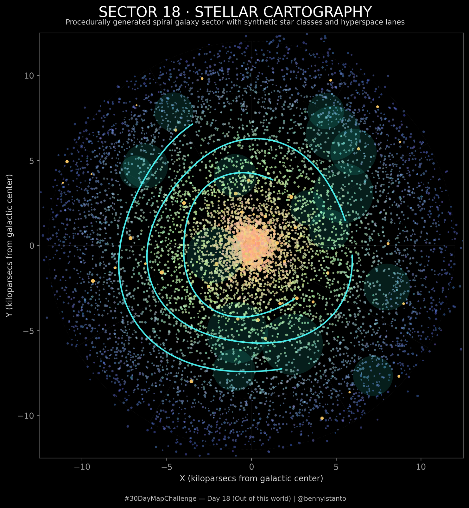

::: {.callout-note collapse="true" title="Python - Day 18, Out of this world"}
```python
import numpy as np
import matplotlib.pyplot as plt

# ---------------------------------------------------------
# Config
# ---------------------------------------------------------
MAIN_TITLE = "SECTOR 18 · STELLAR CARTOGRAPHY"
SUBTITLE = "Procedurally generated spiral galaxy sector with synthetic star classes and hyperspace lanes"
ATTRIBUTION = "#30DayMapChallenge — Day 18 (Out of this world) | @bennyistanto"
FILENAME = "day18_outofthisworld.png"

# ---------------------------------------------------------
# 1. Generate a synthetic spiral galaxy
# ---------------------------------------------------------
def generate_spiral_galaxy(
    n_arms=4,
    n_arm_stars=6000,
    n_core_stars=1500,
    n_halo_stars=1500,
    core_radius=1.2,
    max_radius=12.0,
    arm_spread=0.6,
    rng_seed=18,
):
    rng = np.random.default_rng(rng_seed)

    # --- Arm stars (on logarithmic-ish spirals) ---
    arm_idx = rng.integers(0, n_arms, size=n_arm_stars)
    # Base angle along the arm (controls how far from center)
    theta_base = rng.uniform(0, 4 * np.pi, size=n_arm_stars)  # ~two full turns
    # Offset each arm
    theta = theta_base + 2 * np.pi * arm_idx / n_arms
    # Radius grows with theta_base
    r = core_radius + (max_radius - core_radius) * theta_base / (4 * np.pi)
    # Add scatter around arm
    r += rng.normal(scale=arm_spread, size=n_arm_stars)
    theta += rng.normal(scale=0.12, size=n_arm_stars)

    arm_x = r * np.cos(theta)
    arm_y = r * np.sin(theta)

    # --- Core stars (dense central bulge) ---
    core_r = rng.normal(loc=0.0, scale=0.7, size=n_core_stars)
    core_theta = rng.uniform(0, 2 * np.pi, size=n_core_stars)
    core_r = np.abs(core_r)
    core_x = core_r * np.cos(core_theta)
    core_y = core_r * np.sin(core_theta)

    # --- Halo stars (sparse outer points) ---
    halo_r = rng.uniform(max_radius * 0.7, max_radius, size=n_halo_stars)
    halo_theta = rng.uniform(0, 2 * np.pi, size=n_halo_stars)
    halo_x = halo_r * np.cos(halo_theta)
    halo_y = halo_r * np.sin(halo_theta)

    # Stack everything
    x = np.concatenate([arm_x, core_x, halo_x])
    y = np.concatenate([arm_y, core_y, halo_y])

    # Labels for convenience (0=arm, 1=core, 2=halo)
    labels = np.concatenate([
        np.zeros(n_arm_stars, dtype=int),
        np.ones(n_core_stars, dtype=int),
        np.full(n_halo_stars, 2, dtype=int)
    ])

    return x, y, labels, max_radius


# ---------------------------------------------------------
# 2. Build colors and sizes for stars
# ---------------------------------------------------------
def style_stars(x, y, labels, max_radius, rng_seed=18):
    rng = np.random.default_rng(rng_seed)
    n = x.size
    r = np.sqrt(x**2 + y**2)
    r_norm = np.clip(r / max_radius, 0, 1)

    # Base RGBA arrays
    colors = np.zeros((n, 4), dtype=float)
    sizes = np.zeros(n, dtype=float)

    # --- Base colors: inner warm, outer cyan/magenta ---
    # A handmade gradient:
    # red: strong near center, fades
    colors[:, 0] = 1.0 - 0.6 * r_norm
    # green: mid-range boost gives turquoise feel
    colors[:, 1] = 0.2 + 0.8 * (1.0 - np.abs(r_norm - 0.4))
    # blue: stronger at mid–outer radii
    colors[:, 2] = 0.5 + 0.5 * r_norm

    # Slight random variation
    colors[:, :3] += rng.normal(scale=0.05, size=(n, 3))
    colors = np.clip(colors, 0, 1)

    # Alpha: inner brighter, outer more transparent
    colors[:, 3] = 0.4 + 0.5 * (1 - r_norm)

    # Sizes: core > arms > halo
    sizes[labels == 1] = rng.uniform(8, 18, size=(labels == 1).sum())  # core
    sizes[labels == 0] = rng.uniform(4, 10, size=(labels == 0).sum())  # arms
    sizes[labels == 2] = rng.uniform(2, 6, size=(labels == 2).sum())   # halo

    # Promote a few random "giants"
    n_giants = max(30, n // 200)
    giant_idx = rng.choice(n, size=n_giants, replace=False)
    sizes[giant_idx] *= 2.5
    colors[giant_idx, 0] = 1.0  # hot/bright
    colors[giant_idx, 1] = 0.8
    colors[giant_idx, 2] = 0.4
    colors[giant_idx, 3] = 0.95

    return colors, sizes


# ---------------------------------------------------------
# 3. Hyperspace lanes: smooth arcs crossing the galaxy
# ---------------------------------------------------------
def make_hyperspace_lanes(max_radius, n_lanes=3, rng_seed=18):
    rng = np.random.default_rng(rng_seed)
    lanes = []
    for i in range(n_lanes):
        # Choose a radius band for this lane
        base_r = max_radius * (0.35 + 0.15 * i)
        theta = np.linspace(rng.uniform(0, np.pi), rng.uniform(np.pi, 2*np.pi), 600)
        # Slight wobble so it's not a perfect circle
        wobble = 0.25 * np.sin(3 * theta + rng.uniform(0, 2*np.pi))
        r = base_r * (1.0 + wobble / 5.0)
        x = r * np.cos(theta)
        y = r * np.sin(theta)
        lanes.append((x, y))
    return lanes


# ---------------------------------------------------------
# 4. Plot the map
# ---------------------------------------------------------
def plot_galaxy_map():
    x, y, labels, max_radius = generate_spiral_galaxy()
    colors, sizes = style_stars(x, y, labels, max_radius)
    lanes = make_hyperspace_lanes(max_radius)

    fig, ax = plt.subplots(figsize=(9, 9), dpi=300)
    fig.patch.set_facecolor("black")
    ax.set_facecolor("black")

    # Main scatter
    ax.scatter(
        x, y,
        s=sizes,
        c=colors,
        marker="o",
        linewidths=0,
    )

    # Nebulae: soft translucent blobs at random locations
    rng = np.random.default_rng(42)
    n_nebula = 16
    neb_x = rng.uniform(-max_radius * 0.7, max_radius * 0.7, size=n_nebula)
    neb_y = rng.uniform(-max_radius * 0.7, max_radius * 0.7, size=n_nebula)
    neb_r = rng.uniform(0.8, 2.0, size=n_nebula)

    for cx, cy, rad in zip(neb_x, neb_y, neb_r):
        theta = np.linspace(0, 2*np.pi, 200)
        nx = cx + rad * np.cos(theta)
        ny = cy + rad * np.sin(theta)
        ax.fill(
            nx, ny,
            color=(0.2, 1.0, 0.9, 0.12),
            linewidth=0
        )

    # Hyperspace lanes on top
    for (lx, ly) in lanes:
        ax.plot(
            lx, ly,
            color=(0.3, 1.0, 1.0, 0.9),
            linewidth=1.8,
            solid_capstyle="round",
        )

    # Subtle polar grid to keep "map" feeling
    thetas = np.linspace(0, 2*np.pi, 361)
    for rad in np.linspace(3, max_radius, 4):
        gx = rad * np.cos(thetas)
        gy = rad * np.sin(thetas)
        ax.plot(
            gx, gy,
            color=(1, 1, 1, 0.05),
            linestyle=":",
            linewidth=0.6,
        )

    for angle_deg in range(0, 360, 30):
        th = np.deg2rad(angle_deg)
        ax.plot(
            [0, max_radius * np.cos(th)],
            [0, max_radius * np.sin(th)],
            color=(1, 1, 1, 0.05),
            linewidth=0.5,
        )

    # Axes settings
    ax.set_aspect("equal", "box")
    ax.set_xlim(-max_radius - 0.5, max_radius + 0.5)
    ax.set_ylim(-max_radius - 0.5, max_radius + 0.5)

    ax.set_xlabel("X (kiloparsecs from galactic center)", color="0.8")
    ax.set_ylabel("Y (kiloparsecs from galactic center)", color="0.8")

    # Ticks styling
    for spine in ax.spines.values():
        spine.set_color("0.3")
    ax.tick_params(colors="0.6", length=3, width=0.7)

    # -------------------------------------------------
    # Titles & attribution
    # -------------------------------------------------
    fig.text(
        0.5, 0.965,
        MAIN_TITLE,
        ha="center",
        va="top",
        fontsize=18,
        color="white",
    )
    fig.text(
        0.5, 0.94,
        SUBTITLE,
        ha="center",
        va="top",
        fontsize=9,
        color="0.8",
    )
    fig.text(
        0.5, 0.02,
        ATTRIBUTION,
        ha="center",
        va="bottom",
        fontsize=8,
        color="0.7",
    )

    plt.tight_layout(rect=[0.03, 0.04, 0.97, 0.93])
    plt.savefig(
        FILENAME,
        dpi=400,
        facecolor=fig.get_facecolor(),
        bbox_inches="tight",
    )
    plt.show()


if __name__ == "__main__":
    plot_galaxy_map()
```
:::

### Day 19 - Projections
Spiral Earth, a nautilus projection of the world.

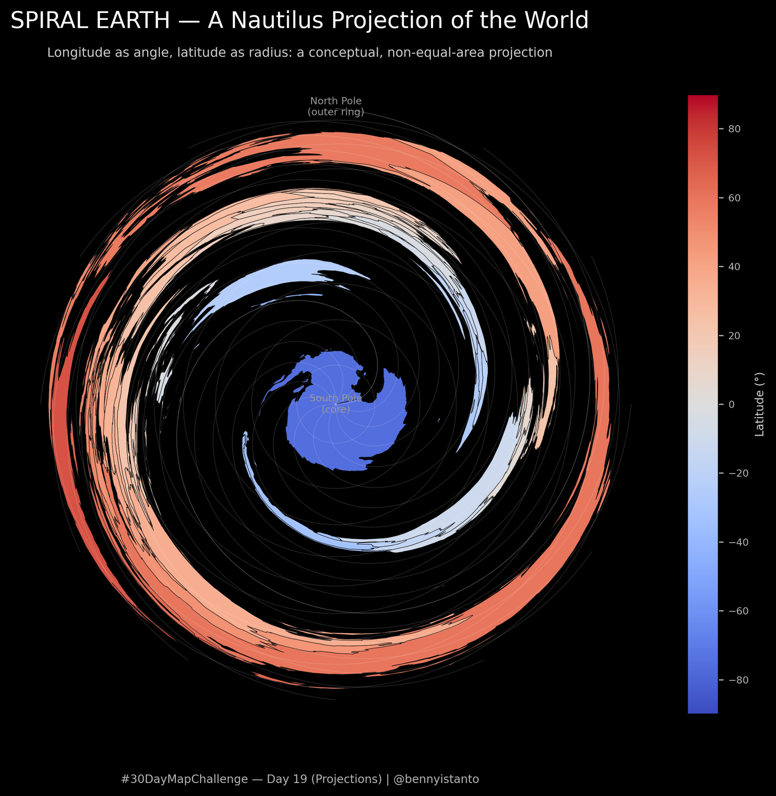

::: {.callout-note collapse="true" title="Python - Day 19, Projections"}
```python
# Lets install additional library
!pip install cartopy

import numpy as np
import geopandas as gpd
import matplotlib.pyplot as plt
from matplotlib.colors import Normalize
from matplotlib.cm import ScalarMappable
from shapely.ops import transform
from cartopy import feature as cfeature

# -------------------------------------------------------------------
# Config
# -------------------------------------------------------------------
MAIN_TITLE = "SPIRAL EARTH — A Nautilus Projection of the World"
SUBTITLE = "Longitude as angle, latitude as radius: a conceptual, non-equal-area projection"
ATTRIBUTION = "#30DayMapChallenge — Day 19 (Projections) | @bennyistanto"
FILENAME = "day19_projections.png"

R_SCALE = 10.0       # overall radius of the spiral (plot units)
EXPONENT = 0.7       # <1 spreads out tropics, >1 compresses them
SPIRAL_TURNS = 1.25  # how many extra rotations from South → North (try 1–3)


# -------------------------------------------------------------------
# 1. Core projection: lon/lat → spiral (x, y)
# -------------------------------------------------------------------
def lonlat_to_spiral(lon, lat, r_scale=R_SCALE, exponent=EXPONENT, turns=SPIRAL_TURNS):
    """
    Spiral Earth projection.

    - Latitude controls radius (South Pole at center, North Pole outer ring).
    - Longitude AND latitude together control angle, so lines of latitude
      become spirals instead of circles.

    Parameters
    ----------
    lon : array-like
        Longitude in degrees (-180..180).
    lat : array-like
        Latitude in degrees (-90..90).
    r_scale : float
        Overall radius scaling factor.
    exponent : float
        Controls how latitude maps to radius: r ~ ((lat+90)/180)**exponent
    turns : float
        Extra spiral rotations from South → North (0 = azimuthal).

    Returns
    -------
    x, y : arrays
        2D planar coordinates in spiral space.
    """
    lon = np.asarray(lon)
    lat = np.asarray(lat)

    # Normalize latitude from [-90, 90] → [0, 1]
    u = (lat + 90.0) / 180.0
    u = np.clip(u, 0.0, 1.0)

    # Radius grows with latitude (non-linear to emphasise tropics)
    r = (u ** exponent) * r_scale

    # Base angle from longitude
    theta_lon = np.deg2rad(lon) + np.pi

    # Add a latitude-dependent twist: South=0 extra, North=turns * 2π extra
    theta = theta_lon + 2 * np.pi * turns * u

    x = r * np.cos(theta)
    y = r * np.sin(theta)
    return x, y


def spiral_geometry(geom):
    """Apply the Spiral Earth projection to a shapely geometry."""
    def _f(x, y, z=None):
        xs, ys = lonlat_to_spiral(x, y)
        return xs, ys
    return transform(_f, geom)


# -------------------------------------------------------------------
# 2. Build graticule (lat/lon lines) and transform to spiral
# -------------------------------------------------------------------
def build_graticule():
    grat_lines = []

    # Parallels (latitude lines)
    for lat in range(-80, 81, 20):
        lons = np.linspace(-180, 180, 361)
        lats = np.full_like(lons, lat, dtype=float)
        x, y = lonlat_to_spiral(lons, lats)
        grat_lines.append((x, y))

    # Meridians (longitude lines)
    for lon in range(-180, 181, 30):
        lats = np.linspace(-90, 90, 361)
        lons = np.full_like(lats, lon, dtype=float)
        x, y = lonlat_to_spiral(lons, lats)
        grat_lines.append((x, y))

    return grat_lines


# -------------------------------------------------------------------
# 3. Load Natural Earth via cartopy.feature
# -------------------------------------------------------------------
def load_world():
    """
    Get Natural Earth 'admin_0_countries' from cartopy.feature,
    and compute an approximate latitude for coloring (centroid in a
    projected CRS, then back to EPSG:4326 to read lat).
    """
    # cartopy.feature will fetch/cache the shapefile internally
    ne_countries = cfeature.NaturalEarthFeature(
        category="cultural",
        name="admin_0_countries",
        scale="110m",
    )

    # Wrap geometries into a GeoDataFrame (lon/lat)
    geoms = list(ne_countries.geometries())
    world = gpd.GeoDataFrame({"geometry": geoms}, crs="EPSG:4326")

    # Use a world-friendly projected CRS (World Cylindrical Equal Area)
    world_proj = world.to_crs("ESRI:54034")   # or "EPSG:6933"

    # Centroids in projected space
    cent_proj = world_proj.geometry.centroid

    # Bring centroids back to lon/lat so we can read latitude
    cent_ll = gpd.GeoSeries(cent_proj, crs=world_proj.crs).to_crs("EPSG:4326")
    world["lat_centroid"] = cent_ll.y

    return world


# -------------------------------------------------------------------
# 4. Main plotting routine
# -------------------------------------------------------------------
def plot_spiral_earth():
    # Load Natural Earth
    world = load_world()

    # Transform geometries to Spiral Earth projection
    world_spiral = world.copy()
    world_spiral["geometry"] = world_spiral["geometry"].apply(spiral_geometry)

    # Prepare figure
    fig, ax = plt.subplots(figsize=(10, 8), dpi=300)
    fig.patch.set_facecolor("black")
    ax.set_facecolor("black")

    # --- Color by latitude (intuitive) ---
    norm = Normalize(vmin=-90, vmax=90)
    cmap = plt.get_cmap("coolwarm")  # blue → white → red

    world_spiral.plot(
        ax=ax,
        column="lat_centroid",   # stored before projection
        cmap=cmap,
        norm=norm,
        edgecolor="#111111",
        linewidth=0.3,
    )

    # Graticule to show distortion
    grat_lines = build_graticule()
    for x, y in grat_lines:
        ax.plot(
            x, y,
            color=(1, 1, 1, 0.12),
            linewidth=0.6,
            linestyle="-",
        )

    # Cosmetic tweaks
    ax.set_aspect("equal", "box")
    ax.set_xticks([])
    ax.set_yticks([])
    for spine in ax.spines.values():
        spine.set_visible(False)

    # Colorbar explaining the colors = latitude
    sm = ScalarMappable(norm=norm, cmap=cmap)
    sm.set_array([])
    cbar = fig.colorbar(
        sm,
        ax=ax,
        orientation="vertical",
        fraction=0.035,
        pad=0.03,
    )
    cbar.set_label("Latitude (°)", color="0.8", fontsize=8)
    cbar.ax.tick_params(colors="0.7", labelsize=7)

    # Titles & attribution
    fig.text(
        0.5, 0.965,
        MAIN_TITLE,
        ha="center",
        va="top",
        fontsize=16,
        color="white",
    )
    fig.text(
        0.5, 0.92,
        SUBTITLE,
        ha="center",
        va="top",
        fontsize=9,
        color="0.8",
    )
    fig.text(
        0.5, 0.02,
        ATTRIBUTION,
        ha="center",
        va="bottom",
        fontsize=8,
        color="0.7",
    )

    # Labels for poles
    ax.text(
        0.0, 0.0,
        "South Pole\n(core)",
        fontsize=7,
        color="0.6",
        ha="center",
        va="center",
    )
    ax.text(
        0.0, R_SCALE * 0.97,
        "North Pole\n(outer ring)",
        fontsize=7,
        color="0.6",
        ha="center",
        va="bottom",
    )

    plt.tight_layout(rect=[0.03, 0.07, 0.97, 0.9])
    plt.savefig(
        FILENAME,
        dpi=400,
        facecolor=fig.get_facecolor(),
        bbox_inches="tight",
    )
    plt.show()


# -------------------------------------------------------------------
# 5. Run
# -------------------------------------------------------------------
if __name__ == "__main__":
    plot_spiral_earth()
```
:::

### Day 20 - Water
Veins of Madagascar. Rivers grouped by physio-climatic type.

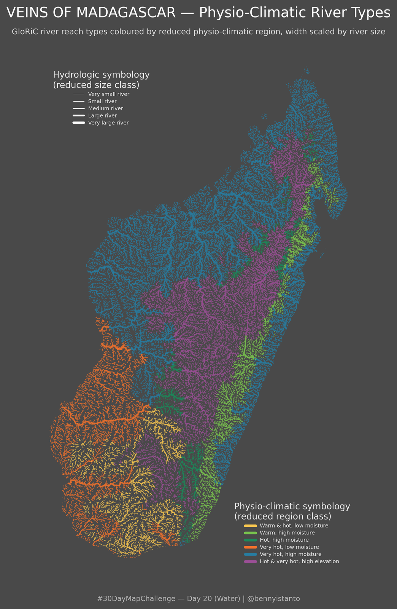

::: {.callout-note collapse="true" title="Python - Day 20, Water"}
```python
# Lets install additional library
!pip install cartopy

import numpy as np
import geopandas as gpd
import matplotlib.pyplot as plt
from matplotlib.lines import Line2D
from matplotlib.cm import get_cmap
from cartopy import feature as cfeature

# -------------------------------------------------------------------
# Config
# -------------------------------------------------------------------
DATA_PATH = "madagascar_gloric.gpkg"
DATA_LAYER = "river"

MAIN_TITLE = "VEINS OF MADAGASCAR — Physio-Climatic River Types"
SUBTITLE = "GloRiC river reach types coloured by reduced physio-climatic region, width scaled by river size"
ATTRIBUTION = "#30DayMapChallenge — Day 20 (Water) | @bennyistanto"
FILENAME = "day20_water.png"

# Custom Albers Equal Area centered on Borneo
TARGET_CRS = (
    "+proj=aea +lat_1=-5 +lat_2=10 "
    "+lat_0=0 +lon_0=115 +datum=WGS84 +units=m +no_defs"
)

# Reduced physio-climatic group labels (1st digit of Reach_type)
PHYS_LABELS = {
    1: "Cold, low & medium moisture",
    2: "Cold, high moisture",
    3: "Warm & hot, low moisture",
    4: "Warm, medium moisture",
    5: "Warm, high moisture",
    6: "Hot, high moisture",
    7: "Very hot, low moisture",
    8: "Very hot, high moisture",
    9: "Cold & warm, high elevation",
    10: "Hot & very hot, high elevation",
}

PHYS_COLORS = {
    # Approximate colours inspired by the GloRiC legend
    1: "#7ED6C2",  # cold, low & medium moisture (mint)
    2: "#3ECBF1",  # cold, high moisture (cyan)
    3: "#F9C74F",  # warm & hot, low moisture (yellow)
    4: "#B6D43A",  # warm, medium moisture (yellow-green)
    5: "#79C44E",  # warm, high moisture (green)
    6: "#1B8A5A",  # hot, high moisture (dark green)
    7: "#F3722C",  # very hot, low moisture (orange)
    8: "#277DA1",  # very hot, high moisture (blue)
    9: "#C792E0",  # cold & warm, high elevation (lavender)
    10: "#9B4F96", # hot & very hot, high elevation (purple)
}

# Hydrologic size labels (2nd digit of Reach_type)
HYDRO_SIZE_LABELS = {
    1: "Very small river",
    2: "Small river",
    3: "Medium river",
    4: "Large river",
    5: "Very large river",
}

# Linewidths (in points) per hydrologic size class
HYDRO_WIDTHS = {
    1: 0.4,
    2: 0.8,
    3: 1.3,
    4: 1.9,
    5: 2.5,
}


# -------------------------------------------------------------------
# 1. Helpers to decode Reach_type
# -------------------------------------------------------------------
def decode_reach_type(series):
    """
    Decode GloRiC Reach_type code into three components:

    - phys_code : reduced physio-climatic region (1..10)
    - hydro_code: reduced hydrologic size (1..5)
    - geom_code : reduced geomorphic / stream power (1..3, 0 for "-")

    Works with 3-digit (e.g. 150) and 4-digit (e.g. 1011) codes.
    """
    s = series.astype("Int64")

    # Handle missing / 0 values
    mask_valid = s.notna() & (s != 0)
    phys = np.full(len(s), np.nan)
    hydro = np.full(len(s), np.nan)
    geom = np.full(len(s), np.nan)

    s_str = s.astype("string")

    # Only process valid rows
    for i, code_str in enumerate(s_str):
        if not mask_valid.iloc[i]:
            continue
        code_str = code_str.strip()
        if len(code_str) < 3:
            continue
        # phys = everything except last 2 digits
        phys[i] = int(code_str[:-2])
        # hydro = second-last digit
        hydro[i] = int(code_str[-2])
        # geom = last digit
        geom[i] = int(code_str[-1])

    phys = pd.Series(phys, index=s.index).astype("float")
    hydro = pd.Series(hydro, index=s.index).astype("float")
    geom = pd.Series(geom, index=s.index).astype("float")

    return phys, hydro, geom


# -------------------------------------------------------------------
# 2. Load & prepare data
# -------------------------------------------------------------------
import pandas as pd  # after helper to avoid confusion

def load_gloric_subset(path=DATA_PATH, layer=DATA_LAYER, target_crs=TARGET_CRS):
    """
    Load GloRiC subset for Borneo from a GeoPackage and prepare attributes.

    Uses:
      - 'Reach_type' to derive:
          phys_group  (1..10) -> colour
          hydro_size  (1..5)  -> line width
      - 'geometry'   : river lines
    """
    gdf = gpd.read_file(path, layer=layer)
    print("Columns:", list(gdf.columns))

    if "Reach_type" not in gdf.columns:
        raise ValueError("Expected 'Reach_type' field in GloRiC layer.")

    # Reproject to target CRS
    gdf = gdf.to_crs(target_crs)

    # Decode Reach_type into physio + hydrologic + geomorphic parts
    phys, hydro, geom = decode_reach_type(gdf["Reach_type"])
    gdf["phys_group"] = phys
    gdf["hydro_size"] = hydro
    gdf["geom_group"] = geom

    # Map hydrologic size to line width; fall back to medium if missing
    def map_width(h):
        try:
            h_int = int(h)
        except (ValueError, TypeError):
            return HYDRO_WIDTHS[3]  # medium
        return HYDRO_WIDTHS.get(h_int, HYDRO_WIDTHS[3])

    gdf["width"] = gdf["hydro_size"].apply(map_width)

    return gdf


# -------------------------------------------------------------------
# 3. Build colour + legend helpers
# -------------------------------------------------------------------
def build_color_mapping(gdf):
    """Assign a fixed colour to each physio-climatic group."""
    classes = sorted(
        c for c in gdf["phys_group"].dropna().unique()
        if int(c) in PHYS_COLORS
    )
    class_to_color = {cls: PHYS_COLORS[int(cls)] for cls in classes}
    return class_to_color


def build_physio_legend_handles(class_to_color):
    """Create legend handles for physio-climatic classes."""
    handles = []
    for cls, col in class_to_color.items():
        label = PHYS_LABELS.get(int(cls), f"Physio group {int(cls)}")
        h = Line2D(
            [0, 1],
            [0, 0],
            color=col,
            linewidth=3.0,
            solid_capstyle="round",
            label=label,
        )
        handles.append(h)
    return handles


def build_size_legend_handles():
    """Stylized hydrologic size legend (very small → very large)."""
    handles = []
    for size_code in [1, 2, 3, 4, 5]:
        label = HYDRO_SIZE_LABELS[size_code]
        width = HYDRO_WIDTHS[size_code]
        h = Line2D(
            [0, 1],
            [0, 0],
            color="white",
            linewidth=width,
            solid_capstyle="round",
            label=label,
        )
        handles.append(h)
    return handles


# -------------------------------------------------------------------
# 4. Main plotting routine
# -------------------------------------------------------------------
def plot_borneo_gloric():
    rivers = load_gloric_subset()
    class_to_color = build_color_mapping(rivers)

    fig, ax = plt.subplots(figsize=(10, 10), dpi=300)
    fig.patch.set_facecolor("#494949")
    ax.set_facecolor("#494949")

    # Turn off axes
    ax.set_xticks([])
    ax.set_yticks([])
    for spine in ax.spines.values():
        spine.set_visible(False)

    # Plot per physio-climatic group with a "glow"
    for phys_group, color in class_to_color.items():
        sub = rivers[rivers["phys_group"] == phys_group]

        # Glow layer
        sub.plot(
            ax=ax,
            color=color,
            linewidth=sub["width"] * 1.8,
            alpha=0.2,
            zorder=1,
        )
        # Main layer
        sub.plot(
            ax=ax,
            color=color,
            linewidth=sub["width"],
            alpha=0.85,
            zorder=2,
        )

    ax.set_aspect("equal", "box")
    ax.margins(0.02)

    # ------------------------------------------------------------------
    # Legends
    # ------------------------------------------------------------------
    physio_handles = build_physio_legend_handles(class_to_color)
    size_handles = build_size_legend_handles()

    # Hydrologic size legend (top left)
    leg_size = ax.legend(
        handles=size_handles,
        title="Hydrologic symbology\n(reduced size class)",
        loc="upper left",              # anchor corner
        bbox_to_anchor=(0.02, 0.98),   # x, y in axes coords (0–1)
        frameon=False,
        fontsize=6,
        handlelength=2.0,
        handletextpad=0.8,
        borderpad=0.2,
        labelspacing=0.4,
    )

    for txt in leg_size.get_texts():
        txt.set_color("0.9")
    leg_size.get_title().set_color("0.9")

    ax.add_artist(leg_size)


    # Physio-climatic legend
    leg_phys = ax.legend(
        handles=physio_handles,
        title="Physio-climatic symbology\n(reduced region class)",
        loc="lower right",
        frameon=False,
        fontsize=6,
        handlelength=2.0,
        handletextpad=0.8,
        borderpad=0.2,
        labelspacing=0.4,
    )
    for txt in leg_phys.get_texts():
        txt.set_color("0.9")
    leg_phys.get_title().set_color("0.9")

    # ------------------------------------------------------------------
    # Titles & attribution
    # ------------------------------------------------------------------
    fig.text(
        0.5,
        0.965,
        MAIN_TITLE,
        ha="center",
        va="top",
        fontsize=16,
        color="white",
    )
    fig.text(
        0.5,
        0.93,
        SUBTITLE,
        ha="center",
        va="top",
        fontsize=9,
        color="0.85",
    )
    fig.text(
        0.5,
        0.02,
        ATTRIBUTION,
        ha="center",
        va="bottom",
        fontsize=8,
        color="0.7",
    )

    plt.tight_layout(rect=[0.02, 0.06, 0.98, 0.9])
    plt.savefig(
        FILENAME,
        dpi=400,
        facecolor=fig.get_facecolor(),
        bbox_inches="tight",
    )
    plt.show()


# -------------------------------------------------------------------
# Run
# -------------------------------------------------------------------
if __name__ == "__main__":
    plot_borneo_gloric()
```
:::

### Day 21 - Icons
Symbolic biome Earth. The world drawn entirely from marker icons.

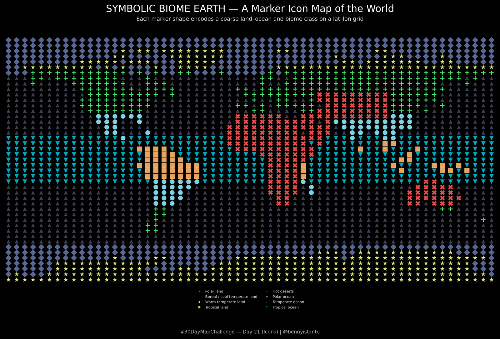

::: {.callout-note collapse="true" title="Python - Day 21, Icons"}
```python
# Lets install additional library
!pip install cartopy

import numpy as np
import geopandas as gpd
import matplotlib.pyplot as plt
from shapely.geometry import Point
from cartopy import feature as cfeature

# -------------------------------------------------------------
# Config
# -------------------------------------------------------------
MAIN_TITLE = "SYMBOLIC BIOME EARTH — A Marker Icon Map of the World"
SUBTITLE = "Each marker shape encodes a coarse land–ocean and biome class on a lat–lon grid"
ATTRIBUTION = "#30DayMapChallenge — Day 21 (Icons) | @bennyistanto"
FILENAME = "day21_icons.png"

# Grid resolution (degrees)
LON_STEP = 6.0
LAT_STEP = 4.0


# -------------------------------------------------------------
# 1. Load land polygons (Natural Earth via cartopy.feature)
# -------------------------------------------------------------
def load_land_union():
    ne_land = cfeature.NaturalEarthFeature(
        category="physical",
        name="land",
        scale="110m",
    )
    land_geoms = list(ne_land.geometries())
    land = gpd.GeoSeries(land_geoms, crs="EPSG:4326")

    # GeoPandas 0.14+ has union_all, older has unary_union
    if hasattr(land, "union_all"):
        land_union = land.union_all()
    else:
        land_union = land.unary_union

    return land_union


# -------------------------------------------------------------
# 2. Simple biome classifier → symbolic class label
# -------------------------------------------------------------
def classify_cell(lon, lat, is_land):
    """
    Very crude biome logic based on latitude and a few desert belts.

    Returns a symbolic class name; actual icon comes later.
    """
    abs_lat = abs(lat)

    if not is_land:
        # Ocean classes by latitude
        if abs_lat > 60:
            return "ocean_polar"
        elif abs_lat < 20:
            return "ocean_tropical"
        else:
            return "ocean_temperate"

    # Land
    if abs_lat > 66:
        return "polar_land"

    # Rough desert belts
    in_north_africa = (0 <= lat <= 35) and (-20 <= lon <= 60)
    in_central_asia = (30 <= lat <= 50) and (50 <= lon <= 100)
    in_australia = (-35 <= lat <= -10) and (110 <= lon <= 155)
    in_kalahari = (-35 <= lat <= 0) and (10 <= lon <= 35)
    if in_north_africa or in_central_asia or in_australia or in_kalahari:
        return "desert_land"

    # Deep tropics
    if abs_lat <= 15:
        return "tropical_land"

    # Warm temperate
    if 15 < abs_lat <= 35:
        return "temperate_land"

    # Cooler temperate / boreal
    return "boreal_land"


# -------------------------------------------------------------
# 3. Build grid of points and assign symbolic classes
# -------------------------------------------------------------
def build_symbol_grid(land_union):
    lons = np.arange(-180 + LON_STEP / 2, 180, LON_STEP)
    lats = np.arange(-90 + LAT_STEP / 2, 90, LAT_STEP)

    records = []  # (lon, lat, class_name)

    for lat in lats:
        for lon in lons:
            pt = Point(lon, lat)
            is_land = land_union.contains(pt)
            cls = classify_cell(lon, lat, is_land)
            records.append((lon, lat, cls))

    return records


# -------------------------------------------------------------
# 4. Plot using marker shapes as "icons"
# -------------------------------------------------------------
def plot_symbolic_earth():
    land_union = load_land_union()
    records = build_symbol_grid(land_union)

    # Marker and color mapping per symbolic class
    MARKERS = {
        "polar_land": "*",
        "boreal_land": "+",
        "temperate_land": "o",
        "tropical_land": "s",
        "desert_land": "X",
        "ocean_polar": "D",
        "ocean_temperate": "^",
        "ocean_tropical": "v",
    }

    COLORS = {
        "polar_land": "#f1fa8c",       # pale yellow
        "boreal_land": "#50fa7b",      # green
        "temperate_land": "#8be9fd",   # cyan
        "tropical_land": "#ffb86c",    # orange
        "desert_land": "#ff5555",      # red
        "ocean_polar": "#6272a4",      # muted blue
        "ocean_temperate": "#44475a",  # dark grey-blue
        "ocean_tropical": "#00bcd4",   # bright blue
    }

    SIZES = {
        "polar_land": 65,
        "boreal_land": 55,
        "temperate_land": 60,
        "tropical_land": 70,
        "desert_land": 65,
        "ocean_polar": 50,
        "ocean_temperate": 40,
        "ocean_tropical": 55,
    }

    # Group points by class for efficient scatter calls
    class_to_points = {}
    for lon, lat, cls in records:
        class_to_points.setdefault(cls, []).append((lon, lat))

    fig, ax = plt.subplots(figsize=(12, 8), dpi=300)
    fig.patch.set_facecolor("black")
    ax.set_facecolor("black")

    # Plot per class
    for cls, pts in class_to_points.items():
        if cls not in MARKERS:
            continue
        xs, ys = zip(*pts)
        ax.scatter(
            xs,
            ys,
            marker=MARKERS[cls],
            s=SIZES[cls],
            c=[COLORS[cls]],
            edgecolors="none",
            alpha=0.9,
        )

    # Cosmetic: bounds, no axes
    ax.set_xlim(-180, 180)
    ax.set_ylim(-90, 90)
    ax.set_xticks([])
    ax.set_yticks([])
    for spine in ax.spines.values():
        spine.set_visible(False)
    ax.set_aspect("equal", "box")

    # Optional: faint graticule for context
    for mer in range(-150, 181, 30):
        ax.axvline(mer, color=(1, 1, 1, 0.05), linewidth=0.4, zorder=0)
    for par in range(-60, 61, 30):
        ax.axhline(par, color=(1, 1, 1, 0.05), linewidth=0.4, zorder=0)

    # Build a small legend showing the "icons"
    from matplotlib.lines import Line2D
    legend_elements = []
    legend_order = [
        "polar_land",
        "boreal_land",
        "temperate_land",
        "tropical_land",
        "desert_land",
        "ocean_polar",
        "ocean_temperate",
        "ocean_tropical",
    ]
    LABELS = {
        "polar_land": "Polar land",
        "boreal_land": "Boreal / cool temperate land",
        "temperate_land": "Warm temperate land",
        "tropical_land": "Tropical land",
        "desert_land": "Hot deserts",
        "ocean_polar": "Polar ocean",
        "ocean_temperate": "Temperate ocean",
        "ocean_tropical": "Tropical ocean",
    }
    for cls in legend_order:
        legend_elements.append(
            Line2D(
                [0],
                [0],
                marker=MARKERS[cls],
                color="none",
                markerfacecolor=COLORS[cls],
                markersize=np.sqrt(SIZES[cls]) * 0.5,
                label=LABELS[cls],
            )
        )

    leg = ax.legend(
        handles=legend_elements,
        loc="lower center",
        bbox_to_anchor=(0.5, -0.12),   # was -0.04, move it further below the axes
        ncol=2,
        frameon=False,
        fontsize=6,
        borderpad=0.2,
        columnspacing=1.6,
        handletextpad=0.6,
    )

    for txt in leg.get_texts():
        txt.set_color("0.85")

    # Titles & attribution
    fig.text(
        0.5, 0.965,
        MAIN_TITLE,
        ha="center",
        va="top",
        fontsize=16,
        color="white",
    )
    fig.text(
        0.5, 0.93,
        SUBTITLE,
        ha="center",
        va="top",
        fontsize=9,
        color="0.85",
    )
    fig.text(
        0.5, 0.02,
        ATTRIBUTION,
        ha="center",
        va="bottom",
        fontsize=8,
        color="0.7",
    )

    plt.tight_layout(rect=[0.02, 0.14, 0.98, 0.9])
    plt.savefig(
        FILENAME,
        dpi=400,
        facecolor=fig.get_facecolor(),
        bbox_inches="tight",
    )
    plt.show()


# -------------------------------------------------------------
# Run
# -------------------------------------------------------------
if __name__ == "__main__":
    plot_symbolic_earth()
```
:::

### Day 22 - Data challenge: Natural Earth
Coastal wavefronts. Distance ripples running inland from the shoreline.

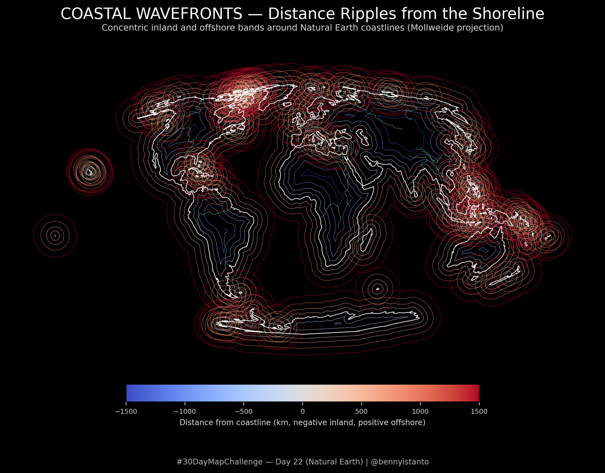

::: {.callout-note collapse="true" title="Python - Day 22, Data challenge: Natural Earth"}
```python
# Lets install additional library
!pip install cartopy

import numpy as np
import geopandas as gpd
import matplotlib.pyplot as plt

from cartopy import feature as cfeature
import matplotlib as mpl

# -------------------------------------------------------------
# Config
# -------------------------------------------------------------
MAIN_TITLE = "COASTAL WAVEFRONTS — Distance Ripples from the Shoreline"
SUBTITLE = "Concentric inland and offshore bands around Natural Earth coastlines (Mollweide projection)"
ATTRIBUTION = "#30DayMapChallenge — Day 22 (Natural Earth) | @bennyistanto"
FILENAME = "day22_natural_earth.png"

TARGET_CRS = "+proj=moll +lon_0=0 +datum=WGS84 +units=m +no_defs"

# Distances from coastline in kilometres (negative = inland, positive = ocean)
DISTANCES_KM = [-1500, -1000, -600, -300, 0, 300, 600, 1000, 1500]


# -------------------------------------------------------------
# 1. Load Natural Earth layers via cartopy.feature
# -------------------------------------------------------------
def load_land():
    """Land polygons from cartopy.feature.LAND, projected to TARGET_CRS."""
    ne_land = cfeature.LAND
    geoms = list(ne_land.geometries())
    land = gpd.GeoDataFrame(
        {"id": range(len(geoms))},
        geometry=gpd.GeoSeries(geoms, crs="EPSG:4326"),
    ).to_crs(TARGET_CRS)

    # light fix
    land["geometry"] = land.buffer(0)
    return land


def load_ocean():
    """Ocean polygons from cartopy.feature.OCEAN, projected to TARGET_CRS."""
    ne_ocean = cfeature.OCEAN
    geoms = list(ne_ocean.geometries())
    ocean = gpd.GeoDataFrame(
        {"id": range(len(geoms))},
        geometry=gpd.GeoSeries(geoms, crs="EPSG:4326"),
    ).to_crs(TARGET_CRS)
    ocean["geometry"] = ocean.buffer(0)
    return ocean


def load_rivers():
    """River lines from cartopy.feature.RIVERS, projected to TARGET_CRS."""
    ne_rivers = cfeature.RIVERS
    geoms = list(ne_rivers.geometries())
    rivers = gpd.GeoDataFrame(
        {"id": range(len(geoms))},
        geometry=gpd.GeoSeries(geoms, crs="EPSG:4326"),
    ).to_crs(TARGET_CRS)
    rivers = rivers[~rivers.geometry.is_empty].copy()
    return rivers


# -------------------------------------------------------------
# 2. Build buffer *boundaries* at multiple distances
# -------------------------------------------------------------
def build_coastal_wavefronts(land, distances_km):
    """
    For each land polygon and each distance, compute a buffer and keep only
    its boundary. Returns a GeoDataFrame with one row per boundary.
    """
    rows = []
    for d_km in distances_km:
        d_m = d_km * 1000.0
        for geom in land.geometry:
            if geom.is_empty:
                continue
            try:
                buf = geom.buffer(d_m)
            except Exception:
                continue
            if buf.is_empty:
                continue
            boundary = buf.boundary
            rows.append({"dist_km": d_km, "geometry": boundary})

    rings = gpd.GeoDataFrame(rows, crs=land.crs)
    return rings


# -------------------------------------------------------------
# 3. Plot
# -------------------------------------------------------------
def plot_coastal_wavefronts():
    land = load_land()
    ocean = load_ocean()
    rivers = load_rivers()

    rings = build_coastal_wavefronts(land, DISTANCES_KM)

    fig, ax = plt.subplots(figsize=(14, 7), dpi=300)
    fig.patch.set_facecolor("black")
    ax.set_facecolor("black")

    # First, paint the whole world black and oceans slightly darker
    ocean.plot(
        ax=ax,
        color="black",
        edgecolor="none",
        zorder=0,
    )

    # Separate coastline (0 km) from other distances
    coast_rings = rings[rings["dist_km"] == 0]
    other_rings = rings[rings["dist_km"] != 0]

    # Diverging colormap centred at 0 km
    vmin = min(DISTANCES_KM)
    vmax = max(DISTANCES_KM)
    norm = mpl.colors.TwoSlopeNorm(vmin=vmin, vcenter=0, vmax=vmax)
    cmap = plt.get_cmap("coolwarm")

    # Non-zero distance rings (inland negative, offshore positive)
    if not other_rings.empty:
        other_rings.plot(
            ax=ax,
            column="dist_km",
            cmap=cmap,
            norm=norm,
            linewidth=0.35,
            alpha=0.8,
            zorder=1,
        )

    # True coastline ring in bright white, slightly thicker
    if not coast_rings.empty:
        coast_rings.plot(
            ax=ax,
            color="white",
            linewidth=0.7,
            alpha=0.95,
            zorder=2,
        )

    # Rivers as thin cyan threads overlaying everything
    rivers.plot(
        ax=ax,
        color="#7FFFD4",  # aquamarine
        linewidth=0.25,
        alpha=0.9,
        zorder=3,
    )

    # Land outlines for subtle context
    land.plot(
        ax=ax,
        facecolor="none",
        edgecolor=(1, 1, 1, 0.2),
        linewidth=0.25,
        zorder=4,
    )

    ax.set_aspect("equal", "box")
    ax.set_xticks([])
    ax.set_yticks([])
    for spine in ax.spines.values():
        spine.set_visible(False)

    # Titles & attribution
    fig.text(
        0.5,
        0.965,
        MAIN_TITLE,
        ha="center",
        va="top",
        fontsize=16,
        color="white",
    )
    fig.text(
        0.5,
        0.93,
        SUBTITLE,
        ha="center",
        va="top",
        fontsize=9,
        color="0.85",
    )
    fig.text(
        0.5,
        0.02,
        ATTRIBUTION,
        ha="center",
        va="bottom",
        fontsize=8,
        color="0.7",
    )

    # Colorbar for distance bands
    sm = mpl.cm.ScalarMappable(norm=norm, cmap=cmap)
    sm.set_array([])

    cbar = fig.colorbar(
        sm,
        ax=ax,
        orientation="horizontal",
        fraction=0.05,
        pad=0.04,
    )
    cbar.set_label(
        "Distance from coastline (km, negative inland, positive offshore)",
        color="0.85",
        fontsize=8,
    )
    cbar.ax.tick_params(colors="0.8", labelsize=7)

    plt.tight_layout(rect=[0.02, 0.08, 0.98, 0.9])
    plt.savefig(
        FILENAME,
        dpi=400,
        facecolor=fig.get_facecolor(),
        bbox_inches="tight",
    )
    plt.show()


# -------------------------------------------------------------
# Run
# -------------------------------------------------------------
if __name__ == "__main__":
    plot_coastal_wavefronts()
```
:::

### Day 23 - Process
The same coastal wavefronts taken apart, to show how the distance map was built.

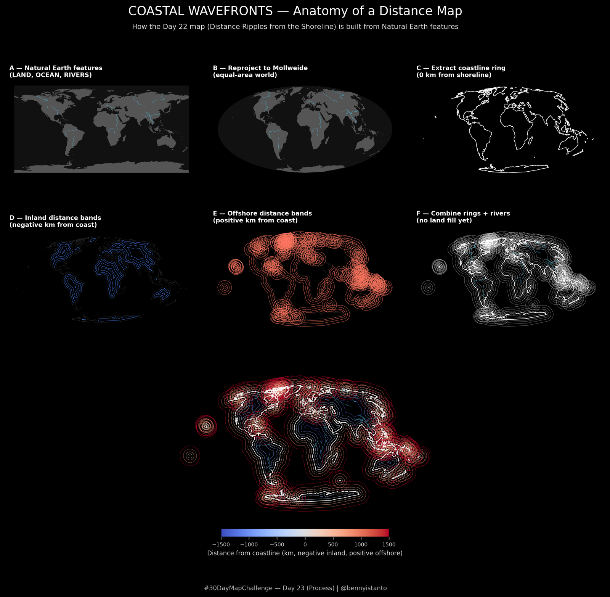

::: {.callout-note collapse="true" title="Python - Day 23, Process"}
```python
# Lets install additional library
!pip install cartopy

import numpy as np
import geopandas as gpd
import matplotlib.pyplot as plt
import matplotlib as mpl

from cartopy import feature as cfeature
from matplotlib.gridspec import GridSpec

# -------------------------------------------------------------
# Config
# -------------------------------------------------------------
MAIN_TITLE = "COASTAL WAVEFRONTS — Anatomy of a Distance Map"
SUBTITLE = "How the Day 22 map (Distance Ripples from the Shoreline) is built from Natural Earth features"
ATTRIBUTION = "#30DayMapChallenge — Day 23 (Process) | @bennyistanto"
FILENAME = "day23_process_coastal_wavefronts.png"

TARGET_CRS = "+proj=moll +lon_0=0 +datum=WGS84 +units=m +no_defs"

# Distances from coastline in km (negative = inland, positive = offshore)
DISTANCES_KM = [-1500, -1000, -600, -300, 0, 300, 600, 1000, 1500]


# -------------------------------------------------------------
# 1. Load Natural Earth base layers via cartopy.feature
# -------------------------------------------------------------
def load_base_layers():
    """
    Load Natural Earth LAND, OCEAN, and RIVERS via cartopy.feature.

    Returns:
        land_ll, ocean_ll, rivers_ll : GeoDataFrames in EPSG:4326
        land, ocean, rivers          : same, reprojected to TARGET_CRS
    """
    # LAND
    ne_land = cfeature.LAND
    land_geoms = list(ne_land.geometries())
    land_ll = gpd.GeoDataFrame(
        {"id": range(len(land_geoms))},
        geometry=gpd.GeoSeries(land_geoms, crs="EPSG:4326"),
    )

    # OCEAN
    ne_ocean = cfeature.OCEAN
    ocean_geoms = list(ne_ocean.geometries())
    ocean_ll = gpd.GeoDataFrame(
        {"id": range(len(ocean_geoms))},
        geometry=gpd.GeoSeries(ocean_geoms, crs="EPSG:4326"),
    )

    # RIVERS
    ne_rivers = cfeature.RIVERS
    river_geoms = list(ne_rivers.geometries())
    rivers_ll = gpd.GeoDataFrame(
        {"id": range(len(river_geoms))},
        geometry=gpd.GeoSeries(river_geoms, crs="EPSG:4326"),
    )

    # Project to Mollweide
    land = land_ll.to_crs(TARGET_CRS)
    ocean = ocean_ll.to_crs(TARGET_CRS)
    rivers = rivers_ll.to_crs(TARGET_CRS)

    # Light geometry fix
    land["geometry"] = land.buffer(0)
    ocean["geometry"] = ocean.buffer(0)

    return land_ll, ocean_ll, rivers_ll, land, ocean, rivers


# -------------------------------------------------------------
# 2. Build buffer boundaries ("wavefronts") at each distance
# -------------------------------------------------------------
def build_coastal_rings(land, distances_km):
    """
    For each land polygon and each distance, compute a buffer and keep only
    its boundary. Returns GeoDataFrame with columns:
      - dist_km  : distance from coastline (km)
      - geometry : boundary LineString/MultiLineString
    """
    rows = []
    for d_km in distances_km:
        d_m = d_km * 1000.0
        for geom in land.geometry:
            if geom.is_empty:
                continue
            try:
                buf = geom.buffer(d_m)
            except Exception:
                continue
            if buf.is_empty:
                continue
            rows.append({"dist_km": d_km, "geometry": buf.boundary})

    rings = gpd.GeoDataFrame(rows, crs=land.crs)
    return rings


# -------------------------------------------------------------
# 3. Helper styling
# -------------------------------------------------------------
def style_small_ax(ax, label):
    """Hide axes and add a small panel label slightly ABOVE the map."""
    ax.set_aspect("equal", "box")
    ax.set_xticks([])
    ax.set_yticks([])
    for spine in ax.spines.values():
        spine.set_visible(False)
    # y > 1.0 puts the label in the subplot margin instead of on top of data
    ax.text(
        0.02,
        1.03,
        label,
        transform=ax.transAxes,
        ha="left",
        va="bottom",
        color="white",
        fontsize=8,
        fontweight="bold",
    )


# -------------------------------------------------------------
# 4. Main plotting routine
# -------------------------------------------------------------
def plot_process_wavefronts():
    land_ll, ocean_ll, rivers_ll, land, ocean, rivers = load_base_layers()
    rings = build_coastal_rings(land, DISTANCES_KM)

    # Split rings
    coast_rings = rings[rings["dist_km"] == 0]
    inland_rings = rings[rings["dist_km"] < 0]
    offshore_rings = rings[rings["dist_km"] > 0]

    # Colour normalisation for distances (for final panel)
    vmin = min(DISTANCES_KM)
    vmax = max(DISTANCES_KM)
    norm = mpl.colors.TwoSlopeNorm(vmin=vmin, vcenter=0, vmax=vmax)
    cmap = plt.get_cmap("coolwarm")

    fig = plt.figure(figsize=(14, 11), dpi=300)
    fig.patch.set_facecolor("black")

    gs = GridSpec(
        3, 3,
        height_ratios=[1, 1, 1.4],
        hspace=0.22,      # more vertical gap so labels can sit above maps
        wspace=0.06,
        figure=fig,
    )

    # ---------------------------------------------------------
    # Panel A: Raw Natural Earth (Plate Carrée, EPSG:4326)
    # ---------------------------------------------------------
    ax_a = fig.add_subplot(gs[0, 0])
    ax_a.set_facecolor("black")
    ocean_ll.plot(ax=ax_a, color="#111111", edgecolor="none")
    land_ll.plot(ax=ax_a, color="#555555", edgecolor="#222222", linewidth=0.2)
    rivers_ll.plot(ax=ax_a, color="#4BD5FF", linewidth=0.25, alpha=0.8)
    style_small_ax(ax_a, "A — Natural Earth features\n(LAND, OCEAN, RIVERS)")

    # ---------------------------------------------------------
    # Panel B: Reprojected to Mollweide
    # ---------------------------------------------------------
    ax_b = fig.add_subplot(gs[0, 1])
    ax_b.set_facecolor("black")
    ocean.plot(ax=ax_b, color="#111111", edgecolor="none")
    land.plot(ax=ax_b, color="#555555", edgecolor="#222222", linewidth=0.2)
    rivers.plot(ax=ax_b, color="#4BD5FF", linewidth=0.25, alpha=0.8)
    style_small_ax(ax_b, "B — Reproject to Mollweide\n(equal-area world)")

    # ---------------------------------------------------------
    # Panel C: Coastline ring (0 km buffer)
    # ---------------------------------------------------------
    ax_c = fig.add_subplot(gs[0, 2])
    ax_c.set_facecolor("black")
    ocean.plot(ax=ax_c, color="black", edgecolor="none")
    land.plot(ax=ax_c, facecolor="none", edgecolor="#333333", linewidth=0.2)
    if not coast_rings.empty:
        coast_rings.plot(
            ax=ax_c,
            color="white",
            linewidth=0.7,
            alpha=0.95,
        )
    style_small_ax(ax_c, "C — Extract coastline ring\n(0 km from shoreline)")

    # ---------------------------------------------------------
    # Panel D: Inland bands (negative distances)
    # ---------------------------------------------------------
    ax_d = fig.add_subplot(gs[1, 0])
    ax_d.set_facecolor("black")
    ocean.plot(ax=ax_d, color="black", edgecolor="none")
    if not inland_rings.empty:
        inland_rings.plot(
            ax=ax_d,
            color="#4E88FF",
            linewidth=0.35,
            alpha=0.9,
        )
    land.plot(ax=ax_d, facecolor="none", edgecolor="#333333", linewidth=0.2)
    style_small_ax(ax_d, "D — Inland distance bands\n(negative km from coast)")

    # ---------------------------------------------------------
    # Panel E: Offshore bands (positive distances)
    # ---------------------------------------------------------
    ax_e = fig.add_subplot(gs[1, 1])
    ax_e.set_facecolor("black")
    ocean.plot(ax=ax_e, color="black", edgecolor="none")
    if not offshore_rings.empty:
        offshore_rings.plot(
            ax=ax_e,
            color="#FF7660",
            linewidth=0.35,
            alpha=0.9,
        )
    land.plot(ax=ax_e, facecolor="none", edgecolor="#333333", linewidth=0.2)
    style_small_ax(ax_e, "E — Offshore distance bands\n(positive km from coast)")

    # ---------------------------------------------------------
    # Panel F: Rings + rivers (no land fill)
    # ---------------------------------------------------------
    ax_f = fig.add_subplot(gs[1, 2])
    ax_f.set_facecolor("black")
    rings[rings["dist_km"] != 0].plot(
        ax=ax_f,
        color="#CCCCCC",
        linewidth=0.3,
        alpha=0.7,
    )
    if not coast_rings.empty:
        coast_rings.plot(ax=ax_f, color="white", linewidth=0.7, alpha=0.95)
    rivers.plot(ax=ax_f, color="#4BD5FF", linewidth=0.25, alpha=0.9)
    land.plot(ax=ax_f, facecolor="none", edgecolor="#333333", linewidth=0.2)
    style_small_ax(ax_f, "F — Combine rings + rivers\n(no land fill yet)")

    # ---------------------------------------------------------
    # Bottom: Final Day 22 map (full Coastal Wavefronts)
    # ---------------------------------------------------------
    ax_final = fig.add_subplot(gs[2, :])
    ax_final.set_facecolor("black")

    # Fill oceans black first
    ocean.plot(ax=ax_final, color="black", edgecolor="none", zorder=0)

    # All rings with distance-based colouring
    if not rings.empty:
        rings_nonzero = rings[rings["dist_km"] != 0]
        if not rings_nonzero.empty:
            rings_nonzero.plot(
                ax=ax_final,
                column="dist_km",
                cmap=cmap,
                norm=norm,
                linewidth=0.35,
                alpha=0.8,
                zorder=1,
            )
        if not coast_rings.empty:
            coast_rings.plot(
                ax=ax_final,
                color="white",
                linewidth=0.7,
                alpha=0.95,
                zorder=2,
            )

    # Rivers and land outlines
    rivers.plot(
        ax=ax_final,
        color="#4BD5FF",
        linewidth=0.25,
        alpha=0.9,
        zorder=3,
    )
    land.plot(
        ax=ax_final,
        facecolor="none",
        edgecolor=(1, 1, 1, 0.25),
        linewidth=0.25,
        zorder=4,
    )

    ax_final.set_aspect("equal", "box")
    ax_final.set_xticks([])
    ax_final.set_yticks([])
    for spine in ax_final.spines.values():
        spine.set_visible(False)

    # Titles & attribution for whole figure
    fig.text(
        0.5,
        0.985,
        MAIN_TITLE,
        ha="center",
        va="top",
        fontsize=16,
        color="white",
    )
    fig.text(
        0.5,
        0.955,
        SUBTITLE,
        ha="center",
        va="top",
        fontsize=9,
        color="0.85",
    )
    fig.text(
        0.5,
        0.02,
        ATTRIBUTION,
        ha="center",
        va="bottom",
        fontsize=8,
        color="0.7",
    )

    # Colorbar for final panel
    sm = mpl.cm.ScalarMappable(norm=norm, cmap=cmap)
    sm.set_array([])

    cbar = fig.colorbar(
        sm,
        ax=ax_final,
        orientation="horizontal",
        fraction=0.05,
        pad=0.06,
    )
    cbar.set_label(
        "Distance from coastline (km, negative inland, positive offshore)",
        color="0.85",
        fontsize=8,
    )
    cbar.ax.tick_params(colors="0.8", labelsize=7)

    plt.tight_layout(rect=[0.02, 0.06, 0.98, 0.93])
    plt.savefig(
        FILENAME,
        dpi=400,
        facecolor=fig.get_facecolor(),
        bbox_inches="tight",
    )
    plt.show()


# -------------------------------------------------------------
# Run
# -------------------------------------------------------------
if __name__ == "__main__":
    plot_process_wavefronts()
```
:::

### Day 24 - Places and their names
Phonetic drift. Cities pulled out of position by the sound of their names.

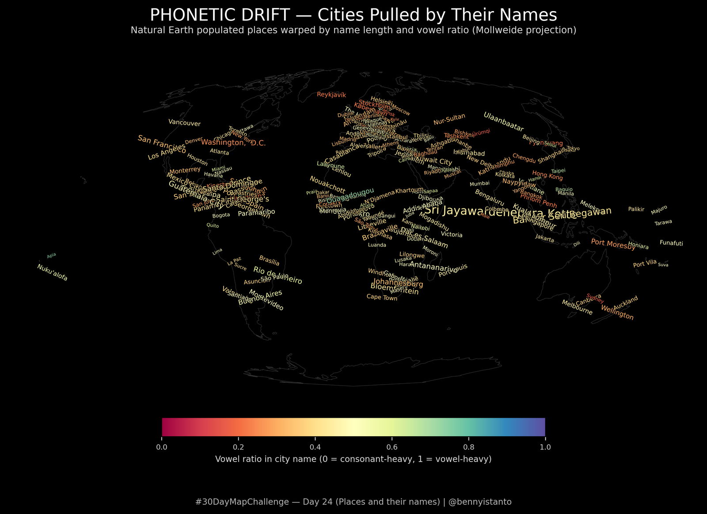

::: {.callout-note collapse="true" title="Python - Day 24, Places and their names"}
```python
# Lets install additional library
!pip install cartopy

import numpy as np
import geopandas as gpd
import matplotlib.pyplot as plt
import matplotlib as mpl
import matplotlib.patheffects as pe

from cartopy import feature as cfeature
from cartopy.io import shapereader as shpreader

# -------------------------------------------------------------
# Config
# -------------------------------------------------------------
MAIN_TITLE = "PHONETIC DRIFT — Cities Pulled by Their Names"
SUBTITLE = "Natural Earth populated places warped by name length and vowel ratio (Mollweide projection)"
ATTRIBUTION = "#30DayMapChallenge — Day 24 (Places and their names) | @bennyistanto"
FILENAME = "day24_places.png"

TARGET_CRS = "+proj=moll +lon_0=0 +datum=WGS84 +units=m +no_defs"

MAX_SHIFT_KM = 300.0   # maximum shift distance for the longest names
MIN_FONT = 4
MAX_FONT = 11


# -------------------------------------------------------------
# 1. Load base world (for faint context)
# -------------------------------------------------------------
def load_land():
    """Use Natural Earth LAND (via cartopy.feature) and project to TARGET_CRS."""
    ne_land = cfeature.LAND
    geoms = list(ne_land.geometries())
    land = gpd.GeoDataFrame(
        {"id": range(len(geoms))},
        geometry=gpd.GeoSeries(geoms, crs="EPSG:4326"),
    ).to_crs(TARGET_CRS)

    land["geometry"] = land.buffer(0)
    return land


# -------------------------------------------------------------
# 2. Load populated places with names
# -------------------------------------------------------------
def load_cities():
    """
    Load Natural Earth populated places using shapereader.
    We only need geometry + name fields.
    """
    shp_path = shpreader.natural_earth(
        resolution="110m",
        category="cultural",
        name="populated_places",
    )
    cities = gpd.read_file(shp_path)

    # Make sure we have some name column
    name_col = None
    for cand in ["NAME", "NAMEASCII", "name", "nameascii"]:
        if cand in cities.columns:
            name_col = cand
            break

    if name_col is None:
        raise ValueError(
            f"No name column found in populated_places. Available columns: {cities.columns}"
        )

    cities = cities[["geometry", name_col]].copy()
    cities = cities.rename(columns={name_col: "name"})

    # Drop rows without geometry or name
    cities = cities[~cities.geometry.is_empty & cities["name"].notna()].copy()

    # Project to target CRS
    cities = cities.to_crs(TARGET_CRS)

    return cities


# -------------------------------------------------------------
# 3. Compute name-based metrics
# -------------------------------------------------------------
def compute_name_metrics(name: str):
    """
    Given a place name, compute:
      - length
      - vowel_ratio = (num vowels / total letters)
      - angle (radians) derived from characters
    """
    if not isinstance(name, str):
        name = str(name)

    # Basic cleaned version
    s = name.strip()
    if not s:
        return 0, 0.0, 0.0

    letters = [ch.lower() for ch in s if ch.isalpha()]
    if not letters:
        return len(s), 0.0, 0.0

    L = len(letters)
    vowels = set("aeiou")
    n_vowels = sum(1 for ch in letters if ch in vowels)
    vowel_ratio = n_vowels / L

    # Simple hash-like angle: sum of char codes, mod 360
    code_sum = sum(ord(ch) for ch in letters)
    angle_deg = (code_sum % 360)
    angle_rad = np.deg2rad(angle_deg)

    return L, vowel_ratio, angle_rad


def add_phonetic_drift(cities):
    """
    For each city, compute:
      - name_length
      - vowel_ratio
      - drift direction (angle)
      - shifted coordinates (x_shift, y_shift)
      - font size
      - rotation angle
    """
    name_lengths = []
    vowel_ratios = []
    angles = []

    for name in cities["name"]:
        L, vr, ang = compute_name_metrics(name)
        name_lengths.append(L)
        vowel_ratios.append(vr)
        angles.append(ang)

    cities["name_length"] = name_lengths
    cities["vowel_ratio"] = vowel_ratios
    cities["angle_rad"] = angles

    # Compute shift magnitude based on name length
    L_arr = np.array(name_lengths, dtype=float)
    L_valid = L_arr[L_arr > 0]
    L_min = L_valid.min() if len(L_valid) else 1
    L_max = L_valid.max() if len(L_valid) else 1

    # Normalise length to [0,1]
    L_norm = (L_arr - L_min) / (L_max - L_min + 1e-9)
    # Shift in km
    shift_km = MAX_SHIFT_KM * L_norm
    shift_m = shift_km * 1000.0

    cities["shift_m"] = shift_m

    # Compute shifted coordinates
    xs = cities.geometry.x.values
    ys = cities.geometry.y.values

    dx = shift_m * np.cos(cities["angle_rad"].values)
    dy = shift_m * np.sin(cities["angle_rad"].values)

    cities["x_shift"] = xs + dx
    cities["y_shift"] = ys + dy

    # Font size scaling: longer names → slightly larger
    font_sizes = MIN_FONT + (MAX_FONT - MIN_FONT) * L_norm
    cities["font_size"] = font_sizes

    # Rotation from angle (for visual variety, keep modest tilt)
    rotations = (np.rad2deg(cities["angle_rad"].values) % 60) - 30  # -30..+30°
    cities["rotation"] = rotations

    return cities


# -------------------------------------------------------------
# 4. Plot
# -------------------------------------------------------------
def plot_phonetic_drift():
    land = load_land()
    cities = load_cities()
    cities = add_phonetic_drift(cities)

    fig, ax = plt.subplots(figsize=(14, 7), dpi=300)
    fig.patch.set_facecolor("black")
    ax.set_facecolor("black")

    # Faint land outlines for context
    land.plot(
        ax=ax,
        facecolor="none",
        edgecolor=(1, 1, 1, 0.25),
        linewidth=0.3,
        zorder=1,
    )

    # Colour by vowel_ratio
    vr = cities["vowel_ratio"].values
    cmap = plt.get_cmap("Spectral")
    norm = mpl.colors.Normalize(vmin=0.0, vmax=1.0)
    # cmap = plt.get_cmap("turbo")
    # norm = mpl.colors.PowerNorm(gamma=0.7, vmin=0.0, vmax=1.0)

    # Text path effect (soft halo) for readability
    text_effects = [
        pe.withStroke(linewidth=1.0, foreground="black", alpha=0.8)
    ]

    # Plot each name as a label at the shifted coordinates
    for _, row in cities.iterrows():
        x = row["x_shift"]
        y = row["y_shift"]
        name = row["name"]
        size = row["font_size"]
        rotation = row["rotation"]
        color = cmap(norm(row["vowel_ratio"]))

        ax.text(
            x,
            y,
            name,
            fontsize=size,
            color=color,
            ha="center",
            va="center",
            rotation=rotation,
            rotation_mode="anchor",
            zorder=3,
            path_effects=text_effects,
        )

    ax.set_aspect("equal", "box")
    ax.set_xticks([])
    ax.set_yticks([])
    for spine in ax.spines.values():
        spine.set_visible(False)

    # Titles & attribution
    fig.text(
        0.5,
        0.965,
        MAIN_TITLE,
        ha="center",
        va="top",
        fontsize=16,
        color="white",
    )
    fig.text(
        0.5,
        0.93,
        SUBTITLE,
        ha="center",
        va="top",
        fontsize=9,
        color="0.85",
    )
    fig.text(
        0.5,
        0.02,
        ATTRIBUTION,
        ha="center",
        va="bottom",
        fontsize=8,
        color="0.7",
    )

    # Colorbar for vowel ratio
    sm = mpl.cm.ScalarMappable(norm=norm, cmap=cmap)
    sm.set_array([])
    cbar = fig.colorbar(
        sm,
        ax=ax,
        orientation="horizontal",
        fraction=0.05,
        pad=0.04,
    )
    cbar.set_label(
        "Vowel ratio in city name (0 = consonant-heavy, 1 = vowel-heavy)",
        color="0.85",
        fontsize=8,
    )
    cbar.ax.tick_params(colors="0.8", labelsize=7)

    plt.tight_layout(rect=[0.02, 0.08, 0.98, 0.9])
    plt.savefig(
        FILENAME,
        dpi=400,
        facecolor=fig.get_facecolor(),
        bbox_inches="tight",
    )
    plt.show()


# -------------------------------------------------------------
# Run
# -------------------------------------------------------------
if __name__ == "__main__":
    plot_phonetic_drift()
```
:::

### Day 25 - Hexagons
Hex stormfields. Tropical cyclone intensity binned into a global hexagonal grid.

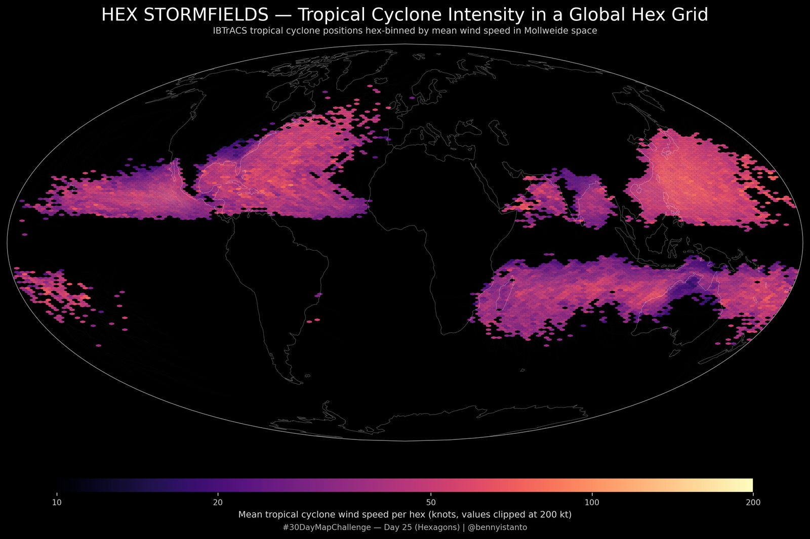

::: {.callout-note collapse="true" title="Python - Day 25, Hexagons"}
```python
# Lets install additional library
!pip install cartopy

import numpy as np
import pandas as pd
import matplotlib.pyplot as plt

import cartopy.crs as ccrs
import cartopy.feature as cfeature


# -------------------------------------------------------------------
# Config
# -------------------------------------------------------------------
MAIN_TITLE = "HEX STORMFIELDS — Tropical Cyclone Intensity in a Global Hex Grid"
SUBTITLE = "IBTrACS tropical cyclone positions hex-binned by mean wind speed in Mollweide space"
ATTRIBUTION = "#30DayMapChallenge — Day 25 (Hexagons) | @bennyistanto"
FILENAME = "day25_hexagons.png"

DATA_URL = (
    "https://www.ncei.noaa.gov/data/"
    "international-best-track-archive-for-climate-stewardship-ibtracs/"
    "v04r01/access/csv/ibtracs.ALL.list.v04r01.csv"
)

START_YEAR = 1980   # you can tweak this
GRID_SIZE = 150     # hexbin resolution
MIN_COUNT = 5       # minimum points per hex to be drawn


# -------------------------------------------------------------------
# 1. Load & prepare IBTrACS
# -------------------------------------------------------------------
def load_ibtracs(url=DATA_URL, start_year=START_YEAR):
    # The ALL CSV is big; we keep only a few columns.
    usecols = ["SID", "SEASON", "LAT", "LON", "WMO_WIND"]
    df = pd.read_csv(url, usecols=usecols, low_memory=False)

    # Clean types
    df["SEASON"] = pd.to_numeric(df["SEASON"], errors="coerce")
    df["LAT"] = pd.to_numeric(df["LAT"], errors="coerce")
    df["LON"] = pd.to_numeric(df["LON"], errors="coerce")
    df["WMO_WIND"] = pd.to_numeric(df["WMO_WIND"], errors="coerce")

    # Filter years + valid coords
    m = (
        df["SEASON"].notna()
        & (df["SEASON"] >= start_year)
        & df["LAT"].between(-90, 90)
        & df["LON"].between(-180, 180)
        & df["WMO_WIND"].notna()
        & (df["WMO_WIND"] > 0)
    )
    df = df.loc[m].copy()
    return df


# -------------------------------------------------------------------
# 2. Project coordinates to Mollweide
# -------------------------------------------------------------------
def project_points(lon, lat, src_crs=ccrs.PlateCarree()):
    proj = ccrs.Mollweide(central_longitude=0)
    xy = proj.transform_points(src_crs, lon.values, lat.values)
    x = xy[:, 0]
    y = xy[:, 1]
    return x, y, proj


# -------------------------------------------------------------------
# 3. Plot hex storm fields
# -------------------------------------------------------------------
def plot_hex_stormfields():
    df = load_ibtracs()
    lon = df["LON"]
    lat = df["LAT"]
    wind = df["WMO_WIND"]  # knots

    x, y, proj = project_points(lon, lat)
    log_wind = np.log10(wind)

    fig = plt.figure(figsize=(14, 8), dpi=300)
    proj_axes = proj
    ax = plt.axes(projection=proj_axes)

    fig.patch.set_facecolor("black")
    ax.set_facecolor("black")
    ax.set_global()

    ax.add_feature(
        cfeature.COASTLINE,
        edgecolor=(1, 1, 1, 0.35),
        linewidth=0.4,
        zorder=2,
    )

    # ---------------------------------------------------------
    # FIXED: explicit colour limits & consistent ticks
    # ---------------------------------------------------------
    # use 10–200 kt as a realistic range
    vmin = np.log10(10.0)
    vmax = np.log10(200.0)

    hb = ax.hexbin(
        x,
        y,
        C=log_wind.values,
        gridsize=GRID_SIZE,
        reduce_C_function=np.nanmean,
        mincnt=MIN_COUNT,
        cmap="magma",
        vmin=vmin,
        vmax=vmax,
        linewidths=0.0,
        zorder=1,
    )
    # ---------------------------------------------------------

    # optional faint tracks
    for sid, grp in df.groupby("SID"):
        xs, ys, _ = project_points(grp["LON"], grp["LAT"])
        ax.plot(
            xs,
            ys,
            color=(1, 1, 1, 0.03),
            linewidth=0.2,
            transform=proj_axes,
            zorder=3,
        )

    if "geo" in ax.spines:
        ax.spines["geo"].set_edgecolor("0.6")
        ax.spines["geo"].set_linewidth(0.6)

    ax.set_xticks([])
    ax.set_yticks([])

    # Layout: leave room at bottom
    plt.subplots_adjust(left=0.02, right=0.98, top=0.9, bottom=0.2)

    # ----------------- COLORBAR BLOCK (also updated) -----------------
    cax = fig.add_axes([0.15, 0.11, 0.7, 0.025])
    cbar = fig.colorbar(hb, cax=cax, orientation="horizontal")

    # nice tick values in knots
    tick_vals = np.array([10, 20, 50, 100, 200])
    tick_logs = np.log10(tick_vals)
    cbar.set_ticks(tick_logs)
    cbar.set_ticklabels([f"{v:.0f}" for v in tick_vals])

    cbar.set_label(
        "Mean tropical cyclone wind speed per hex (knots, values clipped at 200 kt)",
        color="0.85",
        fontsize=9,
    )
    cbar.ax.tick_params(colors="0.8", labelsize=8)
    # ----------------------------------------------------------------

    fig.text(
        0.5,
        0.965,
        MAIN_TITLE,
        ha="center",
        va="top",
        fontsize=18,
        color="white",
    )
    fig.text(
        0.5,
        0.93,
        SUBTITLE,
        ha="center",
        va="top",
        fontsize=9,
        color="0.8",
    )
    fig.text(
        0.5,
        0.04,
        ATTRIBUTION,
        ha="center",
        va="bottom",
        fontsize=8,
        color="0.7",
    )

    plt.savefig(
        FILENAME,
        dpi=400,
        facecolor=fig.get_facecolor(),
        bbox_inches="tight",
    )
    plt.show()


# -------------------------------------------------------------------
# Run
# -------------------------------------------------------------------
if __name__ == "__main__":
    plot_hex_stormfields()
```
:::

### Day 26 - Transport
Flight rose of Nusantara. Indonesia's domestic air network.

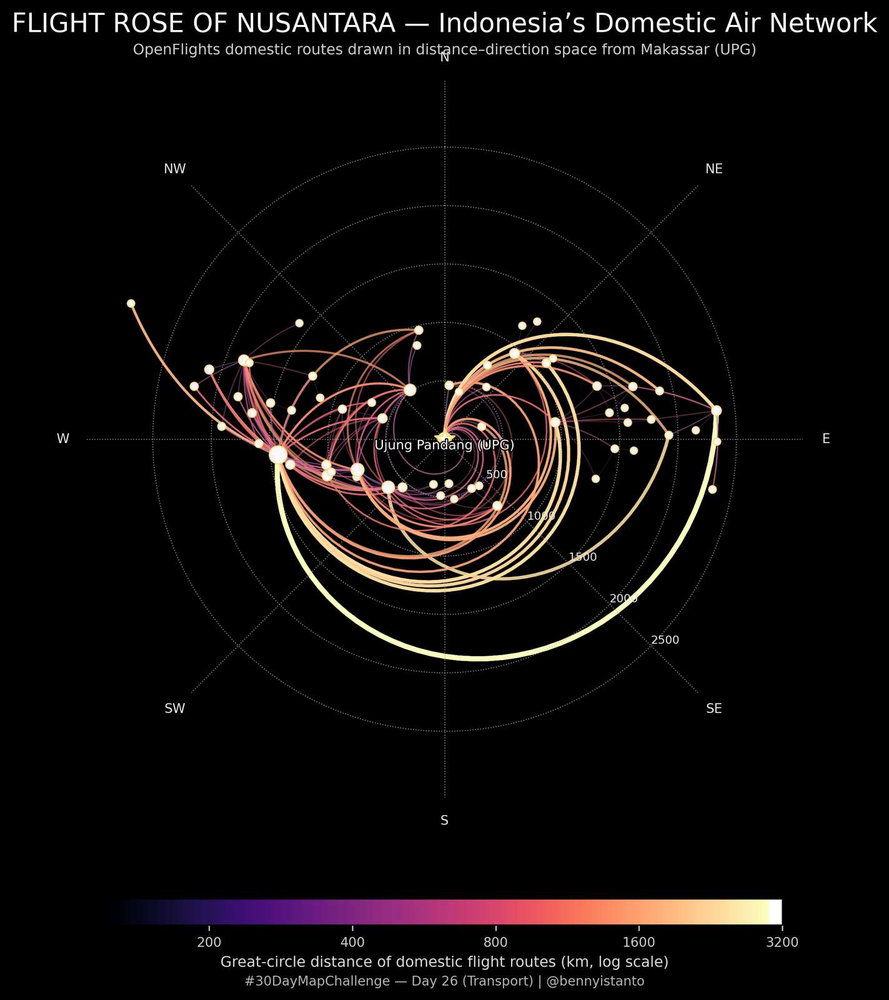

::: {.callout-note collapse="true" title="Python - Day 26, Transport"}
```python
import numpy as np
import pandas as pd
import matplotlib.pyplot as plt
import matplotlib.colors as mcolors
import matplotlib.patheffects as pe

# -------------------------------------------------------------------
# Config
# -------------------------------------------------------------------
MAIN_TITLE = "FLIGHT ROSE OF NUSANTARA — Indonesia’s Domestic Air Network"
SUBTITLE = "OpenFlights domestic routes drawn in distance–direction space from Makassar (UPG)"
ATTRIBUTION = "#30DayMapChallenge — Day 26 (Transport) | @bennyistanto"
FILENAME = "day26_transport_flightrose.png"

AIRPORTS_URL = "https://raw.githubusercontent.com/jpatokal/openflights/master/data/airports.dat"
ROUTES_URL   = "https://raw.githubusercontent.com/jpatokal/openflights/master/data/routes.dat"

REF_IATA = "UPG"  # reference hub for the flight rose (Makassar)


# -------------------------------------------------------------------
# Great-circle distance and bearing
# -------------------------------------------------------------------
def haversine_km(lon1, lat1, lon2, lat2):
    """Great-circle distance in km between points (lon, lat) in degrees."""
    R = 6371.0
    lon1, lat1, lon2, lat2 = map(np.radians, [lon1, lat1, lon2, lat2])
    dlon = lon2 - lon1
    dlat = lat2 - lat1
    a = np.sin(dlat / 2.0) ** 2 + np.cos(lat1) * np.cos(lat2) * np.sin(dlon / 2.0) ** 2
    c = 2 * np.arcsin(np.sqrt(a))
    return R * c


def initial_bearing_deg(lon1, lat1, lon2, lat2):
    """Initial bearing (forward azimuth) in degrees from point 1 to point 2."""
    lon1, lat1, lon2, lat2 = map(np.radians, [lon1, lat1, lon2, lat2])
    dlon = lon2 - lon1
    y = np.sin(dlon) * np.cos(lat2)
    x = np.cos(lat1) * np.sin(lat2) - np.sin(lat1) * np.cos(lat2) * np.cos(dlon)
    brng = np.degrees(np.arctan2(y, x))
    return (brng + 360.0) % 360.0


# -------------------------------------------------------------------
# Load OpenFlights airports & routes, restrict to Indonesia, build network
# -------------------------------------------------------------------
def load_indonesia_network(ref_iata=REF_IATA):
    # Airports columns (from OpenFlights docs)
    cols_airports = [
        "AirportID", "Name", "City", "Country",
        "IATA", "ICAO", "Lat", "Lon", "Alt",
        "Timezone", "DST", "TzDatabaseTimeZone",
        "Type", "Source"
    ]
    airports = pd.read_csv(
        AIRPORTS_URL,
        header=None,
        names=cols_airports,
        na_values="\\N",
        low_memory=False,
    )

    # Keep only Indonesian airports with valid IATA & coords
    mask_id = (
        (airports["Country"] == "Indonesia")
        & airports["IATA"].notna()
        & airports["Lat"].notna()
        & airports["Lon"].notna()
    )
    airports_id = airports.loc[mask_id].copy()

    # Routes columns
    cols_routes = [
        "Airline", "AirlineID",
        "SourceIATA", "SourceAirportID",
        "DestIATA", "DestAirportID",
        "Codeshare", "Stops", "Equipment"
    ]
    routes = pd.read_csv(
        ROUTES_URL,
        header=None,
        names=cols_routes,
        na_values="\\N",
        low_memory=False,
    )

    # Only routes where both endpoints are Indonesian airports
    valid_iata = set(airports_id["IATA"])
    mask_routes = routes["SourceIATA"].isin(valid_iata) & routes["DestIATA"].isin(valid_iata)
    routes_id = routes.loc[mask_routes].copy()

    # Join coordinates for each endpoint
    a_lookup = airports_id.set_index("IATA")

    routes_id = routes_id.join(
        a_lookup[["Lat", "Lon"]],
        on="SourceIATA",
        rsuffix="_src",
    )
    routes_id = routes_id.join(
        a_lookup[["Lat", "Lon"]],
        on="DestIATA",
        rsuffix="_dst",
    )

    # Rename columns
    routes_id.rename(
        columns={
            "Lat": "Lat_src",
            "Lon": "Lon_src",
            "Lat_dst": "Lat_dst",
            "Lon_dst": "Lon_dst",
        },
        inplace=True,
    )

    # Drop rows with missing coords
    routes_id = routes_id.dropna(subset=["Lat_src", "Lon_src", "Lat_dst", "Lon_dst"])

    # Great-circle length of each route
    routes_id["distance_km"] = haversine_km(
        routes_id["Lon_src"],
        routes_id["Lat_src"],
        routes_id["Lon_dst"],
        routes_id["Lat_dst"],
    )

    # Filter out unrealistic tiny/huge values
    routes_id = routes_id[
        (routes_id["distance_km"] >= 50) &
        (routes_id["distance_km"] <= 5000)
    ].copy()

    # Degree of each airport in the domestic network
    degree = pd.concat(
        [routes_id["SourceIATA"], routes_id["DestIATA"]],
        axis=0
    ).value_counts()

    airports_id = airports_id.assign(
        degree=airports_id["IATA"].map(degree).fillna(0)
    )

    # Only airports that actually appear in the network
    in_network = airports_id["IATA"].isin(degree.index)
    airports_net = airports_id.loc[in_network].copy()

    # Reference airport (CGK)
    if ref_iata not in airports_net["IATA"].values:
        raise ValueError(f"Reference airport {ref_iata} not found in Indonesian network.")

    ref_row = airports_net.loc[airports_net["IATA"] == ref_iata].iloc[0]
    lon0, lat0 = ref_row["Lon"], ref_row["Lat"]

    # Distance & bearing from reference to each airport
    airports_net["dist_from_ref_km"] = haversine_km(
        lon0, lat0,
        airports_net["Lon"].values,
        airports_net["Lat"].values,
    )
    airports_net["bearing_deg"] = initial_bearing_deg(
        lon0, lat0,
        airports_net["Lon"].values,
        airports_net["Lat"].values,
    )

    # Polar plotting radius = distance in thousands of km
    airports_net["r_thousand_km"] = airports_net["dist_from_ref_km"] / 1000.0

    return airports_net, routes_id, ref_row


# -------------------------------------------------------------------
# Plot: Flight Rose
# -------------------------------------------------------------------
def plot_flight_rose():
    airports, routes, ref = load_indonesia_network()

    # Build quick lookup for polar coords by IATA
    theta_lookup = {
        row["IATA"]: np.deg2rad(row["bearing_deg"])
        for _, row in airports.iterrows()
    }
    r_lookup = {
        row["IATA"]: row["r_thousand_km"]
        for _, row in airports.iterrows()
    }

    distances = routes["distance_km"].values
    dmin, dmax = distances.min(), distances.max()

    # Glowy magma colormap on black
    cmap = plt.get_cmap("magma")
    norm = mcolors.LogNorm(vmin=max(100, dmin), vmax=min(3000, dmax))

    # Make figure more square so circle fills the frame
    fig = plt.figure(figsize=(9, 9), dpi=300)
    ax = plt.subplot(111, projection="polar")

    fig.patch.set_facecolor("black")
    ax.set_facecolor("black")

    # Polar settings: 0° at north, clockwise
    ax.set_theta_zero_location("N")
    ax.set_theta_direction(-1)

    # ---------------------------------------------------------
    # Draw routes as glowing curves in polar space
    # ---------------------------------------------------------
    for _, row in routes.iterrows():
        src = row["SourceIATA"]
        dst = row["DestIATA"]

        if src not in theta_lookup or dst not in theta_lookup:
            continue

        theta1 = theta_lookup[src]
        r1 = r_lookup[src]
        theta2 = theta_lookup[dst]
        r2 = r_lookup[dst]

        t = np.linspace(0, 1, 50)
        theta = theta1 + (theta2 - theta1) * t
        r = r1 + (r2 - r1) * t

        d = row["distance_km"]
        color = cmap(norm(d))

        # Stronger contrast in linewidth
        lw = np.interp(d, [dmin, dmax], [0.15, 3.0])
        alpha = np.interp(d, [dmin, dmax], [0.2, 0.9])

        line, = ax.plot(
            theta,
            r,
            color=color,
            linewidth=lw,
            alpha=alpha,
            zorder=1,
        )

        # Much softer halo: thinner and more transparent
        line.set_path_effects([
            pe.Stroke(linewidth=lw + 0.4, foreground=(1, 1, 1, 0.05)),
            pe.Normal(),
        ])


    # ---------------------------------------------------------
    # Plot airports
    # ---------------------------------------------------------
    airports_nonzero = airports[airports["degree"] > 0].copy()
    theta_air = np.deg2rad(airports_nonzero["bearing_deg"].values)
    r_air = airports_nonzero["r_thousand_km"].values

    size = np.interp(
        airports_nonzero["degree"].values,
        [airports_nonzero["degree"].min(), airports_nonzero["degree"].max()],
        [20, 120],
    )

    ax.scatter(
        theta_air,
        r_air,
        s=size,
        c="#ffffff",
        edgecolor="#ffdf80",
        linewidth=0.7,
        alpha=0.95,
        zorder=3,
    )

    # Highlight reference airport (CGK) at center
    ax.scatter(
        [0.0],
        [0.0],
        s=160,
        c="#ffffff",
        edgecolor="#ffdf80",
        linewidth=1.1,
        alpha=1.0,
        marker="*",
        zorder=4,
    )
    ax.text(
        0.0,
        0.0,
        f"{ref['City']} ({ref['IATA']})",
        ha="center",
        va="top",
        fontsize=8,
        color="white",
        zorder=5,
        path_effects=[
            pe.Stroke(linewidth=1.4, foreground="black"),
            pe.Normal(),
        ],
    )

    # ---------------------------------------------------------
    # Grid / radial ticks
    # ---------------------------------------------------------
    r_max = airports["r_thousand_km"].max()
    ax.set_rlim(0, r_max * 1.05)

    rticks = np.arange(0.5, np.ceil(r_max), 0.5)
    ax.set_rticks(rticks)
    ax.set_yticklabels(
        [f"{int(r*1000):d}" for r in rticks],
        color="0.9",
        fontsize=7,
    )
    ax.set_rlabel_position(135)
    ax.grid(color="0.7", linestyle=":", linewidth=0.6, alpha=0.75)

    ax.set_xticks(np.deg2rad([0, 45, 90, 135, 180, 225, 270, 315]))
    ax.set_xticklabels(
        ["N", "NE", "E", "SE", "S", "SW", "W", "NW"],
        color="0.9",
        fontsize=8,
    )

    # ---------------------------------------------------------
    # Colorbar for route distance
    # ---------------------------------------------------------
    plt.subplots_adjust(left=0.07, right=0.93, top=0.9, bottom=0.22)

    sm = plt.cm.ScalarMappable(norm=norm, cmap=cmap)
    sm.set_array([])

    cax = fig.add_axes([0.18, 0.10, 0.64, 0.025])
    cbar = fig.colorbar(sm, cax=cax, orientation="horizontal")

    tick_vals = np.array([100, 200, 400, 800, 1600, 3200])
    tick_vals = tick_vals[(tick_vals >= dmin) & (tick_vals <= dmax)]
    cbar.set_ticks(tick_vals)
    cbar.set_ticklabels([f"{v:.0f}" for v in tick_vals])
    cbar.set_label(
        "Great-circle distance of domestic flight routes (km, log scale)",
        color="0.85",
        fontsize=9,
    )
    cbar.ax.tick_params(colors="0.8", labelsize=8)

    # ---------------------------------------------------------
    # Titles & attribution
    # ---------------------------------------------------------
    fig.text(
        0.5,
        0.965,
        MAIN_TITLE,
        ha="center",
        va="top",
        fontsize=16,
        color="white",
    )
    fig.text(
        0.5,
        0.935,
        SUBTITLE,
        ha="center",
        va="top",
        fontsize=9,
        color="0.8",
    )
    fig.text(
        0.5,
        0.04,
        ATTRIBUTION,
        ha="center",
        va="bottom",
        fontsize=8,
        color="0.7",
    )

    plt.savefig(
        FILENAME,
        dpi=400,
        facecolor=fig.get_facecolor(),
        bbox_inches="tight",
    )
    plt.show()


# -------------------------------------------------------------------
# Run
# -------------------------------------------------------------------
if __name__ == "__main__":
    plot_flight_rose()
```
:::

### Day 27 - Boundaries
Biofrontiers. The edges of the world's terrestrial biomes.

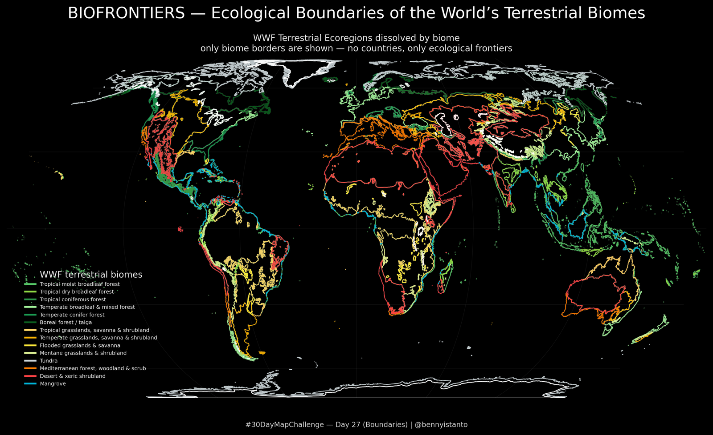

::: {.callout-note collapse="true" title="Python - Day 27, Boundaries"}
```python
# Lets install additional library
!pip install cartopy

# ============================================================
# Day 27 – Boundaries
# BIOFRONTIERS — Luminous Boundaries of the World’s Terrestrial Biomes
#
# Uses WWF "Terrestrial Ecoregions of the World" (TEOW)
# Point TEOW_PATH to your local wwf_terr_ecos.shp
# ============================================================

import geopandas as gpd
import matplotlib.pyplot as plt
import cartopy.crs as ccrs
from matplotlib.lines import Line2D

# ------------------------------------------------------------
# 0. Local path to TEOW shapefile  🔴 EDIT IF NEEDED
# ------------------------------------------------------------
# From your error log, you used:
# Reading WWF TEOW from local path: /content/wwf_terr_ecos.shp
TEOW_PATH = "/content/wwf_terr_ecos.shp"  # adjust if your path differs

# Biome code → short label (classic WWF 14-biome scheme)
BIOME_LABELS = {
    1:  "Tropical moist broadleaf forest",
    2:  "Tropical dry broadleaf forest",
    3:  "Tropical coniferous forest",
    4:  "Temperate broadleaf & mixed forest",
    5:  "Temperate conifer forest",
    6:  "Boreal forest / taiga",
    7:  "Tropical grasslands, savanna & shrubland",
    8:  "Temperate grasslands, savanna & shrubland",
    9:  "Flooded grasslands & savanna",
    10: "Montane grasslands & shrubland",
    11: "Tundra",
    12: "Mediterranean forest, woodland & scrub",
    13: "Desert & xeric shrubland",
    14: "Mangrove",
}

# Biome code → bright colour (for dark background)
BIOME_COLORS = {
    1:  "#56c667",
    2:  "#8fd744",
    3:  "#2b9348",
    4:  "#a3f39b",
    5:  "#1a9850",
    6:  "#0b5d1e",
    7:  "#ffd166",
    8:  "#ffb703",
    9:  "#ffeb3b",
    10: "#d9ed92",
    11: "#cfd8dc",
    12: "#ff7b00",
    13: "#f94144",
    14: "#00b4d8",
}


# ------------------------------------------------------------
# 1. Data: load TEOW from local path
# ------------------------------------------------------------
def load_teow():
    """
    Load WWF TEOW polygons from a local .shp path and keep only BIOME + geometry.
    """
    print("Reading WWF TEOW from local path:", TEOW_PATH)
    gdf = gpd.read_file(TEOW_PATH)

    # Ensure geographic CRS (lon/lat)
    if gdf.crs is None:
        gdf = gdf.set_crs("EPSG:4326")
    else:
        gdf = gdf.to_crs("EPSG:4326")

    if "BIOME" not in gdf.columns:
        raise ValueError("Expected 'BIOME' column in WWF TEOW shapefile.")

    teow = gdf[["BIOME", "geometry"]].copy()
    teow["BIOME"] = teow["BIOME"].astype(int)

    return teow


def dissolve_by_biome(teow):
    """
    Dissolve all ecoregions into 14 biome domains.
    """
    biomes = teow.dissolve(by="BIOME")
    biomes["BIOME"] = biomes.index.astype(int)
    return biomes


# ------------------------------------------------------------
# 2. Plotting function
# ------------------------------------------------------------
def plot_biome_boundaries():
    teow = load_teow()
    biomes = dissolve_by_biome(teow)

    # Equal Earth projection for a global, organic look
    proj = ccrs.EqualEarth()
    fig = plt.figure(figsize=(12, 7), dpi=300)
    ax = plt.axes(projection=proj)

    # Dark background
    fig.patch.set_facecolor("black")
    ax.set_facecolor("black")
    ax.set_global()

    # Some cartopy versions don't expose outline_patch – guard it
    if hasattr(ax, "outline_patch") and ax.outline_patch is not None:
        ax.outline_patch.set_edgecolor("0.3")
        ax.outline_patch.set_linewidth(0.6)

    # --------------------------------------------------------
    # Draw biome outlines with a faint white halo + colour line
    # --------------------------------------------------------
    for biome_code, row in biomes.iterrows():
        geom = row.geometry
        biome_code = int(biome_code)
        color = BIOME_COLORS.get(biome_code, "white")

        # soft white halo (thicker, very transparent)
        ax.add_geometries(
            [geom],
            crs=ccrs.PlateCarree(),
            facecolor="none",
            edgecolor=(1, 1, 1, 0.08),
            linewidth=1.6,
            zorder=2,
        )

        # coloured boundary (thinner, more opaque)
        ax.add_geometries(
            [geom],
            crs=ccrs.PlateCarree(),
            facecolor="none",
            edgecolor=color,
            linewidth=0.8,
            alpha=0.9,
            zorder=3,
        )

    # Optional: faint graticule for context
    ax.gridlines(
        draw_labels=False,
        linewidth=0.25,
        color="0.3",
        alpha=0.4,
        linestyle="-",
    )

    # --------------------------------------------------------
    # Titles
    # --------------------------------------------------------
    fig.suptitle(
        "BIOFRONTIERS — Ecological Boundaries of the World’s Terrestrial Biomes",
        fontsize=18,
        color="white",
        y=0.97,
    )
    ax.set_title(
        "WWF Terrestrial Ecoregions dissolved by biome\n"
        "only biome borders are shown — no countries, only ecological frontiers",
        fontsize=10,
        color="0.9",
        pad=8,
    )

    # --------------------------------------------------------
    # Legend (small, lower left)
    # --------------------------------------------------------
    handles = []
    labels = []
    for code in sorted(BIOME_LABELS.keys()):
        if code not in BIOME_COLORS:
            continue
        handles.append(
            Line2D([0], [0], color=BIOME_COLORS[code], lw=2)
        )
        labels.append(BIOME_LABELS[code])

    leg = ax.legend(
        handles,
        labels,
        title="WWF terrestrial biomes",
        loc="lower left",
        fontsize=6,
        frameon=False,
        bbox_to_anchor=(0.02, 0.02),
    )
    for txt in leg.get_texts():
        txt.set_color("0.9")
    leg.get_title().set_color("0.9")

    # Footer tag
    fig.text(
        0.5,
        0.02,
        "#30DayMapChallenge — Day 27 (Boundaries) | @bennyistanto",
        ha="center",
        va="center",
        color="0.8",
        fontsize=8,
    )

    plt.tight_layout(rect=[0.0, 0.06, 1.0, 0.93])
    out_fn = "day27_biofrontiers_boundaries.png"
    plt.savefig(out_fn, dpi=320, facecolor=fig.get_facecolor(), bbox_inches="tight")
    plt.show()
    print("Saved:", out_fn)


# ------------------------------------------------------------
# Run
# ------------------------------------------------------------
if __name__ == "__main__":
    plot_biome_boundaries()
```
:::

### Day 28 - Black
Black faultlines. Global earthquakes in three dimensions.

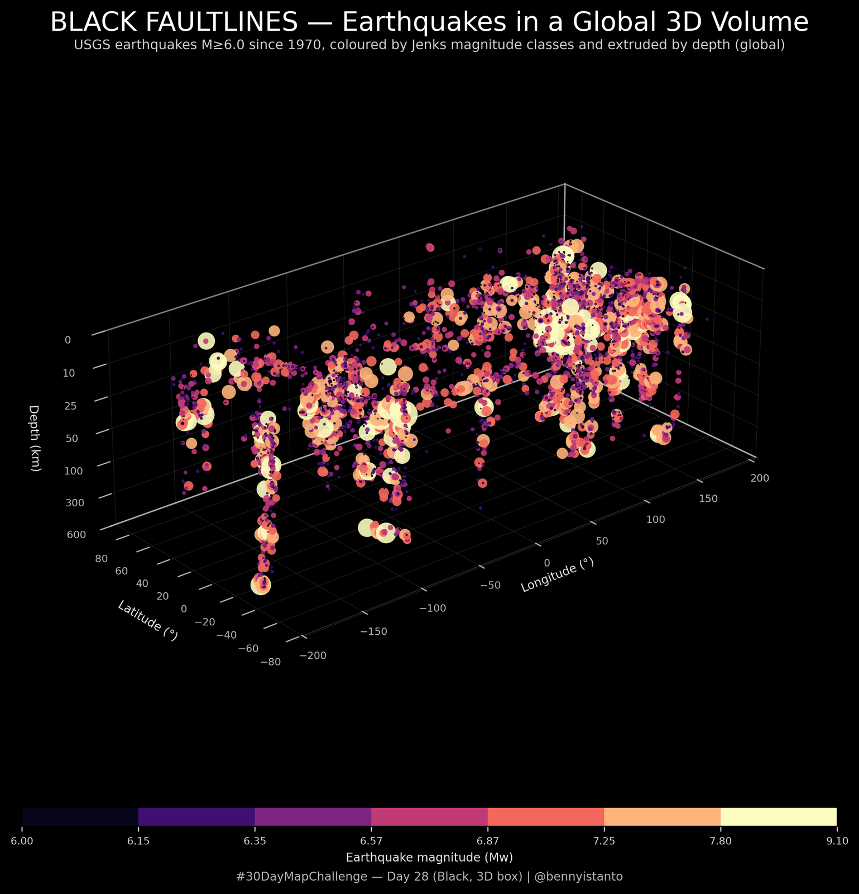

::: {.callout-note collapse="true" title="Python - Day 28, Black"}
```python
# Lets install additional library
!pip install cartopy

import numpy as np
import pandas as pd
import matplotlib.pyplot as plt
from matplotlib.cm import ScalarMappable
from matplotlib.colors import ListedColormap, BoundaryNorm
from mpl_toolkits.mplot3d import Axes3D  # noqa: F401

# ------------------------------------------------------------
# Config
# ------------------------------------------------------------
MAIN_TITLE = "BLACK FAULTLINES — Earthquakes in a Global 3D Volume"
SUBTITLE = (
    "USGS earthquakes M≥6.0 since 1970, coloured by Jenks magnitude classes "
    "and extruded by depth (global)"
)
ATTRIBUTION = "#30DayMapChallenge — Day 28 (Black, 3D box) | @bennyistanto"
FILENAME = "day28_black_3d_box.png"

USGS_URL = (
    "https://earthquake.usgs.gov/fdsnws/event/1/query.csv?"
    "starttime=1970-01-01&endtime=2025-01-01&minmagnitude=6&orderby=time&limit=20000"
)

N_CLASSES = 7  # Jenks magnitude classes

# --- Region mode ---
# "world"  → no spatial filter
# "bbox"   → use REGION_BBOX = (lon_min, lon_max, lat_min, lat_max)
REGION_MODE = "world"
REGION_BBOX = (90, 150, -15, 10)  # Indonesia-ish window


# ------------------------------------------------------------
# 0. Jenks natural breaks helper
# ------------------------------------------------------------
def jenks_breaks(data, n_classes):
    """
    Compute Jenks natural breaks for 1D data.
    Returns an array of length n_classes + 1 with class boundaries.
    """
    data = np.asarray(data, dtype=float)
    data = np.sort(data)
    n = len(data)

    lower_class_limits = np.zeros((n + 1, n_classes + 1), dtype=int)
    variance_combinations = np.zeros((n + 1, n_classes + 1), dtype=float)

    for i in range(1, n_classes + 1):
        lower_class_limits[1, i] = 1
        variance_combinations[1, i] = 0.0
        for j in range(2, n + 1):
            variance_combinations[j, i] = np.inf

    for l in range(2, n + 1):
        s1 = s2 = w = 0.0
        for m in range(1, l + 1):
            i3 = l - m + 1
            val = data[i3 - 1]
            s2 += val * val
            s1 += val
            w += 1
            variance = s2 - (s1 * s1) / w
            if i3 > 1:
                for j in range(2, n_classes + 1):
                    if variance_combinations[l, j] >= variance + variance_combinations[i3 - 1, j - 1]:
                        lower_class_limits[l, j] = i3
                        variance_combinations[l, j] = variance + variance_combinations[i3 - 1, j - 1]
        lower_class_limits[l, 1] = 1
        variance_combinations[l, 1] = variance

    breaks = np.zeros(n_classes + 1)
    breaks[-1] = data[-1]
    k = n
    for j in range(n_classes, 0, -1):
        idx = int(lower_class_limits[k, j]) - 1
        breaks[j - 1] = data[idx]
        k = idx

    breaks[0] = data[0]
    return breaks


# ------------------------------------------------------------
# 1. Load earthquake data from USGS
# ------------------------------------------------------------
def load_earthquakes(url=USGS_URL):
    """
    Load global earthquakes >= M6 from USGS FDSN CSV service.
    """
    usecols = ["time", "latitude", "longitude", "depth", "mag", "place"]
    print("Downloading USGS earthquake catalogue…")
    df = pd.read_csv(url, usecols=usecols)

    # Drop missing mags / coords / depths
    df = df.dropna(subset=["latitude", "longitude", "mag", "depth"]).copy()

    # Clamp longitudes to [-180, 180]
    df["longitude"] = ((df["longitude"] + 180) % 360) - 180

    print(f"Loaded {len(df)} earthquakes (M≥6).")
    return df


# ------------------------------------------------------------
# 2. 3D box plot
# ------------------------------------------------------------
def plot_black_faultlines_3d_box(
    region_mode=REGION_MODE,
    region_bbox=REGION_BBOX,
):
    df = load_earthquakes()

    # --- Region filter ---
    if region_mode == "bbox":
        lon_min, lon_max, lat_min, lat_max = region_bbox
        mask = (
            (df["longitude"] >= lon_min)
            & (df["longitude"] <= lon_max)
            & (df["latitude"] >= lat_min)
            & (df["latitude"] <= lat_max)
        )
        df_sub = df.loc[mask].copy()
        region_label = f"({lon_min}–{lon_max}°E, {lat_min}–{lat_max}°)"
    else:
        df_sub = df.copy()
        region_label = "(global)"

    print(f"Subselected {len(df_sub)} earthquakes in region {region_label}.")

    lons = df_sub["longitude"].values
    lats = df_sub["latitude"].values
    depths = df_sub["depth"].values  # km, positive down
    mags = df_sub["mag"].values

    # --------------------------------------------------------
    # Colour by magnitude using Jenks natural breaks
    # --------------------------------------------------------
    vmin = 6.0
    vmax = max(8.5, mags.max())

    breaks = jenks_breaks(mags, N_CLASSES)
    breaks[0] = min(breaks[0], vmin)
    breaks[-1] = max(breaks[-1], vmax)

    base_cmap = plt.get_cmap("magma")
    cmap = ListedColormap(base_cmap(np.linspace(0.05, 1.0, N_CLASSES)))
    norm = BoundaryNorm(breaks, ncolors=N_CLASSES, clip=True)
    colors = cmap(norm(mags))

    # Symbol size grows non-linearly with magnitude
    sizes = ((mags - 5.5) ** 3) * 10.0

    # --------------------------------------------------------
    # Depth: NON-LINEAR WARPING of the vertical axis
    # --------------------------------------------------------
    # Depth classes we care about in km
    depth_labels = np.array([0, 10, 25, 50, 100, 300, 600], dtype=float)

    # Clip any deeper events into the deepest bin
    depths_clipped = np.clip(depths, depth_labels[0], depth_labels[-1])

    # Evenly spaced z positions (0 at surface, negative downward)
    z_ticks = np.linspace(0.0, -1.0, len(depth_labels))

    # Map real depths -> warped z positions
    z = np.interp(depths_clipped, depth_labels, z_ticks)

    # --------------------------------------------------------
    # Figure and 3D axes
    # --------------------------------------------------------
    fig = plt.figure(figsize=(11, 9), dpi=300)
    fig.patch.set_facecolor("black")

    ax = fig.add_subplot(111, projection="3d")
    ax.set_facecolor("black")

    # 3D scatter in warped depth space
    ax.scatter(
        lons,
        lats,
        z,
        s=sizes,
        c=colors,
        edgecolors="none",
        alpha=0.9,
        depthshade=False,
    )

    # Black box + thin white wireframe
    ax.xaxis.pane.set_facecolor((0.0, 0.0, 0.0, 1.0))
    ax.yaxis.pane.set_facecolor((0.0, 0.0, 0.0, 1.0))
    ax.zaxis.pane.set_facecolor((0.0, 0.0, 0.0, 1.0))

    ax.grid(True)
    for axis in (ax.xaxis, ax.yaxis, ax.zaxis):
        axis._axinfo["grid"]["color"] = (1.0, 1.0, 1.0, 0.15)
        axis._axinfo["grid"]["linewidth"] = 0.3
        axis._axinfo["grid"]["linestyle"] = "-"
        axis._axinfo["axisline"]["color"] = (1.0, 1.0, 1.0, 0.4)
        axis._axinfo["axisline"]["linewidth"] = 0.7
        axis.set_tick_params(colors="0.7", labelsize=7)

    ax.set_xlabel("Longitude (°)", color="0.9", fontsize=8)
    ax.set_ylabel("Latitude (°)", color="0.9", fontsize=8)
    ax.set_zlabel("Depth (km)", color="0.9", fontsize=8)

    # Use warped z-range and ticks
    ax.set_zlim(z_ticks[-1], z_ticks[0])
    ax.set_zticks(z_ticks)
    ax.set_zticklabels([str(int(d)) for d in depth_labels])

    # Stretch box so longitude is visually longer
    ax.set_box_aspect((2.0, 1.0, 0.7))

    # Camera angle
    ax.view_init(elev=25, azim=230)

    # Titles with small gap
    fig.text(
        0.5,
        0.975,
        MAIN_TITLE,
        ha="center",
        va="top",
        fontsize=18,
        color="white",
    )
    fig.text(
        0.5,
        0.945,
        "USGS earthquakes M≥6.0 since 1970, coloured by Jenks magnitude classes "
        f"and extruded by depth {region_label}",
        ha="center",
        va="top",
        fontsize=9,
        color="0.8",
    )

    # Colorbar
    sm = ScalarMappable(norm=norm, cmap=cmap)
    sm.set_array([])
    cax = fig.add_axes([0.15, 0.12, 0.7, 0.02])
    cbar = fig.colorbar(sm, cax=cax, orientation="horizontal", boundaries=breaks)
    cbar.set_label("Earthquake magnitude (Mw)", color="0.9", fontsize=8)
    cbar.ax.tick_params(colors="0.8", labelsize=7)

    # Attribution
    fig.text(
        0.5,
        0.06,
        ATTRIBUTION,
        ha="center",
        va="bottom",
        fontsize=8,
        color="0.7",
    )

    fig.subplots_adjust(left=0.02, right=0.98, top=0.92, bottom=0.20)

    plt.savefig(
        FILENAME,
        dpi=400,
        facecolor=fig.get_facecolor(),
        bbox_inches="tight",
    )
    plt.show()


# ------------------------------------------------------------
# Run
# ------------------------------------------------------------
if __name__ == "__main__":
    plot_black_faultlines_3d_box()
```
:::

### Day 29 - Raster
Gravity scars of Nusantara. Free-air anomalies over Indonesia.

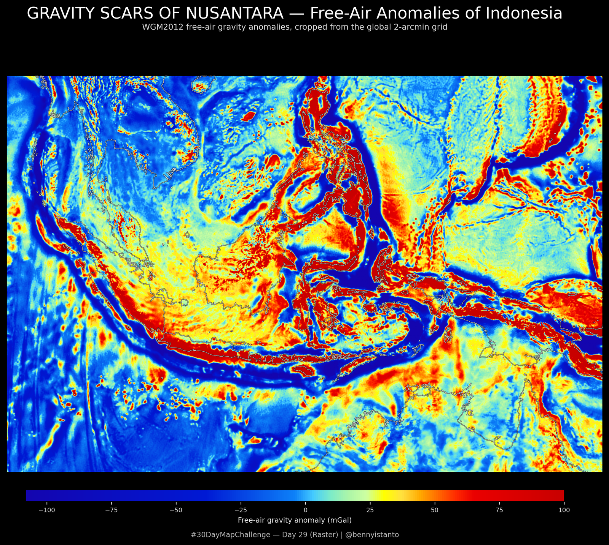

::: {.callout-note collapse="true" title="Python - Day 29, Raster"}
```python
# Lets install additional library
!pip install rasterio cartopy

import numpy as np
import xarray as xr
import matplotlib.pyplot as plt
from matplotlib.colors import LinearSegmentedColormap
import cartopy.crs as ccrs
import cartopy.feature as cfeature

# ------------------------------------------------------------
# Config
# ------------------------------------------------------------
GRD_PATH = "WGM2012_Freeair_ponc_2min.grd"
CPT_PATH = "PALET_WGM_Freeair_Global.cpt"

MAIN_TITLE = "GRAVITY SCARS OF NUSANTARA — Free-Air Anomalies of Indonesia"
SUBTITLE   = "WGM2012 free-air gravity anomalies, cropped from the global 2-arcmin grid"
ATTRIBUTION = "#30DayMapChallenge — Day 29 (Raster) | @bennyistanto"
FILENAME    = "day29_raster_indonesia.png"

# Indonesia-ish bbox
LON_MIN, LON_MAX = 90, 150
LAT_MIN, LAT_MAX = -20, 20   # padded a bit

# ------------------------------------------------------------
# 1. CPT reader
# ------------------------------------------------------------
def load_cpt(path):
    """
    Read a GMT .cpt file and turn it into a Matplotlib colormap.
    Assumes an RGB CPT (like PALET_WGM_Freeair_Global.cpt).
    """
    x = []
    r = []
    g = []
    b = []

    with open(path) as f:
        for line in f:
            line = line.strip()
            if (not line) or line.startswith("#") or line[0] in "BFN":
                continue
            parts = line.split()
            if len(parts) < 8:
                continue
            x0, r0, g0, b0, x1, r1, g1, b1 = parts[:8]
            x.append(float(x0))
            r.append(float(r0) / 255.0)
            g.append(float(g0) / 255.0)
            b.append(float(b0) / 255.0)

    x = np.array(x)
    x_norm = (x - x.min()) / (x.max() - x.min())

    cdict = {"red": [], "green": [], "blue": []}
    for xi, ri, gi, bi in zip(x_norm, r, g, b):
        cdict["red"].append((xi, ri, ri))
        cdict["green"].append((xi, gi, gi))
        cdict["blue"].append((xi, bi, bi))

    return LinearSegmentedColormap("wgm_freeair", cdict)

# ------------------------------------------------------------
# 2. Load global WGM2012 grid and crop to Indonesia
# ------------------------------------------------------------
def load_wgm_and_crop(grd_path, lon_min, lon_max, lat_min, lat_max):
    """
    Load WGM2012 GRD with xarray, auto-detect lon/lat coord names,
    crop to a bounding box, and ensure latitude increases (south → north)
    so plotting with origin='lower' is north-up.
    """
    da = xr.open_dataarray(grd_path)

    # Auto-detect coord names
    if "lon" in da.coords:
        lon_name = "lon"
    elif "x" in da.coords:
        lon_name = "x"
    else:
        raise ValueError("Could not find longitude coordinate in GRD")

    if "lat" in da.coords:
        lat_name = "lat"
    elif "y" in da.coords:
        lat_name = "y"
    else:
        raise ValueError("Could not find latitude coordinate in GRD")

    # Crop
    da = da.sel(
        {lon_name: slice(lon_min, lon_max),
         lat_name: slice(lat_min, lat_max)}
    )

    # Ensure latitude is ascending (south → north)
    if da[lat_name][0] > da[lat_name][-1]:
        da = da.sortby(lat_name)

    return da, lon_name, lat_name

# ------------------------------------------------------------
# 3. Plot Indonesia gravity anomalies
# ------------------------------------------------------------
def plot_gravity_indonesia():
    cmap = load_cpt(CPT_PATH)
    ga, lon_name, lat_name = load_wgm_and_crop(
        GRD_PATH, LON_MIN, LON_MAX, LAT_MIN, LAT_MAX
    )

    data = ga.values
    lon = ga.coords[lon_name].values
    lat = ga.coords[lat_name].values

    # --- Ensure latitude is south→north (ascending) for north-up plotting ---
    # If the first latitude is larger than the last, the array runs N→S,
    # so we flip it vertically and reverse the lat coordinate.
    if lat[0] > lat[-1]:
        data = np.flipud(data)
        lat = lat[::-1]

    # Regional stretch for better contrast
    finite = np.isfinite(data)
    vmin_raw, vmax_raw = np.percentile(data[finite], [2, 98])
    vmin = max(vmin_raw, -200)   # WGM palette nominal range
    vmax = min(vmax_raw, 100)

    # Extent now consistent with ascending lat + origin='lower'
    extent = [lon.min(), lon.max(), lat.min(), lat.max()]

    fig = plt.figure(figsize=(12, 9), dpi=300)
    fig.patch.set_facecolor("black")

    proj = ccrs.PlateCarree()
    ax = plt.axes(projection=proj)
    ax.set_facecolor("black")
    ax.set_extent([LON_MIN, LON_MAX, LAT_MIN, LAT_MAX], crs=proj)

    img = ax.imshow(
        data,
        origin="lower",      # <-- key change
        extent=extent,
        transform=proj,
        cmap=cmap,
        vmin=vmin,
        vmax=vmax,
        interpolation="bilinear",
        zorder=1,
    )

    # --- Coastlines: two-pass halo so they stand out on the bright raster ---
    coast = cfeature.COASTLINE.with_scale("10m")

    # Dark halo underlay
    ax.add_feature(
        coast,
        edgecolor=(0.0, 0.0, 0.0, 0.85),  # almost solid black
        linewidth=1.0,
        zorder=2.5,
    )

    # Thin bright outline on top
    ax.add_feature(
        coast,
        edgecolor=(1.0, 1.0, 1.0, 0.7),  # bright white, semi-opaque
        linewidth=0.5,
        zorder=2.6,
    )

    ax.set_xticks([])
    ax.set_yticks([])

    fig.text(
        0.5,
        0.96,
        MAIN_TITLE,
        ha="center",
        va="top",
        fontsize=18,
        color="white",
    )
    fig.text(
        0.5,
        0.93,
        SUBTITLE,
        ha="center",
        va="top",
        fontsize=9,
        color="0.85",
    )

    cax = fig.add_axes([0.15, 0.10, 0.7, 0.02])
    cbar = fig.colorbar(img, cax=cax, orientation="horizontal")
    cbar.set_label("Free-air gravity anomaly (mGal)", color="0.9", fontsize=8)
    cbar.ax.tick_params(colors="0.85", labelsize=7)

    fig.text(
        0.5,
        0.035,
        ATTRIBUTION,
        ha="center",
        va="bottom",
        fontsize=8,
        color="0.7",
    )

    plt.savefig(
        FILENAME,
        dpi=400,
        facecolor=fig.get_facecolor(),
        bbox_inches="tight",
    )
    plt.show()

# ------------------------------------------------------------
# Run
# ------------------------------------------------------------
if __name__ == "__main__":
    plot_gravity_indonesia()
```
:::

### Day 30 - Makeover
Day 5's rock weave redone as an aspect and slope map using Brewer colours.

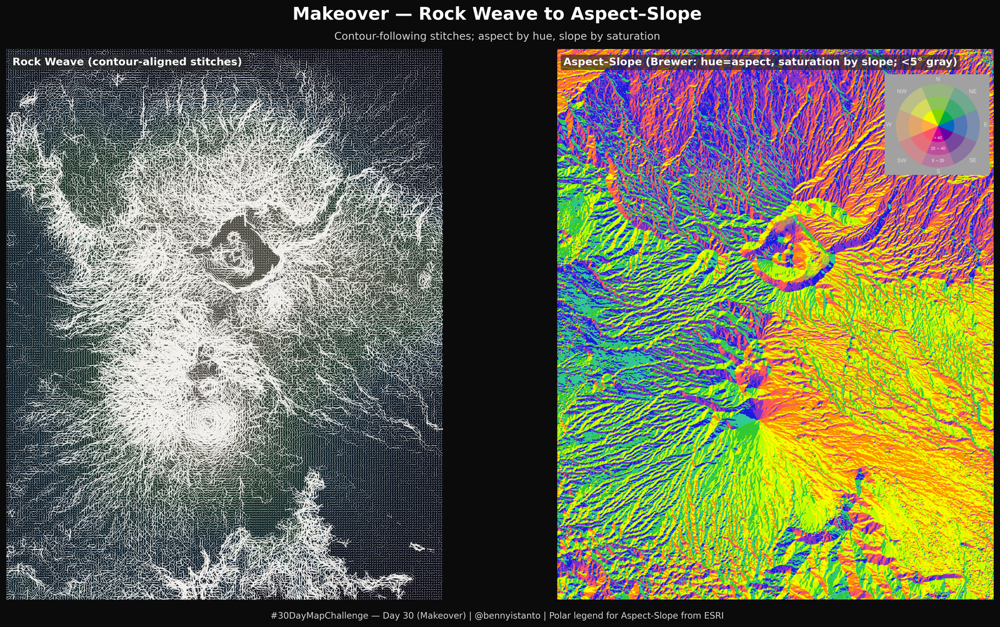

::: {.callout-note collapse="true" title="Python - Day 30, Makeover"}
```python
# Lets install `cartopy` library
!pip install rasterio

"""
DAY 30 — Makeover
Take a map you made during the month or an older piece and redesign it.
Focus on improving the aesthetics, clarity, or data communication.

Left:  Rock Weave — short stitches follow contour direction; length ∝ slope
Right: Aspect–Slope — Brewer categorical scheme:
        • Hue encodes aspect octant (0°=N, clockwise)
        • Saturation encodes slope class (flat gray; low/mod/high)
        • (Optional) tiny relief modulation for depth without washing saturation

Usage:
- Set CFG["dem_path"] to a GeoTIFF path OR to "UPLOAD_IN_COLAB" (file picker).
- Control density/appearance via CFG["target_px"], CFG["stitch_step"], etc.
"""

# -----------------------------
# Imports
# -----------------------------
import os, io, warnings
import numpy as np
import matplotlib.pyplot as plt
from matplotlib.collections import LineCollection
from matplotlib.colors import LightSource
import rasterio
from rasterio.enums import Resampling
from rasterio.io import MemoryFile
from scipy.ndimage import sobel, gaussian_filter

warnings.filterwarnings("ignore")

# -----------------------------
# CONFIG — tweak here
# -----------------------------
CFG = {
    # DEM source: set to "UPLOAD_IN_COLAB" to open a file chooser
    "dem_path": "/content/tnbts_30m_copdem.tif",

    # Common
    "target_px": 1400,             # resample longest side to this (speed/quality)
    "slope_clip_pct": (5, 98),

    # Rock Weave (2D)
    "stitch_step": 6,              # sampling step (lower = denser)
    "stitch_len_px": (2.0, 16.0),  # min/max segment half-length (px)
    "stitch_color": "#f5f3ef",
    "stitch_alpha": 0.85,
    "elev_cmap": "terrain",
    "wash_alpha": 0.18,
    "shade_az": 315,
    "shade_alt": 35,
    "shade_blur_px": 1.1,
    "shade_alpha": 0.35,

    # Figure / layout
    "bg_color": "#0b0b0b",
    "dpi": 300,
    "title": "Makeover — Rock Weave to Aspect–Slope",
    "subtitle": "Contour-following stitches; aspect by hue, slope by saturation",
    "credit": "#30DayMapChallenge — Day 30 (Makeover) | @bennyistanto | Polar legend for Aspect-Slope from ESRI",
    "out": "day30_earthweave_aspectslope.png",
}

# -----------------------------
# Small helpers
# -----------------------------
def _resolve_dem_source(dem_path):
    """Return (mode, handle) where mode ∈ {'path','memory'}."""
    if dem_path != "UPLOAD_IN_COLAB":
        if not os.path.exists(dem_path):
            raise FileNotFoundError(f"DEM not found: {dem_path}")
        return "path", dem_path
    try:
        from google.colab import files
    except Exception:
        raise RuntimeError(
            "Colab upload requested, but google.colab not available. "
            "Set CFG['dem_path'] to a valid file path instead."
        )
    print("[LOG] Pick your DEM GeoTIFF …")
    up = files.upload()
    if not up: raise RuntimeError("No file uploaded.")
    fname = next(iter(up.keys()))
    return "memory", MemoryFile(io.BytesIO(up[fname]))

def _read_dem_resample(source_mode, source_handle, target_px):
    """Open DEM from path or MemoryFile, resample longest side to target_px."""
    opener = rasterio.open(source_handle) if source_mode == "path" else source_handle.open()
    with opener as ds:
        h, w = ds.height, ds.width
        scale = target_px / max(h, w)
        if scale < 1.0:
            out_h = max(1, int(round(h*scale)))
            out_w = max(1, int(round(w*scale)))
            arr = ds.read(1, out_shape=(out_h, out_w), resampling=Resampling.bilinear)
            transform = ds.transform * ds.transform.scale(w/out_w, h/out_h)
        else:
            arr = ds.read(1)
            transform = ds.transform
        arr = arr.astype("float32")
        nodata = ds.nodata
        mask = (arr == nodata) if nodata is not None else ~np.isfinite(arr)
        mask |= ~np.isfinite(arr)
        if mask.any():
            fill = np.nanmedian(np.where(mask, np.nan, arr))
            arr[mask] = fill
    return arr, transform

def _gradients_sobel(z):
    """Pixel-space gradients (sobel), scale ~ elevation change per pixel."""
    dzdx = sobel(z, axis=1, mode="nearest") / 8.0
    dzdy = sobel(z, axis=0, mode="nearest") / 8.0
    return dzdx, dzdy

def _scale01(x, pclip=(5,98)):
    """Percentile clip to [0,1] for robust visualization."""
    lo, hi = np.percentile(x, pclip)
    return np.clip((x - lo) / max(hi - lo, 1e-9), 0, 1)

def slope_aspect_from_grads(dzdx, dzdy):
    """
    Return slope_deg (0..~89), aspect_deg (0..360, 0=N, CW positive).
    Slope uses arctan(|grad|) for a clean visual proxy; aspect uses a GIS-friendly convention.
    """
    mag = np.hypot(dzdx, dzdy)
    slope_deg = np.degrees(np.arctan(mag))  # degrees
    aspect_rad = np.arctan2(dzdx, -dzdy)    # 0° = North, clockwise
    aspect_deg = (np.degrees(aspect_rad) + 360.0) % 360.0
    return slope_deg.astype("float32"), aspect_deg.astype("float32")

# --- Brewer Aspect–Slope helpers (paper: Brewer, "Color for Aspect–Slope Mapping") ---

def slope_percent_from_grads(dzdx, dzdy):
    """Slope in percent from gradients; equivalent to 100 * tan(slope_deg)."""
    mag = np.hypot(dzdx, dzdy)
    slope_deg = np.degrees(np.arctan(mag))
    return 100.0 * np.tan(np.radians(slope_deg))

def classify_slope_base_percent(slope_pct):
    """
    Brewer/ArcGIS slope classes (percent):
      0–5   → base 10  (flat; will map to code 19)
      5–20  → base 20  (low saturation)
      20–40 → base 30  (moderate)
      ≥40   → base 40  (high)
    """
    base = np.zeros_like(slope_pct, dtype=np.uint8)
    base[(slope_pct >= 0)  & (slope_pct < 5)]   = 10
    base[(slope_pct >= 5)  & (slope_pct < 20)]  = 20
    base[(slope_pct >= 20) & (slope_pct < 40)]  = 30
    base[(slope_pct >= 40)]                     = 40
    return base

def classify_aspect_octants(aspect_deg):
    """
    Map aspect (0..360, 0=N clockwise) to octants 1..8:
      1=N, 2=NE, 3=E, 4=SE, 5=S, 6=SW, 7=W, 8=NW
    Using Brewer/ArcGIS cuts: [0–22), [22–67), [67–112), ..., [292–337), [337–360)→N
    """
    a = (aspect_deg % 360.0).astype("float32")
    edges = np.array([22, 67, 112, 157, 202, 247, 292, 337], dtype="float32")
    idx = np.digitize(a, edges, right=False) + 1  # 1..9
    idx[idx == 9] = 1
    return idx.astype(np.uint8)

def brewer_codes(aspect_oct, slope_base):
    """
    Combine to Brewer codes:
      base 10 (flat) → 19
      else            → base + aspect_oct (21..28, 31..38, 41..48)
    """
    return np.where(slope_base == 10, 19, slope_base + aspect_oct).astype(np.uint8)

# RGB from the paper's RGBTABLE (integer 0–255)
_BREWER_RGB = {
    19:(153,153,153),
    21:(147,166, 89), 22:(102,153,102), 23:(102,153,136), 24:( 89, 89,166),
    25:(128,108,147), 26:(166, 89, 89), 27:(166,134, 89), 28:(166,166, 89),
    31:(172,217, 38), 32:( 77,179, 77), 33:( 73,182,146), 34:( 51, 51,204),
    35:(128, 89,166), 36:(217, 38, 38), 37:(217,142, 38), 38:(217,217, 38),
    41:(191,255,  0), 42:( 51,204, 51), 43:( 51,204,153), 44:( 26, 26,230),
    45:(128, 51,204), 46:(255,  0,  0), 47:(255,149,  0), 48:(255,255,  0),
}

def brewer_rgb_image(code_grid):
    """Map Brewer codes to an RGB image (float 0–1)."""
    h, w = code_grid.shape
    out = np.empty((h, w, 3), dtype="float32")
    out[:] = np.array([0.6, 0.6, 0.6], dtype="float32")  # fallback gray
    for c in np.unique(code_grid):
        rgb = _BREWER_RGB.get(int(c))
        if rgb is None:
            continue
        out[code_grid == c] = (np.array(rgb, dtype="float32") / 255.0)
    return out

def _hex_to_rgb255(h):
    h = h.lstrip("#")
    return tuple(int(h[i:i+2], 16) for i in (0,2,4))

# -----------------------------
# Load DEM & derive fields
# -----------------------------
print("[LOG] Resolving DEM source …")
mode, handle = _resolve_dem_source(CFG["dem_path"])
print("[LOG] Reading & resampling DEM …")
dem, transform = _read_dem_resample(mode, handle, CFG["target_px"])

print("[LOG] Deriving slope & orientation …")
dem_blur = gaussian_filter(dem, 0.6)
dzdx, dzdy = _gradients_sobel(dem_blur)

# For Rock Weave lengths
slope_mag = np.hypot(dzdx, dzdy)
slope01 = _scale01(slope_mag, CFG["slope_clip_pct"])

# Stitch orientation (contour tangent)
theta = np.arctan2(dzdy, dzdx) + np.pi/2.0

# For Aspect–Slope rendering (degrees)
slope_deg, aspect_deg = slope_aspect_from_grads(dzdx, dzdy)

# -----------------------------
# Build stitches (Rock Weave)
# -----------------------------
print("[LOG] Building stitches …")
H, W = dem.shape
step = CFG["stitch_step"]
ys, xs = np.mgrid[0:H:step, 0:W:step]
ys = ys.ravel(); xs = xs.ravel()

ang  = theta[ys, xs]
sl01 = slope01[ys, xs]
Lmin, Lmax = CFG["stitch_len_px"]
half_len = Lmin + (Lmax - Lmin) * sl01

dx = half_len * np.cos(ang)
dy = half_len * np.sin(ang)
x0, y0 = xs - dx, ys - dy
x1, y1 = xs + dx, ys + dy
segs = np.stack([np.stack([x0, y0], 1), np.stack([x1, y1], 1)], 1)
lw = 0.4 + 1.2 * sl01

stitches = LineCollection(
    segs,
    colors=CFG["stitch_color"],
    linewidths=lw,
    alpha=CFG["stitch_alpha"],
    capstyle="round", joinstyle="round"
)

# -----------------------------
# Aspect–Slope (Brewer percent-based) + South-West override
# -----------------------------
print("[LOG] Preparing Aspect–Slope image (Brewer percent classes) …")

# 1) Classify by Brewer rules (percent slope + octants)
slope_pct  = slope_percent_from_grads(dzdx, dzdy)          # %
aspect_oct = classify_aspect_octants(aspect_deg)           # 1..8
slope_base = classify_slope_base_percent(slope_pct)        # 10/20/30/40
codes      = brewer_codes(aspect_oct, slope_base)          # 19,21..48

# 2) Start from Brewer's published RGB palette
asp_rgb = brewer_rgb_image(codes)                          # H×W×3, 0..1

# 3) Your custom SW (octant=6) colors (hex → RGB) for each slope band
#    SW, ≥40%  → #FF5568   ; 20–40% → #E76F7A   ; 5–20% → #CB8B8F   ; <5% → #A1A1A1
_SW_COLORS = {
    ("flat",  6): _hex_to_rgb255("#A1A1A1"),
    ("low",   6): _hex_to_rgb255("#CB8B8F"),
    ("med",   6): _hex_to_rgb255("#E76F7A"),
    ("high",  6): _hex_to_rgb255("#FF5568"),
}
# Apply overrides efficiently
sw_mask = (aspect_oct == 6)
if sw_mask.any():
    # flat (<5%) → base 10 → code 19
    flat_m = sw_mask & (slope_base == 10)
    low_m  = sw_mask & (slope_base == 20)   # 5–20%
    med_m  = sw_mask & (slope_base == 30)   # 20–40%
    high_m = sw_mask & (slope_base == 40)   # ≥40%
    for m, key in [(flat_m,("flat",6)), (low_m,("low",6)), (med_m,("med",6)), (high_m,("high",6))]:
        if m.any():
            asp_rgb[m] = (np.array(_SW_COLORS[key], dtype="float32") / 255.0)

# 4) Optional micro-relief (very gentle so saturation remains visible)
if CFG.get("shade_alpha", 0) > 0:
    ls        = LightSource(azdeg=CFG["shade_az"], altdeg=CFG["shade_alt"])
    elev_norm = (dem - np.nanmin(dem)) / max(np.nanmax(dem) - np.nanmin(dem), 1e-9)
    relief    = ls.hillshade(elev_norm, vert_exag=1.0, dx=1, dy=1)
    relief    = gaussian_filter(relief, 0.6)
    relief    = 0.97 + 0.03 * (relief - np.min(relief)) / max(np.ptp(relief), 1e-6)
    asp_rgb   = np.clip(asp_rgb * relief[..., None], 0, 1)


# -----------------------------
# Compose figure (both panels 2D) — GAPLESS LAYOUT
# -----------------------------
print("[LOG] Rendering figure …")
plt.close("all")
fig = plt.figure(figsize=(18, 10), dpi=CFG["dpi"], facecolor=CFG["bg_color"])

# --- Axes geometry (left, right) with a hairline gutter
# reserve a slim top band for global title/subtitle
top_band   = 0.08
bottom_pad = 0.045
left_pad   = 0.02
right_pad  = 0.985
gutter     = 0.006

usable_width  = (right_pad - left_pad)
panel_width   = (usable_width - gutter) / 2.0
panel_height  = 1.0 - top_band - bottom_pad

ax1 = fig.add_axes([left_pad,               bottom_pad, panel_width, panel_height],
                   facecolor=CFG["bg_color"])
ax2 = fig.add_axes([left_pad + panel_width + gutter, bottom_pad, panel_width, panel_height],
                   facecolor=CFG["bg_color"])

# --- LEFT: Rock Weave (contour-aligned stitches)
ax1.imshow(elev_norm, cmap=CFG["elev_cmap"], alpha=CFG["wash_alpha"], interpolation="bilinear")
hs = ls.shade(elev_norm, cmap=plt.cm.gray, vert_exag=1.0, fraction=1.0)
hs = hs[..., 0] if hs.ndim == 3 else hs
hs = gaussian_filter(hs, CFG["shade_blur_px"])
ax1.imshow(hs, cmap="gray", alpha=CFG["shade_alpha"], interpolation="bilinear")
ax1.add_collection(stitches)

# Maintain the native DEM aspect ratio (no vertical skew)
ax1.set_xlim(0, W); ax1.set_ylim(H, 0)
ax1.set_box_aspect(H / W)
ax1.set_xticks([]); ax1.set_yticks([])
for sp in ax1.spines.values(): sp.set_visible(False)
ax1.text(
    0.014, 0.985, "Rock Weave (contour-aligned stitches)",
    transform=ax1.transAxes, ha="left", va="top",
    color="w", fontsize=12, weight="semibold", zorder=20,
    bbox=dict(
        facecolor=(0.15, 0.15, 0.15, 0.65),  # soft dark gray with alpha
        edgecolor="none",
        boxstyle="round,pad=0.25"
    ),
)

# --- RIGHT: Aspect–Slope (Brewer categorical)
ax2.imshow(asp_rgb, interpolation="bilinear")
ax2.set_xlim(0, W); ax2.set_ylim(H, 0)
ax2.set_box_aspect(H / W)
ax2.set_xticks([]); ax2.set_yticks([])
for sp in ax2.spines.values(): sp.set_visible(False)
ax2.text(
    0.014, 0.985, "Aspect–Slope (Brewer: hue=aspect, saturation by slope; <5° gray)",
    transform=ax2.transAxes, ha="left", va="top",
    color="w", fontsize=12, weight="semibold", zorder=20,
    bbox=dict(
        facecolor=(0.15, 0.15, 0.15, 0.65),
        edgecolor="none",
        boxstyle="round,pad=0.25"
    ),
)

# --- Legend image (ArcGIS) instead of polar mini-legend
from urllib.request import urlopen
from PIL import Image
import io as _io
legend_url = "https://pro.arcgis.com/en/pro-app/latest/help/analysis/raster-functions/GUID-507E304E-5DEE-48BF-AB36-58DC4370CBCF-web.png"
try:
    with urlopen(legend_url) as f:
        _buf = _io.BytesIO(f.read())
    legend_img = Image.open(_buf).convert("RGBA")
    # place as an inset over ax2
    px = ax2.get_position()
    lg_w, lg_h = 0.16, 0.16
    dx = 0.04  # tweak right/left
    dy = 0.03
    inset_ax = fig.add_axes([px.x1 - lg_w - 0.01 + dx,
                             px.y1 - lg_h - 0.01 - dy,
                             lg_w, lg_h])
    inset_ax.imshow(legend_img)
    inset_ax.axis("off")
except Exception:
    ax2.text(0.986, 0.02, "Legend image unavailable",
             transform=ax2.transAxes, ha="right", va="bottom", color="w", fontsize=8)

# --- Global title/subtitle in the reserved top band (won’t overlap panels)
fig.text(0.5, 1.0 - 0.012, CFG["title"], ha="center", va="top",
         color="white", fontsize=20, weight="bold")
fig.text(0.5, 1.0 - 0.065, CFG["subtitle"], ha="center",
         color="#cfcfcf", fontsize=12)

# --- Credit tight at bottom
fig.text(0.5, 0.015, CFG["credit"], ha="center", color="#cfcfcf", fontsize=10)

# --- Save with zero padding (no stray margins)
plt.savefig(CFG["out"], dpi=CFG["dpi"], facecolor=CFG["bg_color"],
            bbox_inches="tight", pad_inches=0.0)
print(f"[LOG] Saved → {CFG['out']}")
plt.show()
```
:::

### The poster
All thirty maps arranged on one A4 landscape sheet.

::: {.callout-note collapse="true" title="Python - the poster"}
```python
import glob
import os
import re
import matplotlib.pyplot as plt
import matplotlib.image as mpimg

# ------------------------------------------------------------
# Config
# ------------------------------------------------------------
ROWS = 5
COLS = 6

TITLE = "30 Day Map Challenge, 2025"
ATTRIB = "#30DayMapChallenge | @bennyistanto"

OUTFILE = "30daymapchallenge_A4_landscape.png"

# A4-ish landscape in inches (297 × 210 mm) – tweak if you like
FIG_WIDTH_IN = 11.7
FIG_HEIGHT_IN = 8.3
DPI = 300

# ------------------------------------------------------------
# 1. Collect and sort map files day01.png ... day30.png
# ------------------------------------------------------------
files = glob.glob("day*.png")

def extract_day_num(path):
    m = re.search(r"day(\d+)\.png", os.path.basename(path))
    return int(m.group(1)) if m else 999

files_sorted = sorted(files, key=extract_day_num)

print(f"Found {len(files_sorted)} map files:")
for f in files_sorted:
    print("  ", f)

if len(files_sorted) == 0:
    raise RuntimeError("No files found. Check pattern 'day*.png' and working dir.")

# Limit to the first ROWS*COLS images
files_sorted = files_sorted[: ROWS * COLS]

# ------------------------------------------------------------
# 2. Create figure and axes grid
# ------------------------------------------------------------
plt.close("all")
fig, axes = plt.subplots(
    ROWS,
    COLS,
    figsize=(FIG_WIDTH_IN, FIG_HEIGHT_IN),
    dpi=DPI,
)

# Make background neutral (white); you can switch to black if you want
fig.patch.set_facecolor("black")

# Flatten axes for easier looping
axes = axes.ravel()

# ------------------------------------------------------------
# 3. Plot each image in its cell
# ------------------------------------------------------------
for ax, path in zip(axes, files_sorted):
    img = mpimg.imread(path)
    ax.imshow(img)
    ax.set_axis_off()

# If there are more axes than images, hide the extra ones
for ax in axes[len(files_sorted):]:
    ax.set_visible(False)

# ------------------------------------------------------------
# 4. Add big title and attribution (this uses Matplotlib’s font system)
# ------------------------------------------------------------
# Tighten layout of the grid to leave room at top and bottom
plt.subplots_adjust(
    left=0.06,    # more space on the left
    right=0.94,   # more space on the right
    top=0.88,     # keep room for title
    bottom=0.10,  # keep room for attribution
    wspace=0.05,  # horizontal space between images
    hspace=0.05,  # vertical space between images
)

# Big title at top (centered)
fig.text(
    0.5,
    0.95,
    TITLE,
    ha="center",
    va="top",
    fontsize=18,
    fontweight="bold",
    color="white",
)

# Attribution at bottom (centered)
fig.text(
    0.5,
    0.04,
    ATTRIB,
    ha="center",
    va="bottom",
    fontsize=8,
    color="dimgray",
)

# ------------------------------------------------------------
# 5. Save and show
# ------------------------------------------------------------
fig.savefig(OUTFILE, dpi=DPI, bbox_inches="tight")
print("Saved poster to:", OUTFILE)

plt.show()
```
:::
