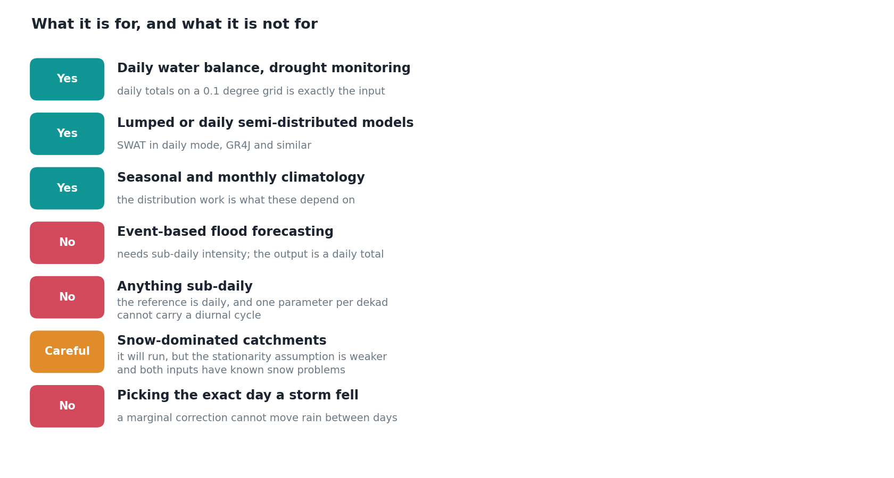

A year of finding out what this method does. Time to write down what it does not.

People have started asking whether they can use it for things, which is flattering and slightly alarming. The pipeline will run on almost any daily gridded precipitation you point it at and produce a NetCDF that looks entirely respectable, regardless of whether the assumptions underneath it hold. Nothing in the output announces that you have taken it somewhere it does not work.

So: the actual questions I have been asked this year, and the actual answers.

### Can I use this for snow?

No, or at least not without knowing what you are giving up.

Both halves of the problem get worse when the precipitation is frozen. The satellite retrievals struggle over snow surfaces, where the microwave signal behaves differently over ice and snow cover than over land. The gauge side is no better: gauges under-catch snow, badly and variably, because wind carries it past the orifice.

So the product is biased and the reference is biased, and the correction assumes the reference is the thing to move towards.

It will run. It will produce output. But the core assumption, that the bias is systematic and correctable with a stationary distributional model, is on much weaker ground than it is for rain. Snowfall bias correction is its own literature with its own methods, and the honest answer is to go and read that instead.

### Can I run it hourly?

No. Three reasons, each independently disqualifying.

1. **The window is chosen from the meteorology, not the sampling.** Parameters are fitted per ten-day window on roughly 250 days per window per pixel. Going sub-daily does not give you more of the thing that matters.
2. **The reference is a daily product.** Correcting hourly data against a daily reference is not a correction, it is an assumption about how the day divides up.
3. **The diurnal cycle is intensely local.** The afternoon convective peak arrives at different times in different valleys. One parameter per dekad per pixel cannot carry that.

If you need sub-daily, the underlying satellite product has a native half-hourly version, and you want a different method. Something like quantile mapping per hour-of-day per dekad, which is a large parameter explosion and a different project.

### Will it tell me the storm was on the 14th rather than the 15th?

No, it cannot, and this is the most important limitation to state clearly.

Quantile mapping moves values. It does not move them between days. If the satellite put the storm on the 15th, every stage of this pipeline will still have it on the 15th, at a corrected magnitude. The day-to-day sequence is inherited from the satellite, and nothing downstream touches it.

In September I worked out why this is structural rather than a shortcoming I could engineer away: quantile mapping is monotone, so it preserves the order of days, and the pairing is fixed by the satellite before any of my code runs. Correcting magnitudes and correcting timing are different problems and this method only addresses one of them.

In October I found that a large part of what I had been calling timing error was not error at all, but two archives disagreeing about when a day starts. That changed the size of the problem considerably. It did not change this answer: even with the windows aligned, the correction still cannot move rain between days.

Which puts event-based flood forecasting, where the whole question is *when*, outside what a marginal correction can do.

### Can I feed it to a hydrological model?

Depends entirely on which one.

| Model type | Answer |
|---|---|
| Lumped or daily semi-distributed (SWAT in daily mode, GR4J) | Yes. Corrected daily totals on a 0.1 degree grid is exactly the input these want. |
| Seasonal water balance, drought indices | Yes, and this is where the distribution work pays off most. |
| Event-based, sub-daily distributed (flood forecasting) | No. You would need to disaggregate with a separate model first. |
| Snow-driven catchments | See above. |

Whichever it is, run your own sensitivity test against both the raw and the corrected product before adopting either operationally. I would rather you distrusted my output and checked than took it on the strength of a blog post.

### So what is it for?

Daily water balance, drought monitoring, seasonal and monthly climatology, and anything where you need the right *amount* of rain in the right *place* over a period longer than a day.

That is a narrower claim than "we improved satellite precipitation", and it is the one the evidence supports.

## Why write the no list

Two reasons.

The first is practical. A method with clearly marked edges is more useful than one without, because someone can tell in five minutes whether it applies to them. Vagueness about scope does not expand your user base, it just moves the disappointment further downstream.

The second is that the list got **shorter** this year, in a way I did not anticipate. In January I would have put "daily timing" on it as a flat limitation of satellite data. By October a good share of that apparent error had turned out to be a calendar convention, fixable by anyone willing to re-aggregate to the local day.

What remains is what genuinely cannot be done, rather than what merely had not been done yet. That distinction is most of what two years of this has been for.
