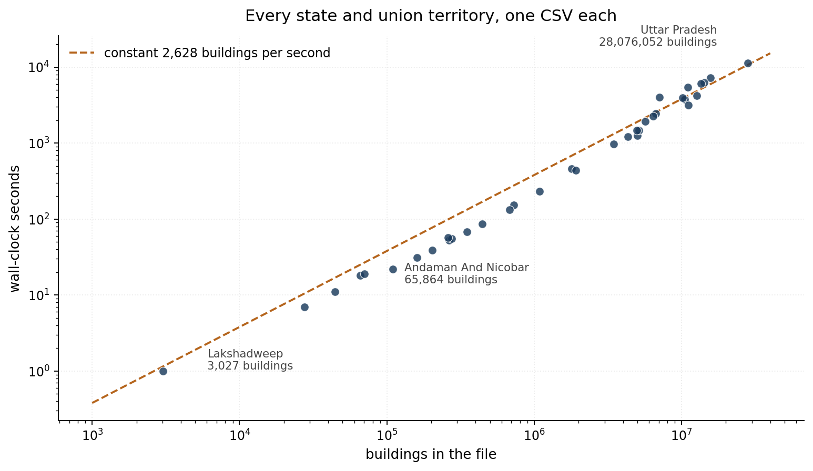

Building footprint data is one of the more useful things to have appeared in the last few years. Microsoft released theirs, Google released theirs, and national efforts have followed. If you work on exposure, damage assessment or urban growth, having a polygon for every building changes what you can ask.

They almost all ship as CSV.

Not shapefile, not GeoPackage, not FlatGeobuf. A compressed CSV with a column called `geometry` holding a WKT string, and the attributes alongside it. It makes sense from the publisher's side: CSV compresses well, everything can read it, and there is no format negotiation. It is a good transport format.

It is a terrible analysis format, and the gap between those two things is where I spent the end of December.

## The dataset

[India Open Buildings](https://gobs.aeee.in/downloads) publishes one `.csv.gz` per state and union territory. Each row is a building: a WKT polygon, plus area, height, floor count, land use.

Together they come to **184 million buildings**.

The obvious approach is the one everybody tries first:

```python
df = pd.read_csv("UTTAR_PRADESH.csv.gz")
gdf = gpd.GeoDataFrame(df, geometry=df.geometry.apply(wkt.loads))
gdf.to_file("UTTAR_PRADESH.gpkg", driver="GPKG")
```

Uttar Pradesh alone has 28 million rows. That line asks Python to hold the raw dataframe, plus 28 million WKT strings, plus 28 million parsed Shapely geometries, all at once, before a single feature reaches disk. On my machine it does not finish. It just grows until something gives.

The problem is not that the data is too big. It is that nothing in that snippet needs the whole file to be in memory, and yet all of it is.

## Read a bit, write a bit, forget it

The fix is to stream. Read a chunk, convert it, write it, drop it, read the next one. Memory stays flat no matter how large the input, because at no point are you holding more than one chunk.

Pandas gives you the reading half for free:

```python
pd.read_csv(path, compression="infer", chunksize=250_000, low_memory=True)
```

`compression="infer"` handles the `.gz` without unpacking it to disk first, and `chunksize` turns the call into an iterator of dataframes rather than one enormous one.

The writing half is where you have to leave GeoPandas behind. `to_file` wants a complete GeoDataFrame. Fiona, which sits underneath it, will let you open a sink once and keep pushing features into it:

```python
with fiona.open(out_path, "w", driver="GPKG", schema=schema, crs=crs, layer=layer) as sink:
    for chunk in iter_csv_chunks(path, CHUNK_SIZE):
        ...
        sink.writerecords(records)
```

That is the whole idea. Everything after this is detail, but the details are what took the time.

## The details that earned their place

**Parse the WKT column all at once.** Shapely 2.0 added a vectorised `from_wkt` that takes an array and returns an array. Calling `wkt.loads` in a Python loop over 250,000 rows is dramatically slower than handing the whole column over in one call.

```python
if SHAPELY_HAS_FROM_WKT:
    return shapely_from_wkt(series.to_numpy(copy=False))
return series.map(shapely_wkt.loads)   # fallback for Shapely < 2.0
```

**Write in batches, not one feature at a time.** Every call across the Python to GDAL boundary costs something. Writing 25,000 features per call instead of one makes that cost disappear into the noise.

**Declare the schema as MultiPolygon and promote everything to it.** This one bit me. A GeoPackage layer has one geometry type. Building footprints are mostly `Polygon`, but a few are `MultiPolygon`, and GDAL will refuse the mismatched ones. Discovering that four million rows into a state is annoying. So the schema says MultiPolygon from the start, and single polygons get wrapped on the way in:

```python
if gt == "Polygon":
    return MultiPolygon([geom])
```

**Repair only what is broken.** Self-intersections and bad rings do occur, and `make_valid` fixes them. But running it on every geometry is expensive and pointless. Check validity first, repair only the failures.

**Turn the spatial index off while writing.** GeoPackage keeps an R-tree for fast spatial queries, and maintaining it during a bulk insert is slow. Worse, it can throw UNIQUE constraint errors partway through a large write. So the index is disabled during the write and built afterwards, once, on a finished table.

## What happened

Thirty-six files, one per state and union territory, run overnight.

```
[15:22:32] INFO - ALL DONE. rows_in=184,203,151, features_out=184,203,151, skipped=0
```

Rows in equals features out. Nothing was silently dropped, which is the number I actually cared about, because a conversion that loses two per cent of your buildings and does not mention it is worse than one that fails.



Nineteen and a half hours of compute, about 2,600 buildings a second. The interesting part of that chart is how boring it is: the points sit close to a constant-rate line across four orders of magnitude, from Lakshadweep's 3,027 buildings in one second to Uttar Pradesh's 28 million in three hours. The largest files drift slightly above the line, but only slightly.

That flatness is the point of the whole exercise. It means the design has no cliff in it. Nothing changes qualitatively when the file gets bigger, because nothing ever tries to hold the file.

Memory stayed in the hundreds of megabytes throughout, on a laptop.

## The thing that did not work

Honesty compels this bit, because it appears 36 times in my own log:

```
WARNING - Could not create spatial index for 'buildings' in ANDHRA_PRADESH.gpkg
          (GDAL Python/ogrinfo unavailable?)
```

The script tries three ways to build the R-tree: check whether one already exists via `sqlite3`, then the GDAL Python bindings, then the `ogrinfo` command line. In the environment I ran this in, none of the three was available, so it warned and carried on.

The GeoPackages are complete and correct. They just have no spatial index, which means any bounding-box query has to scan the table. On a 28 million row layer that is the difference between instant and unusable.

It is the right behaviour, in that a missing index is not a reason to throw away four million written features. But it is a warning that is very easy to scroll past at two in the morning, and if you are running this yourself, check for it. Building the index afterwards is one command per file:

```bash
ogrinfo -sql "SELECT CreateSpatialIndex('buildings','geom')" UTTAR_PRADESH.gpkg
```

## Nineteen hours needs a resume button

Any job that runs overnight will be interrupted, so the script checks what already exists before starting each file. The default is `skip`, but there is also an `auto` mode that compares the feature count in the existing GeoPackage against the row count in the source CSV and reprocesses if they disagree by more than a small tolerance.

That check is worth more than it sounds. It is not just resumability, it is a verification pass: run the batch a second time and it will tell you whether the first run actually finished what it claimed.

## It is not really about India

The script is written around India Open Buildings, and the column names in the config reflect that. But nothing in the approach is specific to it.

Any CSV with a WKT geometry column and a consistent schema will go through the same pipeline. Point `GEOM_COL` at the right column, set `SELECTED_COLUMNS` if you only want some of the attributes, and adjust `CHUNK_SIZE` for your memory. Microsoft and Google building footprints, road networks, address points: the shape of the problem is the same every time, because CSV with WKT is what everyone hands out.

The [notebook is a gist](https://gist.github.com/bennyistanto/485a190496840b910c41aafbb00bc128), a single cell of about seven hundred lines with the configuration at the top. That is more code than this job strictly needs, and most of the extra is the unglamorous part: existing-file policy, adaptive batch backoff when a write fails, three separate strategies for the spatial index, and enough logging to work out which state broke and when.

Which is roughly the ratio I have come to expect. The streaming loop is twenty lines. The rest is everything that goes wrong at three in the morning on the twenty-eighth file.
