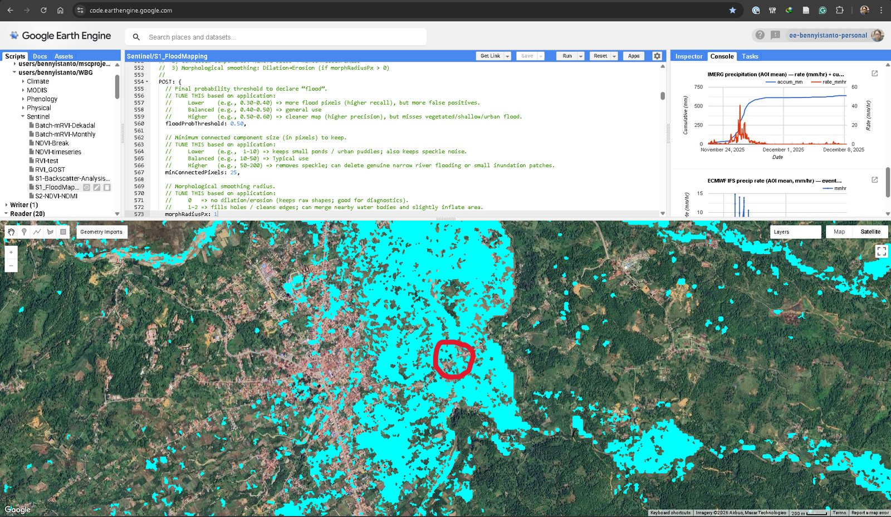
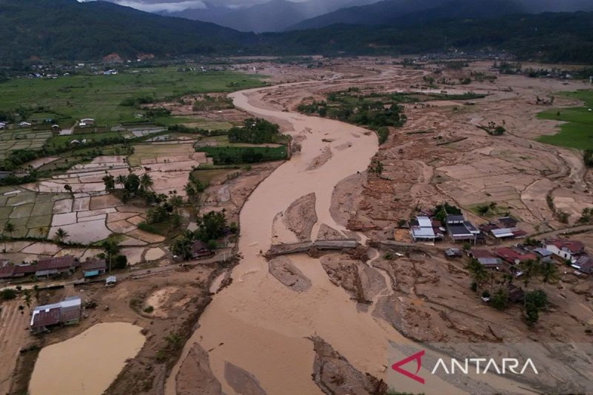
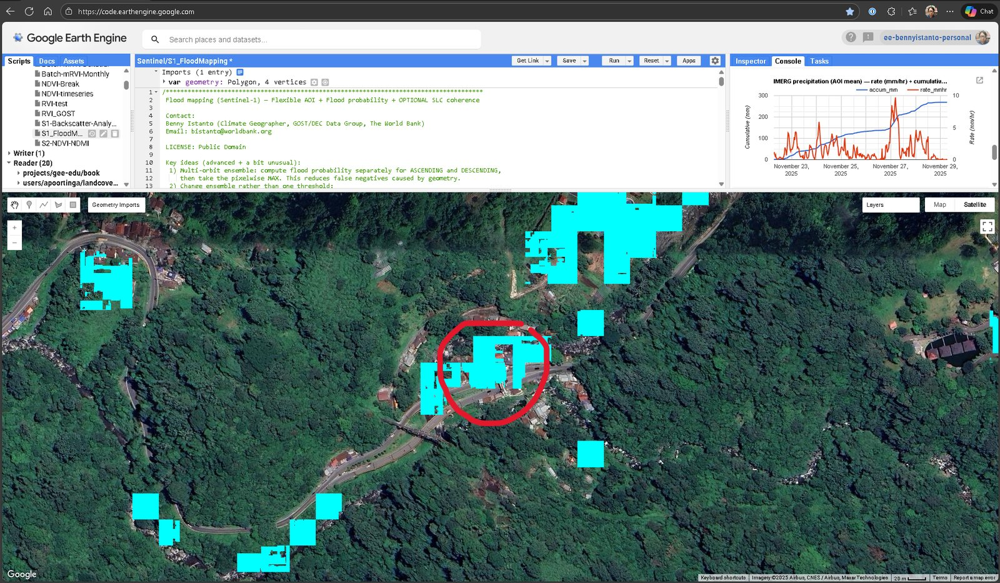

At the end of November 2025, [Cyclone Senyar](https://en.wikipedia.org/wiki/Cyclone_Senyar) came across northern Sumatra. Aceh and North Sumatra took days of rain, and what followed was the usual grim sequence: rivers over their banks, landslides across the hills, roads cut, bridges gone.

When that happens, rapid mapping products start appearing within a day or two. [UNOSAT](https://unosat.org/) and others publish flood and damage extents derived from radar, and not as pictures: as shapefiles, geodatabases and GeoPackages you can drop straight into QGIS and intersect with population, cropland or roads that afternoon. Free, fast, and often the only wide-area picture anyone has while the water is still up. They are genuinely valuable, they are produced under real time pressure with real accountability, and I have relied on them.

**Nothing here replaces that.** What follows is a second opinion.

Because every one of those extents is the output of decisions. Which images, which baseline period, where the threshold sits between dark water and dark anything-else, which terrain gets excluded. Reasonable analysts make those decisions differently, and the file arrives without them. You get a polygon, not the reasoning behind its edge.

And the decisions do not transfer. A setting tuned for a coastal delta will not behave the same way in a steep inland valley, or over rice paddies that are already water half the year, or in a city. That is not a criticism of anyone's defaults, it is just what happens when one configuration meets a landscape it was not chosen for. A rapid product has to pick something and ship. Someone working a specific district, a week later, with a field report contradicting the map, is in a different position and should be able to do something about it.

That is the gap this fills. So over the following weeks I wrote my own.

## Why radar, and why it is harder than it looks

Optical satellites are useless during a flood, because floods come with clouds. Radar does not care about clouds, which is why Sentinel-1 is the workhorse for this.

The physics is appealingly simple. Radar bounces off rough surfaces and scatters back to the satellite. Smooth water reflects the pulse away, so open water comes back dark. Find the dark pixels, find the water.

The trouble is what else is dark. Radar shadow behind a hill is dark. Smooth tarmac and airport aprons are dark. Dry sand can be dark. And genuine floodwater under a forest canopy or roughened by wind may not be dark at all. In a mountainous place like Gayo Lues, the terrain generates plenty of convincing false darkness.

So a single threshold on a single image is never going to be enough.

## Evidence, not a threshold

The script builds three separate pieces of evidence from Sentinel-1 GRD, and each one answers a slightly different question.

**Did this pixel get darker?** The change between a pre-event baseline and the event window. This is the strongest signal, because it looks for *new* water rather than water-like surfaces that were always there.

**Is this pixel dark now, in absolute terms?** Useful when the baseline is noisy, and a check on the change signal.

**Does it scatter like water?** The VH/VV ratio. Open water has a characteristic relationship between the two polarisations that most dry dark surfaces do not.

Each becomes a soft probability rather than a yes or no, and they are combined with weights you can see and change:

```js
SCORE: {
  w_change: 0.50,   // new water: the strongest evidence
  w_abs:    0.35,   // water is dark
  w_ratio:  0.15,   // water scatters like water
  k_change: 1.5,    // dB of softness around the Otsu threshold
}
```

The thresholds inside each term come from [Otsu's method](https://en.wikipedia.org/wiki/Otsu%27s_method), which picks the split that best separates a histogram into two groups rather than using a number someone wrote down in 2014. The `k_change` value controls how sharp the decision is. Larger means a gentler transition and more pixels landing in the middle, which raises recall and lowers precision. That trade is yours to make, and it should be.

The output is a probability surface from 0 to 1. The binary map is what you get after applying a threshold to it, and the probability is the thing worth looking at.

## Two orbits are better than one

Sentinel-1 sees the same place from two directions, ascending and descending. Terrain that hides in one geometry is often visible in the other.

Most workflows merge everything into one composite. This one runs the whole chain separately per orbit and then fuses the results by taking the pixel-wise **maximum**. If either pass thinks a pixel is flooded, it counts.

That is a deliberate choice in favour of recall over precision. For a screening product feeding into "where should we look", missing real flood is the more expensive error. For a damage assessment feeding into compensation, you would want the opposite, and you would change it.

## Then ask whether it is physically possible

The evidence layers do not know anything about terrain, so three constraints get applied afterwards.

```js
MASKS: {
  maxSlopeDeg:  5,    // water does not sit on a 20-degree slope
  maxHANDm:     25,   // how far above the nearest drainage
  permWaterOcc: 85    // exclude what JRC says is water most of the time
}
```

Slope removes the shadow and layover artefacts that mountains produce. **HAND**, height above nearest drainage, is the useful one: it measures how high a pixel sits above the stream network it would drain into, so a dark patch 200 m above the nearest river gets dropped no matter how convincing it looks. And permanent water from the JRC Global Surface Water layer is excluded, because a lake is not a flood.

Each of these can also cut real flood. Set HAND too tight and you lose coastal or rainfall-driven ponding away from rivers. Set slope too tight and you lose genuine inundation on sloping riverbanks. The defaults are a starting point for a mountainous inland catchment, not a universal answer.

## Did it actually rain?

The last piece is the one I would not skip.

The script pulls IMERG precipitation for the same window and area, and plots both rate and cumulative alongside the map. If the radar says flood and the rainfall record shows nothing, that is a strong hint you are looking at an artefact rather than water. If the two agree, your confidence goes up for a reason that has nothing to do with radar.



That is the Blangkejeren run. The rainfall panel top right is the cross-check: an intense burst from around 24 November, cumulative climbing steeply and then flattening once the rain stops. The flood detections and the rainfall are describing the same event.

The red circle is the part that matters. It sits on the bridge across the Aih Bobo River, which collapsed in the flood, cutting the main access into Gayo Lues.



That is a single point of validation from a news photograph, not a validation campaign. But it is the kind of check that costs ten minutes and tells you whether you are in the right postcode.

## The second site

The other place I ran it was the Silaing twin bridges at Padang Panjang, in West Sumatra.



This one is a harder case and a good illustration of the limits. The valley is narrow, steep and heavily vegetated, which is close to the worst case for SAR flood mapping. The detections are patchy rather than a clean sheet of water, and they follow the road and the river corridor.

, via [Wikimedia Commons](https://commons.wikimedia.org/wiki/File:Galodo_Padang_Panjang_-_Nov_2025.jpg)](../assets/image-blog/20260109-sentinel1-flood-mapping-03.jpg)

What hit Padang Panjang was partly *galodo*, the Minangkabau word for a debris flow: water carrying rock, mud and timber down a steep channel. A debris flow is not smooth open water, so it does not look like water to a radar. Some of it will be missed, and no amount of threshold tuning fixes that, because the assumption underneath the whole method does not hold.

Worth knowing before you present a map like this to anyone.

## What it is not

This is a screening tool. It answers "where is floodwater likely" well enough to direct attention, and it does not answer "what was inundated" with any authority.

The things it is bad at are known and specific: dense urban areas, where buildings scatter radar in complicated ways; water roughened by wind, which stops looking dark; and flooding under vegetation, which the canopy hides. Areas that include coastline can also pull the Otsu threshold around, because a large expanse of dark sea shifts the histogram the threshold is derived from.

Field validation is not optional. Neither is saying so on the map.

## The point of the config block

Everything above is a decision, and every one of them is a variable in one block at the top of the script, with a comment explaining which way to move it and what you give up.

That is the whole design, and to be clear about what it is for: my defaults are not better than UNOSAT's. They are one set of numbers chosen for a mountainous inland catchment in Aceh, and the first thing they will do somewhere else is be slightly wrong.

That is the point rather than an apology for it. Use the published product first. It is faster, it is quality controlled, and somebody stands behind it. Then, when you are working one district and a field report says the water reached a village the polygon says was dry, you have somewhere to go: run it yourself, lower the probability threshold, loosen HAND, look at the per-orbit layers, check the rainfall. Either you can reproduce the discrepancy and learn something about the terrain, or you cannot and you trust the original more than you did an hour ago.

Both outcomes are worth having. Neither is available from a polygon you can only accept or reject.

The script, the full configuration guide, the dataset list and the tuning notes are in [the gist](https://gist.github.com/bennyistanto/934f3ab9b92fdc2b1aaa6436c480d80e), and it opens directly in [the Earth Engine editor](https://code.earthengine.google.com/f4ebbc6907ca02f7ea5ecf0d88c2b5b7). It is public domain, so take it and change the numbers.

It builds on SAR tooling from the World Bank's [GOST](https://worldbank.github.io/GOST/README.html) team, whose [GOST_SAR](https://github.com/worldbank/GOST_SAR/) repository is the better place to start if you want the general-purpose version rather than one person's opinionated take on a single cyclone.
