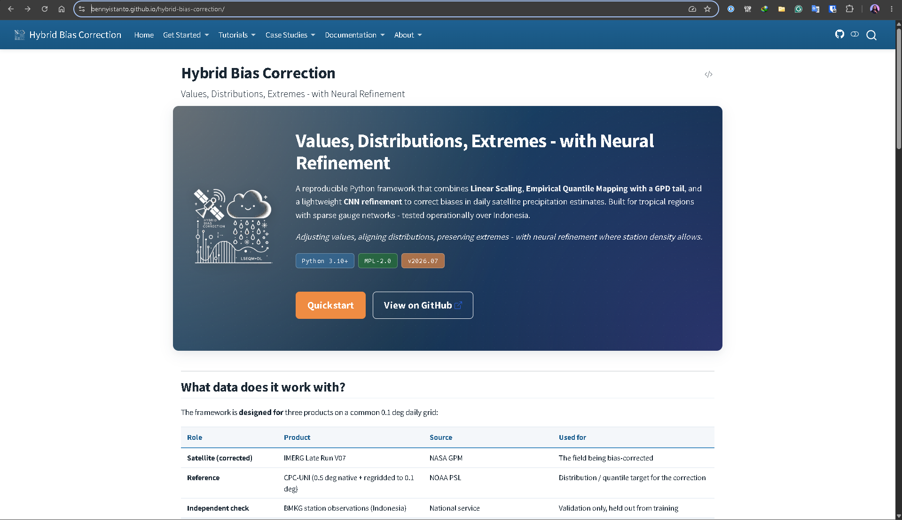
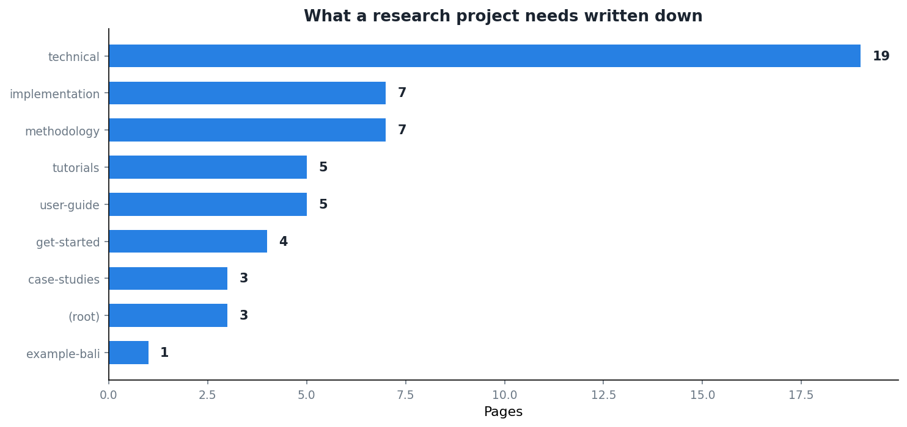

The framework works. The paper is being drafted. By the usual standards of academic software that is the end of the story: the code exists, [the repository](https://github.com/bennyistanto/hybrid-bias-correction) is public, the reader is welcome to work it out.

I have spent the last few weeks writing [a documentation site](https://bennyistanto.github.io/hybrid-bias-correction/) instead, and I want to set down why, because from the outside it looks like procrastination with extra steps.

## The categories are not arbitrary

The pages fall into groups that answer genuinely different questions, and conflating them is the usual failure.

**Get started** answers "how do I run this at all". Installation, configuration, a quick start, the data contract. Four pages, and if these are wrong nothing else matters because nobody gets far enough to read the rest.

**Methodology** answers "why is it built this way". One page per stage, with the equations and the reasoning. This is the closest thing to the paper, and it is where I explain that quantile mapping flattens the tail and a Pareto graft puts it back.

**Implementation** answers "where does that happen in the code". The same seven topics, but the algorithm view: which function, which file, which arguments, what the edge cases are. Splitting methodology from implementation felt redundant when I started and now seems obviously right. They are read by different people at different moments, and a reader who wants to know *why* is badly served by a page about function signatures.

**Technical** is the largest group by some margin, at nineteen pages, and most of it is the auto-generated API reference. It is the least interesting to write and the one I would miss most.

**Tutorials** and **user guide** are the practical middle: how to prepare data, how to run the whole pipeline, how to set up your own region, and what to do when it breaks.

## The page that has earned its place

[Troubleshooting](https://bennyistanto.github.io/hybrid-bias-correction/user-guide/troubleshooting).

It started as a scratch file of things that had wasted an afternoon. It is now the page I send people to most often, and writing it changed the code, because several entries turned into "the framework now handles this and you should upgrade" rather than "here is the workaround".

There is a specific value in writing down a failure you have already fixed. It forces you to articulate what the symptom looked like from outside, which is the only view a user has. Half the entries begin with an error message rather than a cause, because the error message is what someone actually types into a search box.

## Who I am writing for

Three readers, and I try to hold all of them in mind.

Someone in another country with a different satellite product and a different gauge network, who wants to know whether this transfers. The methodology pages are for them.

A reviewer or examiner who wants to check that a number in the paper came out of the code rather than out of hope. The technical pages and the worked example are for them.

**Me, in three years, having forgotten everything.** This is the one that actually motivates the effort, and it is not a joke. I have already had the experience of reading my own code and not knowing why a threshold was set where it was. The documentation is a letter to someone who will have all my ignorance and none of my context.

## The thing I would say to anyone hesitating

The objection is that documentation is what you write when the work is finished, and the work is never finished.

I think that is backwards. Writing the methodology pages made me notice that I could not explain one of my own design choices, which is how the confidence mask got its saturation parameter written down properly rather than left as a number in a config. Writing troubleshooting turned six workarounds into six fixes.

Explaining something to an imagined stranger is a debugging technique. The documentation is a by-product of that, and a useful one, but the reason to do it is what it does to the code while you are writing it.
