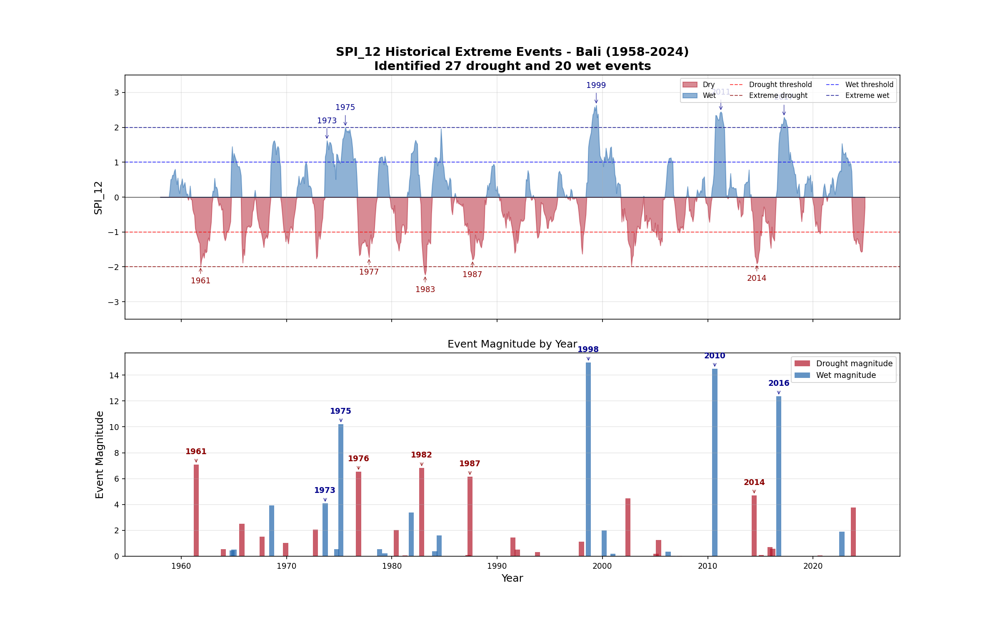
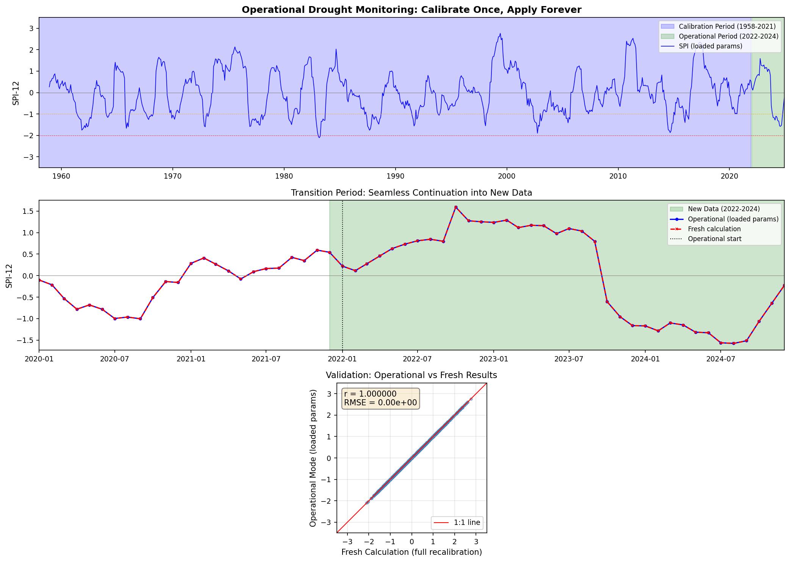
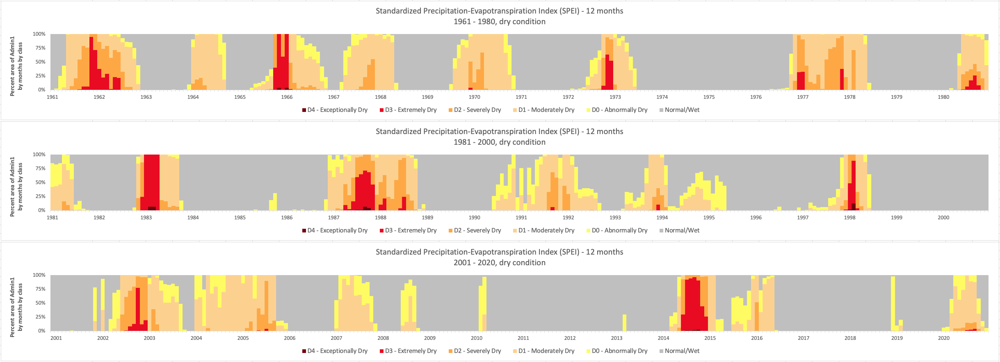
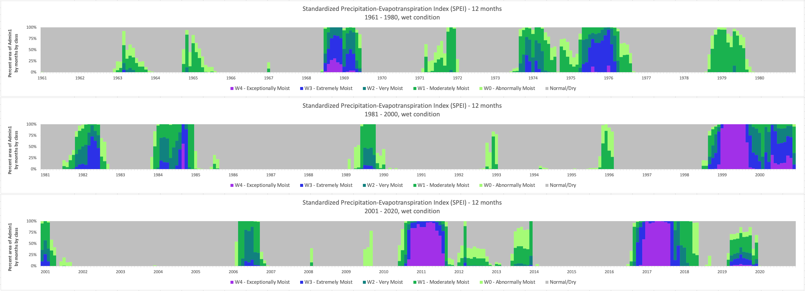
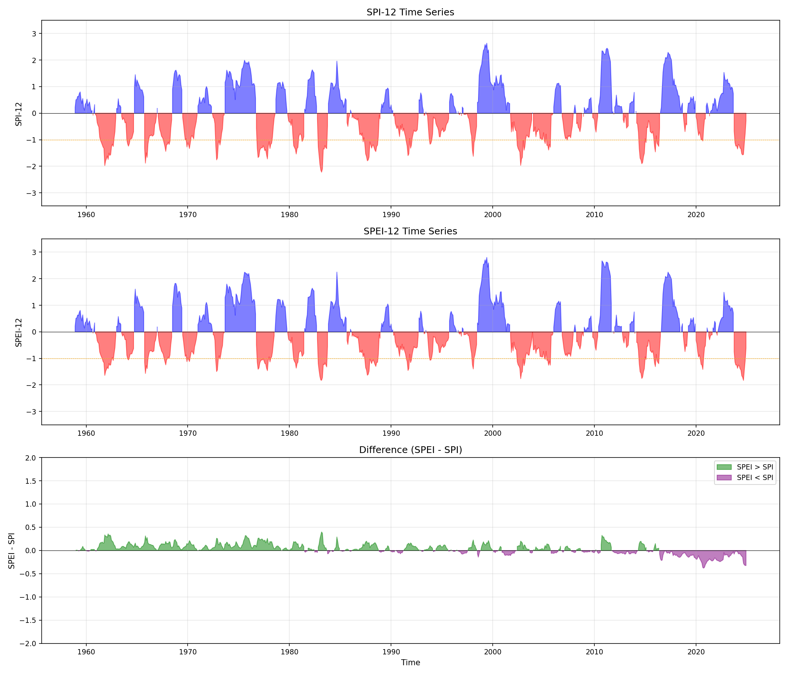
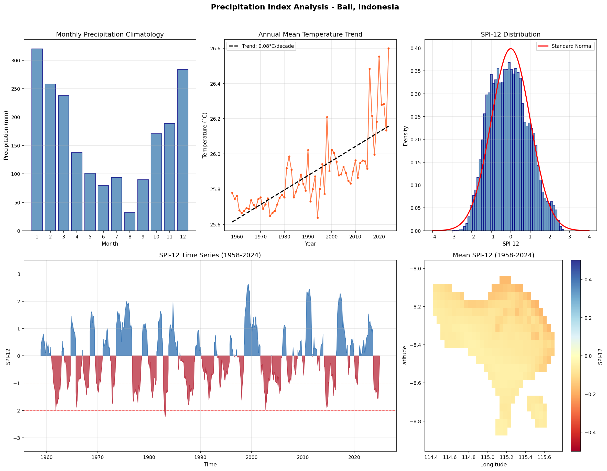

Part of my work is watching for extreme dry and wet periods across whole regions, which means processing global climate datasets on a schedule: CHIRPS, TerraClimate, ERA5-Land, IMERG. For years I did that with existing tools and it was fine.

It stopped being fine when the scale grew. Not because the mathematics got harder, but because the failure modes did. A run would die hours in on one malformed tile. Memory would blow up on a grid that had been fine the previous month. And every month, the whole thing recalculated from scratch.

So I wrote [precip-index](/works/projects/2025-precip-index), a Python implementation of the Standardized Precipitation Index and its evapotranspiration counterpart, SPEI. The [project page](/works/projects/2025-precip-index) covers what it does. This post is about the one design decision that changed how I think about operational monitoring.

## The bug that is not a crash

Here is something I had been doing wrong for years, without any tool ever complaining.

SPI works by fitting a probability distribution to a historical record, then asking where this month's rainfall falls on that distribution. The answer is a z-score: minus two is a severe drought, plus two is exceptionally wet.

The fit needs a calibration period. And the obvious way to run this operationally is to recalculate everything each month, with the new observation included.

That is wrong, and it is wrong in a way that produces no error message.

Every time you refit, the distribution shifts slightly, so **every historical value changes with it**. The drought you reported as -1.87 last month is -1.84 this month. Nothing failed, no warning appeared, and your archive has quietly rewritten itself. A threshold someone built on top of your numbers now fires on a different set of months than it did before.

For a paper, where you calculate once and publish, this never comes up. For monitoring, where the entire point is that this month is comparable to last month, it is the difference between a time series and a rolling opinion.

## Fit once, save the parameters, apply them

The fix is not clever. Fit the distribution over a fixed calibration period, write the parameters to disk, and from then on apply those saved parameters to whatever arrives.

The bottom panel is the check that matters: operational mode against full recalculation, r = 1.000000 and RMSE = 0. Identical, not merely close. That is the answer you should get, because applying an already-fitted distribution is deterministic, but it is worth testing rather than assuming. Having it as a test means the guarantee survives whatever I do to the code later.

The practical payoff is the part I did not anticipate. Once the parameters are a saved artefact rather than something recomputed, the monthly job stops being a fit and becomes a lookup. It also makes the calibration period an explicit, reviewable decision rather than an accident of when the script happened to run.

## Both directions, one code path

The second decision was treating wet extremes as a first-class case rather than a sign flip bolted on at the end.

Run theory describes a spell as an event with properties: duration, magnitude, intensity, peak, and time until the next one. Nothing in that definition cares which side of zero you are on. So the same threshold logic runs in both directions, and a wet spell gets described with exactly the same metrics as a drought.

The clearest way to see that is to put the two outputs next to each other. Same island, same index, same sixty years, same eleven-category WMO scale. Only the direction differs.

Read them together and the ENSO signature is hard to miss. The deep red blocks land in 1982-83, 1997-98 and 2014-15; the purple ones in 1999-2000, 2010-11 and 2016-17. El Niño and La Niña, the same oscillation seen from either side, which is exactly why I did not want a tool that was good at one and grudging about the other.

That matters more in the tropics than it might elsewhere. A monitoring system that handles drought well while treating wet conditions as an afterthought is doing half the job in precisely the years you need it most.

## Why it needed SPEI as well

SPI only sees rainfall. SPEI subtracts potential evapotranspiration first, so it also sees how thirsty the atmosphere is.

For a long time I treated that as a technicality. Then I plotted the difference.

The bottom panel is the one to look at. Before about 1990 the difference is mostly green, SPEI running wetter than SPI. After about 2015 it is consistently purple, SPEI running drier. Same rainfall, same place, same method. What changed is the temperature, and the same record warms at about 0.08 degrees per decade.

So a drought characterised by rainfall alone is steadily becoming a different drought from one characterised by water balance, and the gap is widening. Which of the two you report is a choice, and it ought to be a deliberate one.

## What it costs to run

Numbers from a 128 GB workstation, so that "scalable" means something in particular:

| Index | Dataset | Grid | Months | Time |
|---|---|---|---|---|
| SPI-12, Gamma | CHIRPS v3, 0.05 degree | 17.3M cells | 539 | ~2h 47m |
| SPEI-12, Pearson III | TerraClimate, 0.04 degree | 37.3M cells | 816 | ~26h |

The ratio between them, about nine and a half, is not mysterious once you break it apart: 2.2 times the grid cells, 1.5 times the record length, and Pearson III fitted by maximum likelihood where Gamma has a closed-form solution, plus the PET calculation and more I/O cycles.

Both of those are calibration runs, done once. The monthly operational run against saved parameters is a different order of magnitude, which is the whole argument of this post restated as a wall-clock number.

## Credit, and how it was built

None of this starts from nothing. The foundation is [climate-indices](https://github.com/monocongo/climate_indices) by James Adams, which is the reference implementation most people in this field have used at some point, including me. What I added is multi-distribution fitting, bidirectional event analysis, operational mode, and the chunking that makes global grids practical.

I should also say plainly that much of this was written with [Claude](https://claude.ai/). I am a climate geographer, not a software engineer, and a few years ago the distance between "I know what this tool should do" and "I can build something solid enough to run on a schedule" was wide enough that I would not have started. The domain judgement is mine: which distribution suits which variable, why refitting is wrong, what counts as an event. The scaffolding around it, the tiling, the memory estimation, the tests, was collaborative.

Worth being specific about rather than triumphant. It did not write the tool. It removed the reason I would have abandoned writing it.

Documentation and code, both open:

- [bennyistanto.github.io/precip-index](https://bennyistanto.github.io/precip-index/)
- [github.com/bennyistanto/precip-index](https://github.com/bennyistanto/precip-index)
