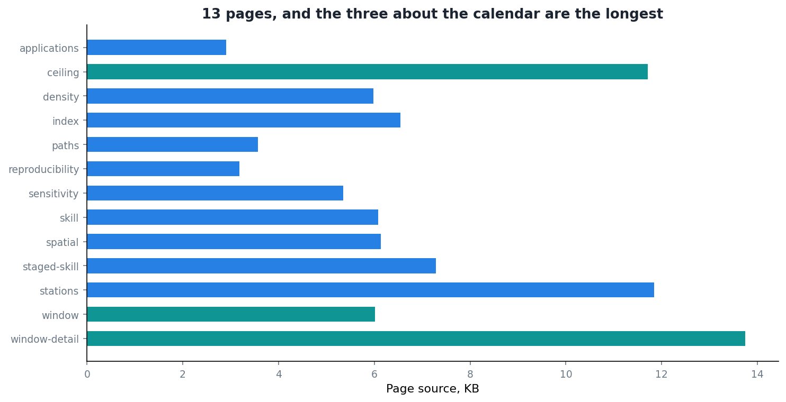

A paper is a fixed set of figures chosen by the author. That is not a criticism, it is what a paper is for: an argument, with the evidence the argument needs, in the order the argument needs it.

The trouble is that the evidence I have is enormously larger than the argument, and every reader has a different follow-up question. Which station? Which dekad? What does that look like in Papua rather than Java? A paper answers none of those, because it cannot.

So I built [a dashboard](https://bennyistanto.github.io/hybrid-bias-correction/viz/).

## What it is

Thirteen pages, built with [Observable Framework](https://observablehq.com/framework/), published alongside the [documentation site](https://bennyistanto.github.io/hybrid-bias-correction). Static files, no server, no database, no login. The data is extracted from the NetCDF outputs into compact files at build time, and the pages read those directly in the browser.

That last constraint drove everything. A dashboard that needs a running backend is a dashboard that will be dead in two years, when whatever was hosting it gets decommissioned and nobody notices. Static files sitting next to the docs will work for as long as the pages resolve, which is the same lifespan as the rest of the project.

## The pages tell you what the project is about

Look at the figure again. The three longest pages are `window-detail`, `ceiling` and `window`. All three are about the calendar problem.

I did not plan that. I built pages in the order the analysis produced them, and the amount of code in each is roughly the amount of interactivity a topic needed. The timing question needed the most because it is the one where a static figure is least adequate: the whole finding is *what happens as you vary the offset*, and a reader ought to be able to move it themselves rather than take my word for where the peak is.

There is a lesson in that which I only noticed writing this post. If you want to know what a project is actually about, look at where its author put the interactive controls.

## What it is genuinely good at

**Following one station.** There are 172 of them. A paper shows you three, chosen by me, and you have to trust the choice. Here you pick.

**Seeing a distribution instead of a summary.** Reporting a median improvement across stations hides whether it was uniform or driven by a handful. On a page you can show every station and let the shape speak.

**Letting the calendar finding be checked rather than asserted.** This is the one that mattered most. The claim that correlation moves from 0.20 to 0.57 as you shift the accumulation window is exactly the sort of claim a sceptical reader should want to poke at. Give them the curve and the controls and they can.

## What it is not

It is not a product. Nobody asked for it, nobody is maintaining a roadmap, and it has no users in the sense that word usually means.

It is also not a substitute for the paper or the thesis. It makes no argument. It has no order. Someone arriving cold would find thirteen pages of exploration and no indication of which two facts actually matter.

That division is deliberate, and it took me a while to be comfortable with it. The paper argues. The documentation explains. The dashboard lets you check. Trying to make any one of the three do all three jobs produces something that does none of them well.

## Was it worth it

Honestly, in terms of readers reached, probably not. Research dashboards are read by very few people, and I have no illusions about this one.

It was worth it for a different reason. Building the timing pages forced me to make the analysis interactive, which meant making it parameterised, which meant discovering that a couple of my scripts had constants baked in where they should have had arguments. The dashboard found bugs in the analysis it was built to display.

That has happened enough times now, across documentation and tests and this, that I have stopped treating it as a happy accident. Anything that forces you to explain a result to something other than yourself will find problems in it.
