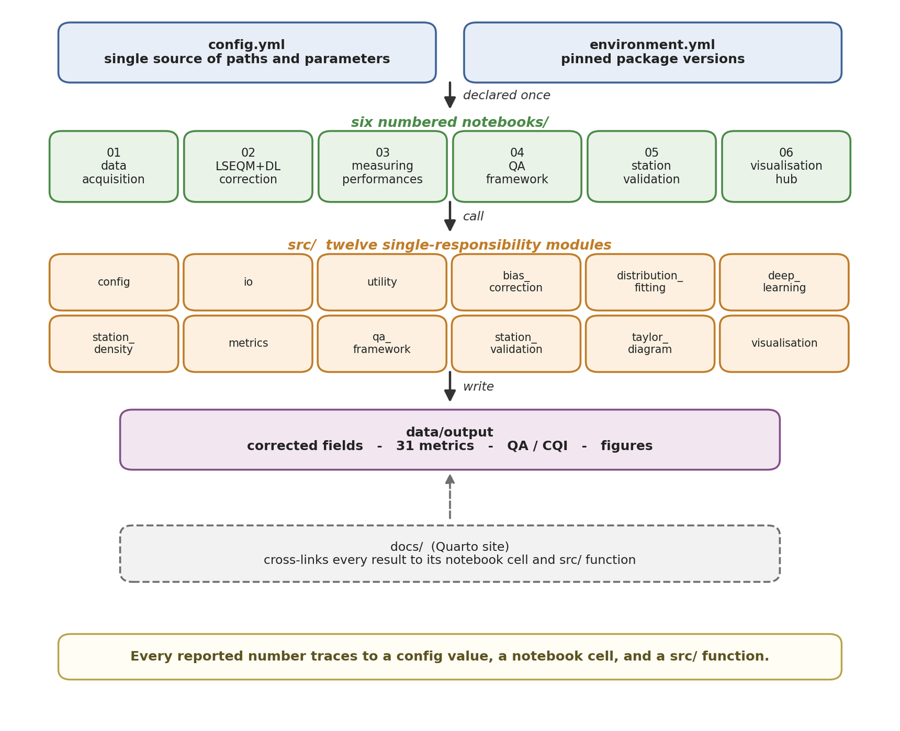
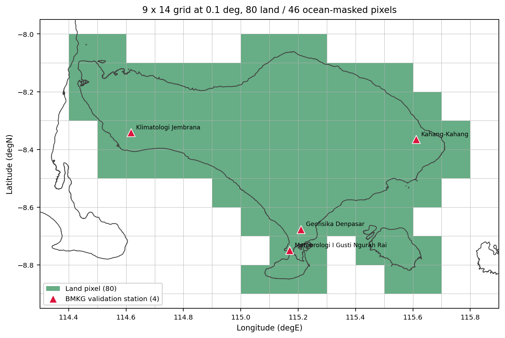

Every paper with code says the work is reproducible. Mine says it too. The word has been worn smooth by repetition, and it usually means "the code exists somewhere", which is a much weaker claim than it sounds.

So the thesis has a results section that treats reproducibility as something to measure rather than assert. Not a paragraph in the discussion. A section in Chapter 4, next to the skill scores.

## The claim, stated so it can fail

**The correction-to-visualisation pipeline runs end to end, over a real subdomain, for all 36 dekads of the full 2001 to 2025 record, on a free [Google Colab](https://colab.research.google.com) CPU runtime with no hardware accelerator, in 72.1 minutes.**

Every clause is doing work.

*End to end* means notebooks 02 through 06: correction, metrics, quality assessment, station validation, visualisation. Not one convenient step.

*All 36 dekads, full record* means not a demonstration slice.

*Free tier, no accelerator* means no institutional compute, no GPU quota, no login beyond a Google account.

*72.1 minutes* is measured from the notebook cell-execution metadata, not estimated.

## Why the domain is small, and why saying so matters

The subdomain is Bali: a 9 by 14 pixel grid at a tenth of a degree, 126 pixels.

That is small, deliberately, because the point is to fit inside a free-tier session while exercising every stage of the pipeline. It is not a timing estimate for the national run, which has on the order of ten to a hundred thousand land pixels and would scale roughly with pixel count for the per-pixel stages.

I have written that caveat into the thesis in more or less those words, because a 72-minute figure without it invites exactly the wrong inference. The number demonstrates that the machinery runs on commodity infrastructure. It does not demonstrate that Indonesia runs in an afternoon.

Within the run, the metrics notebook dominates: it computes the full 31-metric catalogue at every pixel and every dekad. The correction notebook, which trains a network per dekad, is second.

## What a reproducibility claim needs to be checkable

Four things, and I did not have all of them at the start.

**Recorded runtimes, not remembered ones.** From execution metadata.

**Fixed random seeds.** A network with a different initialisation gives different numbers, and "roughly the same" is not reproduction.

**Pinned dependency versions.** In an environment file, in [the repository](https://github.com/bennyistanto/hybrid-bias-correction).

**A bundled example.** Eleven megabytes, shipped with the code, so nobody has to find 1.7 GB of inputs before they can start. This is the one I would most defend to anyone who thinks it bloats the repository. A reproducibility claim that begins with "first download the data" has a failure point before the code has run at all.

## The uncomfortable question underneath

There is a version of this I have to be honest about. I am the one who ran it, on my own code, with my own data, and reported that it worked.

That is not independent verification. It cannot be. What it is, is a claim specified precisely enough that someone else could contradict it: here is the domain, here is the runtime, here is the hardware, here is the archive, go and see.

Most reproducibility statements are not falsifiable in that way. "Code available on request" cannot be wrong. "72.1 minutes for 36 dekads on a free CPU runtime" can be, and if someone runs it and gets four hours, I want to know.

Putting a number on it is not proof. It is the difference between a claim and a gesture.

## What it changed about the code

Writing this section found things, in the way that trying to explain something always does.

Two notebooks had absolute paths from my machine. One stage depended on an output that an earlier notebook wrote only if you had run a particular optional cell. Nothing that would fail for me, because my environment already had all of it. Everything that would fail for a stranger on a clean runtime.

You cannot find those by reading. You find them by starting from nothing and watching where it breaks.
