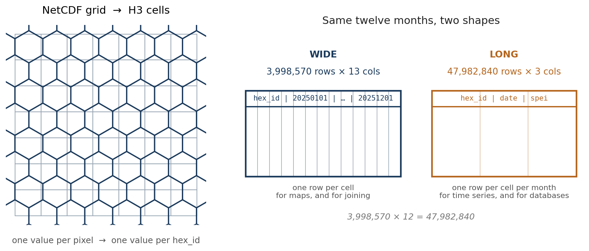

Climate data lives in NetCDF and almost nothing else does.

That is not a complaint about NetCDF. It is a good format, it is the right home for a gridded time series, and I have [written about how to make one properly](/blog/20241015-netcdf-that-other-tools-can-actually-read). But the moment someone asks a question that involves anything other than the climate, you have a problem.

Population is a table. Admin boundaries are polygons. Household survey data is a table with coordinates. Mobile phone activity is a table. Crop statistics are a table. And your drought index is a three-dimensional array on a regular latitude-longitude grid.

Combining them usually means one of two unpleasant things. Either you rasterise everything onto the climate grid, which destroys whatever precision the other datasets had, or you compute zonal statistics per admin unit, which throws away all the spatial detail inside each unit and produces a number that means very little in a district the size of Belgium.

There is a third option, which is to give every dataset the same key.

## Hexagons as a join key

[H3](https://h3geo.org/) is a global hexagonal grid index. The Earth is tiled with hexagons at a series of nested resolutions, and every hexagon has an identifier. At resolution 6, there are exactly 14,117,882 of them covering the planet, averaging about 36 square kilometres each.

The number is exact rather than approximate because H3 has a closed form: `2 + 120 × 7ʳ` cells at resolution `r`. Each cell subdivides into seven at the next level down, which is why the sevens.

What makes it useful here has nothing to do with hexagons being pretty. It is that `hex_id` is a **string**, and a string is something a database can index and join on.

Once your drought index is a table of `hex_id, date, value`, joining it to population is an inner join. Not a reprojection, not a resampling decision, not an argument about which grid wins. A join, in whatever tool you already use, by anyone on the team who has never opened a NetCDF file.

The other thing you get for free is that hexagons are much closer to equal-area than a latitude-longitude grid. A 0.05 degree cell at the equator and one at 50 degrees north differ in area by more than a third. If you are averaging or counting across latitudes, that difference is silently in your answer.



## The conversion itself

The heavy lifting is done by [h3ronpy](https://github.com/nmandery/h3ronpy), which will take a numpy array plus an affine transform and hand you back a dataframe of H3 cells:

```python
from h3ronpy.pandas.raster import raster_to_dataframe

h3_df = raster_to_dataframe(
    data_slice,          # a 2D array for one timestep
    transform,           # affine transform from the NetCDF coordinates
    h3_resolution,       # 6
    nodata_value=np.nan,
    compact=False,
    geo=False,
)
```

`compact=False` keeps every cell at the requested resolution rather than merging uniform regions into bigger parent cells. Compaction is clever and saves space, but it produces a mixed-resolution output, and mixed resolution is exactly what you do not want in something you are about to join on. `geo=False` skips building the polygon geometry, because the identifier is the point and the geometry can be reconstructed from it any time.

The affine transform has to be derived from the NetCDF coordinates rather than assumed:

```python
def get_transform(ds):
    lon, lat = ds.lon.values, ds.lat.values
    pixel_width  = (lon[-1] - lon[0]) / (len(lon) - 1)
    pixel_height = (lat[-1] - lat[0]) / (len(lat) - 1)
    return Affine.translation(lon[0], lat[0]) * Affine.scale(pixel_width, pixel_height)
```

## The line that will get you

```python
data_slice_flipped = data_slice[::-1, :]
```

NetCDF files very often store latitude descending, north at row zero. Affine transforms and most raster tooling assume the opposite. If you hand the array over without flipping it, everything converts perfectly, nothing raises an error, and your drought map comes out mirrored about the equator.

I have [written about this bug before](/blog/20250814-the-bugs-that-never-raised-an-exception), in a different project, where it also took embarrassingly long to spot. It is one of a small family of geospatial errors that produce a plausible-looking wrong answer, and the only real defence is to plot the first timestep and look at it before you process forty years.

## Two shapes, and why both

The script writes the same result twice, and I have stopped thinking of that as wasteful.

**Wide** is one row per hexagon, one column per date. `3,998,570 rows × 13 columns` for a year of monthly data: the `hex_id`, then twelve dates. This is the shape you want for a map, because a map is one moment in time and you just pick a column. It is also the shape you want to join against other per-cell data, because there is one row per cell and joins stay one-to-one.

**Long** is one row per hexagon per date. `47,982,840 rows × 3 columns` for the same year. This is the shape databases want, the shape most plotting libraries want for a time series, and the shape you need if you are going to filter by date rather than select a column.

Same numbers, and 3,998,570 × 12 = 47,982,840 exactly. Converting between them is a `pivot` or a `melt`, but doing it once at write time on a machine with memory is a great deal more pleasant than doing it later on forty-eight million rows.

Both go out as [Parquet](https://parquet.apache.org/), which is columnar, compressed, typed and readable by essentially everything. The value column is `float32`, which halves the size against the default `float64` and is far more precision than a standardised index deserves.

## Memory is the whole engineering problem

Global CHIRPS SPI, resolution 6, monthly, 1983 to 2024. That is 42 years, and roughly four million hexagons per timestep.

You cannot hold that. So the script does two things.

It **chunks the NetCDF read** with dask, sizing the chunks against a memory limit rather than picking a number:

```python
def optimize_chunk_size(shape, mem_limit_gb=4):
    chunk_size = int(mem_limit_gb * 1024**3)
    time_chunk = min(12, shape[0])
    spatial_chunk = int(np.sqrt((chunk_size / 8) / time_chunk))
    ...
```

And it **processes one year at a time**, writing that year's Parquet pair and then explicitly collecting garbage before starting the next. The loop logs memory before every timestep, which sounds excessive until the first time you watch it climb and know exactly which year to blame.

Neither is elegant. Both are the difference between a job that finishes and a job that dies at 2 a.m. on year 31.

## What this is for

The specific case was global SPI from CHIRPS and global SPEI from TerraClimate, both landing in the same table structure so they can sit alongside each other and alongside everything else in an analytics stack.

But the pattern is general and it is the reason I keep coming back to it. Any NetCDF with a regular grid goes through the same three steps: derive the transform, convert each timestep to H3, write Parquet in both shapes. Rainfall, temperature, evaporative demand, a bias-corrected satellite product. The output is always a table with a string key.

That is the actual point. Not the hexagons, which are just a sensible tiling. The point is that a climate dataset stops being something only the climate person can open, and becomes a table that anyone in the room can join to their own data without asking permission or learning xarray.

The [notebook is a gist](https://gist.github.com/bennyistanto/c09e6f97b98a2448acf9b82ad76bdc0b), written for Colab because that is where the memory was.
