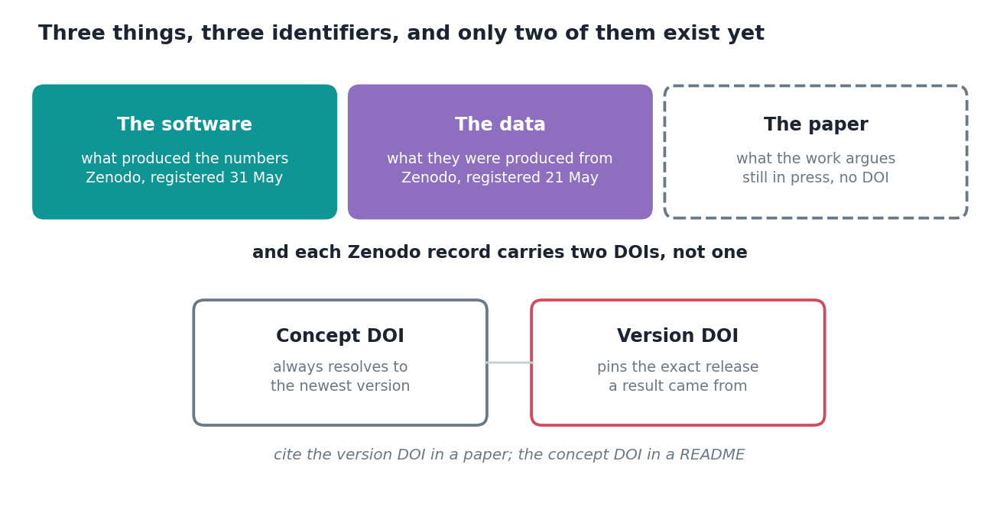

Right now, today, the software behind this project is citable and the data archive is citable. The paper is not. It is through review, revised, accepted in substance, and it has no DOI because it has not been issued yet.

That gap is temporary and slightly absurd, and it is also the best argument I have for why I stopped thinking of "citing this work" as one act.

## Three objects, three claims

| If you want to say | You cite | Because |
|---|---|---|
| "I used their method" | the paper | it is the argument, not the artefact |
| "I ran their code" | the software | a paper describes a method; software *is* one, at a revision, with defaults |
| "I analysed their outputs" | the data | inputs, masks and corrected fields, as archived |

Collapse those into one identifier and you lose the distinction. They are three different statements about what someone actually did, and a reader deserves to know which is meant.

The current situation makes the point sharper than any argument could. Someone could take the pipeline today, run it, and cite it precisely. They could not cite the paper, because the paper does not exist as a citable object yet. The work and the write-up are separable, and treating them as one thing had been hiding that from me.

## Then Zenodo hands you two DOIs

Deposit something and you get a pair, differing by one digit, with very little explaining which to use where.

- **Version DOI.** Points at one specific release. Never changes.
- **Concept DOI.** Points at whatever the newest version is.

Both valid, answering different questions. The rule that eventually made it click:

> A paper cites a version DOI. A README cites a concept DOI.

If a figure came out of a particular release, a reader reproducing that figure needs *that* release, not whatever I have published since. Citing the concept DOI there sends them to a moving target and quietly breaks the reproducibility claim the paper is making.

Whereas someone arriving at the repository wanting to use the framework should land on the current version, which is exactly what the concept DOI does.

I had this wrong at first, in the direction you would expect: one identifier everywhere, because two looked like unnecessary complication.

## `CITATION.cff` does the boring part

Machine-readable citation metadata in [the repository](https://github.com/bennyistanto/hybrid-bias-correction) root. Authors, ORCIDs, affiliations, title, version, DOIs, licence, keywords.

The immediate payoff is a "Cite this repository" button on GitHub and reference managers that can consume it. The larger one is that the citation lives in version control beside the thing it describes, so when the version changes the citation changes in the same commit.

Twenty minutes. The alternative is that everyone citing your software reconstructs a reference from whatever they can piece together, and no two of them match.

## What I would tell anyone doing this

**Deposit before you write the availability statement, not after.**

My submitted manuscript said the data and code were "available from the corresponding author on reasonable request". Standard formula. Nobody flagged it. It survived until I re-read the author instructions during the revision two days ago, and it would otherwise have gone to print.

It would also have been false in spirit. The entire design goal was that someone could re-run this *without* contacting me. Shipping a "contact the author" clause on a project built for reproducibility is a contradiction, and it took an accidental re-reading to catch.

Depositing takes an afternoon. Doing it first means the statement is true when you write it, instead of something you fix later and hope nobody noticed.
