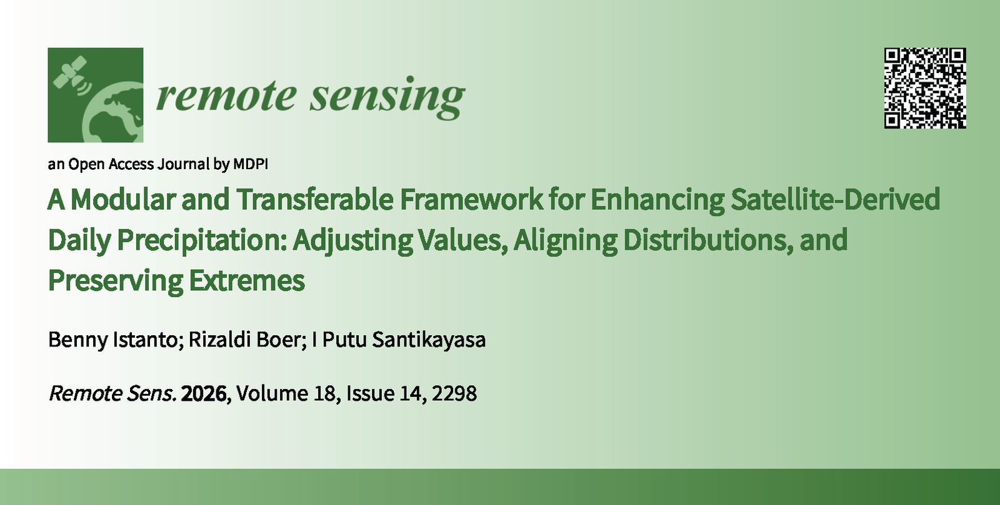
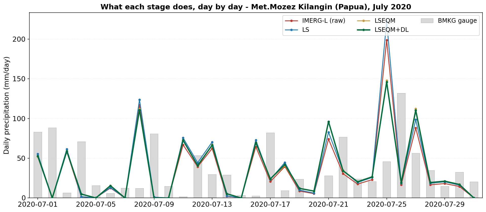
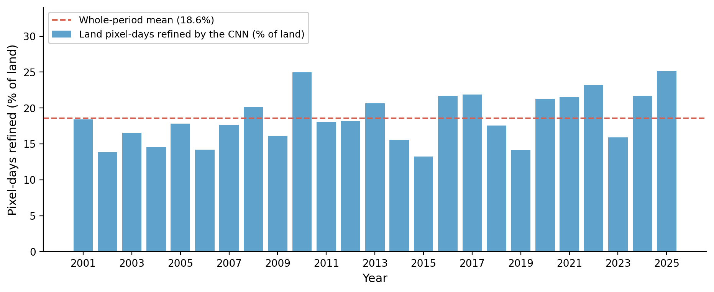

It is out.

Istanto, B.; Boer, R.; Santikayasa, I.P. A Modular and Transferable Framework for Enhancing Satellite-Derived Daily Precipitation: Adjusting Values, Aligning Distributions, and Preserving Extremes. *Remote Sens.* **2026**, *18*, 2298. <https://doi.org/10.3390/rs18142298>

## What it argues

Four stages, each fixing what the one before leaves behind. Linear scaling gets the mean right and leaves the shape wrong. Quantile mapping fixes the shape and flattens the tail. A Generalized Pareto tail restores the extremes. A small convolutional network tidies the spatial pattern, gated by how much gauge evidence exists at each pixel.

Applied to IMERG Late Run over Indonesia, 2001 to 2025, on the tenth-degree grid, and validated against 172 stations that were never used in the correction.

Four stages sounds like a lot until you see a month of them side by side, at which point the honest summary is that three of the four are doing very little on most days.

The neural stage is the extreme case. It is gated by gauge evidence, and across the full twenty-five years it touches under a fifth of land pixel-days.

That is the design working, not failing. A network that rewrote every pixel would be inventing detail the gauge network cannot support anywhere east of Java.

The month plot is also the clearest picture of the finding the paper is really about. Watch the tall lines against the tall bars: they are the same storms at close to the right sizes, and they keep landing beside the gauge rather than on it.

The result I would most like people to take away is not any of the skill numbers. It is that **the daily correlation everyone reports for satellite rainfall in this region is measuring the calendar as much as the meteorology**. The satellite accumulates on a UTC day; the gauge day runs from the morning observation. Align the two windows and correlation over the GPM era moves from 0.20 to 0.57, without touching a single value.

## Where everything is

Three identifiers, because these are three different things.

| | |
|---|---|
| Paper | [10.3390/rs18142298](https://doi.org/10.3390/rs18142298) |
| Software | [10.5281/zenodo.20473507](https://doi.org/10.5281/zenodo.20473507) |
| Data | [10.5281/zenodo.20287846](https://doi.org/10.5281/zenodo.20287846) |

The code is also on [GitHub](https://github.com/bennyistanto/hybrid-bias-correction) with a [documentation site](https://bennyistanto.github.io/hybrid-bias-correction) and an [interactive dashboard](https://bennyistanto.github.io/hybrid-bias-correction/viz/), plus an eleven-megabyte Bali example that runs the whole pipeline end to end in about 72 minutes on a free [Colab](https://colab.research.google.com) tier. That last part matters more to me than it probably should: anyone can check the machinery works without asking permission or spending money.

*Remote Sensing* is open access under CC BY, so the paper is readable by anyone, which was a condition rather than a preference.

## The unglamorous part

The Data Availability Statement I submitted said the data and code were "available from the corresponding author on reasonable request".

I found it re-reading the author instructions partway through the revision. Nobody had flagged it. It is a phrase you see constantly, it is close to what the template suggests, and it would have gone into print.

What made me wince was the paragraph directly above it. The same statement already gives working URLs for all three inputs: IMERG from GES DISC, CPC-UNI from NOAA, the station observations from BMKG's public portal. Every input I used, openly linked. Then a line underneath telling you to email me if you wanted the outputs.

So the revision deposited them. The data went to Zenodo, the code to GitHub, and the statement now points at both instead of at me. Nobody asked for that. It went into the response to reviewers under "we have also", which is where you put the things you fixed because you noticed them yourself.

## What is next here

Thesis examination in four days. Same research, but a thesis has to show the reasoning rather than report the result, and I genuinely do not know yet how that will go.
