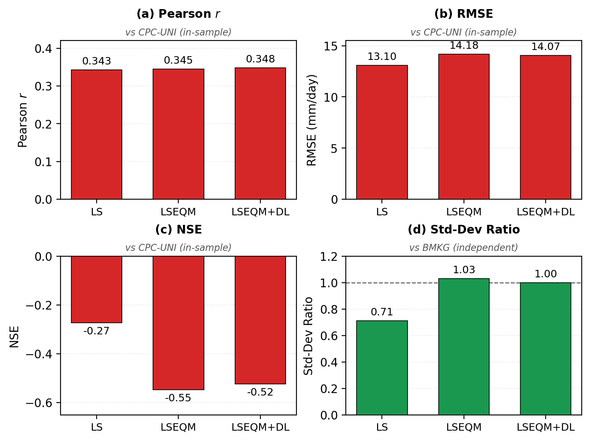

> From Figure 13, LS seems best - why?

That is reviewer 1, and it is the comment that cost me a week.

Almost nobody publishes their reviews, which is a shame, because for anyone about to submit a first paper the reviews are worth more than any amount of general advice about submitting a first paper. So here are mine, in their own words, minus the ones about figure labels being too small.

## Reviewer 1, who found the structural problem

The comments came in a sequence, and reading them back you can watch someone circling something.

> Figure 11 - where is LSEQM? Does LSEQM+DL cover it?

> Figure 13c, 13d - I still can't see LSEQM.

> LSEQM is close to LSEQM+DL, so why do you need it?

> From Figure 13, LS seems best - why?

> The conclusion does not show LSEQM+DL as the best choice.

Five comments, one problem. The reviewer was reading my tables, seeing the simplest correction win, and not finding an answer for why the paper recommended the complicated one.

They were right, and the reason is uncomfortable: **it arises by construction.**

Look at the figure. Against the gauge analysis, RMSE gets *worse* through the pipeline, 13.10 to 14.18. Nash-Sutcliffe gets worse, -0.27 to -0.55. On those panels the simplest correction wins outright.

But the gauge analysis is the correction *target*. Linear scaling stays closest to it precisely because it barely changes anything, nudging the mean while preserving the satellite's distribution shape. Scoring against the thing you calibrated to rewards whichever method moved least. That is not evidence. It is a tautology wearing a table.

The evidence has to come from the independent station network, which never entered the fitting. There the ordering reverses:

| Scored against | Standard-deviation ratio, LS | Standard-deviation ratio, full pipeline |
|---|---|---|
| The calibration target | near unity, by construction | 1.03 |
| **The independent stations** | **0.71** | **1.00** |

The fix was not new analysis. It was leading with the right table. The Results introduction and the Conclusions were rewritten to put the independent validation first, and the calibration-referenced numbers were explicitly relabelled as the training-side view.

### Why that comment has stayed with me

Three weeks later, my thesis examiner said this:

> In every comparison, include CPC as the reference and BMKG as the independent check. So far the text leans on BMKG.

Same problem. Different words. Two entirely independent reads, one from a journal reviewer who saw a manuscript and one from an examiner who saw a thesis, converging on a distinction I had written about and never made load-bearing.

When two people who cannot have spoken to each other find the same soft spot, it is not a matter of taste.

## Reviewer 2, who asked the question I had not tested

> Stationarity assumption / climate-change trend.

Six words, and I had no answer, because I had never checked whether the climate I was assuming to be stationary actually is.

So I ran a Mann-Kendall test on annual domain-mean precipitation over 2001 to 2025:

| Series | Trend | p |
|---|---|---|
| Gauge analysis | +12.8% per decade | 0.002 |
| Satellite | +8.1% per decade | 0.027 |

Both significant. Both partly confounded by changes in the observing system rather than the atmosphere: contributing gauges dropped after 2005, and the satellite constellation changed in 2014. So the honest reading is "there is a signal, and it is entangled with how the signal was measured."

It went into the Limitations, where it should have been from the start.

> Section 4.2 - highlight the POD/CSI deterioration in the limitations.

This one stung, because I had known about it for a year and written about it publicly, and had still not put it in the manuscript's Limitations with any prominence. Matching the gauge wet-day frequency drops probability of detection from 0.78 to 0.65 and critical success index from 0.53 to 0.49 at the 1 mm threshold. Partly offset by fewer false alarms and better detection above 20 mm/day. Anyone who cares mainly about light rain may prefer the uncorrected product.

Knowing a weakness and *placing* it where a reader will trip over it are different acts, and only the second one counts.

## Reviewer 3, who checked my arithmetic

> CQI classification thresholds are inconsistent (Section 2.4.3 vs Figure 8).

They were. A six-tier scheme in one place, a four-tier scheme in another, and the boundaries did not line up.

That prompted a full re-check of every reported number against its source, which turned up two more: a skill score quoted differently in the Conclusions than in the Methods, and thresholds that disagreed between a section and its own figure. None changed a conclusion. All three were mine.

## The one nobody asked for

Re-reading the author instructions during revision, I noticed the submitted manuscript said the data and code were "available from the corresponding author on reasonable request".

Standard phrase. Nobody flagged it. It would have gone to print.

It would also have been false in spirit, since the entire design goal was that someone could re-run this *without* contacting me. Fixed to real deposited DOIs before publication, and it is the change I am least proud of having needed to make.

## What I would tell someone submitting their first paper

Three things.

1. **The cosmetic comments outnumber the substantive ones,** and they are not the point. Fix them fast and without ego.
2. **The substantive ones are almost always about framing, not analysis.** Not one reviewer asked me to compute anything new. They asked me to lead with different numbers, to say what a comparison can and cannot establish, and to move a known weakness somewhere a reader would find it.
3. **The comment that stings is the correct one.** Reviewer 1's point was uncomfortable precisely because I had half-known it and not followed through. Discomfort is a good signal that someone has found the soft part.
