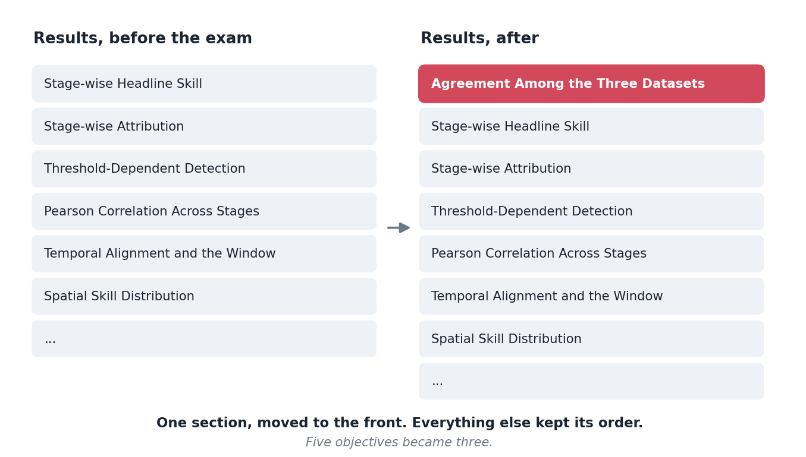
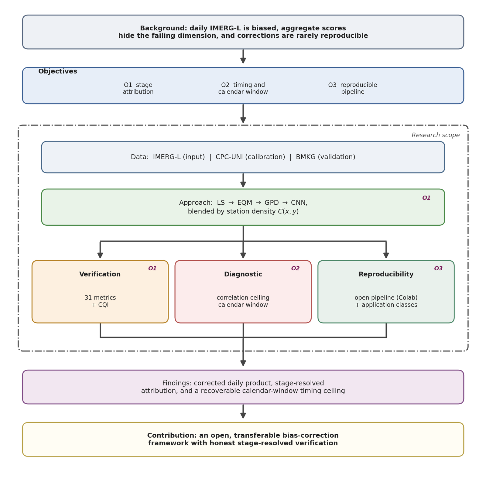

Examination on 20 July. Passed, revision required.

I had braced for someone finding an error. What happened was stranger and more useful: nobody disputed a number. The feedback was that the thesis told its story in the wrong order, and once I understood what was being asked, I could not unsee it.

## What the results chapter looked like before

It opened with stage-wise headline skill. Here is the pipeline, here is what each stage does to the metrics, here is where it improves and where it does not. Perfectly logical: the thesis is about a correction framework, so lead with the correction framework's performance.

The three-way dataset comparison, the one where the gauge analysis agrees with independent stations *worse* than the raw satellite does, was in section 4.6. A diagnostic. Interesting, supporting, tucked in the middle.

## What was actually asked

The substance, with the editorial items set aside, came to four things.

**Justify the inputs before using them.** Why this satellite product, why this gauge reference. And crucially: *how good is that gauge reference?* It reaches the international exchange from the same national network I validate against, and I had already reviewed that network's data quality and found it wanting. That review existed. It was not in the thesis.

**Then compare all three pairs, and let the window mismatch enter there.** Satellite against gauge analysis, satellite against stations, gauge analysis against stations. Establish the calendar problem as an observation about the data, before any correction is applied to it.

**Then correct, and compare again.** Including the corrected product against the stations under a shifted label.

**Use the reference and the independent check consistently.** The gauge analysis is what the correction is fitted to; the station network is what judges it. Every comparison should say which is which. My text had been leaning on the stations for both roles.

## What changed

Less than you would expect, and it changed everything.

The results chapter gained **one section, at the front**. Everything below it kept its original order. The five objectives were merged into three.

That is the whole structural revision. One section moved to the front of one chapter, and three objectives where there had been five.

The merge is where the change is clearest. Look at what the second objective is now: **timing and the calendar window**. Not a sub-question inside a verification objective, not a diagnostic supporting something else. One of the three things the thesis exists to do.

That promotion is the reframe. Everything else followed from it.

But the thesis it produces is a different thesis. Before, it was: here is a bias correction framework and here is how well it works. After, it is: here is why the daily numbers everyone reports for this region are partly an artefact of two archives disagreeing about when a day starts, and here is a correction framework built with that understood.

The second version is more interesting and more honest, and I had all the material for it already.

## Why I had not written it that way

I have thought about this more than is comfortable.

The calendar finding arrived late, well after the framework was built. By the time I understood it, the thesis had a shape, and the finding got fitted into the shape rather than being allowed to change it. Sunk structure, in the way people talk about sunk cost.

There is also something about what a methods thesis is supposed to look like. A framework, its stages, its evaluation. Leading with a two-page argument that the standard comparison is mislabelled felt like starting with a digression, because I had classified it as a digression when I found it.

An examiner reading it fresh had no such attachment. They saw the most interesting thing in the document sitting in section 4.6 and asked why.

## The item where I was right

One piece of feedback asked me to explain why the simple correction performs better below 5 mm per day while the full pipeline performs better above it.

I went to check, and the crossover is at 20 mm, not 5. The premise was wrong.

Being right did not get me out of anything. The question existed because the text had not made the threshold behaviour clear enough for a careful reader to retain the correct number, and a reader who has just spent an hour on your chapter is the best evidence you will get about whether that chapter is clear. So the revision states the crossover explicitly, at the right value, rather than leaving it to be inferred from a figure.

The version of me that argues the examiner misremembered would have been technically correct and would have fixed nothing.

## What is still open

One item I have not resolved: a question about the extremes in the input data, and whether the character of the input extremes explains part of the behaviour downstream. My own notes from the day record it as "not fully understood yet", and that is still true.

I would rather write that here than pretend the revision closed everything.

## The general version

The most valuable feedback I have had on this project, from a journal reviewer three weeks earlier and from an examination panel, was structurally identical: **you have the right material and you are leading with the wrong part of it.**

Neither asked for new work. Both asked for a different order.

I would not have found either myself, and I think the reason is simple. You cannot read your own document for the first time. Structure is invisible from inside, because from inside you already know why everything is where it is.
