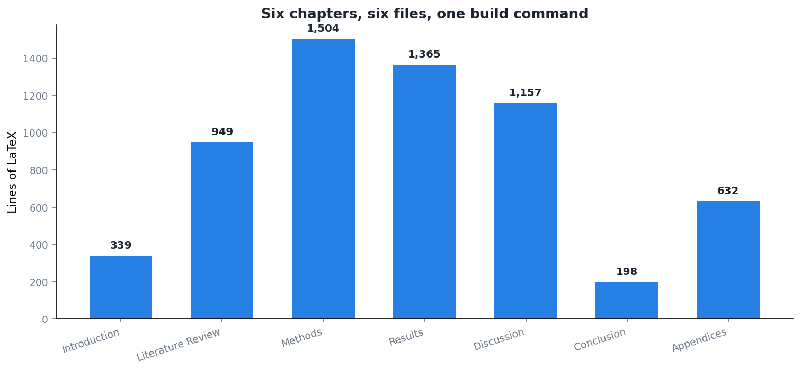

Final revision submitted for approval last week. Which makes this a reasonable moment to write down the decision I am most glad about, and which had nothing to do with the science.

Let me be straight about the starting point: **I am not good at Word.** Not in the sense of having principled objections. In the sense of not knowing where things are, and of spending twenty minutes on a task that a fluent user would finish in two.

Tables were the worst of it. I would get a table looking right, add a row, and watch the column widths redistribute themselves according to logic I could not follow. Figures were nearly as bad: place one, adjust the text above it, and it would relocate to somewhere structurally reasonable and visually absurd. Then the numbering would shift, and the cross-references would need checking, and I would lose the thread of the paragraph I had been writing.

None of that is Word's fault. It is a tool I never learned properly. But the thesis was going to be two hundred pages with a hundred and fifty figures and a bibliography under constant revision, and "I will get better at it as I go" was not a plan.

## What switching actually bought

**Figures go where they go.** I write `\begin{figure}[H]` and stop thinking about it. Two hundred pages of not thinking about figure placement is a real amount of attention returned to the writing.

**Cross-references stop being a liability.** Every figure, table, section and equation has a label. I refer to the label. If I move a section, or insert one, or reorder an entire appendix, every reference in the document updates on the next build. During the post-examination revision I reordered the appendices completely, and the correctness of several hundred internal references was not something I had to think about.

**The bibliography is a database, not a list.** Entries live in one `.bib` file. Citation style is one line. When I had to check that references were correctly ordered and formatted to the institutional standard, it was a matter of fixing the style file once rather than a hundred and forty entries individually.

**The document is text, so git works on it.** Which turns out to be the larger half of the story.

## The repository

[One repository](https://github.com/bennyistanto/msc-thesis) for the thesis, separate from the framework's. One file per chapter. A `main_thesis.tex` that includes them. A `references.bib`. A build script. A CI workflow that compiles on push, so a broken build is caught immediately rather than at the moment I need a PDF.

What that combination gives you, which I did not fully anticipate:

**A working thesis at every commit.** Not a folder of `thesis_v3_FINAL_revised_actualfinal.docx`. A history where any point is a document that compiles.

**Frozen states that stay frozen.** The pre-examination version sits in its own directory, exactly as it was on the day. When I wanted to know precisely what the revision had changed in the results chapter, I diffed two files and got an answer in seconds. That comparison is the reason I could write the previous post with any confidence about what actually moved.

**Diffs that mean something.** "This paragraph changed" rather than "this document is different".

## Where Word genuinely won

I want to be fair, because there is one thing LaTeX has no good answer for.

**Supervisors use track changes.** They are right to; it is the tool they know and it works well for the job. So the review cycle involved exporting to Word, receiving marked-up comments, and porting them back by hand. That is friction I created for other people by making a choice that suited me.

There is no clean solution I found. The conversion is lossy, the round-trip is manual, and telling a supervisor to learn a diff tool is not a serious suggestion. If your supervisors want Word and you have no strong reason otherwise, that is a legitimate reason to stay.

I had a strong reason otherwise. It was that I could not use Word well enough to write two hundred pages in it without the tool consuming attention I needed for the argument.

## The part that is not about typesetting

The thing that surprised me is how much of the benefit came from treating the thesis as a project rather than a document.

A build command. A CI check. Dated snapshots at every stage that mattered. A `CITATION.cff` so the thing is citable. Machine-readable metadata. Version control with meaningful history.

None of that requires LaTeX specifically. All of it requires the source to be text, which in practice means LaTeX or Markdown.

And once you have it, a question like "what did the examination actually change" stops being a memory exercise and becomes a command you run.
