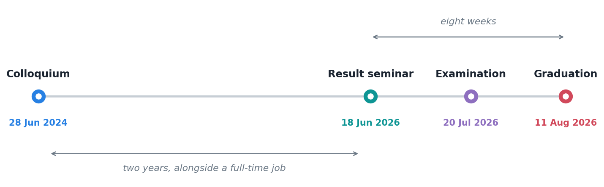
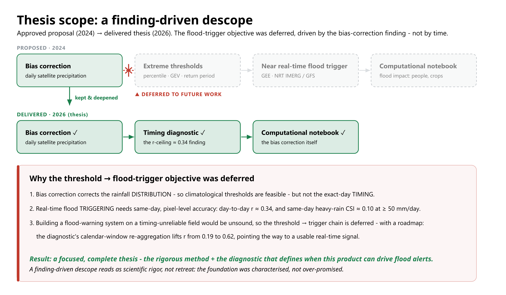

The letter from the faculty came through today. It is done.



Two years between the colloquium and the graduation letter, all of it alongside a full-time job. Three points along the way where the work had to leave my machine and be defended out loud, and those three are the ones I remember.

## The three rooms

**Colloquium, 28 June 2024.** The proposal. Here is a problem, here is what I think I will do about it. In hindsight almost everything technical I said that day was wrong in some detail, and it did not matter, because the point of the colloquium is to establish that the question is worth two years rather than that you already know the answer.

::: {.callout-note collapse="true" title="Slides - Colloquium, 28 June 2024"}
```{=html}
<iframe 
  src="https://docs.google.com/presentation/d/e/2PACX-1vRRqGeUQfV5GuCoP7KpJbJx6fD0GwXa2p5irwm5YJOf5Kb1nQcC4DDdxd4oKTypvQ/pubembed?start=false&loop=false&delayms=3000" 
  frameborder="0" 
  width="1280" 
  height="749" 
  allowfullscreen="true" 
  mozallowfullscreen="true" 
  webkitallowfullscreen="true">
</iframe>
```
:::

**Result seminar, 18 June 2026.** Almost two years later. This is where you find out whether the thing holds together in front of people who have not been living inside it.

::: {.callout-note collapse="true" title="Slides - Result seminar, 18 June 2026"}
```{=html}
<iframe 
  src="https://docs.google.com/presentation/d/e/2PACX-1vQJ5tV9Bl9UO4sfN6ccJ69cIFWlH2sq88jQmL1h2dzvesx9UgUR2m9oyz2PCBL6bg/pubembed?start=false&loop=false&delayms=3000" 
  frameborder="0" 
  width="1280" 
  height="749" 
  allowfullscreen="true" 
  mozallowfullscreen="true" 
  webkitallowfullscreen="true">
</iframe>
```
:::

**Examination, 20 July 2026.** The one that reframed the whole thesis, which I wrote about a fortnight ago. Passed, revision required, and the revision made it a better document than the one I defended.

::: {.callout-note collapse="true" title="Slides - Examination, 20 July 2026"}
<iframe 
  src="https://docs.google.com/presentation/d/e/2PACX-1vRrpkiA70BJJQAsSKXTSBVerr9rmmpFhZrDlTM-0XtMa29LgZL6Trp2hpvjtHhx9Q/pubembed?start=false&loop=false&delayms=3000" 
  frameborder="0" 
  width="1280" 
  height="749" 
  allowfullscreen="true" 
  mozallowfullscreen="true" 
  webkitallowfullscreen="true">
</iframe>
:::

Between the seminar and the graduation letter: eight weeks. Between the colloquium and the seminar: two years.

What I proposed in that first room and what I handed in are not the same shape, and the diagram my supervisors and I ended up drawing to explain the difference is the most useful single page produced by this whole project.



The proposal had four things in a chain: correct the satellite, derive extreme thresholds from the corrected product, drive a near real-time flood trigger from those thresholds, and wrap the whole thing in a notebook. Only the first and last survived.

They did not get dropped because I ran out of time. They got dropped because the first one answered a question about the third one. A distribution-matching correction fixes what the rainfall totals look like; it does not fix which day they landed on. Same-day agreement sits around 0.34, and same-day heavy-rain skill at 50 mm and above is close to nothing. You cannot responsibly build a flood alarm on a field that is unreliable about the day.

So the chain got cut, and the gap where it used to be got filled with the diagnostic that explains why: the calendar window, which lifts correlation from 0.19 to 0.62 and points at what a usable real-time signal would actually require. Two of four objectives deferred, and the reason for deferring them is now a chapter.

I did not enjoy that conversation at the time. It is much easier to defend a plan you completed. But a thesis that had bolted a flood trigger onto a field I knew was mistimed would have been a worse piece of work and I would have known it.

## What it actually cost

I said in an earlier post that I would only write this if I was willing to be honest about it, so.

The work happened in the margins. Early mornings before the job started, evenings after it finished, and weekends that were nominally free and mostly were not. That is not a heroic schedule, it is an ordinary one for anyone doing this part-time, and it is sustainable in the way that carrying something heavy is sustainable: fine until you notice how long you have been holding it.

The part I underestimated was not the hours. It was **context switching**. Climate analytics during the day, then a different climate problem at night, using overlapping tools and adjacent concepts, with only the goal being different. My work and my study were close enough to help each other technically and close enough to blur together completely. There were stretches where I could not have told you which project a given afternoon belonged to.

The part I would warn someone about is the middle. The colloquium is exciting, the ending has momentum. The eighteen months in between have neither, and that is where a part-time thesis is actually won or lost. In my case what got me through was writing publicly. Explaining something to an imagined reader forces a clarity that private notes never demanded of me, and several of the posts on this blog turned out to be first drafts of thesis sections I did not know I was writing.

The people around me absorbed more of this than they should have had to. That is the honest cost, and it is not one you can put in an acknowledgements paragraph and consider settled.

## Would I do it again

Yes, and I would do two things differently.

**I would chase the impossible result faster.** The calendar-window finding was sitting in my own output for twenty months before I tested it, because it arrived among a set of numbers that were all disappointing and did not stand out as *differently* disappointing. It ended up being the most interesting thing in the thesis.

**I would show the structure to someone earlier.** Both times I got feedback that genuinely changed the work, from a journal reviewer and from an examination panel, it was about the order of the argument rather than its content. You cannot see the structure of your own document. I waited until the formal checkpoints to find that out, and the formal checkpoints are late by design.

## Where the thesis is

The copy of record sits in [IPB's institutional repository](https://repository.ipb.ac.id/handle/123456789/177877). The university holds it, the university points at it, and it stays there on the university's terms rather than mine, which is the right arrangement for a document a university awarded a degree for.

It runs to 143 pages, and that is the reason to mention it separately from the paper at all. The [paper](https://doi.org/10.3390/rs18142298) is this work compressed to journal length: the framework, the evaluation, the finding. The thesis is the same work with the reasoning left in, including the parts that did not survive, and if you want to know why a decision was made rather than what it was, that is the version that answers.

The work does not stop here. But today it is finished, and that is a distinction worth marking.
