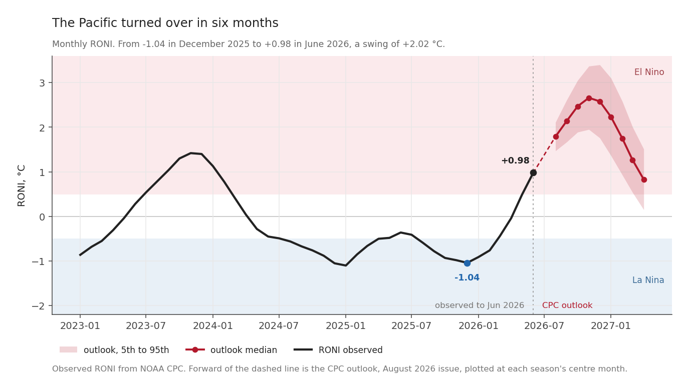
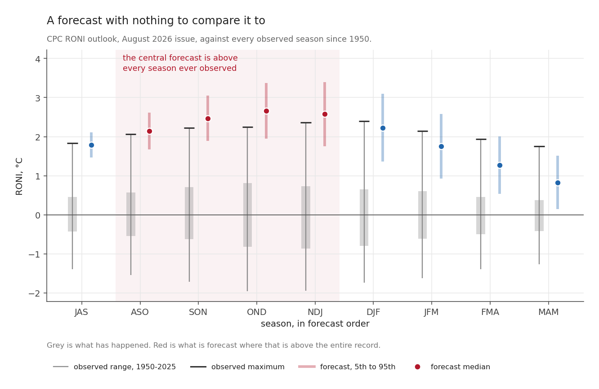
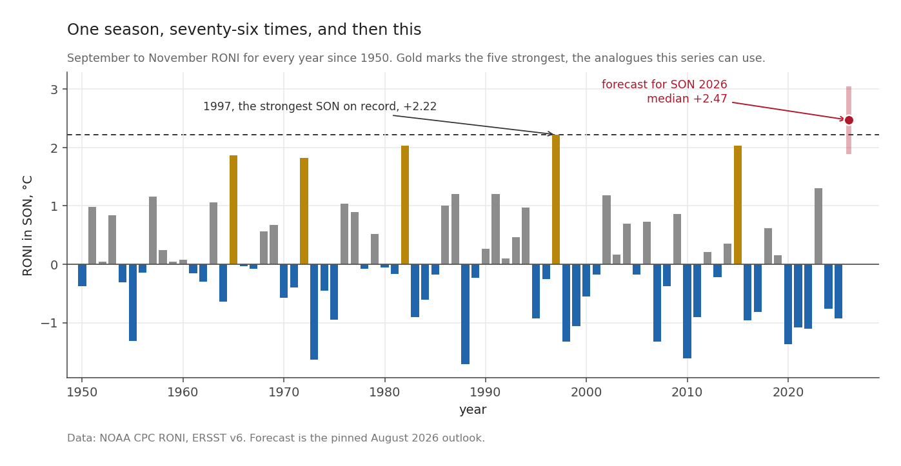
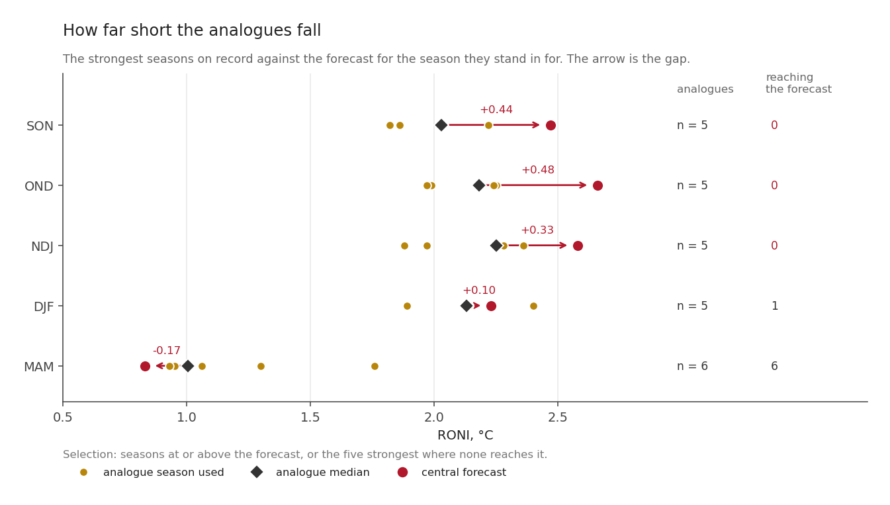

In December 2025 the tropical Pacific was in a La Niña. Eight months later it has crossed into El Niño territory, and the official outlook has it becoming one of the strongest ever measured.

This series is about what that does to the land, and about how much of the answer the historical record can actually support. It starts here, with the ocean, because everything else follows from it.

## The Pacific turned over in six months

The index on that chart is **RONI**, the Relative Oceanic Niño Index, which the Climate Prediction Center adopted as its primary standard in February 2026. The next post explains what it is and why the choice matters. For now, read it the way you would read the older Niño 3.4: above +0.5 is El Niño territory, below −0.5 is La Niña.

Crossing the line is not the same as being a catalogued event, and the difference matters later. An event needs **five consecutive overlapping three-month seasons** past the threshold. As of the last observed season there is one, so 2026 is not yet a catalogued event at all. What follows is a forecast of an event, not a report of one.

| | RONI |
|---|---|
| December 2025 | **−1.04** |
| June 2026, the last observed month | **+0.98** |
| swing | **+2.02 °C in six months** |

Underneath that headline number the coastal Pacific has moved further still. Niño 1+2, the box off the coast of Peru and Ecuador, stood at **+2.82 °C** in June 2026. Niño 3.4 was at +1.44 and the old ONI at +1.39.

A swing of this size is not by itself remarkable. The Pacific flips between states every few years and has done so throughout the record. What makes this one worth a series is where the forecast says it goes next.

## Four seasons with no precedent

Each season in the CPC outlook is shown twice. Grey is every value that season has taken since 1950, with a bar at its maximum. The coloured mark is the forecast: the median as a dot, the 5th to 95th percentile as the band.

Forecasts for the Pacific are issued by season, and a season is written
as the initials of its three months. ASO is August, September, October. NDJ is
November, December, January. They overlap on purpose, so every month sits in
three of them, and the whole series uses this shorthand.

Read the four shaded columns. For **ASO, SON, OND and NDJ**, the central
forecast is above the highest value that season has ever recorded:

| Season | central forecast | highest since 1950 | set in |
|---|---|---|---|
| ASO 2026 | +2.14 | +2.07 | 1997 |
| SON 2026 | +2.47 | +2.22 | 1997 |
| OND 2026 | +2.66 | +2.25 | 1997 |
| NDJ 2026-27 | +2.58 | +2.36 | 1982 |

Either side of that run the forecast falls back inside the record. JAS 2026 was forecast at +1.79 against a record of +1.84, just inside. By DJF 2027 it is +2.23 against +2.40, and by MAM 2027 it is +0.83 against +1.76, comfortably inside.

So the claim is narrower than "the forecast is extreme". It covers four seasons, and they happen to be the part of the event that usually matters most for the tropics.

## Count the record yourself

September to November alone, one bar per year, so you can count it.

Of the seventy-six autumns on record, exactly **five** have exceeded +1.8: 1997 at +2.22, then 1982 and 2015 at +2.03, 1965 at +1.86 and 1972 at +1.82. Those five are the entire supply of strong-event analogues for this season.

The forecast median, **+2.47**, is above all five. Its 5th percentile, +1.89, is above two of them.

Put precisely: **the strongest autumn ever recorded falls between the forecast's 5th percentile and its median.** If the event verifies near the low end of the outlook, 2026 will look something like 1997. If it verifies anywhere near the middle, there is nothing in seventy-six years to compare it to.

## Why that is a problem

The standard way to say something useful about a coming El Niño is the **analogue** method: find the past events that most resemble the forecast, and report what happened during them. It needs no model, assumes nothing about the shape of the relationship, and is easy to explain to someone who has to make a decision on it.

The catch sits in the word *resemble*. The method requires past events that resemble the forecast, and this year there are none.

For SON, the five closest analogues have a median RONI of **+2.03** against a forecast of +2.47. The gap is **+0.44 °C**, and **none of the five reaches the forecast level**. The same holds for OND, at a gap of +0.48, and for NDJ at +0.33. Only by MAM 2027, when the event is expected to be fading, does the record contain seasons at or above what is forecast.

So the method does not degrade gently as conditions get more extreme. It runs out of past to draw on **precisely where the event is strongest**, which is where a reader most wants an answer.

Nothing solves that, and this series does not pretend to. What it does instead is state the size of the gap every time it uses an analogue, and set a second method beside the first so neither has to be trusted alone. Not an independent one, to be clear: the composite and the fitted regression read the same Pacific index and the same land record. They fail in different ways, which is useful, but they are not two witnesses.

## Two things the forecast is not saying

Before the series goes further, two things need saying bluntly.

The first is that a number in the Pacific is not a harvest. The outlook's own publisher says so:

> Large positive or negative values of RONI do not necessarily correspond with the strength of the influence or expected impacts.

The second is that a forecast is not an observation. Everything forward of the dashed line in the first figure is a spread of possibilities. None of it has happened. The 5th to 95th range for SON runs from +1.89 to +3.05, wide enough to hold both "much like 1997" and "unlike anything ever measured".

## What this series will do

Ten posts, planned rather than written. The ocean is the subject of the first three: what the outlook actually says, which index it is said in, and how much history there is to compare it against. After that it turns to the land, to what a drought is once you measure both halves of it, and to how far seventy-six years of record will stretch before it stops answering.

Every figure is produced by a script that recomputes its numbers from the source data instead of quoting them, and where a claim cannot be checked the text says so.

*Next: [Which El Niño are you measuring? The index changed this year](20260816-which-el-nino-are-you-measuring.qmd), and the 0.41 °C it moves.*
