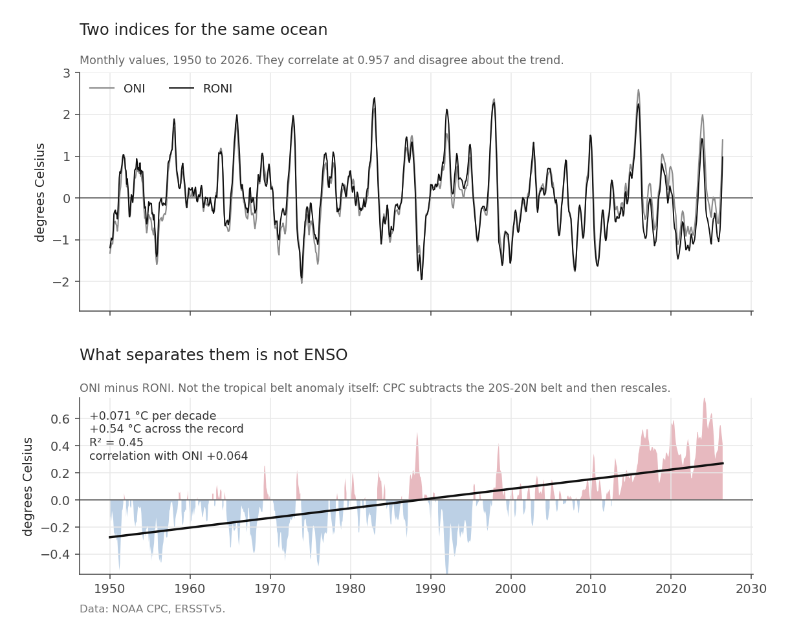
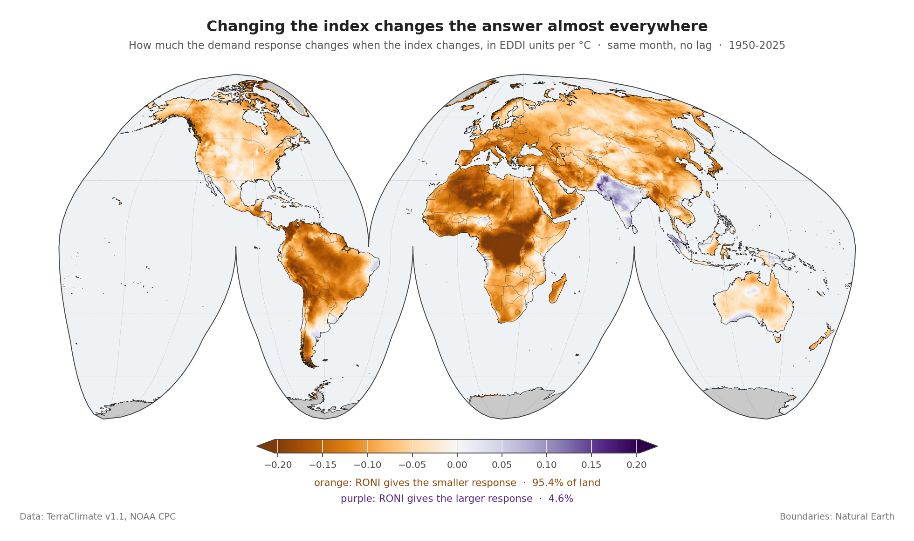
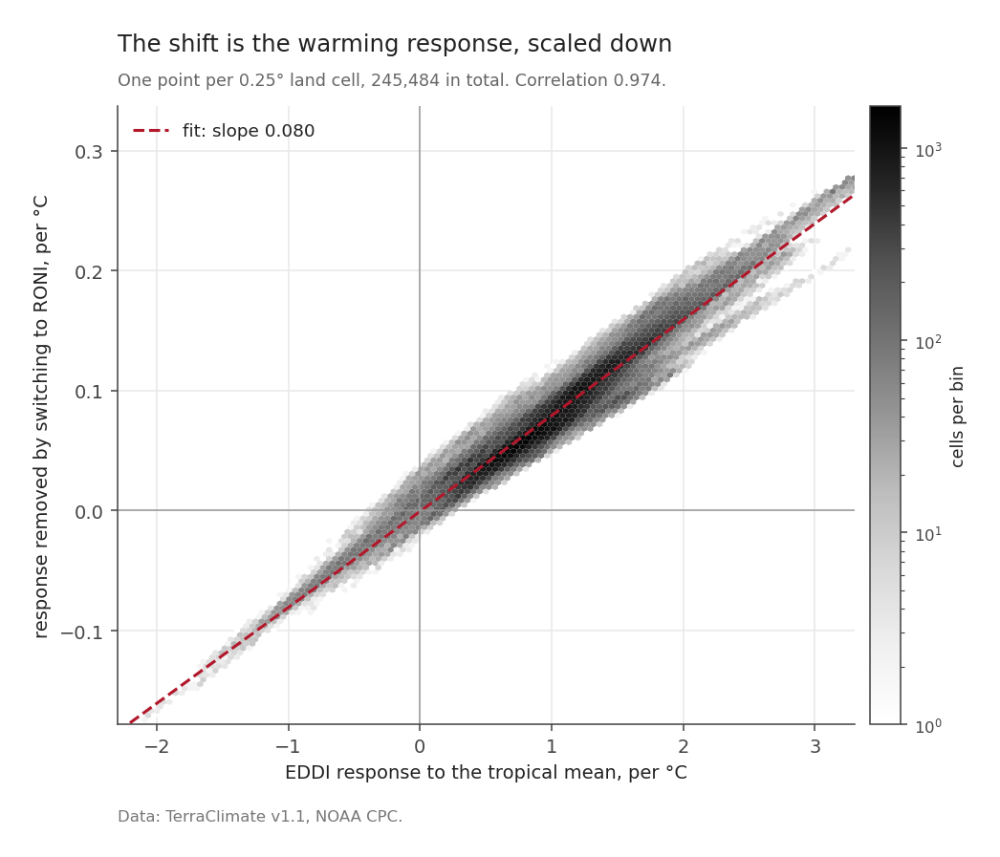
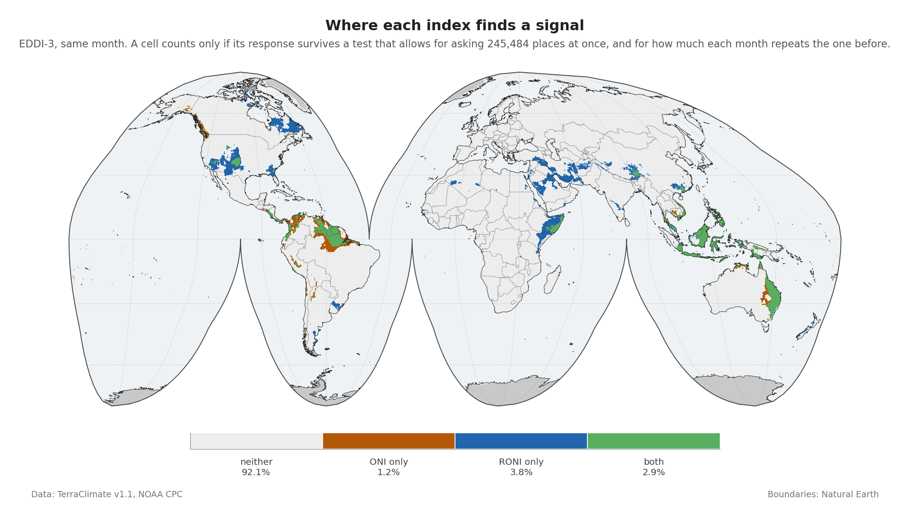
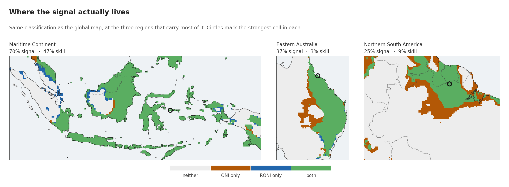

The previous post ended with a number: RONI at +0.98 for June 2026.

For the same month, ONI reads +1.39.

Both describe the same box of ocean. Both are published by the same office. They differ by 0.41 °C, which is roughly the gap between a moderate event and a strong one.

Until recently that would have been a footnote, because only one of them counted.

## The index changed this year

Effective February 2026, NOAA's Climate Prediction Center adopted the Relative Oceanic Niño Index for official monitoring and prediction of ENSO. Its [information circular](https://www.cpc.ncep.noaa.gov/products/analysis_monitoring/enso/roni/pdf/roni-info-may-2026.pdf) states that RONI "is now the primary standard for official advisories and classifications of ENSO events", and that historical episodes are being re-evaluated with it.

What did not change is the definition of an event: ±0.5 °C for five consecutive overlapping three-month seasons. The circular is explicit that "Thresholds and definitions stay the same, only the measurement improves."

So the question in the title is not rhetorical. Anything written before this year used one index, anything written after uses another, and the two do not agree about which winters were El Niño winters.

## The two indices, side by side

The **Oceanic Niño Index** is the three-month running mean sea surface temperature anomaly in the Niño 3.4 region, 5°N to 5°S and 120° to 170°W, measured against a thirty-year climatology that CPC re-centres every five years.

The **Relative Oceanic Niño Index** starts from the same Niño 3.4 anomalies, subtracts the average anomaly across the global tropical belt from 20°N to 20°S against the fixed 1991-2020 base, and then rescales the difference so its overall variability matches ONI's:

$$
\mathrm{RONI} \;\propto\; \mathrm{SSTA}_{\text{Niño 3.4}} \;-\; \overline{\mathrm{SSTA}}_{\,20°S-20°N}
$$

The proportionality sign is doing real work there. CPC does not publish the scaling factor, only that the result is adjusted to hold the variance of the whole index equal to ONI's, so writing this as an equality with no factor would be wrong.

Two words there carry a lot of weight. An **anomaly** is how far a
value sits from what is normal for that place at that time of year, so +1.4 °C
means a degree and a half warmer than an average June. The **climatology** is
the stretch of years used to decide what normal is. ONI keeps sliding its
thirty-year window forward; RONI holds still at 1991-2020.

The reasoning is that ENSO impacts depend on how warm the east-central Pacific
is *relative to the rest of the tropics*, not relative to a moving average of its own past. As the whole tropical ocean warms, a fixed regional threshold gradually stops meaning what it used to.

That re-evaluation has consequences the circular lists directly. Under RONI, three weak El Niño winters drop out of the record (1958-59, 2014-15, 2019-20) and one is added (1992-93); two weak La Niña winters drop out (1971-72, 1974-75) and two more may be added (2024-25, and 2025-26, still in progress).

## What separates them



The top panel is both indices across the record. They correlate at 0.957 and the event structure is the same in each. The bottom panel is what is left when you subtract one from the other.

| Series | Trend per decade | Variance explained by trend | Correlation with ONI |
|---|---|---|---|
| ONI minus RONI | **+0.071 °C** | **R² = 0.45** | +0.064 |
| ONI | +0.005 °C | R² = 0.0002 | - |
| RONI | -0.067 °C | R² = 0.033 | - |

The difference between the two indices is trend-dominated and almost uncorrelated with ENSO. Across 1950 to 2026 it carries **+0.54 °C**, about the amplitude of a moderate El Niño arriving quietly over seventy-six years and never leaving.

Two rows of that table repay a careful reading, because the obvious story is the wrong one.

The first is that ONI is the series with no trend. Its rolling thirty-year window takes the long-term warming out automatically, which is what a moving baseline does. So the tempting story, that ONI carries background warming and RONI strips it out, has the arithmetic backwards.

The second is that RONI carries a mild negative trend, which says the Niño 3.4 region has warmed slightly *less* than the tropical ocean around it. That is a real statement about the Pacific rather than a side effect of the subtraction.

What the difference between them really is: a composite of the tropical-belt subtraction, the variance rescaling, and the fact that the two indices use different climatologies. Empirically it is trend-dominated and near-orthogonal to ENSO. That is as far as this data supports, and it is enough for what follows.

## Does the choice change any answer?

An index is only worth arguing about if the argument changes a result. So run the same regression twice.

For each 0.25° land cell, regress EDDI over three months on the Pacific index, within each calendar month so the seasonal cycle is removed by construction, once against RONI and once against ONI. Then subtract.

```python
import numpy as np

def masked_ols(y, x, valid):
    """Slope of y on x over the valid months, vectorised across pixels."""
    n = valid.sum(axis=0)
    xm = np.where(valid, x[:, None, None], 0).sum(axis=0) / n
    ym = np.where(valid, y, 0).sum(axis=0) / n
    xd = np.where(valid, x[:, None, None] - xm, 0)
    yd = np.where(valid, y - ym, 0)
    return (xd * yd).sum(axis=0) / (xd * xd).sum(axis=0)

beta_roni = masked_ols(eddi, roni, valid)
beta_oni  = masked_ols(eddi, oni,  valid)
delta     = beta_roni - beta_oni
```

The coefficient is the answer that fit gives back: how much EDDI moves for each degree the Pacific index moves. Across 245,484 valid land cells, the RONI coefficient is lower on **95.4%**, and the shift exceeds a quarter of the ONI coefficient on **82.2%**.



The map is one-signed almost everywhere. Orange, where RONI gives the lower coefficient, covers the Sahara, the Sahel, central Africa, Amazonia, interior Asia and most of North America. Purple is confined to peninsular India, parts of the Maritime Continent, and interior Australia.

### A number that sounds alarming

The two coefficients have **opposite signs on 18.0% of land**. Stated on its own that sounds serious: on nearly a fifth of the world the two indices would disagree about whether El Niño raises evaporative demand or lowers it.

Check whether any of those cells carry a defensible coefficient, and the answer is **zero**. Not a small number: none of the 245,484 cells has both a sign flip and a statistically significant relationship under either index.

The flips are noise changing sign. Wherever there is a real relationship, both indices agree about its direction, every time. The 18 per cent figure is perfectly true and completely empty without the condition attached to it.

## Why the shift goes one way

A one-signed map invites a mechanical explanation, and there is a testable one. The two regressions differ only by the component that separates the indices, so the size of the shift at each pixel should track how strongly that pixel responds to that component.



It does, at a correlation of **0.974**.

The relationship is proportional rather than one to one: the fitted slope is 0.080. The median response to the differing component is **+1.00 EDDI units per °C**, positive on **95.0%** of land, and that near-universal positive response is why the map is one-signed. Almost everywhere gets thirstier when the removed component rises, so almost everywhere has something to remove.

This is a consistency check rather than a discovery. It confirms the shift is systematic and mechanical, not noise. It does not by itself say which index is the better description of the ocean; CPC's adoption decision does that.

## Removing signal, or revealing it

The natural worry is that RONI subtracts real information. Test it by asking where each index finds a statistically defensible relationship.

Testing a quarter of a million places at once creates a problem that testing one does not, and both regressions get the same correction for it.

::: {.callout-note appearance="simple" collapse="true"}
## Two corrections, in plain terms

**Testing many places at once.** Run the same test on 245,484 cells and a few
thousand will look convincing by luck alone. *False discovery rate* control,
in the [Benjamini-Hochberg](https://academic.oup.com/jrsssb/article/57/1/289/7035855) form used here at q < 0.05, sets the bar higher the
more places you ask about, so that no more than about five per cent of the
cells declared interesting are flukes.

**Months that repeat themselves.** Statistics assume each observation is a
fresh piece of news. Evaporative demand in July tells you most of what August
will say, so 910 months is nowhere near 910 pieces of news. The *effective
sample size*, in the [Bretherton](https://journals.ametsoc.org/view/journals/clim/12/7/1520-0442_1999_012_1990_tenosd_2.0.co_2.xml) form, works out how many independent months
the record is really worth, using how strongly each series resembles its own
previous month.
:::

In numbers: one month of EDDI resembles the month before it with a correlation of 0.751, so the 910 months are worth a median of **120 independent ones** here. (Post 6 puts the same figure at 102. It is the same correction on a smaller set of cells, the ones where rainfall is defined too, and both are right for the run they come from.) Skip that step and the evidence looks about 2.8 times stronger than it is.



Lag 0 below means the ocean and the land are compared in the same month, with no delay allowed between them. Post 9 is where the delay gets its own treatment.

| Status in the same month | Share of land |
|---|---|
| Neither index significant | 92.1% |
| ONI only | 1.2% |
| **RONI only** | **3.8%** |
| Both | 2.9% |

Globally, RONI finds a signal in **3.2 times more places** than it removes.

## Where the signal actually lives

That global table averages over a world where most land has no ENSO signal at all. Zoom in and it changes shape.



| Region | Any signal | Cross-validated skill | ONI only | RONI only | Both |
|---|---|---|---|---|---|
| Maritime Continent | **69.7%** | **47.0%** | 1.1% | 5.1% | 63.5% |
| Eastern Australia | 37.1% | 3.2% | **7.4%** | 0.5% | 29.2% |
| Northern South America | 25.2% | 9.0% | **11.1%** | 0.0% | 14.1% |
| Whole land surface | 7.9% | 1.5% | 1.2% | 3.8% | 2.9% |

The Maritime Continent is a different world from the global average. Seventy per cent of its cells carry a signal, and **47% survive leave-one-event-out cross-validation** against a global figure of 1.5%. The strongest cell, near Luwuk in Indonesia, gives r = +0.68, +0.73 EDDI units per °C, and a cross-validated R² of +0.45. That is a genuine, checkable relationship, not a marginal one.

The other two regions carry a real signal that is weaker and much less predictive. Eastern Australia has a signal on 37% of cells but only 3.2% cross-validate; its strongest cell, on the Queensland coast near Ayr, reaches r = +0.38. Northern South America sits between them, with its strongest cell in the interior near Cottica in Suriname at r = +0.51.

And here the global argument for RONI stops holding locally. In both Eastern Australia and Northern South America, ONI finds cells that RONI does not, by a wide margin: 7.4% against 0.5%, and 11.1% against 0.0%. The global picture, where RONI reveals three times more than it removes, reverses in two of the three regions where the **teleconnection** is strongest, meaning the places where a change in this patch of ocean reliably shows up in weather thousands of kilometres away.

None of which is a reason to go back to ONI. It is a reason to be careful about using a global average as an argument, because a global average describes the world as a whole and the places people actually care about are rarely average.

## The case for switching, and its limits

Switching indices is cheap. It costs one subtraction and a rescaling, it is now the operational standard, and it removes a trend-dominated component from a long-record regression. That case holds on the demand side of the water balance, globally, on data neither index was tuned against.

It does not fix the harder problem. Ninety-two per cent of land has no defensible relationship with either index at lag 0, and that number barely moves when the index changes.

One limit needs stating before the analysis starts leaning on it. Both indices are three-month running means, and the regressions above use monthly values from a series that repeats itself. Seventy-six years of record contains 44 RONI events. It also contains 918 months of Pacific index, of which 910 have land data on both axes beside them, but those months are not 910 independent pieces of evidence. How far that stretches is a question for a later post.

## Next: how much record is there?

Before the land, one more question about the ocean: how many events are actually in the record, how many of them are strong, and what kind. The answer is smaller than seventy-six years sounds.

*Next: [Forty-four events](20260819-forty-four-events.qmd).*
