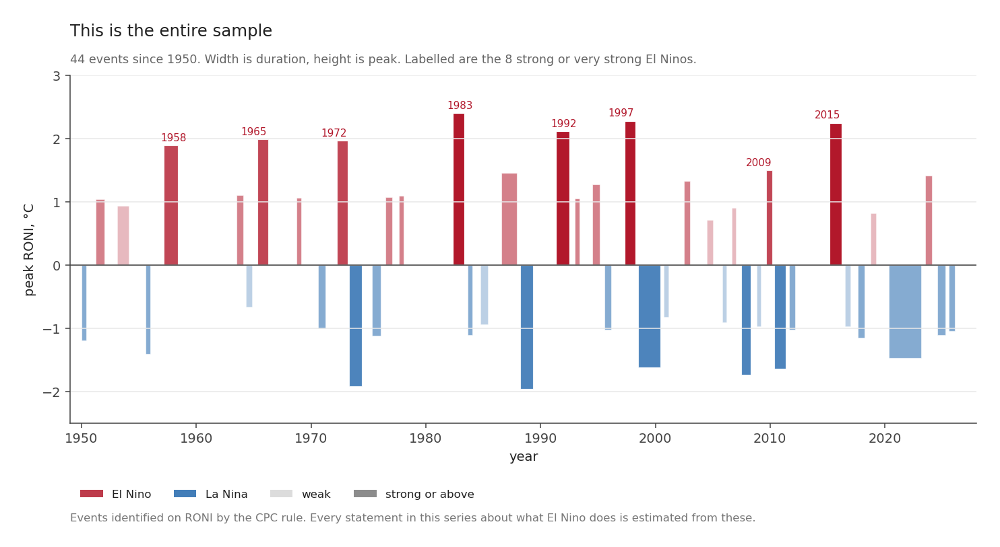
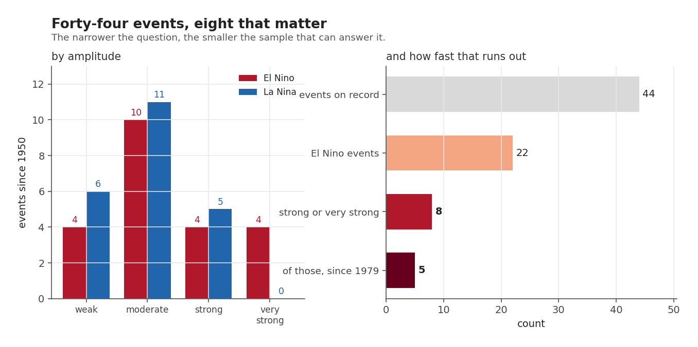
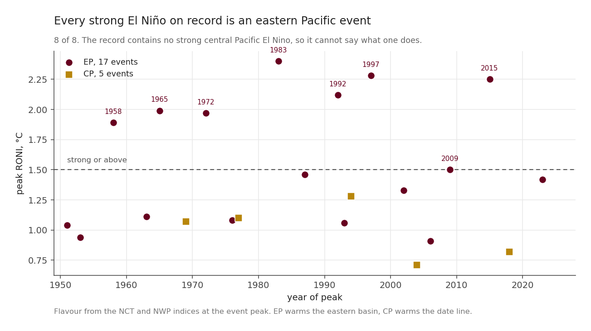
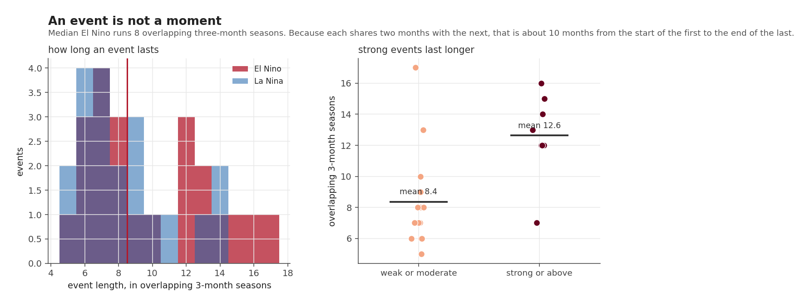
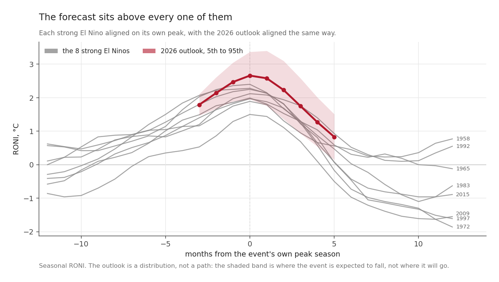

Anyone who has read a seasonal outlook has seen the phrase "based on the historical record". This post is about what is actually in it.

The answer is smaller than seventy-six years sounds, and it shrinks fast as soon as the question gets specific.

## The whole catalogue, in one picture

Every ENSO event identified on RONI since 1950, by the operational rule. Each block is one event: its width is how long it lasted and its height is how warm or cool it got at its peak. Shading is amplitude.

**Forty-four events. Twenty-two El Niño and twenty-two La Niña.**

That symmetry is not a coincidence and it is not quite meaningful either. Warm and cool states alternate, and the classification rule is applied to both sides of the same index, so an equal count is close to what the arithmetic produces.

What matters is the shading.

## How fast the sample runs out

By amplitude, across all forty-four:

| | weak | moderate | strong | very strong |
|---|---|---|---|---|
| El Niño | 4 | 10 | **4** | **4** |
| La Niña | 6 | 11 | 5 | 0 |

The right panel is the one to read. It is the same record asked four increasingly specific questions:

| question | events available |
|---|---|
| what does ENSO do? | **44** |
| what does El Niño do? | **22** |
| what does a *strong* El Niño do? | **8** |
| and with a satellite-era land record behind it? | **5** |

Eight. That is the entire sample behind every statement in this series about what a strong El Niño does to the land: 1958, 1965, 1972, 1983, 1992, 1997, 2009 and 2015.

For anything that needs the near-real-time record, which begins in 1979, it is five.

That is not a flaw in the data; it is simply what the data is. Strong El Niños are rare, which is exactly why they are worth forecasting and also why forecasting their consequences is so poorly constrained.

## Every strong El Niño is the same flavour

El Niño is not one thing. The warming can be centred in the **eastern Pacific**, off South America, or near the **date line** in the central Pacific. The two have different atmospheric responses and different consequences on land, which is why the distinction is tracked at all.

Across the twenty-two El Niños: **seventeen eastern Pacific, five central Pacific.**

Across the eight strong ones: **eight eastern Pacific, zero central Pacific.**

The record does not have few strong central Pacific El Niños. It has **none**, which puts a boundary around everything that follows. When this series says "in a strong El Niño, this region does that", it can only mean a strong *eastern Pacific* El Niño, because there is nothing else to learn it from.

That applies to every composite in the series. A composite, here and later, is just the average of a handful of chosen past seasons: pick the five that most resemble what is coming, and average what the land did in them. If all five are the same flavour of event, so is the answer.

The 2026 event is developing with Niño 1+2 at +2.82 °C, well ahead of the central basin, which is an eastern Pacific signature. So the analogues are at least the right kind of event. Call that luck. Had 2026 been developing near the date line instead, there would have been nothing at all to compare it with.

## An event is not a moment

The habit of naming events by a single year ("the 1997 El Niño") hides how long they occupy.

Length is counted in overlapping three-month seasons, the ASO, SON, OND units from the first post. Because each one shares two months with the next, eight seasons is about ten calendar months rather than twenty-four.

| | overlapping three-month seasons |
|---|---|
| median El Niño | **8** |
| range | 5 to 17 |
| weak or moderate, mean | 8.4 |
| **strong or above, mean** | **12.6** |

Strong events last about half again as long as ordinary ones. So the eight strong El Niños are not eight short episodes; they are eight long ones, which is some consolation for the small count when the question is about a whole season rather than a single month.

It also means the phases overlap the calendar awkwardly. An event that starts in May and ends the following June belongs to two agricultural years, and post 9 shows that the land response does not arrive uniformly across it.

## What the forecast looks like against them

Each of the eight strong events aligned on its own peak season, with the 2026 outlook aligned the same way rather than by calendar date.

The strongest event peak in the record is **+2.40 °C**, in 1983. The outlook's peak season, OND 2026, has a median of **+2.66**.

The grey curves are what the record can teach. The red line is above all of them, and its 5th to 95th band overlaps the top of the grey bundle only at the low end.

Notice the shape as well. The observed events rise over roughly a year and fall over roughly a year, and the outlook has the same shape. Whatever else is uncertain, the forecast is not proposing an unfamiliar kind of event. It is proposing a familiar kind, larger than any measured.

## Three constraints on everything that follows

Three constraints follow from this post, and every later post is written under them.

Composites average five to eight seasons, never seventy-six. When post 8 reports "rainfall at 61 per cent of normal", that is an average over a handful of analogue seasons, and the number of them is stated every time.

The record cannot speak about central Pacific strong events at all, so nothing in this series applies to one.

And any claim about a strong El Niño rests on eight events. The last post comes back to this and puts a number on how much information eight events, and 912 months, actually carry. It is less than either figure sounds like.

*Next: [Two ways to see a drought](20260822-two-ways-to-see-a-drought.qmd), on why one index is not enough and which two this series uses.*
