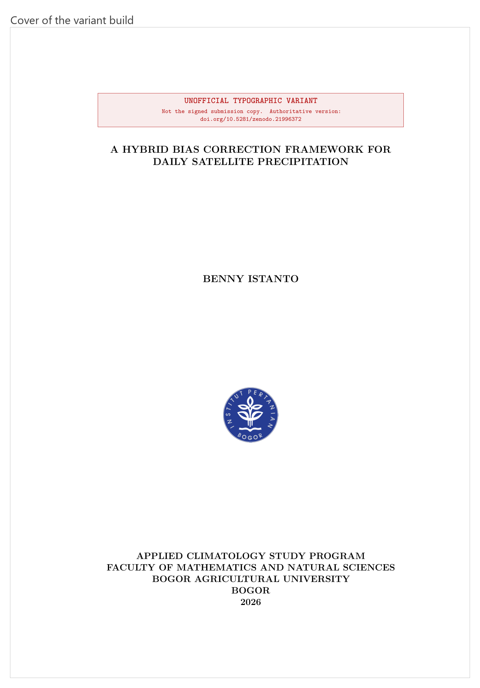
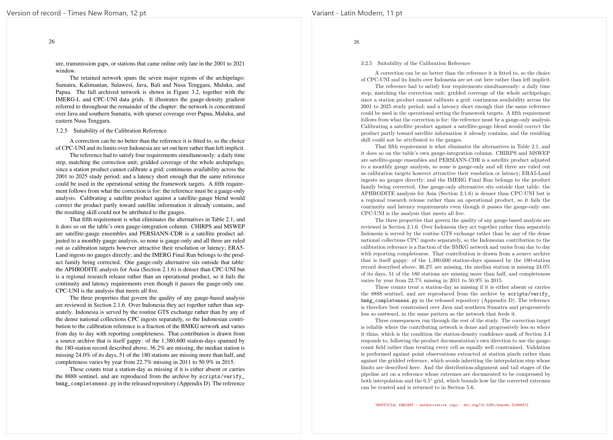
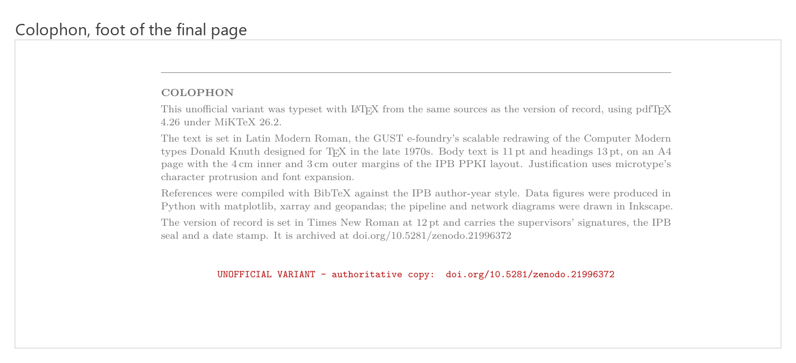

The institutional template specifies Times New Roman at 12 point. That is the copy with the signatures on it, and it is not up for debate.

But the thesis is written in LaTeX, and LaTeX has a typeface of its own. I wanted to see the document in it. Not to submit, not to replace anything: just to see what two years of writing looks like set in the type it was written with.

That red box at the top is the actual subject of this post.

## The rule I set before starting

**The signed PDF and the repository must be untouched when this is finished.**

Everything follows from that. The build script copies the sources into a scratch directory, patches the font package in the copy, and compiles there. `main_thesis.tex` never changes. The scratch directory is gitignored, so a careless `git add` cannot pull the variant into the history of the real document.

It is the same instinct as never editing raw data in place, applied to a document instead of a NetCDF.

## Latin Modern, not Computer Modern

A detail worth knowing if you ever do this.

The obvious move is to delete the font package and let LaTeX fall back to its default. Do that in a document loading `\usepackage[T1]{fontenc}` and you get METAFONT-generated EC fonts, which embed as Type 3 bitmaps. On screen they look soft. In print preview they look worse.

Latin Modern is the GUST e-foundry's redrawing of the same Knuth Computer Modern design as scalable Type 1 and OpenType. Same shapes, vector output. `\usepackage{lmodern}` and the problem does not arise.

## What had to be measured

Latin Modern sets about 10% wider than Times at the same nominal size, so a straight swap changes the pagination of a 143 page document. Every number below was measured against the official copy rather than chosen by eye.

| Decision | Value | Why |
|---|---|---|
| Body size | 11 pt | Lands on exactly the official copy's 143 pages. At 12 pt the document runs long |
| Heading size | 13 pt | Preserves the size ratio: the official copy is 14/12 = 1.17, this is 13/11 = 1.18. Leaving headings at 14 pt gives a heavier 1.27 |
| Cover institution block | 12 pt | The longest line has to fit the 398.34 pt text width. Latin Modern gives 438.1 pt at 14, 422.4 at 13.5, 406.8 at 13, and 375.5 at 12, which matches Times at 14 pt to within 0.05 pt |
| microtype | on | Character protrusion and font expansion. Two fewer pages, overfull boxes 12 to 9, underfull 70 to 47 |

The honest cost is in the row that looks like a free win. Dropping the body to 11 pt matches the page count, but it drops the x-height from 5.50 pt to 4.74 pt. The result occupies the same pages while reading roughly like Times at 10.35 pt. Same length, slightly smaller text. That is a real trade and the script says so in a comment rather than quietly taking the win.

## The three markings

An unofficial rebuild of an official document is a small forgery risk. Not because anyone would try it, but because PDFs get emailed, renamed and forwarded, and six months later nobody remembers which one had the signatures.

So the variant carries three markings, and the interesting part is that each one needed a decision about how loud to be.

**A banner across the top of the cover.** Red, boxed, naming the authoritative DOI. On the cover only. I had it on the approval page too and took it off: a marking that appears on every preliminary page stops reading as a statement and starts reading as decoration, which is the opposite of what a warning is for.

**A footer stamp on every numbered page.** Also red, in monospace, carrying the same DOI. First attempt was 6 point, which was too small to register as anything. 8 point is legible without competing with the body text.

**A colophon at the foot of the last page.** In grey, not red. Red is doing warning duty in this document; tinting neutral production notes the same colour dilutes the signal on the marks that actually matter.

## The line I had to leave out

Writing the colophon, I wanted to state the figure resolution. The project's own decisions file specifies 300 DPI minimum for figures, so that was the number to quote.

I checked. The shipped PNGs measure 150 to 220 DPI.

So the colophon does not mention resolution at all. The specification says one thing and the artefacts say another, and a colophon that quotes the specification would be describing a document I did not actually produce.

It is a small thing and nobody would ever have checked. But it is the same rule as the `standard_name` attribute I leave out of the [NetCDF files](/blog/20241015-netcdf-that-other-tools-can-actually-read): an omitted claim is a gap the reader can see, and a wrong one is something they will act on. Two years apart, same decision.

## Where each version is

| | |
|---|---|
| Version of record, signed | [10.5281/zenodo.21996372](https://doi.org/10.5281/zenodo.21996372) |
| Institutional copy | [IPB repository](https://repository.ipb.ac.id/handle/123456789/177877) |
| Thesis sources, LaTeX | [github.com/bennyistanto/msc-thesis](https://github.com/bennyistanto/msc-thesis) |

The repository holds the thesis and nothing else: the chapter files, the bibliography, the build for the version of record. The variant tooling is not in it and will not be. It lives in the gitignored scratch directory, which was the point of putting it there.

That is a deliberate limit rather than an oversight. A build script whose entire job is to produce an unofficial copy of a signed document is not something I want sitting in a public repository next to the signed document, one `git clone` away from someone who has not read this far.

So the variant has no DOI, no archive and no published source. What follows is a reading copy.

## Read them side by side

Both are 143 pages, so any page number lands on the same content in either. Open the two and jump to the same page if you want to see what 10% wider type does to a paragraph.

::: {.callout-note collapse="true" title="Version of record - Times New Roman, signed"}
::: {.pdf-embed}
<iframe src="https://drive.google.com/file/d/111bxbsDm0FXoZ3dvCL0jAt7bOgadm_VD/preview" title="Thesis, version of record" width="100%" height="600" loading="lazy" allow="autoplay"></iframe>
:::

Does not load? [Open it in Drive](https://drive.google.com/file/d/111bxbsDm0FXoZ3dvCL0jAt7bOgadm_VD/view), or read the archived copy at [10.5281/zenodo.21996372](https://doi.org/10.5281/zenodo.21996372).
:::

::: {.callout-note collapse="true" title="Variant - Latin Modern, unofficial"}
::: {.pdf-embed}
<iframe src="https://drive.google.com/file/d/1EYtI0uYFA5heS-qbnjT0e8J7maxbGjw8/preview" title="Thesis, Latin Modern variant" width="100%" height="600" loading="lazy" allow="autoplay"></iframe>
:::

Does not load? [Open it in Drive](https://drive.google.com/file/d/1EYtI0uYFA5heS-qbnjT0e8J7maxbGjw8/view). Every page carries the red footer stamp pointing back at the authoritative copy.
:::

Neither of these is a citable source. If you are referencing this work, use the DOI in the table above.

The thing I ended up building was not a document at all. It is a reproducible way of generating a clearly labelled variant of one, and that took about thirty kilobytes of shell script and a good deal more thought than the font swap it exists to perform.
