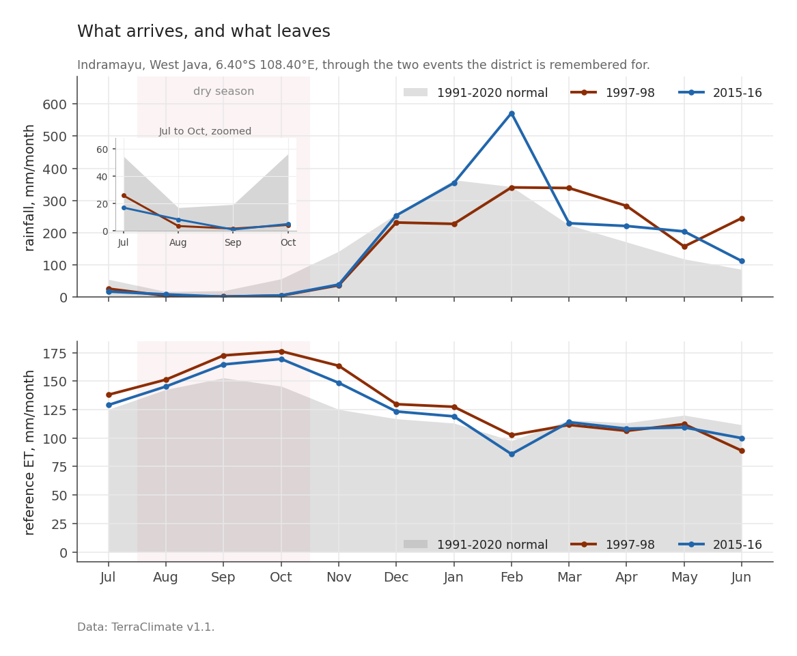
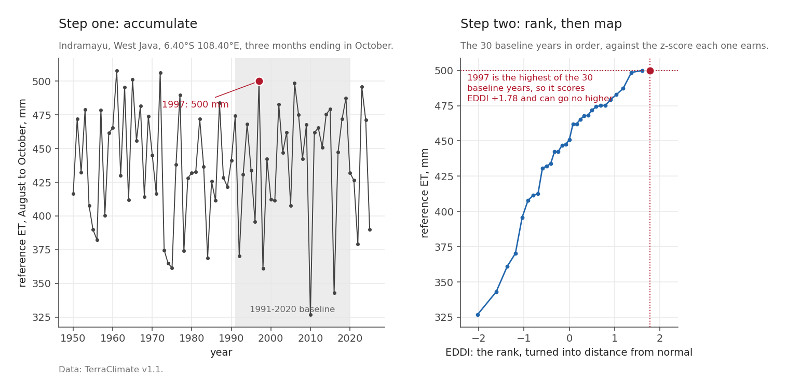
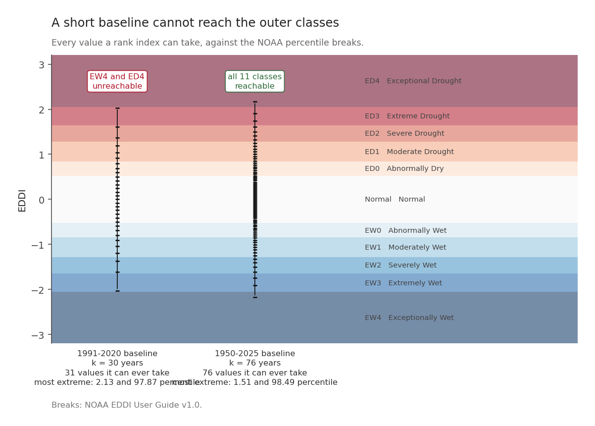
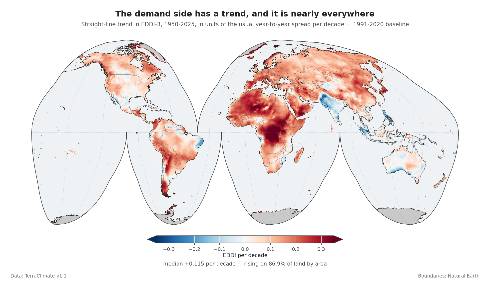
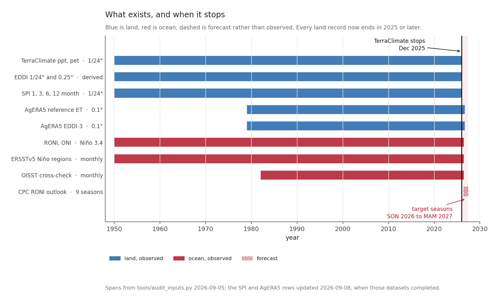
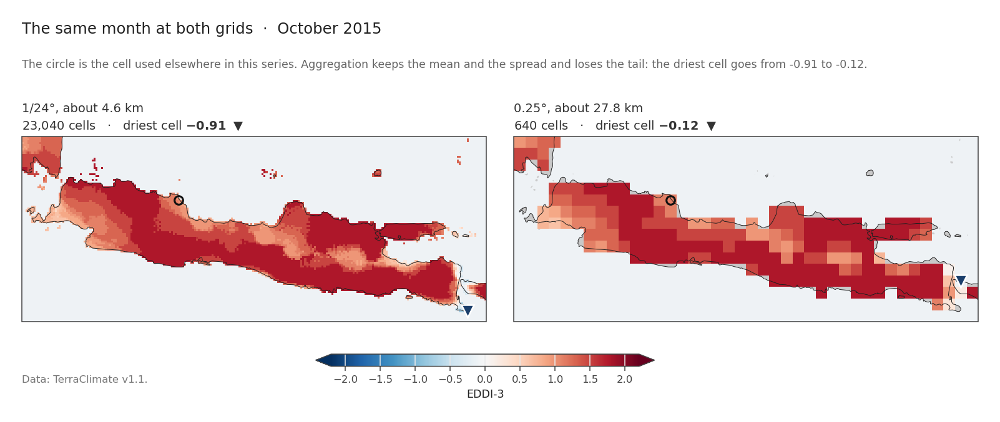
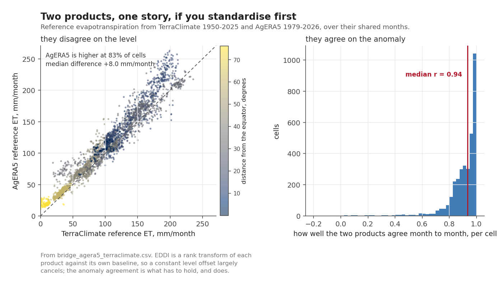

Water arrives as rain. It leaves as evaporation and transpiration. A drought is a shortfall in the balance between the two, and there is no reason the two halves should move together.

Almost every drought product in operational use measures the first half.

## One place, one El Niño, both halves

A single TerraClimate cell over Indramayu, on the north coast of Java, through two strong El Niños. Rainfall on one axis, reference evapotranspiration on the other. Reference ET is the standard way to put a number on how hard the air is pulling: the depth of water a well watered grass field would lose in a month, given the heat, sun, wind and humidity actually recorded. The definition and the equation behind it are [FAO Irrigation and Drainage Paper 56](https://www.fao.org/4/x0490e/x0490e00.htm), Allen, Pereira, Raes and Smith (1998). It is measured in millimetres, like rain, which is what makes the two halves of this figure comparable.

For the August to October window at that cell:

| | rainfall | reference ET |
|---|---|---|
| normal (1991-2020) | 30.9 mm/month | 146.9 mm/month |
| **1997** | 3.1 (**−27.8**) | 166.7 (**+19.7**) |
| **2015** | 4.7 (**−26.2**) | 159.8 (**+12.8**) |

Both halves moved, and they moved in the direction that compounds. Less water arrived and more of it was pulled out.

Now notice the asymmetry in the numbers. Rainfall fell by roughly 90 per cent of a small quantity. Demand rose by roughly 10 per cent of a large one. **In absolute millimetres the increase in demand, 19.7 mm, is around two thirds of the month's entire normal rainfall of 30.9 mm.** An index that tracks only the rainfall reports the first column and is silent about the second.

That is the case for measuring both, and it is the whole reason this series exists.

## Which two indices, and which one is deliberately excluded

The supply side is the [**Standardized Precipitation Index**](https://www.droughtmanagement.info/literature/AMS_Relationship_Drought_Frequency_Duration_Time_Scales_1993.pdf), SPI, after McKee, Doesken and Kleist (1993), computed here at 1, 3, 6 and 12 month accumulations. The demand side is the [**Evaporative Demand Drought Index**](https://journals.ametsoc.org/view/journals/hydr/17/6/jhm-d-15-0121_1.xml), EDDI, after Hobbins and colleagues (2016), at the same four. Both from TerraClimate v1.1, both 1950 to 2025, both against the same 1991-2020 baseline. Same input, same period, same calibration, so a difference between them is a difference in what they measure rather than in how they were built.

There is an obvious third candidate, and it is deliberately not used.

The [Standardized Precipitation Evapotranspiration Index](https://journals.ametsoc.org/view/journals/clim/23/7/2009jcli2909.1.xml), from Vicente-Serrano and colleagues (2010), takes precipitation *minus* reference evapotranspiration and standardises the difference. SPEI is a good index and widely used. It is the wrong index here, because it already contains the demand term. Pairing SPEI with EDDI would put reference ET on both axes and then report the resulting correlation as a finding.

This is not a subtle worry, it is arithmetic:

$$
\mathrm{SPI} = f(P), \qquad
\mathrm{SPEI} = g(P - \mathrm{ET_o}), \qquad
\mathrm{EDDI} = h(\mathrm{ET_o})
$$

SPI and EDDI share no input. SPEI and EDDI share $\mathrm{ET_o}$. A correlation between the second pair is guaranteed by construction before any climate enters the question.

The two axes are still coupled, of course. On the rebuilt files the climatological correlation between SPI and EDDI has a median of **−0.476** across land, from −0.74 at the 10th percentile to −0.18 at the 90th. Dry months tend to be thirsty months anyway. But that coupling is a physical fact to be measured, not an artefact to be built in, and post 6 is largely about how much of it survives when El Niño is the thing doing the moving.

## How EDDI is actually built

At one cell, for one window. Take the 76 August-to-October accumulations of reference ET from 1950 to 2025, which at this cell run from **327 to 508 mm**. Rank the current year against the 30 baseline years, turn that rank into a probability with the **Tukey plotting position**, the same rule EDDI itself uses ([Hoylman and colleagues, 2024](https://doi.org/10.1029/2023WR036087)), and turn the probability into a **z-score**, which is distance from normal counted in units of the usual year-to-year spread. A z of +1 sits further from normal than about five years in six. The rule for turning a rank into a probability is called a *plotting position*, and post 7 gives the exact one.

**Positive EDDI means higher than normal evaporative demand: a thirstier atmosphere, drier conditions.**

The two strong El Niños in the earlier figure land where you would expect. 1997 accumulated 500 mm, ranking 29.5 of 30, giving EDDI **+1.78**. 2015 accumulated 479 mm, ranking 25.5, giving **+0.98**.

Note that this is a **rank** index, not a fitted distribution. It makes no assumption about the shape of the ET distribution, which is a genuine advantage. It also has a consequence that took me by surprise.

## A thirty-year baseline cannot say "exceptional"

If the index is a rank among $k$ baseline years, then there are only $k+1$ possible answers, and the most extreme of them is bounded. Compute the bound; do not assume it:

| baseline | distinct levels | attainable z | attainable percentile | NOAA classes reachable |
|---|---|---|---|---|
| **k = 30** (WMO 1991-2020) | 31 | **±2.028** | 2.13 to 97.87 | **9 of 11** |
| k = 76 (full record) | 76 | ±2.168 | 1.51 to 98.49 | 11 of 11 |

The two rows answer slightly different questions, and the difference is not a rounding detail. A month scored *against* a baseline it is not part of has $k+1$ places to land. A month scored inside its own baseline ties with itself, takes a mid-rank, and has $k$. The first row is the 1991-2020 case, where 2026 sits outside; the second is the full-record case, where every month is inside. Each row uses the convention that applies to it.

NOAA's [EDDI classification](https://psl.noaa.gov/eddi/pdf/EDDI_UserGuide_v1.0.pdf) has eleven categories, and on a thirty-year baseline **the outermost class at each end, EW4 and ED4, cannot be reached at all**. ED4 begins at the 98th percentile, and a thirty-year rank tops out at the 97.87th. Those categories are not rare, and not unlikely. There is no arrangement of the data that produces one.

That follows from the baseline this project chose and says nothing against NOAA's scheme. NOAA standardises EDDI against the whole period of record instead of a thirty-year normal. The [EDDI User Guide](https://psl.noaa.gov/eddi/pdf/EDDI_UserGuide_v1.0.pdf) (p.15) puts the climatology at "1980-present" and NOAA PSL's current page says 1979-present, so the window grows every year: by 2026 it is around forty-seven years, which reaches roughly the 98.6th percentile. It clears the 98th comfortably, so NOAA can report an exceptional drought. The WMO 1991-2020 window used here cannot, and that is the price of making this product line up with everything else in the series.

This matters for what comes later. During a strong El Niño a non-trivial share of cells will sit exactly at the +2.03 bound, and a cell already at the bound cannot get worse in the index even when conditions do. When a later post turns to the observed present, that ceiling is the first thing it has to check. A fit run against that flattened top end comes out shallower than the truth, because part of its evidence has nowhere left to move.

The fix is to rebuild on the full record, which lifts the ceiling to ±2.17. That has not been done for this series, and where saturation matters the text says so.

## The demand side will not hold still

The last thing to establish before the historical posts.

Across 261,334 land cells, the trend in EDDI-3 over 1950-2025 has a median of **+0.115 standardised units per decade**, from −0.005 at the 10th percentile to +0.224 at the 90th. **Demand is rising on 86.9 per cent of land by area.**

Over seventy-six years that median trend accumulates to roughly +0.87 in EDDI units, which is most of a category.

The trend is not a small correction to be waved at. It is the single largest source of error in this project, and it caught me three separate times in three different disguises, described in the final post. Where a later post attributes something to El Niño it removes this trend first and reports the before-and-after, because the difference between them is often larger than the effect being claimed. That holds for the composites, the projection, the skill mask and the horizon, which is posts 8 to 10.

Two posts are exceptions and it is better to say so here than to let a reader find out. Post 5 contrasts El Niño months against neutral ones, and those two sets sit six months apart in mean year, so the trend cancels almost exactly; that post shows the arithmetic. **Post 6 has no such defence.** It correlates both indices against RONI over the whole record without detrending either. Since RONI drifts slightly downward and demand drifts upward, the trend pushes the measured demand response *down*, which makes post 6's dominant dry-and-thirsty finding conservative but also thins the wet-and-thirsty corner it concludes is empty. The effect is small next to the correlations that post reports, and it has not been quantified.

## The ledger

Everything above is computed from two land datasets. The rest of this post is the ledger: what they are, where they stop, and what they can honestly answer.

| Product | Grid | Span |
|---|---|---|
| TerraClimate `ppt`, `pet` | 1/24°, about 4.6 km | 1950-01 to 2025-12 |
| EDDI, derived here | 1/24° and 0.25° | 1950-01 to 2025-12 |
| SPI, scales 1, 3, 6, 12 | 1/24° | 1950-01 to 2025-12 |
| **[AgERA5](https://doi.org/10.24381/cds.6c68c9bb) reference ET** | **0.1°** | **1979-01 to the last closed month** |
| **AgERA5 EDDI-3** | **0.1°** | **1979-01 to the last closed month** |
| RONI, ONI | Niño 3.4 | 1950-01 to 2026-06 |
| CPC RONI outlook | 9 seasons | 2026-07 onward |

Those spans are read out of the files. None is quoted from a plan.

The two rows in bold are the reason this series can say anything about the present. **TerraClimate stops at December 2025**, eight months before the event began. **AgERA5 runs to the last month that has closed**, over roughly 2.3 million land cells, and picks up the next one a few days after it ends. One dataset is the history and the other is the news, and the post on the observed present will be written entirely from the second.

The land data carries `version V1.1`, `date_created 2026-06-02` and `source WorldClim v2.1, ERA5`, from the University of California Merced. Its own `references` attribute names Abatzoglou, Hegewisch, Yin and Kalashinkov (2026) for this version; the dataset was introduced in [Abatzoglou, Dobrowski, Parks and Hegewisch (2018)](https://www.nature.com/articles/sdata2017191).

## TerraClimate is not an observation

TerraClimate is built by taking anomalies from a **reanalysis**, [ERA5](https://doi.org/10.1002/qj.3803), and applying them to a high-resolution climatology, [WorldClim v2.1](https://doi.org/10.1002/joc.5086). A reanalysis is a weather model run back over the past, pulling in every observation it can find as it goes, so what comes out is an estimate that obeys physics everywhere, including in the places where nobody was measuring. It is an interpolation, not a measurement. No instrument recorded 4.6 km reference evapotranspiration in the Sahel in 1953.

That has a consequence people routinely miss. The **grid** is 1/24 of a degree. The **information** is at the resolution of the coarser input. A fine grid can be produced from coarse information, and it will look convincing.

The same month over Java, at both grids. The left panel holds 23,040 cells and the right holds 640, **36 times fewer**.

| | mean | standard deviation | driest cell |
|---|---|---|---|
| 1/24° | +1.486 | 0.383 | −0.91 |
| 0.25° | +1.504 | 0.361 | −0.12 |

The mean is within 0.018 and the spread within 0.022. What the coarse grid loses is the extreme tail: the driest cell goes from −0.91 to −0.12, because Java is narrow and a 0.25° cell on a coast averages land with sea.

Where that step happens matters, and it is not the same everywhere in this series. Every index is built at the full 1/24°. What varies is whether a given analysis is computed at 1/24° and then aggregated, or aggregated and then computed:

| analysis | computed at |
|---|---|
| the two-axis response, post 6 | **1/24°**, results aggregated afterwards |
| run theory, post 5 | **1/24°**, run statistics aggregated afterwards |

*Run theory, in that second row, means counting unbroken stretches rather than counting months. Post 5 is built on it.*
| analogue composites, post 8 | 0.25°, and the order does not matter: a composite is a mean, and averaging commutes with averaging |
| the forecast projection and skill mask, post 9 | **0.25°** |

The last row is the one to keep in mind. Fitting on spatially averaged values removes some of the noise the fit would otherwise have to contend with, so a skill estimate from 0.25° data is, if anything, generous. Post 9 finds that even so, most of the world has no usable skill.

The trade is acceptable for all of these, which use the mean and the variance. It would not be acceptable for a question about the most extreme cell in a district, which is exactly what the tail comparison above shows. Java is close to the hardest case for aggregation, which is why the comparison is drawn here and not somewhere with more room.

None of this counts against TerraClimate, which is explicit about how it is built. The caution is about reading a 4 km map as though someone had measured 4 km.

## Two products, one story, if you standardise first

The obvious objection to using two datasets is that they are two datasets. If TerraClimate says one thing about 1997 and AgERA5 says another, which is right?

They do disagree, and substantially.

Over their shared months, on 3,452 sampled cells:

| | |
|---|---|
| AgERA5 reference ET higher than TerraClimate | **83.4% of cells** |
| median difference in level | **+8.03 mm/month** |
| median correlation of monthly **anomalies** | **+0.936** |
| cells with anomaly correlation above 0.8 | **89.0%** |

Read those four rows together, because the pairing is the point. **The two products disagree about how much water leaves the ground and agree about when more of it leaves than usual.**

That is exactly the condition under which a standardised index carries a story across the handover. EDDI is a rank transform of each product against its own baseline, so a constant offset in level ranks the same way it would without the offset. What cannot cancel is disagreement about the anomaly, and at a median r of 0.94 there is not much of that.

The caution that follows is narrow and firm: **no number computed from AgERA5 in this series is set beside a number computed from TerraClimate.** Post 7 is AgERA5 against AgERA5's own record. The historical posts are TerraClimate against TerraClimate.

## What monthly data cannot see

The land data is monthly. A three-week rainless spell that lands on a crop's flowering stage and destroys the yield is, in a monthly total, a slightly dry month.

There is no way around this with this data. Drought indices built on monthly accumulations describe seasonal water balance. They do not describe agronomic timing, and any statement in this series about impact is a statement about the seasonal balance, nothing finer.

## Five things to carry forward

Drought has two halves, and at Indramayu in 1997 the rise in demand was worth roughly two thirds of the entire normal rainfall of the month, 19.7 mm against 30.9.

SPI and EDDI share no input, which is why they are the pair here and why SPEI is not.

EDDI on a thirty-year baseline **saturates at ±2.03**, unable to reach two of its own eleven categories.

The demand axis is climbing on **87 per cent of land**, so nothing later in this series is attributed to El Niño until that climb has been taken out.

And the two demand products differ in level by 8 mm a month while agreeing on anomaly at r = 0.94, which is what allows the history and the news to be told with a single index.

*Next: [El Niño starts dry spells, it does not make them longer](20260825-seventy-five-years-of-dry-spells.qmd), applying run theory to both indices at four accumulation lengths, to find out what El Niño actually changes.*
