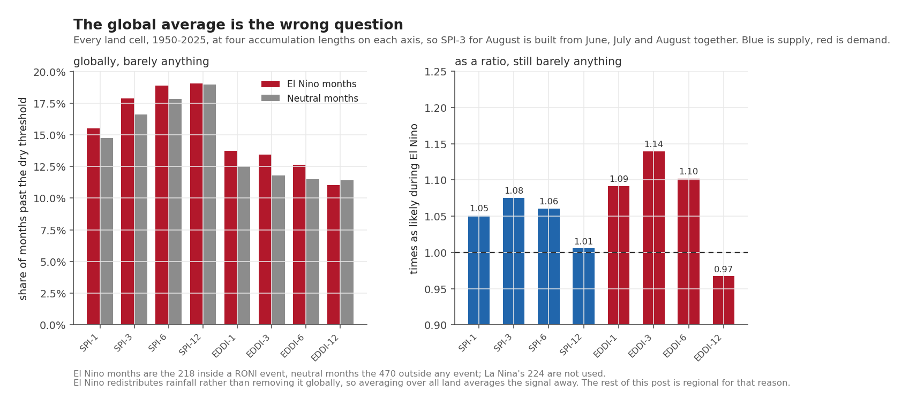
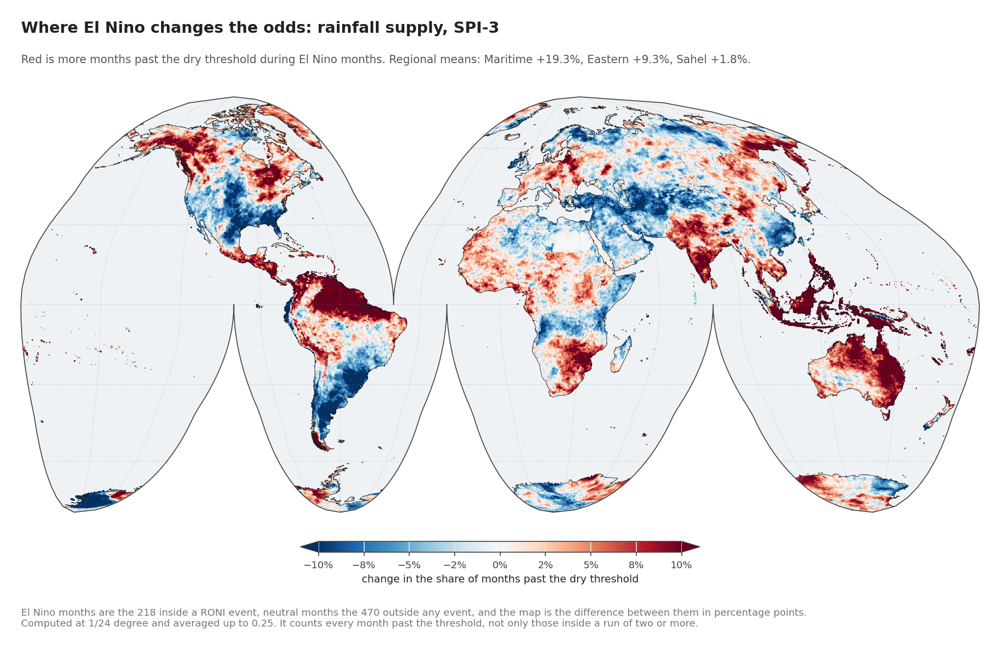
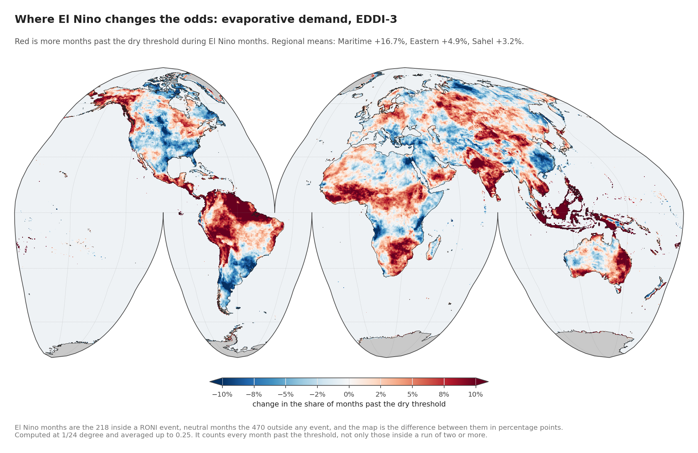
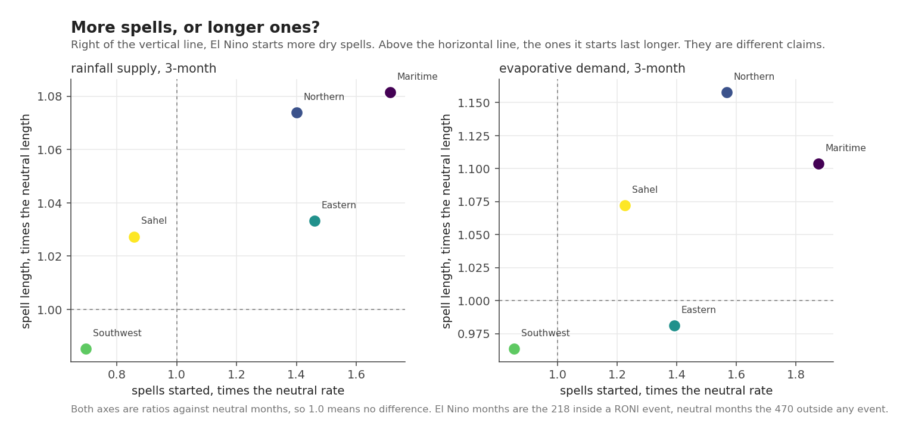
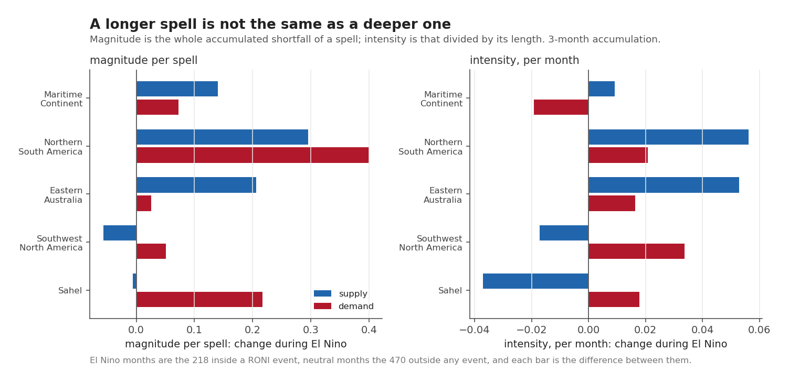
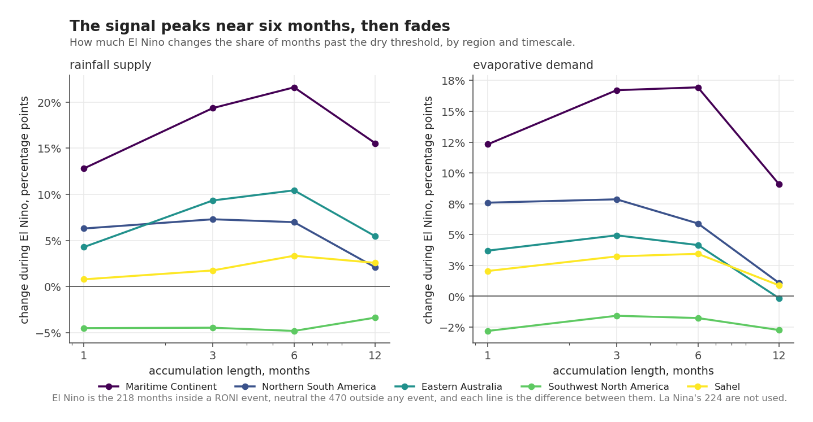
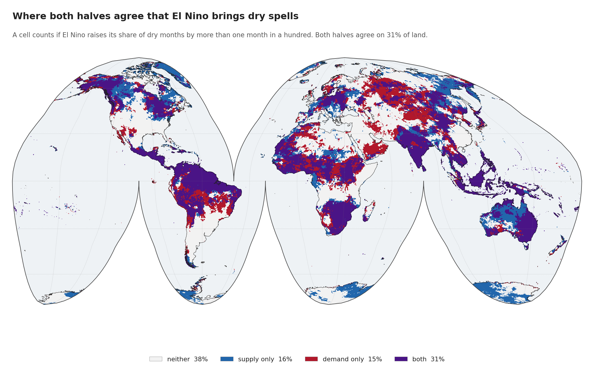
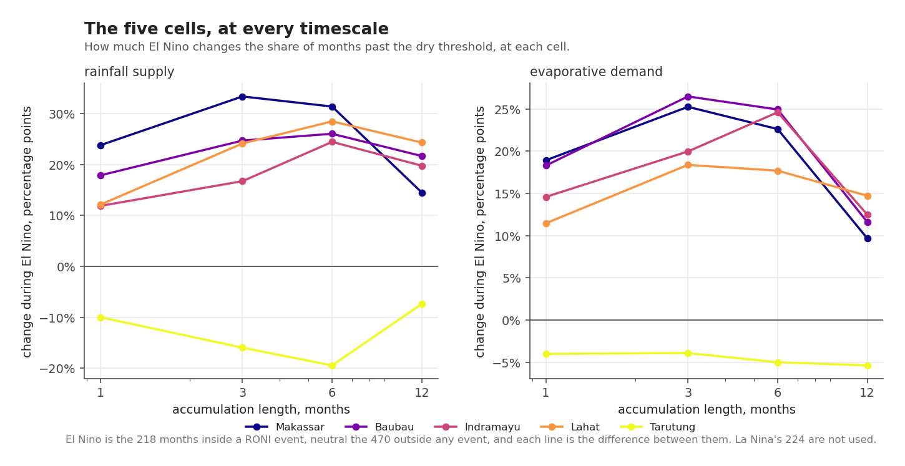

The last post built two indices and argued they measure different things. This one asks the historical question that has been implicit since the first post: **over seventy-five years, what does El Niño actually change about dry spells?**

Not the average anomaly. Dry spells: how often one starts, how long it lasts, how deep it gets.

## What counts as a spell

A **run** is a continuous stretch where an index stays beyond a threshold. Dry is a **low SPI** and a **high EDDI**, so the same physical condition is `SPI < −1.0` and `EDDI > +1.0`. Two consecutive months qualify; one does not.

Each run has three properties, kept separate because they answer different questions. For a run covering months $t = a \ldots b$, with both indices flipped so that a larger
number always means drier, written $z_t$:

$$
D = b - a + 1, \qquad
M = \sum_{t=a}^{b} \left(z_t - z_{\text{thr}}\right), \qquad
I = \frac{M}{D}
$$

Duration $D$ counts months, magnitude $M$ adds up how far past the
threshold the index went across the whole run, and intensity $I$ is the
average depth per month. A long
shallow spell and a short deep one can score the same $M$. Reporting only
magnitude would call them the same event.

Every run is credited to the **ENSO phase of the month it began in**, not the month it ended. A spell that started under neutral conditions and outlived them is not evidence about El Niño. That is one line in the scan, and it is the line that decides what the whole post means:

```python
# The phase is stamped when the run STARTS and carried until it ends.
starting = beyond & (cur_dur == 0)
cur_phase = np.where(starting, np.int8(ph), cur_phase)
cur_dur   = np.where(beyond, cur_dur + 1, cur_dur)
cur_mag   = np.where(beyond, cur_mag + inst, cur_mag)

# A run ends on the first month that is not beyond the threshold, and also
# on a missing month: an interrupted record is not a continuous run.
ending = (cur_dur > 0) & ~beyond
```

Crediting at the end instead would let a spell that began under El Niño and outlived it count as evidence about neutral conditions. Runs still open at December 2025 are discarded rather than reported at their truncated length.

Two counts come out of this and they are not the same thing. The **spell**
statistics below are about runs: how many begin, how long they last, how deep
they get. The **dry month** counts are the simpler thing underneath, every month
the index sat past the threshold whether or not it was part of a run. Most of
the tables report dry months, because that count does not depend on where the
two-month cutoff was drawn. Where the text says spells, it means runs.

This is computed at TerraClimate's full 1/24° for both indices at accumulation lengths of 1, 3, 6 and 12 months. The accumulation length is how much history each value carries: SPI-3 for August is built from June, July and August together, so a short break in a long dry stretch moves it less than it moves SPI-1. Results are aggregated afterwards. The scan is checked against the `precip-index` reference implementation on sampled pixels every time it runs, and it agrees exactly.


### What "El Niño minus Neutral" means

Nearly every number from here on is a comparison written that way, so it is
worth being exact about it.

Every month between 1950 and 2025 carries one of three labels, taken from the
RONI event catalogue built in post 3:

| | months | share of the record |
|---|---|---|
| El Niño | 218 | 23.9% |
| **Neutral** | **470** | **51.5%** |
| La Niña | 224 | 24.6% |

Neutral is not a state of its own. A month is neutral when it falls inside no
catalogued event, which is a little over half of the record.

**El Niño minus Neutral** means the statistic is worked out separately inside
the 218 El Niño months and inside the 470 neutral months, and then one is
subtracted from the other. It is a difference in percentage points, not a
percentage change: **+19.3 means nineteen more months in every hundred**, not
nineteen per cent more. Where a figure gives a ratio instead, it says so on the
axis.

Two consequences are worth carrying into the figures. Neutral is the yardstick
rather than "all months", because all months would include the El Niño ones and
so dilute the contrast against itself. And **La Niña's 224 months take no part
in any of these numbers**; setting the two extremes against each other would
roughly double the apparent size of the effect and answer a different question.

## The global average says almost nothing



Start with the answer that is least useful, because it is the one a careless version of this analysis would have reported.

| | El Niño | Neutral | ratio |
|---|---|---|---|
| SPI-1 | 15.5% | 14.8% | 1.05 |
| SPI-3 | 17.9% | 16.6% | 1.08 |
| SPI-6 | 18.9% | 17.8% | 1.06 |
| **SPI-12** | 19.1% | 19.0% | **1.01** |
| EDDI-1 | 13.7% | 12.6% | 1.09 |
| **EDDI-3** | 13.5% | 11.8% | **1.14** |
| EDDI-6 | 12.7% | 11.5% | 1.10 |
| **EDDI-12** | 11.0% | 11.4% | **0.97** |

*share of months past the dry threshold, all land, weighted by area*

Across all land, El Niño raises the share of dry months by somewhere between one and fourteen per cent of itself. The effect is real and it is close to useless. El Niño moves rainfall around the tropics; it does not remove it from the planet. Average over every continent and most of that movement cancels out.

Two rows of that table are still worth carrying forward.

The demand axis carries the stronger signal at every matching length: 1.14 against 1.08 at three months, 1.09 against 1.05 at one, 1.10 against 1.06 at six. Up to here the case for measuring evaporative demand has been an argument. This is the first place the data makes it without help.

By twelve months the signal has gone on both axes, and on demand it turns over to 0.97. A twelve-month window covers the event and the recovery afterwards inside the same number, so the two ends eat each other. Anyone reaching for a longer accumulation because it looks steadier should know what they are buying. It is steadier, and there is less in it.

Everything after this point is regional.

## Where the difference actually is





The change in the share of dry months, El Niño minus Neutral, at three months on each axis.

| region | supply, SPI-3 | demand, EDDI-3 |
|---|---|---|
| **Maritime Continent** | **+19.3** | **+16.7** |
| Northern South America | +7.3 | +7.9 |
| Eastern Australia | +9.3 | +4.9 |
| Sahel | +1.8 | +3.2 |
| **Southwest North America** | **−4.5** | **−1.6** |

*percentage points*

Over the Maritime Continent, **nineteen more months in every hundred** come in short of rain during El Niño than during a neutral stretch. The global figure was a little over one. Those two numbers describe the same event measured with the same index, and the only thing separating them is where the boundary was drawn.

Southwest North America moves the opposite way on both axes: El Niño leaves it with fewer dry months than a neutral stretch does, by a margin wide enough that this is not a borderline call. Any sentence beginning "El Niño causes drought" is simply false there.

The Sahel is the quiet row, at +1.8 and +3.2. Worth remembering when post 7 shows the Sahel as the driest region on the map in August 2026: whatever is doing that, seventy-five years of record does not attribute much of it to El Niño.

## More spells, or longer ones?



These are different claims and they are routinely conflated. Look at the axes before the points: **the horizontal axis runs from 0.7 to 1.9, the vertical from 0.98 to 1.16.**

**El Niño changes how many dry spells start by far more than it changes how long they last.**

Over the Maritime Continent it starts **1.7 times as many** rainfall deficit spells and **1.9 times as many** demand spells as neutral conditions do, while making them only 8 and 10 per cent longer. Globally the same split holds: onsets at 1.05 and 1.13, durations at 1.03 on both axes.

That has a practical consequence. If El Niño mostly lengthened existing spells, a monitor already tracking an ongoing drought would see it coming. It mostly **starts new ones**, in places that were not in a spell the month before.

Southwest North America again sits in the opposite quadrant: fewer spells started, and slightly shorter.



Depth moves the same way and by less. El Niño spells are slightly deeper in accumulated magnitude, and their per-month intensity barely moves. The count is doing nearly all the work.

## How the answer depends on the accumulation length



The contrast is not flat across timescales, and it does not peak in the same place on both axes.

Over the Maritime Continent, in percentage points:

| accumulation | supply | demand |
|---|---|---|
| 1 month | +12.8 | +12.3 |
| 3 months | +19.3 | +16.7 |
| **6 months** | **+21.6** | **+16.9** |
| 12 months | +15.5 | +9.1 |

Both axes peak at six months and both collapse by twelve, but they do not
climb the same way: supply keeps rising from three to six while demand is
already flat. A study that picked one accumulation length and reported it as
*the* answer would have got anywhere from +9.1 to +21.6 depending on which it
picked, which is the argument for computing all four.

## Where both halves agree



Counting a cell as responsive on an axis if El Niño raises its share of dry months by more than one in a hundred:

| | share of land |
|---|---|
| neither | 37.8% |
| supply only | 15.9% |
| demand only | 15.0% |
| **both** | **31.3%** |

Nearly a third of land responds on both axes, and **another 31 per cent responds on exactly one**, split almost evenly between supply-only and demand-only. If either index were quietly standing in for the other, that middle band would be small. It is the same size as the agreement.

## The five cells



Change in the share of dry months, El Niño minus Neutral, at every accumulation length:

| cell | SPI-3 | EDDI-3 |
|---|---|---|
| **Makassar** | **+33.3** | +25.2 |
| Baubau | +24.7 | +26.5 |
| Lahat | +24.1 | +18.4 |
| Indramayu | +16.7 | +20.0 |
| **Tarutung** | **−16.0** | **−3.9** |

*percentage points*

Makassar sees a third more of its months come in short of rain during El Niño, the largest cell-level response in the set and consistent with everything else the series has found there.

Tarutung runs negative on both axes at every length, which is to say El Niño leaves it wetter and calmer. Post 6 explains why that one cell keeps turning up as the exception, and post 7 finds it wet and calm in the observed present as well.

## The four findings

Globally, El Niño does almost nothing to dry spells, and any analysis that stops at the world average will say exactly that and be wrong. Regionally it does a great deal: nineteen percentage points over the Maritime Continent, with the sign flipped over southwestern North America.

It works by starting spells rather than stretching them, by a factor of up to 1.9 in onsets against at most 1.16 in duration. And the two axes are not standing in for one another. They agree on 31 per cent of land and part company on another 31.

None of this is a forecast. It is what seventy-five years of record says happened when the Pacific was warm, which is the question the next post asks in a different way: not how much time each axis spends dry, but which direction each one moves.

*Next: [Where the two halves disagree](20260828-where-the-two-halves-disagree.qmd).*
