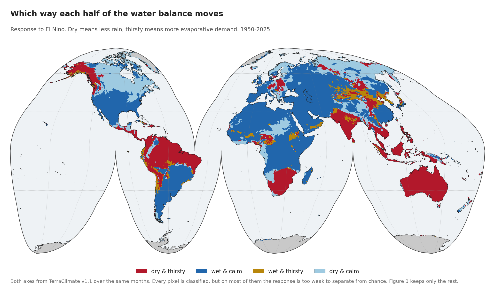
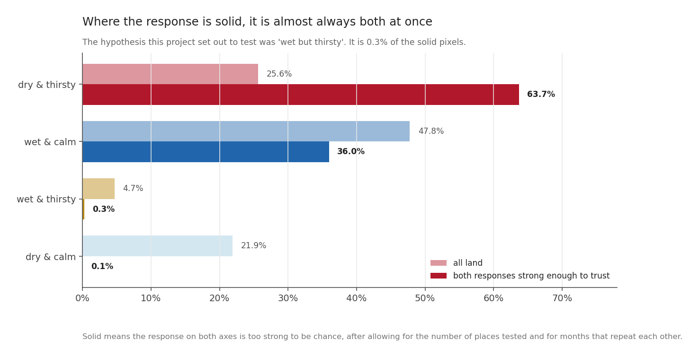
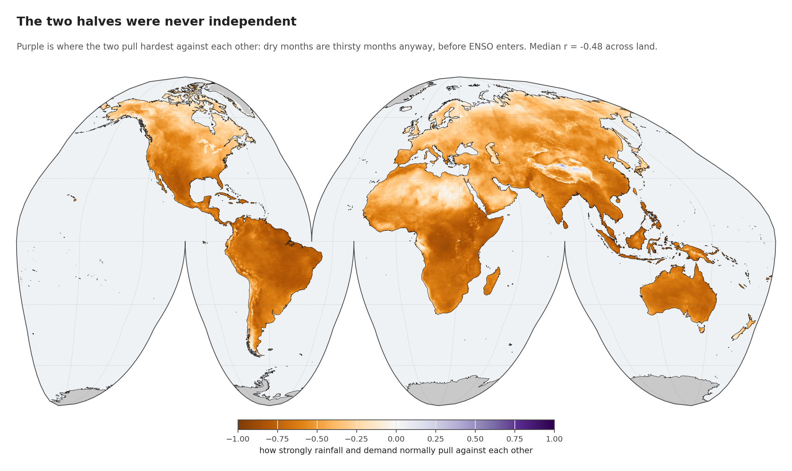
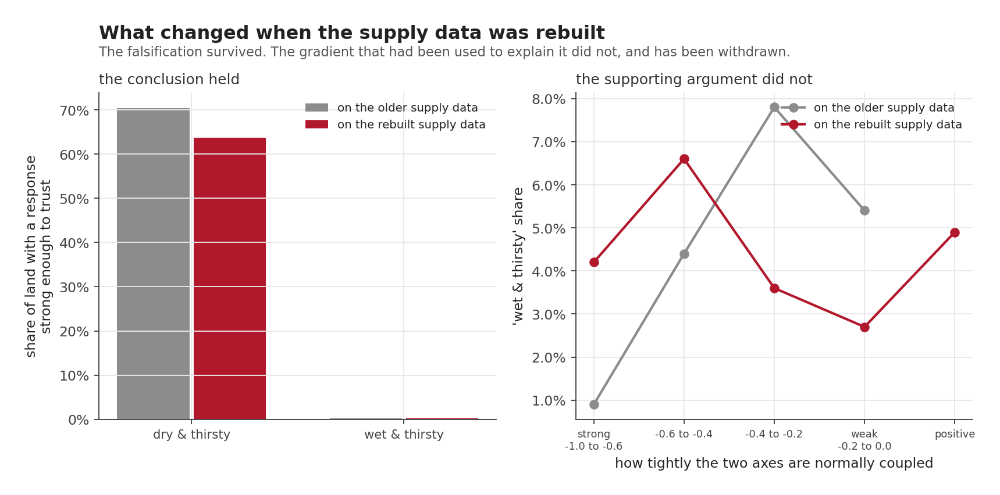

The last post counted dry spells on each axis separately. This one puts them together, because the reason the project was built with two axes was a specific hypothesis, and it is time to test it.

Drought is usually measured on the supply side: how much rain arrived. But the atmosphere also takes water away, and the two need not move together. The interesting case would be places where El Niño leaves rainfall roughly alone while raising evaporative demand sharply. Normal rain, abnormal thirst. A drought that a rainfall-based monitor would not see.

This post is the result, and the hypothesis does not survive.

Note that the question here is different from the last post's. Run theory counted how much time each axis spends in a dry spell. This post asks which **direction** each axis moves when El Niño arrives, which is a regression on RONI rather than a count of spells. The two can disagree, and where they do, the disagreement is the finding.

Each cell is assigned to a quadrant by the **sign of its response on each axis**, where $r$ is the correlation of that index with RONI over the 912 shared months:

$$
\text{dry} = \left(r_{\text{SPI}} < 0\right), \qquad
\text{thirsty} = \left(r_{\text{EDDI}} > 0\right)
$$

Four combinations follow, and the one this project was built to look for is
`not dry and thirsty`: rainfall holding up while the atmosphere pulls harder.

## The ingredients

| | |
|---|---|
| **Supply** | SPI-3 from TerraClimate v1.1 precipitation |
| **Demand** | EDDI-3 from the same product's reference evapotranspiration |
| **Period** | 1950-01 to 2025-12, 912 months, both axes on the same months |
| **Predictor** | RONI |
| **What counts as a real response** | A false discovery rate test at q < 0.05, run on how many genuinely independent months the record holds, which is fewer than the calendar says. Post 2 explains both corrections. |

Where this post says a response is **solid**, that is what it means: the cell passed that test, so its response is unlikely to be a coincidence thrown up by testing a quarter of a million places at once. Cells that fail still get classified, but their classification is mostly noise.

Both axes now rest on the same input over the same span. That was not true earlier in this series: the supply data ran from 1958 and has since been rebuilt to 1950. The last section of this post is about what changed when it was.

## The map

Four possibilities. El Niño can make a place drier or wetter, and thirstier or calmer, and the combinations are not equally common.

| | share of all land | share where **both** responses are solid |
|---|---|---|
| **dry & thirsty** | 25.6% | **63.7%** |
| wet & calm | 47.8% | 36.0% |
| **wet & thirsty** | 4.7% | **0.3%** |
| dry & calm | 21.9% | 0.1% |

The second column is the one that matters. Classifying every pixel is easy; most classifications are noise. Restricting to land where *both* the rainfall response and the demand response survive a false-discovery-rate test leaves a very different picture.

"Wet but thirsty" is **0.3 per cent** of it. That is not a hypothesis surviving in a marginal or regionally confined form. There is nothing there.

The other **99.7 per cent** sits on the diagonal, either drier and thirstier together or wetter and calmer together. Wherever El Niño has a firm effect on the water balance, it moves both halves the same way.

## Why a dead hypothesis is the worse news

A hypothesis dying is usually a deflating result. This one is not, and it took me a while to see why.

"Wet but thirsty" would have been a *monitoring* problem: a kind of drought that rainfall-based systems miss. Awkward, fixable by adding an index.

What is there instead is a *compound hazard*. On nearly two thirds of the land where the response is solid, El Niño reduces the water arriving and increases the water leaving, **at the same time, in the same season**. Those effects do not add. They multiply into soil moisture, and the deficit runs deeper than either axis suggests alone.

The Maritime Continent composite in an earlier post is exactly this: rainfall at 61 per cent of normal while demand ran 1.12 standard deviations above it.

## The two axes were never independent

Before reading anything into the quadrant shares, there is a fact about the climate that has to be on the table.

Rainfall and evaporative demand already pull against each other before ENSO enters the question. The median correlation between them across land is **-0.48**, and in the deep purple regions it runs past -0.8. Dry months are thirsty months anyway: clear skies bring both less rain and more radiation.

So "dry and thirsty" being the dominant solid quadrant is partly the climate's own structure, not an ENSO discovery. **What El Niño does is act along that existing coupling instead of across it.** Only **26.6 per cent** of land responds contrary to its own local coupling, and among solid land, **0.33 per cent**.

That is a more precise statement than the hypothesis I started with, and it is the one the data supports.

## Supply is easier to see than demand

Two numbers from the same run belong next to each other.

The rainfall response is statistically solid on **13.1 per cent** of land. The demand response, on **4.5 per cent**.

That is not because demand responds less. It is because **demand repeats itself**. Its record of 910 months is worth only **102 independent ones** once you account for how much each month resembles the one before it. Rainfall gets **196**. Demand is persistent, so consecutive months carry much of the same information, and the same record length buys about half as much evidence.

So the demand signal is real and hard to prove at the same time, which is a different problem from being weak, and one the record length cannot fix.

## Three locations, three answers

| | rainfall response | demand response | how coupled locally | quadrant |
|---|---|---|---|---|
| Makassar | **-0.554** | **+0.559** | -0.811 | dry & thirsty |
| Indramayu | -0.334 | +0.428 | -0.842 | dry & thirsty |
| **Tarutung** | **+0.160** | **+0.147** | -0.619 | **wet & thirsty** |

Makassar and Indramayu are textbook compound cases: rainfall down, demand up, in a place where the two are already tightly anti-correlated.

Tarutung sits in the rare quadrant. Rainfall responds slightly positively and so does demand, in a place where the two normally run opposite. It is the shape the whole project set out to find, sitting about 2,450 kilometres from Makassar in the same country.

It is also, as an earlier post established, a location where the fit has **no skill out of sample**: trained on the years it has seen, it fails to predict a year it has not. So Tarutung is a real feature of the historical record that nobody could have forecast, and that is a fair summary of the "wet but thirsty" case as a whole. Where it does turn up, it turns up unpredictably.

## What changed when the supply data was rebuilt

Earlier in this series these results ran on a supply dataset starting in 1958. It has since been rebuilt to 1950, and everything above was recomputed. Two things happened, and both belong in the record.

The conclusion held. "Wet but thirsty" went from 0.2 to 0.3 per cent of solid land and "dry and thirsty" from 70.4 to 63.7 per cent, so the falsification stands.

A supporting argument did not survive, and I have withdrawn it. The earlier write-up leaned on a gradient: "wet and thirsty" was 0.9 per cent of land where the two axes are strongly coupled, rising to 7.8 per cent where they are weakly coupled, which supported reading it as the *absence* of coupling instead of El Niño overriding it. On the rebuilt data the same bands give 4.2, 6.6, 3.6, 2.7 and 4.9 per cent. There is no gradient, and the strongly-coupled band is now four times its earlier value.

That argument is gone. The conclusion now rests on the occupancy alone, which was always the stronger evidence.

One caveat on that comparison, since it would be easy to over-read: the period widened **and** the input version changed at the same time, so it is not a controlled test of the extra eight years. It tells you the answer moved when the data was corrected, not why.

## Next: the present

Everything so far has been the historical record. The next post stops looking backwards and asks where the world actually is, with the event already under way. It waits for August to close first, because the observations it needs do not exist until the month is over.

*Next: [Where it is right now](20260904-where-it-is-right-now.qmd), once August has closed.*
