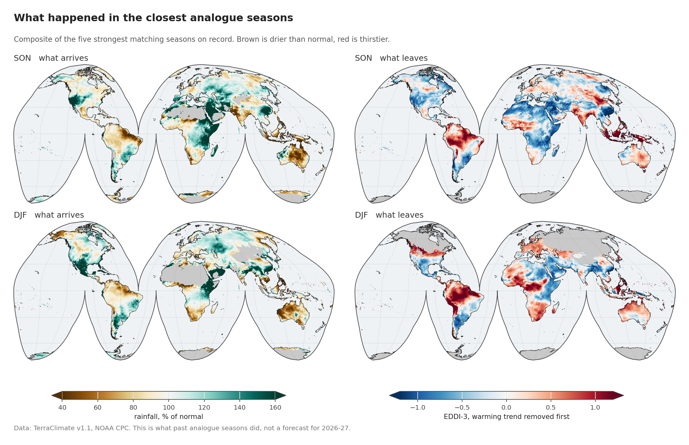
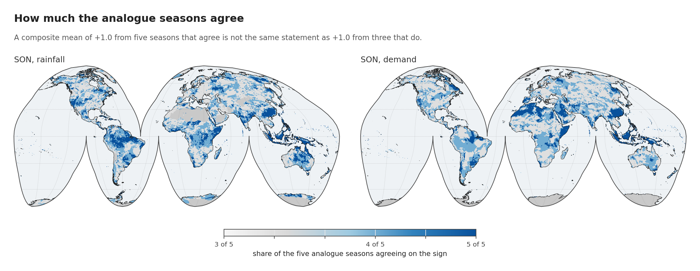
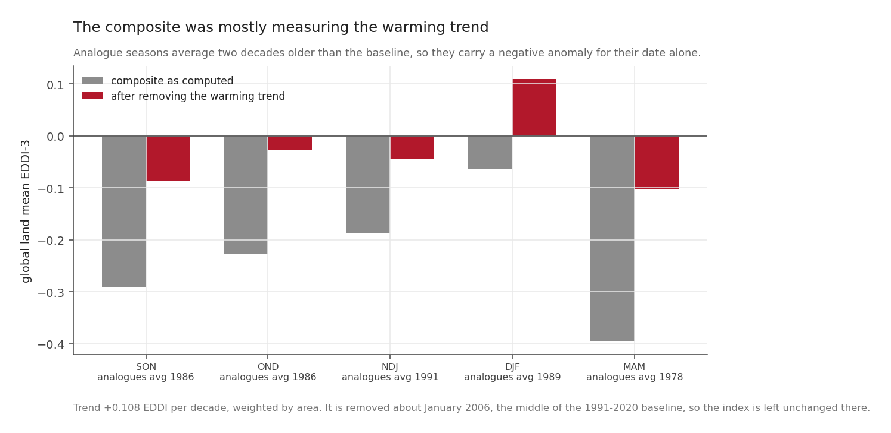
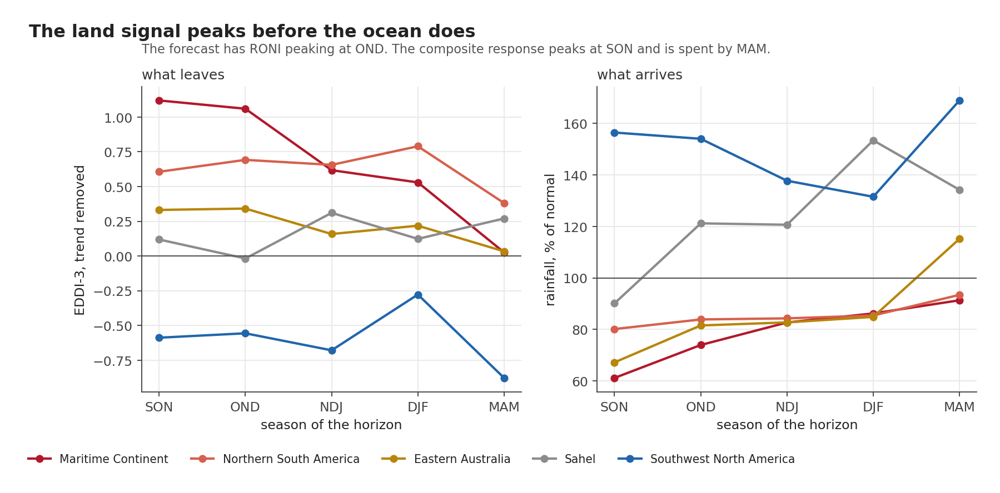

The first post established that for SON, OND and NDJ 2026 there is no season in the record as strong as the forecast, and set the rule for what to do about it: take the five strongest matching seasons, and state how far short of the forecast they fall.

This post is what those seasons did.

Everything below is a description of the past. Not one number here is a forecast, and the distinction matters more than usual for two reasons. The analogues are weaker than what is coming. And the last post showed that in one region, eastern Australia, the observed present is already contradicting them.

## The five seasons, and how they were picked

| | |
|---|---|
| **Analogues** | Five strongest matching seasons per target, from 1950-2025 |
| **SON** | 1965, 1972, 1982, 1997, 2015. Median RONI +2.03 against a forecast of +2.47 |
| **DJF** | 1958, 1983, 1992, 1998, 2016. Median +2.13 against +2.23 |
| **Supply** | Seasonal rainfall as a percentage of the 1991-2020 normal, and SPI-3 |
| **Demand** | EDDI-3, with the long-term warming taken out first, for the reason set out below |
| **Grid** | 0.25 degree for display, aggregated from 1/24 degree |

## The composites



Left, what arrives: rainfall as a percentage of what that season normally delivers. Right, what leaves: evaporative demand. Brown is drier than usual, red is thirstier.

The pattern in the top row is the classic one, and the parts need names, because the rest of the series keeps coming back to them.

**The Maritime Continent** takes the hardest hit, and takes it first. Averaged over the region in SON, rainfall in these seasons ran at **61 per cent of normal** while demand sat **1.12 standard deviations** above it. One standard deviation is the ordinary year-to-year wobble, so 1.12 means a season further from normal than roughly seven in eight. Both halves of the water balance moved the wrong way at once, which is the compound signature this series was built to look for.

**Southwest North America** comes out the mirror image, with rainfall at **156 per cent of normal** and demand **0.59 below**. The same events produce the opposite outcome, and by a wide margin: by MAM the region reaches 169 per cent of normal.

**Northern South America** is slower to start and slower to let go. It runs dry from SON onward, but its strongest demand anomaly lands at **DJF**, +0.79, a full season after the Maritime Continent has begun to recover.

**Eastern Australia** takes an early, moderate hit, at 67 per cent of normal rainfall in SON, then eases back.

**The Sahel** barely responds. SON demand is +0.12 with rainfall at 90 per cent of normal, and the later seasons turn wet instead. It is in this series precisely because the Pacific signal there should be weak, and it duly is.

## How much do the analogue seasons actually agree?



A composite mean hides its own sample. An average of +1.0 from five seasons that all point the same way is a different statement from +1.0 produced by three strong seasons and two that went the other way, and the mean alone cannot tell them apart.

So every field here carries its sign agreement: the share of the five analogues on the majority side. It runs from 0.5, an even split, to 1.0, unanimous.

Over the Maritime Continent in SON, agreement averages **0.97 for demand and 0.94 for rainfall**. Across the region as a whole, nearly every analogue season did the same thing. That is about as strong as a five-member composite can be, and it is why this region carries most of the weight in later posts.

Elsewhere the map is patchier, and the patchy places are exactly where a confident-looking mean should not be trusted. Northern South America averages 0.76 for demand in SON. The Sahel, 0.68, is barely above the 0.5 that an even split would give.

The global land average is **0.73**. Read that number first: on most of the world's land, five seasons is not enough for a composite to say anything with confidence, and the regions above are the exceptions rather than the rule.

One line of that field was wrong for a week. It is shown here because the mistake is invisible in prose and obvious in code:

```python
# WRONG: np.nan > pivot evaluates to False, not NaN. An all-missing cell
# scores every analogue as "below", averages to 0.0, and flips to 1.0:
# perfect agreement about nothing.
above = (cube > pivot).mean(axis=0)

# RIGHT: mask first, then divide by the number that actually had data.
valid = np.isfinite(cube)
n = valid.sum(axis=0)
above = np.where(n > 0, ((cube > pivot) & valid).sum(axis=0) / np.maximum(n, 1),
                 np.nan)
```

It put a spurious unanimous value on every ocean cell and inflated the global agreement figure from 0.73 to 0.93. It was caught because an ocean that should have been blank came out solid blue on a draft map.

## The correction that has to come first



There is an arithmetic problem buried in any composite drawn from across a long record, and it nearly took this analysis with it.

Computed directly, the global land mean of the SON composite came out at **-0.292**. Read naively, that says strong El Niño seasons had *below normal* evaporative demand worldwide, which contradicts everything else measured in this series.

It is not physics, it is dates. EDDI is standardised against 1991-2020, but the SON analogues are 1965, 1972, 1982, 1997 and 2015, averaging **1986**, two decades before the middle of that baseline. Demand has been rising at about **0.108 standard deviations per decade** over global land, so roughly a fifth of that ordinary wobble every twenty years. A season sampled twenty years before the baseline therefore carries a negative anomaly for no reason but when it happened.

Removing the per-pixel trend before compositing brings the global means to between **-0.10 and +0.11**, which is what this project has now found three separate ways: **ENSO shifts the tail, not the global mean.**

Two details about how that was done matter.

The correction is applied to each season *before* averaging, not to the average afterwards. Both give the same mean, but only the first gives the right spread and the right sign agreement.

And the direction of the bias runs in the reassuring direction. Because these analogues mostly predate the baseline, the uncorrected composite **understates** the demand response rather than inventing one. Every positive number in the maps above would be larger, not smaller, if the trend had been handled by ignoring it.

## When it happens, not just whether



Tracking the composite across the five target seasons gives something a single map cannot.

The land signal peaks a season before the ocean does. The forecast has RONI peaking at OND 2026. The Maritime Continent composite peaks at **SON**, falls to +0.62 by NDJ, and is at **+0.03 by MAM**, indistinguishable from nothing. Whatever the Pacific does in December, the land signal in this region is largely spent by then.

The two hemispheres also take turns. Eastern Australia's demand response fades after OND while northern South America's is still strengthening into DJF.

For anyone planning around this, the seasonal shape is the useful part. The peak tells you how bad it gets. The shape tells you when to start watching and, just as usefully, when to stop.

## Indonesia, cell by cell

The five Indonesian locations this series follows, in SON, with sign agreement in the last column:

| Place | rainfall | SPI-3 | EDDI-3 detrended | agreement |
|---|---|---|---|---|
| Baubau | **15% of normal** | -1.61 | +1.30 | 5 of 5 |
| Makassar | **23%** | -1.54 | +1.34 | 5 of 5 |
| Indramayu | **23%** | -1.55 | +1.43 | 5 of 5 |
| Lahat | 60% | -1.49 | +1.10 | 5 of 5 |
| Tarutung | **116%** | +0.73 | +0.63 | 5 of 5 |

In the five strongest matching seasons on record, Baubau received **fifteen per cent** of its normal September to November rainfall, and Indramayu and Makassar under a quarter of theirs. All five analogue seasons agreed on the sign at all five locations.

Tarutung is the interesting one and the reason it is in the set. Rainfall **above** normal, SPI positive, and demand **still up**, unanimously. Within a single country, one location loses three quarters of its rain while another gains, and both end up with a thirstier atmosphere. Average that to a national figure and you have described somewhere nobody lives.

## How far these maps stretch

The result does not hang on the choice of five. Recomputing the Maritime Continent SON composite from only the three closest analogues instead of five moves it from +1.119 to +1.126, a difference of less than one per cent. The picture is not an artefact of where the cut was drawn.

It is a floor rather than a forecast. The analogue median for SON is +2.03 and the forecast is +2.47. These maps show what happened in seasons the forecast is expected to exceed. If the relationship between the Pacific and the land holds at that level, the coming season would be *stronger* than what is drawn here, not weaker.

It says nothing yet about skill. Everything above describes what happened. Whether the underlying relationship can predict anything at a given location, on a year it has not already seen, is a separate question with a much less comfortable answer, and it gets its own post.

And five seasons remain five seasons however carefully they are averaged. The agreement field is published beside every mean so that this cannot be quietly forgotten.

## Next: from description to prediction

The next post stops describing the past. It evaluates the fitted relationship at the forecast value, which means extrapolating beyond every season used to fit it, then asks where that relationship predicts anything out of sample at all, and when in the horizon the effect arrives. That is a stronger claim and a more fragile one, and it comes with a map of exactly where the extrapolation is happening.

*Next: [Where it bites, and when it arrives](20260908-where-it-bites-and-when.qmd).*
