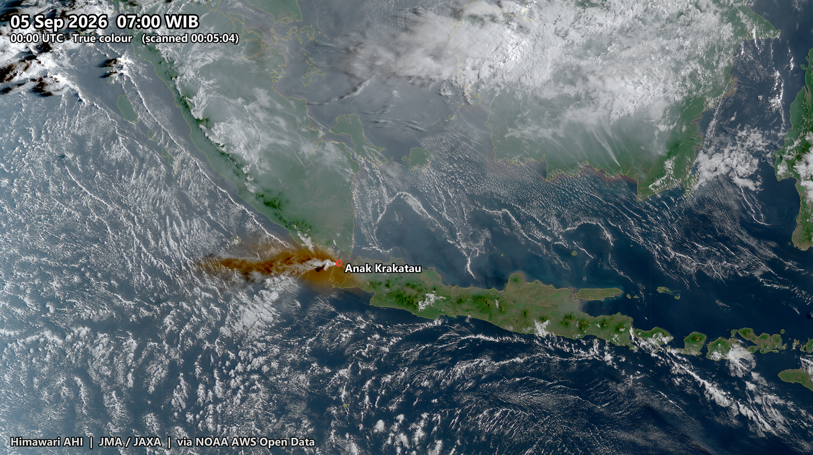
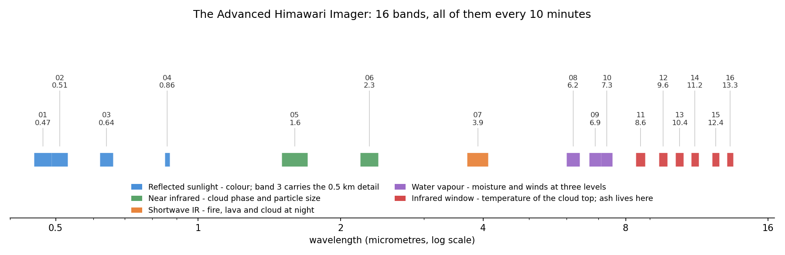
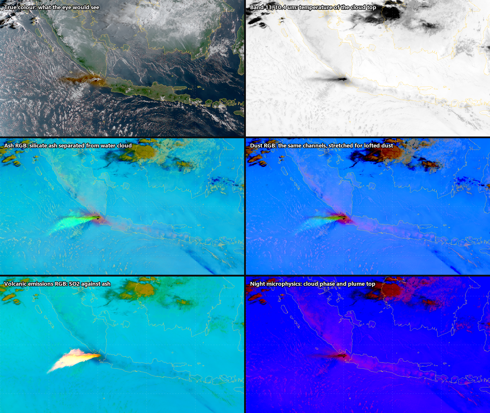
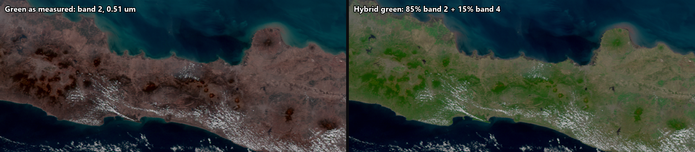
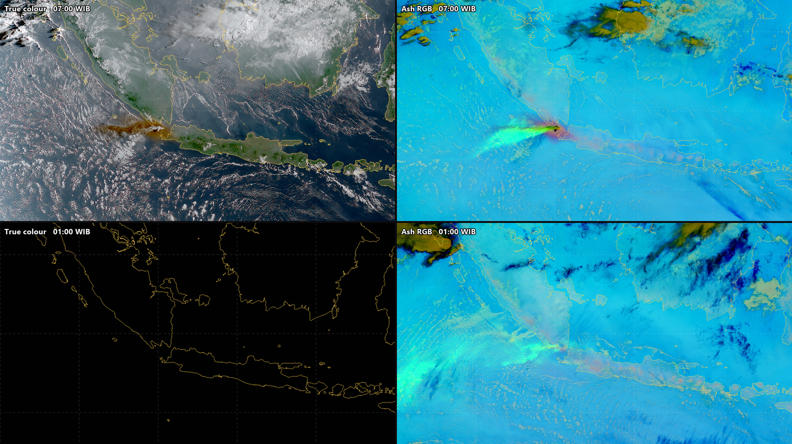
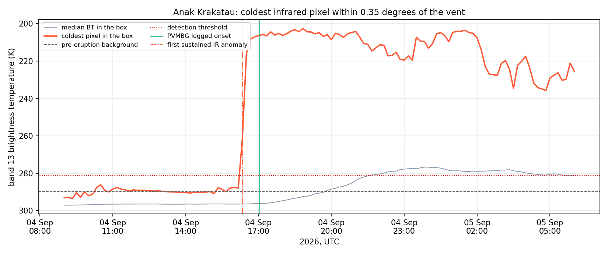
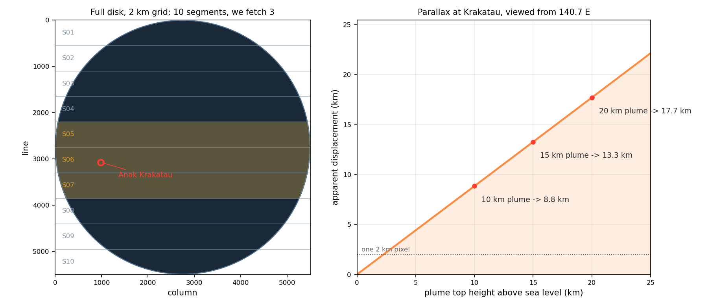
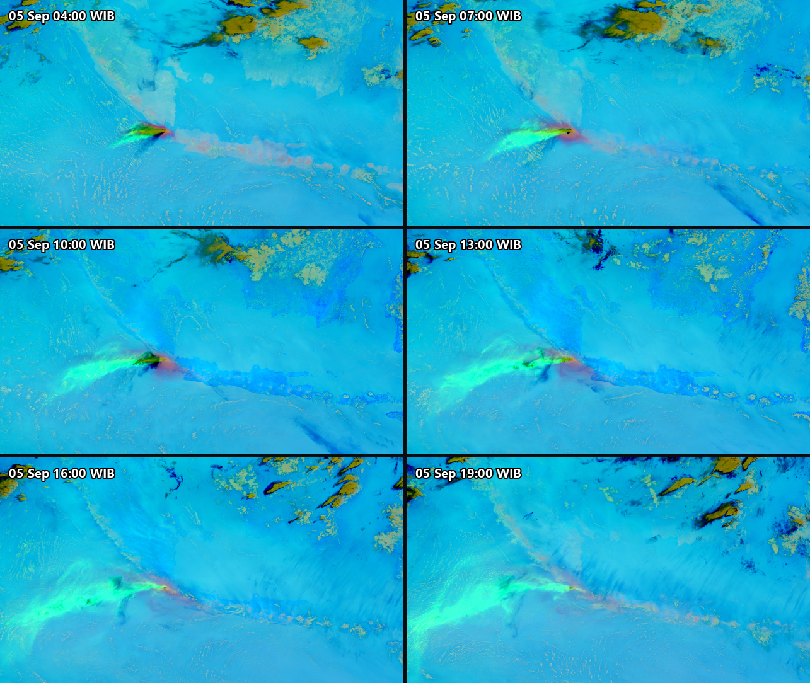

On Saturday 5 September 2026, at one minute past midnight local time, Anak Krakatau erupted. PVMBG logged it, held the alert at Level III, and kept the three kilometre exclusion zone around the crater.

Their bulletin contains a phrase that is easy to skim past. Where the height of the eruption column should be, it says: *Tinggi kolom erupsi tidak teramati*. The height of the eruption column was not observed.

That is not a failure of the observatory. It was the middle of the night, the observation post at Pasauran looks across open water at the vent, and you cannot measure the top of a column you cannot see.

Meanwhile, 35,786 kilometres above the equator, an instrument was photographing the entire hemisphere every ten minutes, in sixteen wavelengths at once, and had been all night.



That is seven in the morning, Jakarta time. The brown plume streaming west-north-west across the strait and out over the Indian Ocean is the ash.

This post is about what you can actually get out of that record, band by band.

## The instrument

Himawari-9 is a Japan Meteorological Agency weather satellite parked over 140.7 degrees east, turning at exactly the rate the Earth turns, so it hangs over the same spot permanently. It has been the operational satellite since 13 December 2022.

It carries the Advanced Himawari Imager. Sixteen spectral bands, from deep blue at 0.47 micrometres out to 13.3 micrometres in the thermal infrared:



They are not sixteen versions of the same picture. They are five different instruments sharing one telescope.

**Bands 1 to 4** measure reflected sunlight, so they give colour, and they stop working at sunset. Band 3, the red one, is the sharpest thing on the satellite at 500 metres.

**Bands 5 and 6** sit in the near infrared where ice and water clouds behave differently, which is how you tell them apart.

**Band 7**, at 3.9 micrometres, straddles reflected and emitted energy. It sees fire and lava as bright points even at night.

**Bands 8, 9 and 10** are water vapour channels. They cannot see the ground at all: they see moisture at three different heights, which makes them a way of watching the flow of the atmosphere itself.

**Bands 11 to 16** are the infrared window. They measure the temperature of whatever surface the sensor can see, cloud top or ocean, day or night, indifferently. Volcanic ash lives here, because silicate particles absorb differently across these wavelengths than water droplets do.

And the whole set is acquired **every ten minutes, forever**. JMA calls each ten minute period a *timeline*: one full disk scan, 144 times a day.

## One instant, six ways

Here is a single moment, 07:00 Jakarta time on 5 September, rendered six different ways from the same sixteen-band observation.



Read them as answers to different questions.

**True colour** answers *what would I see out of the window*. Brown plume, green islands, white cloud. Intuitive, and useless in nine hours when the sun sets.

**Band 13** answers *how cold is the top of it*, which in a convecting atmosphere means *how high*. In this rendering colder is darker, so the plume top reads as the dark wedge west of the vent. This is the plainest possible product and still the most quantitative.

**The Ash RGB** answers *is that ash or is it weather*. It builds three colour channels out of brightness temperature differences: 12.4 minus 10.4 micrometres, 11.2 minus 8.6, and 10.4 on its own. Silicate ash and water cloud absorb differently across the window, so ash separates out as a colour that meteorological cloud does not take.

**The Dust RGB** uses exactly the same four channels with a different stretch, tuned for lofted particles.

**The Volcanic Emissions RGB** answers *where is the sulphur dioxide*. It is the most striking panel here: the SO2 plume glows almost white against everything else. Satpy does not ship this composite for Himawari at all, only for the American and European imagers, so I transcribed the CIRA recipe onto the matching Himawari channels.

**Night microphysics** answers *what is the plume made of and how high is it*, and works in darkness.

Six answers, one observation, no extra data.

## Why true colour is harder than it looks

There is a small scandal hiding in that first panel.

Chlorophyll reflects with a local maximum near 0.55 micrometres. That is why plants are green. The AHI's green band, band 2, is centred at **0.51** micrometres, deliberately to the blue side of that peak. Feed bands 3, 2 and 1 straight into red, green and blue and vegetation comes out brown.

Same scene, same corrections, same stretch. The only difference between these two panels is the green channel:



Left is Java as the instrument measures it. Right is Java after the fix proposed by Miller and colleagues in 2016: blend a little of the 0.86 micrometre vegetation band into the green.

$$
G_{\text{hybrid}} = (1 - F)\, R_{0.51} + F\, R_{0.86}, \qquad F = 0.15
$$

Fifteen percent. Across 416,660 sunlit pixels it lifts the mean green level from 52 to 67 out of 255, and turns an island that looks scorched into an island that looks like Java.

There is a nice irony for an ash post. That band was placed off the chlorophyll peak *because* the designers wanted sensitivity to aerosol and ash rather than to vegetation. The choice that makes the forest look wrong is part of what makes the plume look right.

## What survives sunset

This is the part that pays off the missing number in the PVMBG bulletin.



Top row is seven in the morning. Bottom row is one o'clock the following night, thirteen hours later, same place, same instrument. True colour at night is a black rectangle with a coastline drawn on it. The Ash RGB is still tracking the plume across the strait, because 10.4 micrometres does not care whether the sun is up.

So the natural thing to animate is not true colour. It is the ash product, which runs continuously through all three days with no day/night seam at all:

<video controls loop muted playsinline preload="metadata"
       poster="../assets/image-blog/20260907-ten-minutes-over-the-sunda-strait-01.png"
       style="width:100%; height:auto; border-radius:4px;">
  <source src="../assets/image-blog/20260907-ten-minutes-over-the-sunda-strait-06.mp4" type="video/mp4">
</video>

*Three days of the Ash RGB at ten minute steps, 4 to 6 September. 433 frames at six per second, so one second of video is one hour of real time. [Full quality version on Google Drive](https://drive.google.com/file/d/1HVk19uSq-JO5WenUxPbAf0nJneVMcV1s/view?usp=sharing).*

Or, if you want the intuitive daytime view *and* continuity, you can have both. A day/night compositor mixes on solar zenith angle, fully true colour below 85 degrees, fully infrared above 88, linearly across twilight:

<video controls loop muted playsinline preload="metadata"
       style="width:100%; height:auto; border-radius:4px;">
  <source src="../assets/image-blog/20260907-ten-minutes-over-the-sunda-strait-10.mp4" type="video/mp4">
</video>

*The same three days, true colour by day dissolving into the Ash RGB at night. Same rate: one second is one hour. [Full quality version on Google Drive](https://drive.google.com/file/d/1OTL8hyyPKf4CEqIHjO8Uk7yLqWjskbWD/view?usp=sharing).*

Sunrise and sunset become a dissolve rather than a cut to black.

## Measuring, not just looking

Once you have three days at ten minute spacing you can stop looking at pictures and start measuring.

Band 13 gives brightness temperature, $T_{13}$, in kelvin. An eruption column convects upward, the troposphere gets colder with height, so a column punching upward shows up as a sharp drop in the coldest brightness temperature over the volcano.

The method is four lines of arithmetic, and I would rather write them down than ask you to trust a plot.

Let $B$ be a box of half-width $0.35^\circ$ centred on the vent, about 39 kilometres across, wide enough to hold a column displaced by parallax and its first hours of drift. For each timeslot $t$, take the coldest pixel in that box:

$$
T_{\min}(t) \;=\; \min_{(i,j)\,\in\,B} T_{13}(i,j,t)
$$

Establish what quiet looks like, from the first $n = 18$ slots, three hours, well before anything happens:

$$
\mu = \operatorname{median}_{t \le t_n} T_{\min}(t),
\qquad
\sigma = \operatorname{sd}_{t \le t_n} T_{\min}(t)
$$

Set a threshold below that background. The $5\,\mathrm{K}$ floor stops an unusually still morning from making the test hair-trigger; the choice of four standard deviations is mine, not a standard:

$$
\tau = \mu - \max\!\left(4\sigma,\; 5\,\mathrm{K}\right)
$$

Call the onset the first slot that crosses $\tau$ **and** is still across it at the next slot, so a single cold pixel in a single frame cannot trigger it:

$$
t_{0} = \min\left\{\, t \;:\; T_{\min}(t) < \tau \;\wedge\; T_{\min}(t{+}1) < \tau \,\right\}
$$

Since satpy hands back calibrated kelvin directly, that is almost literally the code:

```python
import numpy as np
from himawari import render as R

HALF = 0.35                                   # degrees, box half-width
lon, lat = 105.423, -6.102                    # Anak Krakatau
box = R.Grid("vent", (lon - HALF, lat - HALF,
                      lon + HALF, lat + HALF), 0.02, "vent")

tmin = []
for when in timeslots:                        # every 10 minutes
    scn = R.load_scene(cache_dir, when, ["B13"])
    bt = R.resample_scene(scn, box)["B13"].values    # kelvin
    tmin.append(np.nanmin(bt))

tmin = np.array(tmin)
mu, sd = np.median(tmin[:18]), np.std(tmin[:18])
tau = mu - max(4 * sd, 5.0)

onset = next(i for i in range(len(tmin) - 1)
             if tmin[i] < tau and tmin[i + 1] < tau)
```

Over 4 September that gives $\mu = 289.7\,\mathrm{K}$, $\sigma = 2.1\,\mathrm{K}$, and therefore $\tau = 281.3\,\mathrm{K}$.

One thing this is not: a plume height. Converting a brightness temperature to an altitude needs a temperature profile through the atmosphere at that place and time, which I have not used. This detects a cold cloud top over the vent, and says when it appeared.



The background is flat and boring for eight hours: the coldest pixel sits at 290 K, give or take 2 K, which is warm sea and low cloud. Then it falls off a cliff. From 290 K to below 210 K in about twenty minutes, and it stays below 220 K for the next eleven and a half hours.

The first slot below threshold was observed at **16:24:05 UTC, which is 23:24 on 4 September Jakarta time**. PVMBG logged the eruption at 00:01 WIB on 5 September. The infrared anomaly begins **37 minutes earlier**.

I want to be careful about what that does and does not mean. An agency log entry and a satellite detection are not the same quantity: a bulletin timestamp may record when an eruption was confirmed, or when it was reported, or when one particular explosion happened. PVMBG's observers were working in the dark across open water with nothing visible to measure. This is not a scoreboard.

What it does show is the actual argument: when the ground cannot see, a ten-minute infrared record still resolves the onset to within a single ten-minute slot, retrospectively, from an archive, weeks later if you like.

## Why ten minutes is the whole point

On 15 January 2022 the submarine volcano Hunga Tonga-Hunga Ha'apai produced what is probably the best-observed explosion in the instrument record. The plume went more than 30 kilometres up with overshooting tops above 55 kilometres.

Two things happened next that only a ten-minute geostationary cadence could catch.

The first is that scientists at NASA's Langley Research Center measured the plume height by **stereoscopy**. GOES-17 and Himawari-8 both watched Tonga, from different longitudes, both every ten minutes. Match the same cloud feature in two simultaneous images from two viewpoints and you can triangulate its altitude, the way two eyes give you depth. They found the plume rose from the ocean surface to 58 kilometres in about half an hour. Conventional infrared methods fail up there, because in the mesosphere the temperature structure inverts and a cold pixel no longer means a high cloud.

The second is more visceral. The explosion launched a pressure wave into the atmosphere. Wright and colleagues, in *Nature*, tracked Lamb waves moving at 318.2 ± 6 metres per second and followed them at least three times around the Earth. You can see that wave by subtracting successive ten-minute images: everything static cancels, and what is left is concentric rings expanding across a hemisphere at the speed of sound.

That is what the cadence is for. Not better pictures, but a different class of question: not *what does it look like* but *how fast is it moving, and how much energy went into it*.

## Two things to know before you trust the pictures

**The plume is not quite where it appears to be.** A satellite over 140.7 east views the Sunda Strait from 35 degrees away in longitude, at a zenith angle of 41.5 degrees. It is looking at Krakatau from the side. An imager records where the ray from the satellite through the cloud crosses the ellipsoid, not the point under the cloud:



| Plume top | Apparent displacement |
|---|---|
| 5 km | 4.4 km |
| 10 km | 8.8 km |
| 15 km | 13.3 km |
| 20 km | 17.7 km |

A fifteen kilometre column is drawn about 13 kilometres west-south-west of the vent, roughly seven pixels. Every image here has that in it, and it is why the ash appears to begin slightly offshore of an island it is sitting on.

**The picture is not a snapshot.** The imager sweeps, north to south, taking nearly the whole ten minutes. JMA defines the time in the filename as the *observation start time (timeline)*: the start of the schedule slot, not the moment the shutter opened over any particular place. Each segment file carries its own true observation time, and measured across eight slots spanning three days those offsets are stable to under a second:

| Strip | Observed after the slot label |
|---|---|
| 5 | 245 s |
| 6, containing Krakatau | 305 s |
| 7 | 364 s |

Two consequences. The Sunda Strait is imaged about five minutes into the slot that names the file, which is why every frame above carries both times: the round slot time as the headline, and the actual scan time in brackets. And a single frame is not simultaneous with itself, spanning 208 seconds between its top and bottom edges. For a stationary cloud none of this matters. For a shock wave at 318 metres per second, three and a half minutes is 67 kilometres.

## Three days



## Doing it yourself

None of this needs special access. The JMA public page keeps only the last 24 hours, but the full archive is mirrored on AWS with no registration at all, and it runs from **7 July 2015 to about an hour ago**. One listing request shows you what exists:

```bash
curl -s "https://noaa-himawari9.s3.amazonaws.com/?list-type=2\
&prefix=AHI-L1b-FLDK/2026/09/05/0000/&max-keys=5" | grep -o '<Key>[^<]*'
```

The filenames decode completely:

```
HS_H09_20260905_0000_B13_FLDK_R20_S0610.DAT.bz2
   |    |        |    |   |    |   |  |
   |    |        |    |   |    |   |  +- of 10 segments
   |    |        |    |   |    |   +---- this is segment 6
   |    |        |    |   |    +-------- 2.0 km resolution
   |    |        |    |   +------------- full disk
   |    |        |    +----------------- band 13, 10.4 um
   |    |        +---------------------- 00:00 UTC
   |    +------------------------------- 5 September 2026
   +------------------------------------ Himawari-9
```

A full disk is cut into ten horizontal strips so that you can download only the ones you need. Solving the geostationary projection for the Sunda Strait says strips 5, 6 and 7.

That is three strips out of ten, but not 30% of the data. The strips are equal in *scan lines*, not in bytes: the disk is widest at the equator, so the middle strips carry more Earth and less black space, and black space compresses to almost nothing. Measured on one timeslot of the bands this post uses, strips 5 to 7 are 265 MB of 713 MB, or **37%**. Over three days that is the difference between a 297 GB download and a 79 GB one.

The pipeline I used is three notebooks, at [github.com/bennyistanto/himawari](https://github.com/bennyistanto/himawari). Download, process, animate. Everything is driven by one configuration file:

```yaml
event:
  name: Anak Krakatau
  lon: 105.423
  lat: -6.102

window:
  start_utc: 2026-09-03 17:00
  end_utc:   2026-09-06 17:00
  step_minutes: 10

products:
  - composite: ash
    grid: regional
  - composite: true_color
    grid: regional_hires
```

Once the data is local, one composite is about four lines:

```python
from himawari import project, render as R

cfg = project.load("config.yml")
R.use_local_config()

frames = R.render_timeslot(
    when, cfg.cache_dir, cfg.frames_dir,
    ["ash", "volcanic_emissions", "true_color"],
    R.GRIDS["regional"], marker=cfg.marker,
)
```

Point the same file at a different volcano, hemisphere and satellite and nothing else changes. `examples/tonga.yml` does exactly that for Hunga Tonga on Himawari-8, since Himawari-9 did not exist in January 2022.

Drop `true_color` from the product list and the download falls from 78 GB to about 12, because band 3 at half-kilometre resolution is roughly half the payload. The infrared products are the ones that work at night anyway.

Two practical notes. Keep the cache out of any folder that syncs to the cloud. And AHI takes two ten-minute slots off each day for housekeeping, at 02:40 and 14:40 UTC, so a day has 142 full disks and not 144. I checked six days; it was the same two every time.

---

## Sources

- Japan Meteorological Agency, Meteorological Satellite Center. [*Himawari-8/9 Himawari Standard Data User's Guide*, version 1.3](https://www.data.jma.go.jp/mscweb/en/himawari89/space_segment/hsd_sample/HS_D_users_guide_en_v13.pdf), 3 July 2017. Band table, segment structure, file naming, projection.
- JMA MSC. [Himawari-8/9 Imager (AHI)](https://www.data.jma.go.jp/mscweb/en/himawari89/space_segment/spsg_ahi.html) and [operational status](https://www.data.jma.go.jp/mscweb/en/oper/status.html).
- PVMBG / MAGMA Indonesia. [Anak Krakatau eruption report, 5 September 2026](https://magma.esdm.go.id/v1/gunung-api/informasi-letusan/caa4732d-a882-11f1-a61d-005056b54356/show), and Badan Geologi, [*Fenomena erupsi menerus Gunungapi Anak Krakatau tanggal 5 September 2026*](https://geologi.esdm.go.id/media-center/fenomena-erupsi-menerus-gunungapi-anak-krakatau-tanggal-5-september-2026).
- Wright, C. J., et al. [Surface-to-space atmospheric waves from Hunga Tonga-Hunga Ha'apai eruption](https://doi.org/10.1038/s41586-022-05012-5). *Nature* **609**, 741–746 (2022).
- NASA Earth Observatory. [Tonga Volcano Plume Reached the Mesosphere](https://science.nasa.gov/earth/earth-observatory/tonga-volcano-plume-reached-the-mesosphere-149474/), 17 February 2022.
- Miller, S. D., et al. (2016). [A Sight for Sore Eyes: The Return of True Color to Geostationary Satellites](https://journals.ametsoc.org/view/journals/bams/97/10/bams-d-15-00154.1.xml). *Bulletin of the American Meteorological Society* **97**(10).
- SO2 RGB recipe: [CIRA quick guide](https://rammb.cira.colostate.edu/training/visit/quick_guides/Quick_Guide_SO2_RGB.pdf).
- Data: Himawari-9 AHI Level 1b, JMA, via the [NOAA Himawari archive on AWS Open Data](https://registry.opendata.aws/noaa-himawari/). Processing with [Satpy](https://satpy.readthedocs.io) and [Pyresample](https://pyresample.readthedocs.io).

Every number here is either measured from the data by a script I ran, or cited above. Two things I could not settle and so do not claim: whether the AWS mirror is byte-identical to JAXA's own archive, and why AHI's two daily gaps fall exactly where they do.
