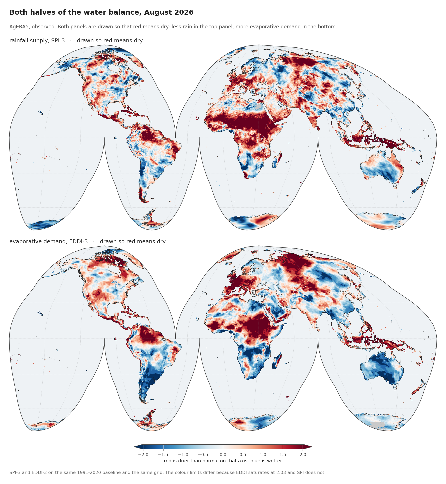
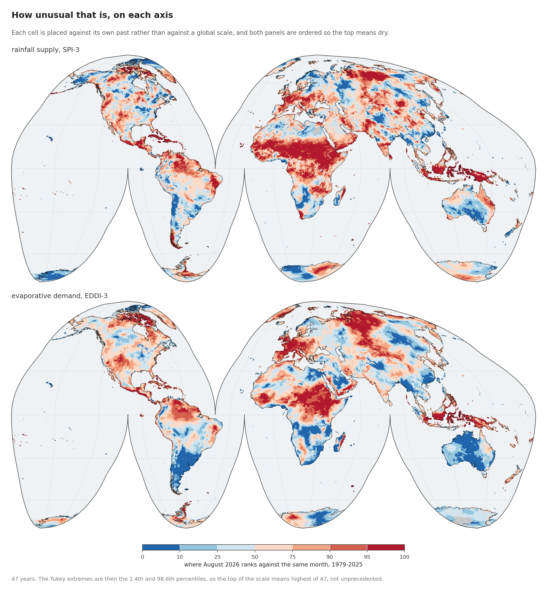
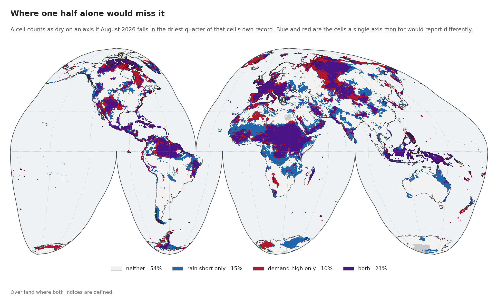
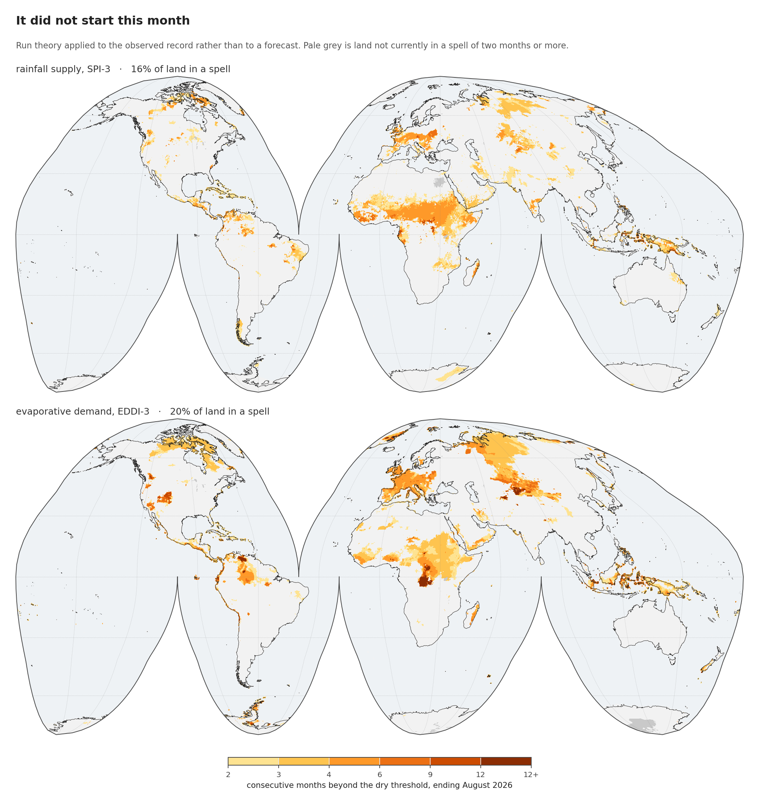
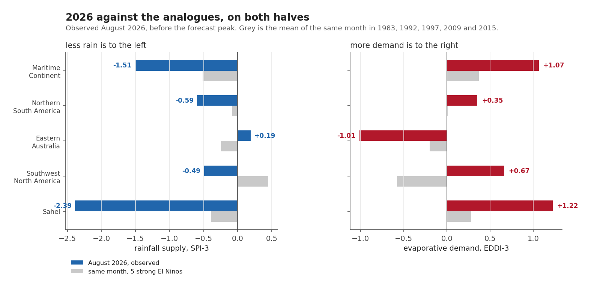
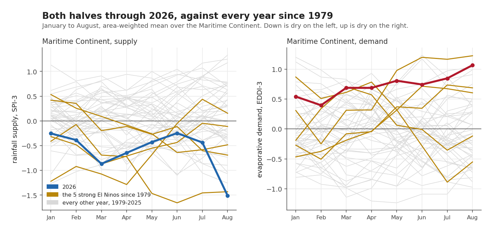
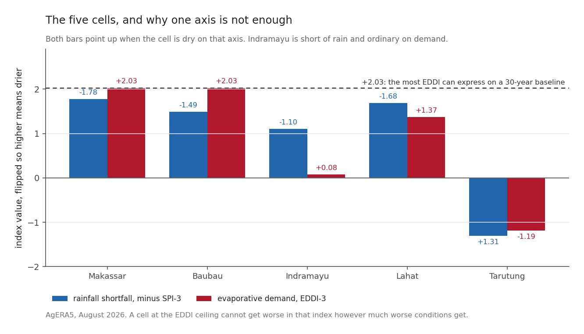

Every post so far has been about the past or about a forecast. This one is about now.

## One thing to say before the maps

None of the numbers below can be set beside the ones in posts 4 to 6. Those come from TerraClimate, which stops in December 2025. This post is AgERA5, which reaches August 2026. Post 4 measured the gap between the two products: a median of 8 mm a month in level, with their monthly anomalies correlating at 0.94. Close enough to tell the same story, not close enough to share a table.

Both halves are here, on the same grid and the same 1991-2020 baseline. That matters more than it might sound, and the reason is at the end of this post.

## Where it is dry



**August 2026**, the most recent month, over 2.39 million land cells on the supply side and 2.33 million on the demand side.

One caveat about that month before anything is read off it. The rainfall side covers all **31 days** of August. The demand side covers **29**, because AgERA5's reference evapotranspiration had not published the last two days when this was built. Both indices accumulate over three months, so those two days are missing from a 92-day window: the demand totals run about **2 per cent** short, and every EDDI figure below is a floor. It is small, and it points the same way everywhere, so it widens the gap between the two axes rather than narrowing it.

Both panels are drawn so that **red means dry**: less rain in the top panel, more evaporative demand in the bottom. That is a deliberate choice, because the two indices point in opposite directions by construction. A low SPI is a shortfall; a high EDDI is a shortfall. Drawing them raw would have made the reader flip one of them in their head at every comparison.

It is one sign, carried in the configuration and never inferred, because getting it backwards would report a wet anomaly as a drought with no error anywhere:

```python
AX = {"supply": dict(label="rainfall supply, SPI-3", sign=-1),
      "demand": dict(label="evaporative demand, EDDI-3", sign=+1)}

# Everything downstream works on sign * value, so one code path serves both.
F[k]["dry"] = AX[k]["sign"] * F[k]["value"]
```

Global land averages **−0.33 on SPI-3** and **+0.12 on EDDI-3**. Neither is the interesting number. The global mean of a standardised index is near zero by construction; what matters is where it is not.

## Whether that is unusual



Ranked against every August from 1979 to 2025, on the dry side of each axis so the top of both scales means dry:

| region | SPI-3 | rank | EDDI-3 | rank |
|---|---|---|---|---|
| **Sahel** | **−2.39** | **96.6th** | +1.22 | 90.3rd |
| **Maritime Continent** | **−1.51** | **94.5th** | +1.07 | 92.4th |
| Southwest N. America | −0.49 | 71.7th | +0.67 | 77.9th |
| Northern S. America | −0.59 | 65.5th | +0.35 | 61.4th |
| **Eastern Australia** | **+0.19** | 38.6th | **−1.01** | 17.9th |

**The Sahel is at SPI-3 of −2.39**, a severe rainfall shortfall. The typical cell there beat 46 of the 47 Augusts on record, so for most of the region only one August since 1979 was drier. The supply axis is further from normal than the demand axis alone suggested.

The rank is a **Tukey plotting position**, the same rule EDDI itself uses to turn a rank into a probability ([Hoylman and colleagues, 2024](https://doi.org/10.1029/2023WR036087), describing the EDDI method), with $r$ the number of earlier years this year beats and $k$ the number of years available:

$$
F = \frac{r + 1 - \tfrac{1}{3}}{k + 1 + \tfrac{1}{3}}
$$

The $+1$ terms are what stop $F$ ever reaching 0 or 1. One caution follows directly from it: with $k = 47$ the attainable extremes are the **1.4th and 98.6th** percentiles, so **the top of the colour scale means "driest of 47", not "unprecedented"**.

## Where one half alone would miss it



This is the figure the earlier draft of this post could not draw, and it is the one that justifies the whole two-axis apparatus.

Counting a cell as dry on an axis if it lands in the driest quarter of its own record for August 2026, over land where both indices are defined:

| | share of land |
|---|---|
| neither | 53.9% |
| **rain short only** | **14.8%** |
| **demand high only** | **10.5%** |
| both | 20.7% |

**A quarter of the world's land is dry on exactly one axis.** A monitor watching rainfall alone reports the blue areas and misses the red; one watching demand alone does the reverse. Neither share is a rounding correction on the other. At 14.8 and 10.5 per cent they sit in the same range as the 20.7 per cent where the two agree.

## How long it has been going



Run theory on the observed record, with no forecast in it: consecutive months up to August 2026 beyond the dry threshold on each axis.

| region | rain-short spell | demand spell |
|---|---|---|
| **Sahel** | **74.1%** | 55.2% |
| **Maritime Continent** | **31.9%** | **49.5%** |
| Southwest N. America | 7.9% | 21.4% |
| Northern S. America | 8.6% | 19.9% |
| Eastern Australia | 7.2% | **0.1%** |

*share of regional land currently in a spell of two months or more*

Across all land it is **16.1 per cent on supply** and **19.8 per cent on demand**.

Three quarters of the Sahel is in a rainfall deficit spell, and half the Maritime Continent is in an elevated-demand one, with the forecast having the Pacific peak in October to December. Whatever is coming, it is not arriving at a dry season that has not started.

## How it compares with the analogues





The five strong El Niños inside the AgERA5 record are **1983, 1992, 1997, 2009 and 2015**. August 2026 against the mean of those five:

| region | supply 2026 | supply analogue | demand 2026 | demand analogue |
|---|---|---|---|---|
| Sahel | **−2.39** | −0.39 | +1.22 | +0.28 |
| Maritime Continent | **−1.51** | −0.51 | +1.07 | +0.37 |
| Southwest N. America | −0.49 | **+0.45** | +0.67 | **−0.58** |
| Northern S. America | −0.59 | −0.08 | +0.35 | +0.01 |
| Eastern Australia | +0.19 | −0.24 | −1.01 | −0.20 |

2026 is drier than the analogue mean on both axes in four of five regions, and by a wide margin in the two that matter most. The phrasing needs care here, because I had it wrong in the first draft of the figure: **2026 sits at the top of the analogue spread, not outside it.** In the Maritime Continent one of the five strong events was thirstier in August than 2026 is.

Southwest North America is the odd row. The analogue mean says a strong El Niño should bring it *more* rain and *less* demand by August. This year it is short of rain and above normal on demand, running against the analogue on both counts.

Eastern Australia is going the other way on both halves too, at the 38.6th and 17.9th dry percentiles: slightly wet, and calm. Post 8 puts it among the regions where the historical composite is confidently dry in an El Niño. Right now it is not. Either the response is running late, or five events cannot promise as much as they appear to.

## The five cells, and why one axis is not enough



| cell | SPI-3 | rank | EDDI-3 | rank | reading |
|---|---|---|---|---|---|
| **Makassar** | **−1.78** | 98.6th | **+2.03** | 98.6th | dry and thirsty, demand at the ceiling |
| **Baubau** | −1.49 | 96.6th | **+2.03** | 98.6th | dry and thirsty, six-month demand spell |
| Lahat | −1.68 | 94.5th | +1.37 | 94.5th | dry and thirsty |
| **Indramayu** | **−1.10** | **90.3rd** | **+0.08** | 63.4th | **short of rain, ordinary on demand** |
| **Tarutung** | **+1.31** | 11.7th | **−1.19** | 9.7th | wet and calm |

Indramayu is the case that makes the argument. The demand-only draft of this post put it at +0.08 EDDI, the 63rd percentile, not in a spell, and moved on. Its rainfall sits at the **90th dry percentile**. A monitor watching evaporative demand alone would have called this an unremarkable month on the north coast of Java, which is precisely the failure this series was built to argue against. It happened here, in my own first draft.

Tarutung has flipped. Post 6 identifies it as the one case cell sitting in the rare wet-and-thirsty quadrant historically. In August 2026 it is wet and *calm*, with the demand half doing the opposite of what its own historical response predicts. One month does not overturn a seventy-six year regression. A cell's average behaviour and its behaviour this month are different things.

Makassar and Baubau both read exactly +2.028, which is neither a coincidence nor a measurement. It is the ceiling. Post 4 showed that a thirty-year rank baseline offers only 31 possible levels, the most extreme of them ±2.028, and **9.3 per cent of land by area is pinned there**.

Those cells cannot get worse *in the index* however much worse conditions get, and any regression fitted against a saturated top end has its slope pulled down. The ceiling is a property of the baseline length, not of the weather. Rebuilding EDDI on the full 1979-2025 record would lift the ceiling to **+2.20**, enough to reach all eleven NOAA classes. (Post 4 quotes +2.17 for the same move, because it is working on TerraClimate's seventy-six years, where this post has AgERA5's forty-seven. A longer record raises the ceiling; the two numbers are the same rule on two records.) That has not been done, and until it is, "+2.03" should be read as "at least +2.03". Note that the supply axis has no such problem. SPI is built by fitting a curve to the rainfall record instead of ranking years against each other, so it has no ceiling of that kind and simply clips at ±3.09, so a saturated EDDI beside an unsaturated SPI is not evidence that demand is the larger anomaly.

## The limits of a single month

This post can say that both halves of the water balance are already dry across the Sahel and the Maritime Continent, that three quarters of the Sahel is in a rainfall deficit spell, that the present sits at the top of the analogue spread and not beyond it, and that a quarter of global land is dry on one axis while looking ordinary on the other.

What it cannot say is what happens next. August is one month, and the forecast peak is still three months away.

Nor can it separate El Niño from anything else. This is a description of an observed state with no attribution attached. The Sahel is the sharpest signal on the map, and post 9 finds the fitted relationship has essentially no skill there. Something is drying the Sahel. Nothing in this method can say the Pacific is.

*Next: [What the five closest El Niños did to the land](20260909-what-history-says.qmd), and how much five seasons can promise.*
