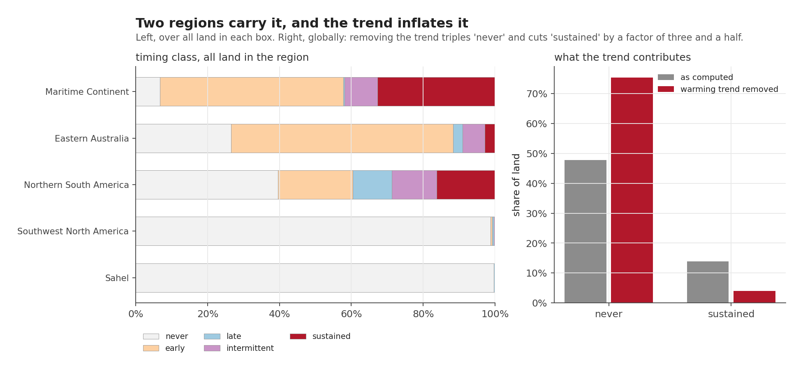
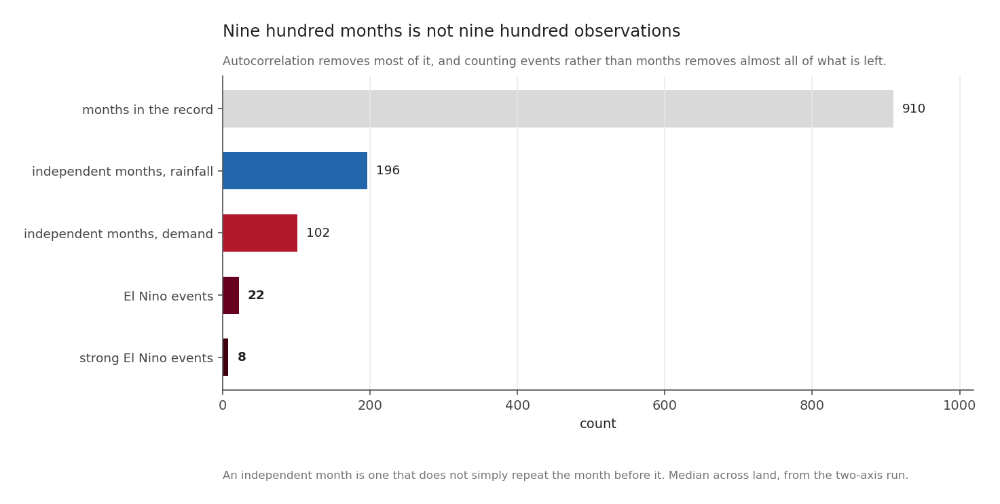
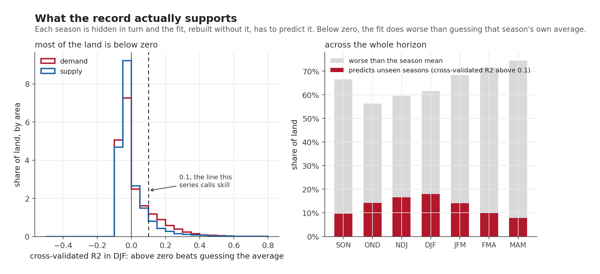

Nine posts have made claims. This one is about what those claims rest on, and it is thinner than the record makes it sound.

If you have arrived here first, the whole series in six lines:

| | |
|---|---|
| Globally | El Nino barely touches dry spells: one to fourteen per cent of itself |
| Regionally | nineteen percentage points over the Maritime Continent, sign reversed over southwestern North America |
| Mechanism | it **starts** spells rather than stretching them, up to 1.9 times in onsets against 1.16 in duration |
| The two halves | move together, not apart. Normal rain with abnormal thirst is **0.3 per cent** of solid land |
| The risk | record evaporative demand is 4 to 5 times likelier than chance, and about half of that is the warming trend |
| The catch | on **56 to 74 per cent** of land the fit predicts worse than guessing the season's own average |

The rest of this post is why that last line is the one that matters.

## The tail of the horizon, and what the trend contributes



The left panel is the horizon by region: who is affected, when, and for how long. The Maritime Continent is the outlier, with a third of its land elevated for four or more consecutive seasons and only 6.7 per cent escaping entirely. Southwest North America and the Sahel are essentially untouched by the *fitted relationship*, which is not the same as being untouched.

The right panel is the one to sit with. It shows what happens to the same classification when the warming trend is removed from both sides:

**Removing the trend triples the share of land classified "never", and cuts "sustained" by a factor of three and a half.**

So a good deal of what a naive version of this analysis would have called an El Niño signal reaching into 2027 is not El Niño. It is the climate having warmed since 1950, showing up as elevated evaporative demand in a target year that is later than the seasons the relationship was fitted on.

Every number quoted in the previous post is the detrended one, for this reason.

## What nine hundred months is worth



The record contains **910 usable months** on both axes.

It does not contain 910 observations. Evaporative demand in one month strongly resembles the month before, and a series that repeats itself carries less information than its length suggests.

The correction is the [**Bretherton effective sample size**](https://journals.ametsoc.org/view/journals/clim/12/7/1520-0442_1999_012_1990_tenosd_2.0.co_2.xml), which uses the lag-1 autocorrelation of *both* series, $r_1$ for the predictor and $r_2$ for the response:

$$
N_{\text{eff}} = N \, \frac{1 - r_1 r_2}{1 + r_1 r_2}
$$

When neither series repeats itself, $r_1 r_2 = 0$ and $N_{\text{eff}} = N$. When both are strongly persistent the numerator collapses and the denominator grows, and most of the record stops counting. Applied per cell:

| | count |
|---|---|
| months in the record | 910 |
| independent months, rainfall | **196** |
| independent months, demand | **102** |
| El Niño events | **22** |
| strong El Niño events | **8** |

Two things follow.

The demand axis costs about twice as much record to say the same thing. Rainfall anomalies sit closer to noise from one month to the next, so nearly every month counts for something, while demand carries most of itself forward. That is why the rainfall response is statistically solid on 13.1 per cent of land against 4.5 per cent for demand. The demand signal is not weaker. It is harder to prove with the record available.

And the honest denominator is the last two rows. A claim of the form "this is what El Niño does" rests on twenty-two events. A claim about a strong El Niño rests on eight, every one of them, as post 3 showed, an eastern Pacific event.

## Putting the sample to the test



The way to find out what a sample supports is to hold part of it back. Every relationship in the forecast posts was refitted with one season removed, used to predict that season, and scored.

That does not require actually refitting the line $n$ times. For a straight-line fit there is a shortcut that gives the same answer in one pass. Here $e_i$ is how far season $i$ missed by, $h_i$ is how much influence that season had over the line in the first place, PRESS adds up the squared misses and SST is how much the seasons vary in total:

$$
e_i^{(-i)} = \frac{e_i}{1 - h_i}, \qquad
h_i = \frac{1}{n} + \frac{(x_i - \bar{x})^2}{S_{xx}}, \qquad
R^2_{\text{cv}} = 1 - \frac{\text{PRESS}}{\text{SST}}
$$

which is a handful of array operations over the whole globe at once:

```python
h     = 1.0 / n + xb ** 2 / sxx                 # leverage, one per season
resid = cube - (alpha[None] + beta[None] * x[:, None, None])
press = np.nansum((resid / (1.0 - h)[:, None, None]) ** 2, axis=0)
r2cv  = 1.0 - press / sst
```

Checked against brute-force refitting: the two agree to 4.4e-16.

| Season | fit worse than the mean | usable skill |
|---|---|---|
| SON | 66.5% | 9.7% |
| OND | 56.2% | 14.2% |
| NDJ | 59.6% | 16.5% |
| **DJF** | 61.6% | **18.0%** |
| JFM | 68.3% | 14.1% |
| FMA | 71.3% | 9.9% |
| MAM | 74.4% | 7.8% |

On 56 to 74 per cent of land, depending on the season, the fitted relationship predicts worse than simply guessing that season's own average. A negative cross-validated R² is neither a bug nor a marginal case here. It is the ordinary condition of a weak teleconnection, and it covers most of the world.

At its best, in DJF, **18 per cent of land** clears the bar. Four fifths of the planet does not, in any season.

That is the number I would want a reader to leave with. Not because the rest of the series is wrong, but because the rest of the series is only about that 18 per cent, and the maps do not look like they are.

## Three things this project got wrong and had to fix

A closing post that only listed limitations would be a kind of theatre. These are specific.

The warming trend contaminated three separate analyses, wearing a different disguise each time. An "unprecedented conditions" map turned out to be mapping where warming is steepest instead of where El Niño bites. A composite of analogue seasons came out *negative* over global land, because those seasons average two decades older than the baseline they are measured against, and the trend accounted for 72 to 104 per cent of the result. And the map of sustained risk in this post's first figure was inflated threefold. The fix was the same every time, and I did not see any of them coming.

A hypothesis died, and its supporting argument died separately. "Wet but thirsty" was falsified at 0.3 per cent of solid land, and that held up when the supply data was rebuilt. The gradient I had used to *explain* the result did not survive the rebuild, and has been withdrawn from the series.

A comparison against missing data scored as perfect agreement. In one field, cells with no data at all came back unanimous, because comparing anything against a missing value returns "false" rather than "missing". It inflated every regional agreement figure in the composites post, and the global one from 0.73 to 0.93. It was found because an ocean that should have been blank came out solid blue on a draft figure.

The pattern in all three is the same: **the error was not in the hard part.** The statistics were fine. The failures were in what a number quietly meant.

## What this series can say

About the Maritime Continent, quite a lot. Rainfall at 61 per cent of normal in the analogue seasons, nearly every analogue agreeing, cross-validated skill over 79 per cent of the region's land in SON, a third of it elevated for four or more consecutive seasons, and an observed August 2026 already at the 92nd percentile with half the region's land in a dry spell. Five lines of evidence, computed five different ways, all landing in the same place.

About the timing, something genuinely useful. Elevated risk arrives early and does not stay: half the affected land is affected in the very first season of the horizon, and the typical episode lasts two seasons out of seven.

About most of the world, nothing. Saying so is the point.

## What it cannot say

It cannot say what will happen. The central forecast for four consecutive seasons sits above every value in the record, so the composites are drawn from seasons the forecast is expected to exceed, and the regressions are evaluated outside the range they were fitted on.

It cannot separate El Niño from warming as cleanly as one would like. About half the elevated record risk is the trend arriving rather than the Pacific, and the two are reported separately throughout precisely because that split is uncomfortable.

It cannot put the present and the past in the same table. Post 7 does now cover both halves of the balance, on rainfall and demand data that run to August 2026, but that data is a different product from the one the history is built on. The two are told with the same index and never with the same numbers.

And it cannot turn a sea surface temperature into a harvest. The forecast's own publisher says it plainly, and it is the right note to end on:

> Large positive or negative values of RONI do not necessarily correspond with the strength of the influence or expected impacts.

Everything in these ten posts sits underneath that sentence.

*This is the tenth and final post in the series. The reading order is on the [El Niño 2026](../blog-series-el-nino.qmd) page. The analysis code is in the project repository, and every figure is produced by a script that recomputes its numbers from the source data rather than quoting them.*
