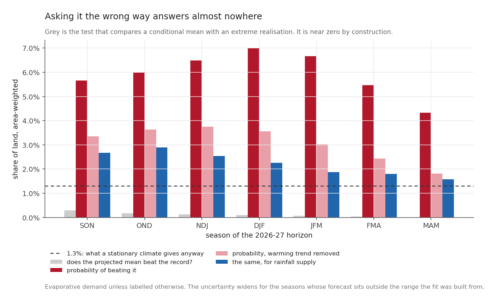
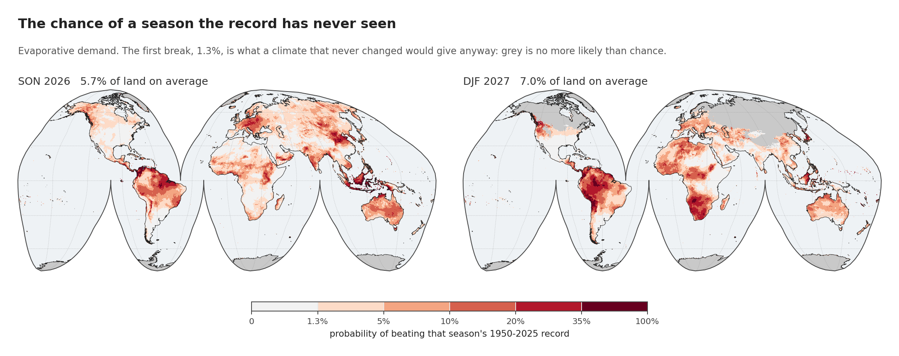
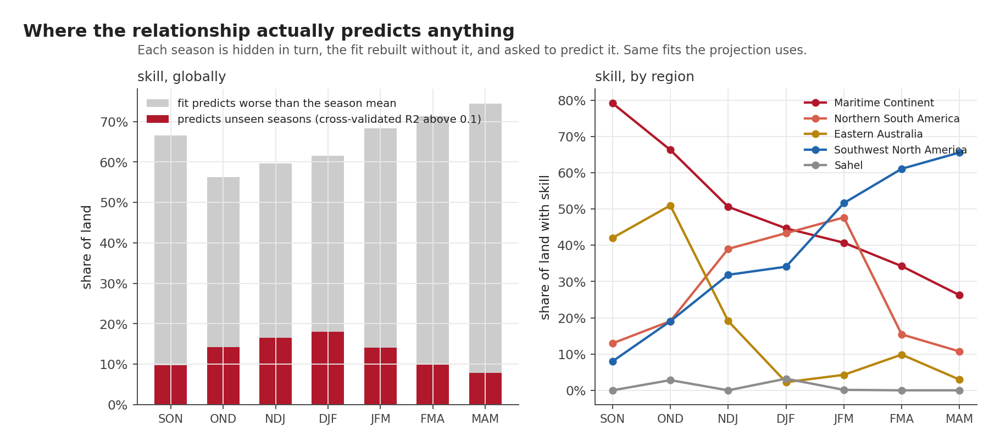
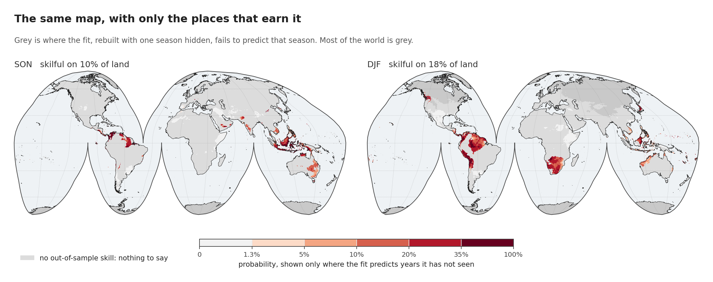
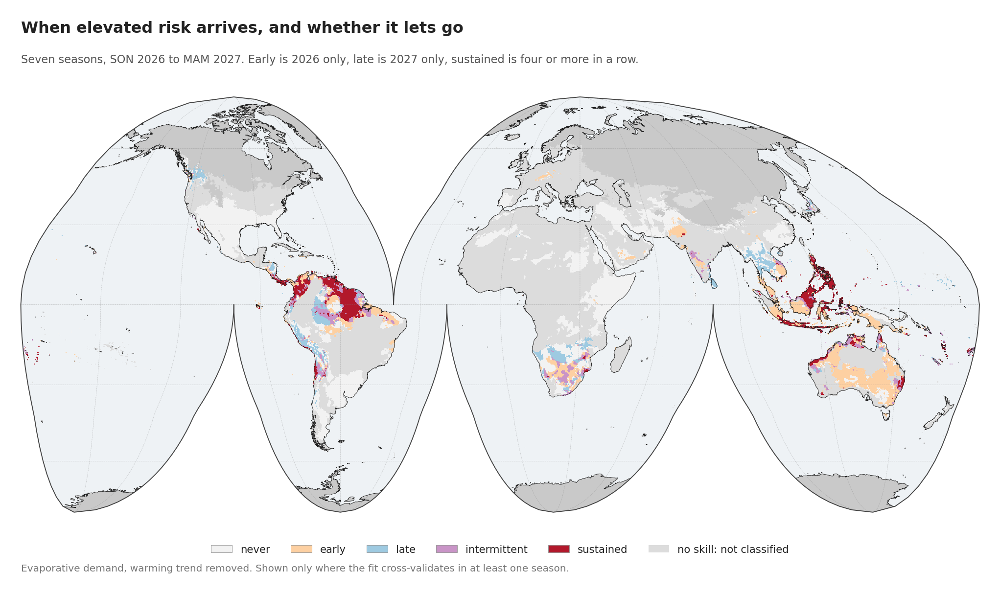
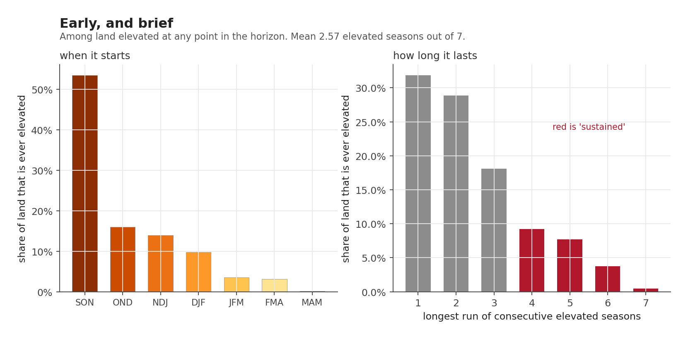
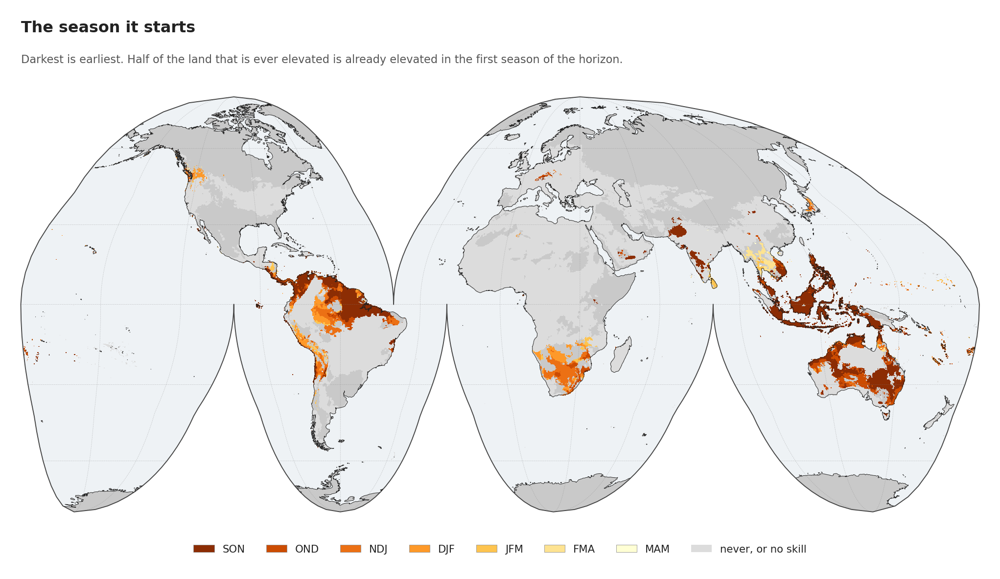

Describing what five past seasons did is the safe version of this question. The ambitious and much more fragile version takes the fitted relationship between the Pacific and the land, evaluates it at the forecast, and asks two things a composite cannot answer.

**Where does this become worse than anything on record?** And **when in the horizon does it arrive, and for how long?**

## The setup

| | |
|---|---|
| **Fit** | Season-specific linear regression of EDDI-3 and SPI-3 on RONI, 1950-2025 |
| **Evaluated at** | The CPC forecast median for that season, from the **August 2026 issue** pinned when this analysis was run. CPC issues its September outlook today; nothing here uses it |
| **Extrapolating** | SON, OND and NDJ. The forecast is above every RONI in the fit |
| **Trend** | Removed before fitting and added back explicitly for the target date |
| **Skill** | Leave-one-out cross-validation of the same season-specific fits |
| **Horizon** | Seven seasons, SON 2026 to MAM 2027 |

The fit is per season. An annual-average relationship would have flattened the seasonality that the composites post spent its length demonstrating.

## The question I got wrong first

The obvious way to ask "where does it get worse than it has ever been" is to project the value and compare it against the pixel's record.

That returns **almost nowhere**: the projected value clears the 1950-2025 record on **0.29 per cent** of land in SON, falling to **0.00 per cent** by MAM.

The number is not a finding. The number is an artefact of comparing two different things. A projection is a **conditional mean**, the average outcome given a forecast. A record is an **extreme realisation**, the single most unusual season in seventy-six. Even a very strong forcing moves a mean by far less than the distance out to a record, so the test was always going to answer "nowhere", whatever the climate did.

The grey bars are that test. They are near zero across the whole horizon and would be near zero for almost any forcing you cared to apply.

The answerable question is probabilistic. Given the forecast, what is the chance the season exceeds the record?

$$
P(\text{record}) = 1 - \Phi\!\left(\frac{\text{record} - \text{projection}}{s_\text{pred}}\right),
\qquad
s_\text{pred} = s\sqrt{1 + \frac{1}{n} + \frac{(x_0 - \bar{x})^2}{S_{xx}}}
$$

The last term matters here. It grows the further the forecast sits outside the range of values the fit was built from, so reaching out to SON 2026 widens the uncertainty by an amount the arithmetic states out loud instead of hiding. Statisticians call it leverage. It is the price of the reach.

## The answer, against the right baseline

Every number below has to be read against **1.3 per cent**. With seventy-six seasons on record, even a climate that never changed at all would set a new record about once in seventy-seven seasons, simply because each new season is one more chance at a new maximum. That, and not zero, is the level to beat.

| Season | chance of a record | against chance | trend removed |
|---|---|---|---|
| SON 2026 | 5.65% | **4.3x** | 3.36% |
| OND 2026 | 5.99% | 4.6x | 3.63% |
| NDJ 2026-27 | 6.49% | 5.0x | 3.76% |
| **DJF 2027** | **6.98%** | **5.4x** | 3.55% |
| JFM 2027 | 6.67% | 5.1x | 3.02% |
| FMA 2027 | 5.47% | 4.2x | 2.44% |
| MAM 2027 | 4.34% | 3.3x | 1.82% |

Record-breaking evaporative demand is **four to five times more likely than chance** across the whole horizon, peaking at DJF 2027.

That number comes with two qualifications, and they belong right beside it.

The warming trend owns about half of it. Take the trend out of both sides and SON drops from 5.65 to 3.36 per cent, DJF from 6.98 to 3.55, so roughly **41 per cent** of the elevated risk in SON and **49 per cent** in DJF is the climate arriving rather than the Pacific. What survives is still 2.6 times chance, which stands up without the trend propping it, and it is the figure I would quote.

The supply side is far less exposed. The same calculation on rainfall gives 1.2 to 2.2 times chance against 3.3 to 5.4 for demand. A record-dry season is a coin this record has already flipped many times. A record-thirsty one is not.

One more detail, easy to miss. **DJF 2027 carries the highest risk despite not being an extrapolation at all.** Its forecast, +2.23, sits inside the fitted range; SON, OND and NDJ do not, and the leverage term charges them for it. The season with the most defensible arithmetic is also the season with the largest answer.

## Most of the world has no business being asked

Everything above is a fitted relationship evaluated at a point. Whether that relationship predicts anything is a different question. The way to answer it is **cross-validation**: hide one season, fit on the rest, predict the hidden one, and repeat until every season has had its turn. Then ask whether those predictions beat the laziest possible rival, which is simply guessing that season's long-run average every time.

On 56 to 74 per cent of land, depending on the season, it does not. The score for that test, the cross-validated R², comes out *negative*, which is the arithmetic's way of saying the relationship predicts an unseen season worse than the lazy rival does. This is the ordinary condition of a weak teleconnection, and not a fault in the method, and it is the single most important number in the post.

Skill above 0.1 covers **9.7 per cent** of land in SON, rising to **18.0 per cent** at DJF. Even at its best, four fifths of the world is a place where this method should say nothing.

Where skill exists it is concentrated, and it moves.

The Maritime Continent starts with 79 per cent of its land skilful in SON and falls to 26 per cent by MAM, while Southwest North America does the exact opposite, climbing from 8 per cent to 66. They cross around DJF. Eastern Australia peaks at OND with 51 per cent and then collapses to 2. The Sahel never exceeds 3 per cent in any season.

That is the same probability map with everything unskilful removed. A fairer picture, and a much emptier one.

So the honest form of the claim is not "we can forecast drought risk". It is: **for this region, in these seasons, the relationship holds up out of sample, and here is what it says.** Everywhere else, it is a fit and not a forecast.

## When it arrives

A probability map for a single season says nothing about duration. Run theory does, applied forward across all seven seasons instead of backward across the record.

Two design choices need explaining, because I changed my mind on both.

The horizon had to run seven seasons. Five leaves gaps, and a sequence with holes in it cannot support a claim about duration, because a place elevated in DJF and again in MAM would look identical to one elevated the whole way through.

There are also five categories where the plan called for four. The original set was never, early, late and sustained. Writing out the test cases made it obvious that "elevated in both halves" and "elevated for four seasons running" are different claims, and that a place elevated in SON and again in MAM, five seasons apart, was being filed as *sustained*. In an analysis about duration, that is recurrence dressed as persistence, so **intermittent** now has a class of its own.

Of the land that can be classified at all, with the warming trend removed:

| Class | share of land |
|---|---|
| never | 54.6% |
| **early**, 2026 only | **20.7%** |
| late, 2027 only | 7.5% |
| intermittent | 7.6% |
| **sustained**, four or more running | **9.6%** |

## It arrives early and it does not stay

Among land elevated at any point in the horizon:

**53.5 per cent is already elevated in SON 2026**, the very first season. Another 16 per cent starts in OND and 14 per cent in NDJ, so **83 per cent of it begins in calendar 2026**. Almost nothing starts late: MAM 2027 is the first elevated season for 0.1 per cent.

And the episodes are short. **The most common outcome is a single elevated season, at 31.9 per cent**, then two at 28.9 and three at 18.1. The mean is **2.57 elevated seasons out of seven**. Only 21 per cent runs for four or more.

So the characteristic signature is: **arrives in SON, lasts two seasons, gone.**

One large caveat about where that shape comes from. These are projections of the fitted relationship at the CPC forecast median for each season, and that median falls steeply across the horizon: +2.66 at OND, +2.23 by DJF, +0.83 by MAM. A projection driven by a predictor that decays by two thirds will decay as well, whatever the land is doing. Part of this signature is genuinely about the land, because the fit and the skill mask are both season-specific and they move in different directions by region. But the headline shape is substantially the outlook's own shape read back out, and it should not be taken for an independent discovery about how long droughts last. Post 8's finding that the land peaks a season before the ocean is the stronger claim of that kind, because it compares observed composites rather than projections.

That is the operational sentence of this series, and it is invisible in any single-season map. A map of DJF tells you DJF looks bad. It cannot tell you that for most places DJF is the tail of something that started in September, or that the thing which started in September is usually over by the new year.

The onset map makes the same point spatially. The Maritime Continent is almost uniformly the darkest shade, elevated from the first season. Southern Africa and parts of South America shade lighter, entering later.

## Two regions hold on, and two never start

| Region | never | early | late | intermittent | sustained |
|---|---|---|---|---|---|
| **Maritime Continent** | **6.7%** | 51.1% | 0.3% | 9.1% | **32.8%** |
| Eastern Australia | 26.5% | **61.8%** | 2.7% | 6.2% | 2.8% |
| Northern South America | 39.6% | 20.8% | 10.8% | 12.5% | 16.3% |
| **Southwest North America** | **98.8%** | 0.4% | 0.4% | 0.2% | 0.2% |
| **Sahel** | **99.7%** | 0.0% | 0.3% | 0.0% | 0.0% |

The Maritime Continent is the outlier in every direction. Only 6.7 per cent of it escapes entirely and **a third is sustained for four or more consecutive seasons**, with nowhere else close.

Eastern Australia is early and brief, at 62 per cent early-only against 2.8 per cent sustained. It takes the hit in 2026 and is largely done by the new year, which matches the skill result above, where its predictability peaked at OND and collapsed afterwards.

Northern South America is the most spread out, carrying the largest late and intermittent shares.

Worth setting the Sahel row against what post 7 observed. This table says the Sahel is unaffected in 99.7 per cent of its area, because the *fitted relationship* has no skill there. The observed August 2026 value was **+1.22**, which beat 43 of the 47 Augusts on record: high, though four have been higher. Those are not in conflict. The first says El Niño does not reliably predict Sahel demand; the second says Sahel demand is high right now anyway. Something is driving it. This method cannot say the Pacific is.

## Three things still out of reach

It cannot turn any of this into an impact. A record-thirsty season is not a crop failure; the path between them runs through soil, planting date, irrigation and management, none of which is here.

It cannot separate El Niño from warming better than the two columns above separate them, and about half the signal sits on the wrong side of that line.

And it rests on eight strong events. The last post is about exactly how little that is.

*Next: [Into early 2027, and how little forty-four events support](20260911-into-early-2027.qmd).*
