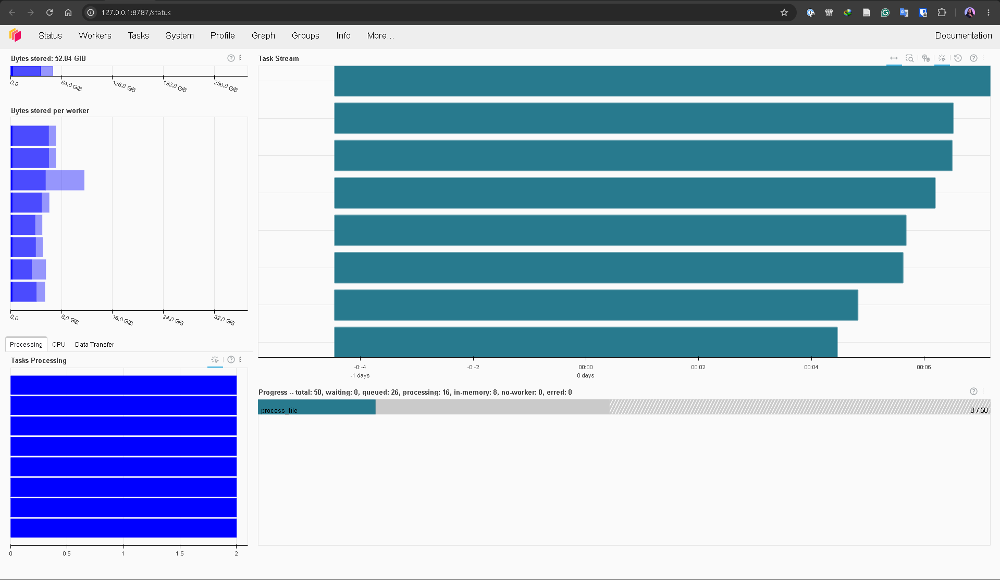
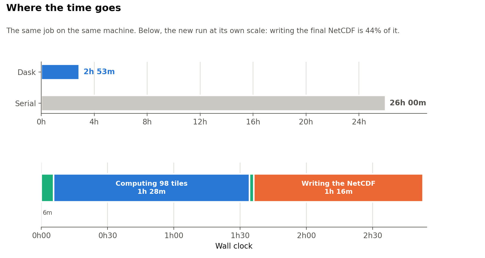
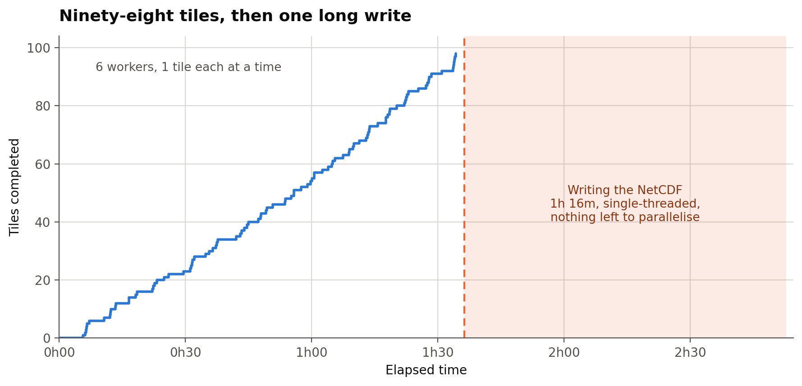
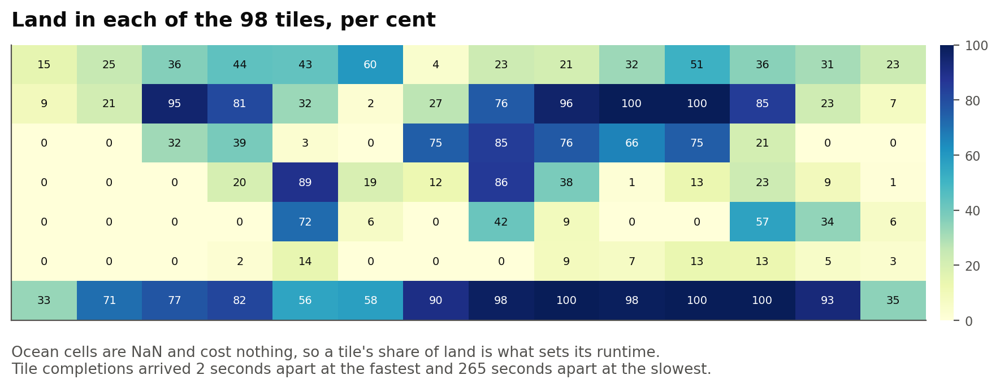
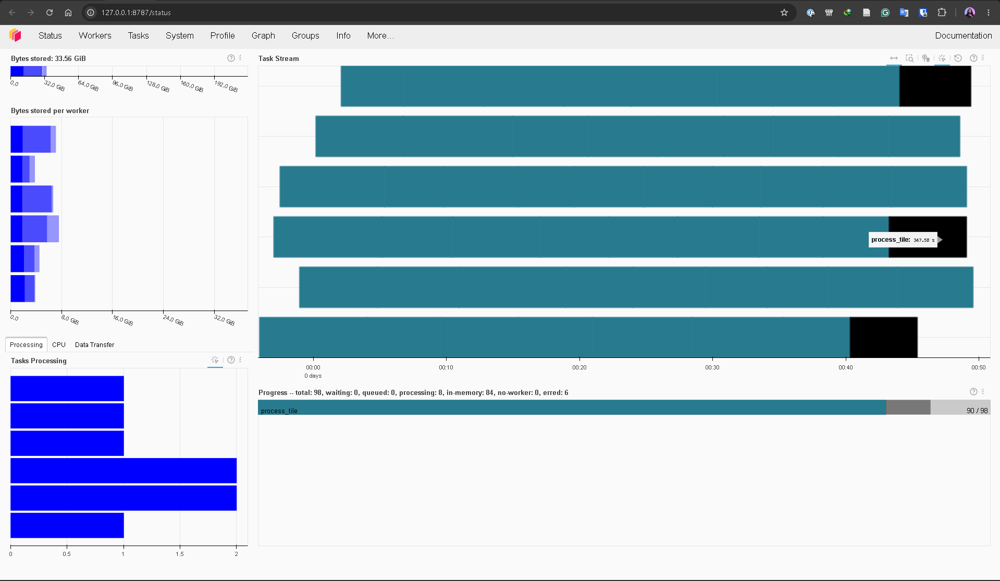

The job is this. Take seventy-six years of monthly rainfall and potential evapotranspiration for every land pixel on Earth at four kilometre resolution, fit a probability distribution to each pixel's water balance for each calendar month, and convert every value to a standardised anomaly. That is the Standardized Precipitation Evapotranspiration Index, SPEI, and at twelve-month accumulation it is one of the more useful things you can put on a drought map.

The array is 912 months by 4,320 latitudes by 8,640 longitudes. Thirty-four billion values. At single precision that is 136 gigabytes, and it does not fit in memory on anything I own.

The recorded time for this job in my own benchmark table was **twenty-six hours**.

It now takes **two hours, fifty-two minutes and forty-three seconds**, end to end, on the same machine. That is about twenty-three hours back.

What follows is what actually caused that, because the honest answer is not "I added Dask". Three of the four problems had nothing to do with parallelism, and I would have got most of the saving without it.

## The data

Worth being specific about the inputs, because the shape of the problem follows from them.

| | |
|:--|:--|
| Dataset | TerraClimate v1.1 (WorldClim v2.1 + ERA5) |
| Variables | Precipitation and reference evapotranspiration, both mm |
| Spatial resolution | 1/24 degree, about 4 km at the equator |
| Grid | 4,320 x 8,640 = 37.3 million cells |
| Temporal resolution | Monthly |
| Record | January 1950 to December 2025, 912 steps, 76 years |
| Format | NetCDF-4 classic, zlib level 5, `float64` |
| On disk | 17.4 GB precipitation + 13.0 GB PET = **30.4 GB** |
| Uncompressed | **272 GB each**, because the source is double precision |
| Calibration baseline | 1991-2020, the current WMO thirty-year normal |
| Distribution | Pearson Type III, fitted per cell per calendar month |

Thirty gigabytes of input sounds manageable. The trap is the second-to-last row: the source is `float64`, so the moment you decompress a slice it is eight bytes a value, and the pair expands to over half a terabyte.

Two numbers describe the actual workload better than the file sizes do. Only **12,532,612 cells are land**, 33.6 per cent of the grid, and everything else is ocean and returns NaN immediately. Multiply the land cells by the record length and the job is **11.4 billion land cell-months**. Multiply the land cells by twelve calendar months and it is **150 million distribution fits**, each needing a mean, a standard deviation and a skew from a 30-value sample.

One more detail matters later. The input files are chunked `[1, 30, 8640]`: one month, thirty rows of latitude, the full width of the world. That layout is ideal for reading a single global month and awkward for what this job wants, which is every month for one small square. A 640-row tile has to touch twenty-two chunk rows across all 912 time steps to assemble its own column of history.

The output is the same 912 x 4,320 x 8,640 shape in `float32`: 136 GB in memory, 35.4 GB written as compressed NetCDF, plus a 6.67 GB file holding the fitted distribution parameters so the index can be recomputed operationally without refitting anything.

## The bug that only appeared at scale

The pipeline had worked fine for a year. Country-scale runs took seconds. Then the global run started dying, and it died in a way that looked like memory pressure but was not.

At the end of a chunked run, after every tile had already been computed and written to disk, the code did this:

```python
result = xr.open_dataset(output_path)
return result.load()
```

That `.load()` pulls the entire variable back into RAM. All 136 gigabytes of it, to hand back a value the caller almost always discards. Every tile had been written correctly. The job then destroyed itself on the way out of the door.

It had been introduced in a commit of mine titled "Fix on file handle cleanup". I did not look at it twice, and it was invisible at any scale small enough to test comfortably.

## The bug that was pure waste

The second one was worse, because it was not a crash. It just quietly cost hours.

Each tile, having computed its own small patch of the world, wrote its results by opening the output file, reading the **whole** variable into memory, replacing its own slice, and writing the whole thing back. Per tile. With eighteen tiles that is the full array read and written eighteen times over, and the file was being modified while it was still open for reading, which on Windows is also a way to meet a lock error.

The fix is not clever. Write only your own slice:

```python
with netCDF4.Dataset(path, 'a') as nc:
    nc[var][:, lat0:lat1, lon0:lon1] = tile
```

No parallelism involved. Just not doing an enormous amount of unnecessary work.

## The bug that was a loop

The third was a performance problem hiding behind a correct answer.

Fitting a Pearson Type III distribution means estimating three parameters from a sample. The code did that by calling SciPy once per grid cell per calendar month. For a 1,440 by 1,440 tile with monthly data that is 1,440 × 1,440 × 12, or **24.9 million** separate scalar calls into SciPy, each with its own Python-level overhead, to compute three numbers that are all simple moments of the sample.

Pearson III by method of moments needs a mean, a standard deviation and a skew. Those are array reductions. Twelve of them, not 24.9 million calls.

Rewriting it that way made the fitting about twelve times faster. The part that mattered more to me: the vectorised version is **bit-identical** to the loop it replaced, across 358,520 values including every awkward case I could construct, all-NaN cells, constant cells, all-zero cells, cells with near-zero variance. A rewrite that is merely "close enough" is a rewrite you cannot trust in an operational product.

## The mistake I made myself

Having fixed those, I reached for Dask, and immediately got the sizing wrong in a way that is worth describing because it is specific to moving from serial to concurrent.

A tile size that is comfortable one-at-a-time becomes that size times the number of workers when they all run at once. A 1,440-square SPEI tile over 912 months peaks near 60 GB of working set. Forty workers would need roughly 2.4 terabytes.

The fix is a function that does the arithmetic before the run starts rather than after it fails:

```
DaskLayout(
  Tile size: 640 x 640
  Workers: 6   Tiles: 98
  Peak per worker: 16.7 GB
  Peak total: 100.2 GB / 348.9 GB available [ok]
)
```

Six workers, ninety-eight tiles, a hundred gigabytes against three hundred and forty-eight available. Printed before anything is allocated.



That screenshot is a different layout from the one in the table below, which is the point of having a planner: the same work can be cut into fifty large tiles across eight workers or ninety-eight smaller ones across six, and the planner tells you which will fit before you commit three hours to finding out.

One detail in that image is worth explaining, because it looks alarming and is not. The counter reads sixteen tasks processing against eight workers. Each worker runs a single thread, so eight tiles are executing and eight more have been handed out to start next. A prefetched task has not allocated anything yet, so the memory plan still holds.

## What concurrency was actually worth

Here is the whole run, phase by phase, read off the console timestamps rather than estimated.

| Phase | Duration |
|:------|---------:|
| Cluster startup through first completed tile | 5m 35s |
| Tiles 1 to 98 | **1h 28m 34s** |
| Teardown and parameter assembly | 38s |
| Write parameter file | 1m 24s |
| **Compute total** | **1h 36m 14s** |
| Zarr to NetCDF export | **1h 16m 29s** |
| **End to end** | **2h 52m 43s** |

Ninety-eight tiles out of ninety-eight, no failures.



Tiles completed every thirty seconds at the median, though the spread runs from two seconds to four and a half minutes. Plotting the completions against elapsed time shows the throughput never degrades. The line is straight from the first tile to the last, which is what you want and not what you always get.



Then it stops dead. The flat shaded block on the right is the export, and the reason there are no steps in it is that there is nothing left to divide up.

The two-second-to-four-minute spread in the completions is geography. Ocean cells are NaN and cost nothing, so a tile made entirely of them finishes almost before it starts. Twenty-two of the ninety-eight tiles are less than one per cent land.



The dark squares are where the work actually is: the Sahara and the Sahel, central Asia, and the bottom row, which is Antarctica.

## The step I never thought to time

Read that table again. The computation is one hour thirty-six. The **export is one hour sixteen**.

Forty-four per cent of the wall clock is spent writing the finished Zarr store out to a single NetCDF file. It is one pass over one 136 GB array, it is single-threaded, it is I/O bound, and no number of workers improves it by a second.

I had spent a week on the arithmetic and none on the last step, which turned out to cost nearly as much as all of the arithmetic put together.

If whatever reads your output can read Zarr, skip that step and halve your wall clock. Convert only when you genuinely need one portable file to hand to someone else.

## The thing I assumed and then measured

I had written in the documentation that the accumulation scale should not be a significant cost driver, reasoning that the rolling sum differences a cumulative sum and so is linear in the number of time steps regardless of window length, and that the distribution fitting is per calendar month rather than per scale.

Reasoning is not measurement, so here are two identical runs that differ only in scale:

| Phase | SPEI-12 | SPEI-2 |
|:------|--------:|-------:|
| Tiles 1 to 98 | 1h 28m 34s | 1h 32m 18s |
| Compute total | 1h 36m 14s | 1h 40m 21s |
| End to end | 2h 52m 43s | 2h 58m 07s |

The twelve-month accumulation, with a window six times longer, finished **four minutes faster**. That difference is inside run-to-run noise.

So the scale is free. Budget a global run by grid size and record length, and pick whatever accumulation the science needs.

## Failures are normal, so plan for them



That screenshot is not the successful run. It is an earlier one, and I have kept it because it shows the state you should design for rather than the state you hope for: six tiles errored, eighty-four in memory, eight still going.

The errors were not in the science. They were `WinError 32`, a file in use by another process, thrown when Zarr renamed a temporary chunk file into place. Something on the machine, a scanner or an indexer, had the new file open for the few milliseconds the rename needed.

A three-hour job that throws away three hours of correct work because of a transient file lock is not fit for purpose. So the design has three properties, and I would argue all three are mandatory for any long batch job:

**One bad tile does not abort the run.** Each tile's exception is caught, logged, and excluded from the record of what completed. The run finishes the other ninety-two and tells you at the end which ones failed.

**Progress survives a restart.** A manifest beside the output records which tiles finished, keyed to a signature of the run's inputs and settings. A rerun skips them. The failed run above cost about ten minutes to finish on the next attempt rather than ninety.

**Transient failures retry themselves.** Writes are wrapped in a retry with exponential backoff that catches only the I/O error and lets every other exception straight through. Retrying a genuine bug just gets you the same bug six times more slowly.

There is a fourth, learned the hard way: the fitted parameters are now written to disk as each tile finishes rather than assembled at the end. In the first version, the cluster shutdown threw a timeout, and that exception destroyed 6.67 GB of perfectly good parameters that every tile had already computed successfully. Teardown should never be able to lose you work that is already done.

## What I would tell someone starting this

Measure before you parallelise. Three of the four things I fixed were serial defects, and concurrency would have hidden all of them behind more hardware.

Size the run before you start it, and print the arithmetic.

Then look at what happens **after** the computation, because in this job that turned out to be the single largest line item, and it was the one part I had never timed.

---

*The code is in [precip-index](https://github.com/bennyistanto/precip-index). Timings were read from the run's own console output on a single workstation; the twenty-six hour serial figure is the one previously recorded in the project's benchmark table, not one I re-measured for this post.*
