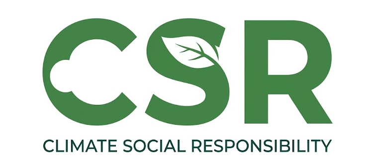

## Overview

Not the corporate kind. This is **Climate Social Responsibility**: a weekend project that publishes satellite-based climate and vegetation products, free, for anyone who can use them.

{fig-alt="CSR" width=100%}

The scope is rainfall, temperature and its anomalies, dry and wet spells, standardized precipitation indices, and crop phenology. Global, gridded, and derived from open satellite records.

Every country's meteorological service holds the authority for official climate data, and nothing here competes with that. These products are complementary: a consistent global view for the cases where that is the more practical starting point, and a second opinion where ground observations are thin.

It runs at weekend pace. There is no release schedule and no deadline. Products go up when they are ready.

## About the data

Gridded data ships as netCDF or GeoTIFF on a geographic coordinate system, EPSG:4326 with the WGS84 datum.

`+proj=longlat +ellps=WGS84 +datum=WGS84 +no_defs`

Resolution, coverage, period, method and licence differ from one product to the next, so each dataset has its own page carrying those details and its download links.

### Disclaimer

Everything here is provided as a public service, with no warranty as to accuracy, content or fitness for any purpose. Read the source and method notes on a dataset page before using it for anything that matters. If you find an error, tell me and it gets fixed in the next update.

## Available datasets

---

```{=html}
<div class="datasets-grid">

<a href="csr/terraclimate-spei.html" class="dataset-card">
  
  <div class="dataset-content">
    <div class="dataset-year">1960-2025</div>
    <h3 class="dataset-title">TerraClimate SPEI</h3>
  </div>
</a>

</div>
```
