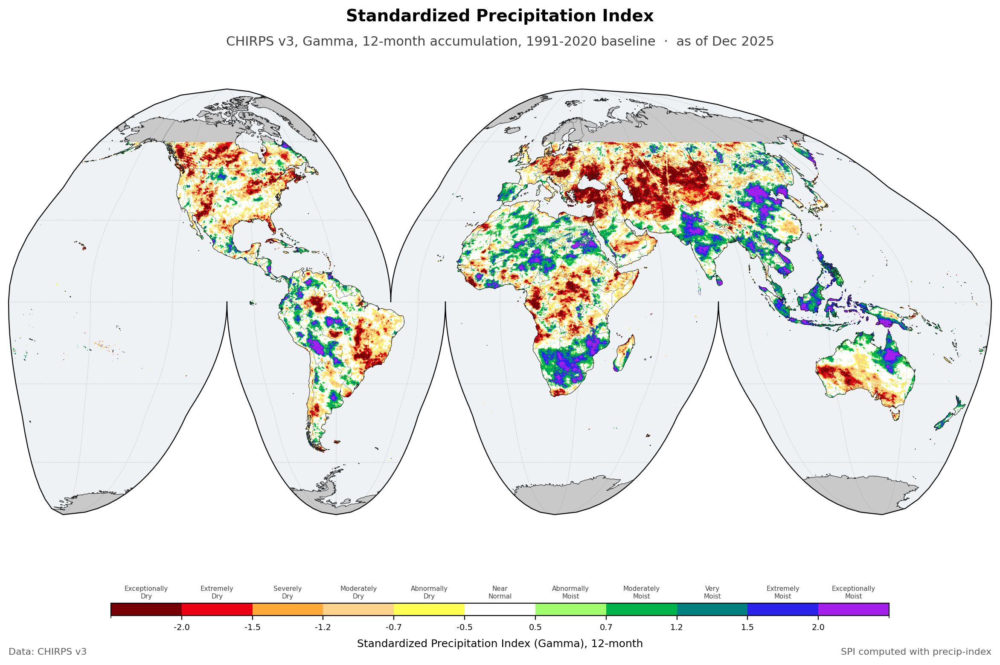

The Standardized Precipitation Index over the global land surface between 60N and 60S, monthly, at about 5.5 km, from 1981 to 2025. SPI compares accumulated rainfall against the rainfall distribution for that place and that time of year, so it answers one question and only that one: is this wetter or drier than usual here. It knows nothing about temperature or evaporative demand, which is what separates it from [SPEI](terraclimate-spei.qmd). Twelve accumulation periods are published, from 1 to 72 months.

::: {.project-meta}
::: {.meta-item}
::: {.meta-label}
Source
:::
::: {.meta-value}
[CHIRPS v3](https://www.chc.ucsb.edu/data/chirps3)
:::
:::

::: {.meta-item}
::: {.meta-label}
Spatial resolution
:::
::: {.meta-value}
About 5.5 km, 1/20 degree
:::
:::

::: {.meta-item}
::: {.meta-label}
Temporal resolution
:::
::: {.meta-value}
Monthly
:::
:::

::: {.meta-item}
::: {.meta-label}
Coverage
:::
::: {.meta-value}
60N to 60S and 180W to 180E
:::
:::

::: {.meta-item}
::: {.meta-label}
Period
:::
::: {.meta-value}
1981 to 2025
:::
:::

::: {.meta-item}
::: {.meta-label}
Format
:::
::: {.meta-value}
netCDF
:::
:::

::: {.meta-item}
::: {.meta-label}
Projection
:::
::: {.meta-value}
EPSG:4326
:::
:::
:::

## Method

SPI is calculated with [precip-index](https://bennyistanto.github.io/precip-index/) from CHIRPS v3 monthly precipitation. The distribution is fitted with a gamma, against 1991 to 2020 as the baseline period.

Coverage stops at 60N and 60S because that is where CHIRPS stops. The grid is global in longitude, so the poleward rows are present in the file and simply carry no data.

## Reading the time axis

Every time step is stamped on the 21st of the month: `1981-01-21`, `1981-02-21`, and so on through `2025-12-21`. All 540 steps in the record use the 21st.

The day is there because a netCDF time coordinate has to be a complete date. It is not a claim about the 21st. These are monthly values, each one covering its whole month, so `2025-12-21` means December 2025 and nothing narrower.

In practice: slice on the year and month and ignore the day. If your tooling wants an exact match, either select with `method="nearest"` or group by month rather than indexing on a literal date.

## Download

Each accumulation period is a separate netCDF covering the full record.

| Timescale | File | Size |
|---|---|---|
| 1 month | `wld_cli_chirps3_spi_gamma_1_month.nc` | [7.78 GB](https://drive.google.com/file/d/1XY9nqHQQw6d0Xe3Ye4EZOwMIY2_Oj3CU/view?usp=sharing) |
| 2 month | `wld_cli_chirps3_spi_gamma_2_month.nc` | [8.01 GB](https://drive.google.com/file/d/1JVGktnIF-aUkBEwfwP3JkLb3k9CWI3IO/view?usp=sharing) |
| 3 month | `wld_cli_chirps3_spi_gamma_3_month.nc` | [8.04 GB](https://drive.google.com/file/d/1W0a4mP9NmDAfLU3UE8QDJ-rdigcTCm11/view?usp=sharing) |
| 6 month | `wld_cli_chirps3_spi_gamma_6_month.nc` | [8.02 GB](https://drive.google.com/file/d/1gSWQuR1a7129kHH2ybtCchALWI4hQveK/view?usp=sharing) |
| 9 month | `wld_cli_chirps3_spi_gamma_9_month.nc` | [7.98 GB](https://drive.google.com/file/d/159rjMzCoppDqkt8aEY9zUzLxONne6TGw/view?usp=sharing) |
| 12 month | `wld_cli_chirps3_spi_gamma_12_month.nc` | [7.93 GB](https://drive.google.com/file/d/163cMg7XAfP07-fTCedNzbyqU0jMcLs8l/view?usp=sharing) |
| 18 month | `wld_cli_chirps3_spi_gamma_18_month.nc` | [7.84 GB](https://drive.google.com/file/d/1808M2V9Duyou9hAnbfFhvEjEiyfVHnt7/view?usp=sharing) |
| 24 month | `wld_cli_chirps3_spi_gamma_24_month.nc` | [7.75 GB](https://drive.google.com/file/d/1wYFXBHnFEhJh-R82aW39rn-IBwsSymEK/view?usp=sharing) |
| 36 month | `wld_cli_chirps3_spi_gamma_36_month.nc` | [7.56 GB](https://drive.google.com/file/d/1A_TQjMsiDv93J7s4SHpT6pBE6Mrp80x6/view?usp=sharing) |
| 48 month | `wld_cli_chirps3_spi_gamma_48_month.nc` | [7.37 GB](https://drive.google.com/file/d/1cgHj0eqdbWgnsaow9nf7yuE4ypfQb4rW/view?usp=sharing) |
| 60 month | `wld_cli_chirps3_spi_gamma_60_month.nc` | [7.19 GB](https://drive.google.com/file/d/1tjSYajdJyn2S1jNAY_jxsJpIbtB2fqe6/view?usp=sharing) |
| 72 month | `wld_cli_chirps3_spi_gamma_72_month.nc` | [7.01 GB](https://drive.google.com/file/d/1WhE9oDUrkaq-8tKQVSSbPZdO1Xl1U6Nu/view?usp=sharing) |

## License

- **CHIRPS v3**, the source data: [CC-BY-4.0](https://creativecommons.org/licenses/by/4.0/), or refer to the [Climate Hazards Center](https://www.chc.ucsb.edu/data/chirps3).
- **SPI** derived from CHIRPS v3: [CC-BY-4.0](https://creativecommons.org/licenses/by/4.0/). Credit this site and the Climate Hazards Center, note it if you changed anything, and otherwise do as you like with it. The attribution the Climate Hazards Center asks for travels with the source data, so it carries through to anything derived from it.

::: {.back-link}
[← Back to CSR](../csr.qmd)
:::
