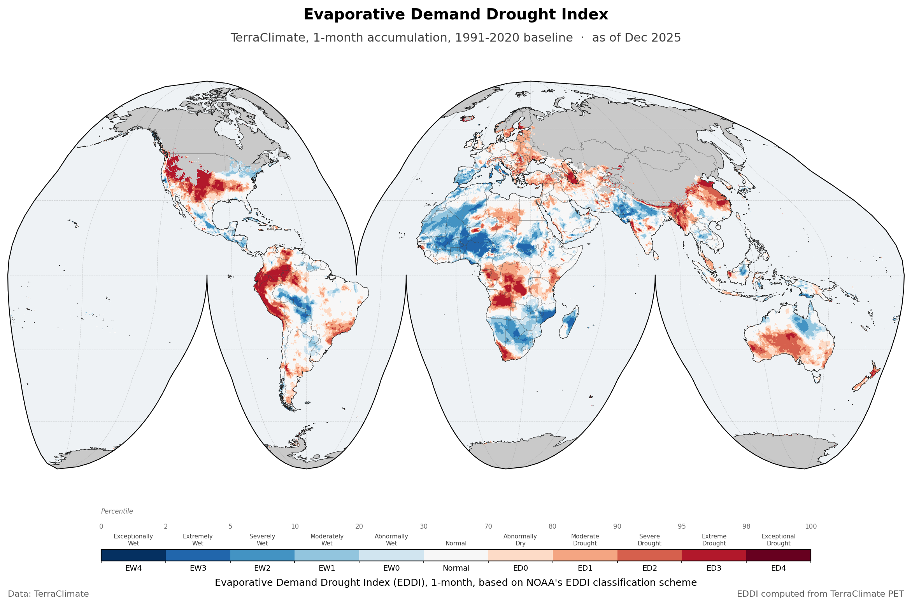

The Evaporative Demand Drought Index over the global land surface, monthly, at about 4 km, from 1950 to 2025. EDDI asks how thirsty the atmosphere is, not how much rain fell. It ranks accumulated reference evapotranspiration against the same calendar month in a baseline period, so a high value means the air has been pulling harder at the surface than usual. That makes it an early signal: evaporative demand climbs before soil moisture falls, often before a rainfall index has anything to report. Four accumulation periods are published, from 1 to 12 months.

::: {.project-meta}
::: {.meta-item}
::: {.meta-label}
Source
:::
::: {.meta-value}
[TerraClimate](https://www.climatologylab.org/terraclimate.html)
:::
:::

::: {.meta-item}
::: {.meta-label}
Spatial resolution
:::
::: {.meta-value}
About 4 km, 1/24 degree
:::
:::

::: {.meta-item}
::: {.meta-label}
Temporal resolution
:::
::: {.meta-value}
Monthly
:::
:::

::: {.meta-item}
::: {.meta-label}
Coverage
:::
::: {.meta-value}
Global, 90N to 90S and 180W to 180E
:::
:::

::: {.meta-item}
::: {.meta-label}
Period
:::
::: {.meta-value}
1950 to 2025
:::
:::

::: {.meta-item}
::: {.meta-label}
Format
:::
::: {.meta-value}
netCDF
:::
:::

::: {.meta-item}
::: {.meta-label}
Projection
:::
::: {.meta-value}
EPSG:4326
:::
:::
:::

## Method

EDDI is computed from a single TerraClimate variable, reference evapotranspiration (`pet`). For each pixel and each accumulation length, the trailing n-month sum is ranked against the same calendar month across the baseline period, and that rank becomes a non-exceedance probability. The baseline is 1991 to 2020, the WMO thirty-year normal.

There is no fitted distribution. Unlike [SPI](chirps-spi.qmd) and [SPEI](terraclimate-spei.qmd), which fit a gamma or a Pearson Type III and then read the index off the fitted curve, EDDI is nonparametric: it is a rank, converted to a percentile. That is the method's strength, because nothing has to be assumed about the shape of the distribution, and it is also the source of the limit described two sections below.

## What is in the file

Three variables, all exact functions of one another, so use whichever suits your workflow.

| Variable | What it holds |
|---|---|
| `eddi` | The standardised anomaly, a z-score. Positive means higher evaporative demand than normal, so drier |
| `eddi_pct` | The non-exceedance percentile, 0 to 100. 100 is the driest, 0 the wettest |
| `eddi_cat` | The NOAA class, an integer 0 to 10 |

The classes in `eddi_cat` follow the [EDDI User Guide](https://psl.noaa.gov/eddi/), and the percentile cut points travel with the file in the `percentile_bounds` attribute.

| Class | Category | Code | Percentile | Hex | RGB |
| :--- | :--- | :--- | :--- | :--- | :--- |
| 0 | **Exceptionally Wet** | `EW4` | 0 to 2 | &nbsp; `#053061` | rgb(5, 48, 97) |
| 1 | **Extremely Wet** | `EW3` | 2 to 5 | &nbsp; `#2166ac` | rgb(33, 102, 172) |
| 2 | **Severely Wet** | `EW2` | 5 to 10 | &nbsp; `#4393c3` | rgb(67, 147, 195) |
| 3 | **Moderately Wet** | `EW1` | 10 to 20 | &nbsp; `#92c5de` | rgb(146, 197, 222) |
| 4 | **Abnormally Wet** | `EW0` | 20 to 30 | &nbsp; `#d1e5f0` | rgb(209, 229, 240) |
| 5 | **Normal** | `Normal` | 30 to 70 | &nbsp; `#f7f7f7` | rgb(247, 247, 247) |
| 6 | **Abnormally Dry** | `ED0` | 70 to 80 | &nbsp; `#fddbc7` | rgb(253, 219, 199) |
| 7 | **Moderate Drought** | `ED1` | 80 to 90 | &nbsp; `#f4a582` | rgb(244, 165, 130) |
| 8 | **Severe Drought** | `ED2` | 90 to 95 | &nbsp; `#d6604d` | rgb(214, 96, 77) |
| 9 | **Extreme Drought** | `ED3` | 95 to 98 | &nbsp; `#b2182b` | rgb(178, 24, 43) |
| 10 | **Exceptional Drought** | `ED4` | 98 to 100 | &nbsp; `#67001f` | rgb(103, 0, 31) |

Note which end is which. EDDI runs the opposite way to SPI and SPEI: a **high** EDDI is dry, because it means high evaporative demand. The map above uses a diverging red to blue ramp with red at the dry end, so the colours read the same way round as on the other two pages even though the index underneath does not.

## The two outermost classes never appear

`EW4` and `ED4` are defined in the file and drawn in the legend, and neither of them is ever populated. Not rarely: never.

I checked the whole grid over 1991 to 2025, some 84 million valid cell-months, and the count for class 0 is zero and the count for class 10 is zero. The other nine classes are all well populated.

This is arithmetic, not a bug. A thirty-year baseline gives thirty samples per calendar month, so the finest percentile step the ranking can resolve is about one in thirty-one, roughly 3.2 percent. The `EW4` bin is 2 percent wide and `ED4` is 2 percent wide, so neither bin is wide enough to catch a rank. The file says as much in its own `attainable_range` attribute, which caps the index at plus or minus 2.028.

The practical consequence: with this baseline **`ED3` is the driest class you will ever see**, and it should be read as the top of the scale rather than as one step below an unreached extreme. If you need the full eleven classes to be reachable you need a longer baseline, which is what the 1950 to 2025 variant is for.

## Coverage moves with the season

EDDI is undefined where evaporative demand is effectively zero, which in practice means the high-latitude winter. Coverage is therefore not constant through the year: about 14 percent of the global grid carries a value in December, against about 24 percent in July.

Almost all of that swing is in the northern extratropics. Between 60N and 90N the count of valid cells goes from roughly 3,100 in December to 58,500 in July on the quarter-degree grid, while the tropics barely move, and south of 60S the pattern flips as you would expect. So a global count of drought-classified pixels is not comparable from one month to the next, though a given pixel compared against its own calendar month is.

## Reading the time axis

Every time step is stamped on the first of the month: `1950-01-01`, `1950-02-01`, and so on through `2025-12-01`.

The day is there because a netCDF time coordinate has to be a complete date. It is not a claim about the first of the month. These are monthly values, each one covering its whole month, so `2025-12-01` means December 2025 and nothing narrower.

In practice: slice on the year and month and ignore the day. If your tooling wants an exact match, either select with `method="nearest"` or group by month rather than indexing on a literal date.

## Download

Each accumulation period is a separate netCDF covering the full record, with all three variables inside.

| Timescale | File | Size |
|---|---|---|
| 1 month | `wld_cli_terraclimate_eddi_01month_1950_2025_base1991_2020.nc` | 6.34 GB |
| 3 month | `wld_cli_terraclimate_eddi_03month_1950_2025_base1991_2020.nc` | 6.66 GB |
| 6 month | `wld_cli_terraclimate_eddi_06month_1950_2025_base1991_2020.nc` | 2.83 GB |
| 12 month | `wld_cli_terraclimate_eddi_12month_1950_2025_base1991_2020.nc` | 2.52 GB |

There is also a quarter-degree version of each, resampled from the same computation. At roughly a fifteenth of the size it is the more practical download for continental or global work, and it is the one to start with if you only want to look around.

| Timescale | File | Size |
|---|---|---|
| 1 month | `wld_cli_terraclimate_eddi_01month_1950_2025_base1991_2020_025deg.nc` | 467.9 MB |
| 3 month | `wld_cli_terraclimate_eddi_03month_1950_2025_base1991_2020_025deg.nc` | 496.3 MB |
| 6 month | `wld_cli_terraclimate_eddi_06month_1950_2025_base1991_2020_025deg.nc` | 290.1 MB |
| 12 month | `wld_cli_terraclimate_eddi_12month_1950_2025_base1991_2020_025deg.nc` | 256.4 MB |

## License

- **TerraClimate**, the source data: [CC0-1.0](https://creativecommons.org/publicdomain/zero/1.0/legalcode), or refer to the [Climatology Lab](https://www.climatologylab.org/terraclimate.html).
- **EDDI** derived from TerraClimate: [CC-BY-4.0](https://creativecommons.org/licenses/by/4.0/). Credit this site and TerraClimate, note it if you changed anything, and otherwise do as you like with it.

::: {.back-link}
[← Back to CSR](../csr.qmd)
:::
