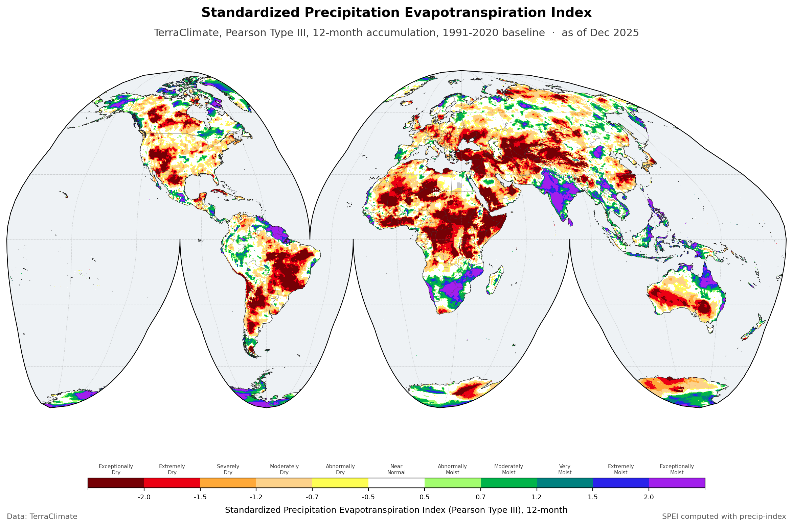

The Standardized Precipitation Evapotranspiration Index over the global land surface, monthly, at about 4 km, from 1958 to 2025. SPEI subtracts potential evapotranspiration from precipitation before standardizing, so unlike SPI it answers to evaporative demand as well as to rainfall. That makes it the better choice where warming, not just drying, is the question. Twelve accumulation periods are published, from 1 to 72 months.

::: {.project-meta}
::: {.meta-item}
::: {.meta-label}
Source
:::
::: {.meta-value}
[TerraClimate](https://www.climatologylab.org/terraclimate.html)
:::
:::

::: {.meta-item}
::: {.meta-label}
Spatial resolution
:::
::: {.meta-value}
About 4 km, 1/24 degree
:::
:::

::: {.meta-item}
::: {.meta-label}
Temporal resolution
:::
::: {.meta-value}
Monthly
:::
:::

::: {.meta-item}
::: {.meta-label}
Coverage
:::
::: {.meta-value}
Global, 90N to 90S and 180W to 180E
:::
:::

::: {.meta-item}
::: {.meta-label}
Period
:::
::: {.meta-value}
1958 to 2025
:::
:::

::: {.meta-item}
::: {.meta-label}
Format
:::
::: {.meta-value}
netCDF
:::
:::

::: {.meta-item}
::: {.meta-label}
Projection
:::
::: {.meta-value}
EPSG:4326
:::
:::
:::

## Method

SPEI is calculated with [precip-index](https://bennyistanto.github.io/precip-index/) from two TerraClimate v1.1 variables: precipitation (`ppt`) and potential evapotranspiration (`pet`). The distribution is fitted with Pearson Type III, against 1991 to 2020 as the baseline period.

The record starts in 1958 because that is where TerraClimate's distributed record starts. Reaching further back means assembling a series from more than one source, and TerraClimate advises against mixing v1.0 with v1.1, so a single version is used throughout rather than splicing one into the other to gain years. That costs coverage and buys homogeneity, which is the right trade for an index whose purpose is comparing one period against another.

## Interpretation

The eleven classes below are the WMO scheme, and they are what the colours on the map mean. The hex values are given so a map you make from this data can be read alongside one made from mine.

| Category | SPEI Value | Hex | RGB |
| :--- | :--- | :--- | :--- |
| **Exceptionally Dry** | -2.00 and below | &nbsp; `#760005` | rgb(118, 0, 5) |
| **Extremely Dry** | -2.00 to -1.50 | &nbsp; `#ec0013` | rgb(236, 0, 19) |
| **Severely Dry** | -1.50 to -1.20 | &nbsp; `#ffa938` | rgb(255, 169, 56) |
| **Moderately Dry** | -1.20 to -0.70 | &nbsp; `#fdd28a` | rgb(253, 210, 138) |
| **Abnormally Dry** | -0.70 to -0.50 | &nbsp; `#fefe53` | rgb(254, 254, 83) |
| **Near Normal** | -0.50 to +0.50 | &nbsp; `#ffffff` | rgb(255, 255, 255) |
| **Abnormally Moist** | +0.50 to +0.70 | &nbsp; `#a2fd6e` | rgb(162, 253, 110) |
| **Moderately Moist** | +0.70 to +1.20 | &nbsp; `#00b44a` | rgb(0, 180, 74) |
| **Very Moist** | +1.20 to +1.50 | &nbsp; `#008180` | rgb(0, 129, 128) |
| **Extremely Moist** | +1.50 to +2.00 | &nbsp; `#2a23eb` | rgb(42, 35, 235) |
| **Exceptionally Moist** | +2.00 and above | &nbsp; `#a21fec` | rgb(162, 31, 236) |

## Limitations inherited from TerraClimate

SPEI is only as good as what goes into it, and both inputs come from TerraClimate. Its limitations pass straight through: fitting a Pearson Type III to the difference between precipitation and evaporative demand does not remove anything that was wrong with either. The [TerraClimate page](https://www.climatologylab.org/terraclimate.html) carries the full list; these are the ones that bear on SPEI.

**Trends are not independent evidence.** Long-term trends in TerraClimate precipitation and temperature are inherited from its parent datasets, so a drying trend found in this SPEI record is a trend in those parents, re-expressed. It is not separate confirmation of them. This is the one to hold on to, because a standardised anomaly index invites exactly that misreading.

**Apparent detail exceeds real detail.** The grid is about 4 km, but TerraClimate cannot resolve temporal variability finer than its parent datasets, and orographic precipitation ratios and inversions in particular are not captured. A sharp gradient across a mountain range may be an artefact of downscaling rather than a signal, which matters here because SPEI is often read at exactly that scale.

**The water balance model is simple.** It uses a static reference landcover and does not account for heterogeneity in vegetation types. That feeds the potential evapotranspiration term, so it shapes the half of SPEI that separates it from a rainfall-only index.

**Validation is thin where stations are thin.** TerraClimate reports limited validation in data-sparse regions, Antarctica among them, and likely unrealistic extrapolation of winter inversions into high elevations in boreal systems, inherited from WorldClim v2.1. The grid covers 90N to 90S, so a value exists in those places whether or not it has been checked against anything.

## Reading the time axis

Every time step is stamped on the first of the month: `1958-01-01`, `1958-02-01`, and so on through `2025-12-01`.

The day is there because a netCDF time coordinate has to be a complete date. It is not a claim about the first of the month. These are monthly values, each one covering its whole month, so `2025-12-01` means December 2025 and nothing narrower.

In practice: slice on the year and month and ignore the day. If your tooling wants an exact match, either select with `method="nearest"` or group by month rather than indexing on a literal date.

## Download

Each accumulation period is a separate netCDF covering the full record.

| Timescale | File | Download |
|---|---|---|
| 1 month | `wld_cli_terraclimate_spei_pearson3_1_month.nc` | [24.39 GB](https://drive.google.com/file/d/1bFIbJguJn5dZzUJaV0X-EEGPa-xo_pX4/view?usp=sharing) |
| 2 month | `wld_cli_terraclimate_spei_pearson3_2_month.nc` | [25.63 GB](https://drive.google.com/file/d/1aP3_utjiENpiZVDh6ayKpNtFHP3hz1de/view?usp=sharing) |
| 3 month | `wld_cli_terraclimate_spei_pearson3_3_month.nc` | [26.20 GB](https://drive.google.com/file/d/1M8BJHphsOobJeCt5ZxUjCtygakFJylVm/view?usp=sharing) |
| 6 month | `wld_cli_terraclimate_spei_pearson3_6_month.nc` | [27.10 GB](https://drive.google.com/file/d/1FDE18TvV-X-WN-651FV3ypBd5pIUxqWm/view?usp=sharing) |
| 9 month | `wld_cli_terraclimate_spei_pearson3_9_month.nc` | [27.48 GB](https://drive.google.com/file/d/1CGlDJsIhCIKKO9Hug3aGi-oHCLPPQkUa/view?usp=sharing) |
| 12 month | `wld_cli_terraclimate_spei_pearson3_12_month.nc` | [27.56 GB](https://drive.google.com/file/d/1Uqnj7DwivVQhQYrVnGCPNSOy3iOE_Jsl/view?usp=sharing) |
| 18 month | `wld_cli_terraclimate_spei_pearson3_18_month.nc` | [27.26 GB](https://drive.google.com/file/d/1dh2YXXMYyQs835C37lvPCQmBlCPXVh5E/view?usp=sharing) |
| 24 month | `wld_cli_terraclimate_spei_pearson3_24_month.nc` | [26.98 GB](https://drive.google.com/file/d/12NA-iyctgTsaGylziyCsFOtuOJwyWkOU/view?usp=sharing) |
| 36 month | `wld_cli_terraclimate_spei_pearson3_36_month.nc` | [26.32 GB](https://drive.google.com/file/d/19WSo3Sx4F4-X7552I4TZ6xlFVHdKPo79/view?usp=sharing) |
| 48 month | `wld_cli_terraclimate_spei_pearson3_48_month.nc` | [25.69 GB](https://drive.google.com/file/d/1PvKnn1LQUNZDlFtQJ730mMngsJCKY_eh/view?usp=sharing) |
| 60 month | `wld_cli_terraclimate_spei_pearson3_60_month.nc` | [25.08 GB](https://drive.google.com/file/d/1QKM2LYPDzZRMo_wabJaVNRK62tAZaoOK/view?usp=sharing) |
| 72 month | `wld_cli_terraclimate_spei_pearson3_72_month.nc` | [24.53 GB](https://drive.google.com/file/d/1nd28HfbpOmHuzkc_BsddACN2AZW31VsX/view?usp=sharing) |

## License

- **TerraClimate**, the source data: [CC0-1.0](https://creativecommons.org/publicdomain/zero/1.0/legalcode), or refer to the [Climatology Lab](https://www.climatologylab.org/terraclimate.html).
- **SPEI** derived from TerraClimate: [CC-BY-4.0](https://creativecommons.org/licenses/by/4.0/). Credit this site and TerraClimate, note it if you changed anything, and otherwise do as you like with it.

::: {.back-link}
[← Back to CSR](../csr.qmd)
:::
