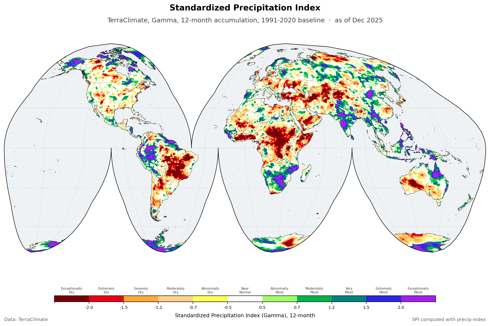

The Standardized Precipitation Index over the global land surface, monthly, at about 4 km, from 1950 to 2025. SPI compares accumulated rainfall against the rainfall distribution for that place and that time of year, so it answers one question only: is this wetter or drier than usual here. It knows nothing about temperature or evaporative demand, which is what separates it from [SPEI](terraclimate-spei.qmd). Twelve accumulation periods are published, from 1 to 72 months.

There is already a [CHIRPS SPI](chirps-spi.qmd) on this site, so it is worth saying why a second one exists. CHIRPS stops at 60N and 60S and begins in 1981. This one is built on the same TerraClimate grid as the SPEI and EDDI products, covers the whole globe, and reaches back to 1950. Use it when you need the high latitudes, the longer record, or an SPI that lines up cell for cell with SPEI.

::: {.project-meta}
::: {.meta-item}
::: {.meta-label}
Source
:::
::: {.meta-value}
[TerraClimate](https://www.climatologylab.org/terraclimate.html)
:::
:::

::: {.meta-item}
::: {.meta-label}
Spatial resolution
:::
::: {.meta-value}
About 4 km, 1/24 degree
:::
:::

::: {.meta-item}
::: {.meta-label}
Temporal resolution
:::
::: {.meta-value}
Monthly
:::
:::

::: {.meta-item}
::: {.meta-label}
Coverage
:::
::: {.meta-value}
Global, 90N to 90S and 180W to 180E
:::
:::

::: {.meta-item}
::: {.meta-label}
Period
:::
::: {.meta-value}
1950 to 2025
:::
:::

::: {.meta-item}
::: {.meta-label}
Format
:::
::: {.meta-value}
netCDF
:::
:::

::: {.meta-item}
::: {.meta-label}
Projection
:::
::: {.meta-value}
EPSG:4326
:::
:::
:::

## Method

SPI is calculated with [precip-index](https://bennyistanto.github.io/precip-index/) from a single TerraClimate v1.1 variable, precipitation (`ppt`). The distribution is fitted with a gamma, against 1991 to 2020 as the baseline period.

The record starts in 1950 because that is where TerraClimate v1.1 starts. The original TerraClimate was built on the JRA-55 reanalysis and covered 1958 onward; v1.1 replaced that with monthly anomalies from ERA5 laid over WorldClim climatologies, and that is what carries it back to 1950. A single version is used throughout. TerraClimate advises against mixing v1.0 with v1.1, and a join between the two is exactly the kind of seam that later passes for a trend.

Two things about the first year. TerraClimate cautions that 1950 may be affected by water balance model spin-up, but that concerns the model's outputs, such as soil moisture and runoff, and precipitation is one of its inputs. Separately, an accumulation needs its full window before it can produce a value, so each timescale starts late by its own length: SPI-1 has values from January 1950, SPI-12 not until December 1950.

## Interpretation

The eleven classes below are the WMO scheme, and they are what the colours on the map mean. The hex values are given so a map you make from this data can be read alongside one made from mine.

| Category | SPI Value | Hex | RGB |
| :--- | :--- | :--- | :--- |
| **Exceptionally Dry** | -2.00 and below | &nbsp; `#760005` | rgb(118, 0, 5) |
| **Extremely Dry** | -2.00 to -1.50 | &nbsp; `#ec0013` | rgb(236, 0, 19) |
| **Severely Dry** | -1.50 to -1.20 | &nbsp; `#ffa938` | rgb(255, 169, 56) |
| **Moderately Dry** | -1.20 to -0.70 | &nbsp; `#fdd28a` | rgb(253, 210, 138) |
| **Abnormally Dry** | -0.70 to -0.50 | &nbsp; `#fefe53` | rgb(254, 254, 83) |
| **Near Normal** | -0.50 to +0.50 | &nbsp; `#ffffff` | rgb(255, 255, 255) |
| **Abnormally Moist** | +0.50 to +0.70 | &nbsp; `#a2fd6e` | rgb(162, 253, 110) |
| **Moderately Moist** | +0.70 to +1.20 | &nbsp; `#00b44a` | rgb(0, 180, 74) |
| **Very Moist** | +1.20 to +1.50 | &nbsp; `#008180` | rgb(0, 129, 128) |
| **Extremely Moist** | +1.50 to +2.00 | &nbsp; `#2a23eb` | rgb(42, 35, 235) |
| **Exceptionally Moist** | +2.00 and above | &nbsp; `#a21fec` | rgb(162, 31, 236) |

The two outer classes are open-ended in the table but not in the data. Values are bounded at plus or minus 3.09, stated in the file as `valid_min` and `valid_max`, so nothing will ever read below -3.09 however extreme the month.

## Limitations inherited from TerraClimate

SPI is only as good as the precipitation that goes into it. Fitting a gamma distribution does not remove anything that was wrong with the rainfall, so TerraClimate's limitations pass straight through. The [TerraClimate page](https://www.climatologylab.org/terraclimate.html) carries the full list; these are the ones that bear on SPI.

**Trends are not independent evidence.** Long-term trends in TerraClimate precipitation are inherited from its parent datasets, so a drying trend found in this SPI record is a trend in those parents, re-expressed. It is not separate confirmation of them. This is the one to hold on to, because a standardised anomaly index invites exactly that misreading.

**Apparent detail exceeds real detail.** The grid is about 4 km, but TerraClimate cannot resolve temporal variability finer than its parent datasets, and orographic precipitation ratios in particular are not captured. That matters more here than for SPEI, because rainfall is the only thing SPI reads: a sharp gradient across a mountain range may be an artefact of downscaling rather than a signal.

**Validation is thin where stations are thin.** TerraClimate reports limited validation in data-sparse regions, Antarctica among them, and likely unrealistic extrapolation of winter inversions into high elevations in boreal systems, inherited from WorldClim v2.1. The grid covers 90N to 90S, so a value exists in those places whether or not it has been checked against anything. This is the flip side of the global coverage that sets this product apart from CHIRPS.

One limitation on TerraClimate's list does not apply: the simple water balance model feeds potential evapotranspiration, which SPI never uses.

## Reading the time axis

Every time step is stamped on the first of the month: `1950-01-01`, `1950-02-01`, and so on through `2025-12-01`.

The day is there because a netCDF time coordinate has to be a complete date. It is not a claim about the first of the month. These are monthly values, each one covering its whole month, so `2025-12-01` means December 2025 and nothing narrower.

In practice: slice on the year and month and ignore the day. If your tooling wants an exact match, either select with `method="nearest"` or group by month rather than indexing on a literal date.

## Download

Each accumulation period is a separate netCDF covering the full record.

| Timescale | File | Download |
|---|---|---|
| 1 month | `wld_cli_terraclimate_spi_gamma_1_month.nc` | In preparation |
| 2 month | `wld_cli_terraclimate_spi_gamma_2_month.nc` | In preparation |
| 3 month | `wld_cli_terraclimate_spi_gamma_3_month.nc` | In preparation |
| 6 month | `wld_cli_terraclimate_spi_gamma_6_month.nc` | In preparation |
| 9 month | `wld_cli_terraclimate_spi_gamma_9_month.nc` | In preparation |
| 12 month | `wld_cli_terraclimate_spi_gamma_12_month.nc` | In preparation |
| 18 month | `wld_cli_terraclimate_spi_gamma_18_month.nc` | In preparation |
| 24 month | `wld_cli_terraclimate_spi_gamma_24_month.nc` | In preparation |
| 36 month | `wld_cli_terraclimate_spi_gamma_36_month.nc` | In preparation |
| 48 month | `wld_cli_terraclimate_spi_gamma_48_month.nc` | In preparation |
| 60 month | `wld_cli_terraclimate_spi_gamma_60_month.nc` | In preparation |
| 72 month | `wld_cli_terraclimate_spi_gamma_72_month.nc` | In preparation |

## License

- **TerraClimate**, the source data: [CC0-1.0](https://creativecommons.org/publicdomain/zero/1.0/legalcode), or refer to the [Climatology Lab](https://www.climatologylab.org/terraclimate.html).
- **SPI** derived from TerraClimate: [CC-BY-4.0](https://creativecommons.org/licenses/by/4.0/). Credit this site and TerraClimate, note it if you changed anything, and otherwise do as you like with it.

::: {.back-link}
[← Back to CSR](../csr.qmd)
:::
