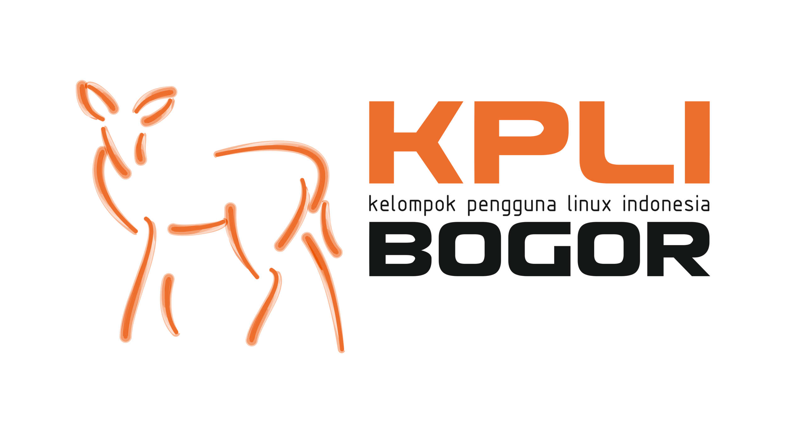
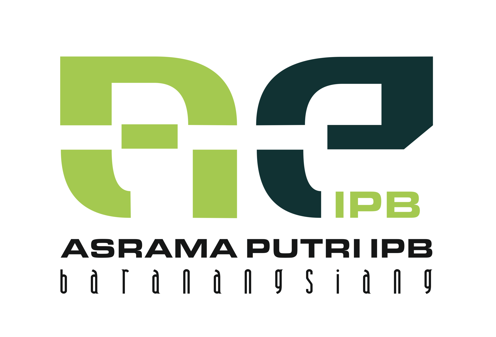
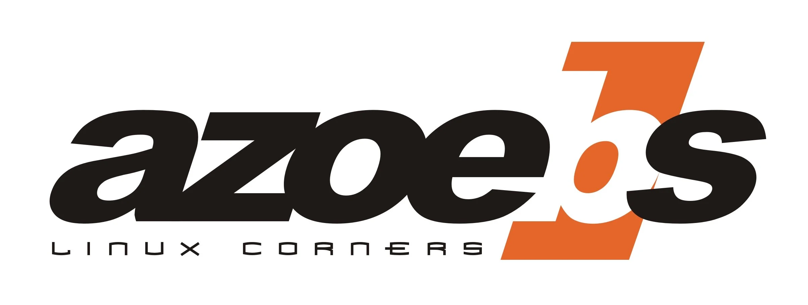
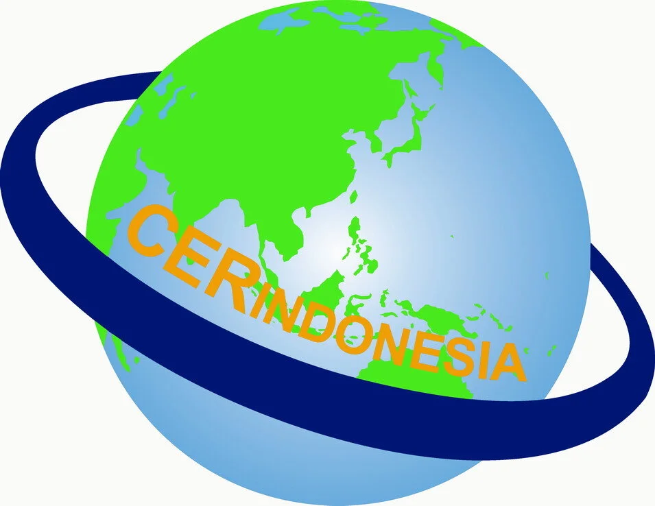
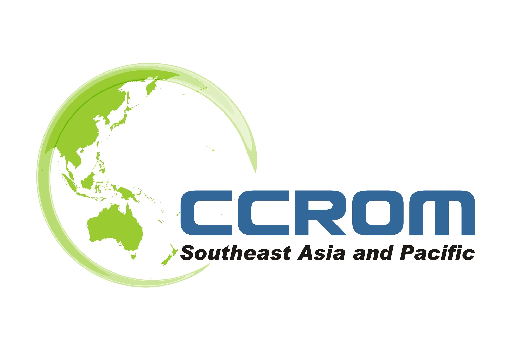
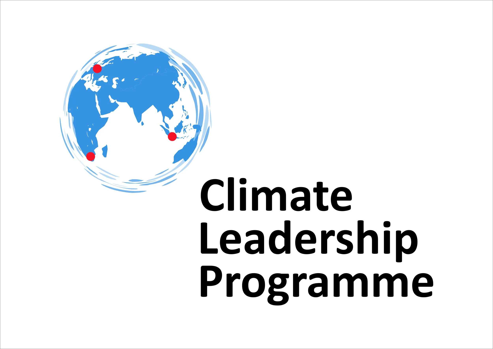
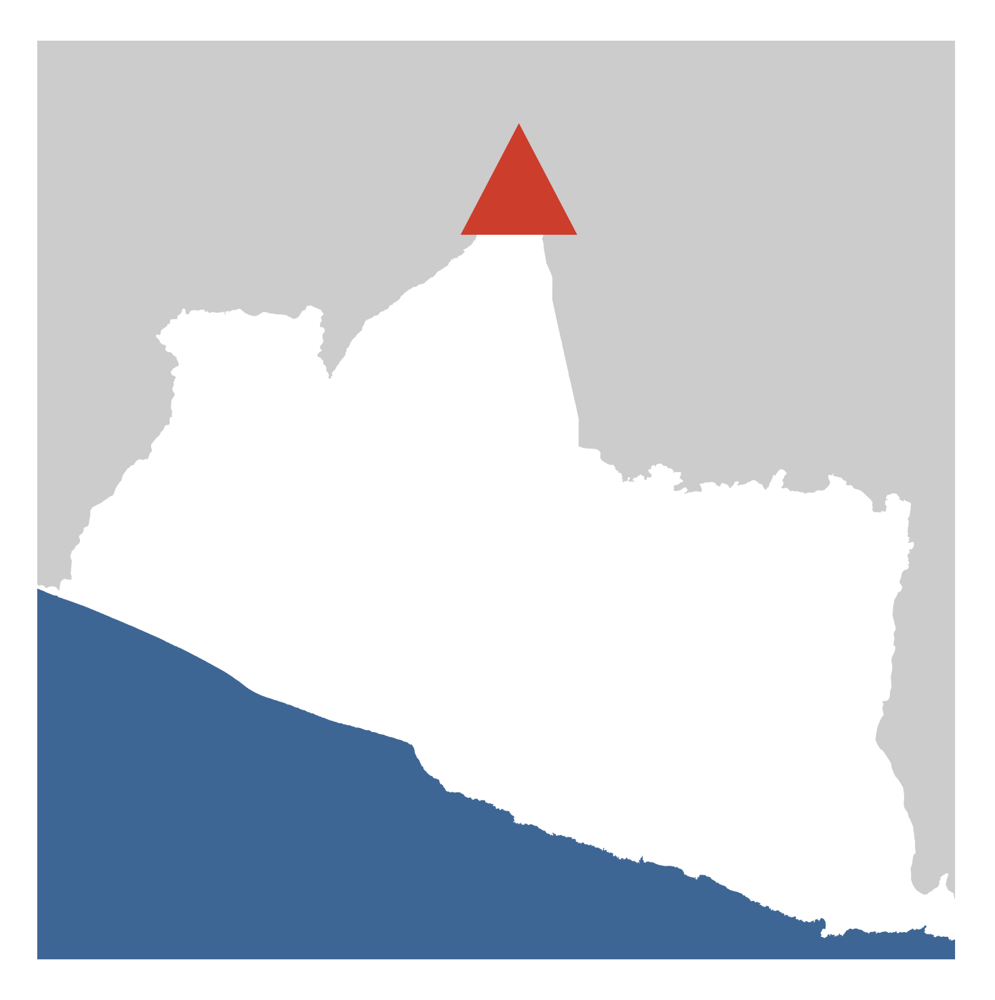
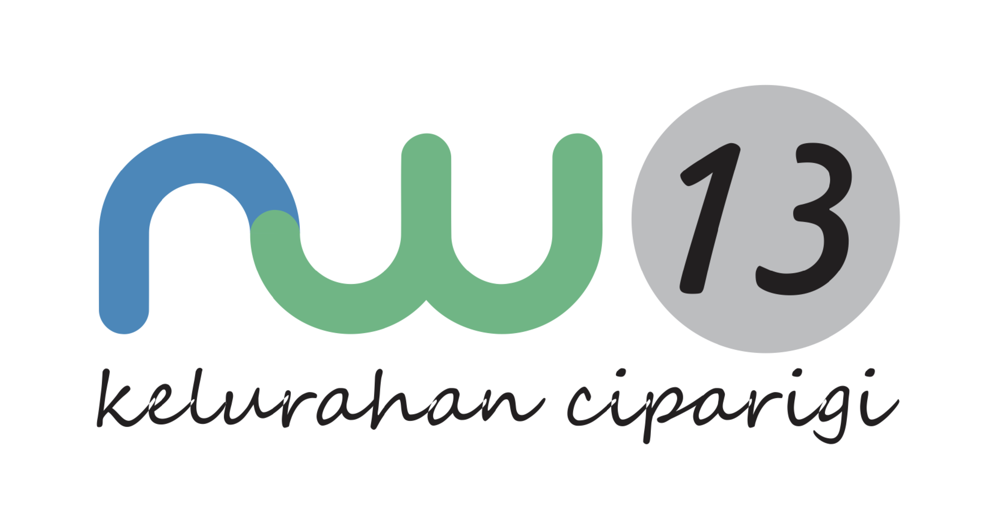

My friends and colleagues at work often asked me for help designing logos. Below are a few examples of branding and visual identity work I've created over the years.

1. KPLI, 2004
2. Asrama Putri IPB, 2004
3. Azoebs, 2006
4. CER Indonesia, 2007 (creating the vector file from low-resolution existing logo)
5. CCROM SEAP, 2009
6. Climate Leadership Programme, 2010
7. Merapi Response, 2011
8. RW13, 2018

::: {.project-meta}
::: {.meta-item}
::: {.meta-label}
Period
:::
::: {.meta-value}
2004 - Present
:::
:::

::: {.meta-item}
::: {.meta-label}
Tools
:::
::: {.meta-value}
Inkscape, GIMP
:::
:::

::: {.meta-item}
::: {.meta-label}
Projects Count
:::
::: {.meta-value}
8 Logos
:::
:::
:::

## Logo Portfolio

::: {.gallery-grid}

::: {.gallery-item}
{.gallery-img}
:::

::: {.gallery-item}
{.gallery-img}
:::

::: {.gallery-item}
{.gallery-img}
:::

::: {.gallery-item}
{.gallery-img}
:::

::: {.gallery-item}
{.gallery-img}
:::

::: {.gallery-item}
{.gallery-img}
:::

::: {.gallery-item}
{.gallery-img}
:::

::: {.gallery-item}
{.gallery-img}
:::

:::

::: {.back-link}
[← Back to Projects](../projects.qmd)
:::
