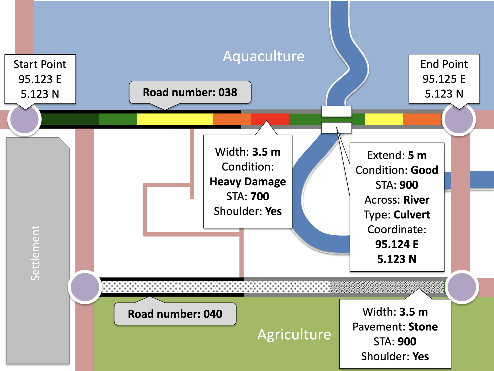
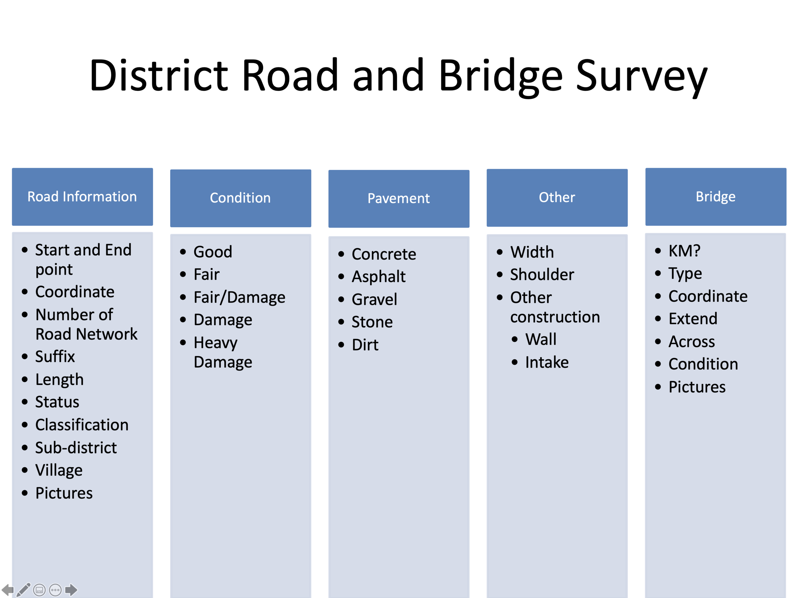
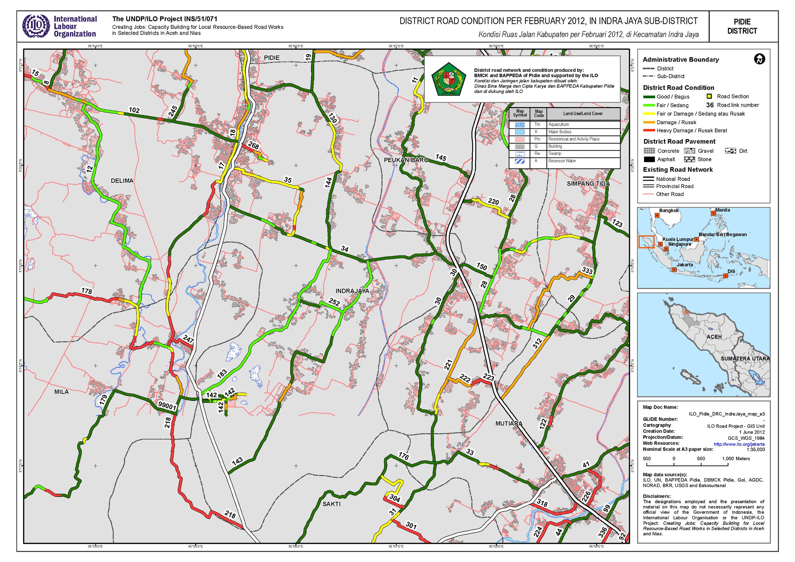
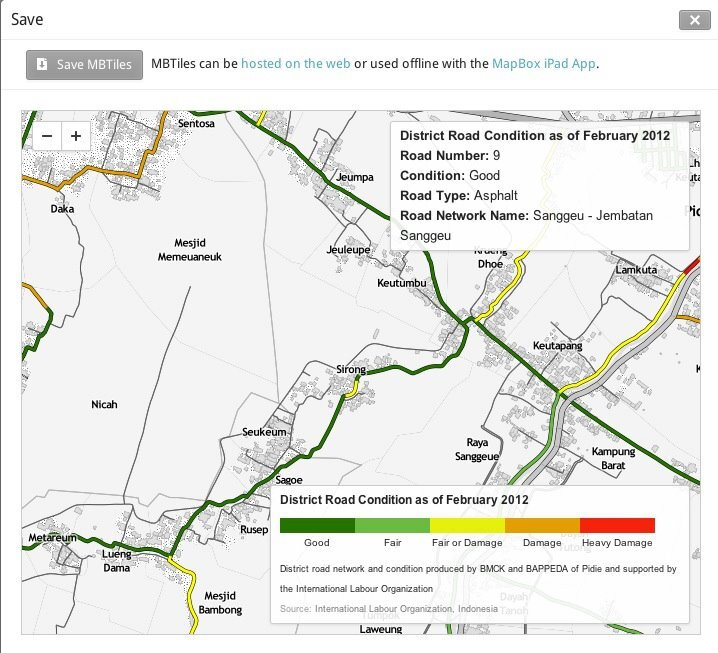
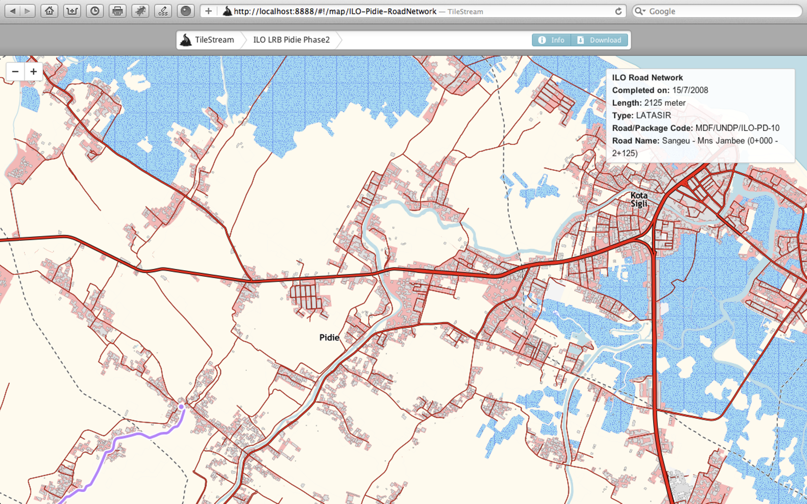

The UNDP/ILO project "Creating Jobs: Capacity Building for Local Resource-based Road Works in Selected Districts in NAD and Nias" ran from March 2006. Its aim was to support the Aceh Government in improving livelihoods by building the capacity of local government to generate employment through investment in rural infrastructure, particularly roads.

::: {.project-meta}
::: {.meta-item}
::: {.meta-label}
Year
:::
::: {.meta-value}
2011 - 2012
:::
:::

::: {.meta-item}
::: {.meta-label}
Organization
:::
::: {.meta-value}
[International Labour Organization](../experiences.qmd#exp-ilo-gis-consultant)
:::
:::

::: {.meta-item}
::: {.meta-label}
Partners
:::
::: {.meta-value}
UNDP, with Public Works (BMCK) and Bappeda of Pidie and Bireuen
:::
:::

::: {.meta-item}
::: {.meta-label}
Role
:::
::: {.meta-value}
GIS Officer
:::
:::

::: {.meta-item}
::: {.meta-label}
Tools
:::
::: {.meta-value}
Garmin Montana GPS, ArcGIS, TileMill, TileStream
:::
:::

::: {.meta-item}
::: {.meta-label}
Team
:::
::: {.meta-value}
Benny Istanto, Mohamad Lutfi, Yusrizal, Fahrurrazi, and local Public Works staff in Pidie and Bireuen
:::
:::

::: {.meta-item}
::: {.meta-label}
Reference
:::
::: {.meta-value}
[Creating Jobs: Capacity Building for Local Resource-based Road Works](https://www.ilo.org/jakarta/whatwedo/projects/WCMS_145289/lang--en/index.htm)
:::
:::
:::

## My role

I worked as GIS Officer alongside an engineer and a database specialist, to:

- Assess the GIS system in use, the available GIS and GPS data, and the data-flow processes.
- Prepare a work plan and budget for developing and implementing a GIS system and the data collection behind it.
- Design a basic functional GIS, taking into account stakeholder requirements and relevant national standards.
- Test the protocol, checking effectiveness, integrity, relevance, internal and external consistency and validity of the GIS and its data, and ensure compatibility with the MIS/database system being developed in parallel.
- Develop training modules and deliver training, in the classroom and on the job, to Public Works and Bappeda staff working with GIS.
- Document the design and write user guidelines for the delivered system.

## The challenge

There was no road network in GIS format. What existed was a spreadsheet, with no information about road condition. I also had to work with field supervisors and technicians who were expert at their own job, with pen and ruler, but had little exposure to the technology.

Since the goal was a road network and condition dataset in GIS format, the first and most important activity was capacity development: teaching those field staff GIS and GPS, and a mobile data collection approach to speed the survey up.

## What was delivered

- Institutional capacity development for the government counterpart: 398 trainee-days, 120 men and 36 women (2011), and 538 trainee-days, 31 men and 8 women (2012).
- District road and bridge condition survey completed for about 750 km of district road in Pidie and about 850 km in Bireuen.
- District road and bridge condition spatial data with data attribute for every 100 meter of road:
    - **Road information**: start and end point, coordinate, number of road network, suffix, length, status, classification, sub-district, village, pictures
    - **Condition**: good, fair, fair/damage, damage, heavy damage
    - **Pavement**: concrete, asphalt, gravel, stone, dirt
    - **Other**: width, shoulder, other construction (wall/intake)
    - **Bridge**: kilometers location, type, coordinate, extend, across, condition, pictures

## Maps

Two overview sheets for Pidie:

- [Administrative boundary](https://s3.benny.istan.to/LRB/A3_ILO_Pidie_AdministrativeBoundary_p_map_a3_20120601.pdf)
- [Road network](https://s3.benny.istan.to/LRB/A3_ILO_Pidie_LRB_RoadNetwork_map_a3.pdf)

Road condition by sub-district, Pidie:

[Batee](https://s3.benny.istan.to/LRB/A3_ILO_Pidie_LRB_DRC_Batee_map_a3_20120601.pdf) · [Delima](https://s3.benny.istan.to/LRB/A3_ILO_Pidie_LRB_DRC_Delima_map_a3_20120601.pdf) · [Geumpang Mane](https://s3.benny.istan.to/LRB/A3_ILO_Pidie_LRB_DRC_GeumpangMane_map_a3_20120601.pdf) · [Glumpang Baro](https://s3.benny.istan.to/LRB/A3_ILO_Pidie_LRB_DRC_GlumpangBaro_map_a3_20120601.pdf) · [Glumpang Tiga](https://s3.benny.istan.to/LRB/A3_ILO_Pidie_LRB_DRC_GlumpangTiga_map_a3_20120601.pdf) · [Grong Grong](https://s3.benny.istan.to/LRB/A3_ILO_Pidie_LRB_DRC_GrongGrong_map_a3_20120601.pdf) · [Indra Jaya](https://s3.benny.istan.to/LRB/A3_ILO_Pidie_LRB_DRC_IndraJaya_map_a3_20120601.pdf) · [Kembang Tanjong](https://s3.benny.istan.to/LRB/A3_ILO_Pidie_LRB_DRC_KembangTanjong_map_a3_20120601.pdf) · [Kota Sigli](https://s3.benny.istan.to/LRB/A3_ILO_Pidie_LRB_DRC_KotaSigli_map_a3_20120601.pdf) · [Mila](https://s3.benny.istan.to/LRB/A3_ILO_Pidie_LRB_DRC_Mila_map_a3_20120601.pdf) · [Muara Tiga](https://s3.benny.istan.to/LRB/A3_ILO_Pidie_LRB_DRC_MuaraTiga_map_a3_20120601.pdf) · [Mutiara](https://s3.benny.istan.to/LRB/A3_ILO_Pidie_LRB_DRC_Mutiara_map_a3_20120601.pdf) · [Mutiara Timur](https://s3.benny.istan.to/LRB/A3_ILO_Pidie_LRB_DRC_MutiaraTimur_map_a3_20120601.pdf) · [Padang Tiji](https://s3.benny.istan.to/LRB/A3_ILO_Pidie_LRB_DRC_PadangTiji_map_a3_20120601.pdf) · [Peukan Baro](https://s3.benny.istan.to/LRB/A3_ILO_Pidie_LRB_DRC_PeukanBaro_map_a3_20120601.pdf) · [Pidie](https://s3.benny.istan.to/LRB/A3_ILO_Pidie_LRB_DRC_Pidie_map_a3_20120601.pdf) · [Sakti](https://s3.benny.istan.to/LRB/A3_ILO_Pidie_LRB_DRC_Sakti_map_a3_20120601.pdf) · [Simpang Tiga](https://s3.benny.istan.to/LRB/A3_ILO_Pidie_LRB_DRC_SimpangTiga_map_a3_20120601.pdf) · [Tangse](https://s3.benny.istan.to/LRB/A3_ILO_Pidie_LRB_DRC_Tangse_map_a3_20120601.pdf) · [Tiro Trusep](https://s3.benny.istan.to/LRB/A3_ILO_Pidie_LRB_DRC_TiroTrusep_map_a3_20120601.pdf) · [Titue Keumala](https://s3.benny.istan.to/LRB/A3_ILO_Pidie_LRB_DRC_TitueKeumala_map_a3_20120601.pdf)

## Serving the data

The road network and condition data were published as map tiles so that staff could browse and query them without a desktop GIS.

::: {.back-link}
[← Back to Projects](../projects.qmd)
:::
